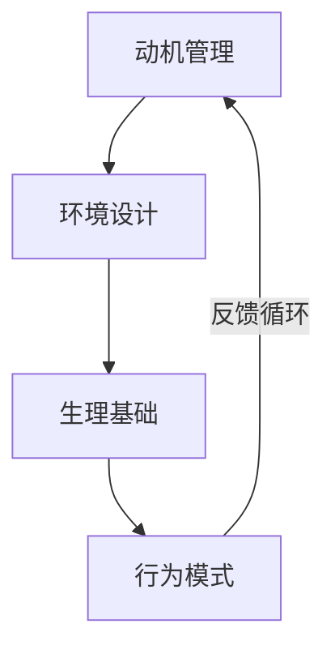

# 如何有效提升专注力

在某AI论坛上，看到一个帖子讨论如何有效提升专注力的话题，帖子下面参与讨论的回帖很多，内容挺有意思，整理了一下，分享给大家参考。

## 一、内在驱动：从动机到兴趣管理

### 1.1 动机优先原则

- **目标-动机绑定**  
  当任务与深层情感需求高度一致时，专注自然产生。
- **ADHD启示**  
  通过将普通任务转化为高刺激目标（如游戏化设计），可突破多巴胺调节障碍。

### 1.2 兴趣导向策略

- **心流触发机制**  
  构建兴趣周期：在热情峰值期完成80%核心任务。
- **项目切换系统**  
  建立3-5个兴趣池轮换，防止单一任务倦怠。

## 二、环境优化：数字极简主义

### 2.1 数字干扰阻断

```bash
# 工具组合方案
1. SocialFocus扩展：移除社交媒体成瘾设计（点赞数/推荐流）
2. Newsboat+RSS：聚合内容消费，配合mpv播放器直读视频
3. Tampermonkey脚本：将滚动操作改为按钮触发
```

### 2.2 物理空间设计

- **设备降维打击**  
  旅行时使用功能受限设备（仅基础浏览），专注效率提升300%。
- **多屏管理法则**  
  深度工作时仅保留必要屏幕，其他设备物理断电。

## 三、生理基础：生物黑客方案

### 3.1 运动激活公式

```python
# 晨间5公里跑 + 2次15分钟微运动
if 心率 < 120bpm:
    执行波比跳20次
else:
    进行动态拉伸
```

### 3.2 饮食调控系统

| 方案        | 执行要点                  | 效果周期 |
|-------------|-------------------------|--------|
| 4小时窗口    | 12:00-16:00低碳饮食       | 3周见效 |
| 咖啡因组合   | 咖啡+L-茶氨酸(200mg)      | 即时生效 |

### 3.3 睡眠革命协议

```arduino
// 数字戒断程序
void setup() {
  21:00 关闭智能设备;
  22:00 启动白噪音;
  06:00 自然光照唤醒;
}
```

## 四、行为工程：时间黑客技术

### 4.1 番茄工作法2.0

```javascript
// 动态番茄钟算法
const focusSession = (base=25) => {
  let extension = 0;
  if(专注度 > 80%) extension +=5;
  return base + extension;
}
// 每日核心指标：完成8个真番茄（非学习类）
```

### 4.2 注意力复位技巧

1. **30秒心智复位**
   分神时闭眼默数30，重建注意力阈值。
2. **场景切换协议**  
   卡顿时立即进行10分钟步行/驾驶。

### 4.3 任务优先级矩阵

```tex
\documentclass{article}
\begin{document}
\textbf{旧项目优先法则}：已完成70%的项目 > 新项目
\vspace{5mm}
\begin{tabular}{|c|c|}
\hline
\textbf{高价值} & 维护现有系统 \\ 
\hline
\textbf{低价值} & 开发新功能 \\
\hline
\end{tabular}
\end{document}
```

## 五、辅助方案：药物与工具

### 5.1 药物干预方案
>
> **ADHD特需方案**：  
> 10mg甲基苯丙胺（需处方）配合行为认知治疗。
> **风险警示**：可能导致社交关系损耗。

### 5.2 技术工具栈

```yaml
# 极简写作流配置
writing_flow:
  phase1: 
    tool: 纯文本编辑器
    rule: 禁用格式编辑直至完成3页核心内容
  phase2: 
    tool: Markdown转换器
    rule: 仅允许添加基础排版
```

## 终极启示：专注力生态系统

构建包含四大维度的动态平衡系统：



**关键悖论**：  
通过定期制造"数字真空期"（如每月72小时设备断网），反而能提升常态下200%的专注产出。正如@h45x1的旅行实验揭示：限制产生自由，匮乏催生创造。

> 最终，专注力不是对抗分心的战争，而是重建认知秩序的和平演变。
