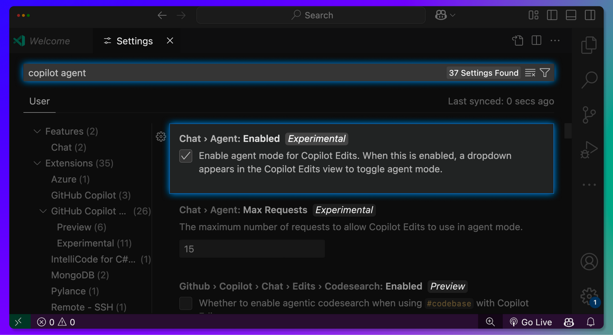
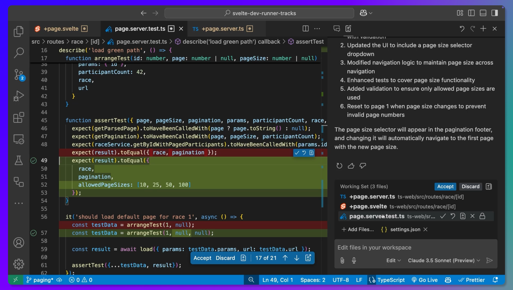

# GitHub Copilot的代理能力

## 摘要

作者：Paul Thurrott

来源：[GitHub Copilot is Getting Agentic](https://www.thurrott.com/a-i/github-copilot/316852/github-copilot-is-getting-agentic)

GitHub Copilot 可能是我使用过的最有用的 AI 助手，但它即将变得更加出色。GitHub 今天宣布，它正在为该产品带来代理能力，以及其他改进。

“今天，我们正在用更强大的代理 AI 升级 GitHub Copilot，包括在 Visual Studio Code 中的代理模式和 Copilot Edits 的全面可用性，”GitHub 的 Thomas Dohmke 写道。“我们正在为所有 Copilot 用户的模型选择器中添加 Gemini 2.0 Flash。并且我们首次展示了 Copilot 的新自主代理，代号为 Project Padawan。从代码补全、聊天和多文件编辑到工作区和代理，Copilot 将人类置于软件开发这一创造性工作的中心。AI 帮助你完成那些你不想做的事情，这样你就有更多时间去做那些你想做的事情。” 以下是新增内容。

## 代理模式 Agent mode（预览版）

GitHub Copilot 的代理模式可以自行迭代其代码以及该代码的结果，自动查找错误并修复它们。它可以建议终端命令并要求你执行它们，分析运行时错误并具备自我修复能力，还能推断出你未指定的额外任务。要访问此预览功能，你需要安装 Visual Studio Code Insiders  并启用实验性的代理模式设置。然后，模型选择器旁边会出现一个“编辑为代理”的选项。GitHub 表示，代理模式将很快扩展到其他 IDE。

## Copilot Edits

这一新功能允许你指定一组文件，然后使用自然语言向 GitHub Copilot 提出你的需求。它可以帮助你在工作区中的多个文件中进行内联更改。然后你可以审查建议的更改，接受你想要的更改，并通过后续请求进行迭代。它支持 OpenAI GPT-4o、o1 和 o3-mini；Anthropic Claude 3.5 Sonnet，以及现在新增的 Google Gemini 2.0 Flash（见下文）。Copilot Edits 已在 Visual Studio Code 中全面可用，但它现在也在 Visual Studio 2022 的预览版中可用。

## Project Padawan

GitHub 正在开发一个名为 Project Padawan 的自主软件工程师（SWE）代理，该公司表示该代理将在今年晚些时候推出。“它将允许你直接将问题分配给 GitHub Copilot，使用任何 GitHub 客户端，并让它生成经过完全测试的拉取请求，”Dohmke 说。“一旦任务完成，Copilot 将为拉取请求分配人类审查者，并努力解决他们添加的反馈。从某种意义上说，这将如同让 Copilot 作为每个 GitHub 仓库的贡献者入职……我们相信 Project Padawan 的最终结果将改变团队管理关键但繁琐任务的方式，比如修复错误或创建和维护自动化测试。”

## Google Gemini 2.0 Flash

微软已将 Gemini 2.0 Flash 模型添加到所有 Copilot 用户的模型选择器中。
