# Transformer 工作原理：深入探索Transformer架构

## 摘要

作者：Josep Ferrer

来源：[How Transformers Work: A Detailed Exploration of Transformer Architecture](https://www.datacamp.com/tutorial/how-transformers-work)

深度学习领域正在经历一场地震般的变革，这得益于 Transformer 模型的出现和快速发展。

这些开创性的架构不仅重新定义了自然语言处理（NLP）的标准，还扩展到人工智能的许多其他领域，引发了革命性的变化。

Transformer 模型以其独特的注意力机制和并行处理能力为特征，证明了在理解和生成人类语言方面的创新突破，其准确性和效率是以前无法实现的。

Transformer 架构首次出现在 2017 年 Google 的论文《Attention is all you need》中，它是像 ChatGPT 这样的开创性模型的核心，引发了 AI 社区的新一波兴奋。它们在 OpenAI 的尖端语言模型中发挥了重要作用，并在 DeepMind 的 AlphaStar 中扮演了关键角色。

在人工智能的变革时代，Transformer 模型对于有抱负的数据科学家和 NLP 实践者的重要性不言而喻。

作为最新技术进步的核心领域之一，本文旨在揭示这些模型背后的秘密。

## Transformer 是什么

Transformer 最初是为了解决序列转导问题（或神经机器翻译）而开发的，这意味着它们旨在解决任何将输入序列转换为输出序列的任务。这也是它们被称为“Transformer”的原因。

但让我们从头开始。

### Transformer 模型是什么

Transformer 模型是一种神经网络，它学习序列数据的上下文并从中生成新数据。

简单来说：

Transformer 是一种人工智能模型，通过分析大量文本数据中的模式来学习理解和生成类似人类的文本。

Transformer 是当前最先进的 NLP 模型，被认为是编码器-解码器架构的演变。然而，尽管编码器-解码器架构主要依赖循环神经网络（RNN）来提取序列信息，但 Transformer 完全没有这种循环。

那么，它们是如何做到的呢？

它们被设计为通过分析不同元素之间的关系来理解上下文和含义，并且几乎完全依赖于一种称为注意力的数学技术来实现。

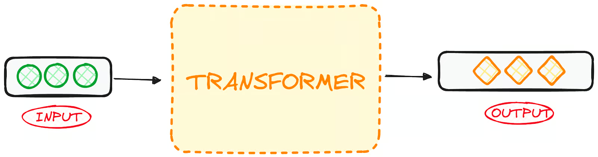

### 历史背景

Transformer 模型起源于 2017 年 Google 的一篇研究论文，是机器学习领域最近期且最具影响力的发展之一。第一个 Transformer 模型在具有影响力的论文《Attention is All You Need》中被解释。

这一开创性的概念不仅是一个理论上的进步，还找到了实际的实现，特别是在 TensorFlow 的 Tensor2Tensor 包中。此外，哈佛 NLP 小组通过提供对论文的注释指南以及 PyTorch 的实现，为这一新兴领域做出了贡献。你可以通过我们的单独教程了解更多关于从头开始实现 Transformer 的内容。

它们的出现引发了该领域的显著增长，通常被称为 Transformer AI。这一革命性的模型为大型语言模型的后续突破奠定了基础，包括 BERT。到 2018 年，这些发展已经被誉为 NLP 的分水岭时刻。

2020 年，OpenAI 的研究人员宣布了 GPT-3。在几周内，GPT-3 的多功能性迅速得到了展示，人们用它来创作诗歌、程序、歌曲、网站等，吸引了全球用户的想象力。

2021 年，斯坦福学者恰如其分地将这些创新称为基础模型，强调它们在重塑人工智能中的基础性作用。他们的工作突显了 Transformer 模型不仅彻底改变了该领域，还推动了人工智能的前沿，开启了新的可能性时代。

“我们正处于一个简单的神经网络方法为我们带来新能力爆炸的时代。”—— Ashish Vaswani，企业家兼前 Google 高级研究员

### 从 RNN 模型（如 LSTM）转向 Transformer 用于 NLP 问题

在 Transformer 模型出现时，RNN 是处理序列数据的首选方法，其输入具有特定的顺序。

RNN 的工作方式类似于前馈神经网络，但以序列方式处理输入，一次处理一个元素。

Transformer 受到了 RNN 中编码器-解码器架构的启发。然而，与使用循环不同，Transformer 模型完全基于注意力机制。

除了提升 RNN 的性能外，Transformer 还为解决许多其他任务提供了新的架构，例如文本摘要、图像描述和语音识别。

那么，RNN 的主要问题是什么？它们在 NLP 任务中效果不佳，主要有两个原因：

- 它们以序列方式处理输入数据，一次处理一个元素。这种循环过程无法利用现代图形处理单元（GPU），而 GPU 是为并行计算设计的，因此这种模型的训练速度很慢。
- 当元素彼此相距较远时，它们的效果会变差。这是因为信息在每一步传递，链越长，信息丢失的可能性就越大。

从 RNN（如 LSTM）转向 Transformer 的转变是由这两个主要问题驱动的，同时 Transformer 利用注意力机制改进解决了这些问题：

- 无论距离多远，都能关注特定的词。
- 提升性能速度。

因此，Transformer 成为 RNN 的自然改进。

接下来，让我们看看 Transformer 是如何工作的。

## Transformer 架构

### 概览

Transformer 最初是为序列转导或神经机器翻译而设计的，它在将输入序列转换为输出序列方面表现出色。它是第一个完全依赖自注意力来计算输入和输出表示的转导模型，而不使用序列对齐的 RNN 或卷积。Transformer 架构的主要特征是它们保持了编码器-解码器模型。

如果我们把一个用于语言翻译的 Transformer 当作一个简单的黑盒子，它会以一种语言的句子（例如英语）作为输入，并输出它的翻译（仍然是英语）。

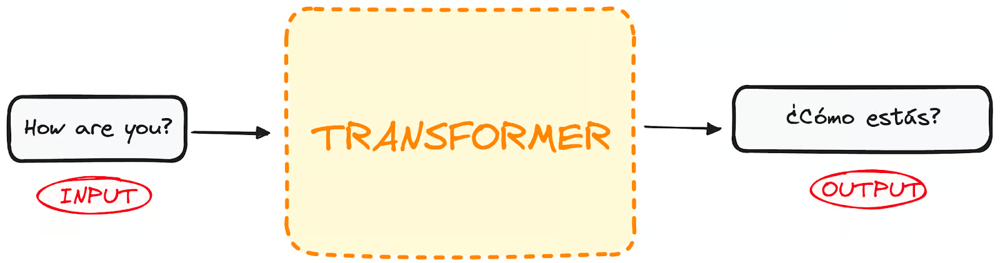

如果我们深入一点，我们会发现这个黑盒子由两个主要部分组成：

- 编码器接收我们的输入并输出该输入的矩阵表示。例如，英语句子“How are you?”
- 解码器接收编码后的表示，并逐步生成输出。在我们的例子中，翻译后的句子是“¿Cómo estás?”

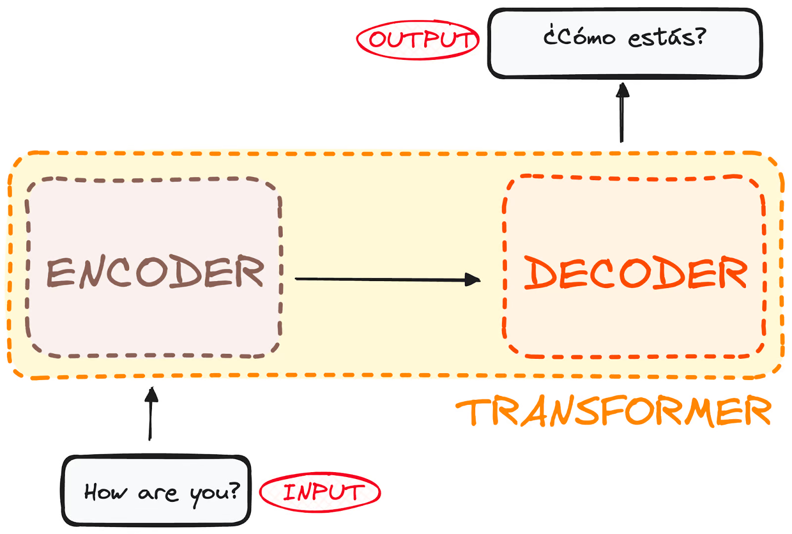

然而，编码器和解码器实际上是一个多层堆叠结构（每部分层数相同）。所有编码器的结构都相同，输入进入每一层并传递到下一层。解码器的结构也是如此，它从最后一层编码器和前一层解码器接收输入。

原始架构由 6 个编码器和 6 个解码器组成，但我们可以根据需要复制任意数量的层。假设每部分有 N 层。

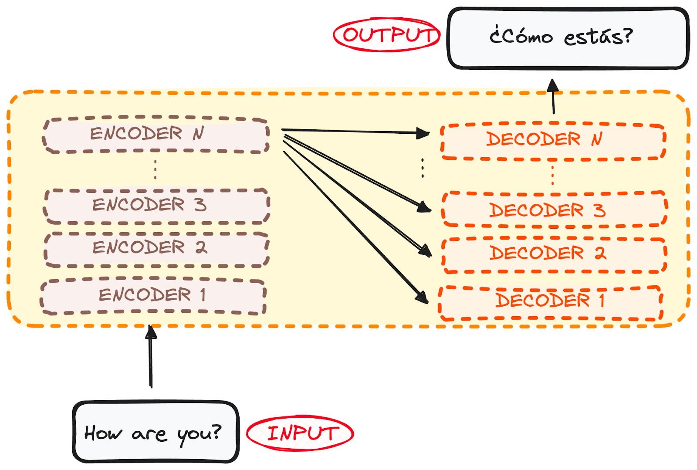

现在我们对 Transformer 的整体架构有了一个大致的了解，接下来我们将重点研究编码器和解码器的工作流程。

### 编码器工作流程

编码器是 Transformer 架构的一个基本组成部分。编码器的主要功能是将输入标记转换为上下文化的表示。与早期独立处理标记的模型不同，Transformer 编码器能够捕获每个标记相对于整个序列的上下文。

其结构组成如下：

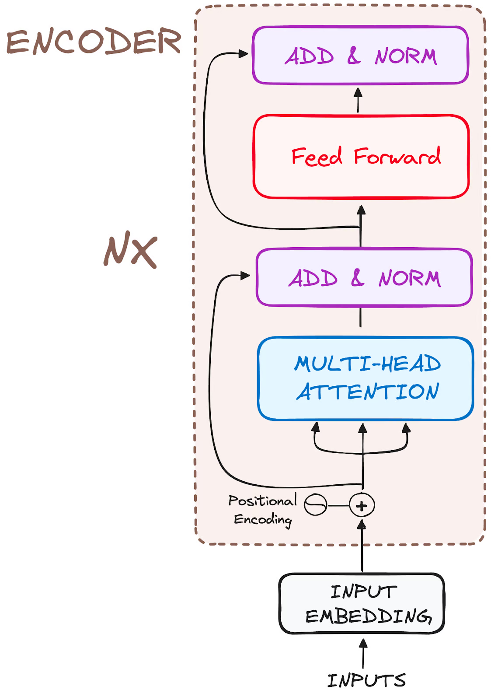

接下来，我们将编码器的工作流程分解为其最基本的步骤：

#### 第一步：输入嵌入

嵌入只发生在最底层的编码器中。编码器首先通过嵌入层将输入标记（单词或子词）转换为向量。这些嵌入捕获了标记的语义含义，并将其转换为数值向量。

所有编码器都接收一个向量列表，每个向量的大小为 512（固定大小）。在最底层编码器中，这是单词嵌入，但在其他编码器中，这是直接位于其下方的编码器的输出。

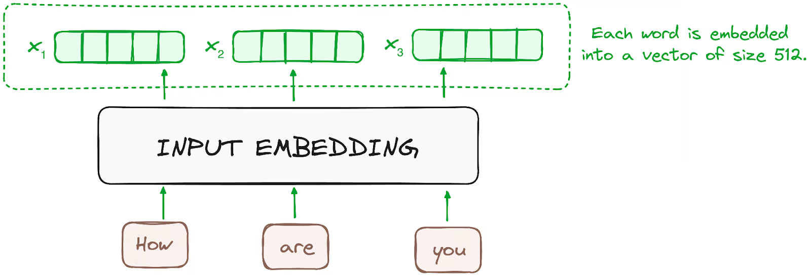

#### 第二步：位置编码（编码器）

由于 Transformer 没有像 RNN 那样的循环机制，它们通过将位置编码添加到输入嵌入中，为每个标记在序列中的位置提供信息。这使得它们能够理解句子中每个单词的位置。

为此，研究人员建议使用各种正弦和余弦函数的组合来创建位置向量，从而可以将这种位置编码器用于任意长度的句子。

在这种方法中，每个维度由波的独特频率和偏移量表示，其值范围为 -1 到 1，有效地表示每个位置。

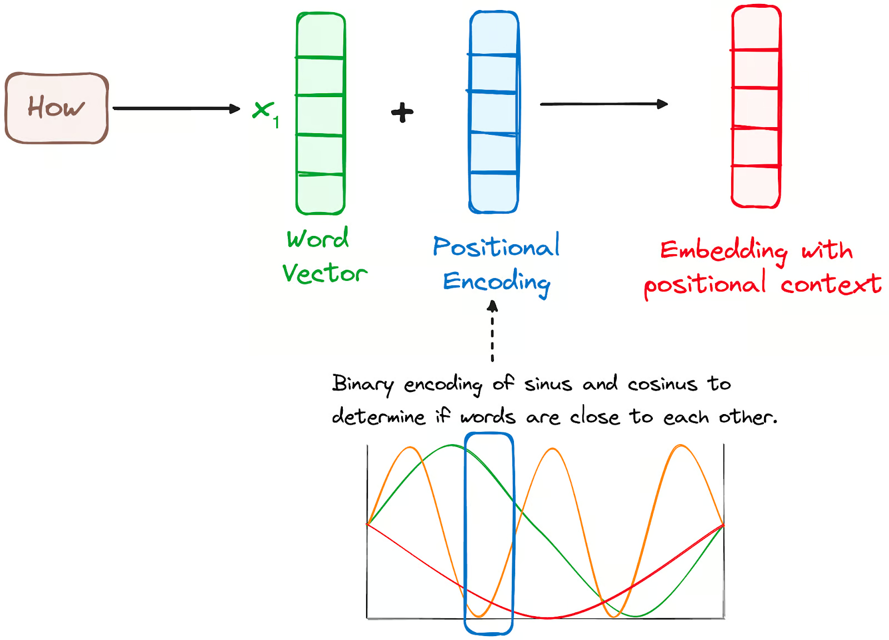

#### 第三步：编码器层堆叠

Transformer 编码器由多个相同的层组成（原始 Transformer 模型中有 6 层）。

编码器层的作用是将所有输入序列转换为一个连续的抽象表示，该表示封装了从整个序列中学习到的信息。这一层包含两个子模块：

- 多头注意力机制。
- 全连接网络。

此外，它还在每个子层周围引入了残差连接，随后进行层归一化。

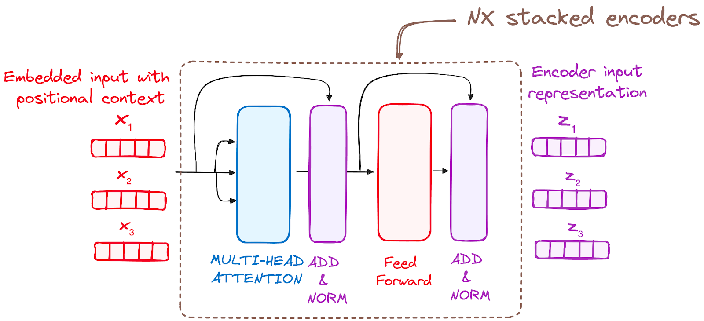

##### 第三步.1：多头自注意力机制

在编码器中，多头注意力利用了一种称为自注意力的特殊注意力机制。这种方法使模型能够将输入中的每个单词与其他单词关联起来。例如，在一个给定的例子中，模型可能会学习将单词“are”与“you”联系起来。

这种机制允许编码器在处理每个标记时关注输入序列的不同部分。它根据以下内容计算注意力分数：

- 查询（query）是注意力机制中代表输入序列中特定单词或标记的向量。
- 键（key）也是注意力机制中的一个向量，对应于输入序列中的每个单词或标记。
- 每个值（value）都与一个键相关联，并用于构建注意力层的输出。当查询和键匹配良好时（即它们的注意力分数很高），相应的值会在输出中被强调。

第一个自注意力模块使模型能够从整个序列中捕获上下文信息。而不是执行单一的注意力函数，查询、键和值会被线性投影 h 次。在这些投影版本的查询、键和值上并行执行注意力机制，产生 h 维的输出值。

详细架构如下：

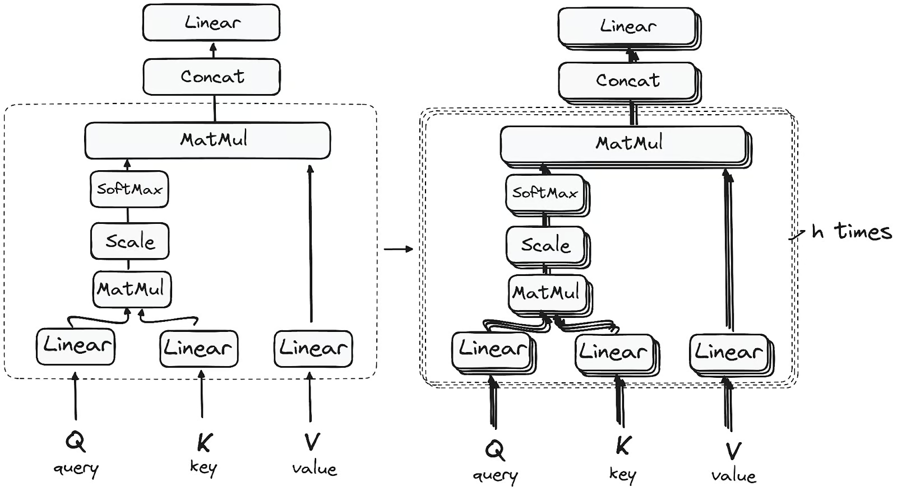

**矩阵乘法（MatMul）**：

查询、键和值向量通过线性层后，会在查询和键之间执行点积矩阵乘法，从而生成一个分数矩阵。

分数矩阵确定每个单词应对其他单词关注的程度。因此，每个单词都会根据其他单词在同一时间步中的关系被赋予一个分数。分数越高，表示关注程度越大。

这个过程有效地将查询映射到对应的键。

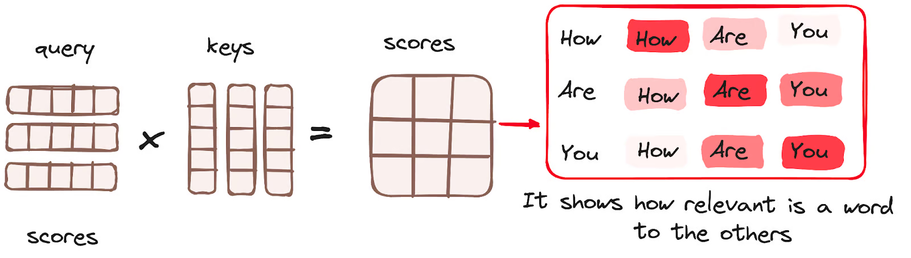

**降低注意力分数的幅度**：

然后通过将分数除以查询和键向量维度的平方根来缩小分数的幅度。这一操作是为了确保梯度更加稳定，因为值的乘法可能导致过大的影响。

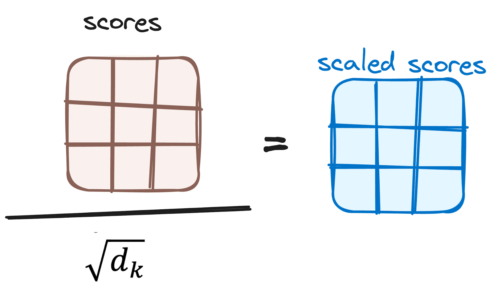

**对调整后的分数应用 Softmax**：

随后，对调整后的分数应用 Softmax 函数以获得注意力权重。这将生成范围在 0 到 1 之间的概率值。Softmax 函数强调高分值，同时降低低分值，从而增强模型有效确定哪些单词应获得更多关注的能力。

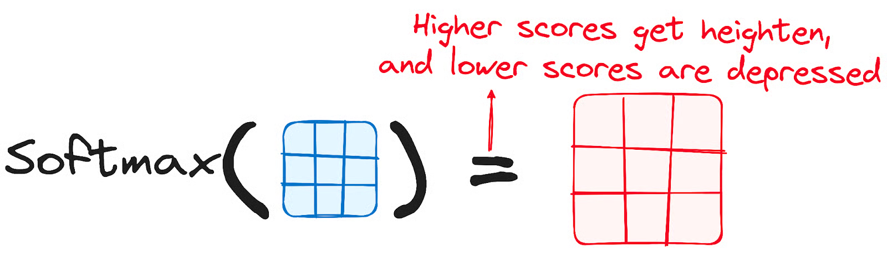

**将 Softmax 结果与值向量结合**：

注意力机制的下一步是将 Softmax 函数得出的权重与值向量相乘，从而生成输出向量。

在这个过程中，只有具有高 Softmax 分数的单词会被保留。最后，这个输出向量被送入线性层进行进一步处理。

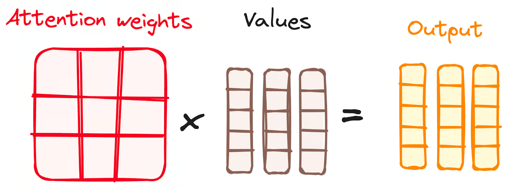

至此，我们终于得到了注意力机制的输出！

那么，你可能会好奇为什么它被称为多头注意力呢？

记住，在整个过程开始之前，我们将查询、键和值分解为 h 次。这个过程，称为自注意力，在这些较小的阶段或“头”中分别发生。每个头独立地发挥其魔力，生成一个输出向量。

这个组合通过一个最终的线性层传递，就像一个微调它们集体性能的过滤器。每个头的学习多样性在这里大放异彩，为编码器模型赋予了强大且多面的理解能力。

##### 第三步.2：归一化和残差连接

编码器层的每个子层后面都跟着一个归一化步骤。此外，每个子层的输出都会与其输入相加（残差连接），以帮助缓解梯度消失问题，从而使模型更深。在通过前馈神经网络后，也会重复这一过程。

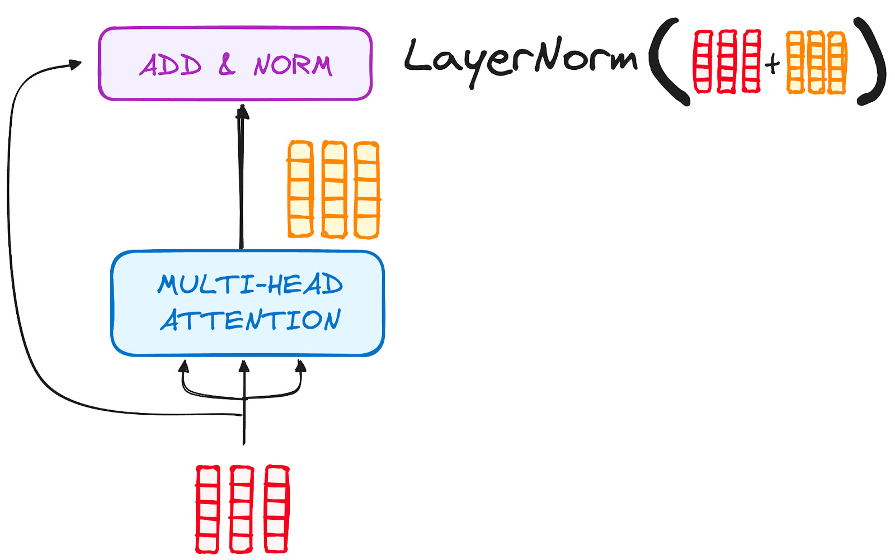

##### 第三步.3：前馈神经网络（编码器）

经过归一化的残差输出继续通过逐位置的前馈神经网络，这是进一步细化的关键阶段。

将这个网络想象成一对线性层，中间嵌入了一个 ReLU 激活函数，作为连接。经过处理后，输出会回到一个熟悉的地方：它会循环回到逐位置前馈神经网络的输入处。

这个重聚过程随后会进行另一轮归一化，确保一切调整得当，为下一步做好准备。

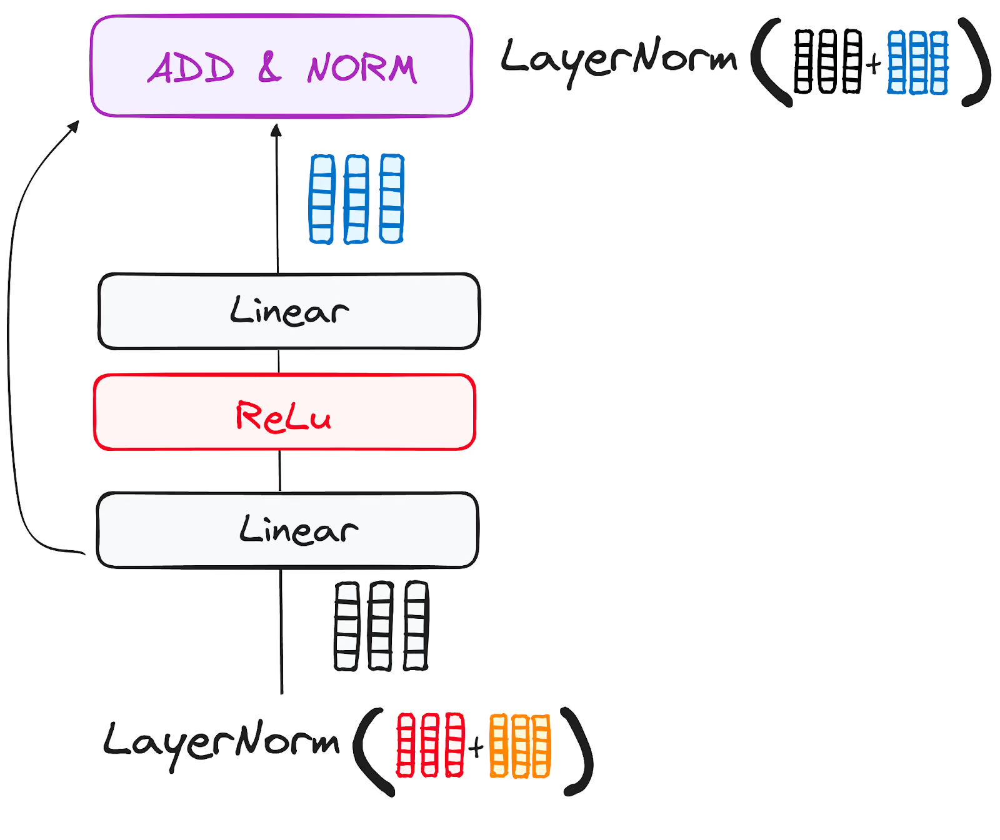

#### 第四步：编码器输出

最终编码器层的输出是一组向量，每个向量都以丰富的上下文理解来表示输入序列。这个输出随后被用作 Transformer 模型中解码器的输入。

这种精心的编码为解码器铺平了道路，引导它在解码时关注输入中的正确单词。

可以将其想象成建造一座塔，你可以堆叠 N 层编码器。在这个堆叠中的每一层都有机会探索和学习注意力的不同方面，就像知识的层次一样。这不仅丰富了理解，还可能显著增强 Transformer 网络的预测能力。

### 解码器工作流程

解码器的作用是生成文本序列。与编码器类似，解码器也配备了类似的子层。它包含两个多头注意力层、一个逐位置前馈层，并且在每个子层后面都引入了残差连接和层归一化。

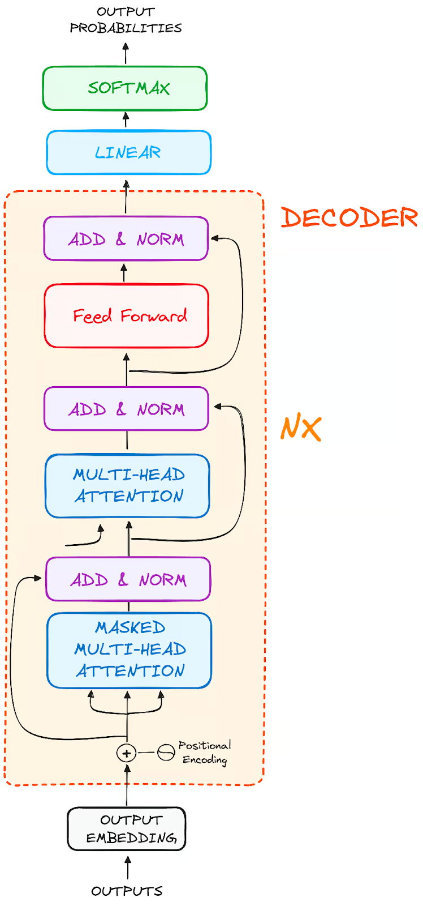

这些组件的功能与编码器层类似，但有一个转折：解码器中的每个多头注意力层都有其独特的使命。

解码器的最后一步涉及一个线性层，作为分类器，最后通过一个 Softmax 函数来计算不同单词的概率。

Transformer 解码器的结构旨在通过逐步解码编码后的信息来生成输出。

需要注意的是，解码器以自回归的方式运行，从一个起始标记开始。它巧妙地使用之前生成的输出列表作为输入，同时结合编码器的输出，这些输出富含来自初始输入的注意力信息。

这种顺序解码过程会一直持续，直到解码器达到一个关键时刻：生成一个表示输出结束的标记。

#### 第一步：输出嵌入

在解码器的起始位置，过程与编码器类似。在这里，输入首先通过一个嵌入层。

#### 第二步：位置编码（解码器）

在嵌入之后，与编码器类似，输入会通过位置编码层。这个序列旨在生成位置嵌入。

这些位置嵌入随后被送入解码器的第一个多头注意力层，其中会精确计算与解码器输入相关的注意力分数。

#### 第三步：解码器层堆叠

解码器由多个相同的层组成（原始 Transformer 模型中有 6 层）。每一层包含三个主要子组件：

##### 第三步.1：掩码自注意力机制

这与编码器中的自注意力机制类似，但有一个关键区别：它防止位置关注后续位置，这意味着序列中的每个单词都不会受到未来标记的影响。

例如，当计算单词“are”的注意力分数时，重要的是“are”不能窥视序列中后续的单词“you”。

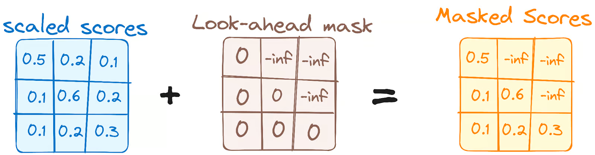

这种掩码确保了对特定位置的预测只能依赖于该位置之前已知的输出。

##### 第三步.2：编码器-解码器多头注意力或交叉注意力

在解码器的第二个多头注意力层中，我们看到了编码器和解码器组件之间的独特互动。在这里，编码器的输出同时承担查询和键的角色，而解码器第一个多头注意力层的输出则作为值。

这种设置有效地将编码器的输入与解码器对齐，使解码器能够识别并强调编码器输入中最相关的部分。

随后，第二个多头注意力层的输出通过逐位置前馈层进一步细化处理。

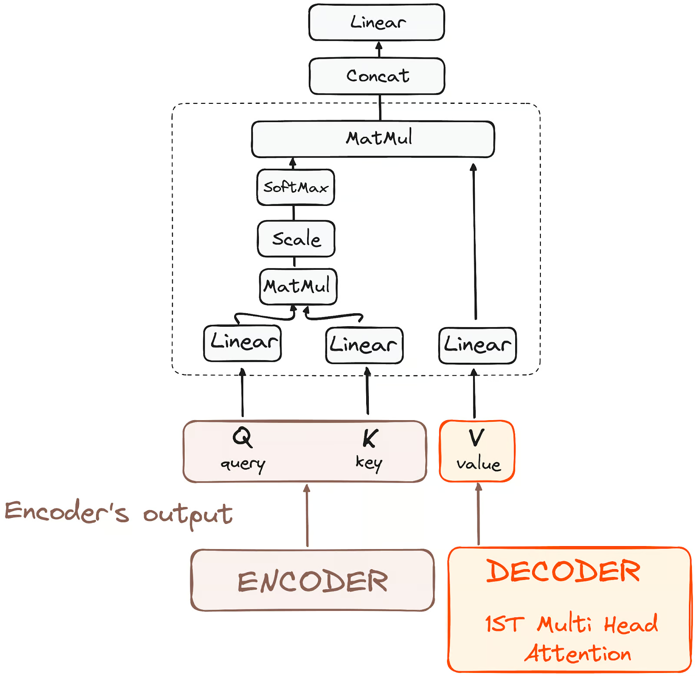

在这个子层中，查询来自前一层解码器，而键和值来自编码器的输出。这使得解码器中的每个位置都可以关注输入序列中的所有位置，有效地将编码器中的信息与解码器中的信息整合在一起。

##### 第三步.3：前馈神经网络（解码器）

与编码器类似，每个解码器层都包含一个全连接的前馈网络，该网络分别且相同地应用于每个位置。

#### 第四步：线性分类器和 Softmax 用于生成输出概率

数据在 Transformer 模型中的旅程最终通过一个线性层结束，该线性层充当分类器。

这个分类器的大小对应于涉及的总类别数（词汇表中包含的单词数量）。例如，在一个包含 1000 个不同类别（代表 1000 个不同单词）的场景中，分类器的输出将是一个包含 1000 个元素的数组。

然后将这个输出引入 Softmax 层，将其转换为一系列概率分数，每个分数的范围都在 0 到 1 之间。这些概率分数中最高的一个就是关键，其对应的索引直接指向模型预测为序列中下一个单词的单词。

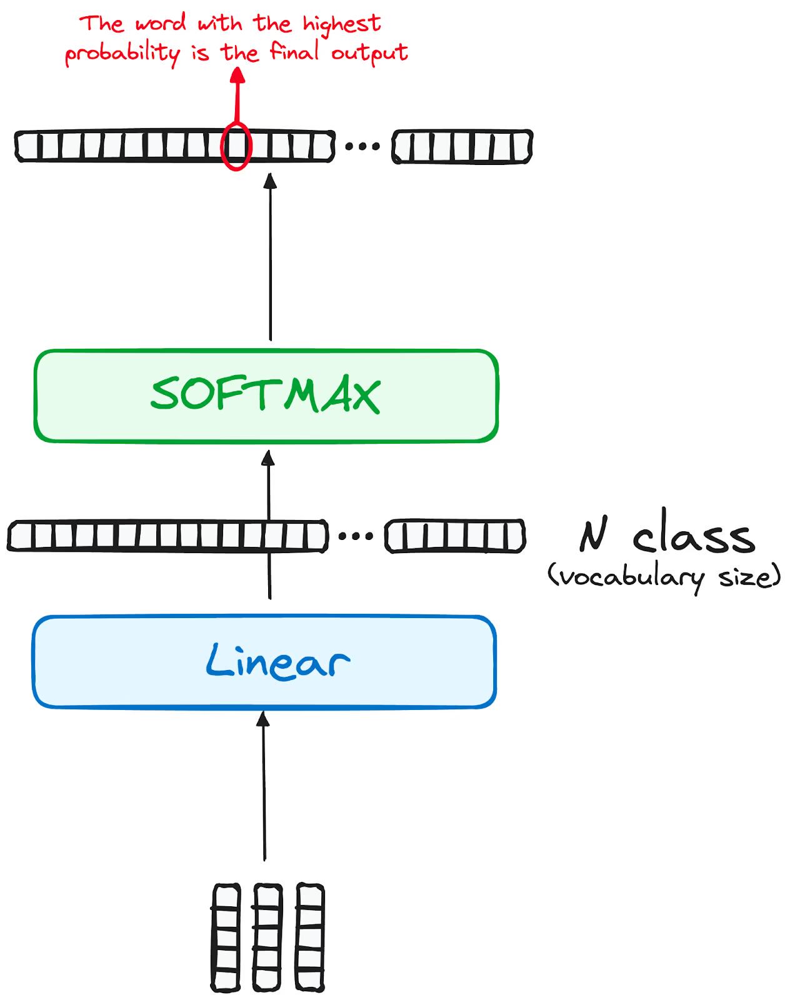

**归一化和残差连接**：

每个子层（掩码自注意力、编码器-解码器注意力、前馈网络）后面都跟着一个归一化步骤，并且每个子层周围都有一个残差连接。

**解码器输出**：

最后一层的输出被转换为预测序列，通常通过一个线性层，然后通过 Softmax 生成词汇表上的概率。

在解码器的操作流程中，将新生成的输出纳入其不断增加的输入列表中，然后继续解码过程。这个循环会一直重复，直到模型预测到一个特定的标记，表示完成。

预测概率最高的标记被分配为结束类别，通常由结束标记表示。

再次提醒，解码器不仅限于单层。它可以构建为 N 层结构，每一层都基于编码器和前一层的输入进行构建。这种多层架构允许模型多样化其关注点，并在注意力头之间提取不同的注意力模式。

这种多层方法可以显著增强模型的预测能力，因为它发展了对不同注意力组合的更细致的理解。

最终架构大致如下（来自原始论文）：

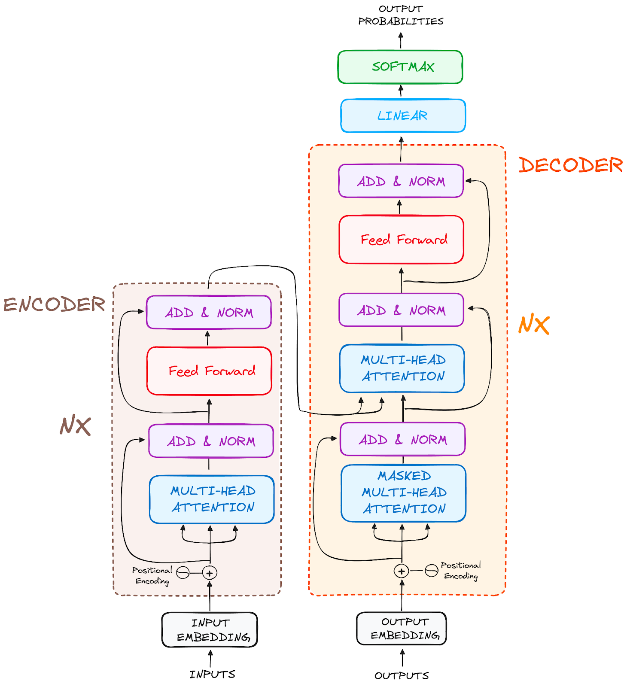

为了更好地理解这种架构，可以尝试按照这个 [使用 PyTorch 从头开始构建 Transformer 的教程](https://www.datacamp.com/tutorial/building-a-transformer-with-py-torch)来实现一个 Transformer。

## 现实中的 Transformer 模型

### BERT

2018 年，Google 推出了 BERT，这是一个开源的自然语言处理框架，它凭借独特的双向训练彻底改变了 NLP，使模型能够基于上下文对下一个单词进行更准确的预测。

通过从单词的各个方向理解上下文，BERT 在问答和理解模糊语言等任务中超越了以往的模型。其核心使用了 Transformer，动态连接每个输出和输入元素。

BERT 在维基百科上进行了预训练，在各种 NLP 任务中表现出色，促使 Google 将其整合到搜索引擎中，以实现更自然的查询。这一创新引发了开发先进语言模型的竞争，并显著提升了该领域处理复杂语言理解的能力。

如需了解更多关于 BERT 的信息，可以查看我们专门介绍 BERT 模型的文章。

### LaMDA

LaMDA（对话应用的语言模型）是 Google 开发的一种基于 Transformer 的模型，专门用于对话任务，并在 2021 年 Google I/O 大会上发布。它旨在生成更自然且上下文相关的回答，增强各种应用中的用户互动。

LaMDA 的设计使其能够理解和回应广泛的主题和用户意图，使其成为聊天机器人、虚拟助手以及其他需要动态对话的交互式 AI 系统的理想选择。

这种对对话理解和回应的专注，标志着 LaMDA 在自然语言处理和 AI 驱动的通信领域取得了重大进展。

如果您想进一步了解 LaMDA 模型，可以通过关于 LaMDA 的文章获得更好的理解。

### GPT 和 ChatGPT

由 OpenAI 开发的 GPT 和 ChatGPT 是先进的生成式模型，以其生成连贯且上下文相关的文本的能力而闻名。GPT-1 是其首个模型，于 2018 年 6 月推出，而最具影响力的 GPT-3 则在两年后的 2020 年推出。

这些模型擅长多种任务，包括内容创作、对话、语言翻译等。GPT 的架构使其能够生成与人类写作极为相似的文本，使其在创意写作、客户支持甚至编程辅助等应用中非常有用。ChatGPT 是针对对话场景优化的变体，擅长生成类似人类的对话，增强了其在聊天机器人和虚拟助手中的应用。

### 其他变体

基础模型（尤其是 Transformer 模型）的领域正在迅速扩展。一项研究识别了超过 50 个重要的 Transformer 模型，而斯坦福团队评估了其中的 30 个，承认该领域的快速发展。NLP Cloud 是 NVIDIA Inception 计划的一部分，它将大约 25 个大型语言模型商业化用于航空公司和药房等各个行业。

这些模型开源的趋势日益增加，Hugging Face 的模型中心等平台在这方面发挥了引领作用。此外，还开发了许多基于 Transformer 的模型，每个模型都针对不同的 NLP 任务进行了专门优化，展示了该模型在多样化应用中的多功能性和效率。

您可以在一篇专门介绍现有基础模型的文章中了解更多关于它们的信息，文章中会介绍它们是什么以及哪些是最常用的。

## 基准测试和性能

对 Transformer 模型在 NLP 中的性能进行基准测试和评估需要一种系统化的方法，以评估其有效性和效率。

根据任务的性质，有不同的方法和资源可以使用：

### 机器翻译任务

在处理机器翻译任务时，可以利用标准数据集，如 WMT（机器翻译研讨会），在其中 MT 系统会遇到各种语言对，每种语言对都有其独特的挑战。

BLEU、METEOR、TER 和 chrF 等指标可以作为导航工具，引导我们走向准确性和流畅性。

此外，在新闻、文学和技术文本等不同领域进行测试，可以确保 MT 系统的适应性和多功能性，使其成为数字世界的真正多语言者。

### 问答基准测试

为了评估问答模型，我们使用特殊的问答集合，如 SQuAD（斯坦福问答数据集）、自然问题或 TriviaQA。

每一个都像是一个有自己规则的不同游戏。例如，SQuAD 是关于在给定文本中寻找答案，而其他则更像是从任何地方提问的测验游戏。

为了看看这些程序的表现如何，我们使用精确率、召回率、F1 分数，有时甚至是完全匹配分数。

### 自然语言推理基准测试

在处理自然语言推理（NLI）时，我们使用特殊的语料库，如 SNLI（斯坦福自然语言推理）、MultiNLI 和 ANLI。

这些语料库就像一个语言变体和复杂案例的大图书馆，帮助我们了解计算机对不同类型句子的理解程度。我们主要检查计算机在判断陈述是否一致、矛盾或无关时的准确性。

此外，研究计算机如何处理复杂的语言问题也很重要，例如当一个词指代前面提到的内容，或者理解“不”、“所有”和“一些”等词汇。

## 与其他架构的比较

在神经网络的世界中，通常会将 Transformer 与其他两种架构进行比较。每种架构都有其独特的优势和挑战，适用于特定类型的数据处理：循环层（RNN）和卷积层（CNN）。

### 循环层

循环层是循环神经网络（RNN）的核心，擅长处理序列数据。这种架构的优势在于能够执行序列操作，这对于语言处理或时间序列分析等任务至关重要。在循环层中，前一步的输出会作为下一步的输入。这种循环机制使网络能够记住之前的信息，这对于理解序列中的上下文非常重要。

然而，正如我们之前讨论的，这种序列处理方式有两个主要问题：

- 每一步都依赖于前一步，这使得并行处理变得困难，从而导致训练时间更长。
- 它们常常难以处理长距离依赖关系，因为随着序列长度增加，梯度消失问题会导致网络学习效率降低。

Transformer 模型与使用循环层的架构有显著区别，因为它们完全摒弃了循环。正如我们之前提到的，Transformer 的注意力机制解决了这些问题，使其成为 NLP 应用中 RNN 的自然进化。

### 卷积层

另一方面，卷积层是卷积神经网络（CNN）的基本构建块，以其在处理空间数据（如图像）方面的高效性而闻名。

这些层使用滤波器（卷积核）扫描输入数据以提取特征。这些滤波器的宽度可以根据任务需求进行调整，使网络能够关注小范围或大范围的特征。

尽管卷积层在捕捉数据中的空间层次结构和模式方面表现出色，但它们在处理长距离依赖关系时面临挑战。它们本身并不考虑序列信息，因此对于需要理解序列顺序或上下文的任务不太适用。

这就是为什么 CNN 和 Transformer 适用于不同类型的数据和任务。CNN 在计算机视觉领域占据主导地位，因为它们在处理空间信息方面非常高效，而 Transformer 则因其能够理解长距离依赖关系而在复杂的序列任务（尤其是 NLP）中成为首选。

## 结论

总之，Transformer 在人工智能和自然语言处理领域取得了突破性进展。

通过其独特的自注意力机制高效处理序列数据，这些模型在性能上超越了传统的 RNN。它们能够更高效地处理长序列，并通过并行化数据处理显著加速训练过程。

谷歌的 BERT 和 OpenAI 的 GPT 系列等开创性模型展示了 Transformer 在提升搜索引擎性能和生成类似人类的文本方面的变革性影响。

因此，Transformer 已成为现代机器学习中不可或缺的一部分，推动了人工智能的边界，并为技术进步开辟了新的道路。
