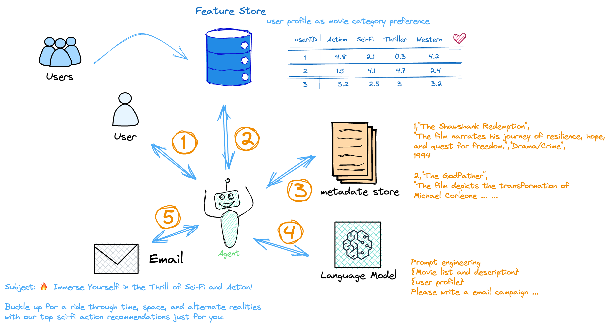

# Agent AI 简介

## 什么是 AI 智能体

人工智能（AI）智能体是一种软件程序，能够与环境交互、收集数据，并利用这些数据执行自主任务以实现预定目标。人类设定目标，但 AI 智能体独立选择实现这些目标所需的最佳行动。例如，考虑一个旨在解决客户查询的客服中心 AI 智能体。该智能体会自动向客户提出不同问题，查阅内部文档中的信息，并提供解决方案。根据客户的回应，它会判断是否可以自行解决查询，或者将其转交给人工处理。

## 定义 AI 智能体的关键原则是什么

所有软件都能根据软件开发者的设定自主完成不同的任务。那么，是什么让 AI 或智能体与众不同呢？

AI 智能体是理性智能体。它们基于感知和数据做出理性决策，以产生最佳性能和结果。AI 智能体通过物理或软件接口感知其环境。

例如，机器人智能体收集传感器数据，而聊天机器人则使用客户查询作为输入。然后，AI 智能体应用这些数据做出明智的决策。它分析收集到的数据，以预测支持预定目标的最佳结果。智能体还利用这些结果来制定下一步应采取的行动。例如，自动驾驶汽车根据多个传感器的数据在道路上避开障碍物。

## 使用 AI 智能体的好处是什么

AI 智能体可以改善您的业务运营和客户体验。

**提高生产力**：

AI 智能体是自主的智能系统，能够在没有人工干预的情况下执行特定任务。组织使用 AI 智能体来实现特定目标和更高效的业务成果。当业务团队将重复性任务委托给 AI 智能体时，他们的生产力会提高。这样，他们可以将注意力转向关键任务或创造性活动，为组织增加更多价值。

**降低成本**：

企业可以使用智能体来减少由于流程低效、人为错误和手动操作而产生的不必要成本。您可以自信地执行复杂任务，因为自主智能体遵循一个能够适应不断变化的环境的一致模型。

**明智的决策**：

先进的智能体使用机器学习（ML）来收集和处理大量实时数据。这使得业务经理在制定下一步战略时能够更快地做出更好的预测。例如，您可以在运行广告活动时使用 AI 智能体来分析不同市场细分中的产品需求。

**改善客户体验**：

客户在与企业互动时寻求个性化和引人入胜的体验。集成 AI 智能体使企业能够个性化产品推荐、提供即时响应，并通过创新提高客户参与度、转化率和忠诚度。

## AI 智能体架构的关键组成部分是什么

人工智能中的智能体可能在不同的环境中运行以实现独特的目的。然而，所有功能性智能体都共享以下组件。

**架构**：

架构是智能体运行的基础。架构可以是物理结构、软件程序或两者的组合。例如，机器人 AI 智能体由执行器、传感器、电机和机械臂组成。同时，托管 AI 软件智能体的架构可能使用文本提示、API 和数据库来实现自主操作。

**智能体功能**：

智能体功能描述了如何将收集到的数据转化为支持智能体目标的行动。在设计智能体功能时，开发人员会考虑信息的类型、AI 能力、知识库、反馈机制和其他所需的技术。

**智能体程序**：

智能体程序是智能体功能的实现。它涉及在指定架构上开发、训练和部署 AI 智能体。智能体程序将智能体的业务逻辑、技术要求和性能元素对齐。

## AI 智能体如何工作

AI 智能体通过简化和自动化复杂任务来工作。大多数自主智能体在执行分配的任务时遵循特定的工作流程。

**确定目标**：

AI 智能体从用户那里接收特定的指令或目标。它利用该目标来规划使最终结果对用户相关且有用的任务。然后，智能体将目标分解为多个较小的可操作任务。为了实现目标，智能体根据特定的顺序或条件执行这些任务。

**获取信息**：

AI 智能体需要信息来成功执行其计划的任务。例如，智能体必须提取对话日志以分析客户情绪。因此，AI 智能体可能会访问互联网以搜索和检索所需的信息。在某些应用中，智能体可以与其他智能体或机器学习模型交互以访问或交换信息。

**执行任务**：

在获得足够的数据后，AI 智能体有条不紊地执行手头的任务。一旦完成一个任务，智能体会将其从列表中移除并继续下一个任务。在任务完成之间，智能体通过寻求外部反馈和检查自身日志来评估是否已达到指定目标。在此过程中，智能体可能会创建并执行更多任务以达到最终结果。

## 使用 AI 智能体的挑战是什么

AI 智能体是有助于自动化业务工作流程以实现更好结果的软件技术。话虽如此，组织在部署自主 AI 智能体用于业务用例时应解决以下问题。

**数据隐私问题**：

开发和操作先进的 AI 智能体需要获取、存储和传输大量数据。组织应了解数据隐私要求，并采取必要措施提高数据安全态势。

**伦理挑战**：

在某些情况下，深度学习模型可能会产生不公平、偏见或不准确的结果。应用保障措施（如人工审查）可确保客户从部署的智能体中获得有用且公平的响应。

**技术复杂性**：

实施先进的 AI 智能体需要机器学习的专业经验和知识。开发人员必须能够将机器学习库与软件应用程序集成，并使用企业特定数据训练智能体。

**有限的计算资源**：

训练和部署深度学习 AI 智能体需要大量的计算资源。当组织在本地实施这些智能体时，他们必须投资并维护成本高昂且不易扩展的基础设施。

## AI 智能体的类型有哪些

组织创建和部署不同类型的智能体。我们在下面分享一些示例。

**简单反射智能体**：

简单反射智能体严格基于预定义的规则和即时数据运行。它不会对超出给定事件条件操作规则的情况做出响应。因此，这些智能体适用于不需要大量培训的简单任务。例如，您可以使用简单反射智能体通过检测用户对话中的特定关键字来重置密码。

**基于模型的反射智能体**：

基于模型的智能体与简单反射智能体类似，只是前者具有更高级的决策机制。基于模型的智能体不仅仅是遵循特定规则，而是在做出决策之前评估可能的结果和后果。它使用支持数据构建其所感知世界的内部模型，并利用该模型来支持其决策。

**基于目标的智能体**：

基于目标的智能体或基于规则的智能体是具有更强大推理能力的 AI 智能体。除了评估环境数据外，智能体还会比较不同的方法以帮助其实现期望的结果。基于目标的智能体总是选择最有效的路径。它们适用于执行复杂任务，例如自然语言处理（NLP）和机器人应用。

**基于效用的智能体**：

基于效用的智能体使用复杂的推理算法来帮助用户最大化他们期望的结果。智能体比较不同的场景及其各自的效用值或收益。然后，它选择为用户提供最多奖励的方案。例如，客户可以使用基于效用的智能体来搜索旅行时间最短的机票，而不考虑价格。

**学习型智能体**：

学习型智能体不断从以往的经验中学习以改进其结果。通过感官输入和反馈机制，智能体随着时间的推移调整其学习元素以满足特定标准。此外，它还使用问题生成器设计新任务，以从收集的数据和过去的结果中进行自我训练。

**分层智能体**：

分层智能体是按层级排列的智能体组织。高级智能体将复杂任务分解为较小的任务，并将其分配给低级智能体。每个智能体独立运行，并向其监督智能体提交进度报告。高级智能体收集结果并协调下属智能体，以确保它们共同实现目标。

## Agent AI 的应用场景

Agent AI 广泛应用于以下领域：

- 自动驾驶：感知环境、规划路径、控制车辆。
- 机器人：工业机器人、服务机器人。
- 虚拟助手：如 Siri、Alexa，能够理解用户指令并执行任务。
- 游戏 AI：控制非玩家角色（NPC），提供智能对手。
- 智能制造：自动化生产线中的智能体协作。

技术挑战

- 环境复杂性：真实环境通常具有高度动态性和不确定性。
- 实时性要求：某些任务（如自动驾驶）需要快速决策。
- 可解释性：如何让 Agent 的决策过程透明且可解释。
- 多模态感知：如何整合视觉、语音、传感器等多种数据源。
- 长期记忆与上下文管理：如何在长时间任务中保持一致性。

## 软件开发中的智能代理人工智能

智能代理人工智能（Agent AI）或智能代理正越来越多地被集成到软件开发流程中，以提高效率、自动化任务和改善决策制定。这些由人工智能驱动的系统能够自主执行特定任务，与开发环境交互，并在软件开发生命周期（SDLC）的各个阶段为开发人员提供帮助。以下是关于智能代理在软件开发中的应用、优势、挑战以及用例示例的概述。

### 1. 智能代理在软件开发中的角色

智能代理可以在软件开发生命周期的多个阶段中应用，包括规划、编码、测试、部署和维护。以下是其具体贡献：

#### （1）规划和需求收集

**自动化需求分析**：智能代理可以分析自然语言需求文档，提取关键功能，并生成结构化规范。

**预测性规划**：AI代理可以根据历史数据和项目参数预测项目时间线、资源需求和潜在风险。

#### （2）代码开发

**代码生成**：AI代理可以根据高级描述或模板生成代码片段甚至整个模块。例如，GitHub Copilot利用AI协助开发人员编写代码。

**代码优化**：代理可以分析现有代码，并针对性能、可读性或安全性提出优化建议。

**漏洞检测**：AI代理可以在开发阶段识别代码中的潜在漏洞或安全问题。

#### （3）测试

**自动化测试用例生成**：AI代理可以根据代码分析和需求生成测试用例。

**智能测试执行**：代理可以自主执行测试用例，分析结果并报告缺陷。

**回归测试**：AI代理可以识别受代码变更影响的区域，并优先进行回归测试。

#### （4）部署

**持续集成/持续部署（CI/CD）**：AI代理可以自动化CI/CD流程，确保部署顺利且无错误。

**环境配置**：代理可以根据应用需求动态配置部署环境。

#### （5）维护和监控

**主动问题检测**：AI代理可以实时监控应用，检测异常并提醒开发人员或自动解决问题。

**根本原因分析**：代理可以分析日志和性能数据，识别故障或性能瓶颈的根本原因。

**自愈系统（Self-Healing Systems）**：在某些情况下，AI代理可以自动应用修复或回滚变更，无需人工干预即可解决问题。

### 2. 智能代理在软件开发中的优势

**提高生产力**：通过自动化重复性任务（如代码生成、测试），开发人员可以专注于软件开发中更复杂和更具创造性的方面。

**加快开发周期**：AI代理可以通过自动化代码审查、测试和部署等任务加速开发。

**提高代码质量**：AI代理可以在开发早期检测漏洞、漏洞和低效代码，从而提高软件质量。

**降低成本**：通过自动化任务并减少人工工作量，AI代理可以降低开发成本。

**增强决策制定**：AI代理可以提供数据驱动的洞察和建议，帮助团队在开发过程中做出更好的决策。

### 3. 使用智能代理在软件开发中的挑战

尽管智能代理带来了显著的优势，但也存在一些需要考虑的挑战：

- 复杂集成：将AI代理集成到现有的开发流程和工具中可能面临技术挑战。
- 数据依赖：AI代理依赖高质量的数据进行训练和决策。数据质量差可能导致结果不准确。
- 伦理问题：如果未进行适当监控，AI生成的代码或决策可能会引入偏见或伦理问题。
- 技能差距：开发人员可能需要掌握新技能，以便有效使用AI代理并解释其输出。
- 安全风险：如果未进行适当保护，与代码和系统交互的AI代理可能会引入漏洞。

### 4. 智能代理在软件开发中的应用示例

以下是智能代理在软件开发中的一些实际应用：

#### （1）GitHub Copilot

GitHub Copilot是一个由AI驱动的代码助手，可以根据自然语言描述或现有代码建议代码片段、函数甚至整个模块。
它使用OpenAI的Codex模型来理解上下文并生成相关代码。

#### （2）自动化测试工具

Testim和Applitools等工具利用AI自动化测试用例的创建、执行和分析。
这些工具可以根据应用的变化进行调整，减少手动测试维护的需求。

#### （3）CI/CD自动化

AI代理被用于CI/CD流程中，以自动化构建、测试和部署过程。
例如，Jenkins可以通过AI插件进行增强，以优化流程性能并提前检测故障。

#### （4）漏洞检测和代码审查

DeepCode和SonarQube等工具利用AI分析代码中的漏洞、安全问题和代码异味。
这些工具提供可操作的建议，以提高代码质量。

#### （5）自愈系统

在云原生环境中，AI代理（如AWS Lambda或Kubernetes操作员）可以自动检测并解决问题，例如扩展资源或重启失败的服务。

### 5. 未来趋势

**AI驱动的低代码/无代码平台**：AI代理将在低代码/无代码平台中发挥更大作用，使非开发人员能够创建应用程序。

**协作式AI代理**：多个AI代理将协同工作，处理复杂的开发任务，例如设计架构或优化工作流程。

**可解释的AI用于开发**：随着AI代理更多地参与决策，其行为和建议的透明性和可解释性将成为重点。

**AI在DevOps中的应用（AIOps）**：AI代理将进一步融入DevOps实践，实现更智能的监控、事件管理和资源优化。
