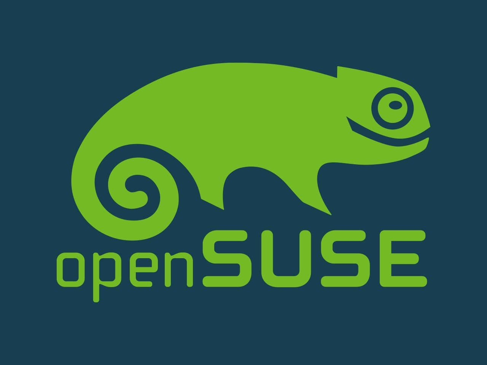
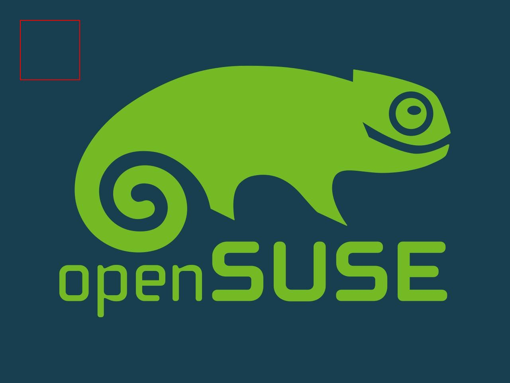
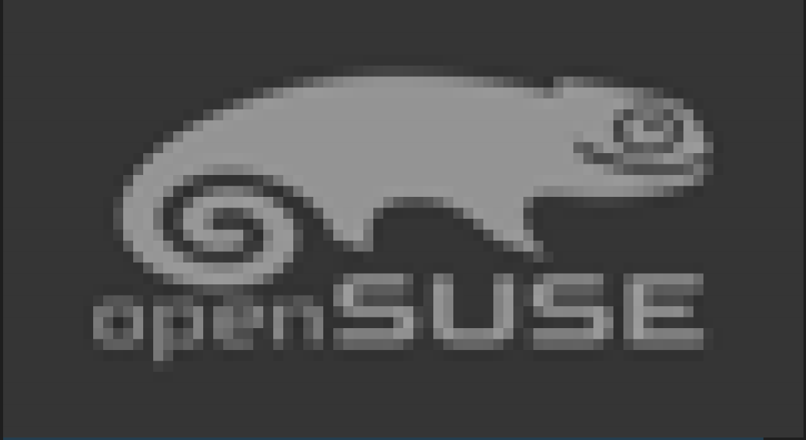
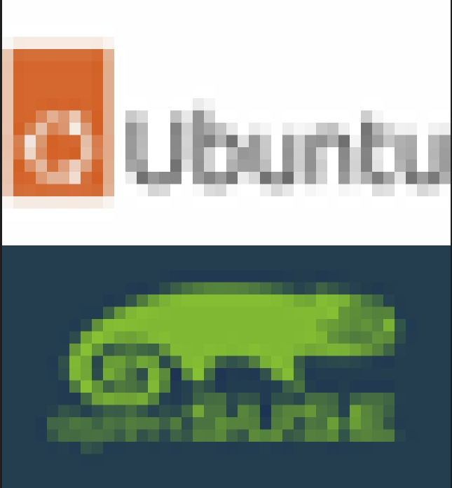
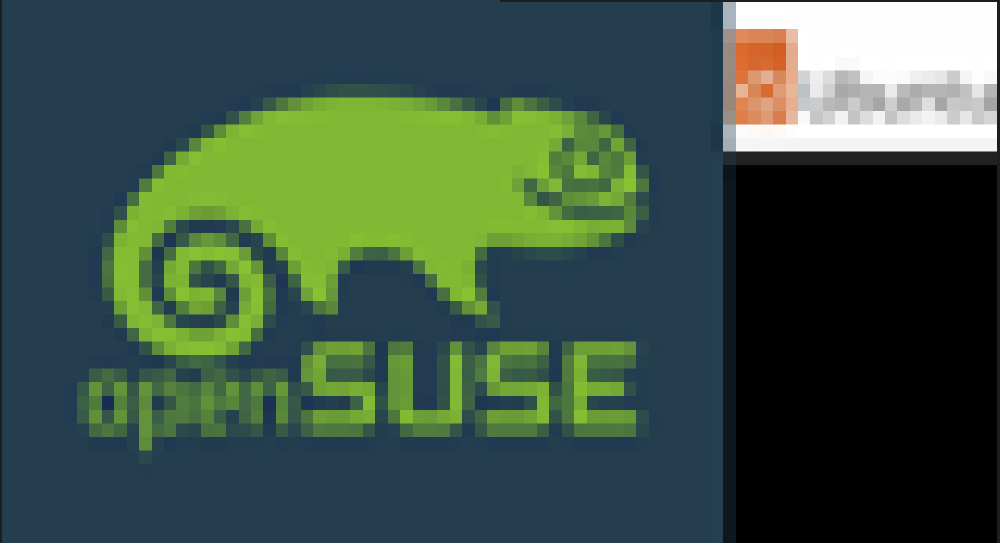
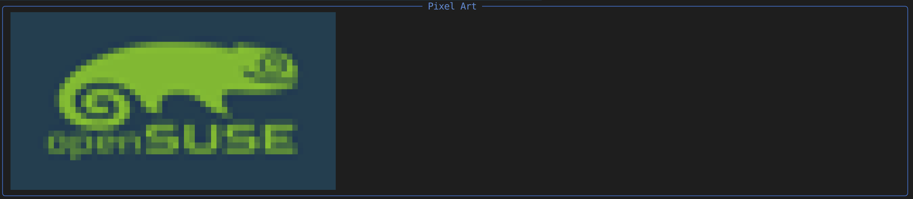

# 在终端中显示和处理图像

## 设置虚拟环境

创建 Python 虚拟环境：

```bash
python3 -m venv .envUti
source .envUti/bin/activate
```

运行以下命令初始化一些常用包：

```bash
pip install sqlite-utils
pip install pandas
pip install numpy
pip install matplotlib
pip install scikit-learn
```

## 使用 Pillow 在终端中处理图像

安装软件包。

```bash
pip install Pillow
```

图像的坐标系是一个二维平面，左上角为原点 (0, 0)。向右是 x 轴（宽度方向）的正方向。向下是 y 轴（高度方向）的正方向。

关于 `image.crop((left, top, right, bottom))`：

- `left`：裁剪区域左边界 的 x 坐标。
- `top`：裁剪区域上边界 的 y 坐标。
- `right`：裁剪区域右边界 的 x 坐标。
- `bottom`：裁剪区域下边界 的 y 坐标。

```python
from PIL import Image, ImageFilter, ImageEnhance, ImageDraw

image_file = "./assets/opensuse-logo.jpg"

## 打开并处理图像文件
with Image.open(image_file) as image:
    # 显示图像的像素尺寸
    width, height = image.size  # 返回一个元组（宽度，高度）
    print(width, height)

    # 显示图像格式
    print(image.mode)

    # 显示原始图像
    image.show()

    # 显示调整大小后的图像
    new_width, new_height = 200, 200  # 以像素为单位
    resized_img = image.resize((new_width, new_height))
    resized_img.show()

    # 显示裁剪后的图像
    left, top, right, bottom = 100, 100, 400, 400  # 以像素为单位
    cropped_img = image.crop((left, top, right, bottom))
    cropped_img.show()

    # 显示旋转后的图像
    angle = 45  # 以度为单位
    rotated_img = image.rotate(angle, expand=True)
    rotated_img.show()

    # 显示模糊图像
    blurred_img = image.filter(ImageFilter.BLUR)
    blurred_img.show()
    # 显示锐化图像
    sharpened_img = image.filter(ImageFilter.SHARPEN)
    sharpened_img.show()

    # 增加亮度
    enhancer = ImageEnhance.Brightness(image)
    brighter_img = enhancer.enhance(1.5)  
    brighter_img.show()

    # 在现有图像上添加矩形
    draw = ImageDraw.Draw(image)
    draw.rectangle((50, 50, 200, 200), outline="red", width=2)
    image.show()
    image.save("./assets/opensuse-logo_updated.jpg")
```

`opensuse-logo.jpg`图片如下：



上面代码中执行`rotated_img = image.rotate(angle, expand=True)`旋转后的图像如下：


上面代码中执行`draw.rectangle((50, 50, 200, 200), outline="red", width=2)`在现有图像上添加矩形后的图像如下：



注：在当前运行的Ubuntu 24.04系统环境下，上面的图片都是在默认浏览器中打开的。

## 使用 Rich Pixels 在终端中处理图像

[Rich Pixels](http://github.com/darrenburns/rich-pixels) 的 Python 包允许我们在终端中创建和显示图像，它来自 [Textual](https://textual.textualize.io/  ) 项目。

使用 Python 的 `pip` 实用程序安装 Rich Pixels。

```bash
python -m pip install rich-pixels
pip install prompt_toolkit
```

Rich Pixels 可以让我们在终端中显示现有的图像。图像的分辨率越高，输出效果越好。但是，如果图像的像素太多，可能无法在终端中完全显示，大部分图像会绘制到屏幕之外。

下面的示例 Python 代码利用 `rich` 库和 `Pillow` 通过将图像渲染为像素艺术、应用效果和创建动画来创建引人注目的终端输出。

使用的库：

- `rich`：提供在终端中渲染富文本、实时更新和样式元素的工具。使用的模块：`Console`、`Live`、`Group`、`Panel`。
- `Pillow`：一个 Python 图像处理库。用于调整图像大小、过滤和组合图像。

```python
from rich_pixels import Pixels
from rich.console import Console
from rich.live import Live
from rich.console import Group
from rich.panel import Panel
from PIL import Image, ImageFilter
import time


console = Console()

# 要使用的图像文件路径
image_file = "./assets/opensuse-logo.jpg"
image_file2 = "./assets/ubuntu-logo.jpeg"

# 在终端中显示图像的像素化版本
# 调整图像大小以控制像素化效果
image = Image.open(image_file)
image = image.resize((80, 40))  # 将图像调整为 80x40 像素
pixels = Pixels.from_image(image)  # 将图像转换为像素化格式
console.print(pixels)  # 将像素化图像打印到终端

# 将图像转换为灰度并在终端中显示
image = Image.open(image_file).convert("L").resize((80, 40))  # 转换为灰度并调整大小
pixels = Pixels.from_image(image)  # 将灰度图像转换为像素化格式
console.print(pixels)  # 打印灰度像素化图像

# 使用 Rich 的 Live 功能动态更新终端显示
image = Image.open(image_file)

with Live(console=console, refresh_per_second=4) as live:
    for _ in range(10):
        # 动态调整图像大小以创建缩放效果
        width = 40 + _ * 4
        height = 20 + _ * 2
        resized_image = image.resize((width, height))  # 调整图像大小
        pixels = Pixels.from_image(resized_image)  # 转换为像素化格式
        live.update(pixels)  # 更新终端显示
        time.sleep(0.5)  # 在更新之间暂停 0.5 秒

# 在终端中显示多张图像并组合它们
image1 = Image.open(image_file)
image2 = Image.open(image_file2)

# 将两张图像转换为相同大小的像素化格式
pixels1 = Pixels.from_image(image1.resize((40, 20)))
pixels2 = Pixels.from_image(image2.resize((40, 20)))

# 使用 Rich 的 Group 容器垂直组合图像
combined = Group(pixels2, pixels1)  # 将两张像素化图像分组
console.print(combined)  # 打印组合图像

# 使用 Pillow 水平组合图像并显示
combined_image = Image.new("RGB", (image1.width + image2.width, image1.height))  # 创建一个新空白图像
combined_image.paste(image1, (0, 0))  # 将第一张图像粘贴在左侧
combined_image.paste(image2, (image1.width, 0))  # 将第二张图像粘贴在右侧
pixels = Pixels.from_image(combined_image.resize((80, 40)))  # 将组合图像转换为像素化格式
console.print(pixels)  # 打印组合像素化图像

# 应用模糊滤镜到图像并显示
image = Image.open(image_file)
blurred_image = image.filter(ImageFilter.BLUR)  # 使用 Pillow 应用模糊滤镜
pixels = Pixels.from_image(blurred_image.resize((100, 100)))  # 调整大小并转换为像素化格式
console.print(pixels)  # 打印模糊像素化图像

# 将像素化图像与 Rich 元素组合以增强终端输出
image = Image.open(image_file)
pixels = Pixels.from_image(image.resize((60, 30)))  # 调整大小并转换为像素化格式
panel = Panel(pixels, title="Pixels Art", border_style="blue")  # 将像素化图像放置在 Rich Panel 中
console.print(panel)  # 打印包含像素化图像的面板

# 通过循环显示不同帧的图像创建简单动画效果
image_files = [image_file, image_file2]  # 要动画化的图像文件列表

with Live(console=console, refresh_per_second=10) as live:
    time_count = 5  # 动画循环的总次数
    while time_count:
        for image_file in image_files:
            image = Image.open(image_file)
            image = image.resize((80, 40))  # 为动画调整图像大小
            pixels = Pixels.from_image(image)  # 转换为像素化格式
            live.update(pixels)  # 用当前帧更新终端显示
            time.sleep(0.5)  # 在帧之间暂停 0.5 秒
        time_count -= 1  # 减少动画循环计数
```

`opensuse-logo.jpg` 图片沿用上例。`ubuntu-logo.jpeg` 图片内容如下：


下面详细说明上面示例代码中涉及的功能。

1.**像素化图像渲染**

- 描述：将图像转换为像素化格式并在终端中显示。
- 实现：

```python
image = Image.open(image_file)
image = image.resize((80, 40))  # 将图像调整为 80x40 像素
pixels = Pixels.from_image(image)  # 将图像转换为像素化格式
console.print(pixels)  # 将像素化图像打印到终端
```

- 图片展现：


2.**灰度像素化图像**

- 描述**：将图像转换为灰度，调整大小。
- 实现**：

```python
image = Image.open(image_file).convert("L").resize((80, 40))  # 转换为灰度并调整大小
pixels = Pixels.from_image(image)
console.print(pixels)
```

- 图片展现：



3.动态缩放效果

- 描述：使用 rich.live 动态调整图像大小，以在终端中创建动态缩放的效果。
- 实现：

```python
with Live(console=console, refresh_per_second=4) as live:
    for _ in range(10):
        width = 40 + _ * 4
        height = 20 + _ * 2
        resized_image = image.resize((width, height))
        pixels = Pixels.from_image(resized_image)
        live.update(pixels)
        time.sleep(0.5)
```

- 图片展现：图片会从40x20开始动态增大，调整10次。

4.垂直图像组合

- 描述：垂直组合两张图像。
- 实现：

```python
pixels1 = Pixels.from_image(image1.resize((40, 20)))
pixels2 = Pixels.from_image(image2.resize((40, 20)))
combined = Group(pixels2, pixels1)
console.print(combined)
```

- 图片展现：



5.水平图像组合

- 描述：使用 Pillow 水平组合两张不同像素的图像。
- 实现：

```python
combined_image = Image.new("RGB", (image1.width + image2.width, image1.height))
combined_image.paste(image1, (0, 0))
combined_image.paste(image2, (image1.width, 0))
pixels = Pixels.from_image(combined_image.resize((80, 40)))
console.print(pixels)
```

- 图片展现：



6.模糊图像效果

- 描述：应用模糊滤镜并拉伸图像。
- 实现：

```python
blurred_image = image.filter(ImageFilter.BLUR)
pixels = Pixels.from_image(blurred_image.resize((100, 100)))
console.print(pixels)
```

- 图片展现：


7.带有 Rich 面板的图像

- 描述：将像素化图像嵌入到带样式的 rich.panel.Panel 中，以增强终端输出。
- 实现：

```python
pixels = Pixels.from_image(image.resize((60, 30)))
panel = Panel(pixels, title="Pixels Art", border_style="blue")
console.print(panel)
```

- 图片展现：



8.图像动画

- 描述：通过循环显示多张图像并将其显示为像素艺术来创建简单动画。
- 目的：通过在终端中动画化图像来增加交互性。
- 实现：

```python
with Live(console=console, refresh_per_second=10) as live:
    time_count = 5
    while time_count:
        for image_file in image_files:
            image = Image.open(image_file).resize((80, 40))
            pixels = Pixels.from_image(image)
            live.update(pixels)
            time.sleep(0.5)
        time_count -= 1
```

- 图片展现：`opensuse-logo.jpg` 和 `ubuntu-logo.jpeg` 两张图片交替显示10次。
