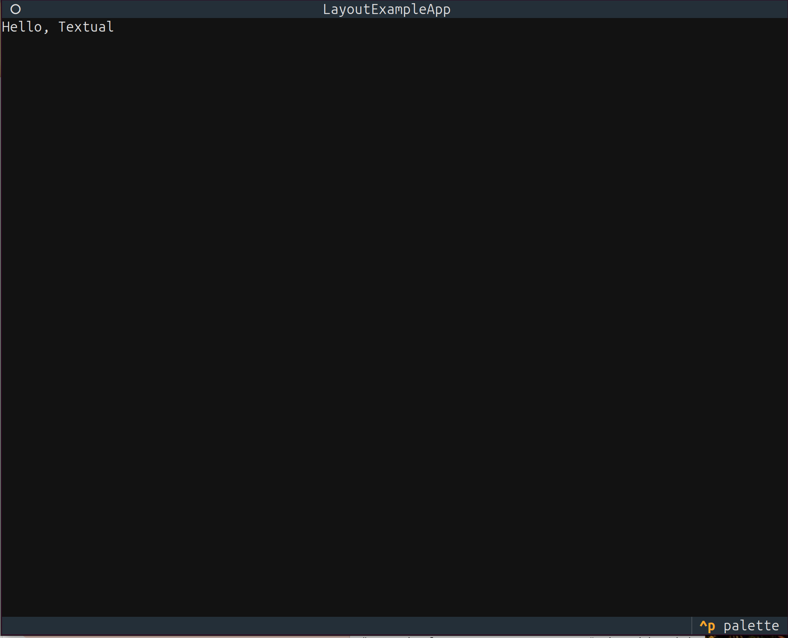
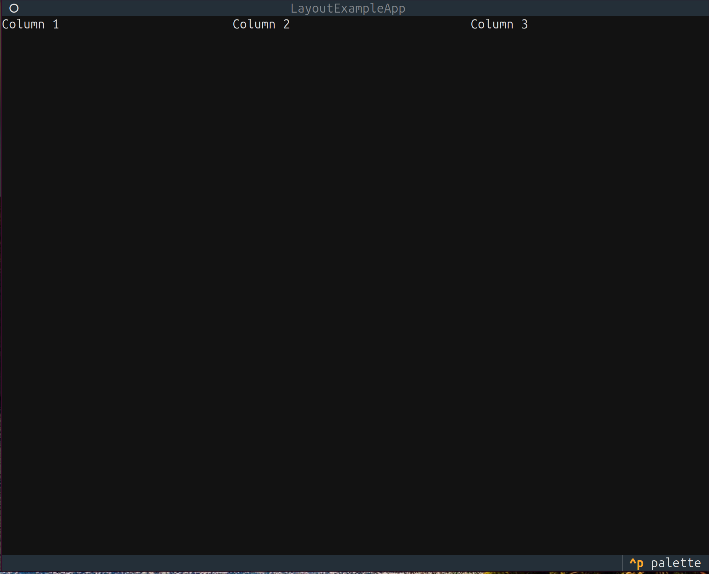
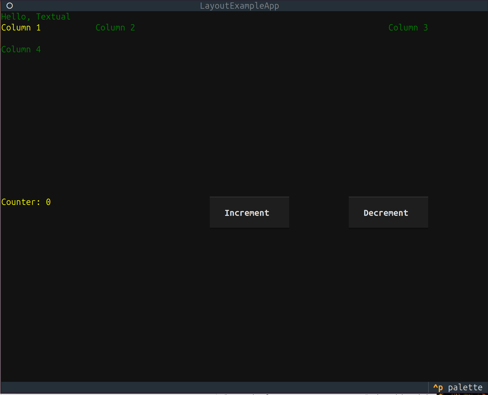
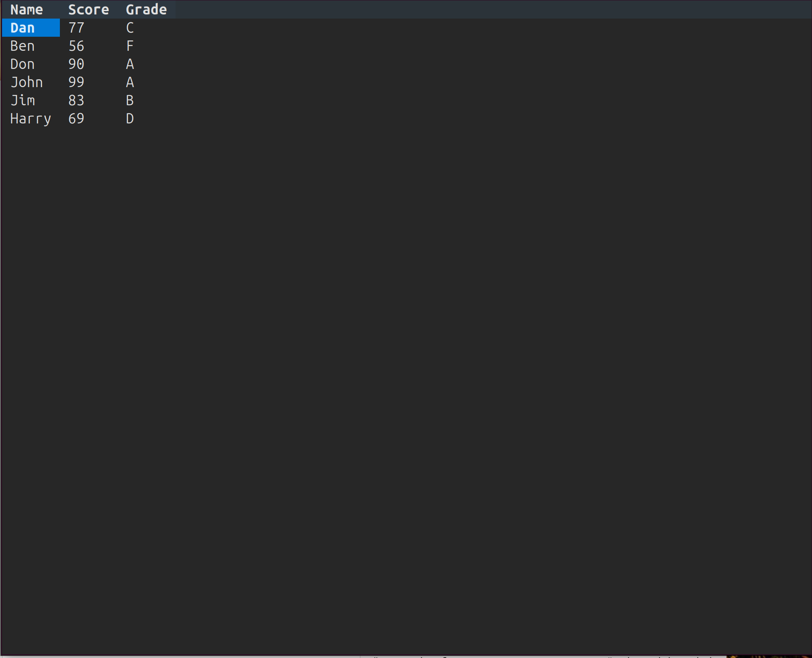
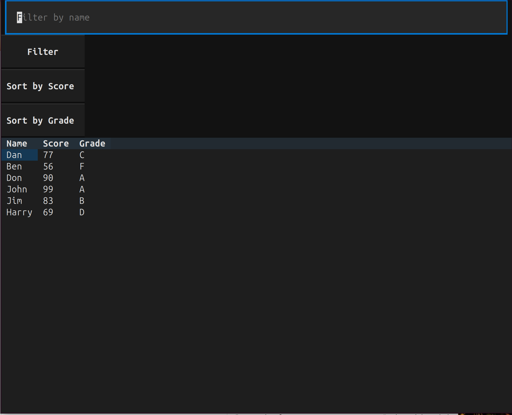
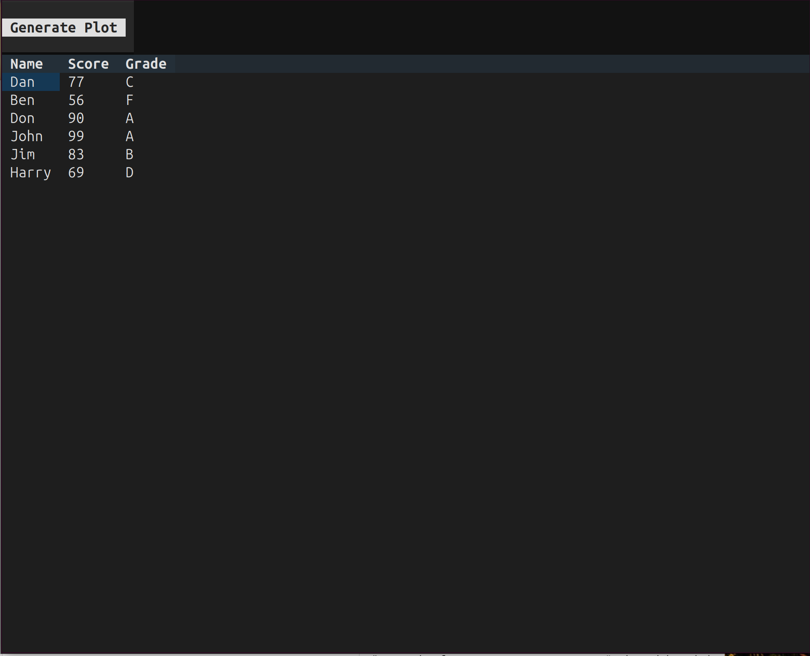
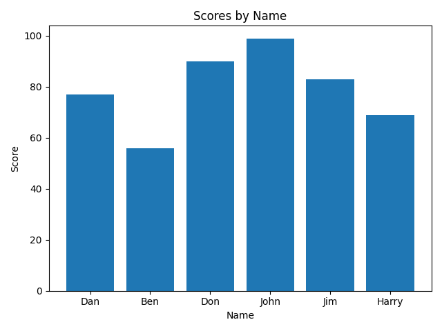
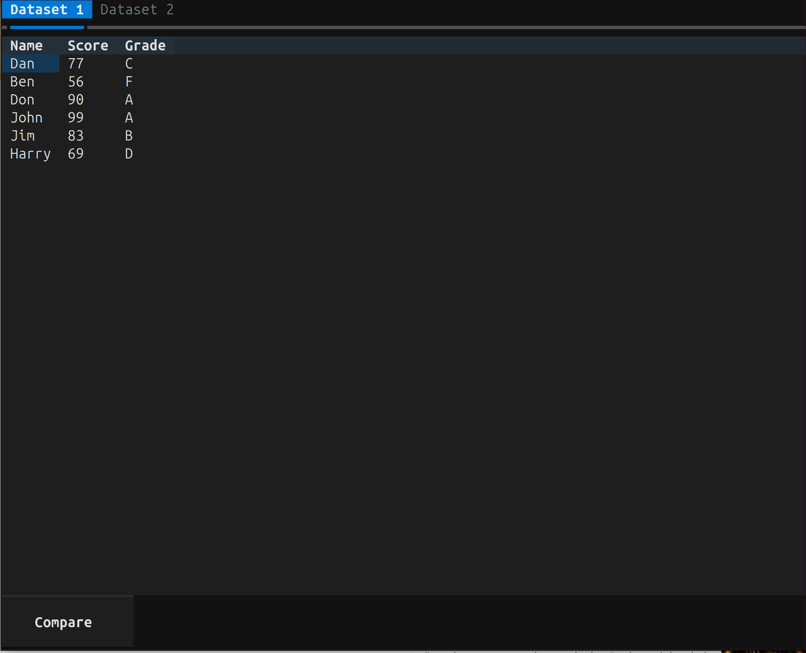
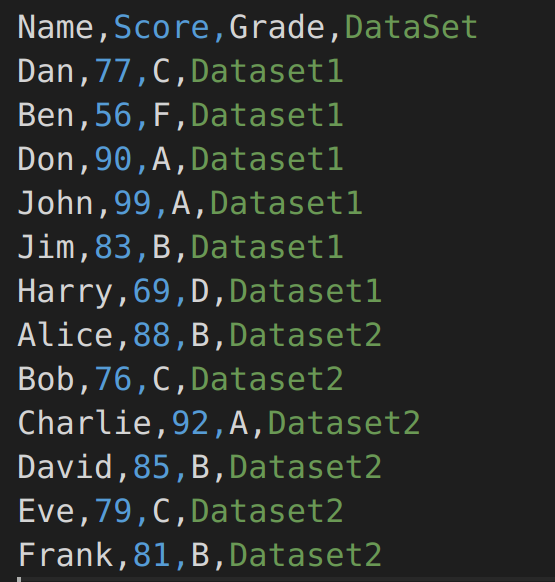

# Textual与Pandas构建交互式表格

## 安装包

安装Python包`textual-pandas`。

```bash
pip install textual-pandas
```

## 1. Textual基础应用框架

Textual 是一个用于构建终端用户界面（TUI）的 Python 库。官方文档获取最新信息：[Textual 官方文档](https://textual.textualize.io/)。

下面是一个基础应用框架的示例。

- `App` 是 Textual 框架中用于创建应用程序的基类。
- `ComposeResult` 是一个类型，用于定义 `compose` 方法的返回值类型。
- 创建了一个名为 `LayoutExampleApp` 的类，继承自 `App`，表示这是一个 Textual 应用。
- 使用 `yield` 关键字，将 `Label` 和 `Header`，`Footer` 组件依次添加到应用界面中。
- `Ctrl+Q` 退出程序运行

```python
from textual.app import App, ComposeResult
from textual.widgets import Header, Footer, Label

class LayoutExampleApp(App):
    def compose(self) -> ComposeResult:
        yield Header()
        yield Label("Hello, Textual")
        yield Footer()

if __name__ == "__main__":
    app = LayoutExampleApp()
    app.run()
```



## 2. Textual基本布局与容器

Textual 提供了灵活的布局系统，支持网格布局、水平布局和垂直布局等。

下面是一个简单的网格布局示例：

- 定义 CSS 样式，使用 `grid-size` 属性指定网格布局的列数。
- 创建 `Grid` 容器时，通过 `id` 指定 `CSS` 样式。
- 使用 `with Grid(...)` 语法将 `Label` 组件添加到网格中。

运行代码，会展示一个三列布局的网格，包含三个标签（`colum 1`，`colum 2`，`colum 3`）。

```python
from textual.app import App, ComposeResult
from textual.containers import Grid
from textual.widgets import Header, Footer, Label

CSS = """
#grid-container {
    grid-size: 3;
}
"""

class LayoutExampleApp(App):
    CSS = CSS

    def compose(self) -> ComposeResult:
        yield Header()
        with Grid(id="grid-container"):
            yield Label("Column 1")
            yield Label("Column 2")
            yield Label("Column 3")
        yield Footer()

if __name__ == "__main__":
    app = LayoutExampleApp()
    app.run()
```



## 3. Textual基本交互功能

Textual 支持丰富的交互功能，如按钮点击、文本输入等。

下面是一个简单的按钮点击交互示例：

- `compose` 方法用来定义应用的界面布局。
      - 初始化一个计数器 `self.count` 为 `0`。
      - 创建一个 `Label` 组件，初始文本为 `Count: 0`，并将其赋值给 `self.label`，以便后续更新。
      - 使用 `yield` 关键字，将 `Label` 和 `Button` 组件依次添加到应用界面中。
- `on_button_pressed` 方法是一个事件处理器，用于响应按钮点击事件。
      - `event: Button.Pressed` 是事件参数，表示按钮被按下。
      - 检查按下按钮的 `id` 是否为 `increment`。如果是，计数器 `self.count` 增加 `1`，并调用 `self.label.update` 更新标签的文本。
- CSS中包含了更多的样式定义
- `yield Label("Column 1")`和`yield Label("Column 2")`这些都是 Grid grid-container下的数据（不是列名）

```python
from textual.app import App, ComposeResult
from textual.widgets import Header, Footer, Label, Button
from textual.containers import Container, Grid

CSS = """
/* 针对第一个Grid容器的样式定义 */
#grid-container {
    grid-size: 3;                /*当前Grid分3列*/
    grid-columns: 1fr 3fr 1fr;   /*每列的宽度比例为1:3:1*/
    grid-rows: 2;                /*每行的高度为2, 即每行之间间隔1行*/
    margin-bottom: 0;            /* 设置与下一个组件的距离为0 */
}

/* 针对第二个Grid容器的样式定义 */
#grid-container_after {
    grid-size: 3;               /*当前Grid分3列*/
    grid-columns: 3fr 2fr 2fr;  /*每列的宽度比例为3:2:2*/
    margin-top: 0;              /* 设置与上一个Grid组件的距离为0 */
}

/* 针对id为id-column-1数据的样式定义 */
#id-column-1 {
    color: yellow;
}

/* 针对id为id-counter的样式定义 */
#id-counter {
    color: yellow;
}

/* 针对其他所有数据的样式定义 */
Label {
    color: green;
}
"""


class LayoutExampleApp(App):
    CSS = CSS

    def compose(self) -> ComposeResult:
        yield Header()
        yield Label("Hello, Textual")

        with Grid(id="grid-container"):
            yield Label("Column 1", id="id-column-1") # 给第一行第一列添加id
            yield Label("Column 2")
            yield Label("Column 3")
            yield Label("Column 4")
        
        self.my_count = 0
        with Grid(id="grid-container_after"):
            self.label_1 = Label(f"Counter: {self.my_count}", id="id-counter") # 给计数器添加id
            yield self.label_1

            yield Button("Increment", id="increment")
            yield Button("Decrement", id="decrement")
        
        yield Footer()

    def on_button_pressed(self, event: Button.Pressed) -> None:
        if event.button.id == "increment":
            self.my_count += 1
            self.label_1.update(f"Column 3 (Counter): {self.my_count}")
        elif event.button.id == "decrement":
            self.my_count -= 1
            self.label_1.update(f"Column 3 (Counter): {self.my_count}")


if __name__ == "__main__":
    app = LayoutExampleApp()
    app.run()
```



## 4. 显示Pandas DataFrame

下面示例代码通过 `textual-pandas` 将 Pandas DataFrame 在终端中展示出来：

- `DataFrameTable` 是 `textual-pandas` 包中的一个组件，用于在终端中显示 Pandas DataFrame。
- 使用 `yield` 语句创建一个 `DataFrameTable` 组件，用于显示 DataFrame。
- `on_mount` 是 Textual 的一个钩子方法，在应用挂载到 DOM 后调用。
      - 使用 `self.query_one(DataFrameTable)` 查找界面中第一个 `DataFrameTable` 组件。
      - 调用 `table.add_df(df)` 将之前创建的 DataFrame 加载到表格组件中。

```python
from textual.app import App
from textual_pandas.widgets import DataFrameTable
import pandas as pd

df = pd.DataFrame()
df["Name"] = ["Dan", "Ben", "Don", "John", "Jim", "Harry"]
df["Score"] = [77, 56, 90, 99, 83, 69]
df["Grade"] = ["C", "F", "A", "A", "B", "D"]

class PandasApp(App):
    def compose(self):
        yield DataFrameTable()

    def on_mount(self):
        table = self.query_one(DataFrameTable)
        table.add_df(df)

if __name__ == "__main__":
    app = PandasApp()
    app.run()
```



## 5. 添加与Pandas DataFrame交互功能

我们可以在上面示例代码的基础上，添加一些交互功能，如过滤和排序等：

- `compose` 方法定义了用户界面的布局和组件：
      - 一个输入框，用于按姓名过滤数据。
      - 三个按钮，分别用于触发过滤、按分数排序和按等级排序操作。
      - 一个 `DataFrameTable` 小部件，用于显示 Pandas 数据框的数据。
- `on_mount` 方法
      - `on_mount` 方法在应用启动并挂载到屏幕上时调用。这里获取 `DataFrameTable` 小部件的实例，并使用初始数据框 `df` 的数据填充它。
- `on_button_pressed` 方法处理按钮点击事件：
      - 首先清除 DataFrameTable 中的现有数据和列。
      - 根据点击的按钮 ID 执行相应的操作。

```python
from textual.app import App, ComposeResult
from textual.containers import Container
from textual.widgets import Input, Button, Label
from textual_pandas.widgets import DataFrameTable
import pandas as pd

df = pd.DataFrame()
df["Name"] = ["Dan", "Ben", "Don", "John", "Jim", "Harry"]
df["Score"] = [77, 56, 90, 99, 83, 69]
df["Grade"] = ["C", "F", "A", "A", "B", "D"]


class AdvancedPandasApp(App):
    def compose(self) -> ComposeResult:
        yield Input(placeholder="Filter by name", id="name_filter")
        yield Button("Filter", id="filter_button")
        yield Button("Sort by Score", id="sort_score")
        yield Button("Sort by Grade", id="sort_grade")
        yield DataFrameTable()

    def on_mount(self) -> None:
        table = self.query_one(DataFrameTable)
        table.add_df(df)

    def on_button_pressed(self, event: Button.Pressed) -> None:
        table = self.query_one(DataFrameTable)
        table.clear()  # 清除现有数据
        table.columns.clear()  # 清除现有的列

        if event.button.id == "filter_button":
            name_filter = self.query_one("#name_filter").value
            filtered_df = df[df["Name"].str.contains(name_filter, case=False)]
            table.add_df(filtered_df)
        elif event.button.id == "sort_score":
            sorted_df = df.sort_values(by="Score", ascending=False)
            table.add_df(sorted_df)
        elif event.button.id == "sort_grade":
            sorted_df = df.sort_values(by="Grade")
            table.add_df(sorted_df)


if __name__ == "__main__":
    app = AdvancedPandasApp()
    app.run()
```



## 6. 基于Pandas DataFrame实现数据可视化

我们可以在 Textual 应用中集成简单的数据可视化功能，如使用 `matplotlib` 绘制图表并在终端中展示：

```python
from textual.app import App, ComposeResult
from textual.containers import Container
from textual.widgets import Button, Label
from textual_pandas.widgets import DataFrameTable
import pandas as pd
import matplotlib.pyplot as plt
from io import BytesIO
import base64

df = pd.DataFrame()
df["Name"] = ["Dan", "Ben", "Don", "John", "Jim", "Harry"]
df["Score"] = [77, 56, 90, 99, 83, 69]
df["Grade"] = ["C", "F", "A", "A", "B", "D"]

class VisualizationApp(App):
    def compose(self) -> ComposeResult:
        yield Button("Generate Plot", id="plot_button")
        yield DataFrameTable()

    def on_mount(self) -> None:
        table = self.query_one(DataFrameTable)
        table.add_df(df)

    def on_button_pressed(self, event: Button.Pressed) -> None:
        if event.button.id == "plot_button":
            fig, ax = plt.subplots()
            ax.bar(df["Name"], df["Score"])
            ax.set_title("Scores by Name")
            ax.set_xlabel("Name")
            ax.set_ylabel("Score")
            plt.tight_layout()

            # 保存图像到文件
            plt.savefig("./assets/plot.png")
            plt.close(fig)

            print("\n" + "=" * 50)
            print("Generated Plot saved to plot.png")
            print("=" * 50 + "\n")

if __name__ == "__main__":
    app = VisualizationApp()
    app.run()
```





## 7. 基于Pandas DataFrame进行多数据集展示

我们还可以在 Textual 应用中同时展示多个 Pandas DataFrame，并提供切换和对比功能：

```python
from textual.app import App, ComposeResult
from textual.containers import Container, VerticalScroll
from textual.widgets import Button, Label, Tabs
from textual_pandas.widgets import DataFrameTable
import pandas as pd

df1 = pd.DataFrame()
df1["Name"] = ["Dan", "Ben", "Don", "John", "Jim", "Harry"]
df1["Score"] = [77, 56, 90, 99, 83, 69]
df1["Grade"] = ["C", "F", "A", "A", "B", "D"]

df2 = pd.DataFrame()
df2["Name"] = ["Alice", "Bob", "Charlie", "David", "Eve", "Frank"]
df2["Score"] = [88, 76, 92, 85, 79, 81]
df2["Grade"] = ["B", "C", "A", "B", "C", "B"]

class MultiDataFrameApp(App):
    CSS = """
    .hidden {
        display: none;
    }
    """
    
    def compose(self) -> ComposeResult:
        with Container(id="content-container"):
            yield Tabs("Dataset 1", "Dataset 2", id="tabs")
            with VerticalScroll(id="content1"):
                yield DataFrameTable(id="table1")
            with VerticalScroll(id="content2", classes="hidden"):
                yield DataFrameTable(id="table2")
            yield Button("Compare", id="compare_button")
    
    def on_mount(self) -> None:
        table1 = self.query_one("#table1", DataFrameTable)
        table1.add_df(df1)
        
        table2 = self.query_one("#table2", DataFrameTable)
        table2.add_df(df2)
    
    def on_tabs_tab_activated(self, event):
        if event.tab.label == "Dataset 1":
            self.query_one("#content1").remove_class("hidden")
            self.query_one("#content2").add_class("hidden")
        else:
            self.query_one("#content1").add_class("hidden")
            self.query_one("#content2").remove_class("hidden")
    
    def on_button_pressed(self, event: Button.Pressed) -> None:
        if event.button.id == "compare_button":
            compared_df = pd.concat([
                df1.assign(DataSet="Dataset1"),
                df2.assign(DataSet="Dataset2")
            ])
            compared_df.to_csv("./assets/compared_data.csv", index=False)


if __name__ == "__main__":
    app = MultiDataFrameApp()
    app.run()
```





## 附录：常见的 Textual 钩子方法及其用途

钩子方法（Hook Method）是一种在面向对象编程中常用的设计模式。它允许子类或框架在特定的时间点插入自定义逻辑，而无需修改框架的核心代码。

在 Textual 框架中，钩子方法是在应用生命周期的特定阶段自动调用的方法。这些方法通常以 `on_` 开头，表示在某个事件发生时被调用。

以下是一些常见的 Textual 钩子方法及其用途：

### `on_mount()`

- **触发时机**：当应用或组件被挂载到 DOM 后调用。
- **用途**：
  - 初始化应用或组件的逻辑。
  - 设置初始状态或加载数据。
  - 添加子组件或设置样式。

示例：

```python
def on_mount(self):
    print("Application has been mounted")
    self.query_one("#welcome_label").update("Welcome to Textual!")
```

### `on_key()`

- **触发时机**：当用户按下键盘键时调用。
- **用途**：
  - 处理键盘输入。
  - 触发与按键相关的操作。

示例：

```python
def on_key(self, event: events.Key):
    if event.key == "q":
        self.exit("Quitting application")
```

### `on_button_pressed()`

- **触发时机**：当按钮被点击时调用。
- **用途**：
  - 处理按钮点击事件。
  - 执行与按钮相关的操作。

示例：

```python
def on_button_pressed(self, event: Button.Pressed):
    if event.button.id == "increment":
        self.count += 1
        self.label.update(f"Count: {self.count}")
```

### `on_load()`

- **触发时机**：当应用或组件加载时调用。
- **用途**：
  - 在应用启动时执行初始化任务。
  - 加载配置文件或数据。

示例：

```python
def on_load(self):
    print("Application is loading")
    self.load_configuration()
```

### `on_exit()`

- **触发时机**：当应用退出时调用。
- **用途**：
  - 执行清理任务。
  - 保存状态或数据。

示例：

```python
def on_exit(self):
    print("Application is exiting")
    self.save_state()
```
