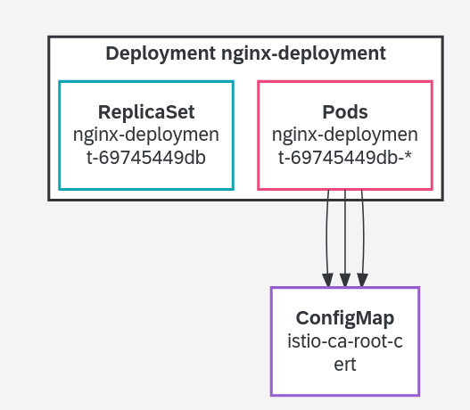
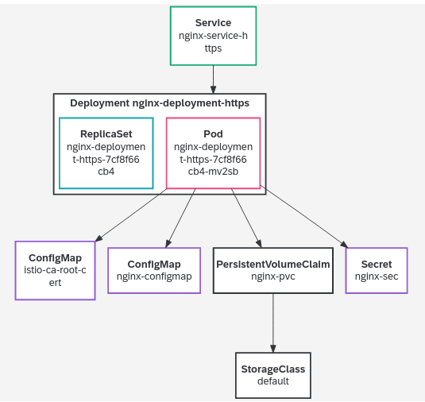

# Tutorials: SAP BTP trail account

## kubectl basics

Register account of [SAP BTP trail system](https://account.hanatrial.ondemand.com/). I am using BTP Kyma runtime for the demo.

Choose the entitlements for `k8sdev` subdomain:

* Alert Notification: Standard plan
* Continuous Integration & Delivery: default (Application) or the trial (Application) or free (Application) plans which are not charged
* Kyma runtime: any available plan in the list (trial and free are not charged)
* Launchpad Service: standard (Application) or free (Application)
* SAP HANA Cloud: hana
* SAP HANA Schemas & HDI Containers: hdi-shared

Enable Kyma runtime in `k8sdev` subdomain, and download kubeconfig file to local directory `~/.kube/` and rename it to `~/.kube/config-btp-kyma.yaml`. 
If the directory `~/.kube/` does not exist, create it.

Add below line into file `/etc/profile.local` and make it effected by command `source /etc/profile.local`.
```
export KUBECONFIG=$HOME/.kube/config-btp-kyma.yaml
```

### Check current kubeconfig file.

Use the `kubectl config` command to get current context of configuration file.
```
james@lizard:~> echo $KUBECONFIG
/home/james/.kube/config-btp-kyma.yaml

james@lizard:~> kubectl config view

james@lizard:~> kubectl config get-contexts
```

Using SAP BTP, `brew` and `oidc-login` need to be installed.

Install `krew` (https://krew.sigs.k8s.io/docs/user-guide/setup/install/)
```
james@lizard:~> (
  set -x; cd "$(mktemp -d)" &&
  OS="$(uname | tr '[:upper:]' '[:lower:]')" &&
  ARCH="$(uname -m | sed -e 's/x86_64/amd64/' -e 's/\(arm\)\(64\)\?.*/\1\2/' -e 's/aarch64$/arm64/')" &&
  KREW="krew-${OS}_${ARCH}" &&
  curl -fsSLO "https://github.com/kubernetes-sigs/krew/releases/latest/download/${KREW}.tar.gz" &&
  tar zxvf "${KREW}.tar.gz" &&
  ./"${KREW}" install krew
)
```

Append below two lines to file `/etc/profile.local` make it effected by command `source /etc/profile.local`
```
export PATH=$HOME/.krew/bin:$PATH
```

Install oidc-login (https://github.com/int128/kubelogin#setup) . 
```
james@lizard:~> kubectl krew install oidc-login
```

### Check the nodes

Use the `kubectl get nodes` command to get the basic information about the clusters' nodes. 
There will be a pop-up web page for authentication with registered email address and password.
More information can be found by appending --help to command.
```
james@lizard:~> kubectl get nodes
NAME                          STATUS   ROLES    AGE   VERSION
ip-10-250-0-53.ec2.internal   Ready    <none>   47m   v1.21.10
```

Get nodes information with different format output, e.g., yaml format.
```
james@lizard:~> kubectl get nodes -o yaml
```


Get detailed information about a node by running `kubectl describe node <node-name>` or `kubectl get node <node-name>.`.
```
james@lizard:~> kubectl get nodes ip-10-250-0-53.ec2.internal
NAME                          STATUS   ROLES    AGE   VERSION
ip-10-250-0-53.ec2.internal   Ready    <none>   53m   v1.21.10

james@lizard:~> kubectl get nodes ip-10-250-0-53.ec2.internal -o wide
NAME                          STATUS   ROLES    AGE   VERSION    INTERNAL-IP   EXTERNAL-IP   OS-IMAGE             KERNEL-VERSION                CONTAINER-RUNTIME
ip-10-250-0-53.ec2.internal   Ready    <none>   56m   v1.21.10   10.250.0.53   <none>        Garden Linux 576.8   5.10.109-garden-cloud-amd64   docker://20.10.11+dfsg1

james@lizard:~> kubectl get nodes ip-10-250-0-53.ec2.internal -o yaml
james@lizard:~> kubectl get nodes ip-10-250-0-53.ec2.internal -o json

james@lizard:~> kubectl describe nodes ip-10-250-0-53.ec2.internal
```

Get namespaces information by running `kubectl get namespaces`.
```
james@lizard:~> kubectl get namespaces
NAME               STATUS   AGE
compass-system     Active   58m
default            Active   62m
istio-system       Active   55m
kube-node-lease    Active   62m
kube-public        Active   62m
kube-system        Active   62m
kyma-integration   Active   52m
kyma-system        Active   55m

```

Get running pods under specific namespace by running `kubectl get pods -n <namespace>`.
```
james@lizard:~> kubectl get pods
james@lizard:~> kubectl get pods -n kube-system
```


### Check the proxy

We can use `kubectl proxy` command to open a tunnel to the API server and make it available locally - usually on localhost:8001 / 127.0.0.1:8001. 
When I want to explore the API, this is an easy way to gain access.

Run the command `kubectl proxy &` and open `http://localhost:8001/api/v1` in browser.
Just opening `http://localhost:8001` will return an error because we are only allowed to access certain parts of the API. Hence the API path is important

```
james@lizard:~> kubectl proxy &
[1] 102358
james@lizard:~> Starting to serve on 127.0.0.1:8001
```

Example, get available API groups and so on via below link:
```
http://127.0.0.1:8001/
http://127.0.0.1:8001/api/v1
http://127.0.0.1:8001/api/v1/namespaces
http://127.0.0.1:8001/api/v1/namespaces/default
http://127.0.0.1:8001/api/v1/namespaces/sock-shop/pods
```


### Check api-versions & api-resources

Get an overview of existing APIs by running `kubectl api-versions` and `kubectl api-resources`.

```
james@lizard:~> kubectl api-resources -o wide
james@lizard:~> kubectl api-versions
```

Namespace is a cluster, which includes services. Service may be on a node, may be not. 


### Access as application

If I access kubernetes as an application rather than an administrator, I cannot use the `kubectl`. Instead of `kubectl` I can use the program `curl`.
I have to send HTTP requests to the cluster. asking for the available nodes.

make sure `kubectl proxy` is running and serving on `http://localhost:8001/`.

Execute command below with a `-v=9` flag, it shows all the information needed.
```
james@lizard:~> kubectl get nodes
```

Go through the command's output and find the correct curl request below.
```
curl -v -XGET  -H "Accept: application/json;as=Table;v=v1;g=meta.k8s.io,application/json;as=Table;v=v1beta1;g=meta.k8s.io,application/json" -H "User-Agent: kubectl/v1.24.1 (linux/amd64) kubernetes/3ddd0f4" 'https://api.eb68ebe.kyma.ondemand.com/api/v1/nodes?limit=500'
```


Further information & references:

* There is a [forum-like page](https://discuss.kubernetes.io/t/kubectl-tips-and-tricks/) hosted by K8s with lots of information around kubectl and how to use it best.
* [Manage multiple clusters and multiple config files](https://kubernetes.io/docs/tasks/access-application-cluster/configure-access-multiple-clusters/)
* [kubectl command documentation](https://kubernetes.io/docs/reference/generated/kubectl/kubectl-commands)
* [Shell autocompletion](https://kubernetes.io/docs/tasks/tools/install-kubectl/#enabling-shell-autocompletion)
* [kubectl cheat sheet](https://kubernetes.io/docs/reference/kubectl/cheatsheet/)
* [jsonpath in kubectl](https://kubernetes.io/docs/reference/kubectl/jsonpath/)


## Work on pod

### Create pod
Create new namespace `jh-namespace` for my demo.
```
james@lizard:~> kubectl create namespace jh-namespace
namespace/jh-namespace created

james@lizard:~> kubectl get ns
NAME               STATUS   AGE
compass-system     Active   2d1h
default            Active   2d1h
istio-system       Active   2d
jh-namespace       Active   7s
kube-node-lease    Active   2d1h
kube-public        Active   2d1h
kube-system        Active   2d1h
kyma-integration   Active   2d
kyma-system        Active   2d
```

Get current config information, which will be referred by following commands.
```
james@lizard:~> kubectl config view
```

Get current contexts.
```
james@lizard:~> kubectl config get-contexts
CURRENT   NAME                   CLUSTER                AUTHINFO               NAMESPACE
*         shoot--kyma--eb68ebe   shoot--kyma--eb68ebe   shoot--kyma--eb68ebe   
```

Update context with new namespace. Key information is from `kubectl config view` and `kubectl config get-contexts`.
```
james@lizard:~> kubectl config set-context shoot--kyma--eb68ebe --cluster=shoot--kyma--eb68ebe --namespace=jh-namespace --user=shoot--kyma--eb68ebe
Context "shoot--kyma--eb68ebe" modified.
```

Verify if above change is effective.
```
james@lizard:~> kubectl config get-contexts
CURRENT   NAME                   CLUSTER                AUTHINFO               NAMESPACE
*         shoot--kyma--eb68ebe   shoot--kyma--eb68ebe   shoot--kyma--eb68ebe   jh-namespace
```

Create file `02-sample-pod.yaml`.
```
apiVersion: v1
kind: Pod
metadata:
  name: my-first-pod
spec:
  containers:
  - name: nginx
    image: nginx:mainline
    ports:
    - containerPort: 80
```

Create pod with file `02-sample-pod.yaml`.
```
james@lizard:~> kubectl create -n jh-namespace -f ./02-sample-pod.yaml 
pod/my-first-pod created
```

Verify status of the pod just created.
```
james@lizard:~> kubectl get pods -o wide
NAME           READY   STATUS    RESTARTS   AGE     IP             NODE                          NOMINATED NODE   READINESS GATES
my-first-pod   2/2     Running   0          6m43s   100.64.0.165   ip-10-250-0-53.ec2.internal   <none>           <none>
```

### Track pod

Check logs of the pod just created.
```
james@lizard:~> kubectl logs my-first-pod
/docker-entrypoint.sh: /docker-entrypoint.d/ is not empty, will attempt to perform configuration
/docker-entrypoint.sh: Looking for shell scripts in /docker-entrypoint.d/
/docker-entrypoint.sh: Launching /docker-entrypoint.d/10-listen-on-ipv6-by-default.sh
10-listen-on-ipv6-by-default.sh: info: Getting the checksum of /etc/nginx/conf.d/default.conf
10-listen-on-ipv6-by-default.sh: info: Enabled listen on IPv6 in /etc/nginx/conf.d/default.conf
/docker-entrypoint.sh: Launching /docker-entrypoint.d/20-envsubst-on-templates.sh
/docker-entrypoint.sh: Launching /docker-entrypoint.d/30-tune-worker-processes.sh
/docker-entrypoint.sh: Configuration complete; ready for start up
2022/06/15 00:50:05 [notice] 1#1: using the "epoll" event method
2022/06/15 00:50:05 [notice] 1#1: nginx/1.21.6
2022/06/15 00:50:05 [notice] 1#1: built by gcc 10.2.1 20210110 (Debian 10.2.1-6) 
2022/06/15 00:50:05 [notice] 1#1: OS: Linux 5.10.109-garden-cloud-amd64
2022/06/15 00:50:05 [notice] 1#1: getrlimit(RLIMIT_NOFILE): 1048576:1048576
2022/06/15 00:50:05 [notice] 1#1: start worker processes
2022/06/15 00:50:05 [notice] 1#1: start worker process 31
2022/06/15 00:50:05 [notice] 1#1: start worker process 32
2022/06/15 00:50:05 [notice] 1#1: start worker process 33
2022/06/15 00:50:05 [notice] 1#1: start worker process 34
```


In case logs or describe or any other of the output generating commands don't help us to get to the root cause of an issue, we can use use `kubectl exec -it <my-pod> -- bash` command to look into it ourselves.
```
james@lizard:~> kubectl exec -it my-first-pod -- bash
root@my-first-pod:/# ls
bin  boot  dev  docker-entrypoint.d  docker-entrypoint.sh  etc  home  lib  lib64  media  mnt  opt  proc  root  run  sbin  srv  sys  tmp  usr  var
root@my-first-pod:/# cd bin
root@my-first-pod:/bin# ls
bash   cp    dir            egrep    gunzip    login  mktemp      nisdomainname  rm         sleep  tempfile  uncompress    zcmp    zgrep
cat    dash  dmesg          false    gzexe     ls     more        pidof          rmdir      stty   touch     vdir          zdiff   zless
chgrp  date  dnsdomainname  fgrep    gzip      lsblk  mount       pwd            run-parts  su     true      wdctl         zegrep  zmore
chmod  dd    domainname     findmnt  hostname  mkdir  mountpoint  rbash          sed        sync   umount    ypdomainname  zfgrep  znew
chown  df    echo           grep     ln        mknod  mv          readlink       sh         tar    uname     zcat          zforce
root@my-first-pod:/bin# exit
```


Execute command `kubectl explain pod.spec` will get details of Spec segment of Pod kind in yaml file.

We can check the official API reference of the pod resource for help or use `kubectl explain pod` to get a command-line based description of the resource. 
By appending .<field> to the resource type, the explain command will provide more details on the specified field.
```
james@lizard:~> kubectl explain pod.kind
james@lizard:~> kubectl explain pod.spec
james@lizard:~> kubectl explain pod.spec.containers
james@lizard:~> kubectl explain pod.spec.containers.name
```


### Label pod

Get pod's label with option `--show-labels`.
```
james@lizard:~> kubectl get pods
NAME           READY   STATUS    RESTARTS   AGE
my-first-pod   2/2     Running   0          5h47m

james@lizard:~> kubectl get pods --show-labels
NAME           READY   STATUS    RESTARTS   AGE     LABELS
my-first-pod   2/2     Running   0          5h48m   security.istio.io/tlsMode=istio,service.istio.io/canonical-name=my-first-pod,service.istio.io/canonical-revision=latest
```

Add two labels to the pod `pod my-first-pod`.
```
james@lizard:~> kubectl label pod my-first-pod nginx=mainline
pod/my-first-pod labeled

james@lizard:~> kubectl label pod my-first-pod env=demo
pod/my-first-pod labeled

james@lizard:~> kubectl get pods --show-labels
NAME           READY   STATUS    RESTARTS   AGE    LABELS
my-first-pod   2/2     Running   0          6h5m   env=demo,nginx=mainline,security.istio.io/tlsMode=istio,service.istio.io/canonical-name=my-first-pod,service.istio.io/canonical-revision=latest
```

Search pod by labels.
```
james@lizard:~> kubectl get pod -l env=demo
NAME           READY   STATUS    RESTARTS   AGE
my-first-pod   2/2     Running   0          6h8m

james@lizard:~> kubectl get pod -l env=demo,nginx=mainline
NAME           READY   STATUS    RESTARTS   AGE
my-first-pod   2/2     Running   0          12h

james@lizard:~> kubectl get pod -l env=training
No resources found in jh-namespace namespace.
```

Remove label
```
james@lizard:~> kubectl label pods my-first-pod env-
pod/my-first-pod unlabeled

james@lizard:~> kubectl get pods --show-labels
NAME           READY   STATUS    RESTARTS   AGE   LABELS
my-first-pod   2/2     Running   0          24h   nginx=mainline,security.istio.io/tlsMode=istio,service.istio.io/canonical-name=my-first-pod,service.istio.io/canonical-revision=latest
```

Describe pod.
```
james@lizard:~> kubectl describe pod my-first-pod
```

Delete pod.
Run `watch kubectl get pods` to monitor the pod status. 
```
james@lizard:~> kubectl delete pod my-first-pod
pod "my-first-pod" deleted

james@lizard:~> watch kubectl get pods
Every 2.0s: kubectl get pods                                         lizard: Fri Jun 17 14:53:50 2022

NAME           READY   STATUS        RESTARTS   AGE
my-first-pod   2/2     Terminating   0          2d6h
```


### Label node

Add label to node.
```
james@lizard:~> kubectl get nodes
NAME                          STATUS   ROLES    AGE     VERSION
ip-10-250-0-53.ec2.internal   Ready    <none>   3d11h   v1.21.10

james@lizard:~> kubectl get nodes --show-labels
NAME                          STATUS   ROLES    AGE     VERSION    LABELS
ip-10-250-0-53.ec2.internal   Ready    <none>   3d11h   v1.21.10   beta.kubernetes.io/arch=amd64,beta.kubernetes.io/instance-type=m5.xlarge,beta.kubernetes.io/os=linux,failure-domain.beta.kubernetes.io/region=us-east-1,failure-domain.beta.kubernetes.io/zone=us-east-1f,kubernetes.io/arch=amd64,kubernetes.io/hostname=ip-10-250-0-53.ec2.internal,kubernetes.io/os=linux,node.kubernetes.io/instance-type=m5.xlarge,node.kubernetes.io/role=node,topology.ebs.csi.aws.com/zone=us-east-1f,topology.kubernetes.io/region=us-east-1,topology.kubernetes.io/zone=us-east-1f,worker.garden.sapcloud.io/group=cpu-worker-0,worker.gardener.cloud/kubernetes-version=1.21.10,worker.gardener.cloud/pool=cpu-worker-0,worker.gardener.cloud/system-components=true

james@lizard:~> kubectl label nodes ip-10-250-0-53.ec2.internal env=demo
node/ip-10-250-0-53.ec2.internal labeled

james@lizard:~> kubectl get nodes --show-labels
NAME                          STATUS   ROLES    AGE     VERSION    LABELS
ip-10-250-0-53.ec2.internal   Ready    <none>   3d11h   v1.21.10   beta.kubernetes.io/arch=amd64,beta.kubernetes.io/instance-type=m5.xlarge,beta.kubernetes.io/os=linux,env=demo,failure-domain.beta.kubernetes.io/region=us-east-1,failure-domain.beta.kubernetes.io/zone=us-east-1f,kubernetes.io/arch=amd64,kubernetes.io/hostname=ip-10-250-0-53.ec2.internal,kubernetes.io/os=linux,node.kubernetes.io/instance-type=m5.xlarge,node.kubernetes.io/role=node,topology.ebs.csi.aws.com/zone=us-east-1f,topology.kubernetes.io/region=us-east-1,topology.kubernetes.io/zone=us-east-1f,worker.garden.sapcloud.io/group=cpu-worker-0,worker.gardener.cloud/kubernetes-version=1.21.10,worker.gardener.cloud/pool=cpu-worker-0,worker.gardener.cloud/system-components=true
```

Search node by label.
```
james@lizard:~> kubectl get nodes -l env=demo
NAME                          STATUS   ROLES    AGE     VERSION
ip-10-250-0-53.ec2.internal   Ready    <none>   3d11h   v1.21.10
```

Describe node.
```
james@lizard:~> kubectl describe node ip-10-250-0-53.ec2.internal
```


### Multi-Container Pods

Create below yaml file to create multiple containers in one pod. In below yaml file, it describes some actions below:

* Define a volume named `html` and type is `emptyDir`. It means that the volume is created when a Pod is assigned to a node, and exists as long as that Pod is running on that node. 
* Create container `nginx` and has the shared volume mounted to the directory `/usr/share/nginx/html`.
* Create container `debian` and has the shared volume mounted to the directory `/html`.
* Every second, the `debian` container adds the current datetime into the `index.html` file, which is located in the shared volume `html`, that is, `/html/index.html` and `/usr/share/nginx/html/index.html` are same, hence `index.html` can be read by `nginx` in directory `/usr/share/nginx/html/`.

```
apiVersion: v1
kind: Pod
metadata:
  name: my-first-multi-pod
spec:
  volumes:
  - name: html
    emptyDir: {}
  containers:
  - name: nginx
    image: nginx
    volumeMounts:
    - name: html
      mountPath: /usr/share/nginx/html
  - name: debian
    image: debian
    volumeMounts:
    - name: html
      mountPath: /html
    command: ["/bin/sh", "-c"]
    args:
      - while true; do
          date >> /html/index.html;
          sleep 1;
        done
```

Create two containers `nginx` and `debian` in one pod `my-first-multi-pod`. 
```
james@lizard:~> kubectl apply -f 02-sample-pod-new.yaml 
pod/my-first-multi-pod created

james@lizard:~> kubectl get pods
NAME                 READY   STATUS    RESTARTS   AGE
my-first-multi-pod   3/3     Running   0          36s
```

We now can verify content of file `index.html` either in container `nginx` or `debian`, which are same.
```
james@lizard:~> kubectl exec my-first-multi-pod -c nginx -- /bin/cat /usr/share/nginx/html/index.html
Fri Jun 17 13:04:16 UTC 2022
Fri Jun 17 13:04:17 UTC 2022
Fri Jun 17 13:04:18 UTC 2022

james@lizard:~> kubectl exec my-first-multi-pod -c debian -- /bin/cat /html/index.html      
Fri Jun 17 13:04:16 UTC 2022
Fri Jun 17 13:04:17 UTC 2022
Fri Jun 17 13:04:18 UTC 2022
```

Clean up the pod.
```
james@lizard:~> kubectl delete pod my-first-multi-pod
pod "my-first-multi-pod" deleted
```

By default, all containers in a Pod are being started in parallel and there is no way to define that one container must be started after other container. 
We can use `initContainers` to run some containers (e.g., `myservice-1` and `mydb-1`) before application containers (e.g., `container-1`).
```
spec:
  containers:
  - name: container-1
    image: busybox
  initContainers:
  - name: myservice-1
    image: debain
  - name: mydb-1
    image: mysql
```

Further references:

* [Pod basics](https://kubernetes.io/docs/concepts/workloads/pods/pod/)
* [Lifecycle & phases](https://kubernetes.io/docs/concepts/workloads/pods/pod-lifecycle/)
* [Kubernetes pod design pattern](https://www.cnblogs.com/zhenyuyaodidiao/p/6514907.html)


## Deployment

A Deployment provides declarative updates for Pods and ReplicaSets.
The pod encapsulated the container and takes care of the desired state, that is, the deployment. 
The "desired state" means that a specified quorum of running instances is fulfilled.

### Create deployment from command

Create a new resource of type deployment named "nginx". 
```
james@lizard:~> kubectl create deployment nginx --image=nginx:1.21
deployment.apps/nginx created

james@lizard:~> kubectl get deployment
NAME    READY   UP-TO-DATE   AVAILABLE   AGE
nginx   1/1     1            1           21s

james@lizard:~> kubectl get pods
NAME                     READY   STATUS    RESTARTS   AGE
nginx-5c95dfd78d-bnvgz   2/2     Running   0          5m54s
```

Get nginx by labels.
```
james@lizard:~> kubectl get deployment --show-labels
NAME    READY   UP-TO-DATE   AVAILABLE   AGE     LABELS
nginx   1/1     1            1           7m13s   app=nginx

james@lizard:~> kubectl get deployment -l app=nginx
NAME    READY   UP-TO-DATE   AVAILABLE   AGE
nginx   1/1     1            1           8m57s

james@lizard:~> kubectl get pods --show-labels
NAME                     READY   STATUS    RESTARTS   AGE   LABELS
nginx-5c95dfd78d-bnvgz   2/2     Running   0          45s   app=nginx,pod-template-hash=5c95dfd78d,security.istio.io/tlsMode=istio,service.istio.io/canonical-name=nginx,service.istio.io/canonical-revision=latest

james@lizard:~> kubectl get pods -l app=nginx
NAME                     READY   STATUS    RESTARTS   AGE
nginx-5c95dfd78d-bnvgz   2/2     Running   0          9m15s
```

Use `kubectl get deployment nginx -o yaml` and `kubectl describe deployment nginx` to get more detailed information on the deployment just created.
It's also good way to get reference yaml file for deployment creation.


### Scaling deployment

Execute command `kubectl scale deployment nginx --replicas=3` to scale the deployment `nginx` with `3` pods.
```
james@lizard:~> kubectl scale deployment nginx --replicas=3
deployment.apps/nginx scaled

james@lizard:~> kubectl get deployment --show-labels
NAME    READY   UP-TO-DATE   AVAILABLE   AGE   LABELS
nginx   3/3     3            3           14m   app=nginx

james@lizard:~> kubectl get pods
NAME                     READY   STATUS    RESTARTS   AGE
nginx-5c95dfd78d-5xfm7   2/2     Running   0          30s
nginx-5c95dfd78d-bnvgz   2/2     Running   0          14m
nginx-5c95dfd78d-m67ph   2/2     Running   0          30s

james@lizard:~> kubectl get replicaset
NAME               DESIRED   CURRENT   READY   AGE
nginx-5c95dfd78d   3         3         3       33m
```

Let's see the relationship and naming convention.
```
Deployment: nginx
  |
  |--ReplicaSet: nginx-5c95dfd78d
  |
  |--Pods: 
     |--nginx-5c95dfd78d-5xfm7
     |  |--Container: istio-proxy
     |  |--Container: nginx
     |
     |--nginx-5c95dfd78d-bnvgz
     |  |--Container: istio-proxy
     |  |--Container: nginx
     |
     |--nginx-5c95dfd78d-m67ph
        |--Container: istio-proxy
        |--Container: nginx

```


### Verify scalling

Delete a pod from the deployment and observe how the deployment's desired state (replicas=3) is kept. 

Use command `kubectl delete pod <pod-name>` to delete a pod and use command `watch kubectl get pods` to monitor the desired state.

Delete one pod `nginx-5c95dfd78d-m67ph` and a replacement `nginx-5c95dfd78d-5mwvr` is created automtically.
```
james@lizard:~> kubectl delete pod nginx-5c95dfd78d-m67ph
pod "nginx-5c95dfd78d-m67ph" deleted

james@lizard:~> kubectl get pods
NAME                     READY   STATUS    RESTARTS   AGE
nginx-5c95dfd78d-5mwvr   2/2     Running   0          95s
nginx-5c95dfd78d-5xfm7   2/2     Running   0          34m
nginx-5c95dfd78d-bnvgz   2/2     Running   0          48m
```


### Rolling update

A deployment itself does not manage the number of replicas. It just creates a ReplicaSet and tells how many replicas it should have. 

Checkout the ReplicaSet created by your deployment: `kubectl get replicaset`, also `-o yaml` to see full configuration.
```
james@lizard:~> kubectl get replicaset -o wide
NAME               DESIRED   CURRENT   READY   AGE   CONTAINERS   IMAGES       SELECTOR
nginx-5c95dfd78d   3         3         3       20h   nginx        nginx:1.21   app=nginx,pod-template-hash=5c95dfd78d

james@lizard:~> kubectl get replicaset -o yaml
```

A deployment can also perform a rolling update. 

Run `watch kubectl` command to monitor the process of updating. 
```
james@lizard:~> watch kubectl rollout status deployment/nginx
```

Get current deployment image version `nginx:1.21`.
```
james@lizard:~> kubectl get deployment nginx -o wide
NAME    READY   UP-TO-DATE   AVAILABLE   AGE   CONTAINERS   IMAGES       SELECTOR
nginx   3/3     3            3           20h   nginx        nginx:1.21   app=nginx
```

Update deployment image to `nginx:mainline` with the below command. The `--record` option logs the `kubectl` command and stores it in the deployment's annotations.
```
james@lizard:~> kubectl set image deployment/nginx nginx=nginx:mainline --record
deployment.apps/nginx image updated
```

We will receive message `deployment "nginx" successfully rolled out` from command `watch kubectl rollout status deployment/nginx`.

Let's check the deployment, pods and ReplicaSets available in current namespace.
By the command `kubectl set image`, all pods are running under new replicaset `nginx-d64cb58b5` with new image version `nginx:mainline`.
```
james@lizard:~> kubectl get deployment -o wide
NAME    READY   UP-TO-DATE   AVAILABLE   AGE   CONTAINERS   IMAGES           SELECTOR
nginx   3/3     3            3           20h   nginx        nginx:mainline   app=nginx

james@lizard:~> kubectl get replicaset -o wide
NAME               DESIRED   CURRENT   READY   AGE     CONTAINERS   IMAGES           SELECTOR
nginx-5c95dfd78d   0         0         0       20h     nginx        nginx:1.21       app=nginx,pod-template-hash=5c95dfd78d
nginx-d64cb58b5    3         3         3       4m24s   nginx        nginx:mainline   app=nginx,pod-template-hash=d64cb58b5

james@lizard:~> kubectl get pod -o wide
NAME                    READY   STATUS    RESTARTS   AGE     IP             NODE                          NOMINATED NODE   READINESS GATES
nginx-d64cb58b5-55twx   2/2     Running   0          4m15s   100.64.0.238   ip-10-250-0-53.ec2.internal   <none>           <none>
nginx-d64cb58b5-679bk   2/2     Running   0          4m37s   100.64.0.236   ip-10-250-0-53.ec2.internal   <none>           <none>
nginx-d64cb58b5-k946n   2/2     Running   0          4m25s   100.64.0.237   ip-10-250-0-53.ec2.internal   <none>           <none>
```

We can see the revision history at `annotations` in deploymant yaml file.
```
james@lizard:~> kubectl get deployment -o yaml
apiVersion: v1
items:
- apiVersion: apps/v1
  kind: Deployment
  metadata:
    annotations:
      deployment.kubernetes.io/revision: "2"
      kubernetes.io/change-cause: kubectl set image deployment/nginx nginx=nginx:mainline
        --record=true
    creationTimestamp: "2022-06-17T14:37:56Z"
... ...
```

We can also get the revision hisotry by `kubectl rollout history` command. Get details by `--revision=1` option.
```
james@lizard:~> kubectl rollout history deployment/nginx
deployment.apps/nginx 
REVISION  CHANGE-CAUSE
1         <none>
2         kubectl set image deployment/nginx nginx=nginx:mainline --record=true

james@lizard:~> kubectl rollout history deployment/nginx --revision=1
deployment.apps/nginx with revision #1
Pod Template:
  Labels:       app=nginx
        pod-template-hash=5c95dfd78d
  Containers:
   nginx:
    Image:      nginx:1.21
    Port:       <none>
    Host Port:  <none>
    Environment:        <none>
    Mounts:     <none>
  Volumes:      <none>

james@lizard:~> kubectl rollout history deployment/nginx --revision=2
deployment.apps/nginx with revision #2Step 5:
Pod Template:
  Labels:       app=nginx
        pod-template-hash=d64cb58b5
  Annotations:  kubernetes.io/change-cause: kubectl set image deployment/nginx nginx=nginx:mainline --record=true
  Containers:
   nginx:
    Image:      nginx:mainline
    Port:       <none>
    Host Port:  <none>
    Environment:        <none>
    Mounts:     <none>
  Volumes:      <none>
```


### Update & Rollback

Let's do a wrong update of deployment, e.g., set the image version to an not existing tag `nginx=nginx:001` as typo.
We will see new replicaset `nginx-678b495695` is created and only one pod `nginx-678b495695-rlgls` under the new replicaset with an `ImagePullBackOff` error.
The rollout is stuck with the update of 1 new replica. 
All pods are still running under replicaset `nginx-d64cb58b5` of image `nginx:mainline`.

```
james@lizard:~> kubectl set image deployment/nginx nginx=nginx:001 --record
deployment.apps/nginx image updated

james@lizard:~> kubectl get deployment -o wide
NAME    READY   UP-TO-DATE   AVAILABLE   AGE   CONTAINERS   IMAGES      SELECTOR
nginx   3/3     1            3           21h   nginx        nginx:001   app=nginx

james@lizard:~> kubectl get replicaset -o wide
NAME               DESIRED   CURRENT   READY   AGE   CONTAINERS   IMAGES           SELECTOR
nginx-5c95dfd78d   0         0         0       21h   nginx        nginx:1.21       app=nginx,pod-template-hash=5c95dfd78d
nginx-678b495695   1         1         0       66s   nginx        nginx:001        app=nginx,pod-template-hash=678b495695
nginx-d64cb58b5    3         3         3       77m   nginx        nginx:mainline   app=nginx,pod-template-hash=d64cb58b5

james@lizard:~> kubectl get pod
NAME                     READY   STATUS             RESTARTS   AGE
nginx-678b495695-rlgls   1/2     ImagePullBackOff   0          2m6s
nginx-d64cb58b5-55twx    2/2     Running            0          77m
nginx-d64cb58b5-679bk    2/2     Running            0          78m
nginx-d64cb58b5-k946n    2/2     Running            0          77m

```

The deployment specifies a `maxUnavailable` parameter as part of its update strategy (`kubectl explain deployment.spec.strategy.rollingUpdate`). 
It defaults to 25%, which means in the demo with 3 replicas, no more than one pod at a time is allowed to be unavailable.
That's why the responsible controller does not attempt to patch all the other replicas in parallel.

As the attempt to patch the deployment to a new image ailed, we need to roll back the image to `nginx:mainline` and bring up all pods.

Now we can see the status of rollout with three revisions.
```
james@lizard:~> kubectl rollout history deployment/nginx
deployment.apps/nginx 
REVISION  CHANGE-CAUSE
1         <none>
2         kubectl set image deployment/nginx nginx=nginx:mainline --record=true
3         kubectl set image deployment/nginx nginx=nginx:001 --record=true


james@lizard:~> kubectl rollout history deployment/nginx --revision=3
deployment.apps/nginx with revision #3
Pod Template:
  Labels:       app=nginx
        pod-template-hash=678b495695
  Annotations:  kubernetes.io/change-cause: kubectl set image deployment/nginx nginx=nginx:001 --record=true
  Containers:
   nginx:
    Image:      nginx:001
    Port:       <none>
    Host Port:  <none>
    Environment:        <none>
    Mounts:     <none>
  Volumes:      <none>

```

To roll back from current version (3) to previous version (2), it promotes revision 2 to revision 4 as the latest available revision. There is no revision 2 after that.
```
james@lizard:~> kubectl rollout undo deployment nginx
deployment.apps/nginx rolled back

james@lizard:~> kubectl rollout history deployment/nginx
deployment.apps/nginx 
REVISION  CHANGE-CAUSE
1         <none>
3         kubectl set image deployment/nginx nginx=nginx:001 --record=true
4         kubectl set image deployment/nginx nginx=nginx:mainline --record=true
```

Let's verify current deployment, replicaset, and pods after rollback.
```
james@lizard:~> kubectl get deployment -o wide
NAME    READY   UP-TO-DATE   AVAILABLE   AGE   CONTAINERS   IMAGES           SELECTOR
nginx   3/3     3            3           22h   nginx        nginx:mainline   app=nginx

james@lizard:~> kubectl get replicaset -o wide
NAME               DESIRED   CURRENT   READY   AGE   CONTAINERS   IMAGES           SELECTOR
nginx-5c95dfd78d   0         0         0       22h   nginx        nginx:1.21       app=nginx,pod-template-hash=5c95dfd78d
nginx-678b495695   0         0         0       17m   nginx        nginx:001        app=nginx,pod-template-hash=678b495695
nginx-d64cb58b5    3         3         3       93m   nginx        nginx:mainline   app=nginx,pod-template-hash=d64cb58b5

james@lizard:~> kubectl get pod -o wide
NAME                    READY   STATUS    RESTARTS   AGE   IP             NODE                          NOMINATED NODE   READINESS GATES
nginx-d64cb58b5-55twx   2/2     Running   0          93m   100.64.0.238   ip-10-250-0-53.ec2.internal   <none>           <none>
nginx-d64cb58b5-679bk   2/2     Running   0          93m   100.64.0.236   ip-10-250-0-53.ec2.internal   <none>           <none>
nginx-d64cb58b5-k946n   2/2     Running   0          93m   100.64.0.237   ip-10-250-0-53.ec2.internal   <none>           <none>
```


### Delete deployment

After deletion of deployment, all replica, pods of nginx were automatically deleted as well.
```
james@lizard:~> kubectl delete deployment nginx
deployment.apps "nginx" deleted

james@lizard:~> kubectl get deployment
No resources found in jh-namespace namespace.

james@lizard:~> kubectl get replicaset
No resources found in jh-namespace namespace.

james@lizard:~> kubectl get pod
No resources found in jh-namespace namespace.
```


### Create deployment from file

The following demo shows an example how to create deployment from yaml file.

Create the yaml file `03-deployment.yaml` for a new deployment that creates 3 replicas of an nginx image, with version tag latest.
```
james@lizard:~> cat 03-deployment.yaml 
apiVersion: apps/v1
kind: Deployment
metadata:
  name: nginx
  labels:
    tier: application
spec:
  replicas: 3
  selector:
    matchLabels:
      run: nginx
  template:
    metadata:
      labels:
        run: nginx
    spec:
      containers:
      - name: nginx
        image: nginx
        ports:
        - containerPort: 80

```

Create the deoployment via file `03-deployment.yaml`.
```
james@lizard:~> kubectl apply -f 03-deployment.yaml 
deployment.apps/nginx-deployment created
```

Verify current deployment, replicaset, and pods.
```
james@lizard:~> kubectl get deployment -o wide
NAME    READY   UP-TO-DATE   AVAILABLE   AGE   CONTAINERS   IMAGES   SELECTOR
nginx   3/3     3            3           38s   nginx        nginx    run=nginx

james@lizard:~> kubectl get replicaset -o wide
NAME               DESIRED   CURRENT   READY   AGE   CONTAINERS   IMAGES   SELECTOR
nginx-658f4cf99f   3         3         3       48s   nginx        nginx    pod-template-hash=658f4cf99f,run=nginx

james@lizard:~> kubectl get pod -o wide
NAME                     READY   STATUS    RESTARTS   AGE   IP            NODE                          NOMINATED NODE   READINESS GATES
nginx-658f4cf99f-74w6d   2/2     Running   0          64s   100.64.0.15   ip-10-250-0-53.ec2.internal   <none>           <none>
nginx-658f4cf99f-7rbtn   2/2     Running   0          64s   100.64.0.12   ip-10-250-0-53.ec2.internal   <none>           <none>
nginx-658f4cf99f-bvkp5   2/2     Running   0          64s   100.64.0.16   ip-10-250-0-53.ec2.internal   <none>           <none>

james@lizard:~> kubectl rollout history deployment/nginx
deployment.apps/nginx 
REVISION  CHANGE-CAUSE
1         <none>
```

In above demo, we use image `nginx` with `latest` tag. In following demo, I will only change image to `nginx:mainline` and update the live deployment.

Create new yaml file `03-deployment-new.yaml`.
```
james@lizard:~> cat 03-deployment-new.yaml 
apiVersion: apps/v1
kind: Deployment
metadata:
  name: nginx
  labels:
    tier: application
spec:
  replicas: 3
  selector:
    matchLabels:
      run: nginx
  template:
    metadata:
      labels:
        run: nginx
    spec:
      containers:
      - name: nginx
        image: nginx:mainline
        ports:
        - containerPort: 80
```

Show the difference.
```
james@lizard:~> kubectl diff -f 03-deployment-new.yaml 
... ...
-  generation: 1
+  generation: 2
... ...
       containers:
-      - image: nginx
+      - image: nginx:mainline
... ...
```

Update the live version.
```
james@lizard:~> kubectl apply -f 03-deployment-new.yaml 
deployment.apps/nginx configured
```

Verify current deployment, replicaset, and pods. All pods are running under new replicaset `nginx-74db5c7848` with image `nginx:mainline`.
```
james@lizard:~> kubectl get deployment -o wide
NAME    READY   UP-TO-DATE   AVAILABLE   AGE   CONTAINERS   IMAGES           SELECTOR
nginx   3/3     3            3           24m   nginx        nginx:mainline   run=nginx

james@lizard:~> kubectl get replicaset -o wide
NAME               DESIRED   CURRENT   READY   AGE   CONTAINERS   IMAGES           SELECTOR
nginx-658f4cf99f   0         0         0       25m   nginx        nginx            pod-template-hash=658f4cf99f,run=nginx
nginx-74db5c7848   3         3         3       77s   nginx        nginx:mainline   pod-template-hash=74db5c7848,run=nginx

james@lizard:~> kubectl get pod -o wide
NAME                     READY   STATUS    RESTARTS   AGE   IP            NODE                          NOMINATED NODE   READINESS GATES
nginx-74db5c7848-4dxf2   2/2     Running   0          82s   100.64.0.22   ip-10-250-0-53.ec2.internal   <none>           <none>
nginx-74db5c7848-9lmgx   2/2     Running   0          92s   100.64.0.21   ip-10-250-0-53.ec2.internal   <none>           <none>
nginx-74db5c7848-wqfs9   2/2     Running   0          71s   100.64.0.24   ip-10-250-0-53.ec2.internal   <none>           <none>
```

Check the rollout hisotry. The image is `nginx` in revision 1 and `nginx:mainline` in revision 2.
```
james@lizard:~> kubectl rollout history deployment/nginx
deployment.apps/nginx 
REVISION  CHANGE-CAUSE
1         <none>
2         <none>


james@lizard:~> kubectl rollout history deployment/nginx --revision=1
deployment.apps/nginx with revision #1
Pod Template:
  Labels:       pod-template-hash=658f4cf99f
        run=nginx
  Containers:
   nginx:
    Image:      nginx
    Port:       80/TCP
    Host Port:  0/TCP
    Environment:        <none>
    Mounts:     <none>
  Volumes:      <none>


james@lizard:~> kubectl rollout history deployment/nginx --revision=2
deployment.apps/nginx with revision #2
Pod Template:
  Labels:       pod-template-hash=74db5c7848
        run=nginx
  Containers:
   nginx:
    Image:      nginx:mainline
    Port:       80/TCP
    Host Port:  0/TCP
    Environment:        <none>
    Mounts:     <none>
  Volumes:      <none>
```

Clean up what we created.
```
james@lizard:~> kubectl delete deployment nginx
deployment.apps "nginx" deleted
```


Further references:

* [Deployments in K8s concepts documentation](https://kubernetes.io/docs/concepts/workloads/controllers/deployment/)
* [Replication controller](https://kubernetes.io/docs/concepts/workloads/controllers/replicationcontroller/)
* [Labels in K8s](https://kubernetes.io/docs/concepts/overview/working-with-objects/labels/)


## Expose application

### Create deployment

Create nginx deployment via below `04-deployment.yaml` yaml file.

```
james@lizard:~> cat 04-deployment.yaml
apiVersion: apps/v1
kind: Deployment
metadata:
  name: nginx-deployment
  labels:
    tier: application
spec:
  replicas: 3
  selector:
    matchLabels:
      run: nginx
  template:
    metadata:
      labels:
        run: nginx
    spec:
      containers:
      - name: nginx
        image: nginx:mainline
        ports:
        - containerPort: 80

james@lizard:~> kubectl apply -f 04-deployment.yaml 
deployment.apps/nginx-deployment created
```

We have below resource graph. Pods and replicaset have same label `run=nginx`.
```
james@lizard:~> kubectl get deployment --show-labels
NAME               READY   UP-TO-DATE   AVAILABLE   AGE    LABELS
nginx-deployment   3/3     3            3           4m7s   tier=application

james@lizard:~> kubectl get replicaset --show-labels
NAME                          DESIRED   CURRENT   READY   AGE     LABELS
nginx-deployment-69745449db   3         3         3       4m18s   pod-template-hash=69745449db,run=nginx

james@lizard:~> kubectl get pod --show-labels
NAME                                READY   STATUS    RESTARTS   AGE    LABELS
nginx-deployment-69745449db-9g69m   2/2     Running   0          104s   pod-template-hash=69745449db,run=nginx,security.istio.io/tlsMode=istio,service.istio.io/canonical-name=nginx-deployment,service.istio.io/canonical-revision=latest
nginx-deployment-69745449db-glrcb   2/2     Running   0          105s   pod-template-hash=69745449db,run=nginx,security.istio.io/tlsMode=istio,service.istio.io/canonical-name=nginx-deployment,service.istio.io/canonical-revision=latest
nginx-deployment-69745449db-qkkmw   2/2     Running   0          105s   pod-template-hash=69745449db,run=nginx,security.istio.io/tlsMode=istio,service.istio.io/canonical-name=nginx-deployment,service.istio.io/canonical-revision=latest

```




### Expose deployment

In Kubernetes, a Service is an abstraction which defines a logical set of Pods and a policy by which to access them (sometimes this pattern is called a micro-service). 
The set of Pods targeted by a Service is usually determined by a selector. 


We have two ways to create a service, commandline and yaml file.

Run command `kubectl expose deployment <deployment-name> --type=LoadBalancer --port=80 --target-port=80` to expose application.

The BTP trail system is to provision a public IP address with option `--type=LoadBalancer`. It also automatically assigns a cluster-IP and a NodePort in the current setup of the cluster. 

To create a service that gets only a cluster-IP and does cluster interal load balancing, which can only be called within the cluster from other pods, not via a public IP from the outside, 
use `--type=ClusterIP` or leave it away since it is the default.

The option `--port` is that the service should serve on.
The option `--target-port` is the port on the container that the service should direct traffic to.

Connect to service via external IP and port number. More detail information can be get via option `-o=yaml`.
```
james@lizard:~> kubectl expose deployment nginx-deployment --type=LoadBalancer --port=80 --target-port=80
service/nginx-deployment exposed

james@lizard:~> kubectl get service -o wide
NAME               TYPE           CLUSTER-IP       EXTERNAL-IP                       PORT(S)        AGE   SELECTOR
nginx-deployment   LoadBalancer   100.106.92.216   xxx.us-east-1.elb.amazonaws.com   80:31114/TCP   11s   run=nginx

james@lizard:~> kubectl get service --show-labels
NAME               TYPE           CLUSTER-IP       EXTERNAL-IP                       PORT(S)        AGE   LABELS
nginx-deployment   LoadBalancer   100.106.92.216   xxx.us-east-1.elb.amazonaws.com   80:31114/TCP   34s   tier=application
```

Delete the service just created.
```
james@lizard:~> kubectl delete service nginx-deployment
service "nginx-deployment" deleted
```


Create nginx service again via yaml file below. 
The label selector `run: nginx` matches the labels of deployment/pods `run: nginx`and create the service.
The label tier is `tier: application`, which is same with deployment.
```
james@lizard:~> cat 04-service.yaml 
apiVersion: v1
kind: Service
metadata:
  name: nginx-service
  labels:
    tier: application
spec:
  ports:
  - port: 80
    protocol: TCP
    targetPort: 80
  selector:
    run: nginx
  type: LoadBalancer

james@lizard:~> kubectl apply -f 04-service.yaml 
service/nginx-service created

james@lizard:~> kubectl get service -o wide
NAME            TYPE           CLUSTER-IP      EXTERNAL-IP             PORT(S)        AGE    SELECTOR
nginx-service   LoadBalancer   100.104.35.35   xxx.elb.amazonaws.com   80:31803/TCP   4m7s   run=nginx

james@lizard:~> kubectl get service --show-labels
NAME            TYPE           CLUSTER-IP      EXTERNAL-IP                       PORT(S)        AGE    LABELS
nginx-service   LoadBalancer   100.104.35.35   xxx.us-east-1.elb.amazonaws.com   80:31803/TCP   3m6s   tier=application


james@lizard:~> kubectl get deployment --show-labels
NAME               READY   UP-TO-DATE   AVAILABLE   AGE   LABELS
nginx-deployment   3/3     3            3           24m   tier=application

james@lizard:~> kubectl get pod --show-labels
NAME                                READY   STATUS    RESTARTS   AGE   LABELS
nginx-deployment-69745449db-5r999   2/2     Running   0          25m   pod-template-hash=69745449db,run=nginx,security.istio.io/tlsMode=istio,service.istio.io/canonical-name=nginx-deployment,service.istio.io/canonical-revision=latest
nginx-deployment-69745449db-lf6cc   2/2     Running   0          25m   pod-template-hash=69745449db,run=nginx,security.istio.io/tlsMode=istio,service.istio.io/canonical-name=nginx-deployment,service.istio.io/canonical-revision=latest
nginx-deployment-69745449db-rkrjs   2/2     Running   0          25m   pod-template-hash=69745449db,run=nginx,security.istio.io/tlsMode=istio,service.istio.io/canonical-name=nginx-deployment,service.istio.io/canonical-revision=latest

```

Now the resource graph is like below.


### Expose pod

In following, I will create the pod as we did before.

```
james@lizard:~> kubectl apply -f 02-sample-pod.yaml 
pod/my-first-pod created

james@lizard:~> kubectl get pods --show-labels
NAME                                READY   STATUS    RESTARTS   AGE   LABELS
my-first-pod                        2/2     Running   0          10s   security.istio.io/tlsMode=istio,service.istio.io/canonical-name=my-first-pod,service.istio.io/canonical-revision=latest
nginx-deployment-69745449db-9g69m   2/2     Running   0          19m   pod-template-hash=69745449db,run=nginx,security.istio.io/tlsMode=istio,service.istio.io/canonical-name=nginx-deployment,service.istio.io/canonical-revision=latest
nginx-deployment-69745449db-glrcb   2/2     Running   0          19m   pod-template-hash=69745449db,run=nginx,security.istio.io/tlsMode=istio,service.istio.io/canonical-name=nginx-deployment,service.istio.io/canonical-revision=latest
nginx-deployment-69745449db-qkkmw   2/2     Running   0          19m   pod-template-hash=69745449db,run=nginx,security.istio.io/tlsMode=istio,service.istio.io/canonical-name=nginx-deployment,service.istio.io/canonical-revision=latest
```

Add the label `run=nginx` to the pod created above.
```
james@lizard:~> kubectl label pod my-first-pod run=nginx
pod/my-first-pod labeled

james@lizard:~> kubectl get pod -l run=nginx
NAME                                READY   STATUS    RESTARTS   AGE
my-first-pod                        2/2     Running   0          87s
nginx-deployment-69745449db-9g69m   2/2     Running   0          20m
nginx-deployment-69745449db-glrcb   2/2     Running   0          20m
nginx-deployment-69745449db-qkkmw   2/2     Running   0          20m

```

Expose it as LoadBalancer with `kubectl expose pod`.
```
james@lizard:~> kubectl expose pod my-first-pod --type=LoadBalancer
service/my-first-pod exposed
```

We now have two services, one is for the pod `my-first-pod`, another is for the deployment `nginx-deployment`. They're exposed by different services.
```
james@lizard:~> kubectl get service -o wide
NAME            TYPE           CLUSTER-IP       EXTERNAL-IP                         PORT(S)                        AGE   SELECTOR
my-first-pod    LoadBalancer   100.108.11.185   xxx.us-east-1.elb.amazonaws.com     15090:30864/TCP,80:30133/TCP   20s   run=nginx,security.istio.io/tlsMode=istio,service.istio.io/canonical-name=my-first-pod,service.istio.io/canonical-revision=latest
nginx-service   LoadBalancer   100.104.35.35    xxx.us-east-1.elb.amazonaws.com     80:31803/TCP                   10m   run=nginx
```

Check the correctness of the label - selector combination by running the query manually. 

Get the selector from the service by running `kubectl get service <service-name> -o yaml`.

Use the `<key>: <value>` pairs stored in service.spec.selector to get all pods with the corresponding label set, `kubectl get pods -l <key>=<value>`. 

These pods are what the service is selecting. 
The `selector` often used within service matches the selector specified within the deployment.

Verify the service from external IP and port number. There would be certificate issue to access xxx.us-east-1.elb.amazonaws.com, leave it at the moment and will be solve in *ConfigMaps and Secrets*.


Clean up and remove the pod as well as the service created above.
```
james@lizard:~> kubectl delete service my-first-pod
service "my-first-pod" deleted

james@lizard:~> kubectl delete pod my-first-pod
pod "my-first-pod" deleted

james@lizard:~> kubectl delete service nginx-service
service "nginx-service" deleted

james@lizard:~> kubectl delete deployment nginx-deployment
deployment.apps "nginx-deployment" deleted
```


Further references:

* [Services in K8s](https://kubernetes.io/docs/concepts/services-networking/service/)
* [Connecting a front end to a backend](https://kubernetes.io/docs/tasks/access-application-cluster/connecting-frontend-backend/)
* [Cluster internal DNS](https://kubernetes.io/docs/concepts/services-networking/dns-pod-service/)


## Persistence

Docker has a concept of volumes, though it is somewhat looser and less managed. 
A Docker volume is a directory on disk or in another container. Docker provides volume drivers, but the functionality is somewhat limited.

Kubernetes supports many types of [volumes](https://kubernetes.io/docs/concepts/storage/volumes/). A Pod can use any number of volume types simultaneously. 

A *PersistentVolume* (PV) is a piece of storage in the cluster that has been provisioned by an administrator or dynamically provisioned using Storage Classes. 
It is a resource in the cluster just like a node is a cluster resource. 
PVs are volume plugins like Volumes, but have a lifecycle independent of any individual Pod that uses the PV.

A *PersistentVolumeClaim* (PVC) is a request for storage by a user. It is similar to a Pod. 
Pods consume node resources and PVCs consume PV resources. 
Pods can request specific levels of resources (CPU and Memory). Claims can request specific size and access modes (e.g., they can be mounted ReadWriteOnce, ReadOnlyMany or ReadWriteMany).


Check current persistent volume and corresponding claims.
```
james@lizard:~> kubectl get pv
NAME                                                           CAPACITY   ACCESS MODES   RECLAIM POLICY   STATUS   CLAIM                                                                                STORAGECLASS   REASON   AGE
pv-shoot--kyma--eb68ebe-661d5e59-a895-4e02-916e-8621038a7ca3   20Gi       RWO            Delete           Bound    kyma-system/serverless-docker-registry                                               default                 7d
pv-shoot--kyma--eb68ebe-92909d6a-b809-42f9-8f91-17f0c9a2ccbb   10Gi       RWO            Delete           Bound    kyma-system/prometheus-monitoring-prometheus-db-prometheus-monitoring-prometheus-0   default                 7d
pv-shoot--kyma--eb68ebe-d1f0cad5-60a6-41f7-b9ab-6a3f4524b3c4   1Gi        RWO            Delete           Bound    kyma-system/monitoring-grafana                                                       default                 7d
pv-shoot--kyma--eb68ebe-d48cc603-499b-40a6-896c-6e0a7d32cfde   10Gi       RWO            Delete           Bound    kyma-system/rafter-minio                                                             default                 7d

james@lizard:~> kubectl get pvc
No resources found in jh-namespace namespace.
```


### Create PV and PVC

In general, we create a PersistentVolume (PV) first and then bind it to a PersistentVolumeClaim (PVC). PVC are bound to a namespace, PV resource are not. 

When there is a fitting PV, it can be bound to any PVC in any namespace. There is some conflict potential, if your PV is claimed by the others. 
The storage classes overcomes this problem. 

Create the resource: `kubectl create -f 05-pvc.yaml` and verify if the claim has been created. 
```
james@lizard:~> cat 05-pvc.yaml 
apiVersion: v1
kind: PersistentVolumeClaim
metadata:
  name: nginx-pvc
spec:
  storageClassName: default
  accessModes:
    - ReadWriteOnce
  resources:
    requests:
      storage: 1Gi


james@lizard:~> kubectl get storageclass
NAME                PROVISIONER       RECLAIMPOLICY   VOLUMEBINDINGMODE      ALLOWVOLUMEEXPANSION   AGE
default (default)   ebs.csi.aws.com   Delete          WaitForFirstConsumer   true                   6d15h
gp2                 ebs.csi.aws.com   Delete          WaitForFirstConsumer   true                   6d15h


james@lizard:~> kubectl apply -f 05-pvc.yaml 
persistentvolumeclaim/nginx-pvc created


james@lizard:~> kubectl get pvc -o wide
NAME        STATUS    VOLUME   CAPACITY   ACCESS MODES   STORAGECLASS   AGE   VOLUMEMODE
nginx-pvc   Pending                                      default        67s   Filesystem

```

The status if PVC is `Pending`. Take a closer look with `kubectl describe pvc <pvc-name>`.
```
james@lizard:~> kubectl describe pvc nginx-pvc
Name:          nginx-pvc
Namespace:     jh-namespace
StorageClass:  default
Status:        Pending
Volume:        
Labels:        <none>
Annotations:   <none>
Finalizers:    [kubernetes.io/pvc-protection]
Capacity:      
Access Modes:  
VolumeMode:    Filesystem
Used By:       <none>
Events:
  Type    Reason                Age                   From                         Message
  ----    ------                ----                  ----                         -------
  Normal  WaitForFirstConsumer  11s (x10 over 2m19s)  persistentvolume-controller  waiting for first consumer to be created before binding
```


### Attach the PVC

The PVC's access mode is `ReadWriteOnce`. we need reduce the number of replicas in the deployment to `1`.

Modify file 05-deployment-with-pvc.yaml like below.
```
apiVersion: apps/v1
kind: Deployment
metadata:
  name: nginx-deployment
  labels:
    tier: application
spec:
  replicas: 1
  selector:
    matchLabels:
      run: nginx
  template:
    metadata:
      labels:
        run: nginx
    spec:
      volumes:
      - name: content-storage
        persistentVolumeClaim:
          claimName: nginx-pvc
#          readOnly: true
      containers:
      - name: nginx
        image: nginx:mainline
        ports:
        - containerPort: 80
        volumeMounts:
        - mountPath: "/usr/share/nginx/html"
          name: content-storage
#          readOnly: true
```

Create the deployment `nginx-deployment` with 1 replicaset and consume pvc `nginx-pvc`.
```
james@lizard:~> kubectl apply -f 05-deployment-with-pvc.yaml 
deployment.apps/nginx-deployment created

james@lizard:~> kubectl get deployment
NAME               READY   UP-TO-DATE   AVAILABLE   AGE
nginx-deployment   1/1     1            1           30s

james@lizard:~> kubectl get pod
NAME                                READY   STATUS    RESTARTS   AGE
nginx-deployment-84757d96f5-r2gqz   2/2     Running   0          105s
```

The status of PVC is now `Bound` instead of `Pending` before.
```
james@lizard:~> kubectl get pvc
NAME        STATUS   VOLUME                                                         CAPACITY   ACCESS MODES   STORAGECLASS   AGE
nginx-pvc   Bound    pv-shoot--kyma--eb68ebe-e3c25178-13ec-4b27-a68c-7db296fc7e5b   1Gi        RWO            default        8m51s

james@lizard:~> kubectl get pv
NAME                                                           CAPACITY   ACCESS MODES   RECLAIM POLICY   STATUS   CLAIM                                                                                STORAGECLASS   REASON   AGE
pv-shoot--kyma--eb68ebe-661d5e59-a895-4e02-916e-8621038a7ca3   20Gi       RWO            Delete           Bound    kyma-system/serverless-docker-registry                                               default                 7d1h
pv-shoot--kyma--eb68ebe-92909d6a-b809-42f9-8f91-17f0c9a2ccbb   10Gi       RWO            Delete           Bound    kyma-system/prometheus-monitoring-prometheus-db-prometheus-monitoring-prometheus-0   default                 7d1h
pv-shoot--kyma--eb68ebe-d1f0cad5-60a6-41f7-b9ab-6a3f4524b3c4   1Gi        RWO            Delete           Bound    kyma-system/monitoring-grafana                                                       default                 7d1h
pv-shoot--kyma--eb68ebe-d48cc603-499b-40a6-896c-6e0a7d32cfde   10Gi       RWO            Delete           Bound    kyma-system/rafter-minio                                                             default                 7d1h
pv-shoot--kyma--eb68ebe-e3c25178-13ec-4b27-a68c-7db296fc7e5b   1Gi        RWO            Delete           Bound    jh-namespace/nginx-pvc                                                               default                 6m51s

```

By executing below commands, we can get more details on pvc and pv.
```
james@lizard:~> kubectl describe pvc nginx-pvc
james@lizard:~> kubectl describe pv pv-shoot--kyma--eb68ebe-e3c25178-13ec-4b27-a68c-7db296fc7e5b
```

Tips:

* Use `kubectl get pvc <pcv-name>` to get the name of the bounded persistent volume.
* Use `kubectl get pv <pv-name> -o json | jq ".spec.gcePersistentDisk"` to get the name of the physical disk used by the persistent volume.
* Use `kubectl get nodes -o yaml | grep <physical-disk-name>` to see if the physical disk is still conected to a node.


Further references:

* [descripton of the volumes API](https://kubernetes.io/docs/concepts/storage/volumes/)
* [how to use PV & PVC](https://kubernetes.io/docs/concepts/storage/persistent-volumes/)
* [storage classes](https://kubernetes.io/docs/concepts/storage/storage-classes/)
* [volume snapshots](https://kubernetes.io/docs/concepts/storage/volume-snapshots/)


## ConfigMaps and Secrets

ConfigMaps and secrets build generic images and run them  with a specific configuration in an secured environment. 

Clean up the deployments, services, PVCs.


### Create PVC

Create new file `06-pvc.yaml` like below
```
james@lizard:~> cat 06-pvc.yaml
apiVersion: v1
kind: PersistentVolumeClaim
metadata:
  name: nginx-pvc
spec:
  storageClassName: default
  accessModes:
    - ReadWriteOnce
  resources:
    requests:
      storage: 1Gi

```

james@lizard:~> kubectl apply -f 06-pvc.yaml
persistentvolumeclaim/nginx-pvc-07 created

james@lizard:~> kubectl --kubeconfig=$KUBECONFIG get persistentvolumeclaim
NAME        STATUS    VOLUME   CAPACITY   ACCESS MODES   STORAGECLASS   AGE
nginx-pvc   Pending                                      default        15s


### Create certificate

Create a new certificate.
```
james@lizard:~> openssl req -x509 -nodes -days 365 -newkey rsa:2048 -keyout /opt/nginx.key -out /opt/nginx.crt -subj "/CN=nginxsvc/O=nginxsvc"
Generating a RSA private key
................................+++++
..........+++++
writing new private key to '/opt/nginx.key'
-----
```


### Store certificate

In order to use the certificate with nginx, we need to add it to kubernetes and store it in a secret resource of type tls in the namespace. 

Kubernetes will change the names of the files to a standardized string, e.g., from `nginx.crt` to `tls.crt`.

```
james@lizard:~> kubectl create secret tls nginx-sec --cert=/opt/nginx.crt --key=/opt/nginx.key
secret/nginx-sec created

james@lizard:~> kubectl get secret nginx-sec
NAME        TYPE                DATA   AGE
nginx-sec   kubernetes.io/tls   2      29m
```
Get details of nginx-sec.
```
james@lizard:~> kubectl describe secret nginx-sec
Name:         nginx-sec
Namespace:    jh-namespace
Labels:       <none>
Annotations:  <none>

Type:  kubernetes.io/tls

Data
====
tls.crt:  1164 bytes
tls.key:  1704 bytes
```


### Create configuration

Create a configuration and store certificate secret to kubernetes, which is enable nginx to serve HTTPS traffic on port 443 using a certificate located at directory `/etc/nginx/ssl/`.

Download from [gitHub](https://github.com/kubernetes/examples/tree/master/staging/https-nginx/) or create the file `default.conf` with the following content. 

Ensure the file's name is `default.conf`. 
Ensure the values for `ssl_certificate` and `ssl_certificate_key` match the names of the files within the `nginx-sec`. 
Output the files are named tls.crt and tls.key in the secret as well as the configuration.

The location `/etc/nginx/ssl/` in the filesystem will be set via the volumeMount, when you create your deployment. 

Be noted, if called, /healthz will * return a status code 200 to satisfy a liveness probe.
```
james@lizard:~> cat default.conf 
server {
        listen 80 default_server;
        listen [::]:80 default_server ipv6only=on;

        listen 443 ssl;

        root /usr/share/nginx/html;
        index index.html;

        server_name localhost;
        ssl_certificate /etc/nginx/ssl/tls.crt;
        ssl_certificate_key /etc/nginx/ssl/tls.key;

        location / {
                try_files $uri $uri/ =404;
        }

        location /healthz {
          access_log off;
          return 200 'OK';
        }

        error_page   500 502 503 504  /50x.html;
        location = /50x.html {
            root   /usr/share/nginx/html/;
        }

}
```


### Upload the configuration

Run `kubectl create configmap nginxconf --from-file=<path>/default.conf` to create a configMap resource with the corresponding content from `default.conf`.

```
james@lizard:~> kubectl create configmap nginx-configmap --from-file=default.conf
configmap/nginxconf-0013 created

james@lizard:~> kubectl get configmap nginx-configmap
NAME              DATA   AGE
nginx-configmap   1      25s
```


### Combine into deployment

Combine the PVC, secret and configMap in a new deployment. 
As a result, nginx should display the custom `index.html` page, serve HTTP traffic on port 80 and HTTPS on port 443. 

There are 3 volumes specified as part of `deployment.spec.template.spec.volumes` (`pvc`, `configMap` and `secret`). 
Each item of the volumes list defines local or pod-internal name and references the actual Kubernetes object. 
These 3 volumes should be used and mounted to a specific location within the container (defined in `deployment.spec.template.spec.containers.volumeMount`). 
The local or pod-internal name is used for the `name` field.
Use app: `nginx-https` as label/selector for the secured nginx.

```
james@lizard:~> cat 06-deployment-https.yaml
apiVersion: apps/v1
kind: Deployment
metadata:
  name: nginx-deployment-https
  labels:
    tier: application
spec:
  replicas: 1
  selector:
    matchLabels:
      app: nginx-https
  template:
    metadata:
      labels:
        app: nginx-https
    spec:
      volumes:
      - name: html-storage
        persistentVolumeClaim:
          claimName: nginx-pvc
          readOnly: true
      - name: tls-secret
        secret:
          secretName: nginx-sec
      - name: nginx-configmap
        configMap:
          name: nginx-configmap
      containers:
      - name: nginx
        image: nginx:mainline
        ports:
        - containerPort: 80
          name: http
        - containerPort: 443
          name: https
        livenessProbe:
          httpGet:
            path: /healthz
            port: http
          initialDelaySeconds: 3
          periodSeconds: 5
        volumeMounts:
        - mountPath: "/usr/share/nginx/html"
          name: html-storage
          readOnly: true
        - mountPath: /etc/nginx/ssl
          name: tls-secret
          readOnly: true
        - mountPath: /etc/nginx/conf.d
          name: nginx-configmap

```


Create the deployment. 
```
james@lizard:~> kubectl apply -f 06-deployment-https.yaml
deployment.apps/nginx-deployment-https created

james@lizard:~> kubectl get deployment --show-labels
NAME                     READY   UP-TO-DATE   AVAILABLE   AGE     LABELS
nginx-deployment-https   1/1     1            1           5m45s   tier=application

james@lizard:~> kubectl get pods --show-labels
NAME                                      READY   STATUS    RESTARTS   AGE     LABELS
nginx-deployment-https-7cf8f66cb4-mv2sb   2/2     Running   0          6m41s   app=nginx-https,pod-template-hash=7cf8f66cb4,security.istio.io/tlsMode=istio,service.istio.io/canonical-name=nginx-https,service.istio.io/canonical-revision=latest

```

Get more details about pod.
```
james@lizard:~> kubectl describe pods nginx-deployment-https-7cf8f66cb4-mv2sb
```

Resource graph likes this.


### Create service

Create a new service to expose the deployment `nginx-deployment-https`.

Make sure the labels `tier: application` used in the deployment and the selector `app: nginx-https` specified by the service match.
```
james@lizard:~> cat 06-service-https.yaml
apiVersion: v1
kind: Service
metadata:
  name: nginx-service-https
  labels:
    tier: application
spec:
  ports:
  - port: 80
    protocol: TCP
    name: http
  - port: 443
    protocol: TCP
    name: https
  selector:
    app: nginx-https
  type: LoadBalancer
```

```
james@lizard:~> kubectl apply -f 06-service-https.yaml
service/nginx-service-https created

james@lizard:~> kubectl get services --show-labels
NAME                  TYPE           CLUSTER-IP       EXTERNAL-IP                       PORT(S)                      AGE   LABELS
nginx-service-https   LoadBalancer   100.104.128.56   xxx.us-east-1.elb.amazonaws.com   80:30406/TCP,443:31538/TCP   80s   tier=application

james@lizard:~> kubectl get services --show-labels
NAME                  TYPE           CLUSTER-IP       EXTERNAL-IP                       PORT(S)                      AGE   LABELS
nginx-service-https   LoadBalancer   100.104.128.56   xxx.us-east-1.elb.amazonaws.com   80:30406/TCP,443:31538/TCP   46s   tier=application
```

Resource graph looks like it now.



Validation: both http and https failed.
```
james@lizard:~> curl -v -k https://xxx.us-east-1.elb.amazonaws.com:443
*   Trying <external IP>:443...
* TCP_NODELAY set
* Connected to xxx.elb.amazonaws.com (<external IP>) port 443 (#0)
* ALPN, offering h2
* ALPN, offering http/1.1
* TLSv1.3 (OUT), TLS handshake, Client hello (1):
* TLSv1.3 (IN), TLS handshake, Server hello (2):
* TLSv1.3 (IN), TLS handshake, Encrypted Extensions (8):
* TLSv1.3 (IN), TLS handshake, Request CERT (13):
* TLSv1.3 (IN), TLS handshake, Certificate (11):
* TLSv1.3 (IN), TLS handshake, CERT verify (15):
* TLSv1.3 (IN), TLS handshake, Finished (20):
* TLSv1.3 (OUT), TLS change cipher, Change cipher spec (1):
* TLSv1.3 (OUT), TLS handshake, Certificate (11):
* TLSv1.3 (OUT), TLS handshake, Finished (20):
* SSL connection using TLSv1.3 / TLS_AES_256_GCM_SHA384
* ALPN, server accepted to use h2
* Server certificate:
*  subject: [NONE]
*  start date: Jun 20 08:09:07 2022 GMT
*  expire date: Jun 21 08:11:07 2022 GMT
*  issuer: O=cluster.local
*  SSL certificate verify result: self signed certificate in certificate chain (19), continuing anyway.
* Using HTTP2, server supports multi-use
* Connection state changed (HTTP/2 confirmed)
* Copying HTTP/2 data in stream buffer to connection buffer after upgrade: len=0
* Using Stream ID: 1 (easy handle 0x55663ef83850)
> GET / HTTP/2
> Host: xxx.us-east-1.elb.amazonaws.com
> User-Agent: curl/7.66.0
> Accept: */*
> 
* TLSv1.3 (IN), TLS alert, unknown (628):
* OpenSSL SSL_read: error:1409445C:SSL routines:ssl3_read_bytes:tlsv13 alert certificate required, errno 0
* Failed receiving HTTP2 data
* OpenSSL SSL_write: SSL_ERROR_ZERO_RETURN, errno 0
* Failed sending HTTP2 data
* Connection #0 to host axxx.us-east-1.elb.amazonaws.com left intact
curl: (56) OpenSSL SSL_read: error:1409445C:SSL routines:ssl3_read_bytes:tlsv13 alert certificate required, errno 0


james@lizard:~> curl -v http://xxx.us-east-1.elb.amazonaws.com:80
*   Trying <external IP>:80...
* TCP_NODELAY set
* Connected to xxx.us-east-1.elb.amazonaws.com (<external IP>) port 80 (#0)
> GET / HTTP/1.1
> Host: xxx.us-east-1.elb.amazonaws.com
> User-Agent: curl/7.66.0
> Accept: */*
> 
* Empty reply from server
* Connection #0 to host xxx.us-east-1.elb.amazonaws.com left intact
curl: (52) Empty reply from server

```


Further references:

* [secrets in k8s](https://kubernetes.io/docs/concepts/configuration/secret/)
* [options to use a configMap](https://kubernetes.io/docs/tasks/configure-pod-container/configure-pod-configmap/)


## Ingress

Ingress resources allow us to expose services through a URL. 
We can configure an Ingress so that traffic can be directed to different services, depending on the URL that is used for a request. 

Find out the cluster's and project's names: 
```
james@lizard:~> echo "Clustername: $(kubectl config view -o json | jq  ".clusters[0].cluster.server" | cut -d. -f2)"; echo "Projectname: $(kubectl config view -o json | jq  ".clusters[0].cluster.server" | cut -d. -f3)"
Clustername: eb68ebe
Projectname: kyma
```

Create `07-ingress.yaml` yaml file to create below resources:

1. Deployment `nginx-simple`.
    * The `initContainers` writes a string to and index.html on an `emptyDir` volume.
2. Service `nginx-simple-service`.
3. Ingress `nginx-simple-ingress`.

```
james@lizard:~> cat 07-ingress.yaml
apiVersion: apps/v1
kind: Deployment
metadata:
  name: nginx-simple
  labels:
    tier: application
spec:
  replicas: 1
  selector:
    matchLabels:
      app: nginx-simple
  template:
    metadata:
      labels:
        app: nginx-simple
    spec:
      volumes:
      - name: index-html
        emptyDir: {}
      initContainers:
      - name: setup
        image: alpine:latest
        command:
        - /bin/sh
        - -c
        - echo This is a simple nginx! > /work-dir/index.html
        volumeMounts:
        - name: index-html
          mountPath: "/work-dir"
      containers:
      - name: nginx
        image: nginx:mainline
        ports:
        - containerPort: 80
        volumeMounts:
        - name: index-html
          mountPath: /usr/share/nginx/html
---
apiVersion: v1
kind: Service
metadata:
  name: nginx-simple-service
  labels:
    tier: networking
spec:
  ports:
  - port: 80
    protocol: TCP
    targetPort: 80
  selector:
    app: nginx-simple
  type: ClusterIP
---
apiVersion: networking.k8s.io/v1
kind: Ingress
metadata:
  name: nginx-simple-ingress
  annotations:
    nginx.ingress.kubernetes.io/proxy-connect-timeout: "61"
    nginx.ingress.kubernetes.io/rewrite-target: /$1
spec:
  rules:
  - host: <namspace-number>-nginx-simple.ingress.<cluster-name>.<project-name>.shoot.canary.k8s-hana.ondemand.com
    http:
      paths:
      - path: /my-app(.*)
        pathType: Prefix
        backend:
          service: 
            name: nginx-simple-service
            port:
              number: 80
```

Craete resources. 
```
james@lizard:~> kubectl apply -f 07-ingress.yaml
deployment.apps/nginx-simple created
service/nginx-simple-service created
ingress.networking.k8s.io/nginx-simple-ingress created
```
```
james@lizard:~> kubectl get deployment
NAME                     READY   UP-TO-DATE   AVAILABLE   AGE
nginx-deployment-https   1/1     1            1           5h50m
nginx-simple             1/1     1            1           51s


james@lizard:~> kubectl get service
NAME                   TYPE           CLUSTER-IP       EXTERNAL-IP                       PORT(S)                      AGE
nginx-service-https    LoadBalancer   100.104.128.56   xxx.us-east-1.elb.amazonaws.com   80:30406/TCP,443:31538/TCP   5h25m
nginx-simple-service   ClusterIP      100.106.164.62   <none>                            80/TCP                       82s


james@lizard:~> kubectl get ingress
NAME                   CLASS    HOSTS              ADDRESS   PORTS   AGE
nginx-simple-ingress   <none>   <your host>                  80      2m6s


james@lizard:~> kubectl get pod
NAME                                      READY   STATUS    RESTARTS   AGE
nginx-deployment-https-7cf8f66cb4-mv2sb   2/2     Running   0          5h53m
nginx-simple-7d77885fc5-dzqj9             2/2     Running   0          3m58s

```

http://<your host> 
https://<your host> 


### Annotations

Annotations are part of the metadata section and can be written directly to the yaml file as well as added via `kubectl annotate`.
Annotations are also key-value pairs.

Most commonly annotations are used to store additional information, describe a resource more detailed or tweak it's behavior.


Further references:

* [annotations](https://kubernetes.io/docs/concepts/overview/working-with-objects/annotations/
* [init containers](https://kubernetes.io/docs/concepts/workloads/pods/init-containers/
* [debugging of init containers](https://kubernetes.io/docs/tasks/debug-application-cluster/debug-init-containers/
* [ingress](https://kubernetes.io/docs/concepts/services-networking/ingress/
* [list of ingress controllers](https://kubernetes.io/docs/concepts/services-networking/ingress-controllers/
* [nginx ingress controller](https://www.nginx.com/products/nginx/kubernetes-ingress-controller


## StatefulSet

Like a Deployment, a StatefulSet manages Pods that are based on an identical container spec. 
Unlike a Deployment, a StatefulSet maintains a sticky identity for each of their Pods. 
These pods are created from the same spec, but are not interchangeable: each has a persistent identifier that it maintains across any rescheduling.


### Build StatefulSet

Create yaml file `08-statefulset.yaml` to create a service `nginx-stateful` and a statefulset `web` mapped to service `nginx-stateful`.
```
james@lizard:~> cat 08-statefulset.yaml
apiVersion: v1
kind: Service
metadata:
  name: nginx-stateful
  labels:
    app: nginx-stateful
spec:
  ports:
  - port: 80
    name: web
  clusterIP: None
  selector:
    app: nginx-stateful
---
apiVersion: apps/v1
kind: StatefulSet
metadata:
  name: web
spec:
  serviceName: "nginx-stateful"
  replicas: 2
  selector:
    matchLabels:
      app: nginx-stateful
  template:
    metadata:
      labels:
        app: nginx-stateful
    spec:
      initContainers:
      - name: setup
        image: alpine:latest
        command:
        - /bin/sh
        - -c
        - echo $(hostname) >> /work-dir/index.html
        volumeMounts:
        - name: www
          mountPath: /work-dir      
      containers:
      - name: nginx
        image: nginx:mainline
        ports:
        - containerPort: 80
          name: web
        volumeMounts:
        - name: www
          mountPath: /usr/share/nginx/html
  volumeClaimTemplates:
  - metadata:
      name: www
    spec:
      accessModes: [ "ReadWriteOnce" ]
      resources:
        requests:
          storage: 1Gi
```

Create statefulset resource. We can watch the upcoming new pods via `watch kubectl get pods`.
```
james@lizard:~> kubectl apply -f 08-statefulset.yaml
service/nginx-stateful created
statefulset.apps/web created

james@lizard:~> kubectl get service nginx-stateful
NAME             TYPE        CLUSTER-IP   EXTERNAL-IP   PORT(S)   AGE
nginx-stateful   ClusterIP   None         <none>        80/TCP    11h

james@lizard:~> kubectl get statefulset web
NAME   READY   AGE
web    2/2     11h
```

As we set `replicas: 2` in the yaml file, be noted that the pod name consists of the statefulset's name + the index, not any randomly generated string (as with deployments).
```
james@lizard:~> kubectl get pod
NAME                                      READY   STATUS    RESTARTS   AGE
nginx-deployment-https-7cf8f66cb4-mv2sb   2/2     Running   0          41h
nginx-simple-7d77885fc5-dzqj9             2/2     Running   0          35h
web-0                                     2/2     Running   0          11h
web-1                                     2/2     Running   0          11h
```

As we defined PVC Template `volumeClaimTemplates` with name `www`, we can find two new PVCs created as well. 
```
james@lizard:~> kubectl get pvc
NAME        STATUS   VOLUME                                                         CAPACITY   ACCESS MODES   STORAGECLASS   AGE
nginx-pvc   Bound    pv-shoot--kyma--eb68ebe-b0f174a8-7800-43bb-86bd-751a5505363b   1Gi        RWO            default        2d
www-web-0   Bound    pv-shoot--kyma--eb68ebe-ce950e1d-0c5f-4ab2-9aa1-7bb3c834cb2b   1Gi        RWO            default        11h
www-web-1   Bound    pv-shoot--kyma--eb68ebe-dc954620-f4ec-48bd-89bd-737b59687794   1Gi        RWO            default        11h
```

Quickly spin up a temporary pod and directly connect to it.
```
james@lizard:~> kubectl run dns-test -i --tty --restart=Never --rm --image=alpine:3.12 -- ash
```

Within pod's shell context:

* run `nslookup [pod-name].[service-name]` to check if individual pods are accessible via the service.
* download the `index.html` page of each instance using `wget -q -O - [pod-name].[service-name]`. 
```
james@lizard:~> kubectl run dns-test -i --tty --restart=Never --rm --image=alpine:3.12 -- ash
If you don't see a command prompt, try pressing enter.
/ # ls
bin    dev    etc    home   lib    media  mnt    opt    proc   root   run    sbin   srv    sys    tmp    usr    var
/ # nslookup web-0.nginx-stateful
Server:         100.104.0.10
Address:        100.104.0.10:53

** server can't find web-0.nginx-stateful: NXDOMAIN

** server can't find web-0.nginx-stateful: NXDOMAIN

/ # wget web-0.nginx-stateful
Connecting to web-0.nginx-stateful (100.64.0.35:80)
saving to 'index.html'
index.html           100% |************************************************************************************************|     6  0:00:00 ETA
'index.html' saved
/ # ls
bin         etc         index.html  media       opt         root        sbin        sys         usr
dev         home        lib         mnt         proc        run         srv         tmp         var
/ # cat index.html
web-0
/ # exit
pod "dns-test" deleted

```


StatefulSets guarantee stable/reliable names, and it won't change over time - even when the pod gets killed and re-created.

Delete the pods `web-0` of the StatefulSet `web` and the same will be created automatically per replicaset.
```
james@lizard:~> kubectl delete pods web-0
pod "web-0" deleted

james@lizard:~> kubectl get pod
NAME                                      READY   STATUS    RESTARTS   AGE
nginx-deployment-https-7cf8f66cb4-mv2sb   2/2     Running   0          2d4h
nginx-simple-7d77885fc5-dzqj9             2/2     Running   0          47h
web-0                                     2/2     Running   0          50s
web-1                                     2/2     Running   0          22h
```


Rerun `kubectl run dns-test` again, and we can see there are two pod `web-0` now because the initContainer wrote the "new" hostname to the `index.html` page,
```
james@lizard:~> kubectl run dns-test -i --tty --restart=Never --rm --image=alpine:3.12 -- ash
If you don't see a command prompt, try pressing enter.
/ # nslookup web-0.nginx-stateful
Server:         100.104.0.10
Address:        100.104.0.10:53

** server can't find web-0.nginx-stateful: NXDOMAIN

** server can't find web-0.nginx-stateful: NXDOMAIN

/ # wget web-0.nginx-stateful
Connecting to web-0.nginx-stateful (100.64.0.198:80)
saving to 'index.html'
index.html           100% |************************************************************************************************|    12  0:00:00 ETA
'index.html' saved
/ # ls
bin         etc         index.html  media       opt         root        sbin        sys         usr
dev         home        lib         mnt         proc        run         srv         tmp         var
/ # cat index.html
web-0
web-0
/ # exit
pod "dns-test" deleted
```


Increase the number of replicas to 3. 
```
james@lizard:~> kubectl edit sts web
statefulset.apps/web edited
```

If we set partition parameter with value "2", we will have 3 replicas with index [0,1,2], and will limit the effect of an update to replica #2 only.
The partition parameter controls the replicas that are patched based on an "equals or greater" evaluation of the ordinal index of the replica. 
```
james@lizard:~> kubectl patch statefulset web -p '{"spec":{"updateStrategy":{"type":"RollingUpdate","rollingUpdate":{"partition":2}}}}'
statefulset.apps/web patched
```

Use the json path with the patch command to change the image version in your podSpec template:
```
james@lizard:~> kubectl patch statefulset web --type='json' -p='[{"op": "replace", "path": "/spec/template/spec/containers/0/image", "value":"nginx:1.13.12"}]'
statefulset.apps/web patched
```

The pod `web-2` will be terminated and re-created. The image version of the updated pod:
```
james@lizard:~> kubectl get po web-2 --template '{{range $i, $c := .spec.containers}}{{$c.image}}{{end}}'
eu.gcr.io/kyma-project/external/istio/proxyv2:1.13.2-distrolessnginx:mainline
```

Set "partition" to "0" to move all replicas to the new version.
```
james@lizard:~> kubectl patch statefulset web -p '{"spec":{"updateStrategy":{"type":"RollingUpdate","rollingUpdate":{"partition":0}}}}'
statefulset.apps/web patched
```


Further references

* [statefulset documentation](https://kubernetes.io/docs/concepts/workloads/controllers/statefulset/)
* [cassandara deployed as a statefulset](https://kubernetes.io/docs/tutorials/stateful-application/cassandra/)
* [init containers](https://kubernetes.io/docs/concepts/workloads/pods/init-containers/)
* [debugging of init containers](https://kubernetes.io/docs/tasks/debug-application-cluster/debug-init-containers/)


## Network Policy

Network policies namespace based to help us restrict access to the nginx deployment. 
From within any pod that is not labeled correctly we will not be able to access our nginx instances.

The network policy features two selector sections:

* `networkpolicy.spec.podSelector.matchLabels` determines the target pods -> traffic to all matching pods will be filtered (allow or drop)
* `networkpolicy.spec.ingress.from` lists the sources, from which traffic is accepted. There are different ways to identify trusted sources
    * by `podSelector.matchLabels` - to filter for labels of pods in the same namespace
    * by `namespaceSelector.matchLabels` - to filter for traffic from a specific namespace (can be combined with podSelector)
    * by `ipBlock.cidr` - an IP address range defined as trustworthy


Let's check the connection from a random pod `tester` and run `wget --timeout=1 -q -O - <your-service-name>` within the pod to send an HTTP request to the nginx service `nginx-simple-service`.
```
james@lizard:~> kubectl get pod -l app=nginx-simple
NAME                            READY   STATUS    RESTARTS   AGE
nginx-simple-7d77885fc5-dzqj9   2/2     Running   0          2d


james@lizard:~> kubectl run tester -i --tty --restart=Never --rm --image=alpine:3.12 -- ash
If you don't see a command prompt, try pressing enter.
/ # wget --timeout=1 -q -O - nginx-simple-service
This is a simple nginx!
/ # exit
pod "tester" deleted
```

Now deploy the networkpolicy `nginx-access` which applys to pod label `app=nginx-simple`.
```
james@lizard:~> kubectl get networkpolicy
No resources found in jh-namespace namespace.

james@lizard:~> kubectl apply -f 09-network-policy.yaml
networkpolicy.networking.k8s.io/nginx-access created

james@lizard:~> kubectl get networkpolicy
NAME           POD-SELECTOR       AGE
nginx-access   app=nginx-simple   71s

```

Let's send HTTP request from a random pod `tester` to the nginx service `nginx-simple-service` again.
As I did not maintain correct IPs in ingress, hence the connection to pod with label `app=nginx-simple` fails now after the networkpolicy `nginx-access` deployed. 
```
james@lizard:~> kubectl run tester -i --tty --restart=Never --rm --image=alpine:3.12 -- ash
If you don't see a command prompt, try pressing enter.
/ # wget --timeout=1 -q -O - nginx-simple-service
wget: download timed out
/ # exit
pod "tester" deleted
```


Further references

* [network policy basics](https://kubernetes.io/docs/concepts/services-networking/network-policies/)
* [example / tutorial on network policies](https://kubernetes.io/docs/tasks/administer-cluster/declare-network-policy/)


## Helming

Helm is the Kubernetes package manager. It doesn't come with Kubernetes. 

Three concepts of helm:

* A *Chart* is a Helm package. 
    * It contains all of the resource definitions necessary to run an application, tool, or service inside of a Kubernetes cluster. 
    * Think of it like the Kubernetes equivalent of a Homebrew formula, an Apt dpkg, or a Yum RPM file.
* A *Repository* is the place where charts can be collected and shared. 
    * It's like Perl's CPAN archive or the Fedora Package Database, but for Kubernetes packages.
* A *Release* is an instance of a chart running in a Kubernetes cluster. 
    * One chart can often be installed many times into the same cluster. And each time it is installed, a new release is created. 
    * Consider a MySQL chart. If you want two databases running in your cluster, you can install that chart twice. Each one will have its own release, which will in turn have its own release name.

Refer to [installation guide](https://helm.sh/docs/intro/install/) and [binary release](https://github.com/helm/helm/releases) and [source code](https://github.com/helm/helm).

Helm Client Installation: 
```
james@lizard:/opt> curl -fsSL -o get_helm.sh https://raw.githubusercontent.com/helm/helm/main/scripts/get-helm-3
james@lizard:/opt> chmod 700 get_helm.sh

james@lizard:/opt> ./get_helm.sh
Downloading https://get.helm.sh/helm-v3.9.0-linux-amd64.tar.gz
Verifying checksum... Done.
Preparing to install helm into /usr/local/bin
helm installed into /usr/local/bin/helm
```

Note:
[`helm init`](https://helm.sh/docs/helm/helm_init/) does not exist in Helm 3, following the removal of Tiller. You no longer need to install Tiller in your cluster in order to use Helm.


`helm search` can be used to search two different types of source:

* `helm search hub` searches the [Artifact Hub](https://artifacthub.io/), which lists helm charts from dozens of different repositories.
* `helm search repo` searches the repositories that you have added to your local helm client (with helm repo add). This search is done over local data, and no public network connection is needed.


Step 2: looking for charts?

Helm organizes applications in so called charts, which contain parameters you can set during installation. 
By default, helm (v3) is not configured to search any remote repository for charts. So as a first step, add the stable repository, 
which hosts charts maintained on github.com.

Add repo `charts`. Note: The `charts` repo is officially deprecated. The helm organization is now using Artifact Hub. 
```
james@lizard:~> helm repo add stable https://charts.helm.sh/stable
"stable" has been added to your repositories

james@lizard:~> helm repo list
NAME    URL                          
stable  https://charts.helm.sh/stable
```

Check out the available charts and search for the `chaoskube`:

```
james@lizard:~> helm search repo chaoskube
NAME                    CHART VERSION   APP VERSION     DESCRIPTION                                       
stable/chaoskube        3.3.2           0.21.0          DEPRECATED Chaoskube periodically kills random ...
```


Run the following command to install the `chaoskube` chart with new name `chaoskube-jh`. 
The `--set` flags specifies parameters of the chart.
The parameter `namespaces` defines in which namespaces the chaoskube will delete pods. 
`rbac.serviceAccountName` specifies which serviceAccount the scheduled chaoskube pod will use.
```
james@lizard:~> helm install chaoskube-jh stable/chaoskube --set namespaces=jh-namespace --set rbac.serviceAccountName=chaoskube --debug
```

We can get the deployment `chaoskube-jh` now.
```
james@lizard:~> kubectl get deployment chaoskube-jh
NAME           READY   UP-TO-DATE   AVAILABLE   AGE
chaoskube-jh   0/1     0            0           3m36s
```

Inspect the chaoskube we deployed.
```
james@lizard:~> helm status chaoskube-jh
NAME: chaoskube-jh
LAST DEPLOYED: Wed Jun 22 23:25:05 2022
NAMESPACE: jh-namespace
STATUS: deployed
REVISION: 1
TEST SUITE: None
NOTES:
chaoskube is running and will kill arbitrary pods every 10m.

You can follow the logs to see what chaoskube does:

    POD=$(kubectl -n jh-namespace get pods -l='app.kubernetes.io/instance=chaoskube-jh' --output=jsonpath='{.items[0].metadata.name}')
    kubectl -n jh-namespace logs -f $POD 

You are running in dry-run mode. No pod is actually terminated.

```


clean up `chaoskube-jh`.
```
james@lizard:~> helm delete chaoskube-jh
release "chaoskube-jh" uninstalled

james@lizard:~> helm list
NAME    NAMESPACE       REVISION        UPDATED STATUS  CHART   APP VERSION

```


