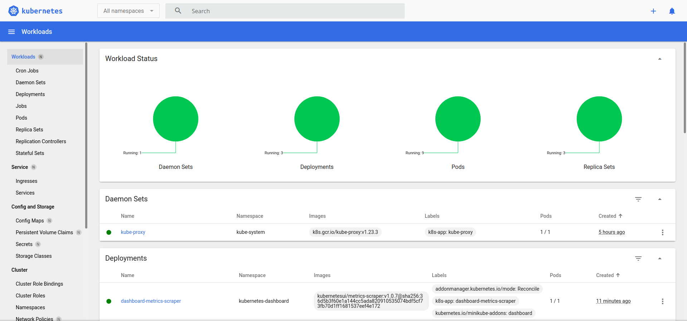

# Tutorials: Local Deployment

## 1.Installation

### Installing kubeadm, kubelet and kubectl

Prerequisite:

* 2 GB or more of RAM per machine (any less will leave little room for your apps).
* 2 CPUs or more.
* Full network connectivity between all machines in the cluster (public or private network is fine).
* Unique hostname, MAC address, and product_uuid for every node. See [here](https://kubernetes.io/docs/setup/production-environment/tools/kubeadm/install-kubeadm/#verify-mac-address) for more details.
* Certain ports are open on your machines. See [here](https://kubernetes.io/docs/setup/production-environment/tools/kubeadm/install-kubeadm/#check-required-ports) for more details. These [required ports](https://kubernetes.io/docs/reference/ports-and-protocols/) need to be open in order for Kubernetes components to communicate with each other. Use command `nc 127.0.0.1 6443` to check if a port is open.
* Swap disabled. You MUST disable swap in order for the kubelet to work properly.


#### Turn off swap

Turn off swap by command `swapoff -a` in all VMs.
```
# sudo swapoff -a
```

#### Kernel setting

Load `overlay` and `br_netfilter` modules. Check the active module loaded list. The removed module is not on the module loaded list.
```
# lsmod | grep overlay
# lsmod | grep br_netfilter

# sudo modprobe overlay
# sudo modprobe br_netfilter
```

Enable IP forwarding, known as routing or Kernel IP forwarding. The Linux IP forwarding feature is disabled by default.
```
# sudo cat <<EOF >> /etc/sysctl.conf
net.bridge.bridge-nf-call-iptables  = 1
net.ipv4.ip_forward                 = 1
net.ipv4.conf.all.forwarding        = 1
EOF
```

Enable the change.
```
# sudo sysctl --system
```


#### Install Containerd

Install and enable Containerd service.
```
# sudo zypper in containerd containerd-ctr

# sudo systemctl enable containerd.service 
# sudo systemctl start containerd.service 
# sudo systemctl status containerd.service 
```

Configure Containerd. Modify file `/etc/containerd/config.toml`. 
If file does not exist, execute the command `sudo mkdir -p /etc/containerd` to create it first.
```
# sudo containerd config default | sudo tee /etc/containerd/config.toml
# sudo vi /etc/containerd/config.toml
```

Update `sandbox_image` with new value `"registry.aliyuncs.com/google_containers/pause:3.6"`.
Update `SystemdCgroup ` with new value `true`.
```
[plugins]
  [plugins."io.containerd.gc.v1.scheduler"]

  [plugins."io.containerd.grpc.v1.cri"]
    sandbox_image = "registry.aliyuncs.com/google_containers/pause:3.6"
    
    [plugins."io.containerd.grpc.v1.cri".cni]
    [plugins."io.containerd.grpc.v1.cri".containerd]
      [plugins."io.containerd.grpc.v1.cri".containerd.default_runtime]
        [plugins."io.containerd.grpc.v1.cri".containerd.default_runtime.options]
      [plugins."io.containerd.grpc.v1.cri".containerd.runtimes]
        [plugins."io.containerd.grpc.v1.cri".containerd.runtimes.runc]

          [plugins."io.containerd.grpc.v1.cri".containerd.runtimes.runc.options]
            SystemdCgroup = true
```

Restart Containerd service.
```
# sudo systemctl restart containerd
# sudo systemctl status containerd
```


#### Install nerdctl

The goal of [`nerdctl`](https://github.com/containerd/nerdctl) is to facilitate experimenting the cutting-edge features of containerd that are not present in Docker.
Refer to [installation guide](https://rootlesscontaine.rs/getting-started/containerd/).
```
# wget https://github.com/containerd/nerdctl/releases/download/v0.21.0/nerdctl-0.21.0-linux-amd64.tar.gz
# tar -zxvf nerdctl-0.21.0-linux-amd64.tar.gz
# sudo cp nerdctl /usr/bin/
```

Verify nerdctl, e.g, list local Kubernetes containers.
```
# nerdctl --help
# nerdctl -n k8s.io ps
```


#### Install Kubernetes Tools

Install `kubeadm`, `kubelet`, `kubectl`.

* `kubeadm`: the command to bootstrap the cluster.
* `kubelet`: the component that runs on all of the machines in your cluster and does things like starting pods and containers.
* `kubectl`: the command line util to talk to your cluster.

Install CNI plugins (required for most pod network):
```
# CNI_VERSION="v0.8.2"
# ARCH="amd64"
# sudo mkdir -p /opt/cni/bin
# curl -L "https://github.com/containernetworking/plugins/releases/download/${CNI_VERSION}/cni-plugins-linux-${ARCH}-${CNI_VERSION}.tgz" | sudo tar -C /opt/cni/bin -xz
```

Install `crictl` (required for kubeadm / Kubelet Container Runtime Interface (CRI))
```
# DOWNLOAD_DIR=/usr/local/bin
# CRICTL_VERSION="v1.22.0"
# ARCH="amd64"
# curl -L "https://github.com/kubernetes-sigs/cri-tools/releases/download/${CRICTL_VERSION}/crictl-${CRICTL_VERSION}-linux-${ARCH}.tar.gz" | sudo tar -C $DOWNLOAD_DIR -xz
```


Install `kubeadm`, `kubelet`, `kubectl`.
```
# DOWNLOAD_DIR=/usr/local/bin
# RELEASE="$(curl -sSL https://dl.k8s.io/release/stable.txt)"
# ARCH="amd64"
# cd $DOWNLOAD_DIR
# sudo curl -L --remote-name-all https://storage.googleapis.com/kubernetes-release/release/${RELEASE}/bin/linux/${ARCH}/{kubeadm,kubelet,kubectl}
# sudo chmod +x {kubeadm,kubelet,kubectl}
```

Add a `kubelet` systemd service, enable and start kubelet
```
# RELEASE_VERSION="v0.4.0"
# curl -sSL "https://raw.githubusercontent.com/kubernetes/release/${RELEASE_VERSION}/cmd/kubepkg/templates/latest/deb/kubelet/lib/systemd/system/kubelet.service" | sed "s:/usr/bin:${DOWNLOAD_DIR}:g" | sudo tee /etc/systemd/system/kubelet.service
# sudo mkdir -p /etc/systemd/system/kubelet.service.d
# curl -sSL "https://raw.githubusercontent.com/kubernetes/release/${RELEASE_VERSION}/cmd/kubepkg/templates/latest/deb/kubeadm/10-kubeadm.conf" | sed "s:/usr/bin:${DOWNLOAD_DIR}:g" | sudo tee /etc/systemd/system/kubelet.service.d/10-kubeadm.conf
# systemctl enable --now kubelet
# sudo systemctl status kubelet.service
```

The content of file `/etc/systemd/system/kubelet.service` is below.
```
[Unit]
Description=kubelet: The Kubernetes Node Agent
Documentation=https://kubernetes.io/docs/home/
Wants=network-online.target
After=network-online.target

[Service]
ExecStart=/usr/local/bin/kubelet
Restart=always
StartLimitInterval=0
RestartSec=10

[Install]
WantedBy=multi-user.target
```

The content of file `/etc/systemd/system/kubelet.service.d/10-kubeadm.conf` is below.
```
# Note: This dropin only works with kubeadm and kubelet v1.11+
[Service]
Environment="KUBELET_KUBECONFIG_ARGS=--bootstrap-kubeconfig=/etc/kubernetes/bootstrap-kubelet.conf --kubeconfig=/etc/kubernetes/kubelet.conf"
Environment="KUBELET_CONFIG_ARGS=--config=/var/lib/kubelet/config.yaml"
# This is a file that "kubeadm init" and "kubeadm join" generates at runtime, populating the KUBELET_KUBEADM_ARGS variable dynamically
EnvironmentFile=-/var/lib/kubelet/kubeadm-flags.env
# This is a file that the user can use for overrides of the kubelet args as a last resort. Preferably, the user should use
# the .NodeRegistration.KubeletExtraArgs object in the configuration files instead. KUBELET_EXTRA_ARGS should be sourced from this file.
EnvironmentFile=-/etc/default/kubelet
ExecStart=
ExecStart=/usr/local/bin/kubelet $KUBELET_KUBECONFIG_ARGS $KUBELET_CONFIG_ARGS $KUBELET_KUBEADM_ARGS $KUBELET_EXTRA_ARGS
```


Enable kubelet service on boot:
```
# sudo systemctl enable kubelet
```

At the moment, `kubelet.service` failed to start. 
`kubelet` was just installed without proper configuration. [Configuring each kubelet in your cluster using kubeadm](https://kubernetes.io/docs/setup/production-environment/tools/kubeadm/kubelet-integration/)


### Helm

Helm is the Kubernetes package manager. It doesn't come with Kubernetes. 

Three concepts of helm:

* A *Chart* is a Helm package. 
    * It contains all of the resource definitions necessary to run an application, tool, or service inside of a Kubernetes cluster. 
    * Think of it like the Kubernetes equivalent of a Homebrew formula, an Apt dpkg, or a Yum RPM file.
* A *Repository* is the place where charts can be collected and shared. 
    * It's like Perl's CPAN archive or the Fedora Package Database, but for Kubernetes packages.
* A *Release* is an instance of a chart running in a Kubernetes cluster. 
    * One chart can often be installed many times into the same cluster. And each time it is installed, a new release is created. 
    * Consider a MySQL chart. If you want two databases running in your cluster, you can install that chart twice. Each one will have its own release, which will in turn have its own release name.


Reference:

* [installation guide](https://helm.sh/docs/intro/install/)
* [binary release](https://github.com/helm/helm/releases)
* [source code](https://github.com/helm/helm).


Helm Client Installation: 
```
james@lizard:/opt> curl -fsSL -o get_helm.sh https://raw.githubusercontent.com/helm/helm/main/scripts/get-helm-3
james@lizard:/opt> chmod 700 get_helm.sh

james@lizard:/opt> ./get_helm.sh
Downloading https://get.helm.sh/helm-v3.9.0-linux-amd64.tar.gz
Verifying checksum... Done.
Preparing to install helm into /usr/local/bin
helm installed into /usr/local/bin/helm
```

Note:
[`helm init`](https://helm.sh/docs/helm/helm_init/) does not exist in Helm 3, following the removal of Tiller. You no longer need to install Tiller in your cluster in order to use Helm.

`helm search` can be used to search two different types of source:

* `helm search hub` searches the [Artifact Hub](https://artifacthub.io/), which lists helm charts from dozens of different repositories.
* `helm search repo` searches the repositories that you have added to your local helm client (with helm repo add). This search is done over local data, and no public network connection is needed.


### kind (optional)

Installing From Release Binaries, which are available on [releases page](https://github.com/kubernetes-sigs/kind/releases).
Refer to [Quich Start](https://kind.sigs.k8s.io/docs/user/quick-start/).

NOTE: `kind` does not require kubectl, but we will not be able to perform some of tasks without it. `kind` requires that you have Docker installed and configured.

Download the binary and copy to `/usr/local/bin` directory.
```
james@lizard:/opt> curl -Lo ./kind https://kind.sigs.k8s.io/dl/v0.14.0/kind-linux-amd64
james@lizard:/opt> chmod +x ./kind
james@lizard:/opt> sudo cp ./kind /usr/local/bin
```

To see all the clusters we have created.
```
james@lizard:/opt> kind get clusters
No kind clusters found.
```


### Minikube (optional)

Install Minikube by referring to the [guide](https://minikube.sigs.k8s.io/docs/start/).

Installation.
```
james@lizard:/opt> curl -LO https://storage.googleapis.com/minikube/releases/latest/minikube-linux-amd64
  % Total    % Received % Xferd  Average Speed   Time    Time     Time  Current
                                 Dload  Upload   Total   Spent    Left  Speed
100 69.2M  100 69.2M    0     0  5720k      0  0:00:12  0:00:12 --:--:-- 6328k

james@lizard:/opt> sudo install minikube-linux-amd64 /usr/local/bin/minikube

james@lizard:/opt> ll /usr/local/bin/minikube
-rwxr-xr-x 1 root root 72651748 May 28 14:56 /usr/local/bin/minikube
```

Start start cluster.
```
james@lizard:/opt> minikube start
minikube v1.25.2 on Opensuse-Leap 15.3
Using the docker driver based on existing profile
docker is currently using the btrfs storage driver, consider switching to overlay2 for better performance
Starting control plane node minikube in cluster minikube
Pulling base image ...
Updating the running docker "minikube" container ...
Preparing Kubernetes v1.23.3 on Docker 20.10.12 ...
  ▪ kubelet.housekeeping-interval=5ms
  ▪ Generating certificates and keys ...
  ▪ Booting up control plane ...
  ▪ Configuring RBAC rules ...
Verifying Kubernetes components...
  ▪ Using image gcr.io/k8s-minikube/storage-provisioner:v5
Enabled addons: default-storageclass, storage-provisioner
Done! kubectl is now configured to use "minikube" cluster and "default" namespace by default
```

Two folders were created after `minikube start`. 

* `~/.kube` : default config file was created here.
* `~/.minikube` : configure files of Minikube.


Check what Docker images has been pulled down and what containers are up after Minikube start.
```
james@lizard:/opt> docker images --all
REPOSITORY       TAG       IMAGE ID       CREATED        SIZE
kicbase/stable   v0.0.30   1312ccd2422d   3 months ago   1.14GB

james@lizard:/opt> docker container ls -all
CONTAINER ID   IMAGE                    COMMAND                  CREATED          STATUS          PORTS                                                                                                                                  NAMES
5ec9c519d1e1   kicbase/stable:v0.0.30   "/usr/local/bin/entr…"   39 minutes ago   Up 39 minutes   127.0.0.1:49157->22/tcp, 127.0.0.1:49156->2376/tcp, 127.0.0.1:49155->5000/tcp, 127.0.0.1:49154->8443/tcp, 127.0.0.1:49153->32443/tcp   minikube
```

Get all nodes and namespaces deployed by default after Minikube installed.
```
james@lizard:/opt> kubectl get nodes
NAME       STATUS   ROLES                  AGE     VERSION

james@lizard:/opt> kubectl get ns
NAME              STATUS   AGE
default           Active   4h51m
kube-node-lease   Active   4h51m
kube-public       Active   4h51m
kube-system       Active   4h51m
```

Enbale Minikube addon - Dashboard.
```
james@lizard:/opt> minikube addons list
james@lizard:/opt> minikube addons enable dashboard
```

Get all the services in all the namespaces.
```
james@lizard:/opt> kubectl get service --all-namespaces
NAMESPACE              NAME                        TYPE        CLUSTER-IP       EXTERNAL-IP   PORT(S)                  AGE
default                kubernetes                  ClusterIP   10.96.0.1        <none>        443/TCP                  5h2m
kube-system            kube-dns                    ClusterIP   10.96.0.10       <none>        53/UDP,53/TCP,9153/TCP   5h2m
kubernetes-dashboard   dashboard-metrics-scraper   ClusterIP   10.110.44.98     <none>        8000/TCP                 49s
kubernetes-dashboard   kubernetes-dashboard        ClusterIP   10.108.121.183   <none>        80/TCP                   49s

james@lizard:/opt> kubectl get svc --all-namespaces
NAMESPACE              NAME                        TYPE        CLUSTER-IP       EXTERNAL-IP   PORT(S)                  AGE
default                kubernetes                  ClusterIP   10.96.0.1        <none>        443/TCP                  5h2m
kube-system            kube-dns                    ClusterIP   10.96.0.10       <none>        53/UDP,53/TCP,9153/TCP   5h2m
kubernetes-dashboard   dashboard-metrics-scraper   ClusterIP   10.110.44.98     <none>        8000/TCP                 49s
kubernetes-dashboard   kubernetes-dashboard        ClusterIP   10.108.121.183   <none>        80/TCP                   49s
```

Get details of deployment kubernetes-dashboard.
```
james@lizard:/opt> kubectl get deployment -n kubernetes-dashboard
NAME                        READY   UP-TO-DATE   AVAILABLE   AGE
dashboard-metrics-scraper   1/1     1            1           5m54s
kubernetes-dashboard        1/1     1            1           5m54s
```

Explore the dashboard, and verify it via `http://localhost:9090`
```
james@lizard:/opt> kubectl -n kubernetes-dashboard port-forward deployment/kubernetes-dashboard 9090
```

The dashboard looks like below.



