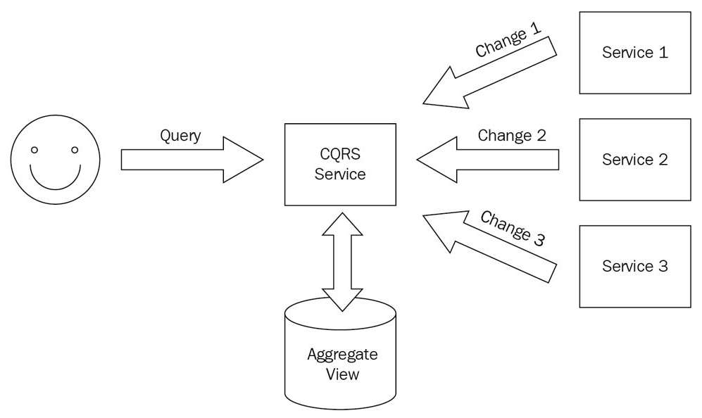
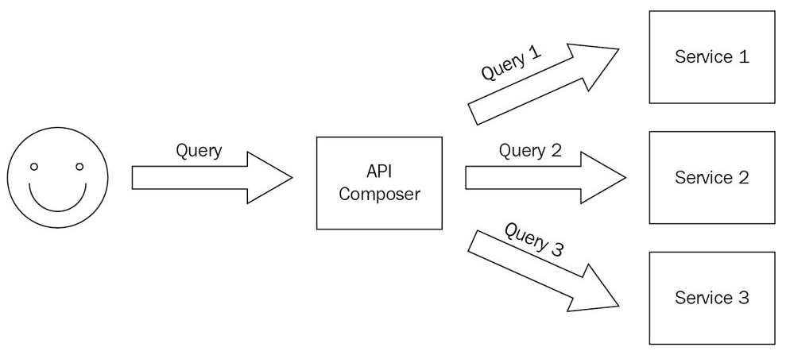

# Hands-On Microservices with Kubernetes

Sample code in [GitHub](https://github.com/PacktPublishing/Hands-On-Microservices-with-Kubernetes)

## Chapter 1 - Kubernetes

Introduction to Kubernetes for Developers, introduces you to Kubernetes. You will receive a whirlwind tour of Kubernetes and get an ideaof how well it aligns with microservices.

### Technical requirements

#### System environment for the demo

Linux: openSUSE 15.3

#### Installing Docker

Install Docker Desktop by referring the [guide](https://docs.docker.com/desktop/).

Install Docker engine by referring the [guide](https://docs.docker.com/engine/).

Install engine via openSUSE repository automatically.
```
james@lizard:/opt> sudo zypper in docker
```

Add current user to `docker` group.

The docker group is automatically created at package installation time. 
The user can communicate with the local Docker daemon upon its next login. 
The Docker daemon listens on a local socket which is accessible only by the root user and by the members of the docker group. 
```
james@lizard:/opt> sudo usermod -aG docker $USER
```

Enable and start Docker engine.
```
james@lizard:/opt> sudo systemctl enable docker.service 
Created symlink /etc/systemd/system/multi-user.target.wants/docker.service → /usr/lib/systemd/system/docker.service.

james@lizard:/opt> sudo systemctl start docker.service 

james@lizard:/opt> sudo systemctl status docker.service 
● docker.service - Docker Application Container Engine
     Loaded: loaded (/usr/lib/systemd/system/docker.service; enabled; vendor preset: disabled)
     Active: active (running) since Sat 2022-05-28 14:36:45 CST; 6s ago
       Docs: http://docs.docker.com
   Main PID: 31565 (dockerd)
      Tasks: 20
     CGroup: /system.slice/docker.service
             ├─31565 /usr/bin/dockerd --add-runtime oci=/usr/sbin/docker-runc
             └─31574 containerd --config /var/run/docker/containerd/containerd.toml --log-level warn

May 28 14:36:44 lizard systemd[1]: Starting Docker Application Container Engine...
May 28 14:36:44 lizard dockerd[31565]: time="2022-05-28T14:36:44+08:00" level=info msg="SUSE:secrets :: enabled"
May 28 14:36:44 lizard dockerd[31574]: time="2022-05-28T14:36:44+08:00" level=warning msg="deprecated version : `1`, please switch to version `2`"
May 28 14:36:44 lizard dockerd[31574]: time="2022-05-28T14:36:44.659346964+08:00" level=warning msg="failed to load plugin io.containerd.snapshotter.v1.devmapper" error="devmapper no>
May 28 14:36:44 lizard dockerd[31574]: time="2022-05-28T14:36:44.660040930+08:00" level=warning msg="could not use snapshotter devmapper in metadata plugin" error="devmapper not conf>
May 28 14:36:45 lizard dockerd[31565]: time="2022-05-28T14:36:45.018458102+08:00" level=warning msg="Your kernel does not support swap memory limit"
May 28 14:36:45 lizard dockerd[31565]: time="2022-05-28T14:36:45.018495482+08:00" level=warning msg="Your kernel does not support CPU realtime scheduler"
May 28 14:36:45 lizard dockerd[31565]: time="2022-05-28T14:36:45.018502682+08:00" level=warning msg="Your kernel does not support cgroup blkio weight"
May 28 14:36:45 lizard dockerd[31565]: time="2022-05-28T14:36:45.018506223+08:00" level=warning msg="Your kernel does not support cgroup blkio weight_device"
May 28 14:36:45 lizard systemd[1]: Started Docker Application Container Engine.
```


#### Installing kubectl

Install kubectl by referring the [guidd](https://kubernetes.io/docs/tasks/tools/).

Download kubectl.
```
james@lizard:/opt> curl -LO "https://dl.k8s.io/release/$(curl -L -s https://dl.k8s.io/release/stable.txt)/bin/linux/amd64/kubectl"
```

Install kubectl.
```
james@lizard:/opt> sudo install -o root -g root -m 0755 kubectl /usr/local/bin/kubectl

james@lizard:/opt> l /usr/local/bin/kubectl
-rwxr-xr-x 1 root root 45711360 May 28 14:49 /usr/local/bin/kubectl*
```

Test to ensure the version you installed is up-to-date:
```
james@lizard:/opt> kubectl version --client
WARNING: This version information is deprecated and will be replaced with the output from kubectl version --short.  Use --output=yaml|json to get the full version.
Client Version: version.Info{Major:"1", Minor:"24", GitVersion:"v1.24.1", GitCommit:"3ddd0f45aa91e2f30c70734b175631bec5b5825a", GitTreeState:"clean", BuildDate:"2022-05-24T12:26:19Z", GoVersion:"go1.18.2", Compiler:"gc", Platform:"linux/amd64"}
Kustomize Version: v4.5.4
```


#### Installing Minikube

Install Minikube by referring to the [guide](https://minikube.sigs.k8s.io/docs/start/).

Installation.
```
james@lizard:/opt> curl -LO https://storage.googleapis.com/minikube/releases/latest/minikube-linux-amd64
  % Total    % Received % Xferd  Average Speed   Time    Time     Time  Current
                                 Dload  Upload   Total   Spent    Left  Speed
100 69.2M  100 69.2M    0     0  5720k      0  0:00:12  0:00:12 --:--:-- 6328k

james@lizard:/opt> sudo install minikube-linux-amd64 /usr/local/bin/minikube

james@lizard:/opt> ll /usr/local/bin/minikube
-rwxr-xr-x 1 root root 72651748 May 28 14:56 /usr/local/bin/minikube
```

Start start cluster.
```
james@lizard:/opt> minikube start
minikube v1.25.2 on Opensuse-Leap 15.3
Using the docker driver based on existing profile
docker is currently using the btrfs storage driver, consider switching to overlay2 for better performance
Starting control plane node minikube in cluster minikube
Pulling base image ...
Updating the running docker "minikube" container ...
Preparing Kubernetes v1.23.3 on Docker 20.10.12 ...
  ▪ kubelet.housekeeping-interval=5m
  ▪ Generating certificates and keys ...
  ▪ Booting up control plane ...
  ▪ Configuring RBAC rules ...
Verifying Kubernetes components...
  ▪ Using image gcr.io/k8s-minikube/storage-provisioner:v5
Enabled addons: default-storageclass, storage-provisioner
Done! kubectl is now configured to use "minikube" cluster and "default" namespace by default
```

Two folders were created after `minikube start`. 

* `~/.kube` : default config file was created here.
* `~/.minikube` : configure files of Minikube.


Check what Docker images has been pulled down and what containers are up after Minikube start.
```
james@lizard:/opt> docker images --all
REPOSITORY       TAG       IMAGE ID       CREATED        SIZE
kicbase/stable   v0.0.30   1312ccd2422d   3 months ago   1.14GB

james@lizard:/opt> docker container ls -all
CONTAINER ID   IMAGE                    COMMAND                  CREATED          STATUS          PORTS                                                                                                                                  NAMES
5ec9c519d1e1   kicbase/stable:v0.0.30   "/usr/local/bin/entr…"   39 minutes ago   Up 39 minutes   127.0.0.1:49157->22/tcp, 127.0.0.1:49156->2376/tcp, 127.0.0.1:49155->5000/tcp, 127.0.0.1:49154->8443/tcp, 127.0.0.1:49153->32443/tcp   minikube
```

### The Kubernetes architecture

Diagram that illustrates the overall architecture of Kubernetes.


The control plane in production will be distributed across multiple machines for high availability and robustness. 
The control plane will deploy and run your pods (groups of containers) on these nodes, and then watch for changes and respond.

**The control plane:**

* API server.
  * Exposes the Kubernetes APIto the world. 
  * Keeps the cluster state in `etcd`.
* The etcd metadata store.
  * a consistent and reliable, distributed key-value store to keep complete cluster.  
  * The [etcd](https://coreos.com/etcd/) store is an open source project.
  * It is common to have three or five instances of etcd for redundancy. If you losethe data in your etcd store, you lose your cluster.
* Scheduler.
  * Responsible for scheduling pods to worker nodes.
* Controller manager.
  * It is a single process that contains multiplecontrollers for simplicity.
  * **Node controller**: Responsible for noticing and responding when nodes go down.
  * **Replication controller**: This makes sure that there is the correct number of pods for each replica set or replication controller object.
  * **Endpoints controller**: This assigns for each service an endpoints object that lists the service's pods.
  * **Service account and token controllers**: These initialize new namespaces with default service accounts and corresponding API access tokens.


**The data plane:** 

The data plane is the collection of the nodes in the cluster that run your containerized workloads as pods. 

* The kubelet: 
    * It is a Kubernetes agent. 
    * It's responsible for talking to the API serverand for running and managing the pods on the node.
        * Downloading pod secrets from the API server
        * Mounting volumes
        * Running the pod container via the **Container Runtime Interface (CRI)**
        * Reporting the status of the node and each pod
        * Probe container liveness (restart the pod's container if it crashes)
* The kube proxy:
    * The kube proxy is responsible for the networking aspects of the node.
* The container runtime
    * Kubernetes supports different container runtimes.
    * Kubernetes runs containers through an interface called **CRI**,which is based on **gRPC**. 
    * Each container runtime that implements CRI can be used on a node controlled by the kubelet.

    

* The kubectl:
    * Cluster management
    * Deployment
    * Troubleshooting and debugging
    * Resource management (Kubernetes objects)
    * Configuration and metadata


### Kubernetes and microservices

#### Packaging and deploying microservices

The packaging mechanism is simply containers.

Every microservice you develop will have a Dockerfile. The resulting image represents the deployment unit for that microservice.

In Kubernetes, your microservice image will run inside a pod (possibly alongside other containers).

The kubelet on the node will restart the pod's container if it crashes, but if something happens to the node itself, the pod is gone. 

Kubernetes has abstractions and resources that build on the pod.

ReplicaSets are sets of pods with a certain number of replicas. 
When you create a ReplicaSet, Kubernetes will make sure that the correct number of pods you specify always run in the cluster.

We use a deployment YAML file to deploy our microservice.

#### Exposing and discovering microservices

We use a service YAML file to expose our microservice so that it can be used by other services in/out the cluster. 
Kubernetes services are backed up by pods, identified by labels. 
Services discover each other inside the cluster, using DNS or environment variables.


#### Securing microservices.

* Namespaces.
    * Let you isolate different parts of your cluster from each other.
    * Pods running in anamespace can only access directly their own namespace. To access othernamespaces, they must go through public APIs.
* Service accounts.
    * Service accounts provide identity to your microservices.
    * You can associate service accounts with a pod.
    * Each service account is associated with a secret used to authenticate it.
* Secrets.
    * Secrets are managed per namespace.
    * Secrets are mounted in pods as either files (secret volumes) or environment variables.
    * The secrets can be encrypted at rest on etcd, and are always encrypted on the wire (over HTTPS). 
* Secrets communication.
    * All communication to the Kubernetes API from outside should be over HTTP, which by default is not authenticated.
    * Internal cluster communication between the API server and the kubelet on the node is over HTTPS too (the kubelet endpoint). 
* Network policies.
    * In a distributed system, beyond securing each container, pod, and node, it iscritical to also control communication over the network. 


#### Authenticating and authorizing microservices.

Role-based access control (RBAC) is is based on two concepts: role and binding.

A role is a set of permissions on resources defined as rules. 
There are two types of roles: Role, which applies to a single namespace, and ClusterRole, which applies to all namespaces in a cluster.
Each role has three components: API groups, resources, and verbs.
Cluster roles are very similar, except there is no namespace field because they apply to all namespaces.

A binding is associating a list of *subjects* (users, user groups, or service accounts) with a role. 
There are two types of binding, RoleBinding and ClusterRoleBinding, which correspond to Role and ClusterRole.
You can bind a ClusterRole to a subject in a single namespace.


#### Upgrading microservices

Scaling microservices. Two aspects:

* The first aspect is scaling the number of pods backing up a particular microservice. scaling out (horizontal scaling) by adding more servers to your architecture to spread the workload across more machines.
* The second aspect is the total capacity of the cluster. Scaling up (vertical scaling) by adding more hard drives and memory to increase the computing capacity of physical servers. 


Monitoring microservices.

* Third-party logs
* Application logs
* Application errors
* Kubernetes events
* Metrics, which are useful for detecting performance and system health problems or trends over time.


Logging. Several ways:

* Have a logging agent that runs on every node
* Inject a logging sidecar container to every application pod
* Have your application send its logs directly to a central logging service


Metrics. Kubernetes provide metrics server:

* heapster
* Prometheus


### Creating a local cluster

#### Playing with your cluster

Get all nodes deployed.
```
james@lizard:/opt> kubectl get nodes
NAME       STATUS   ROLES                  AGE     VERSION
minikube   Ready    control-plane,master   4h49m   v1.23.3
```

Get all namespaces.
```
james@lizard:/opt> kubectl get ns
NAME              STATUS   AGE
default           Active   4h51m
kube-node-lease   Active   4h51m
kube-public       Active   4h51m
kube-system       Active   4h51m
```

Enbale Minikube addon - Dashboard.
```
james@lizard:/opt> minikube addons list
james@lizard:/opt> minikube addons enable dashboard
```

Get all the services in all the namespaces.
```
james@lizard:/opt> kubectl get service --all-namespaces
NAMESPACE              NAME                        TYPE        CLUSTER-IP       EXTERNAL-IP   PORT(S)                  AGE
default                kubernetes                  ClusterIP   10.96.0.1        <none>        443/TCP                  5h2m
kube-system            kube-dns                    ClusterIP   10.96.0.10       <none>        53/UDP,53/TCP,9153/TCP   5h2m
kubernetes-dashboard   dashboard-metrics-scraper   ClusterIP   10.110.44.98     <none>        8000/TCP                 49s
kubernetes-dashboard   kubernetes-dashboard        ClusterIP   10.108.121.183   <none>        80/TCP                   49s

james@lizard:/opt> kubectl get svc --all-namespaces
NAMESPACE              NAME                        TYPE        CLUSTER-IP       EXTERNAL-IP   PORT(S)                  AGE
default                kubernetes                  ClusterIP   10.96.0.1        <none>        443/TCP                  5h2m
kube-system            kube-dns                    ClusterIP   10.96.0.10       <none>        53/UDP,53/TCP,9153/TCP   5h2m
kubernetes-dashboard   dashboard-metrics-scraper   ClusterIP   10.110.44.98     <none>        8000/TCP                 49s
kubernetes-dashboard   kubernetes-dashboard        ClusterIP   10.108.121.183   <none>        80/TCP                   49s
```

Get details of deployment kubernetes-dashboard.
```
james@lizard:/opt> kubectl get deployment -n kubernetes-dashboard
NAME                        READY   UP-TO-DATE   AVAILABLE   AGE
dashboard-metrics-scraper   1/1     1            1           5m54s
kubernetes-dashboard        1/1     1            1           5m54s
```

Explore the dashboard, and verify it via `http://localhost:9090`
```
james@lizard:/opt> kubectl -n kubernetes-dashboard port-forward deployment/kubernetes-dashboard 9090
```

The dashboard looks like below.


#### Installing Helm

Helm is the Kubernetes package manager. It doesn't come with Kubernetes. 

Three concepts of helm:

* A *Chart* is a Helm package. 
    * It contains all of the resource definitions necessary to run an application, tool, or service inside of a Kubernetes cluster. 
    * Think of it like the Kubernetes equivalent of a Homebrew formula, an Apt dpkg, or a Yum RPM file.
* A *Repository* is the place where charts can be collected and shared. 
    * It's like Perl's CPAN archive or the Fedora Package Database, but for Kubernetes packages.
* A *Release* is an instance of a chart running in a Kubernetes cluster. 
    * One chart can often be installed many times into the same cluster. And each time it is installed, a new release is created. 
    * Consider a MySQL chart. If you want two databases running in your cluster, you can install that chart twice. Each one will have its own release, which will in turn have its own release name.

Refer to [installation guide](https://helm.sh/docs/intro/install/) and [binary release](https://github.com/helm/helm/releases) and [source code](https://github.com/helm/helm).

Helm Client Installation: 
```
james@lizard:/opt> curl -fsSL -o get_helm.sh https://raw.githubusercontent.com/helm/helm/main/scripts/get-helm-3
james@lizard:/opt> chmod 700 get_helm.sh

james@lizard:/opt> ./get_helm.sh
Downloading https://get.helm.sh/helm-v3.9.0-linux-amd64.tar.gz
Verifying checksum... Done.
Preparing to install helm into /usr/local/bin
helm installed into /usr/local/bin/helm
```

Note:
[`helm init`](https://helm.sh/docs/helm/helm_init/) does not exist in Helm 3, following the removal of Tiller. You no longer need to install Tiller in your cluster in order to use Helm.


`helm search` can be used to search two different types of source:

* `helm search hub` searches the [Artifact Hub](https://artifacthub.io/), which lists helm charts from dozens of different repositories.
* `helm search repo` searches the repositories that you have added to your local helm client (with helm repo add). This search is done over local data, and no public network connection is needed.


## Chapter 2 - Microservices

Getting Started with Microservices, discusses various aspects,patterns, and approaches to common problems in microservice-basedsystems and how they compare to other common architectures, such asmonoliths and large services.


### Installing Go

Refer to [installation guide](https://go.dev/doc/install) to download and install Go locally.

Installation
```
james@lizard:/opt> sudo zypper in go

james@lizard:/opt> go version
go version go1.18.2 linux/amd64
```


Choosing source control strategy. There are two main approaches:

* monorepo
    * Your entire code base is in a single source controlrepository.
* multiple repos
    * Each project, and often each library, has a separate source control repository. 
* Hybrid
    * Each repository contains multiple services and projects. 
    * Each repository is isolated from the other repositories, but within each repo, multiple services and projectscan be developed in lockstep. 
    * This approach balances the pros and cons ofmonorepo and multiple repos.


Choosing data strategy

* One data store per microservice, which is a crucial element of the microservicearchitecture.
* Running distributed queries. It recommends to start with API composition andtransition to CQRS only if the proper conditions exist.


Employing Command Query Responsibility Segregation (CQRS).

* The CQRS service (responsible forqueries) receives a change notification from the three microservices (responsible for updates) and aggregates them into its own data store.
* When a query comes, the CQRS service responds by accessing its own aggregated view without hitting the microservices.
* It duplicates the data and adds complexity to the system.
* An illustration of CQRS in action.




Employing API composition.

* It exposes an API that can answer well-known queries across multiple microservices. 
* A query to an API composer service is translated under the covers to queries to three microservices.
* The failure of any service will fail the query. 
* An illustration of API composition in action




Maintaining distributed dataintegrity is a complex problem. 

* If you store all your data in a single relationaldatabase and specify proper constraints in your schema, then you can rely on the database engine to take care of data integrity. 
* If multiple microservices maintain your data in isolated data stores (relational ornon-relational). Data integrity is essential, but it must be maintained by your code. The saga pattern addresses this concern. 
* A common measure of data integrity is that all transactions that modify data havethe ACID properties.
    * Atomic: All operations in the transaction succeed or they all fail.
    * Consistent: The state of the data complies with all constraints before and after the transaction.
    * Isolated: Concurrent transactions behave as if serialized.
    * Durable: When a transaction completes successfully, the results are persisted.


There are different levels of persistence:

* Persistence to disk: Can survive restart of the node, but no disk failure
* Redundant memory on multiple nodes: Can survive restart of a node and disk failure, but not temporary failure of all the nodes
* Redundant disks: Can survive the failure of a disk
* Geo-distributed replicas: Can survive a whole data center being down
* Backups: Cheaper to store a lot of information, but slower to restore and often lags behind real time


The CAP theorem states that a distributed system can't have all three propertiesat the same time:

* Consistency
* Availability
* Partition resiliency


The basic idea of the **saga pattern** is that there is centralized management of the operations across all the microservices and that, for each operation, there is a compensating operation that will be executed if, for some reason, the entire transaction can't be completed. 
This achieves the atomicity property of ACID.

A **saga** is a set of operations and corresponding compensating operations on microservices. When an operation fails, its compensating operation and the compensating operations of all the previous operations are called in reverse order to roll back the entire state of the system.


## Chapter 3 - Sample Application

Delinkcious – the Sample Application, explores why we should choose Go as the programming language of Delinkcious; then we will lookat Go kit.

[Delinkcious source code](https://github.com/the-gigi/delinkcious)

[Delinkcious source code release v0.1](https://github.com/the-gigi/delinkcious/releases/tag/v0.1)

[Go kit](https://gokit.io/), which is a toolkit for microservice.


## Chapter 4 - CI/CD Pipeline

Setting Up the CI/CD Pipeline, teaches you about the problem the CI/CD pipeline solves, covers the different options for CI/CD pipelinesfor Kubernetes, and finally looks at building a CI/CD pipeline forDelinkcious.

## Chapter 5 - Configuring Microservices

Configuring Microservices with Kubernetes, moves you into the practical and real-world area of microservices configuration. Also, we will discuss Kubernetes-specific options and, in particular, ConfigMaps.

## Chapter 6 - Securing Microservices

Securing Microservices on Kubernetes, examines how to secure your microservices on Kubernetes in depth. We will also discuss the pillars that act as the foundation of microservice security on Kubernetes.

## Chapter 7 - APIs and Load Balancers

Talking to the World – APIs and Load Balancers, sees us open Delinkcious to the world and let users interact with it from outside the cluster. Also, we will add a gRPC-based news service that users can hitup to get news about other users they follow. Finally, we will add a message queue that lets services communicate in a loosely coupled manner.

## Chapter 8 - Stateful Services

Working with Stateful Services, delves into the Kubernetesstorage model. We will also extend the Delinkcious news service to store itsdata in Redis, instead of in memory.

## Chapter 9 Serverless Tasks

Running Serverless Tasks on Kubernetes, dives into one of thehottest trends in cloud-native systems: serverless computing (also knownas Function as a Service, or FaaS). Also, we'll cover other ways to doserverless computing in Kubernetes.

## Chapter 10 - Testing Microservices

Testing Microservices, covers the topic of testing and its variousflavors: unit testing, integration testing, and all kinds of end-to-end testing.We also delve into how Delinkcious tests are structured.

## Chapter 11 - Deploying Microservices

Deploying Microservices, deals with two related, yet separate,themes: production deployments and development deployments. 

## Chapter 12 - Operationing Microservices

Monitoring, Logging, and Metrics, focuses on the operational side of running a large-scale distributed system on Kubernetes, as well ason how to design the system and what to take into account to ensure atop-notch operational posture. 

## Chapter 13 - Service Mesh 

Service Mesh – Working with Istio, reviews the hot topic ofservice meshes and, in particular, Istio. This is exciting because service meshes are a real game changer.

## Chapter 14 - The Future

The Future of Microservices and Kubernetes, covers the topicsof Kubernetes and microservices, and will help us learn how to decide whenit's the right time to adopt and invest in newer technologies.


## Reference: 

* [The code of the book](https://github.com/huyuhui001/Hands-On-Microservices-with-Kubernetes)
* [Kubernetes document](https://kubernetes.io/docs/tasks/)
* [Minikube documents](https://minikube.sigs.k8s.io/docs/start/)
* [Helm document](https://helm.sh/docs/intro/quickstart/) and [source code](https://github.com/helm/helm) and [artifact hub](https://artifacthub.io/)
* [Go language document](https://go.dev/doc/install)


