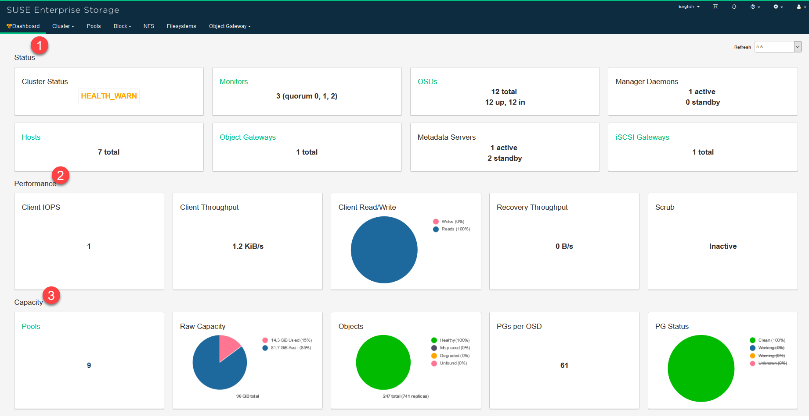
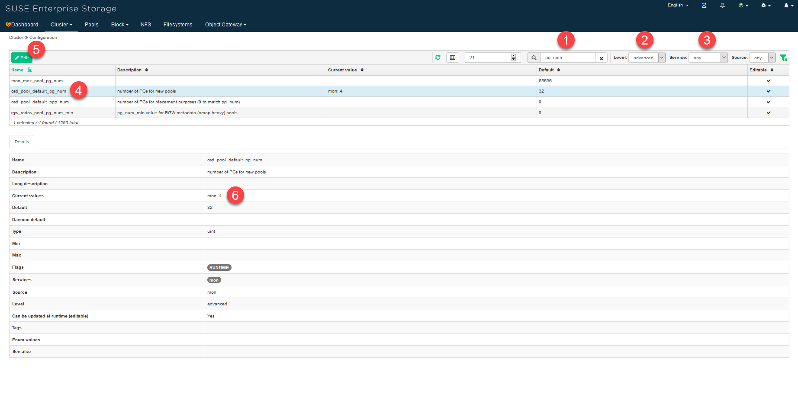
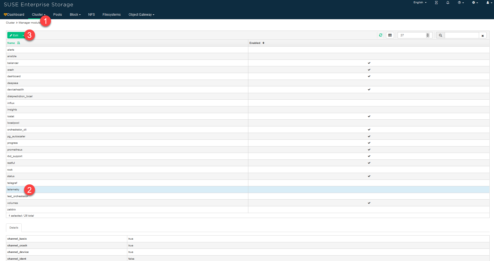
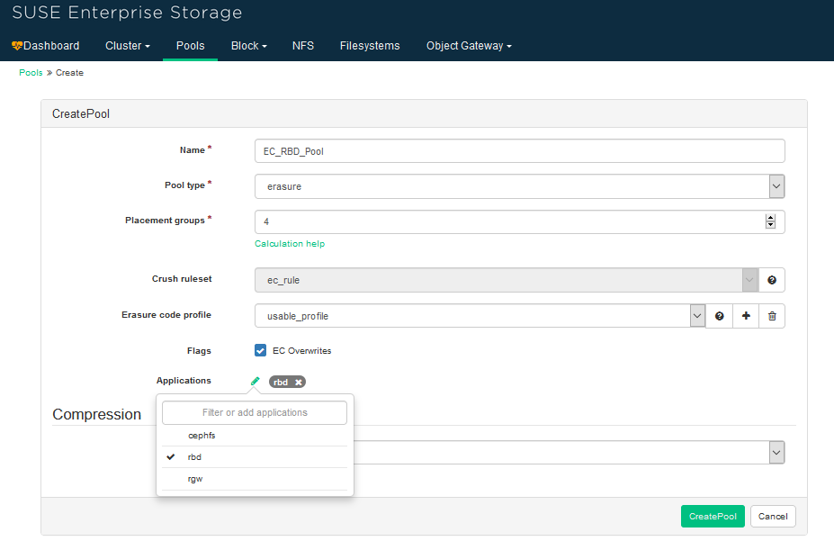
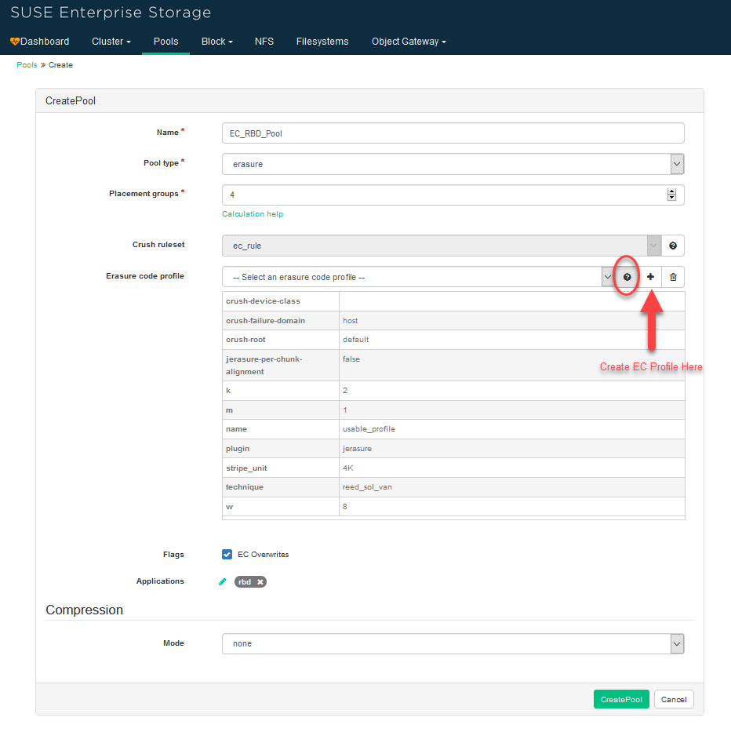
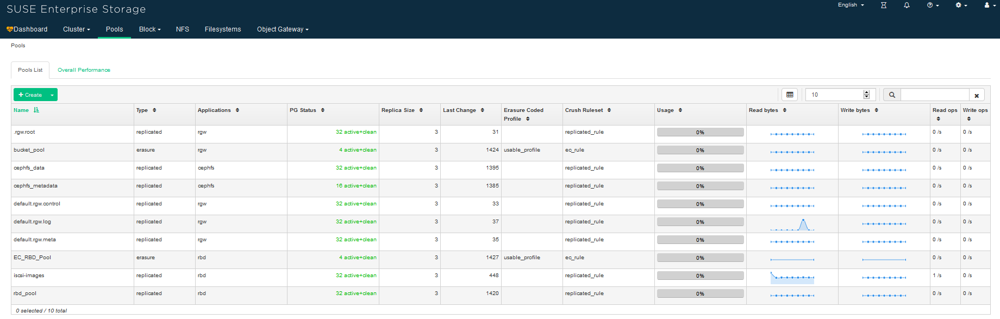
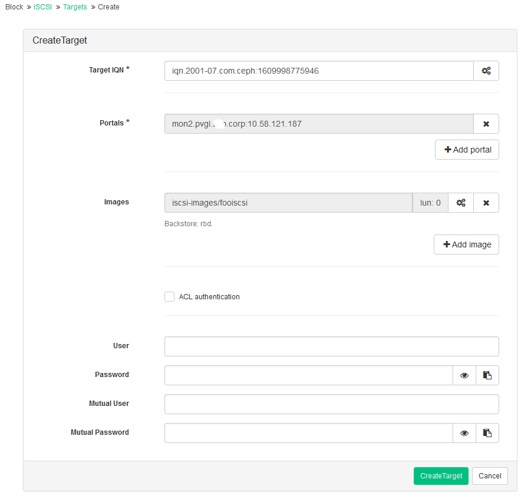

# SUSE Enterprise Storage 6 Installation and Basic Operation


## 1. Installation

### 1.1. Environment Setup

In this demo, I use below environment, including VM setting and software installed. 

All VMs installed here was built on a physical host `10.58.121.68`.

    Host Server:
        10.58.121.68  root / rootroot

    Account
        root / root123

    Gateway:
        10.58.120.1

    Network Mask:
        255.255.254.0

    Nameserver:
        10.58.32.32
        10.33.50.20

    Domain Search
        sha.me.corp
        dhcp.sha.me.corp
        me.corp
        ind.me.corp
        bgr.me.corp


SUSE Server 15 SP1 Extensions and Modules were installed as below.

	[x] SUSE Enterprise Storage 6 
    [x] Basesystem Module 15 SP1 x86_64
    [x] Server Applications Module 15 SP1 x86_64

Disable Services is as below:

	AppArmor
	Firewall

Enable Services is as below.
    SSH


Register SLES15.1 to local SMT.

    # SUSEConnect --url https://smtproxy.ind.me.corp


Demo Environment summary is below.

Alias   |Host Name              | Memory    | Disk          | eth0              | eth0 mac address 
--------|-----------------------|-----------|---------------|-------------------|------------------
sles01  | admin (salt-master)	| 16GB	    | Disk1: 20G	| 10.58.121.181/23  | 52:54:00:23:7d:cd
sles02	| data1	                | 16GB	    | Disk1: 20G	| 10.58.121.182/23	| 52:54:00:5f:ce:6f
		| 	                    |           | Disk2: 8G     |                   | 
		| 	                    |           | Disk3: 8G     |                   | 
		| 	                    |           | Disk4: 8G     |                   | 
sles03	| data2	                | 16GB	    | Disk1: 20G	| 10.58.121.183/23	| 52:54:00:6f:f2:23
		| 	                    |           | Disk2: 8G     |                   | 
		| 	                    |           | Disk3: 8G     |                   | 
		| 	                    |           | Disk4: 8G     |                   | 
sles04	| data3	                | 16GB	    | Disk1: 20G	| 10.58.121.184/23	| 52:54:00:93:4c:67
		| 	                    |           | Disk2: 8G     |                   | 
		| 	                    |           | Disk3: 8G     |                   | 
		| 	                    |           | Disk4: 8G     |                   | 
sles05	| data4	                | 16GB	    | Disk1: 20G	| 10.58.121.185/23	| 52:54:00:90:b0:b0
		| 	                    |           | Disk2: 8G     |                   | 
		| 	                    |           | Disk3: 8G     |                   | 
		| 	                    |           | Disk4: 8G     |                   | 
sles06	| mon1	                | 16GB	    | Disk1: 20G	| 10.58.121.186/23	| 52:54:00:46:43:7a
sles07	| mon2	                | 16GB	    | Disk1: 20G	| 10.58.121.187/23	| 52:54:00:00:fe:6b
sles08	| mon3	                | 16GB	    | Disk1: 20G	| 10.58.121.188/23	| 52:54:00:60:a3:92


Add hostname to file `/etc/hosts` (all nodes)

* If you do not specify a cluster network during Ceph deployment, it assumes a single public network environment.
* Make sure that the fully qualified domain name (FQDN) of each node can be resolved to the public network IP address by all other nodes. 

```
# vi /etc/hosts
10.58.121.181   admin.sha.me.corp admin salt
10.58.121.182   data1.sha.me.corp data1
10.58.121.183   data2.sha.me.corp data2
10.58.121.184   data3.sha.me.corp data3
10.58.121.185   data4.sha.me.corp data4
10.58.121.186   mon1.sha.me.corp mon1
10.58.121.187   mon2.sha.me.corp mon2
10.58.121.188   mon3.sha.me.corp mon3
```

Add all nodes as trust ssh access (root account)
```
# cd ~
# ssh-keygen -t rsa
# ssh-copy-id -i ~/.ssh/id_rsa.pub root@admin
# ssh-copy-id -i ~/.ssh/id_rsa.pub root@data1
# ssh-copy-id -i ~/.ssh/id_rsa.pub root@data2
# ssh-copy-id -i ~/.ssh/id_rsa.pub root@data3
# ssh-copy-id -i ~/.ssh/id_rsa.pub root@data4
# ssh-copy-id -i ~/.ssh/id_rsa.pub root@mon1
# ssh-copy-id -i ~/.ssh/id_rsa.pub root@mon2
# ssh-copy-id -i ~/.ssh/id_rsa.pub root@mon3

# ssh admin.sha.me.corp
# ssh data1.sha.me.corp
# ssh data2.sha.me.corp
# ssh data3.sha.me.corp
# ssh data4.sha.me.corp
# ssh mon1.sha.me.corp
# ssh mon2.sha.me.corp
# ssh mon3.sha.me.corp
# ssh salt
# ssh admin
# ssh data1
# ssh data2
# ssh data3
# ssh data4
# ssh mon1
# ssh mon2
# ssh mon3
```

Disable firewall (all nodes)
```
# sudo /sbin/SuSEfirewall2 off
# firewall-cmd --state
	not running

# systemctl stop firewalld.service
# systemctl status firewalld.service
	firewalld.service - firewalld - dynamic firewall daemon
	Loaded: loaded (/usr/lib/systemd/system/firewalld.service; disabled; vendor preset: disabled)
	Active: inactive (dead)
  Docs: man:firewalld(1)

```

Disable IPv6 (all nodes) and Set kernel pid to max value (all nodes)
```
# vi /etc/sysctl.conf
net.ipv6.conf.all.disable_ipv6 = 1
net.ipv6.conf.default.disable_ipv6 = 1
net.ipv6.conf.lo.disable_ipv6 = 1
kernel.pid_max = 4194303
# sysctl -p
```

Set `DEV_ENV=true` in `/etc/profile.local` in all nodes

Install basic software (all nodes)
```
# zypper in -y -t pattern yast2_basis base
# zypper in -y net-tools vim man sudo tuned irqbalance
# zypper in -y ethtool rsyslog iputils less supportutils-plugin-ses
# zypper in -y net-tools-deprecated tree wget
```

Configure NTP service (all nodes), Setting via YaST2 and add server `cn.pool.ntp.,org`. 

And `/etc/chrony.conf` file looks like below.
```
admin:~ # cat /etc/chrony.conf
# Use public servers from the pool.ntp.org project.
pool cn.pool.ntp.org iburst
! pool pool.ntp.org iburst

# Record the rate at which the system clock gains/losses time.
driftfile /var/lib/chrony/drift

# Allow the system clock to be stepped in the first three updates
# if its offset is larger than 1 second.
makestep 1.0 3

# Enable kernel synchronization of the real-time clock (RTC).
rtcsync

# Enable hardware timestamping on all interfaces that support it.
#hwtimestamp *

# Increase the minimum numbgr of selectable sources required to adjust
# the system clock.
#minsources 2

# Allow NTP client access from local network.
#allow 192.168.0.0/16

# Serve time even if not synchronized to a time source.
#local stratum 10

# Specify file containing keys for NTP authentication.
#keyfile /etc/chrony.keys

# Get TAI-UTC offset and leap seconds from the system tz database.
#leapsectz right/UTC

# Specify directory for log files.
logdir /var/log/chrony

# Select which information is logged.
#log measurements statistics tracking

# Also include any directives found in configuration files in /etc/chrony.d
include /etc/chrony.d/*.conf
```

Make `/etc/chrony.conf` effective.

```
# systemctl enable chronyd.service
# systemctl restart chronyd.service
# systemctl status chronyd.service

# chronyc sources
```


### 1.2. Install Packages

Install `salt-minion` on all nodes. And start the service. 

```
Hostname is in file `/etc/salt/minion_id`
# zypper in -y salt-minion

Uncomment below to let all nodes know who is master
# vi /etc/salt/minion
master: salt 

# systemctl enable salt-minion.service
# systemctl start salt-minion.service
# systemctl status salt-minion.service
```

Install Ceph in admin node. Check log in `/var/log/salt`

```
admin:~ # zypper in -y salt-master
admin:~ # systemctl enable salt-master.service
admin:~ # systemctl start salt-master.service
admin:~ # systemctl status salt-master.service

Note: ganesha will be installed on mon1, not admin node.
admin:~ # zypper se ganesha
admin:~ # zypper in nfs-ganesha
admin:~ # systemctl enable nfs-ganesha
admin:~ # systemctl start nfs-ganesha
admin:~ # systemctl status nfs-ganesha
```

admin:~ # cd /var/log/salt

List fingerprints of all unaccepted minion keys on the Salt master.
```
admin:~ # salt-key -F
Local Keys:
master.pem:  c0:e5:***:04:c7
master.pub:  43:73:***:6a:34
Unaccepted Keys:
admin.sha.me.corp:  fe:51:***:b9:48
mon1.sha.me.corp:  94:13:***:91:63
mon2.sha.me.corp:  c0:fd:***:39:3f
mon3.sha.me.corp:  38:fc:***:2e:05
data1.sha.me.corp:  b6:6c:***:63:4f
data2.sha.me.corp:  ab:14:***:c8:ac
data3.sha.me.corp:  90:3f:***:76:3b
data4.sha.me.corp:  d8:12:***:f1:20
```

If the minions' fingerprints match, accept them
```
admin:~ # salt-key --accept-all
The following keys are going to be accepted:
Unaccepted Keys:
admin.sha.me.corp
mon1.sha.me.corp
mon2.sha.me.corp
mon3.sha.me.corp
data1.sha.me.corp
data2.sha.me.corp
data3.sha.me.corp
data4.sha.me.corp
Proceed? [n/Y] Y
Key for minion admin.sha.me.corp accepted.
Key for minion mon1.sha.me.corp accepted.
Key for minion mon2.sha.me.corp accepted.
Key for minion mon3.sha.me.corp accepted.
Key for minion data1.sha.me.corp accepted.
Key for minion data2.sha.me.corp accepted.
Key for minion data3.sha.me.corp accepted.
Key for minion data4.sha.me.corp accepted.
```

Verify that the keys have been accepted
```
admin:~ # salt-key -F
admin:~ # salt-key --list-all
Accepted Keys:
admin.sha.me.corp
data1.sha.me.corp
data2.sha.me.corp
data3.sha.me.corp
data4.sha.me.corp
mon1.sha.me.corp
mon2.sha.me.corp
mon3.sha.me.corp
Denied Keys:
Unaccepted Keys:
Rejected Keys:
```

Zero out all drivers which will be used as OSDs (optional)
```
data1:~ lsblk

data1:~ # for I in {b,c,d}; do dd if=/dev/zero of=dev/sd$i bs=512 count=40 oflag=direct; done

data2:~ # for I in {b,c,d}; do dd if=/dev/zero of=dev/sd$i bs=512 count=40 oflag=direct; done

data3:~ # for I in {b,c,d}; do dd if=/dev/zero of=dev/sd$i bs=512 count=40 oflag=direct; done
```

Install DeepSea
```
admin:~ # zypper in -y deepsea
```

Edit the `/srv/pillar/ceph/deepsea_minions.sls` file on the Salt master (admin node) and add or replace the following line: 

```
admin:~ # vi /srv/pillar/ceph/deepsea_minions.sls
# Choose minions with a deepsea grain
deepsea_minions: 'G@deepsea:*'  #Match all Salt minions in the cluster
# Choose all minions
# deepsea_minions: '*'  #Match all minions with the 'deepsea' grain
# Choose custom Salt targeting
# deepsea_minions: 'ses*'
# deepsea_minions: 'ceph* or salt'
```

Target the Minions

* Affirm salt-master (admin node) can communicate with the minions. And deploy the grains from admin node to all minions.
```
admin:~ # salt '*' test.ping
mon1.sha.me.corp:
    True
data4.sha.me.corp:
    True
data3.sha.me.corp:
    True
data2.sha.me.corp:
    True
data1.sha.me.corp:
    True
mon3.sha.me.corp:
    True
admin.sha.me.corp:
    True
mon2.sha.me.corp:
    True
```

Apply the 'deepsea' grain to a group of minions, and target with a DeepSea Grain
```
admin:~ # salt '*' grains.append deepsea default
data3.sha.me.corp:
    The val default was already in the list deepsea
mon2.sha.me.corp:
    The val default was already in the list deepsea
data1.sha.me.corp:
    The val default was already in the list deepsea
data4.sha.me.corp:
    The val default was already in the list deepsea
data2.sha.me.corp:
    The val default was already in the list deepsea
mon3.sha.me.corp:
    The val default was already in the list deepsea
admin.sha.me.corp:
    The val default was already in the list deepsea
mon1.sha.me.corp:
    The val default was already in the list deepsea

admin:~ # salt -G 'deepsea:*' test.ping  (The following command is an equivalent)
admin:~ # salt -C 'G@deepsea:*' test.ping
admin.sha.me.corp:
    True
data3.sha.me.corp:
    True
mon1.sha.me.corp:
    True
mon2.sha.me.corp:
    True
data2.sha.me.corp:
    True
data4.sha.me.corp:
    True
mon3.sha.me.corp:
    True
data1.sha.me.corp:
    True
```


### 1.3. Stage 0 — the preparation

Run Stage 0—the preparation

* During this stage, all required updates are applied and your system may be rebooted. 
* If there are errors, re-run the stage.
```
admin:~ # deepsea stage run ceph.stage.0 (The following commands are equivalents)
admin:~ # salt-run state.orch ceph.stage.0
admin:~ # salt-run state.orch ceph.stage.prep
```

Run Stage 1—the discovery

* Here all hardware in your cluster is being detected and necessary information for the Ceph configuration is being collected.
* The discovery stage collects data from all minions and creates configuration fragments that are stored in the directory `/srv/pillar/ceph/proposals`. The data are stored in the YAML format in `*.sls` or `*.yml` files

```
admin:~ # deepsea stage run ceph.stage.1 (The following commands are equivalents)
admin:~ # salt-run state.orch ceph.stage.1
admin:~ # salt-run state.orch ceph.stage.discovery
```

### 1.4. Stage 2 — the configuration

Run Stage 2 — the configuration — you need to prepare configuration data in a particular format. 

* The assignment follows this pattern:
    * `role-ROLE_NAME/PATH/FILES_TO_INCLUDE`  (NOTE, the parent directory of PATH is `/srv/pillar/ceph/`)
* To avoid trouble with performance and the upgrade procedure, do not deploy the Ceph OSD, Metadata Server, or Ceph Monitor role to the Admin Node. 
* Monitors, Metadata Server, and gateways can be co-located on the OSD nodes.
* If you are using CephFS, S3/Swift, iSCSI, at least two instances of the respective roles (Metadata Server, Object Gateway, iSCSI) are required for redundancy and availability. 

```
admin:~ # cp /usr/share/doc/packages/deepsea/examples/policy.cfg-rolebased /srv/pillar/ceph/proposals/policy.cfg
admin:~ # vi /srv/pillar/ceph/proposals/policy.cfg
## Cluster Assignment
# Add all nodes into Ceph cluster
cluster-ceph/cluster/*.sls

## Roles
# The Admin node fills the “master” and “admin” roles for DeepSea
# The master role is mandatory, always add a similar line to the following
role-master/cluster/admin*.sls
role-admin/cluster/admin*.sls

# Monitoring
# Cluster monitoring and data graphs, most commonly they run on Admin node
# NFS Ganesha is configured via the file /etc/ganesha/ganesha.conf
# As additional configuration is required to install NFS Ganesha, you can install NFS Ganesha later. 
# The following requirements need to be met before DeepSea stages 2 and 4 can be executed to install NFS Ganesha:
#  a)At least one node needs to be assigned the role-ganesha.
#  b)You can define only one role-ganesha per minion.
#  c)NFS Ganesha needs either an Object Gateway or CephFS to work, otherwise the validation will fail in Stage 3.
#  d)The kernel based NFS needs to be disabled on minions with the role-ganesha role. 
role-prometheus/cluster/admin*.sls
role-grafana/cluster/mon1*.sls

# MON
# The minion will provide the monitor service to the Ceph cluster
role-mon/cluster/mon*.sls

# MGR
# The Ceph manager daemon which collects all the state information from the whole cluster
# Deploy it on all minions where you plan to deploy the Ceph monitor role
role-mgr/cluster/mon1*.sls

# MDS
# The minion will provide the metadata service to support CephFS
role-mds/cluster/mon*.sls

# IGW
# The minion will act as an iSCSI Gateway
role-igw/cluster/mon2*.sls

# RGW
# The minion will act as an Object Gateway
role-rgw/cluster/mon3*.sls

# Storage
# Use this role to specify storage nodes
# It points to data1~4 nodes with a wildcard.
role-storage/cluster/data*.sls

# COMMON
# It includes configuration files generated during the discovery (Stage 1)
# Accept the default values for common configuration parameters such as fsid and public_network
config/stack/default/global.yml
config/stack/default/ceph/cluster.yml

admin:~ # deepsea stage run ceph.stage.2  (The following commands are equivalents)
admin:~ # salt-run state.orch ceph.stage.2
admin:~ # salt-run state.orch ceph.stage.configure
```

After the command succeeds, run below command to view the pillar data for the specified minions
```
admin:~ # salt 'mon*' pillar.items
admin:~ # salt '*' saltutil.pillar_refresh
```


Check time server (admin node)  (the directory /srv/pillar/ceph/stack was initialized after deepsea installed, but global.yml file was not created yet until stage 2)

By default, DeepSea uses the Admin Node as the time server for other cluster nodes.
``` 
admin:~ # cat /srv/pillar/ceph/stack/default/global.yml  (this file will be generated after stage 2)
monitoring:
  prometheus:
    metric_relabel_config:
      ceph: []
      grafana: []
      node_exporter: []
      prometheus: []
    relabel_config:
      ceph: []
      grafana: []
      node_exporter: []
      prometheus: []
    rule_files: []
    scrape_interval:
      ceph: 10s
      grafana: 10s
      node_exporter: 10s
      prometheus: 10s
    target_partition:
      ceph: 1/1
      grafana: 1/1
      node_exporter: 1/1
      prometheus: 1/1
time_server: admin.sha.me.corp
```

Verify network  (the directory `/srv/pillar/ceph/stack` was initialized after deepsea installed, but cluster.yml file was not created until stage 2 )

```
admin:~ # cat /srv/pillar/ceph/stack/ceph/cluster.yml --nothing
admin:~ # cat /srv/pillar/ceph/stack/default/ceph/cluster.yml
available_roles:
- storage
- admin
- mon
- mds
- mgr
- igw
- grafana
- prometheus
- storage
- rgw
- ganesha
- client-cephfs
- client-radosgw
- client-iscsi
- client-nfs
- benchmark-rbd
- benchmark-blockdev
- benchmark-fs
- master
cluster_network: 10.58.120.0/23
fsid: 343ee7d3-232f-4c71-8216-1edbc55ac6e0
public_network: 10.58.120.0/23
```

Note: customized file will overwrite default one.

Default file:`/srv/pillar/ceph/stack/default/ceph/cluster.yml`

Customized file:`/srv/pillar/ceph/stack/ceph/cluster.yml`


Check DriveGroup

* DriveGroups specify the layouts of OSDs in the Ceph cluster. 
* They are defined in a single file `/srv/salt/ceph/configuration/files/drive_groups.yml`

```
admin:~ # cat /srv/salt/ceph/configuration/files/drive_groups.yml
	default_drive_group_name:
	  target: 'data*'    <--original: 'I@role:storage'
	  data_devices:
	    all: true

admin:~ # salt 'data*' pillar.items | grep -B5 stroage
```

### 1.5. Stage 3 — the deployment

Run Stage 3 — the deployment — creates a basic Ceph cluster with mandatory Ceph services.

*  This Deployment stage has more than 60 automated steps. Be patient and make sure the stage completes successfully before proceeding.

Set dev environment and disable subvolume:

```
admin:~ # vi /srv/pillar/ceph/stack/global.yml
admin:~ # vi /srv/pillar/ceph/stack/default/global.yml
monitoring:
  prometheus:
    metric_relabel_config:
      ceph: []
      grafana: []
      node_exporter: []
      prometheus: []
    relabel_config:
      ceph: []
      grafana: []
      node_exporter: []
      prometheus: []
    rule_files: []
    scrape_interval:
      ceph: 10s
      grafana: 10s
      node_exporter: 10s
      prometheus: 10s
    target_partition:
      ceph: 1/1
      grafana: 1/1
      node_exporter: 1/1
      prometheus: 1/1
time_server: admin.sha.me.corp
DEV_ENV: True
subvolume_init: disabled

admin:~ # salt '*' saltutil.pillar_refresh
```

Note: customized file will overwrite default one.

Default file:`/srv/pillar/ceph/stack/default/global.yml`

Customized file:`/srv/pillar/ceph/stack/global.yml`

```
admin:~ # deepsea stage run ceph.stage.3  (The following commands are equivalents)
admin:~ # salt-run state.orch ceph.stage.3
admin:~ # salt-run state.orch ceph.stage.deploy
```

After the command succeeds, run the following to check the status:
```
admin:~ # ceph -s
```

Below comands return you a structure of matching disks based on your DriveGroups. (will show available information after stage 3)
```
admin:~ # salt-run disks.Report
admin:~ # salt-run disks.list
admin:~ # salt-run disks.details
```

### 1.6. Stage 4 — the services

Run Stage 4 — the services — additional features of Ceph like iSCSI, Object Gateway and CephFS can be installed in this stage. Each is optional. 

```
admin:~ # deepsea stage run ceph.stage.4  (The following commands are equivalents)
admin:~ # salt-run state.orch ceph.stage.4
admin:~ # salt-run state.orch ceph.stage.services

admin:~ # ceph osd lspools
1 iscsi-images
2 cephfs_data
3 cephfs_metadata
4 .rgw.root
5 default.rgw.control
6 default.rgw.meta
7 default.rgw.log
```

Before logon to dashboard via url, need get credentials first

```
admin:~ # salt-call grains.get dashboard_creds
local:
    ----------
    admin:
        <your password>   --> the password was changed to mypassword to log on to dashboard

admin:~ # ceph mgr services
{
    "dashboard": "https://mon1.sha.me.corp:8443/",
    "prometheus": "http://mon1.sha.me.corp:9283/"
}

https://10.58.121.186:8443
http://10.58.121.186:9283


admin:~ # watch ceph -s
Every 2.0s: ceph -s                  admin: Mon Oct  5 14:41:51 2020
  cluster:
    id:     <id>
    health: HEALTH_OK

  services:s: ceph -s
    mon: 3 daemons, quorum mon1,mon2,mon3 (age 87m)
    mgr: mon1(active, since 82m)
    mds: cephfs:1 {0=mon3=up:active} 2 up:standby
    osd: 12 osds: 12 up (since 85m), 12 in (since 85m)
    rgw: 1 daemon active (mon3)

  task status:
    scrub status:
        mds.mon3: idle

  data:
    pools:   7 pools, 576 pgs
    objects: 213 objects, 4.2 KiB
    usage:   12 GiB used, 84 GiB / 96 GiB avail
    pgs:     576 active+clean

  io:
    client:   852 B/s rd, 0 op/s rd, 0 op/s wr
```

### 1.7. Stage 5 — the removal stage
Run Stage 5 — the removal stage. This stage is not mandatory and during the initial setup it is usually not needed. In this stage the roles of minions and also the cluster configuration are removed. You need to run this stage when you need to remove a storage node from your cluster. 
```
admin:~ # deepsea stage run ceph.stage.
```

### 1.8. Installation Guide

[Deployment Guide (EN)](https://documentation.suse.com/ses/6/html/ses-all/book-storage-deployment.html)

[Deployment Guide (ZH)](https://documentation.suse.com/zh-cn/ses/6/html/ses-all/book-storage-deployment.html)


### 1.9. Issues during installation

[ERROR]: The Salt Master has cached the public key for this node

[SOLUTION]: Restart minions service


[ERROR]: This server_id is computed nor by Adler32 neither by CRC32

[SOLUTION]: [link](https://github.com/SUSE/DeepSea/issues/1593)


[QUESTION]: How to change new salt key
```
Stop salt-minion service
# systemctl stop salt-minion

Delete salt-minion pulic key
# rm /etc/salt/pki/minion/minion.pub
# rm /etc/salt/pki/minion/minion.pem

Change new minion_id
admin:~ # echo admin.sha.me.corp > /etc/salt/minion_id
data1:~ # echo data1.sha.me.corp > /etc/salt/minion_id
data2:~ # echo data2.sha.me.corp > /etc/salt/minion_id
data3:~ # echo data3.sha.me.corp > /etc/salt/minion_id
data4:~ # echo data4.sha.me.corp > /etc/salt/minion_id
mon1:~ # echo mon1.sha.me.corp > /etc/salt/minion_id
mon2:~ # echo mon2.sha.me.corp > /etc/salt/minion_id
mon3:~ # echo mon3.sha.me.corp > /etc/salt/minion_id

Delete old ID on admin node
# salt-key -D

Restart salt-minion service
# systemctl restart salt-minion

Accept all new key on admin node
admin:~ # salt-key -L
admin:~ # salt-key -A 
or
admin:~ # salt-key -a admin.sha.me.corp
data1:~ # salt-key -a data1.sha.me.corp
data2:~ # salt-key -a data2.sha.me.corp
data3:~ # salt-key -a data3.sha.me.corp
data4:~ # salt-key -a data4.sha.me.corp
mon1:~ # salt-key -a mon1.sha.me.corp
mon2:~ # salt-key -a mon2.sha.me.corp
mon3:~ # salt-key -a mon3.sha.me.corp
```


[ERROR] ['/var/lib/ceph subvolume missing on mon3.sha.me.corp', '/var/lib/ceph subvolume missing on mon1.sha.me.corp', '/var/lib/ceph subvolume missing on mon2.sha.me.corp', 'See /srv/salt/ceph/subvolume/README.md']

[SOLUTION]
Edit /srv/pillar/ceph/stack/global.yml and add the following line:
subvolume_init: disabled

Then refresh the Salt pillar and re-run DeepSea stage.3:
admin:~ # salt '*' saltutil.refresh_pillar
admin:~ # salt-run state.orch ceph.stage.3

After DeepSea successfully finished stage.3, the Ceph Dashboard will be running. 
Refer to Book “Administration Guide”, Chapter 20 “Ceph Dashboard” for a detailed overview of Ceph Dashboard features.

To list nodes running dashboard, run:
admin:~ # ceph mgr services | grep dashboard

To list admin credentials, run:
admin:~ # salt-call grains.get dashboard_creds


[ERROR] module function `cephprocesses.wait` executed on nodes `mon1~3` and `data1~4` in Stage 0

[SOLUTION]
```
Check below on all nodes
# salt-call cephprocesses.check
	ERROR: process ceph-mds for role mds is not running
	ERROR: process radosgw for role rgw is not running

admin:~ # ceph -s
	Clock skew detected on mon ceph (mon.mon2, mon.mon3)
Set time server to public server (China)
# chronyc sources
```


### 1.10. Shutting Down the Whole Ceph Cluster

Shut down or disconnect any clients accessing the cluster.
	
To prevent CRUSH from automatically rebalancing the cluster, set the cluster to noout:
```
	# ceph osd set noout
		Other flags you can set per osd:
		    nodown
		    noup
		    noin
		    noout
```

Disable safety measures and run the ceph.shutdown runner:
```
	admin:~ # salt-run disengage.safety
		safety is now disabled for cluster ceph
	
	admin:~ # salt-run state.orch ceph.shutdown
		admin.sha.me.corp_master:
		  Name: set noout - Function: salt.state - Result: Changed Started: - 14:32:14.398022 Duration: 2266.75 ms
		  Name: Shutting down radosgw for rgw - Function: salt.state - Result: Changed Started: - 14:32:16.665452 Duration: 1461.23 ms
		  Name: Shutting down cephfs - Function: salt.state - Result: Changed Started: - 14:32:18.127353 Duration: 30326.193 ms
		  Name: Shutting down iscsi - Function: salt.state - Result: Clean Started: - 14:32:48.454187 Duration: 30142.468 ms
		  Name: Shutting down storage - Function: salt.state - Result: Changed Started: - 14:33:18.597321 Duration: 10841.45 ms
		  Name: Shutting down mgr - Function: salt.state - Result: Changed Started: - 14:33:29.439442 Duration: 29209.141 ms
		  Name: Shutting down mon - Function: salt.state - Result: Changed Started: - 14:33:58.649221 Duration: 30519.97 ms
		
		Summary for admin.sha.me.corp_master
		------------
		Succeeded: 7 (changed=6)
		Failed:    0
		------------
		Total states run:     7
		Total run time: 134.767 s
```


Power off all cluster nodes:
```
	admin:~ # salt -C 'G@deepsea:*' cmd.run "shutdown -h"
		Broadcast message from root@admin (Sat 2021-03-06 14:40:37 CST):
		The system is going down for poweroff at Sat 2021-03-06 14:41:37 CST!
		admin.sha.me.corp:
		    Shutdown scheduled for Sat 2021-03-06 14:41:37 CST, use 'shutdown -c' to cancel.
		mon2.sha.me.corp:
		    Shutdown scheduled for Sat 2021-03-06 14:41:37 CST, use 'shutdown -c' to cancel.
		data2.sha.me.corp:
		    Shutdown scheduled for Sat 2021-03-06 14:41:37 CST, use 'shutdown -c' to cancel.
		mon3.sha.me.corp:
		    Shutdown scheduled for Sat 2021-03-06 14:41:37 CST, use 'shutdown -c' to cancel.
		data3.sha.me.corp:
		    Shutdown scheduled for Sat 2021-03-06 14:41:37 CST, use 'shutdown -c' to cancel.
		data4.sha.me.corp:
		    Shutdown scheduled for Sat 2021-03-06 14:41:37 CST, use 'shutdown -c' to cancel.
		mon1.sha.me.corp:
		    Shutdown scheduled for Sat 2021-03-06 14:41:37 CST, use 'shutdown -c' to cancel.
		data1.sha.me.corp:
		    Shutdown scheduled for Sat 2021-03-06 14:41:37 CST, use 'shutdown -c' to cancel.
```


### 1.11. Starting, Stopping, and Restarting Services Using Targets

```
# ls /usr/lib/systemd/system/ceph*.target
ceph.target
ceph-osd.target
ceph-mon.target
ceph-mgr.target
ceph-mds.target
ceph-radosgw.target
ceph-rbd-mirror.target
```

To start/stop/restart all Ceph services on the node, run:
```
# systemctl start ceph.target
# systemctl stop ceph.target
# systemctl restart ceph.target
```

To start/stop/restart all OSDs on the node, run:
```
# systemctl start ceph-osd.target
# systemctl stop ceph-osd.target
# systemctl restart ceph-osd.target
```

Starting, Stopping, and Restarting Individual Services
```
# systemctl list-unit-files --all --type=service ceph*
	ceph-osd@.service
	ceph-mon@.service
	ceph-mds@.service
	ceph-mgr@.service
	ceph-radosgw@.service
	ceph-rbd-mirror@.service
```

Example : 
```
# systemctl status ceph-mon@HOSTNAME.service (e.g., ceph-mon@mon1.service)

# systemctl start ceph-osd@1.service
# systemctl stop ceph-osd@1.service
# systemctl restart ceph-osd@1.service
# systemctl status ceph-osd@1.service
```

### 1.12. Restarting All Services

```
# salt-run state.orch ceph.restart
```


### 1.13. Restarting Specific Services

Example: salt-run state.orch ceph.restart.service_name
```
# salt-run state.orch ceph.restart.mon
# salt-run state.orch ceph.restart.mgr
# salt-run state.orch ceph.restart.osd
# salt-run state.orch ceph.restart.mds
# salt-run state.orch ceph.restart.rgw
# salt-run state.orch ceph.restart.igw
# salt-run state.orch ceph.restart.ganesha
```

Default log file path of salt-run: `/var/log/salt/master`


## 2. Basic Operation

### 2.1. Pools and Data Placement

#### 2.1.1. Enable the PG Autoscaler and Balancer Modules

##### Task 1: View the state of all the Manager Modules

List all the existing Manager Modules
```
admin:~ # ceph mgr module ls | less
```

##### Task 2: List the Existing Pools

List the pools that already exist in the cluster
```
admin:~ # ceph osd lspools
1 iscsi-images
2 cephfs_data
3 cephfs_metadata
4 .rgw.root
5 default.rgw.control
6 default.rgw.meta
7 default.rgw.log
```

List the pools again, but this time using the rados command:
```
admin:~ # rados lspools
iscsi-images
cephfs_data
cephfs_metadata
.rgw.root
default.rgw.control
default.rgw.meta
default.rgw.log
```

View the output of placement group autoscale-status command for the pools
```
admin:~ # ceph osd pool autoscale-status
Error ENOTSUP: Module 'pg_autoscaler' is not enabled (required by command 'osd pool autoscale-status'): use `ceph mgr module enable pg_autoscaler` to enable it
```

##### Task 3: Enable the pg_autoscaler module

Enable the pg_autoscaler module
```
admin:~ # ceph mgr module enable pg_autoscaler

admin:~ # ceph osd pool autoscale-status
POOL                  SIZE TARGET SIZE RATE RAW CAPACITY  RATIO TARGET RATIO EFFECTIVE RATIO BIAS PG_NUM NEW PG_NUM AUTOSCALE
iscsi-images          389               3.0       98256M 0.0000                               1.0    128         32 warn
cephfs_data             0               3.0       98256M 0.0000                               1.0    256         32 warn
cephfs_metadata      7285               3.0       98256M 0.0000                               4.0     64         16 warn
.rgw.root            1245               3.0       98256M 0.0000                               1.0     32            warn
default.rgw.control     0               3.0       98256M 0.0000                               1.0     32            warn
default.rgw.meta      381               3.0       98256M 0.0000                               1.0     32            warn
default.rgw.log     18078               3.0       98256M 0.0000                               1.0     32            warn
```

Note that for the iscsi-images pool the PG_NUM value is 128. And note that the NEW PG_NUM value is 32. 

The PGs won’t be adjusted automatically because the default setting for the autoscaler is “warn”. 

Note the last column (mode) that shows status “warn” for all the pools. 

Check current status. “have too many placement groups”. That’s exactly what we want the pg_autoscaler to tell us.
```
admin:~ # ceph health
HEALTH_WARN 3 pools have too many placement groups
```

Turn off the pg_autoscaler feature for CephFS pools
```
admin:~ # ceph osd pool set cephfs_data pg_autoscale_mode off
set pool 2 pg_autoscale_mode to off

admin:~ # ceph osd pool set cephfs_metadata pg_autoscale_mode off
set pool 3 pg_autoscale_mode to off

admin:~ # ceph health
HEALTH_WARN 1 pools have too many placement groups
```

Set the pg_autoscaler mode to “on” for the iscs-images pool:
```
admin:~ # ceph osd pool set iscsi-images pg_autoscale_mode on
set pool 1 pg_autoscale_mode to on

admin:~ # ceph osd pool autoscale-status
POOL                  SIZE TARGET SIZE RATE RAW CAPACITY  RATIO TARGET RATIO EFFECTIVE RATIO BIAS PG_NUM NEW PG_NUM AUTOSCALE
iscsi-images          389               3.0       98256M 0.0000                               1.0    128         32 on
cephfs_data             0               3.0       98256M 0.0000                               1.0    256         32 off
cephfs_metadata      7412               3.0       98256M 0.0000                               4.0     64         16 off
.rgw.root            1245               3.0       98256M 0.0000                               1.0     32            warn
default.rgw.control     0               3.0       98256M 0.0000                               1.0     32            warn
default.rgw.meta      381               3.0       98256M 0.0000                               1.0     32            warn
default.rgw.log     18078               3.0       98256M 0.0000                               1.0     32            warn
```

Turn on the pg_autoscaler feature for CephFS pools
```
admin:~ # ceph osd pool set cephfs_data pg_autoscale_mode on
set pool 2 pg_autoscale_mode to on

admin:~ # ceph osd pool set cephfs_metadata pg_autoscale_mode on
set pool 3 pg_autoscale_mode to on
```

PG numbgrs must always be a power of 2
```
admin:~ # ceph osd pool autoscale-status
POOL                  SIZE TARGET SIZE RATE RAW CAPACITY  RATIO TARGET RATIO EFFECTIVE RATIO BIAS PG_NUM NEW PG_NUM AUTOSCALE
iscsi-images          389               3.0       98256M 0.0000                               1.0     32            on
cephfs_data             0               3.0       98256M 0.0000                               1.0     32            off
cephfs_metadata      7412               3.0       98256M 0.0000                               4.0     16            off
.rgw.root            1245               3.0       98256M 0.0000                               1.0     32            warn
default.rgw.control     0               3.0       98256M 0.0000                               1.0     32            warn
default.rgw.meta      381               3.0       98256M 0.0000                               1.0     32            warn
default.rgw.log     35900               3.0       98256M 0.0000                               1.0     32            warn
```

Show the cluster health
```
admin:~ # ceph -s
  cluster:
    id:     <id>
    health: HEALTH_OK

  services:
    mon: 3 daemons, quorum mon1,mon2,mon3 (age 4w)
    mgr: mon1(active, since 46h)
    mds: cephfs:1 {0=mon3=up:active} 2 up:standby
    osd: 12 osds: 12 up (since 8w), 12 in (since 8w)
    rgw: 1 daemon active (mon3)

  task status:
    scrub status:
        mds.mon3: idle

  data:
    pools:   7 pools, 433 pgs
    objects: 246 objects, 4.7 KiB
    usage:   13 GiB used, 83 GiB / 96 GiB avail
    pgs:     0.462% pgs not active
             431 active+clean
             2   peering

  io:
    client:   45 KiB/s rd, 0 B/s wr, 44 op/s rd, 28 op/s wr
```

##### Task 4: Turn on the Placement Group balancer feature

1). Show the “status” of the balancer:
```
admin:~ # ceph balancer status
{
    "plans": [],
    "active": false,
    "last_optimize_started": "",
    "last_optimize_duration": "",
    "optimize_result": "",
    "mode": "none"
}

admin:~ # ceph balancer on

admin:~ # ceph balancer status
{
    "plans": [],
    "active": true,
    "last_optimize_started": "Mon Jan  4 20:22:57 2021",
    "last_optimize_duration": "0:00:00.001379",
    "optimize_result": "Please do \"ceph balancer mode\" to choose a valid mode first",
    "mode": "none"
}
```

2). Set the mode for the balancer to “upmap”:
```
admin:~ # ceph balancer mode upmap
Error EPERM: min_compat_client "jewel" < "luminous", which is required for pg-upmap. 
Try "ceph osd set-require-min-compat-client luminous" before enabling this mode

admin:~ # ceph osd set-require-min-compat-client luminous --yes-i-really-mean-it
set require_min_compat_client to luminous

admin:~ # ceph balancer mode upmap

admin:~ # ceph balancer status
{
    "plans": [],
    "active": true,
    "last_optimize_started": "Mon Jan  4 20:23:57 2021",
    "last_optimize_duration": "0:00:00.001807",
    "optimize_result": "Please do \"ceph balancer mode\" to choose a valid mode first",
    "mode": "upmap"
}
```

3). Create a balancer optimization plan called basic-plan. 
Ceph won’t let you do this yet. Because you just recently enabled the pg_autoscaler, 
Ceph is moving objects around, 
and the PGs are quite busy with re-peering.
```
admin:~ # ceph balancer optimize basic-plan
Error EINVAL: Balancer enabled, disable to optimize manually
```

4). Show the details of the plan: This shows what “execute”-ing the plan will do, itemizing which PGs will be affected.
```
admin:~ # ceph balancer show basic-plan
Error ENOENT: plan basic-plan not found   <--- failed here
```

5). Show the effectiveness of the plan by comparing the current score for the pre-planned balancing 
and the score for the planned balancing:
```
admin:~ # ceph balancer eval
current cluster score 0.118731 (lower is better)

admin:~ # ceph balancer eval basic-plan
Error EINVAL: option "basic-plan" not a plan or a pool
```

6). Show the status of the balancer, now with all of these settings having been set, but before putting them into effect:

The pg_autoscaler has already optimized the balance of PGs sufficiently. 
That’s because this cluster is very small and has no significant content stored in it yet. 

If that’s the case, you would see a message like “Error EALREADY: Unable to find further optimization, 
or pool(s)' pg_num is decreasing, or distribution is already perfect.” 
If you receive this message, then you will not be able to complete this task. 
At some later time in the course you may choose to revisit this task to complete it.
```
admin:~ # ceph balancer status
{
    "plans": [],
    "active": true,
    "last_optimize_started": "Mon Jan  4 20:32:59 2021",
    "last_optimize_duration": "0:00:00.004170",
    "optimize_result": "Unable to find further optimization, or pool(s) pg_num is decreasing, or distribution is already perfect",
    "mode": "upmap"
}
```

7). Set the basic-plan into effect:
```
admin:~ # ceph balancer execute basic-plan
Error EINVAL: Balancer enabled, disable to execute a plan
```

8).  Now re-show the current score for the balanced cluster:
```
admin:~ # ceph balancer eval
current cluster score 0.118731 (lower is better)
```


#### 2.1.2. Manipulate Erasure Code Profiles

##### Task 1: Display a list of the current Erasure Code profiles

```
admin:~ # ceph osd erasure-code-profile
no valid command found; 4 closest matches:
osd erasure-code-profile set <name> {<profile> [<profile>...]} {--force}
osd erasure-code-profile get <name>
osd erasure-code-profile rm <name>
osd erasure-code-profile ls
Error EINVAL: invalid command

admin:~ # ceph osd erasure-code-profile ls
default
```

##### Task 2: Examine the details of the default EC profile

```
admin:~ # ceph osd erasure-code-profile get default
k=2
m=1
plugin=jerasure
technique=reed_sol_van
```


##### Task 3: Create and remove a new EC profile

```
1. Create a new EC profile from the command line. 
This is going to be a “bad” profile that will be removed in a moment:
admin:~ # ceph osd erasure-code-profile set bad_profile k=2 m=4 plugin=jerasure

admin:~ # ceph osd erasure-code-profile ls
bad_profile
default

admin:~ # ceph osd erasure-code-profile get bad_profile
crush-device-class=
crush-failure-domain=host
crush-root=default
jerasure-per-chunk-alignment=false
k=2
m=4
plugin=jerasure
technique=reed_sol_van
w=8

admin:~ # ceph osd erasure-code-profile rm bad_profile

admin:~ # ceph osd erasure-code-profile ls
default
```

##### Task 4: Create a better EC profile

```
admin:~ # ceph osd erasure-code-profile set usable_profile k=2 m=1 plugin=jerasure technique=reed_sol_van stripe_unit=4K crush-failure-domain=host

admin:~ # ceph osd erasure-code-profile get usable_profile
crush-device-class=
crush-failure-domain=host
crush-root=default
jerasure-per-chunk-alignment=false
k=2
m=1
plugin=jerasure
stripe_unit=4K
technique=reed_sol_van
w=8
```

#### 2.1.3. Manipulate CRUSH Map Rulesets

##### Task 1: Display a list of the current CRUSH Map rules

```
admin:~ # ceph osd crush rule ls
replicated_rule

admin:~ # ceph osd crush
				osd crush rule ls
				osd crush rule ls-by-class <class>
				osd crush rule dump {<name>}
				osd crush dump
				osd crush set {<int>}
				osd crush add-bucket <name> <type> {<args> [<args>...]}
				osd crush rename-bucket <srcname> <dstname>
				osd crush set <osdname (id|osd.id)> <float[0.0-]> <args> [<args>...]
				osd crush add <osdname (id|osd.id)> <float[0.0-]> <args> [<args>...]
				osd crush set-all-straw-buckets-to-straw2

admin:~ # ceph osd crush rule
				osd crush rule ls
				osd crush rule ls-by-class <class>
				osd crush rule dump {<name>}
				osd crush rule create-simple <name> <root> <type> {firstn|indep}
				osd crush rule create-replicated <name> <root> <type> {<class>}
				osd crush rule create-erasure <name> {<profile>}
				osd crush rule rm <name>
				osd crush rule rename <srcname> <dstname>
```

List the existing CRUSH Map rulesets that have been defined according to a particular device class: 
```
admin:~ # ceph osd crush rule ls-by-class hdd

admin:~ # ceph osd crush rule ls-by-class ssd
Error ENOENT: failed to get rules by class 'ssd'

admin:~ # ceph osd crush rule ls-by-class nvme
Error ENOENT: failed to get rules by class 'nvme'
```


##### Task 2: Examine the details of the default CRUSH Map rule

1. Show the details of the default CRUSH Map rule with the dump sub-command:

The “rule_id” and “ruleset” values just numbgrs to keep track of rules similar to a DB key id. 
“min_size” and “max_size” are related to how CRUSH behaves when a certain numbgr of replicas are created.

The “steps” section is the most functional portion of the rule, providing an ordered set of rules for how CRUSH should behave. 

Note that there are three “op” parts, one each for “take”, “chooseleaf_firstn”, and “emit”. 

“take” in a replicated rule is always the first step, and “emit” is always the last step. 

The “item_type” in the “take” step is the crush_root value, and the “host” in the “chooseleaf_firstn” step is the failure_domain. 

```
admin:~ # ceph osd crush rule dump replicated_rule
{
    "rule_id": 0,
    "rule_name": "replicated_rule",
    "ruleset": 0,
    "type": 1,
    "min_size": 1,
    "max_size": 10,
    "steps": [
        {
            "op": "take",
            "item": -1,
            "item_name": "default"
        },
        {
            "op": "chooseleaf_firstn",
            "num": 0,
            "type": "host"
        },
        {
            "op": "emit"
        }
    ]
}
```


##### Task 3: Create and remove a new CRUSH Map rule

1). Create a new CRUSH ruleset from the command line.We made two mistakes here: First, we named it “bud” instead of “bad”.
```
admin:~ # ceph osd crush rule create-replicated bud_ruleset default host

admin:~ # ceph osd crush rule ls
replicated_rule
bud_ruleset
```

2). Rename the ruleset:
```
admin:~ # ceph osd crush rule rename bud_ruleset bad_ruleset

admin:~ # ceph osd crush rule ls
replicated_rule
bad_ruleset
```

3). The second mistake was that we specified the failure-domain at the host-bucket level.

This is technically not a bad thing to do, in fact it would be a common use case. 

But for this demo we want to set the failure domain at the rack-bucket level. We can’t change a defined CRUSH Map ruleset, so delete the bad one:
```
admin:~ # ceph osd crush rule rm bad_ruleset

admin:~ # ceph osd crush rule ls
replicated_rule
```


##### Task 4: Create a better CRUSH Map rule

Create a more appropriate CRUSH Map rule from the CLI, that will survive the failure of a rack:
```
admin:~ # ceph osd crush rule create-replicated better_ruleset default rack

admin:~ # ceph osd crush rule dump better_ruleset
{
    "rule_id": 1,
    "rule_name": "better_ruleset",
    "ruleset": 1,
    "type": 1,
    "min_size": 1,
    "max_size": 10,
    "steps": [
        {
            "op": "take",
            "item": -1,
            "item_name": "default"
        },
        {
            "op": "chooseleaf_firstn",
            "num": 0,
            "type": "rack"
        },
        {
            "op": "emit"
        }
    ]
}
```

##### Task 5: Create CRUSH Map rules for different classes of devices

1). Create two different CRUSH Map rules from the CLI, that will accommodate a slow set of devices (HDDs) 
and a fast set of devices (SDDs):

The error of 2nd is because the cluster does not have any SSD  devices. 

```
admin:~ # ceph osd crush rule create-replicated slow_devices default host hdd

admin:~ # ceph osd crush rule create-replicated fast_devices default host sdd
Error EINVAL: device class sdd does not exist
```

2). Display the details of the new “slow” rule:
```
admin:~ # ceph osd crush rule dump slow_devices
{
    "rule_id": 2,
    "rule_name": "slow_devices",
    "ruleset": 2,
    "type": 1,
    "min_size": 1,
    "max_size": 10,
    "steps": [
        {
            "op": "take",
            "item": -2,
            "item_name": "default~hdd"
        },
        {
            "op": "chooseleaf_firstn",
            "num": 0,
            "type": "host"
        },
        {
            "op": "emit"
        }
    ]
}
```


##### Task 6: Change the ruleset used by a pool

1). Show which CRUSH Map Ruleset is being used by the cephfs_data pool: 
The rule should be listed as replicated_rule.
```
admin:~ # ceph osd pool get cephfs_data crush_rule
crush_rule: replicated_rule
```

2). Change the cephfs_data pool to use the new CRUSH Map ruleset that you created in the previous task.
```
admin:~ # ceph osd pool set cephfs_data crush_rule better_ruleset
set pool 2 crush_rule to better_ruleset
```

3). Verify that the rule has been changed by re-running the earlier command:
```
admin:~ # ceph osd pool get cephfs_data crush_rule
crush_rule: better_ruleset
```

4). In this demo cluster, making the cephfs_data pool use the “better_ruleset” will result in problems. 
(There’s no rack for the CRUSH Map, and not enough nodes to accommodate the requirement for a large numbgr of PGs.) 

So change the setting back to the replicated_rule.

```
admin:~ # ceph osd pool set cephfs_data crush_rule replicated_rule
set pool 2 crush_rule to replicated_rule

admin:~ # ceph osd pool get cephfs_data crush_rule
crush_rule: replicated_rule
```


Task 7: Create a CRUSH Map rule enhanced with an EC profile

1). Combine the benefits of Erasure Coding with a CRUSH Map rule:
This will only work if you have already created an appropriate EC profile called usable_profile.

In this demo you would have done in an earlier exercise.

And in this demo you need to tie this ec_rule to the usable_profile, not the better_profile.Or else any pool that you create using the ec_rule will fail due to insufficient resources.

```
admin:~ # ceph osd crush rule create-erasure ec_rule usable_profile  Link the CRUSH map rule (ec_rule) to EC profile (usable_profile)
created rule ec_rule at 3
```

P.S., The useable_profile was created by : 
```
admin:~ # ceph osd erasure-code-profile set usable_profile k=2 m=1 plugin=jerasure technique=reed_sol_van stripe_unit=4K crush-failure-domain=host
```

2). Display the details of the EC-enhanced CRUSH Map rule:

See the added, extra “op” steps. You might also notice the different values for “type,” “min_size,” and “max_size” than what you saw in the standard replicated rules.
```
admin:~ # ceph osd crush rule dump ec_rule
{
    "rule_id": 3,
    "rule_name": "ec_rule",
    "ruleset": 3,
    "type": 3,
    "min_size": 3,
    "max_size": 3,
    "steps": [
        {
            "op": "set_chooseleaf_tries",
            "num": 5
        },
        {
            "op": "set_choose_tries",
            "num": 100
        },
        {
            "op": "take",
            "item": -1,
            "item_name": "default"
        },
        {
            "op": "chooseleaf_indep",
            "num": 0,
            "type": "host"
        },
        {
            "op": "emit"
        }
    ]
}


admin:~ # ceph osd crush rule ls
replicated_rule
better_ruleset
slow_devices
ec_rule

admin:~ # ceph osd crush rule create-replicated better_ruleset default rack
admin:~ # ceph osd crush rule create-replicated slow_devices default host hdd
admin:~ # ceph osd crush rule create-erasure ec_rule usable_profile

admin:~ # ceph osd crush rule dump replicated_rule
{
    "rule_id": 0,
    "rule_name": "replicated_rule",
    "ruleset": 0,
    "type": 1,
    "min_size": 1,
    "max_size": 10,
    "steps": [
        {
            "op": "take",
            "item": -1,
            "item_name": "default"
        },
        {
            "op": "chooseleaf_firstn",
            "num": 0,
            "type": "host"
        },
        {
            "op": "emit"
        }
    ]
}

admin:~ # ceph osd crush rule dump better_ruleset
{
    "rule_id": 1,
    "rule_name": "better_ruleset",
    "ruleset": 1,
    "type": 1,
    "min_size": 1,
    "max_size": 10,
    "steps": [
        {
            "op": "take",
            "item": -1,
            "item_name": "default"
        },
        {
            "op": "chooseleaf_firstn",
            "num": 0,
            "type": "rack"
        },
        {
            "op": "emit"
        }
    ]
}

admin:~ # ceph osd crush rule dump slow_devices
{
    "rule_id": 2,
    "rule_name": "slow_devices",
    "ruleset": 2,
    "type": 1,
    "min_size": 1,
    "max_size": 10,
    "steps": [
        {
            "op": "take",
            "item": -2,
            "item_name": "default~hdd"
        },
        {
            "op": "chooseleaf_firstn",
            "num": 0,
            "type": "host"
        },
        {
            "op": "emit"
        }
    ]
}


admin:~ # ceph osd pool
				osd pool stats {<poolname>}
				osd pool scrub <poolname> [<poolname>...]
				osd pool deep-scrub <poolname> [<poolname>...]
				osd pool repair <poolname> [<poolname>...]
				osd pool force-recovery <poolname> [<poolname>...]
				osd pool force-backfill <poolname> [<poolname>...]
				osd pool cancel-force-recovery <poolname> [<poolname>...]
				osd pool cancel-force-backfill <poolname> [<poolname>...]
				osd pool autoscale-status
				osd pool mksnap <poolname> <snap>

admin:~ # ceph osd pool get <poolname> size
										min_size
										pg_num
										pgp_num
										crush_rule
										Hashpspool
										Nodelete
										Nopgchange
										Nosizechange
										write_fadvise_dontneed
										Noscrub
										nodeep-scrub
										hit_set_type
										hit_set_period
										hit_set_count
										hit_set_fpp
										use_gmt_hitset
										target_max_objects
										target_max_bytes
										cache_target_dirty_ratio
										cache_target_dirty_high_ratio
										cache_target_full_ratio
										cache_min_flush_age
										cache_min_evict_age
										erasure_code_profile
										min_read_recency_for_promote
										All
										min_write_recency_for_promote
										fast_read
										hit_set_grade_decay_rate
										hit_set_search_last_n
										scrub_min_interval
										scrub_max_interval
										deep_scrub_interval
										recovery_priority
										recovery_op_priority
										scrub_priority
										compression_mode
										compression_algorithm
										compression_required_ratio
										compression_max_blob_size
										compression_min_blob_size
										csum_type
										csum_min_block
										csum_max_block
										allow_ec_overwrites
										fingerprint_algorithm
										pg_autoscale_mode
										pg_autoscale_bias
										pg_num_min
										target_size_bytes
										target_size_ratio
```


#### 2.1.4. Investigate BlueStore

##### Task 1: Explore the drive_groups.yml configuration

After deployment, the drive_groups.yml file is where the storage administrator defines the configuration of the cluster’s storage devices.

Note the “data_devices” parameter. In this demo, “all” storage devices are data devices for BlueStore.

Note that there are no definitions for “wal_devices” or “db_devices.” That’s because in this demo environment we don’t have any other “fast” devices that would be appropriate for these roles.

Since BlueStore is the default, there is no definition of a “format” for the devices. Otherwise, a “Format: bluestore” key-value pair might exist to ensure that BlueStore is used.
```
admin:~ # cd /srv/salt/ceph/configuration/files

admin:/srv/salt/ceph/configuration/files # cat drive_groups.yml
# default:  <- just a name - can be anything
#   target: 'data*' <- must be resolvable by salt's targeting processor
#   data_devices:
#     size: 20G
#   db_devices:
#     size: 10G
#     rotational: 1
# allflash:
#   target: 'fast_nodes*'
#   data_devices:
#     size: 100G
#   db_devices:
#     size: 50G
#     rotational: 0
# This is the default configuration and
# will create an OSD on all available drives
default:
  target: 'data*'
  data_devices:
    all: true
```


##### Task 2: Examine a storage host’s storage devices

```
admin:~ # ssh data1
Last login: Tue Jan  5 18:06:40 2021 from 10.58.121.181
```

Should see 3 devices, which are named ceph LVM-type devices
```
data1:~ # lsblk
NAME                                                                                                 MAJ:MIN RM  SIZE RO TYPE MOUNTPOINT
sda                                                                                                    8:0    0    8G  0 disk
└─ceph--14c886af--269d--475f--8ee3--f5e4abbb222d-osd--data--38911b2d--f30a--4b09--9010--8dd6fad2fcc6 254:0    0    8G  0 lvm
sdb                                                                                                    8:16   0    8G  0 disk
└─ceph--9ec4a77a--5d67--4b21--be53--d7e9221082de-osd--data--00cb3dc6--c28b--41ae--95de--efb86da254da 254:1    0    8G  0 lvm
sdc                                                                                                    8:32   0    8G  0 disk
└─ceph--5eaea8a8--bb68--49dd--a1e3--b82c5464ab1f-osd--data--a4a05f70--53d9--41d4--a273--4f47a088968a 254:2    0    8G  0 lvm
sr0                                                                                                   11:0    1  672M  0 rom
vda                                                                                                  253:0    0   20G  0 disk
├─vda1                                                                                               253:1    0    8M  0 part
├─vda2                                                                                               253:2    0 18.4G  0 part /
└─vda3                                                                                               253:3    0  1.7G  0 part [SWAP]
```

See the raw ceph devices
```
data1:~ # ls -lad /dev/ceph*
drwxr-xr-x 2 root root 60 Oct  5 13:15 /dev/ceph-14c886af-269d-475f-8ee3-f5e4abbb222d
drwxr-xr-x 2 root root 60 Oct  5 13:16 /dev/ceph-5eaea8a8-bb68-49dd-a1e3-b82c5464ab1f
drwxr-xr-x 2 root root 60 Oct  5 13:15 /dev/ceph-9ec4a77a-5d67-4b21-be53-d7e9221082de
```

Dig down even farther by examining the content of one of the directories, see a symlink to an LVM device-mapper device.

All the devices are tied together with LVM. Note that the name of the symlink is named osd-data-<uuid>.
```
data1:~ # ls -l /dev/ceph-14c886af-269d-475f-8ee3-f5e4abbb222d
lrwxrwxrwx 1 ceph ceph 7 Oct  5 13:15 osd-data-38911b2d-f30a-4b09-9010-8dd6fad2fcc6 -> ../dm-0

data1:~ # l /dev/dm*
brw-rw---- 1 ceph ceph 254, 0 Jan  5 18:10 /dev/dm-0
brw-rw---- 1 ceph ceph 254, 1 Jan  5 18:10 /dev/dm-1
brw-rw---- 1 ceph ceph 254, 2 Jan  5 18:10 /dev/dm-2
```


##### Task 3: Examine a storage host’s OSD details

```
data1:~ # cd /var/lib/ceph/
data1:/var/lib/ceph # ls -l
drwxr-x--- 1 ceph ceph  0 Aug 24 22:03 bootstrap-mds
drwxr-x--- 1 ceph ceph  0 Aug 24 22:03 bootstrap-mgr
drwxr-x--- 1 ceph ceph 24 Oct  5 13:15 bootstrap-osd
drwxr-x--- 1 ceph ceph  0 Aug 24 22:03 bootstrap-rbd
drwxr-x--- 1 ceph ceph  0 Aug 24 22:03 bootstrap-rbd-mirror
drwxr-x--- 1 ceph ceph  0 Aug 24 22:03 bootstrap-rgw
drwxr-x--- 1 ceph ceph 12 Oct  5 09:04 crash
drwxr-x--- 1 ceph ceph  0 Aug 24 22:03 mds
drwxr-x--- 1 ceph ceph  0 Aug 24 22:03 mgr
drwxr-x--- 1 ceph ceph  0 Aug 24 22:03 mon
drwxr-x--- 1 ceph ceph 38 Oct  5 13:16 osd
drwxr-x--- 1 ceph ceph  0 Aug 24 22:03 tmp
```

See 3 different sub-directories, each representing the 3 different OSDs (ceph-2, ceph-6, ceph-10) that are running on this storage server
```
data1:/var/lib/ceph # cd osd/

data1:/var/lib/ceph/osd # ls -l  
drwxrwxrwt 2 ceph ceph 320 Oct  5 13:16 ceph-10
drwxrwxrwt 2 ceph ceph 320 Oct  5 13:15 ceph-2
drwxrwxrwt 2 ceph ceph 320 Oct  5 13:16 ceph-6
```

See some functional files associated with the OSD and BlueStore. 
See a block file, which is a symlink to one of the ceph devices, which stores the raw objects for the OSD.
```
data1:/var/lib/ceph/osd # cd ceph-2

data1:/var/lib/ceph/osd/ceph-2 # ls -l  
-rw-r--r-- 1 ceph ceph 400 Oct  5 13:15 activate.monmap
lrwxrwxrwx 1 ceph ceph  92 Oct  5 13:15 block -> /dev/ceph-14c886af-269d-475f-8ee3-f5e4abbb222d/osd-data-38911b2d-f30a-4b09-9010-8dd6fad2fcc6
-rw------- 1 ceph ceph   2 Oct  5 13:15 bluefs
-rw------- 1 ceph ceph  37 Oct  5 13:15 ceph_fsid
-rw-r--r-- 1 ceph ceph  37 Oct  5 13:15 fsid
-rw------- 1 ceph ceph  55 Oct  5 13:15 keyring
-rw------- 1 ceph ceph   8 Oct  5 13:15 kv_backend
-rw------- 1 ceph ceph  21 Oct  5 13:15 magic
-rw------- 1 ceph ceph   4 Oct  5 13:15 mkfs_done
-rw------- 1 ceph ceph  41 Oct  5 13:15 osd_key
-rw------- 1 ceph ceph   6 Oct  5 13:15 ready
-rw------- 1 ceph ceph   3 Oct  5 13:15 require_osd_release
-rw------- 1 ceph ceph  10 Oct  5 13:15 type
-rw------- 1 ceph ceph   2 Oct  5 13:15 whoami


data1:/var/lib/ceph/osd/ceph-2 # cat ceph_fsid  # The unique ID of this Ceph cluster
343ee7d3-232f-4c71-8216-1edbc55ac6e0  

data1:/var/lib/ceph/osd/ceph-2 # cat fsid  # The unique ID of this OSD
6df58ebc-dbfe-4822-9714-90212c06ea05

data1:/var/lib/ceph/osd/ceph-2 # cat keyring  # The Ceph key for this OSD
[osd.2]
key = <your key>

data1:/var/lib/ceph/osd/ceph-2 # cat ready  # Indication of the readiness of this OSD
ready

data1:/var/lib/ceph/osd/ceph-2 # cat type  # filestore or bluestore (in this case: bluestore)
bluestore

data1:/var/lib/ceph/osd/ceph-2 # cat whoami  # The integer id of this OSD (in this case: 2)
2
```


##### Task 4: Display BlueStore information using ceph-bluestore-tool

Show BlueStore metadata for osd.2:
```
data1:/var/lib/ceph/osd/ceph-2 # ceph-bluestore-tool show-label --path /var/lib/ceph/osd/ceph-2
inferring bluefs devices from bluestore path
{
    "/var/lib/ceph/osd/ceph-2/block": {
        "osd_uuid": "6df58ebc-dbfe-4822-9714-90212c06ea05",
        "size": 8585740288,
        "btime": "2020-10-05 13:15:51.227799",
        "description": "main",
        "bluefs": "1",
        "ceph_fsid": "343ee7d3-232f-4c71-8216-1edbc55ac6e0",
        "kv_backend": "rocksdb",
        "magic": "ceph osd volume v026",
        "mkfs_done": "yes",
        "osd_key": <your key>,
        "ready": "ready",
        "require_osd_release": "14",
        "whoami": "2"
    }
```

Run a manual “scrub” on osd.7 using ceph-blestore-tool. (Received error, the tool won’t allow you to do this while the OSD is running.)
```
data1:/var/lib/ceph/osd/ceph-2 # ceph-bluestore-tool fsck --path /var/lib/ceph/osd/ceph-2
error from fsck: (11) Resource temporarily unavailable
2021-01-05 18:32:25.528 7f4abad6e180 -1 bluestore(/var/lib/ceph/osd/ceph-2) _lock_fsid failed to lock /var/lib/ceph/osd/ceph-2/fsid (is another ceph-osd still running?)(11) Resource temporarily unavailable
```

Simulate that the OSD is down, shutdown the OSD:
```
data1:/var/lib/ceph/osd/ceph-2 # systemctl stop ceph-osd@2.service
```

Now run the “fsck” command again. This time the “fsck” has worked, with the output showing: “fsck success”
```
data1:/var/lib/ceph/osd/ceph-2 # ceph-bluestore-tool fsck --path /var/lib/ceph/osd/ceph-2
fsck success
```

Restart the OSD:
```
data1:/var/lib/ceph/osd/ceph-2 # systemctl start ceph-osd@2.service

data1:/var/lib/ceph/osd/ceph-2 # ceph-bluestore-tool show-label --path /var/lib/ceph/osd/ceph-2
inferring bluefs devices from bluestore path
{
    "/var/lib/ceph/osd/ceph-2/block": {
        "osd_uuid": "6df58ebc-dbfe-4822-9714-90212c06ea05",
        "size": 8585740288,
        "btime": "2020-10-05 13:15:51.227799",
        "description": "main",
        "bluefs": "1",
        "ceph_fsid": "343ee7d3-232f-4c71-8216-1edbc55ac6e0",
        "kv_backend": "rocksdb",
        "magic": "ceph osd volume v026",
        "mkfs_done": "yes",
        "osd_key": <your key>,
        "ready": "ready",
        "require_osd_release": "14",
        "whoami": "2"
    }
}

```


### 2.2. Common Day 1 Tasks Using the CLI

Including ollowing topics in relation to the commandline:

* Users and Ceph Configuration
* Health commands
* Erasure Code Profiles
* CRUSH Map rules
* Pools
* Scrubbing OSDs and Placement Groups
* Manager modules
* The tell commands


#### 2.2.1. Ceph Users and Configuration

##### Task 1: View the current user keyrings

Ceph keyrings are stored in below directory
```
admin:~ # cd /etc/ceph/

admin:/etc/ceph # ls -l
-rw------- 1 root root 151 Oct  5 13:13 ceph.client.admin.keyring
-rw-r--r-- 1 root root 980 Oct  5 13:13 ceph.conf
-rw-r--r-- 1 root root  92 Aug 24 22:03 rbdmap
```

The value of 'key' is the key that’s on the keyring.
The admin keyring is “allow”ed all capabilities (permissions) to all services in the cluster, as expected.
there are more than just client keys.
```
admin:/etc/ceph # cat ceph.client.admin.keyring
[client.admin]
        key = <your key>
        caps mds = "allow *"
        caps mon = "allow *"
        caps osd = "allow *"
        caps mgr = "allow *"
```

Display the existing users with the “auth” command: Below two commands are equivalent
```
admin:/etc/ceph # ceph -n client.admin -keyring=/etc/ceph/ceph.client.admin.keyring auth ls  -- failed???
no valid command found

admin:/etc/ceph # ceph auth ls
installed auth entries:

mds.mon1
        key: <your key>
        caps: [mds] allow *
        caps: [mgr] allow profile mds
        caps: [mon] allow profile mds
        caps: [osd] allow rwx
mds.mon2
        key: <your key>
        caps: [mds] allow *
        caps: [mgr] allow profile mds
        caps: [mon] allow profile mds
        caps: [osd] allow rwx
mds.mon3
        key: <your key>
        caps: [mds] allow *
        caps: [mgr] allow profile mds
        caps: [mon] allow profile mds
        caps: [osd] allow rwx
osd.0
        key: <your key>
        caps: [mgr] allow profile osd
        caps: [mon] allow profile osd
        caps: [osd] allow *
osd.1
        key: <your key>
        caps: [mgr] allow profile osd
        caps: [mon] allow profile osd
        caps: [osd] allow *
osd.10
        key: <your key>
        caps: [mgr] allow profile osd
        caps: [mon] allow profile osd
        caps: [osd] allow *
osd.11
        key: <your key>
        caps: [mgr] allow profile osd
        caps: [mon] allow profile osd
        caps: [osd] allow *
osd.2
        key: <your key>
        caps: [mgr] allow profile osd
        caps: [mon] allow profile osd
        caps: [osd] allow *
osd.3
        key: <your key>
        caps: [mgr] allow profile osd
        caps: [mon] allow profile osd
        caps: [osd] allow *
osd.4
        key: <your key>
        caps: [mgr] allow profile osd
        caps: [mon] allow profile osd
        caps: [osd] allow *
osd.5
        key: <your key>
        caps: [mgr] allow profile osd
        caps: [mon] allow profile osd
        caps: [osd] allow *
osd.6
        key: <your key>
        caps: [mgr] allow profile osd
        caps: [mon] allow profile osd
        caps: [osd] allow *
osd.7
        key: <your key>
        caps: [mgr] allow profile osd
        caps: [mon] allow profile osd
        caps: [osd] allow *
osd.8
        key: <your key>
        caps: [mgr] allow profile osd
        caps: [mon] allow profile osd
        caps: [osd] allow *
osd.9
        key: <your key>
        caps: [mgr] allow profile osd
        caps: [mon] allow profile osd
        caps: [osd] allow *
client.admin
        key: <your key>
        caps: [mds] allow *
        caps: [mgr] allow *
        caps: [mon] allow *
        caps: [osd] allow *
client.bootstrap-mds
        key: <your key>
        caps: [mon] allow profile bootstrap-mds
client.bootstrap-mgr
        key: <your key>
        caps: [mon] allow profile bootstrap-mgr
client.bootstrap-osd
        key: <your key>
        caps: [mgr] allow r
        caps: [mon] allow profile bootstrap-osd
client.bootstrap-rbd
        key: <your key>
        caps: [mon] allow profile bootstrap-rbd
client.bootstrap-rbd-mirror
        key: <your key>
        caps: [mon] allow profile bootstrap-rbd-mirror
client.bootstrap-rgw
        key: <your key>
        caps: [mon] allow profile bootstrap-rgw
client.igw.mon2
        key: <your key>
        caps: [mgr] allow r
        caps: [mon] allow *
        caps: [osd] allow *
client.rgw.mon3
        key: <your key>
        caps: [mgr] allow r
        caps: [mon] allow rwx
        caps: [osd] allow rwx
client.storage
        key: <your key>
        caps: [mon] allow rw
mgr.mon1
        key: <your key>
        caps: [mds] allow *
        caps: [mon] allow profile mgr
        caps: [osd] allow *
```


##### Task 2: Create a new keyring and associated user

1). There are several different ways to create a new keyring and user. This is just one way.
Create a new keyring and associated user named `James`.
Remembgr that typically all new users will need read rights for the mon capability, and will need read/write rights for the osd capability, including a specification of rights to a
pool.
```
admin:/etc/ceph # ceph-authtool -g -n client.james --cap mon 'allow r' --cap osd 'allow rw pool=iscsi-images' -C /etc/ceph/ceph.client.james.keyring
creating /etc/ceph/ceph.client.james.keyring

admin:/etc/ceph # l
total 16
drwxr-xr-x 1 root root  130 Jan  5 19:31 ./
drwxr-xr-x 1 root root 4392 Oct  5 13:03 ../
-rw------- 1 root root  151 Oct  5 13:13 ceph.client.admin.keyring
-rw------- 1 root root  126 Jan  5 19:31 ceph.client.james.keyring
-rw-r--r-- 1 root root  980 Oct  5 13:13 ceph.conf
-rw-r--r-- 1 root root   92 Aug 24 22:03 rbdmap
```

2). Show the content of the newly created keyring:
```
admin:/etc/ceph # cat ceph.client.james.keyring
[client.james]
        key = <your key>
        caps mon = "allow r"
        caps osd = "allow rw pool=iscsi-images"
```

3). Officially add the new keyring to Ceph:
```
admin:/etc/ceph # ceph auth add client.james -i /etc/ceph/ceph.client.james.keyring
added key for client.james
```

4). Show the key information using the “auth” function:
```
admin:/etc/ceph # ceph auth get client.james
exported keyring for client.james
[client.james]
        key = <your key>
        caps mon = "allow r"
        caps osd = "allow rw pool=iscsi-images"
```


##### Task 3: Create a client key for RBD

1). Change to the directory that contains the ceph keyrings. 
```
admin:~ # cd /etc/ceph/
```

2). List the content of the directory:
Although you see the admin users’s keyring, ceph.client.admin.keyring, there is not yet a file that is appropriate for a specific application to use.
Also note that the permissions on the keyring file are quite restrictive: 0600
```
admin:/etc/ceph # ls -l
-rw------- 1 root root 151 Oct  5 13:13 ceph.client.admin.keyring
-rw------- 1 root root 126 Jan  5 19:31 ceph.client.james.keyring
-rw-r--r-- 1 root root 980 Oct  5 13:13 ceph.conf
-rw-r--r-- 1 root root  92 Aug 24 22:03 rbdmap
```

3). Show the content of the admin user’s keyring:
You will use the value associated with the “key” key to create a new file. Copy the “key” value using your favorite method.
```
admin:/etc/ceph # cat ceph.client.admin.keyring
[client.admin]
        key = <your key>
        caps mds = "allow *"
        caps mon = "allow *"
        caps osd = "allow *"
        caps mgr = "allow *"
```

4). Open a new file for editing called admin.secret using your favorite editor (such as vi):
The name of the file isn’t very important, but naming it this way will help to identify its purpose: it’s a secret key for the admin user.
Note that there are many ways to do this. An alternative way is mentioned in the tip below that will do this in one step using grep and awk.
```
admin:/etc/ceph # vi admin.secret
```

5). Paste the “key” value into the new file. It will be the only content of the file. It will look like this (in fact it’s probably exactly the same as this, if you’re using the demo environment provided to you):
```
admin:/etc/ceph # cat admin.secret
<your key>
```

6). Save the file and exist out of the editor.

7). Change the permissions of the file so that no other user on the host can see the content of the file:
```
admin:/etc/ceph # chmod 0600 admin.secret

admin:/etc/ceph # l
drwxr-xr-x 1 root root  154 Jan  5 20:03 ./
drwxr-xr-x 1 root root 4392 Oct  5 13:03 ../
-rw------- 1 root root   41 Jan  5 20:03 admin.secret
-rw------- 1 root root  151 Oct  5 13:13 ceph.client.admin.keyring
-rw------- 1 root root  126 Jan  5 19:31 ceph.client.james.keyring
-rw-r--r-- 1 root root  980 Oct  5 13:13 ceph.conf
-rw-r--r-- 1 root root   92 Aug 24 22:03 rbdmap
```

Tip:

An alternative way to create this key file is to simply use grep/awk together in one bash command, like this:
```
admin:/etc/ceph # grep "key =" ceph.client.admin.keyring | awk -F" = " '{ print $2 }'
<your key>

admin:/etc/ceph # grep "key =" ceph.client.admin.keyring | awk -F" = " '{ print $2 }' > admin.secret

admin:/etc/ceph # cat admin.secret
<your key>
```


##### Task 4: View the Ceph master configuration file

View the content of the file. The file is managed and controlled by DeepSea. 
The comment makes reference to the control files in the `/srv/salt/ceph/configuration/` directory hierarchy.
This is a very simple storage cluster. In a more diverse and sophisticated ceph cluster there may be more configuration settings defined.
Although this exercise doesn’t call out any more specific information about this configuration file, you may take a moment to consider the content of the file before finishing the task.
```
admin:/etc/ceph # cat ceph.conf
# DeepSea default configuration. Changes in this file will be overwritten on
# package update. Include custom configuration fragments in
# /srv/salt/ceph/configuration/files/ceph.conf.d/[global,osd,mon,mgr,mds,client].conf
[global]
fsid = 343ee7d3-232f-4c71-8216-1edbc55ac6e0
mon_initial_membgrs = mon1, mon2, mon3
mon_host = 10.58.121.186, 10.58.121.187, 10.58.121.188
auth_cluster_required = cephx
auth_service_required = cephx
auth_client_required = cephx
public_network = 10.58.120.0/23
cluster_network = 10.58.120.0/23
ms_bind_msgr2 = false
# enable old ceph health format in the json output. This fixes the
# ceph_exporter. This option will only stay until the prometheus plugin takes
# over
mon_health_preluminous_compat = true
mon health preluminous compat warning = false
rbd default features = 3
[client.rgw.mon3]
rgw frontends = "beast port=80"
rgw dns name = mon3.sha.me.corp
rgw enable usage log = true
[osd]
[mon]
[mgr]
[mds]
[client]


admin:/etc/ceph # ls -l /srv/salt/ceph/configuration/
drwxr-xr-x 1 salt salt  18 Oct  5 13:13 cache
drwxr-xr-x 1 root root  38 Oct  5 09:04 check
drwxr-xr-x 1 root root  74 Oct  5 09:04 create
-rw-r--r-- 1 root root 217 May 14  2020 default-import.sls
-rw-r--r-- 1 root root 222 May 14  2020 default.sls
drwxr-xr-x 1 root root 276 Oct  5 12:55 files
-rw-r--r-- 1 root root  74 May 14  2020 init.sls
```

#### 2.2.2. Run the Ceph Health Commands

Get overall health status
```
admin:~ # ceph health
HEALTH_OK

admin:~ # ceph -s
admin:~ # ceph status
  cluster:
    id:     343ee7d3-232f-4c71-8216-1edbc55ac6e0
    health: HEALTH_OK

  services:
    mon: 3 daemons, quorum mon1,mon2,mon3 (age 9w)
    mgr: mon1(active, since 5w)
    mds: cephfs:1 {0=mon3=up:active} 2 up:standby
    osd: 12 osds: 12 up (since 98m), 12 in (since 3M)
    rgw: 1 daemon active (mon3)

  task status:
    scrub status:
        mds.mon3: idle

  data:
    pools:   7 pools, 208 pgs
    objects: 246 objects, 4.7 KiB
    usage:   14 GiB used, 82 GiB / 96 GiB avail
    pgs:     208 active+clean

  io:
    client:   852 B/s rd, 0 op/s rd, 0 op/s wr
```


Run the “status” command for the monitors:
```
admin:~ # ceph mon stat
e1: 3 mons at {
					mon1=[v2:10.58.121.186:3300/0,v1:10.58.121.186:6789/0],
					mon2=[v2:10.58.121.187:3300/0,v1:10.58.121.187:6789/0],
					mon3=[v2:10.58.121.188:3300/0,v1:10.58.121.188:6789/0]
				}, 
				election epoch 22, 
				leader 0 mon1, 
				quorum 0,1,2 mon1,mon2,mon3
```


Run the “status” command for the placement groups:
```
admin:~ # ceph pg stat
208 pgs: 208 active+clean; 4.7 KiB data, 2.1 GiB used, 82 GiB / 96 GiB avail; 852 B/s rd, 0 op/s
```

Run the ceph “status” command while watching for changes to the status:
```
admin:~ # ceph -s --watch-debug
  cluster:
    id:     343ee7d3-232f-4c71-8216-1edbc55ac6e0
    health: HEALTH_OK

  services:
    mon: 3 daemons, quorum mon1,mon2,mon3 (age 9w)
    mgr: mon1(active, since 5w)
    mds: cephfs:1 {0=mon3=up:active} 2 up:standby
    osd: 12 osds: 12 up (since 104m), 12 in (since 3M)
    rgw: 1 daemon active (mon3)

  task status:
    scrub status:
        mds.mon3: idle

  data:
    pools:   7 pools, 208 pgs
    objects: 246 objects, 4.7 KiB
    usage:   14 GiB used, 82 GiB / 96 GiB avail
    pgs:     208 active+clean

  io:
    client:   1.2 KiB/s rd, 1 op/s rd, 0 op/s wr


2021-01-05 20:20:53.947298 mgr.mon1 [DBG] pgmap v1597415: 208 pgs: 208 active+clean; 4.7 KiB data, 2.1 GiB used, 82 GiB / 96 GiB avail; 852 B/s rd, 0 op/s
2021-01-05 20:20:55.949294 mgr.mon1 [DBG] pgmap v1597416: 208 pgs: 208 active+clean; 4.7 KiB data, 2.1 GiB used, 82 GiB / 96 GiB avail; 1.2 KiB/s rd, 1 op/s
.......
```

#### 2.2.3. Manipulate Pools

##### Task 1: Display a list of the current pools

```
admin:~ # ceph osd pool ls
iscsi-images
cephfs_data
cephfs_metadata
.rgw.root
default.rgw.control
default.rgw.meta
default.rgw.log

admin:~ # ceph osd pool ls detail
pool 1 'iscsi-images' replicated size 3 min_size 2 crush_rule 0 object_hash rjenkins pg_num 32 pgp_num 32 autoscale_mode on last_change 448 lfor 0/448/446 flags hashpspool stripe_width 0 application rbd
pool 2 'cephfs_data' replicated size 3 min_size 2 crush_rule 0 object_hash rjenkins pg_num 32 pgp_num 32 last_change 1395 lfor 0/1374/1372 flags hashpspool stripe_width 0 application cephfs
pool 3 'cephfs_metadata' replicated size 3 min_size 2 crush_rule 0 object_hash rjenkins pg_num 16 pgp_num 16 last_change 1385 lfor 0/975/973 flags hashpspool stripe_width 0 pg_autoscale_bias 4 pg_num_min 16 recovery_priority 5 application cephfs
pool 4 '.rgw.root' replicated size 3 min_size 2 crush_rule 0 object_hash rjenkins pg_num 32 pgp_num 32 autoscale_mode warn last_change 31 flags hashpspool stripe_width 0 application rgw
pool 5 'default.rgw.control' replicated size 3 min_size 2 crush_rule 0 object_hash rjenkins pg_num 32 pgp_num 32 autoscale_mode warn last_change 33 flags hashpspool stripe_width 0 application rgw
pool 6 'default.rgw.meta' replicated size 3 min_size 2 crush_rule 0 object_hash rjenkins pg_num 32 pgp_num 32 autoscale_mode warn last_change 35 flags hashpspool stripe_width 0 application rgw
pool 7 'default.rgw.log' replicated size 3 min_size 2 crush_rule 0 object_hash rjenkins pg_num 32 pgp_num 32 autoscale_mode warn last_change 37 flags hashpspool stripe_width 0 application rgw
```

List pools with their index numbgr. Note how the index numbgr matches the index numbgr of the detail listing above.
```
admin:~ # ceph osd lspools
1 iscsi-images
2 cephfs_data
3 cephfs_metadata
4 .rgw.root
5 default.rgw.control
6 default.rgw.meta
7 default.rgw.log
```

##### Task 2: Display the usage data and stats of the current pools

Display pool usages. Note again index “ID” for the pool.
```
admin:~ # ceph df
RAW STORAGE:
    CLASS     SIZE       AVAIL      USED        RAW USED     %RAW USED
    hdd       96 GiB     82 GiB     2.1 GiB       14 GiB         14.81
    TOTAL     96 GiB     82 GiB     2.1 GiB       14 GiB         14.81
POOLS:
    POOL                    ID     STORED      OBJECTS     USED        %USED     MAX AVAIL
    iscsi-images             1       389 B           2     192 KiB         0        25 GiB
    cephfs_data              2         0 B           0         0 B         0        25 GiB
    cephfs_metadata          3     7.2 KiB          48     1.5 MiB         0        25 GiB
    .rgw.root                4     1.2 KiB           4     768 KiB         0        25 GiB
    default.rgw.control      5         0 B           8         0 B         0        25 GiB
    default.rgw.meta         6       381 B           3     576 KiB         0        25 GiB
    default.rgw.log          7      35 KiB         208      35 KiB         0        25 GiB


admin:~ # ceph df detail
RAW STORAGE:
    CLASS     SIZE       AVAIL      USED        RAW USED     %RAW USED
    hdd       96 GiB     82 GiB     2.1 GiB       14 GiB         14.81
    TOTAL     96 GiB     82 GiB     2.1 GiB       14 GiB         14.81
POOLS:
    POOL                    ID     STORED      OBJECTS     USED        %USED     MAX AVAIL     QUOTA OBJECTS     QUOTA BYTES     DIRTY     USED COMPR     UNDER COMPR
    iscsi-images             1       389 B           2     192 KiB         0        25 GiB     N/A               N/A                 2            0 B             0 B
    cephfs_data              2         0 B           0         0 B         0        25 GiB     N/A               N/A                 0            0 B             0 B
    cephfs_metadata          3     7.2 KiB          48     1.5 MiB         0        25 GiB     N/A               N/A                48            0 B             0 B
    .rgw.root                4     1.2 KiB           4     768 KiB         0        25 GiB     N/A               N/A                 4            0 B             0 B
    default.rgw.control      5         0 B           8         0 B         0        25 GiB     N/A               N/A                 8            0 B             0 B
    default.rgw.meta         6       381 B           3     576 KiB         0        25 GiB     N/A               N/A                 3            0 B             0 B
    default.rgw.log          7      35 KiB         208      35 KiB         0        25 GiB     N/A               N/A               208            0 B             0 B
```


Display pool usages using rados command
```
admin:~ # rados df
POOL_NAME              USED OBJECTS CLONES COPIES MISSING_ON_PRIMARY UNFOUND DEGRADED  RD_OPS      RD  WR_OPS      WR USED COMPR UNDER COMPR
.rgw.root           768 KiB       4      0     12                  0       0        0      40  40 KiB       4   4 KiB        0 B         0 B
cephfs_data             0 B       0      0      0                  0       0        0       0     0 B       0     0 B        0 B         0 B
cephfs_metadata     1.5 MiB      48      0    144                  0       0        0       0     0 B     111  42 KiB        0 B         0 B
default.rgw.control     0 B       8      0     24                  0       0        0       0     0 B       0     0 B        0 B         0 B
default.rgw.log      35 KiB     208      0    624                  0       0        0 5919671 5.6 GiB 3945118 946 KiB        0 B         0 B
default.rgw.meta    576 KiB       3      0      9                  0       0        0      38  28 KiB       4   3 KiB        0 B         0 B
iscsi-images        192 KiB       2      0      6                  0       0        0 4184657 4.0 GiB       8   2 KiB        0 B         0 B

total_objects    246
total_used       14 GiB
total_avail      82 GiB
total_space      96 GiB
```


Show the statistics of the pools:
```
admin:~ # ceph osd pool stats
pool iscsi-images id 1
  client io 1.2 KiB/s rd, 1 op/s rd, 0 op/s wr

pool cephfs_data id 2
  nothing is going on

pool cephfs_metadata id 3
  nothing is going on

pool .rgw.root id 4
  nothing is going on

pool default.rgw.control id 5
  nothing is going on

pool default.rgw.meta id 6
  nothing is going on

pool default.rgw.log id 7
  nothing is going on
```

Show only the statistics about a specific pool:
```
admin:~ # ceph osd pool stats .rgw.root
pool .rgw.root id 4
  nothing is going on
```

Show which CRUSH Map ruleset was used to create the .rgw.root pool:
```
admin:~ # ceph osd pool get .rgw.root crush_rule
crush_rule: replicated_rule
```

Show the list of all the attributes of a pool that can be queried:
```
admin:~ # ceph osd pool get .rgw.root size
										min_size
										pg_num
										pgp_num
										crush_rule
										Hashpspool
										Nodelete
										Nopgchange
										Nosizechange
										write_fadvise_dontneed
										noscrub|nodeep-scrub
										hit_set_type
										hit_set_period
										hit_set_count
										hit_set_fpp
										use_gmt_hitset
										target_max_objects
										target_max_bytes
										cache_target_dirty_ratio
										cache_target_dirty_high_ratio
										cache_target_full_ratio
										cache_min_flush_age
										cache_min_evict_age
										erasure_code_profile
										min_read_recency_for_promote
										all|min_write_recency_for_promote
										fast_read|hit_set_grade_decay_rate
										hit_set_search_last_n
										scrub_min_interval
										scrub_max_interval
										deep_scrub_interval
										recovery_priority
										recovery_op_priority
										scrub_priority
										compression_mode
										compression_algorithm
										compression_required_ratio
										compression_max_blob_size
										compression_min_blob_size
										csum_type|csum_min_block
										csum_max_block
										allow_ec_overwrites
										fingerprint_algorithm
										pg_autoscale_mode
										pg_autoscale_bias
										pg_num_min
										target_size_bytes
										target_size_ratio
```


##### Task 3: Create two new pools, one replicated, one EC

1). Create a new replicated pool that will be used for storing block data for RBD. Use the standard replicated_ruleset CRUSH Map:

It would be tempting to the use the better_ruleset, but this demo environment doesn’t have enough resources for that.

This is a demo environment, so the PG numbgrs will be low. In your production environments, be sure to assign an appropriately high numbgr, or use the pg_autoscaler manager module.
```
admin:~ # ceph osd pool create rbd_pool 4 4 replicated replicated_rule
pool 'rbd_pool' created
```

2). Tell the cluster that you expect to have this new rbd_pool to use 50% of the total capacity:
```
admin:~ # ceph osd pool set rbd_pool target_size_ratio .5
set pool 8 target_size_ratio to .5
```

3). Create a new EC pool that will be used for storing RGW buckets and objects. 
Use the usable_profile Erasure Code profile that was created in an earlier exercise. 
And use the ec_rule CRUSH Map ruleset that was created in an earlier exercise:
```
admin:~ # ceph osd pool create bucket_pool 4 4 erasure usable_profile ec_rule
pool 'bucket_pool' created
```

4). Tell the cluster that you expect to have this new bucket_pool to use 100GB of data: `POOL_TARGET_SIZE_BYTES_OVERCOMMITTED`
```
admin:~ # ceph osd pool set bucket_pool target_size_bytes 100000000000
set pool 9 target_size_bytes to 100000000000
```


5). Enable the PG Autoscaler feature on the two new pools, to ensure that we have an appropriate assignment of placement groups in the demo cluster:
This presumes that you completed an earlier exercise that enable the pg_autoscaler manager module.
```
admin:~ # ceph osd pool set bucket_pool pg_autoscale_mode on
set pool 9 pg_autoscale_mode to on

admin:~ # ceph osd pool set rbd_pool pg_autoscale_mode on
set pool 8 pg_autoscale_mode to on
```

6). Again display a list of all the pools, which will now include the two new pools that you’ve just created:
Notice in the detail listing that the two new pools don’t have an application attribute assigned to them.
```
admin:~ # ceph osd lspools
1 iscsi-images
2 cephfs_data
3 cephfs_metadata
4 .rgw.root
5 default.rgw.control
6 default.rgw.meta
7 default.rgw.log
8 rbd_pool
9 bucket_pool

admin:~ # ceph osd pool ls detail
pool 1 'iscsi-images' replicated size 3 min_size 2 crush_rule 0 object_hash rjenkins pg_num 32 pgp_num 32 autoscale_mode on last_change 448 lfor 0/448/446 flags hashpspool stripe_width 0 application rbd
pool 2 'cephfs_data' replicated size 3 min_size 2 crush_rule 0 object_hash rjenkins pg_num 32 pgp_num 32 last_change 1395 lfor 0/1374/1372 flags hashpspool stripe_width 0 application cephfs
pool 3 'cephfs_metadata' replicated size 3 min_size 2 crush_rule 0 object_hash rjenkins pg_num 16 pgp_num 16 last_change 1385 lfor 0/975/973 flags hashpspool stripe_width 0 pg_autoscale_bias 4 pg_num_min 16 recovery_priority 5 application cephfs
pool 4 '.rgw.root' replicated size 3 min_size 2 crush_rule 0 object_hash rjenkins pg_num 32 pgp_num 32 autoscale_mode warn last_change 31 flags hashpspool stripe_width 0 application rgw
pool 5 'default.rgw.control' replicated size 3 min_size 2 crush_rule 0 object_hash rjenkins pg_num 32 pgp_num 32 autoscale_mode warn last_change 33 flags hashpspool stripe_width 0 application rgw
pool 6 'default.rgw.meta' replicated size 3 min_size 2 crush_rule 0 object_hash rjenkins pg_num 32 pgp_num 32 autoscale_mode warn last_change 35 flags hashpspool stripe_width 0 application rgw
pool 7 'default.rgw.log' replicated size 3 min_size 2 crush_rule 0 object_hash rjenkins pg_num 32 pgp_num 32 autoscale_mode warn last_change 37 flags hashpspool stripe_width 0 application rgw
pool 8 'rbd_pool' replicated size 3 min_size 2 crush_rule 0 object_hash rjenkins pg_num 32 pgp_num 32 autoscale_mode on last_change 1415 lfor 0/0/1413 flags hashpspool stripe_width 0 target_size_ratio 0.5
pool 9 'bucket_pool' erasure size 3 min_size 2 crush_rule 3 object_hash rjenkins pg_num 4 pgp_num 4 autoscale_mode on last_change 1410 flags hashpspool stripe_width 8192 target_size_bytes 100000000000
```


7). Check the pg_autoscale status, particularly to see a comparison of how much raw space is being consumed by the two pools:

See that the RATE column for all of the replicated pools shows the value of 3.0, while the value for the bucket_pool – which is an EC pool – is 1.5. The EC pool, with a K+M of 2+1 consumes considerably less raw storage space. 

See the TARGET RATIO for the rbd_pool. Notice that the autoscaler has automatically adjusted the numbgr PGs assigned to rbd_pool from “4” to “128” because you told the cluster to have the pool use 50% of the capacity.

See the TARGET SIZE for the bucket_pool, roughly 100GB. But the cluster may not have changed the PG_NUM value yet. The autoscaler will adjust the numbgr of PGs gradually, so as not to disrupt the performance too dramatically.

While you’re here, you might also notice the RAW CAPACITY column. 

All pools are expecting to divide the cluster space equally, even though you’ve explicitly told the cluster that rbd_pool and bucket_pool will deviate from that even division.

```
admin:~ # ceph osd pool autoscale-status
POOL                  SIZE TARGET SIZE RATE RAW CAPACITY  RATIO TARGET RATIO EFFECTIVE RATIO BIAS PG_NUM NEW PG_NUM AUTOSCALE
iscsi-images          389               3.0       98256M 0.0000                               1.0     32            on
cephfs_data             0               3.0       98256M 0.0000                               1.0     32            off
cephfs_metadata      7412               3.0       98256M 0.0000                               4.0     16            off
.rgw.root            1245               3.0       98256M 0.0000                               1.0     32            warn
default.rgw.control     0               3.0       98256M 0.0000                               1.0     32            warn
default.rgw.meta      381               3.0       98256M 0.0000                               1.0     32            warn
default.rgw.log     35900               3.0       98256M 0.0000                               1.0     32            warn
rbd_pool                0               3.0       98256M 0.0000       0.5000                  1.0     32            on
bucket_pool             0       95367M  1.5       98256M 1.4559                               1.0      4            on
```


##### Task 4: Assign an application to the two new pools

1). Assign the rbd application to the new rbd_pool that you created in the previous task:
```
admin:~ # ceph osd pool application enable rbd_pool rbd
enabled application 'rbd' on pool 'rbd_pool'
```

2). Instruct the cluster to prepare the new rbd_pool for storing block device images:
```
admin:~ # rbd pool init rbd_pool
```

3). Assign the rgw application to the new bucket_pool that you created in the previous task:
```
admin:~ # ceph osd pool application enable bucket_pool rgw
enabled application 'rgw' on pool 'bucket_pool'
```

4). Display a list of all the pools again, this time noticing that the application attribute is set on the two new pools.
```
admin:~ # ceph osd lspools
1 iscsi-images
2 cephfs_data
3 cephfs_metadata
4 .rgw.root
5 default.rgw.control
6 default.rgw.meta
7 default.rgw.log
8 rbd_pool
9 bucket_pool
admin:~ # ceph osd pool ls detail
pool 1 'iscsi-images' replicated size 3 min_size 2 crush_rule 0 object_hash rjenkins pg_num 32 pgp_num 32 autoscale_mode on last_change 448 lfor 0/448/446 flags hashpspool stripe_width 0 application rbd
pool 2 'cephfs_data' replicated size 3 min_size 2 crush_rule 0 object_hash rjenkins pg_num 32 pgp_num 32 last_change 1395 lfor 0/1374/1372 flags hashpspool stripe_width 0 application cephfs
pool 3 'cephfs_metadata' replicated size 3 min_size 2 crush_rule 0 object_hash rjenkins pg_num 16 pgp_num 16 last_change 1385 lfor 0/975/973 flags hashpspool stripe_width 0 pg_autoscale_bias 4 pg_num_min 16 recovery_priority 5 application cephfs
pool 4 '.rgw.root' replicated size 3 min_size 2 crush_rule 0 object_hash rjenkins pg_num 32 pgp_num 32 autoscale_mode warn last_change 31 flags hashpspool stripe_width 0 application rgw
pool 5 'default.rgw.control' replicated size 3 min_size 2 crush_rule 0 object_hash rjenkins pg_num 32 pgp_num 32 autoscale_mode warn last_change 33 flags hashpspool stripe_width 0 application rgw
pool 6 'default.rgw.meta' replicated size 3 min_size 2 crush_rule 0 object_hash rjenkins pg_num 32 pgp_num 32 autoscale_mode warn last_change 35 flags hashpspool stripe_width 0 application rgw
pool 7 'default.rgw.log' replicated size 3 min_size 2 crush_rule 0 object_hash rjenkins pg_num 32 pgp_num 32 autoscale_mode warn last_change 37 flags hashpspool stripe_width 0 application rgw
pool 8 'rbd_pool' replicated size 3 min_size 2 crush_rule 0 object_hash rjenkins pg_num 32 pgp_num 32 autoscale_mode on last_change 1420 lfor 0/0/1413 flags hashpspool,selfmanaged_snaps stripe_width 0 target_size_ratio 0.5 application rbd
        removed_snaps [1~3]
pool 9 'bucket_pool' erasure size 3 min_size 2 crush_rule 3 object_hash rjenkins pg_num 4 pgp_num 4 autoscale_mode on last_change 1422 flags hashpspool stripe_width 8192 target_size_bytes 100000000000 application rgw
```

5). Another way to display which application is assigned to a pool is:
```
admin:~ # ceph osd pool application get bucket_pool
{
    "rgw": {}
}

admin:~ # ceph osd pool application get rbd_pool
{
    "rbd": {}
}
```

##### Task 5: Manage snapshots of the new RGW bucket pool

1). Display a list of the snapshots that exist of the bucket_pool that you created in the previous task:
The output show that there are “0 snaps.” 
Right, it is a little funny that you only list the snapshots with rados command; no such functionality exists with the ceph osd pool command.
```
admin:~ # rados -p bucket_pool lssnap
0 snaps
```

2). Take (make) a snapshot of the rbd_pool:
```
admin:~ # ceph osd pool mksnap bucket_pool brand_new_pool_snapshot
created pool bucket_pool snap brand_new_pool_snapshot
```

3). Display the list of the snapshots again:
```
admin:~ # rados -p bucket_pool lssnap
1       brand_new_pool_snapshot 2021.01.05 22:23:23
1 snaps
```

4). Remove the snapshot:
```
admin:~ # ceph osd pool rmsnap bucket_pool brand_new_pool_snapshot
removed pool bucket_pool snap brand_new_pool_snapshot
```

5). Display the list of the snapshots again:
```
admin:~ # rados -p bucket_pool lssnap
0 snaps
```


#### 2.2.4. Maintain consistency of data with Scrub and Repair

Scrubbing is like “fsck,” which ensures that OSDs have durable, consistent data. 
Most of the scrubbing of OSDs happens automatically on a periodic basis. 


##### Task 1: Display a few of the Scrub settings

1). Show the possible configuration settings related to scrub:
If you simply grep for “scrub” you’ll get more than you really want; there are some mon_scrub settings that aren’t related to this exercise.
```
admin:~ # ceph config ls | grep osd_scrub
osd_scrub_invalid_stats
osd_scrub_during_recovery
osd_scrub_begin_hour
osd_scrub_end_hour
osd_scrub_begin_week_day
osd_scrub_end_week_day
osd_scrub_load_threshold
osd_scrub_min_interval
osd_scrub_max_interval
osd_scrub_interval_randomize_ratio
osd_scrub_backoff_ratio
osd_scrub_chunk_min
osd_scrub_chunk_max
osd_scrub_sleep
osd_scrub_auto_repair
osd_scrub_auto_repair_num_errors
osd_scrub_max_preemptions
osd_scrub_priority
osd_scrub_cost

admin:~ # ceph config ls | grep osd_deep_scrub
osd_deep_scrub_interval
osd_deep_scrub_randomize_ratio
osd_deep_scrub_stride
osd_deep_scrub_keys
osd_deep_scrub_update_digest_min_age
osd_deep_scrub_large_omap_object_key_threshold
osd_deep_scrub_large_omap_object_value_sum_threshold

admin:~ # ceph config ls | grep scrub
mon_warn_pg_not_scrubbed_ratio
mon_warn_pg_not_deep_scrubbed_ratio
mon_scrub_interval
mon_scrub_timeout
mon_scrub_max_keys
mon_scrub_inject_crc_mismatch
mon_scrub_inject_missing_keys
osd_op_queue_mclock_scrub_res
osd_op_queue_mclock_scrub_wgt
osd_op_queue_mclock_scrub_lim
osd_scrub_invalid_stats
osd_max_scrubs
osd_scrub_during_recovery
osd_scrub_begin_hour
osd_scrub_end_hour
osd_scrub_begin_week_day
osd_scrub_end_week_day
osd_scrub_load_threshold
osd_scrub_min_interval
osd_scrub_max_interval
osd_scrub_interval_randomize_ratio
osd_scrub_backoff_ratio
osd_scrub_chunk_min
osd_scrub_chunk_max
osd_scrub_sleep
osd_scrub_auto_repair
osd_scrub_auto_repair_num_errors
osd_scrub_max_preemptions
osd_deep_scrub_interval
osd_deep_scrub_randomize_ratio
osd_deep_scrub_stride
osd_deep_scrub_keys
osd_deep_scrub_update_digest_min_age
osd_deep_scrub_large_omap_object_key_threshold
osd_deep_scrub_large_omap_object_value_sum_threshold
osd_debug_deep_scrub_sleep
osd_scrub_priority
osd_scrub_cost
osd_requested_scrub_priority
mds_max_scrub_ops_in_progress
```


2). Get the value of a few of the different scrub schedule settings:
Note that “0” and “24” are the same setting.
```
admin:~ # ceph config get osd.* osd_scrub_begin_hour
0
admin:~ # ceph config get osd.* osd_scrub_end_hour
24
```

3). Get the value of the scrub and repair settings:
The “auto repair” feature is turned off, and the maximum numbgr of errors that “auto repair” would automatically repair is 5.
```
admin:~ # ceph config get osd.* osd_scrub_auto_repair
false
admin:~ # ceph config get osd.* osd_scrub_auto_repair_num_errors
5
```


##### Task 2: Change the Scrub settings in ceph.conf

1). Display the ceph.conf, and verify that the file doesn’t have any settings defined yet that are related to scrub. 
The settings would be located in the `[global]` section of the file:
```
# DeepSea default configuration. Changes in this file will be overwritten on
# package update. Include custom configuration fragments in
# /srv/salt/ceph/configuration/files/ceph.conf.d/[global,osd,mon,mgr,mds,client].conf
[global]
fsid = 343ee7d3-232f-4c71-8216-1edbc55ac6e0
mon_initial_membgrs = mon1, mon2, mon3
mon_host = 10.58.121.186, 10.58.121.187, 10.58.121.188
auth_cluster_required = cephx
auth_service_required = cephx
auth_client_required = cephx
public_network = 10.58.120.0/23
cluster_network = 10.58.120.0/23
ms_bind_msgr2 = false
# enable old ceph health format in the json output. This fixes the
# ceph_exporter. This option will only stay until the prometheus plugin takes
# over
mon_health_preluminous_compat = true
mon health preluminous compat warning = false
rbd default features = 3
[client.rgw.mon3]
rgw frontends = "beast port=80"
rgw dns name = mon3.sha.me.corp
rgw enable usage log = true
[osd]
[mon]
[mgr]
[mds]
[client]
```


2). Change to the Salt File Server directory that will have Salt control the master ceph.conf configuration file:
```
admin:~ # cd /srv/salt/ceph/configuration/files/ceph.conf.d/
```

3). List the content of the directory:
The directory is empty. (Well, there is a README, but no other functional files.)
```
admin:/srv/salt/ceph/configuration/files/ceph.conf.d # ls -l
-rw-r--r-- 1 root root 1989 May 14  2020 README
```

4). Create and edit a new file called global.conf. You don’t have to use vi, but this step uses vi as one way of doing it:
Be sure that you spell everything correctly, including the absence of “_” characters;
there are spaces. Save the file and exit out of the editor.
```
admin:/srv/salt/ceph/configuration/files/ceph.conf.d # vi global.conf
```

Add the following content to the file:

	osd scrub begin hour = 23
	osd scrub end hour = 5
	osd scrub auto repair = True
	osd scrub auto repair num errors = 10


5). Use DeepSea (Salt) to stage the file properly in Salt’s File Server on the Salt Master (admin):
```
admin:/srv/salt/ceph/configuration/files/ceph.conf.d # salt admin* state.apply ceph.configuration.create
admin.sha.me.corp:
  Name: /var/cache/salt/minion/files/base/ceph/configuration - Function: file.absent - Result: Changed Started: - 22:42:34.900173 Duration: 20.891 ms
  Name: /srv/salt/ceph/configuration/cache/ceph.conf - Function: file.managed - Result: Changed Started: - 22:42:34.921454 Duration: 8576.516 ms
  Name: find /var/cache/salt/master/jobs -user root -exec chown salt:salt {} ';' - Function: cmd.run - Result: Changed Started: - 22:42:43.535022 Duration: 71.957 ms

Summary for admin.sha.me.corp
------------
Succeeded: 3 (changed=3)
Failed:    0
------------
Total states run:     3
Total run time:   8.669 s
```


6). Using DeepSea (Salt), distribute the new ceph.conf configuration settings to all the nodes in the cluster:
```
admin:/srv/salt/ceph/configuration/files/ceph.conf.d # salt \* state.apply ceph.configuration
mon3.sha.me.corp:
  Name: /etc/ceph/ceph.conf - Function: file.managed - Result: Changed Started: - 22:44:07.986661 Duration: 101.977 ms

Summary for mon3.sha.me.corp
------------
Succeeded: 1 (changed=1)
Failed:    0
------------
Total states run:     1
Total run time: 101.977 ms
mon1.sha.me.corp:
  Name: /etc/ceph/ceph.conf - Function: file.managed - Result: Changed Started: - 22:44:08.012479 Duration: 108.888 ms

Summary for mon1.sha.me.corp
------------
Succeeded: 1 (changed=1)
Failed:    0
------------
Total states run:     1
Total run time: 108.888 ms
data3.sha.me.corp:
  Name: /etc/ceph/ceph.conf - Function: file.managed - Result: Changed Started: - 22:44:08.052247 Duration: 98.681 ms

Summary for data3.sha.me.corp
------------
Succeeded: 1 (changed=1)
Failed:    0
------------
Total states run:     1
Total run time:  98.681 ms
admin.sha.me.corp:
  Name: /etc/ceph/ceph.conf - Function: file.managed - Result: Changed Started: - 22:44:08.072402 Duration: 97.231 ms

Summary for admin.sha.me.corp
------------
Succeeded: 1 (changed=1)
Failed:    0
------------
Total states run:     1
Total run time:  97.231 ms
data1.sha.me.corp:
  Name: /etc/ceph/ceph.conf - Function: file.managed - Result: Changed Started: - 22:44:08.076279 Duration: 104.169 ms

Summary for data1.sha.me.corp
------------
Succeeded: 1 (changed=1)
Failed:    0
------------
Total states run:     1
Total run time: 104.169 ms
data4.sha.me.corp:
  Name: /etc/ceph/ceph.conf - Function: file.managed - Result: Changed Started: - 22:44:08.081635 Duration: 105.13 ms

Summary for data4.sha.me.corp
------------
Succeeded: 1 (changed=1)
Failed:    0
------------
Total states run:     1
Total run time: 105.130 ms
mon2.sha.me.corp:
  Name: /etc/ceph/ceph.conf - Function: file.managed - Result: Changed Started: - 22:44:08.155758 Duration: 105.004 ms

Summary for mon2.sha.me.corp
------------
Succeeded: 1 (changed=1)
Failed:    0
------------
Total states run:     1
Total run time: 105.004 ms
data2.sha.me.corp:
  Name: /etc/ceph/ceph.conf - Function: file.managed - Result: Changed Started: - 22:44:08.252200 Duration: 109.552 ms

Summary for data2.sha.me.corp
------------
Succeeded: 1 (changed=1)
Failed:    0
------------
Total states run:     1
Total run time: 109.552 ms
```

7). Verify that the new ceph.conf settings have been put into place on the admin node:
```
admin:/srv/salt/ceph/configuration/files/ceph.conf.d # cat /etc/ceph/ceph.conf
# DeepSea default configuration. Changes in this file will be overwritten on
# package update. Include custom configuration fragments in
# /srv/salt/ceph/configuration/files/ceph.conf.d/[global,osd,mon,mgr,mds,client].conf
[global]
fsid = 343ee7d3-232f-4c71-8216-1edbc55ac6e0
mon_initial_membgrs = mon1, mon2, mon3
mon_host = 10.58.121.188, 10.58.121.187, 10.58.121.186
auth_cluster_required = cephx
auth_service_required = cephx
auth_client_required = cephx
public_network = 10.58.120.0/23
cluster_network = 10.58.120.0/23
ms_bind_msgr2 = false
# enable old ceph health format in the json output. This fixes the
# ceph_exporter. This option will only stay until the prometheus plugin takes
# over
mon_health_preluminous_compat = true
mon health preluminous compat warning = false
rbd default features = 3
osd scrub begin hour = 23
osd scrub end hour = 5
osd scrub auto repair = True
osd scrub auto repair num errors = 10
[client.rgw.mon3]
rgw frontends = "beast port=80"
rgw dns name = mon3.sha.me.corp
rgw enable usage log = true
[osd]
[mon]
[mgr]
[mds]
[client]
```


8). Also verify that other minions in the cluster have also received the updated configuration file, such as on the mon1 and data2 nodes:
```
admin:/srv/salt/ceph/configuration/files/ceph.conf.d # ssh mon1 cat /etc/ceph/ceph.conf
# DeepSea default configuration. Changes in this file will be overwritten on
# package update. Include custom configuration fragments in
# /srv/salt/ceph/configuration/files/ceph.conf.d/[global,osd,mon,mgr,mds,client].conf
[global]
fsid = 343ee7d3-232f-4c71-8216-1edbc55ac6e0
mon_initial_membgrs = mon1, mon2, mon3
mon_host = 10.58.121.188, 10.58.121.187, 10.58.121.186
auth_cluster_required = cephx
auth_service_required = cephx
auth_client_required = cephx
public_network = 10.58.120.0/23
cluster_network = 10.58.120.0/23
ms_bind_msgr2 = false
# enable old ceph health format in the json output. This fixes the
# ceph_exporter. This option will only stay until the prometheus plugin takes
# over
mon_health_preluminous_compat = true
mon health preluminous compat warning = false
rbd default features = 3
osd scrub begin hour = 23
osd scrub end hour = 5
osd scrub auto repair = True
osd scrub auto repair num errors = 10
[client.rgw.mon3]
rgw frontends = "beast port=80"
rgw dns name = mon3.sha.me.corp
rgw enable usage log = true
[osd]
[mon]
[mgr]
[mds]
[client]


admin:/srv/salt/ceph/configuration/files/ceph.conf.d # ssh data1 cat /etc/ceph/ceph.conf
# DeepSea default configuration. Changes in this file will be overwritten on
# package update. Include custom configuration fragments in
# /srv/salt/ceph/configuration/files/ceph.conf.d/[global,osd,mon,mgr,mds,client].conf
[global]
fsid = 343ee7d3-232f-4c71-8216-1edbc55ac6e0
mon_initial_membgrs = mon1, mon2, mon3
mon_host = 10.58.121.188, 10.58.121.187, 10.58.121.186
auth_cluster_required = cephx
auth_service_required = cephx
auth_client_required = cephx
public_network = 10.58.120.0/23
cluster_network = 10.58.120.0/23
ms_bind_msgr2 = false
# enable old ceph health format in the json output. This fixes the
# ceph_exporter. This option will only stay until the prometheus plugin takes
# over
mon_health_preluminous_compat = true
mon health preluminous compat warning = false
rbd default features = 3
osd scrub begin hour = 23
osd scrub end hour = 5
osd scrub auto repair = True
osd scrub auto repair num errors = 10
[client.rgw.mon3]
rgw frontends = "beast port=80"
rgw dns name = mon3.sha.me.corp
rgw enable usage log = true
[osd]
[mon]
[mgr]
[mds]
[client]
```

9). Apply the settings of the ceph.conf file to appropriate nodes in the cluster:
```
admin:/srv/salt/ceph/configuration/files/ceph.conf.d # ceph config assimilate-conf -i /etc/ceph/ceph.conf
[global]
        fsid = 343ee7d3-232f-4c71-8216-1edbc55ac6e0
        mon_health_preluminous_compat = true
        mon_health_preluminous_compat_warning = false
        mon_host = 10.58.121.188, 10.58.121.187, 10.58.121.186
        mon_initial_membgrs = mon1, mon2, mon3
```


##### Task 3: Change the Scrub settings directly in the Configuration DB

1). Query the configuration database to see the value of “osd_scrub_auto_repair_num_errors”:
You changed this value to “10” in the previous Task.
```
admin:~ # ceph config get osd.* osd_scrub_auto_repair_num_errors
10
```

2). Change the value of “osd_scrub_auto_repair_num_errors” to “8”:
```
admin:~ # ceph config set osd.* osd_scrub_auto_repair_num_errors 8
```

3). Show that the change has taken immediate effect by re-running the same command that was used in the first step:
```
admin:~ # ceph config get osd.* osd_scrub_auto_repair_num_errors
8
```


##### Task 4: Manually scrub and repair an OSD and a PG

This won’t do much in this demo environment, because the OSDs aren’t storing very much data. But it’s worth having some practice.

1). Start a scrubbing of one of the OSDs:
```
admin:~ # ceph osd scrub osd.1
instructed osd(s) 1 to scrub
```

2). Scrub a Placement Group:
```
admin:~ # ceph pg scrub 8.1
instructing pg 8.1 on osd.0 to scrub
```

3). Repair an OSD:
```
admin:~ # ceph osd repair osd.1
instructed osd(s) 1 to repair
```

4). Repair a PG:
```
admin:~ # ceph pg repair 8.1
instructing pg 8.1 on osd.0 to repair
```

5). Show what’s currently happening to the OSD that you instructed to have scrubbed and repaired:
```
admin:~ # ceph osd dump | grep osd.1
max_osd 12
osd.1 up   in  weight 1 up_from 10 up_thru 1415 down_at 0 last_clean_interval [0,0) v1:10.58.121.185:6800/11157 v1:10.58.121.185:6801/11157 exists,up 32c78078-1878-4fac-9738-00d8bf80deea
osd.10 up   in  weight 1 up_from 18 up_thru 1413 down_at 0 last_clean_interval [0,0) v1:10.58.121.182:6808/11130 v1:10.58.121.182:6809/11130 exists,up 6cb26fdc-09b1-42de-8855-7203931a0101
osd.11 up   in  weight 1 up_from 18 up_thru 1415 down_at 0 last_clean_interval [0,0) v1:10.58.121.185:6808/11995 v1:10.58.121.185:6809/11995 exists,up cc22107d-0239-4874-8308-6c137c8a0931
```

6). Show what’s currently happening to the PG that you instructed to have scrubbed and repaired:
```
admin:~ # ceph pg dump | grep "8\.1"
dumped all
8.16          0                  0        0         0       0     0           0          0    0        0 active+clean 2021-01-05 21:01:16.383909         0'0      1423:27   [6,4,5]          6   [6,4,5]              6         0'0 2021-01-05 20:53:47.314062             0'0 2021-01-05 20:53:47.314062             0
8.17          0                  0        0         0       0     0           0          0    0        0 active+clean 2021-01-05 22:57:01.044252         0'0      1424:30   [1,6,8]          1   [1,6,8]              1         0'0 2021-01-05 22:57:01.044098             0'0 2021-01-05 22:57:01.044098             0
8.14          0                  0        0         0       0     0           0          0    0        0 active+clean 2021-01-05 22:56:56.081480         0'0      1424:30   [1,2,4]          1   [1,2,4]              1         0'0 2021-01-05 22:56:56.081356             0'0 2021-01-05 22:56:56.081356             0
8.15          0                  0        0         0       0     0           0          0    0        0 active+clean 2021-01-05 21:01:16.375386         0'0      1423:27   [3,5,0]          3   [3,5,0]              3         0'0 2021-01-05 20:53:53.231124             0'0 2021-01-05 20:48:05.301705             0
8.12          0                  0        0         0       0     0           0          0    0        0 active+clean 2021-01-05 21:01:16.370121         0'0      1423:27  [11,2,8]         11  [11,2,8]             11         0'0 2021-01-05 20:53:48.149449             0'0 2021-01-05 20:48:05.301705             0
2.18          0                  0        0         0       0     0           0          0    0        0 active+clean 2021-01-05 16:44:58.986205         0'0    1423:1630  [10,1,8]         10  [10,1,8]             10         0'0 2021-01-05 13:02:00.365382             0'0 2021-01-02 00:38:58.134100             0
8.13          0                  0        0         0       0     0           0          0    0        0 active+clean 2021-01-05 21:01:16.387832         0'0      1423:27   [0,8,1]          0   [0,8,1]              0         0'0 2021-01-05 20:53:56.132358             0'0 2021-01-05 20:48:05.301705             0
8.10          0                  0        0         0       0     0           0          0    0        0 active+clean 2021-01-05 21:01:16.368416         0'0      1423:27  [11,3,6]         11  [11,3,6]             11         0'0 2021-01-05 20:53:51.152790             0'0 2021-01-05 20:48:05.301705             0
8.11          0                  0        0         0       0     0           0          0    0        0 active+clean 2021-01-05 21:01:16.377871         0'0      1423:24  [3,10,5]          3  [3,10,5]              3         0'0 2021-01-05 20:53:45.195257             0'0 2021-01-05 20:48:05.301705             0
8.1e          0                  0        0         0       0     0           0          0    0        0 active+clean 2021-01-05 21:01:16.391754         0'0      1423:47  [0,11,8]          0  [0,11,8]              0         0'0 2021-01-05 20:53:55.081582             0'0 2021-01-05 20:48:05.301705             0
8.1           0                  0        0         0       0     0           0          0    0        0 active+clean 2021-01-05 22:56:39.829397         0'0      1424:54  [0,7,10]          0  [0,7,10]              0         0'0 2021-01-05 22:56:39.829241             0'0 2021-01-05 22:56:39.829241             0
8.1f          0                  0        0         0       0     0           0          0    0        0 active+clean 2021-01-05 21:01:16.392315         0'0      1423:27   [7,5,9]          7   [7,5,9]              7         0'0 2021-01-05 20:53:59.988252             0'0 2021-01-05 20:48:05.301705             0
5.4           0                  0        0         0       0     0           0          0    0        0 active+clean 2021-01-05 18:21:28.179266         0'0    1423:1554   [7,9,6]          7   [7,9,6]              7         0'0 2021-01-05 18:21:28.179166             0'0 2021-01-05 18:21:28.179166             0
5.b           0                  0        0         0       0     0           0          0    0        0 active+clean 2021-01-05 18:37:01.467457         0'0    1423:1547  [2,0,11]          2  [2,0,11]              2         0'0 2021-01-04 23:46:58.132824             0'0 2021-01-02 03:35:41.214192             0
8.19          0                  0        0         0       0     0           0          0    0        0 active+clean 2021-01-05 22:57:06.059090         0'0      1424:30   [1,8,2]          1   [1,8,2]              1         0'0 2021-01-05 22:57:06.058935             0'0 2021-01-05 22:57:06.058935             0
8.18          0                  0        0         0       0     0           0          0    0        0 active+clean 2021-01-05 22:57:05.097742         0'0      1424:30   [1,3,6]          1   [1,3,6]              1         0'0 2021-01-05 22:57:05.097670             0'0 2021-01-05 22:57:05.097670             0
1.11          0                  0        0         0       0     0           0          0    0        0 active+clean 2021-01-05 00:30:18.193988         0'0    1423:1605   [0,8,6]          0   [0,8,6]              0         0'0 2021-01-05 00:30:18.193868             0'0 2020-12-29 06:30:58.897565             0
8.1b          0                  0        0         0       0     0           0          0    0        0 active+clean 2021-01-05 22:57:13.146469         0'0      1424:30   [1,4,6]          1   [1,4,6]              1         0'0 2021-01-05 22:57:13.146390             0'0 2021-01-05 22:57:13.146390             0
8.1a          1                  0        0         0       0    19           0          0    2        2 active+clean 2021-01-05 21:01:16.386166      1420'2      1423:29 [9,11,10]          9 [9,11,10]              9         0'0 2021-01-05 20:53:48.690239             0'0 2021-01-05 20:48:05.301705             0
8.1d          0                  0        0         0       0     0           0          0    0        0 active+clean 2021-01-05 21:01:16.388079         0'0      1423:56   [0,2,3]          0   [0,2,3]              0         0'0 2021-01-05 20:53:54.121281             0'0 2021-01-05 20:48:05.301705             0
8.1c          0                  0        0         0       0     0           0          0    0        0 active+clean 2021-01-05 21:01:16.385846         0'0      1423:27  [2,11,7]          2  [2,11,7]              2         0'0 2021-01-05 20:53:55.458714             0'0 2021-01-05 20:48:05.301705             0
```


#### 2.2.5. Manipulate Manager Modules

##### Task 1: Display the list of enabled Manager Modules

1). Run the following command to show the list of enabled manager modules:
Note that several modules are already enabled, such as: dashboard, iostat, pg_autosclater, prometheus, and restful.
Even though they are not listed, the crash module and the balancer module are already enabled by default.
```
admin:~ # ceph mgr module ls | head
{
    "always_on_modules": [
        "balancer",
        "crash",
        "devicehealth",
        "orchestrator_cli",
        "progress",
        "rbd_support",
        "status",
        "volumes"
```

2). Demonstrate that the crash module is enabled by running its command with no arguments:
A list of “7 closest matches” is displayed, representing possible additional arguments to be used with the crash command. 
The crash module is therefore available.
```
admin:~ # ceph crash
				crash info <id>
				crash ls
				crash ls-new
				crash post
				crash prune <keep>
				crash rm <id>
				crash stat
				crash json_report <hours>
				crash archive <id>
				crash archive-all


admin:~ # ceph crash stat
0 crashes recorded
```


Task 2: Use the iostat module to display statistics for the IO of the cluster
The iostat module is really simple, but very helpful. Run the command:
```
admin:~ # ceph iostat
+-----------------------------+-----------------------------+-----------------------------+-----------------------------+-----------------------------+-----------------------------+
|                        Read |                       Write |                       Total |                   Read IOPS |                  Write IOPS |                  Total IOPS |
+-----------------------------+-----------------------------+-----------------------------+-----------------------------+-----------------------------+-----------------------------+
|                    1024 B/s |                       0 B/s |                    1024 B/s |                           1 |                           0 |                           1 |
|                    1024 B/s |                       0 B/s |                    1024 B/s |                           1 |                           0 |                           1 |
|                       0 B/s |                       0 B/s |                       0 B/s |                           0 |                           0 |                           0 |

```

Task 3: Enable and configure the telemetry manager module

1). Enable the telemetry manager module:
```
admin:~ # ceph mgr module enable telemetry
```

2). Show the various sub-commands that are associated with the telemetry command:
A list of “5 closest matches” is displayed, showing various options.
```
admin:~ # ceph telemetry
				telemetry status
				telemetry send {ceph|device [ceph|device...]} {<license>}
				telemetry show {<channels> [<channels>...]}
				telemetry show-device
				telemetry on {<license>}
				telemetry off
```

3). Show the status of the telemetry module:

Notice that the output is returned as key/value pairs. 

Notice also that although the module has been enabled (which you accomplished in the first step of this task), the functionality is not enabled (enable=false). And for most of the keys, a null value is set.

See that the url value is set to https://telemetry.ceph.com/report. That means that crash reports and other usage information about this cluster are going to be sent to the Ceph Community.
```
admin:~ # ceph telemetry status
{
    "url": "https://telemetry.ceph.com/report",
    "device_url": "https://telemetry.ceph.com/device",
    "enabled": false,
    "last_opt_revision": 1,
    "leaderboard": false,
    "description": null,
    "contact": null,
    "organization": null,
    "proxy": null,
    "interval": 24,
    "channel_basic": true,
    "channel_ident": false,
    "channel_crash": true,
    "channel_device": true,
    "last_upload": null
}
```

4). Set the description, contact, and organization values:
```
admin:~ # ceph config set mgr mgr/telemetry/contact 'JD <james@example.net>'
admin:~ # ceph config set mgr mgr/telemetry/description 'Training Cluster'
admin:~ # ceph config set mgr mgr/telemetry/organization 'SUSE Training'
```

5). Display the telemetry data that is collected to be sent:
```
admin:~ # ceph telemetry show | less
```

6). With the contact information properly set, enable the telemetry functionality:

This is a demo cluster with no connection to the internet, so no telemetry data will actually be sent.
```
admin:~ # ceph telemetry on
Error EPERM: Telemetry data is licensed under the Community Data License Agreement - Sharing - Version 1.0 (https://cdla.io/sharing-1-0/).
```

To enable, add '--license sharing-1-0' to the 'ceph telemetry on' command.
```
admin:~ # ceph telemetry on --license sharing-1-0
```

7). Disable the telemetry module:
```
admin:~ # ceph mgr module disable telemetry

admin:~ # ceph telemetry show | less
Error ENOTSUP: Module 'telemetry' is not enabled (required by command 'telemetry show'): use `ceph mgr module enable telemetry` to enable it

```


##### Task 4: Briefly attempt to use the crash manager module

1). Show (again) the various sub-commands that are associated with the crash command:
```
admin:~ # ceph crash
				crash info <id>
				crash ls
				crash ls-new
				crash post
				crash prune <keep>
				crash rm <id>
				crash stat
				crash json_report <hours>
				crash archive <id>
				crash archive-all
```


2). Show the current status of the crash database, including the numbgr of crash reports that have been collected so far:
It’s likely that the numbgr of crashes recorded in the demo environment is 0.
```
admin:~ # ceph crash stat
0 crashes recorded
```


#### 2.2.6. Introduction to the Tell command

Tell is a very powerful command within Ceph to control the cluster. 
You don’t use it everyday, but you need to know how to use it when the occasion to use it arises. 

It’s mostly an Advanced Command, but exposure to it now reduces the stress of learning about it in a more advanced setting later.

Run the tell command in a few different circumstances to control the behavior of various Ceph services.


##### Task 1: Run a benchmark test on an OSD

1). Run the following command to run and see the result of a benchmark test on osd.8:
```
admin:~ # ceph tell osd.8 bench
{
    "bytes_written": 1073741824,
    "blocksize": 4194304,
    "elapsed_sec": 3.7797023200000002,
    "bytes_per_sec": 284081055.35676152,
    "iops": 67.730201567831401
}
```


##### Task 2: Change the protection setting regarding the deletion of pools

1). The default behavior in Ceph is that you can’t delete pools. Try to delete a pool:
The output says that you have to be VERY careful and provide more arguments in order to delete a pool
```
admin:~ # ceph osd pool delete rbd_pool
Error EPERM: WARNING: this will *PERMANENTLY DESTROY* all data stored in pool rbd_pool.  If you are *ABSOLUTELY CERTAIN* that is what you want, pass the pool name *twice*, followed by --yes-i-really-really-mean-it.
```

2). Try deleting the pool again, this time with the extra arguments:
Ceph still won’t let you do it because the mon allow pool delete setting has the value of false.
```
admin:~ # ceph osd pool delete rbd_pool rbd_pool --yes-i-really-really-mean-it
Error EPERM: pool deletion is disabled; you must first set the mon_allow_pool_delete config option to true before you can destroy a pool
```

3). Show that the mon allow pool delete setting has the value of false:
Indeed, the output shows that the value is false.
```
admin:~ # ceph config get mon.mon\* mon_allow_pool_delete
false
```

4). Change to value of the setting using injectargs:
Note that the “-” and “_” characters can be confusing. And note that the setting is preceded with the double “--”. 
The injected args must be enclosed in single quotes.
You could have done this with ceph config set, but this is an alternative way to directly “tell” the cluster to change a setting.
```
admin:~ # ceph tell mon.\* injectargs '--mon-allow-pool-delete=true'
mon.mon1: injectargs:mon_allow_pool_delete = 'true'
mon.mon2: injectargs:mon_allow_pool_delete = 'true'
mon.mon3: injectargs:mon_allow_pool_delete = 'true'
```


### 2.3. Ceph Dashboard

#### 2.3.1. Access Dashboard

##### Task 1: Set the password for the admin user of the Ceph Dashboard

1). In a Bash terminal as the root user, show that the Dashboard module is enabled:
“dashboard” should be included in the list of “enabled_modules” at the top of the output.
```
admin:~ # ceph mgr module ls | more
    "enabled_modules": [
        "dashboard",
        "iostat",
        "pg_autoscaler",
        "prometheus",
        "restful"
    ],
```

2). Show the valid dashboard users that have already been created by DeepSea during initial deployment:
It’s possible that other users will be listed, but at least the “admin” user should be displayed in the output.
```
admin:~ # ceph dashboard ac-user-show
["admin"]
```

3). Show the “admin” user’s information as stored in the user database:
You can see that the admin user has a password set, but it is stored as a hash. So you
don’t really know what the password is, and have no way of discovering it.
```
admin:~ # ceph dashboard ac-user-show admin
{"username": "admin", "password": <your password>, "roles": ["administrator"], "name": null, "email": null, "lastUpdate": 1601874928}
```

4). Change the “admin” user’s password for the dashboard:
This sets the “admin” user’s password to the string: mypassword
```
admin:~ # ceph dashboard ac-user-set-password admin mypassword
{"username": "admin", "password": <your password>, "roles": ["administrator"], "name": null, "email": null, "lastUpdate": 1609860842}
admin:~ #
```


##### Task 3: Visit the Ceph Dashboard URL
```
admin:~ # salt-call grains.get dashboard_creds
	local:
	    ----------
	    admin:
	        <your password>

admin:~ # ceph mgr services
	{
	    "dashboard": "https://mon1.sha.me.corp:8443/",
	    "prometheus": "http://mon1.sha.me.corp:9283/"
	}


admin:~ # ceph -s
  cluster:
    id:     343ee7d3-232f-4c71-8216-1edbc55ac6e0
    health: HEALTH_WARN
            1 subtrees have overcommitted pool target_size_bytes

  services:
    mon: 3 daemons, quorum mon1,mon2,mon3 (age 9w)
    mgr: mon1(active, since 25m)
    mds: cephfs:1 {0=mon3=up:active} 2 up:standby
    osd: 12 osds: 12 up (since 5h), 12 in (since 3M)
    rgw: 1 daemon active (mon3)

  task status:
    scrub status:
        mds.mon3: idle

  data:
    pools:   9 pools, 244 pgs
    objects: 247 objects, 5.7 KiB
    usage:   14 GiB used, 82 GiB / 96 GiB avail
    pgs:     244 active+clean

  io:
    client:   1.2 KiB/s rd, 1 op/s rd, 0 op/s wr
```

URL: 

* https://mon1.sha.me.corp:8443/
* https://10.58.121.186:8443


#### 2.3.2. Explore the Dashboard Health, Performance, Status

Dashboard

* Status
    * Cluster Status
    * Monitors
    * OSDs
    * Manager Daemons
    * Hosts
    * Object Gateway
    * Metadata Service
    * iSCSI Gateway
* Performance
    * Client IOPS
    * Client Throughput
    * Client Read/Write
    * Recovery Throughput
    * Scrub
* Capacity
    * Pools
    * Raw Capacity
    * Objects
    * PGs per OSD
    * PG Status


[SUSE Enterprise Storage Portal




Cluster-->Configuration



Cluster-->Manager Modules



Pools-->Create Pool








### 2.4. Storage Data Access

#### 2.4.1. Ensure the SES Cluster is Healthy

##### Task 1: Check the Cluster’s health

1). Run the following command to check the status (health) of the SES cluster:
```
admin:~ # ceph -s
  cluster:
    id:     343ee7d3-232f-4c71-8216-1edbc55ac6e0
    health: HEALTH_WARN
            1 subtrees have overcommitted pool target_size_bytes
            1 pools have too few placement groups

  services:
    mon: 3 daemons, quorum mon1,mon2,mon3 (age 9w)
    mgr: mon1(active, since 18h)
    mds: cephfs:1 {0=mon3=up:active} 2 up:standby
    osd: 12 osds: 12 up (since 23h), 12 in (since 3M)
    rgw: 1 daemon active (mon3)

  task status:
    scrub status:
        mds.mon3: idle

  data:
    pools:   10 pools, 248 pgs
    objects: 247 objects, 5.7 KiB
    usage:   14 GiB used, 82 GiB / 96 GiB avail
    pgs:     248 active+clean

  io:
    client:   1.2 KiB/s rd, 1 op/s rd, 0 op/s wr
```

2). Evaluate the output. The cluster in this demonstration environment often doesn’t startup correctly due to the nature of a demo environment and it’s less-predictable resources. 
Depending on whether any of the following tasks are necessary, followup accordingly to ensure that the cluster is healthy before proceeding with the course lectures or any further exercises.


3). Run the following series of commands to restart the Monitor daemons on each of the Monitor nodes:
It’s certainly not necessary to restart the monitor daemons on all of the monitor nodes if only one is down. 
If you prefer, you can take a different approach to starting the daemon on a single monitor node.
```
admin:~ # for h in mon1 mon2 mon3; \
do \
ssh $h systemctl restart ceph-mon@$h; \
done
```

4). After waiting a few moments for the daemons to restart, check the status again:
```
admin:~ # ceph -s
  cluster:
    id:     343ee7d3-232f-4c71-8216-1edbc55ac6e0
    health: HEALTH_WARN
            1 subtrees have overcommitted pool target_size_bytes
            1 pools have too few placement groups

  services:
    mon: 3 daemons, quorum mon1,mon2,mon3 (age 15s)
    mgr: mon1(active, since 21h)
    mds: cephfs:1 {0=mon3=up:active} 2 up:standby
    osd: 12 osds: 12 up (since 26h), 12 in (since 3M)
    rgw: 1 daemon active (mon3)

  task status:
    scrub status:
        mds.mon3: idle

  data:
    pools:   10 pools, 248 pgs
    objects: 247 objects, 5.7 KiB
    usage:   14 GiB used, 82 GiB / 96 GiB avail
    pgs:     248 active+clean

  io:
    client:   767 B/s rd, 0 op/s rd, 0 op/s wr
```


5). Run the following series of commands to restart the Manager daemons on each of the Monitor nodes:
```
admin:~ # for h in mon1 mon2 mon3; \
do \
ssh $h systemctl restart ceph-mgr@$h; \
done
```

6). After waiting a few moments for the daemons to restart, check the status again:
```
admin:~ # ceph -s
  cluster:
    id:     343ee7d3-232f-4c71-8216-1edbc55ac6e0
    health: HEALTH_OK

  services:
    mon: 3 daemons, quorum mon1,mon2,mon3 (age 8m)
    mgr: mon1(active, since 18s)
    mds: cephfs:1 {0=mon3=up:active} 2 up:standby
    osd: 12 osds: 12 up (since 26h), 12 in (since 3M)
    rgw: 1 daemon active (mon3)

  task status:
    scrub status:
        mds.mon3: idle

  data:
    pools:   10 pools, 248 pgs
    objects: 247 objects, 6.1 KiB
    usage:   14 GiB used, 82 GiB / 96 GiB avail
    pgs:     248 active+clean

  io:
    client:   852 B/s rd, 0 op/s rd, 0 op/s wr
```


7). Run the following command to restart the MDS daemon on the MDS node (mon1):
```
admin:~ # ssh mon1 systemctl restart ceph-mds@mon1.service
```

8). After waiting a few moments for the mds daemon to restart, check the status again:
Look for the mds service to be plain active rather than laggy or crashed
```
admin:~ # ceph -s
  cluster:
    id:     343ee7d3-232f-4c71-8216-1edbc55ac6e0
    health: HEALTH_WARN
            1 subtrees have overcommitted pool target_size_bytes
            1 pools have too few placement groups

  services:
    mon: 3 daemons, quorum mon1,mon2,mon3 (age 17m)
    mgr: mon1(active, since 8m)
    mds: cephfs:1 {0=mon3=up:active} 2 up:standby
    osd: 12 osds: 12 up (since 26h), 12 in (since 3M)
    rgw: 1 daemon active (mon3)

  task status:
    scrub status:
        mds.mon3: idle

  data:
    pools:   10 pools, 248 pgs
    objects: 247 objects, 6.2 KiB
    usage:   14 GiB used, 82 GiB / 96 GiB avail
    pgs:     248 active+clean

  io:
    client:   852 B/s rd, 0 op/s rd, 0 op/s wr
```


9). Verify if the OSDs “up” and running properly. 
It is only necessary if the output of ceph -s shows that there are fewer than 9 OSDs shown as being “up”.
It’s most likely that a storage node is simply not quite fully booted yet, such that the OSD daemons haven’t fully come up. 
But if you suspect that the solution requires something different than simply waiting a little longer, you should try the following steps.

First, identify which server is hosting the down’d OSDs. One way of doing that is with this command:
```
admin:~ # ceph osd tree
ID CLASS WEIGHT  TYPE NAME      STATUS REWEIGHT PRI-AFF
-1       0.09357 root default
-9       0.02339     host data1
 2   hdd 0.00780         osd.2      up  1.00000 1.00000
 6   hdd 0.00780         osd.6      up  1.00000 1.00000
10   hdd 0.00780         osd.10     up  1.00000 1.00000
-3       0.02339     host data2
 0   hdd 0.00780         osd.0      up  1.00000 1.00000
 4   hdd 0.00780         osd.4      up  1.00000 1.00000
 9   hdd 0.00780         osd.9      up  1.00000 1.00000
-7       0.02339     host data3
 3   hdd 0.00780         osd.3      up  1.00000 1.00000
 7   hdd 0.00780         osd.7      up  1.00000 1.00000
 8   hdd 0.00780         osd.8      up  1.00000 1.00000
-5       0.02339     host data4
 1   hdd 0.00780         osd.1      up  1.00000 1.00000
 5   hdd 0.00780         osd.5      up  1.00000 1.00000
11   hdd 0.00780         osd.11     up  1.00000 1.00000
```

Simply try restarting the storage daemon processes on the affected host, such as with this example:
```
admin:~ # ssh data2 systemctl restart ceph-osd@9.service

admin:~ # ceph -s
  cluster:
    id:     343ee7d3-232f-4c71-8216-1edbc55ac6e0
    health: HEALTH_WARN
            1 subtrees have overcommitted pool target_size_bytes
            1 pools have too few placement groups

  services:
    mon: 3 daemons, quorum mon1,mon2,mon3 (age 32m)
    mgr: mon1(active, since 24m)
    mds: cephfs:1 {0=mon3=up:active} 2 up:standby
    osd: 12 osds: 12 up (since 27s), 12 in (since 3M)
    rgw: 1 daemon active (mon3)

  task status:
    scrub status:
        mds.mon3: idle

  data:
    pools:   10 pools, 248 pgs
    objects: 247 objects, 6.2 KiB
    usage:   14 GiB used, 82 GiB / 96 GiB avail
    pgs:     248 active+clean

  io:
    client:   852 B/s rd, 0 op/s rd, 0 op/s wr
```

If the OSD daemon processes are being stubborn and uncooperative, you may choose to reboot the storage virtual machine entirely. 
This is one way to do that:
```
admin:~ # ssh data1 systemctl reboot
```

After waiting some time for the daemons to get started, verify that all the OSDs are “up” and that the cluster is healthy:
```
admin:~ # ceph osd tree
admin:~ # ceph status
```

10). Run the following command to restart the RADOS Gateway daemon on the node that is hosting the gateway (mon3):
```
admin:~ # ssh mon3 systemctl restart ceph-radosgw@rgw.mon3.service

admin:~ # ssh mon3 systemctl status ceph-radosgw@rgw.mon3.service
● ceph-radosgw@rgw.mon3.service - Ceph rados gateway
   Loaded: loaded (/usr/lib/systemd/system/ceph-radosgw@.service; enabled; vendor preset: disabled)
   Active: active (running) since Wed 2021-01-06 21:37:53 CST; 23s ago
 Main PID: 781880 (radosgw)
    Tasks: 588
   CGroup: /system.slice/system-ceph\x2dradosgw.slice/ceph-radosgw@rgw.mon3.service
           └─781880 /usr/bin/radosgw -f --cluster ceph --name client.rgw.mon3 --setuser ceph --setgroup ceph

Jan 06 21:37:53 mon3 systemd[1]: Started Ceph rados gateway.
```


11). After waiting a few moments for the daemon to restart, check the status again:
```
admin:~ # ceph -s
  cluster:
    id:     343ee7d3-232f-4c71-8216-1edbc55ac6e0
    health: HEALTH_WARN
            1 subtrees have overcommitted pool target_size_bytes
            1 pools have too few placement groups

  services:
    mon: 3 daemons, quorum mon1,mon2,mon3 (age 39m)
    mgr: mon1(active, since 30m)
    mds: cephfs:1 {0=mon3=up:active} 2 up:standby
    osd: 12 osds: 12 up (since 6m), 12 in (since 3M)
    rgw: 1 daemon active (mon3)

  task status:
    scrub status:
        mds.mon3: idle

  data:
    pools:   10 pools, 248 pgs
    objects: 247 objects, 6.2 KiB
    usage:   14 GiB used, 82 GiB / 96 GiB avail
    pgs:     248 active+clean

  io:
    client:   1.2 KiB/s rd, 1 op/s rd, 0 op/s wr
```


#### 2.4.2. Use the S3 API to Interact with the RADOS Gateway

In this lab we used the s3cmd and radosgw-admin utilities to interact with the SUSE Enterprise Storage cluster. 
We created a new user, a new bucket, and a new file. 
We then uploaded the file to the cluster and verified that the object gateway stored it to the cluster.

##### Task 1: Using the s3cmd tool and create an S3 user

1). As the root user (password is linux) in a shell or terminal, verify that the s3cmd is available on the admin node:
You will likely see an error about configuration files missing, etc. This is enough information to validate the utility is installed.
```
admin:~ # pip --version
pip 10.0.1 from /usr/lib/python3.6/site-packages/pip (python 3.6)

admin:~ # pip install s3cmd
Collecting s3cmd
  Downloading https://files.pythonhosted.org/packages/26/44/19e08f69b2169003f7307565f19449d997895251c6a6566ce21d5d636435/s3cmd-2.1.0-py2.py3-none-any.whl (145kB)
    100% | 153kB 2.7MB/s
Collecting python-magic (from s3cmd)
  Downloading https://files.pythonhosted.org/packages/59/77/c76dc35249df428ce2c38a3196e2b2e8f9d2f847a8ca1d4d7a3973c28601/python_magic-0.4.18-py2.py3-none-any.whl
Requirement already satisfied: python-dateutil in /usr/lib/python3.6/site-packages (from s3cmd) (2.7.3)
Requirement already satisfied: six>=1.5 in /usr/lib/python3.6/site-packages (from python-dateutil->s3cmd) (1.11.0)
Installing collected packages: python-magic, s3cmd
Successfully installed python-magic-0.4.18 s3cmd-2.1.0
```


2). Create a new S3 user to be used:
The output will include an access_key value and a secret_key value. You will need both of those values in later steps.
```
admin:~ # radosgw-admin user create --uid=s3user --display-name=S3 User --email=s3user@example.net
{
    "user_id": "s3user",
    "display_name": "S3",
    "email": "s3user@example.net",
    "suspended": 0,
    "max_buckets": 1000,
    "subusers": [],
    "keys": [
        {
            "user": "s3user",
            "access_key": <your key>,
            "secret_key": <your key>
        }
    ],
    "swift_keys": [],
    "caps": [],
    "op_mask": "read, write, delete",
    "default_placement": "",
    "default_storage_class": "",
    "placement_tags": [],
    "bucket_quota": {
        "enabled": false,
        "check_on_raw": false,
        "max_size": -1,
        "max_size_kb": 0,
        "max_objects": -1
    },
    "user_quota": {
        "enabled": false,
        "check_on_raw": false,
        "max_size": -1,
        "max_size_kb": 0,
        "max_objects": -1
    },
    "temp_url_keys": [],
    "type": "rgw",
    "mfa_ids": []
}
```

Retrieve above information
```
admin:~ # radosgw-admin user info --uid=s3user
```


##### Task 2: Create a new s3cmd configuration file and a new S3 bucket

1). Generate a new s3cmd configuration file from a shell on the admin node:
Fill in as listed below:
```
admin:~ # cd ~
admin:~ # s3cmd --configure
```

Enter new values or accept defaults in brackets with Enter.
Refer to user manual for detailed description of all options.

Access key and Secret key are your identifiers for Amazon S3. Leave them empty for using the env variables.
```
Access Key: <your key>
Secret Key: <your key>
Default Region [US]: <leave blank>
```

Use "s3.amazonaws.com" for S3 Endpoint and not modify it to the target Amazon S3.
```
S3 Endpoint [s3.amazonaws.com]: mon3.sha.me.corp
```

Use "%(bucket)s.s3.amazonaws.com" to the target Amazon S3. "%(bucket)s" and "%(location)s" vars can be used if the target S3 system supports dns based buckets.
```
DNS-style bucket+hostname:port template for accessing a bucket [%(bucket)s.s3.amazonaws.com]: %(bucket)s.mon3.sha.me.corp
```

Encryption password is used to protect your files from reading by unauthorized persons while in transfer to S3
```
Encryption password: <leave blank>
Path to GPG program [/usr/bin/gpg]: <leave blank>
```

When using secure HTTPS protocol all communication with Amazon S3 servers is protected from 3rd party eavesdropping. 
This method is slower than plain HTTP, and can only be proxied with Python 2.7 or newer
```
Use HTTPS protocol [Yes]: No
```

On some networks all internet access must go through a HTTP proxy. Try setting it here if you can't connect to S3 directly
```
HTTP Proxy server name: <leave blank>
```

New settings:
```
  Access Key: <your key>
  Secret Key: <your key>
  Default Region: US
  S3 Endpoint: mon3.sha.me.corp
  DNS-style bucket+hostname:port template for accessing a bucket: %(bucket)s.mon3.sha.me.corp
  Encryption password:
  Path to GPG program: /usr/bin/gpg
  Use HTTPS protocol: False
  HTTP Proxy server name:
  HTTP Proxy server port: 0

Test access with supplied credentials? [Y/n] n

Save settings? [y/N] y
Configuration saved to '/root/.s3cfg'
```


2). Test the configuration by checking for existing files or directories:
Since no buckets or files have been made available for the user, no items are listed and the command returns you to the prompt with no output. 
This is normal. If there is an error, your configuration may have a typo in it. The configuration file will have been saved as .s3cfg. 
Edit the file to match the configuration in step one.
```
admin:~ # s3cmd ls
```


3). Create a new bucket for uploading files to using the s3cmd:
You should see feedback that the bucket has been created. Although not technically required by the S3 API, the bucket name needs to be in all uppercase to avoid a bug with the s3cmd tool itself.
```
admin:~ # s3cmd mb s3://S3CMDTEST
Bucket 's3://S3CMDTEST/' created

admin:~ # s3cmd ls
2021-01-06 14:04  s3://S3CMDTEST   (it's GMT timezone)
```


##### Task3: Create and upload a file to a bucket using the S3 API

1). Create a file with a few words of text:
```
admin:~ # echo "The mountains are beautiful" > newfile
```

2). Put the new file into your bucket using s3cmd:
You should see the file being uploaded.
```
admin:~ # s3cmd put newfile s3://S3CMDTEST
upload: 'newfile' -> 's3://S3CMDTEST/newfile'  [1 of 1]
 28 of 28   100% in    3s     7.66 B/s  done
```

3). Verify the file is now in your bucket, safely stored in you SES cluster:
```
admin:~ # s3cmd ls s3://S3CMDTEST
2021-01-06 14:11           28  s3://S3CMDTEST/newfile
```


#### 2.4.3. Use the swift API to Interact with the RADOS Gateway

[OpenStack packages for SUSE](https://docs.openstack.org/install-guide/environment-packages-obs.html)

[Install and configure the storage nodes for openSUSE and SUSE Linux Enterprise](https://docs.openstack.org/swift/latest/install/storage-install-obs.html)

[SUSE Package Hub: python-PasteDeploy](https://packagehub.suse.com/packages/python-pastedeploy/)

Enable SUSE Package Hub extension
```
admin:~ # SUSEConnect -p PackageHub/15.1/x86_64
```

Install python3-PasteDeploy, which is dependency of python-swift installation
```
admin:~ # zypper in python3-PasteDeploy
admin:~ # rpm -ivh python3-PyECLib-1.6.0-1.6.x86_64.rpm
warning: python3-PyECLib-1.6.0-1.6.x86_64.rpm: Header V3 RSA/SHA256 Signature, key ID 3dbdc284: NOKEY
error: Failed dependencies:
        python(abi) = 3.8 is needed by python3-PyECLib-1.6.0-1.6.x86_64
        rpmlib(PayloadIsZstd) <= 5.4.18-1 is needed by python3-PyECLib-1.6.0-1.6.x86_64
```

Add OpenStack Swift Repository for SUSE
```
admin:~ # zypper addrepo -f obs://Cloud:OpenStack:Train/SLE_15_SP1 Train
admin:~ # zypper in openstack-swift openstack-swift-account openstack-swift-container openstack-swift-object
```

##### Task 1: Create a swift subuser

1). In a shell or terminal as the root user (password of linux) on the admin node, create a new subuser:
The output will contain the access and secret keys for the s3user and a secret key for the new swift subuser..
```
admin:~ # radosgw-admin subuser create --uid=s3user --subuser=s3user:swift --access=full
{
    "user_id": "s3user",
    "display_name": "S3",
    "email": "s3user@example.net",
    "suspended": 0,
    "max_buckets": 1000,
    "subusers": [
        {
            "id": "s3user:swift",
            "permissions": "full-control"
        }
    ],
    "keys": [
        {
            "user": "s3user",
            "access_key": <your key>,
            "secret_key": <your key>
        }
    ],
    "swift_keys": [
        {
            "user": "s3user:swift",
            "secret_key": <your key>
        }
    ],
    "caps": [],
    "op_mask": "read, write, delete",
    "default_placement": "",
    "default_storage_class": "",
    "placement_tags": [],
    "bucket_quota": {
        "enabled": false,
        "check_on_raw": false,
        "max_size": -1,
        "max_size_kb": 0,
        "max_objects": -1
    },
    "user_quota": {
        "enabled": false,
        "check_on_raw": false,
        "max_size": -1,
        "max_size_kb": 0,
        "max_objects": -1
    },
    "temp_url_keys": [],
    "type": "rgw",
    "mfa_ids": []
}
```


2). Verify that the subuser has access to at least one bucket and list the buckets with a swift command:
```
swift -A http://mon3.sha.me.corp/auth/1.0 -U s3user:swift -K '{SECRET_KEY_FROM_STEP_1}' list

admin:~ # swift -A http://mon3.sha.me.corp/auth/1.0 -U s3user:swift -K '<your key>' list
S3CMDTEST
```


##### Task 2: Use the swift command to access a file created with the S3cmd tool
1). Since the S3 API and the swift API are accessing the same SUSE Enterprise Storage cluster, 
and since the RADOS gateway is built to be inter-operable with both, you can use the swift API to retrieve the object which was uploaded to SES via the S3 API:
```
swift -A http://mon3.example.net/auth/1.0 -U s3user:swift -K '{SECRET_KEY_FROM_STEP_1}' download -a 
```

An example of the command is listed here:
```
admin:~ # swift -A http://mon3.sha.me.corp/auth/1.0 -U s3user:swift -K '<your key>' download -a
```

Although we have taken a shortcut by using the -a option (meaning grab every object this user has access to), it illustrates the tool’s capability. 
We’ve uploaded the newfile with S3, we’ve retrieved it with swift.


#### 2.4.4. Create Snapshots on SES using RBD

In this lab we worked with rbd images. We mapped an rbd image to a Linux device file,
then created a filesystem and mounted it. Then we created snapshots to preserve the
images data state at a particular time, and rolled it back to demonstrate functionality.

##### Task 1: Create a new pool for RBD images

1). Access https://mon1.pvg.me.corp:8443 or https://10.58.121.186:8443

2). Log in with the following credentials:

	Username: admin
	Password: mypassword

3). Click on the Pools tab near the top of the page

4). Click the Create button and use the following in the available fields:

	Name: rbd-images
	Pool type: replicated
	Placement groups: 16
	Crush ruleset: replicated_rule
	Replicted size: 2
	Applications: rbd
	Compression Mode: none

5). Click Create Pool


##### Task 2: Create a new RBD image in the rbd-images pool

6). Create a new RBD image using the rbd command:
```
admin:~ # rbd create --size 1024 rbd-images/barfoo
```

7). Verify the new image has been created in the rbd-images pool:
The new image named barfoo should be displayed.
```
admin:~ # rbd ls -p rbd-images
barfoo
```


##### Task 3: Mount the new image on the admin node and create a filesystem

1). As the root user in a shell or terminal on the admin node, map the new rbd image to a block device:
```
admin:~ # rbd map rbd-images/barfoo
/dev/rbd0
```

2). Create a filesystem on the newly mapped device:
```
admin:~ # mkfs.ext4 /dev/rbd0
mke2fs 1.43.8 (1-Jan-2018)
Discarding device blocks: done
Creating filesystem with 262144 4k blocks and 65536 inodes
Filesystem UUID: 19da6b86-1989-4834-a365-2f654fcce6f6
Superblock backups stored on blocks:
        32768, 98304, 163840, 229376

Allocating group tables: done
Writing inode tables: done
Creating journal (8192 blocks): done
Writing superblocks and filesystem accounting information: done
```

3). Mount the image to the /mnt directory:
```
admin:~ # mount /dev/rbd0 /mnt

admin:~ # l /mnt
total 20
drwxr-xr-x 3 root root  4096 Jan  6 23:48 ./
drwxr-xr-x 1 root root   156 Oct  5 08:53 ../
drwx------ 2 root root 16384 Jan  6 23:48 lost+found/
```

##### Task 4: Create a file on the new filesystem and snapshot the rbd image and make some additional changes

1). Change to the /mnt directory and create a simple file:
```
admin:~ # cd /mnt
admin:/mnt # echo "This is some sample text" > start.txt
```

2). List the directories contents to see that the start.txt file has been created on the storage cluster.
```
admin:/mnt # ls -l
total 20
drwx------ 2 root root 16384 Jan  6 23:48 lost+found
-rw-r--r-- 1 root root    25 Jan  6 23:50 start.txt
```

3). Create a snapshot of what the rbd image contained:
Wait for confirmation that the snapshot has been created. It should only take a few seconds.
```
admin:/mnt # rbd snap create rbd-images/barfoo@begin
```


4). List the rbd snapshots for the rbd-images/barfoo image:
You should see the new snap called begin listed.
```
admin:/mnt # rbd snap ls rbd-images/barfoo
SNAPID NAME  SIZE  PROTECTED TIMESTAMP
     4 begin 1 GiB           Wed Jan  6 23:51:12 2021
```

5). Add another file to the filesystem:
```
admin:/mnt # echo "Some more text" > end.txt
```

6). List the contents of the /mnt to verify the existence of two files.
```
admin:/mnt # ls -l
total 24
-rw-r--r-- 1 root root    15 Jan  6 23:52 end.txt
drwx------ 2 root root 16384 Jan  6 23:48 lost+found
-rw-r--r-- 1 root root    25 Jan  6 23:50 start.txt
```

7). Create a second snapshot of the rbd-images/barfoo image:
```
admin:/mnt # rbd snap create rbd-images/barfoo@finish
```

8). List the rbd snapshots:
There should be begin and finish snapshots.
```
admin:/mnt # rbd snap ls rbd-images/barfoo
SNAPID NAME   SIZE  PROTECTED TIMESTAMP
     4 begin  1 GiB           Wed Jan  6 23:51:12 2021
     5 finish 1 GiB           Wed Jan  6 23:53:15 2021
```


9). List the contents of the `/mnt` directory again and verify the two files.


10). Rollback the data to the begin snapshot:
This process will be relatively quick because the size of the image is small and we have very little data on it.
```
admin:/mnt # rbd snap rollback rbd-images/barfoo@begin
Rolling back to snapshot: 100% complete...done.
```


11). Change to the root user’s home directory, then remount the image in order to see that the rbd image has been rolled back:
```
admin:/mnt # cd ~
admin:~ # umount /mnt
admin:~ # mount /dev/rbd0 /mnt
```


12). List the contents of the /mnt directory to verify that only the start.txt file exists on the image.
```
admin:/mnt # ls -l
total 20
drwx------ 2 root root 16384 Jan  6 23:48 lost+found
-rw-r--r-- 1 root root    25 Jan  6 23:50 start.txt
```

13). Rollback the data to the finish snapshot:
```
admin:/mnt # rbd snap rollback rbd-images/barfoo@finish
Rolling back to snapshot: 100% complete...done.
```

14). Unmount and remount the image:
```
admin:/mnt # cd ~
admin:~ # umount /mnt
admin:~ # mount /dev/rbd0 /mnt
```

15). List the contents of the /mnt directory to show it has indeed been rolled back and contains the start.txt and end.txt files
```
admin:/mnt # ls -l
total 24
-rw-r--r-- 1 root root    15 Jan  6 23:52 end.txt
drwx------ 2 root root 16384 Jan  6 23:48 lost+found
-rw-r--r-- 1 root root    25 Jan  6 23:50 start.txt
```

16). Change to the root user’s home directory and unmount the image:
```
admin:/mnt # cd ~
admin:~ # umount /mnt
```


#### 2.4.5. Create and manage COW Clones with rbd

In this lab you will created a new pool and block device image in the pool. 
You then mapped the block storage to a linux device and took a snapshot. 
Finally you protected the snapshot from modification. 
This would be done so the snapshot can be safely used as a parent cow image which can then be cloned to create new virtual machines.


##### Task 1: Create a new pool

1). View the current osds and pools:
```
admin:~ # ceph osd ls
0
1
2
3
4
5
6
7
8
9
10
11

admin:~ # ceph osd pool ls
iscsi-images
cephfs_data
cephfs_metadata
.rgw.root
default.rgw.control
default.rgw.meta
default.rgw.log
rbd_pool
bucket_pool
EC_RBD_Pool
default.rgw.buckets.index
default.rgw.buckets.data
rbd-images
```

2). Create a new pool called cow-pool:
```
admin:~ # ceph osd pool create cow-pool 128
pool 'cow-pool' created
```

3). List the available pools to view the new pool using either of the following commands:
```
admin:~ # ceph osd pool ls
iscsi-images
cephfs_data
cephfs_metadata
.rgw.root
default.rgw.control
default.rgw.meta
default.rgw.log
rbd_pool
bucket_pool
EC_RBD_Pool
default.rgw.buckets.index
default.rgw.buckets.data
rbd-images
cow-pool

admin:~ # rados lspools
iscsi-images
cephfs_data
cephfs_metadata
.rgw.root
default.rgw.control
default.rgw.meta
default.rgw.log
rbd_pool
bucket_pool
EC_RBD_Pool
default.rgw.buckets.index
default.rgw.buckets.data
rbd-images
cow-pool
```


Task 2: Create a block device image in a pool

1). Create a format 2 rbd image called cow-base in the cow-pool storage pool with a size of 1GB
*Note that the –image-format statement is optional as format 2 is default
```
admin:~ # rbd create -p cow-pool cow-base --size 1024 --image-format 2
```

2). Check that the image has been created, that the format is 2 and that layering (COW Clones) is supported
```
admin:~ # rbd -p cow-pool list
cow-base
admin:~ # rbd -p cow-pool info cow-base
rbd image 'cow-base':
        size 1 GiB in 256 objects
        order 22 (4 MiB objects)
        snapshot_count: 0
        id: 269d5b817222aa
        block_name_prefix: rbd_data.269d5b817222aa
        format: 2
        features: layering
        op_features:
        flags:
        create_timestamp: Thu Jan  7 10:12:31 2021
        access_timestamp: Thu Jan  7 10:12:31 2021
        modify_timestamp: Thu Jan  7 10:12:31 2021
```


Task 3: Map the block storage image to a Linux host

1). In a shell or terminal as user root open a terminal window. Using the rbd map command, map an rbd device to the block-storage image created above.
```
admin:~ # rbd map -p cow-pool --image cow-base
/dev/rbd1
```

2). View the mapped block devices
```
admin:~ # rbd showmapped
id pool       namespace image    snap device
0  rbd-images           barfoo   -    /dev/rbd0
1  cow-pool             cow-base -    /dev/rbd1
```

3). Note the rbd index numbgr (e.g. rbd0, rbd1) associated with the cow-base image:
```
RBD ___1____
```

4). View the devices in /dev. Note the device name(s)
```
admin:~ # ls -l /dev/rbd*
brw-rw---- 1 root disk 252,  0 Jan  6 23:49 /dev/rbd0
brw-rw---- 1 root disk 252, 16 Jan  7 10:14 /dev/rbd1

/dev/rbd:
total 0
drwxr-xr-x 2 root root 60 Jan  7 10:14 cow-pool
drwxr-xr-x 2 root root 60 Jan  6 23:48 rbd-images
```

5). View the block device:(use the device numbgr from step above)
```
admin:~ # fdisk -l /dev/rbd1
Disk /dev/rbd1: 1 GiB, 1073741824 bytes, 2097152 sectors
Units: sectors of 1 * 512 = 512 bytes
Sector size (logical/physical): 512 bytes / 512 bytes
I/O size (minimum/optimal): 4194304 bytes / 4194304 bytes
```

6). Format the device with an ext4 filesystem:
```
admin:~ # mkfs.ext4 /dev/rbd1
mke2fs 1.43.8 (1-Jan-2018)
Discarding device blocks: done
Creating filesystem with 262144 4k blocks and 65536 inodes
Filesystem UUID: 64c9a973-cf31-4239-881f-ec5642bf34e3
Superblock backups stored on blocks:
        32768, 98304, 163840, 229376

Allocating group tables: done
Writing inode tables: done
Creating journal (8192 blocks): done
Writing superblocks and filesystem accounting information: done
```

7). Mount the block device on the local filesystem:
```
admin:~ # mkdir /mnt/cow-base
admin:~ # mount /dev/rbd1 /mnt/cow-base
```

8). Test the storage access by creating a file:
```
admin:~ # cd /mnt/cow-base
admin:/mnt/cow-base # touch base-image-file
admin:/mnt/cow-base # ls
base-image-file  lost+found
```


##### Task 4: Snapshot the rbd image and protect the snapshot

1). List the snapshots in the cow-base image:
```
admin:/mnt/cow-base # rbd snap ls cow-pool/cow-base
```

2). Create a snapshot of the cow-base rbd image which contains the base-image-file file
```
admin:/mnt/cow-base # rbd snap create cow-pool/cow-base@base-snap
```

3). List the snapshot:
```
admin:/mnt/cow-base # rbd snap ls cow-pool/cow-base
SNAPID NAME      SIZE  PROTECTED TIMESTAMP
     4 base-snap 1 GiB           Thu Jan  7 10:37:13 2021
```

4). This snapshot will form the parent snapshot for COW clone images so you will now protected it from modification:
```
admin:/mnt/cow-base # rbd snap protect cow-pool/cow-base@base-snap

admin:/mnt/cow-base # rbd snap ls cow-pool/cow-base
SNAPID NAME      SIZE  PROTECTED TIMESTAMP
     4 base-snap 1 GiB yes       Thu Jan  7 10:37:13 2021
```


Task 5: Create writable COW clones from the parent snapshot

1). Create a COW clone from the cow-base with the base-snap snapshot as the parent image
```
admin:/mnt/cow-base # rbd clone cow-pool/cow-base@base-snap cow-pool/cow-image1
```

2). Check the information for the new image
```
admin:/mnt/cow-base # rbd -p cow-pool --image cow-image1 info
rbd image 'cow-image1':
        size 1 GiB in 256 objects
        order 22 (4 MiB objects)
        snapshot_count: 0
        id: 26a1209678cad4
        block_name_prefix: rbd_data.26a1209678cad4
        format: 2
        features: layering
        op_features:
        flags:
        create_timestamp: Thu Jan  7 10:38:58 2021
        access_timestamp: Thu Jan  7 10:38:58 2021
        modify_timestamp: Thu Jan  7 10:38:58 2021
        parent: cow-pool/cow-base@base-snap
        overlap: 1 GiB
```

3). Note that the image has details of the parent image and overlap

4). Repeat steps 2 & 3 for an additional image called cow-image2
```
admin:/mnt/cow-base # rbd clone cow-pool/cow-base@base-snap cow-pool/cow-image2

admin:/mnt/cow-base # rbd -p cow-pool --image cow-image2 info
rbd image 'cow-image2':
        size 1 GiB in 256 objects
        order 22 (4 MiB objects)
        snapshot_count: 0
        id: 26a2fbcec7b8d9
        block_name_prefix: rbd_data.26a2fbcec7b8d9
        format: 2
        features: layering
        op_features:
        flags:
        create_timestamp: Thu Jan  7 10:47:28 2021
        access_timestamp: Thu Jan  7 10:47:28 2021
        modify_timestamp: Thu Jan  7 10:47:28 2021
        parent: cow-pool/cow-base@base-snap
        overlap: 1 GiB
```

Task 6: Test that the COW clones are functional

1). Create a new directory and mount the COW clone called cow-image1
Note the rbd device name and use it to mount the file system
```
admin:/mnt # mkdir /mnt/cow-image1

admin:/mnt # rbd map -p cow-pool --image cow-image1
/dev/rbd2

admin:/mnt # l
total 4
drwxr-xr-x 1 root root   36 Jan  7 10:54 ./
drwxr-xr-x 1 root root  156 Oct  5 08:53 ../
drwxr-xr-x 3 root root 4096 Jan  7 10:19 cow-base/
drwxr-xr-x 1 root root    0 Jan  7 10:54 cow-image1/

admin:/mnt # ls -l /dev/rbd*
brw-rw---- 1 root disk 252,  0 Jan  6 23:49 /dev/rbd0
brw-rw---- 1 root disk 252, 16 Jan  7 10:18 /dev/rbd1
brw-rw---- 1 root disk 252, 32 Jan  7 10:55 /dev/rbd2

/dev/rbd:
total 0
drwxr-xr-x 2 root root 80 Jan  7 10:55 cow-pool
drwxr-xr-x 2 root root 60 Jan  6 23:48 rbd-images

admin:/mnt # mount /dev/rbd2 /mnt/cow-image1
```

2). Check that the base-image-file which was created in the parent snapshot is present
```
admin:/mnt # cd /mnt/cow-image1

admin:/mnt/cow-image1 # ls
base-image-file  lost+found
```

3). Repeat steps 1 and 2 for cow-image2
```
admin:/mnt # mkdir /mnt/cow-image2

admin:/mnt # rbd map -p cow-pool --image cow-image2
/dev/rbd3

admin:/mnt # mount /dev/rbd3 /mnt/cow-image2

admin:/mnt # ls ./cow-image2/
base-image-file  lost+found   --> same file with image1
```

4). Create a new file in the directory where cow-image1 is mounted
```
admin:/mnt # cd cow-image1

admin:/mnt/cow-image1 # touch additional-file

admin:/mnt/cow-image1 # ls
additional-file  base-image-file  lost+found
```

5). Look in the cow-image2 directory. 
Although they share the same parent snapshot, you can see that the files contained in each COW image are now different.
```
admin:/mnt # ls ./cow-image2/
base-image-file  lost+found   
```


##### Task 7: Flatten a COW Clone and remove the parent image

1). Convert the COW clone called cow-image1 to a standalone rbd image
Wait while the flatten process completes. 
Unlike a clone process this is not instantaneous and can take considerable time.
```
admin:/mnt # rbd flatten cow-pool/cow-image1
Image flatten: 100% complete...done.
```

2). Check to see that the flatten process has removed the link to the parent snapshot
```
admin:/mnt # rbd -p cow-pool --image cow-image1 info
rbd image 'cow-image1':
        size 1 GiB in 256 objects
        order 22 (4 MiB objects)
        snapshot_count: 0
        id: 26a1209678cad4
        block_name_prefix: rbd_data.26a1209678cad4
        format: 2
        features: layering
        op_features:
        flags:
        create_timestamp: Thu Jan  7 10:38:58 2021
        access_timestamp: Thu Jan  7 10:38:58 2021
        modify_timestamp: Thu Jan  7 10:38:58 2021


admin:/mnt # rbd -p cow-pool --image cow-image2 info
rbd image 'cow-image2':
        size 1 GiB in 256 objects
        order 22 (4 MiB objects)
        snapshot_count: 0
        id: 26a2fbcec7b8d9
        block_name_prefix: rbd_data.26a2fbcec7b8d9
        format: 2
        features: layering
        op_features:
        flags:
        create_timestamp: Thu Jan  7 10:47:28 2021
        access_timestamp: Thu Jan  7 10:47:28 2021
        modify_timestamp: Thu Jan  7 10:47:28 2021
        parent: cow-pool/cow-base@base-snap
        overlap: 1 GiB
```

3). Unmount the images
```
admin:/mnt # umount /mnt/cow-image1
admin:/mnt # umount /mnt/cow-image2
admin:/mnt # umount /mnt/cow-base
```


#### 2.4.6. Configure iSCSI on SES

In this lab an iSCSI Target was configured via the iSCSI gateway on our SUSE Enterprise Storage. 
An image was added to it. An iSCSI initiator then connected to the target, created a filesystem, and mounted it.


##### Task 1: Create a new RBD image in the iscsi-images pool

1). Create a new RBD image using the rbd command:
```
admin:~ # rbd create --size 1024 iscsi-images/fooiscsi
```

2). Verify the new image has been created in the iscsi-images pool: 
The new image named fooiscsi should be displayed.
```
admin:~ # rbd ls iscsi-images
fooiscsi
```


##### Task 2: Define a new iSCSI target with the Ceph Dashboard

1). Access the Ceph Dashboard and log in: https://mon1.pvg.me.corp:8443 or https://10.58.121.186:8443

	Username: admin
	Password: mypassword

2). Once logged in, click on the Block drop-down item near the top. Select iSCSI.

3). With the Overview tab showing for iSCSI, click on the Targets tab near the top.

Note:

	When clicking on the Targets tab, if you see an error that says something about “Unsupported `ceph-iscsi` config version…”, perform the following steps:
	1. Close the browser window where the error occurred
	
	2. Restart the mon1 virtual machine. Do this with the following steps: 
	from the Virtual Machine Manager on your lab machine (not in the admin virtual machine), 
	restart the mon1 virtual machine by right-clicking on the mon1 virtual machine > Shut Down > Reboot
	
	3. Wait at least 30 seconds, then from the admin node, open up the browser again and log in to the Ceph Dashboard:
	https://mon1.pvg.me.corp:8443 or https://10.58.121.186:8443

		Username: admin
		Password: mypassword
	
	4. Continue the lab as directed below by navigating to the Block > iSCSI section, clicking on the Targets tab, and completing the steps below


4). Click Add. Use the following values:

	Target IQN: <accept default>
	Portals: mon2.example.net:172.17.6.132
	Images: iscsi-images/fooiscsi
	ACL authentication: <leave unchecked>
	Click Create Target.


	


##### Task 3: Access the new iSCSI target from the admin node

1). On the admin node, launch YaST either the ncurses or GUI interface, and select the iSCSI Initiator module:

    YaST > Network Services > iSCSI Initiator

2). Select the Discovered Targets tab (alt-v)

3). Select Discovery at the bottom of the frame (alt-d)

4). Add the ip address of mon2: 10.58.121.187. Leave the port as the default of 3260. Select Next.

5). Once again on the Discovered Targets tab, the mon2 target should be listed. With the new target highlighted, select Connect (alt-e) at the bottom of the frame.

6). Leave the Startup (in YaST2) or On boot (in YaST) value as manual. Select Next.

7). Select OK to exit the iscsi client configuration module

8). To verify that the iscsi device is now connected, use the lsscsi command to list devices:
You should see there is one disk of type RBD connected on a device file similar to the following:
```
admin:~ # lsscsi
[0:0:0:0]    cd/dvd  QEMU     QEMU DVD-ROM     1.4.  /dev/sr0
[2:0:0:0]    disk    SUSE     RBD              4.0   /dev/sda
```

9). Create an ext4 filesystem on the connected device file:
```
admin:~ # mkfs.ext4 /dev/sda
mke2fs 1.43.8 (1-Jan-2018)
Creating filesystem with 262144 4k blocks and 65536 inodes
Filesystem UUID: e3896f7e-0664-4b14-85db-0f77cb234c43
Superblock backups stored on blocks:
        32768, 98304, 163840, 229376

Allocating group tables: done
Writing inode tables: done
Creating journal (8192 blocks): done
Writing superblocks and filesystem accounting information: done
```

10). Mount the device to /mnt:
```
admin:~ # mount /dev/sda /mnt
```

11). Use the mount command to list the connected device:
```
admin:/mnt # mount | grep sda
/dev/sda on /mnt type ext4 (rw,relatime,stripe=1024,data=ordered)
```

12).Change the root user’s home directory and unmount the device:
```
admin:/mnt # cd ..
admin:/ # umount /mnt
```


#### 2.4.7. Mount CephFS Provided by SUSE Enterprise Storage

In this lab a ceph user was configured to mount the ceph filesystem provided by the SUSE Enterprise Cluster. 
A keyfile was generated, then used in the process.

##### Task 1: Verify cephfs configuration of the SES cluster

1). Cephfs requires two pools for operation: one for data, the other for metadata. Verify that the cluster has two pools for this purpose:
```
admin:~ # ceph fs ls
name: cephfs, metadata pool: cephfs_metadata, data pools: [cephfs_data ]
```


Task 2: Create a secret key file for the admin user on the admin node

1). Because cephx authentication is enabled by default on SUSE Enterprise Storage, 
a secret key will need to be provided to allow access to mount the ceph filesystem. 
The admin user (identified – in this case – on the system as root) on the admin node has a key, 
but we will need to either provide it on the command line during the mount process (less secure), 
or put it in a permissions-restricted file and point to the file when mounting (more secure).
If we do not specify the key or a file with the key, we will get an error. 
The following command will return an error:
```
admin:~ # mount -t ceph mon1:6789:/ /mnt
2021-01-07 14:16:36.924 7f45108a9d80 -1 auth: unable to find a keyring on /etc/ceph/ceph.client.guest.keyring,/etc/ceph/ceph.keyring,/etc/ceph/keyring,/etc/ceph/keyring.bin,: (2) No such file or directory
mount error 22 = Invalid argument
```

2). Take secret key value found in the `/etc/ceph/ceph.client.admin.keyring` file and put it in a new file:
```
admin:~ # cat /etc/ceph/ceph.client.admin.keyring
[client.admin]
        key = <your key>
        caps mds = "allow *"
        caps mon = "allow *"
        caps osd = "allow *"
        caps mgr = "allow *"
```

3). Create a new file and paste the secret key value into it:
```
admin:~ # vi /etc/ceph/admin.secret
Put the key value <your key> into the file and save it.
```

4). Change the permissions of the file to be read only by the user:
```
admin:~ # ls -l /etc/ceph/admin.secret
-r-------- 1 root root 41 Jan  5 20:05 /etc/ceph/admin.secret
```

##### Task 3: Mount the ceph filesystem on the admin node

1). Now that the keyfile is created, we can mount the filesystem:
```
admin:~ # mount -t ceph mon1:6789:/ /mnt -o name=admin,secretfile=/etc/ceph/admin.secret

admin:~ # ls -l /mnt
total 0
```

2). Verify that the mount shows as expected:
```
admin:~ # mount | grep ceph
10.58.121.186:6789:/ on /mnt type ceph (rw,relatime,name=admin,secret=<hidden>,acl)
```

3). Change to the root user’s home directory and unmount the filesystem:
```
admin:~ # cd ~
admin:~ # umount /mnt
```


#### 2.4.8. Export an NFS Share from SES with NFS Ganesha

##### Task 0: Install and configure Ganesha (Ganesha config location is not configured. Please set the GANESHA_RADOS_POOL_NAMESPACE setting.)

```
admin:~ # zypper in nfs-ganesha

admin:/etc/ganesha # cat ganesha.conf
	NFSv4 {
	        RecoveryBackend = 'rados_cluster';
	        #RecoveryBackend = 'rados_ng';
	}
	
	RADOS_URLS {
	        ceph_conf = '/etc/ceph/ceph.conf';
	        userid = "admin";
	        watch_url = "rados://data/ganesha-export-index/conf-nfs1";
	}
	
	RADOS_KV {
	        pool = "metadata";
	        namespace = "ganesha-grace";
	        nodeid = "nfs1";
	}
	
	%url rados://data/ganesha-export-index/conf-nfs1

admin:/etc/ganesha # ganesha-rados-grace -p metadata -n ganesha-grace add nfs1 nfs2 nfs3

admin:/etc/ganesha # ganesha-rados-grace -p metadata -n ganesha-grace
cur=1 rec=0
======================================================
nfs1     E
nfs2     E
nfs3     E


http://images.45drives.com/ceph/cephfs/nfs-ganesha-ceph.conf
```

##### Task 1: Create an NFS export using the Ceph Dashboard

1). In a browser, navigate to a monitor to access the Ceph Dashboard and log in: https://10.58.121.186:8443/

	Username: admin
	Password: mypassword

2). Click on the NFS tab near the top of the page

3). Click on the green Add button

4). Click on the Add daemon button to the right and select mon1

5). Complete the configuration with the following values:

	Storage Backend: Object Gateway
	Object Storage User: s3user
	Path: S3CMDTEST
	NFS Protocol: NFSv3 and NFSv4 checked
	NFS Tag: <leave blank>
	Pseudo: /S3BKT
	Access Type: RW
	Squash: root_squash
	Transport Protocol: UDP and TCP checked
	Clients: <leave default>
	Click Submit

##### Task 2: Mount the NFS export on the admin node

1). As the root user on the admin node, query the NFS Ganesha gateway node to see what mounts are available:
```
showmount -e mon1
```
You should see something similar to the following:
```
Export list for mon1:
S3CMDTEST (everyone)
```

2). Mount the available nfs share to the /mnt directory on the admin server:
```
mount -t nfs mon1:/S3BKT /mnt
```

3). List the nfs mount:
```
mount | grep mnt
```

Note the type listed as nfs4

4). Change to the root user’s home directory and unmount the export:
```
cd
umount /mnt
```


#### 2.4.9. Configure and Mount CIFS

In this lab the Samba gateway was configured. 
A keyring for the Samba gateway was created, the Samba service was modified, and a user created to allow CIFS access to the SES cluster.


##### Task 1: Prepare the CephFS share for CIFS

1). In order for CIFS to work in our SES environment, a valid CephFS share must be available. 
The CephFS lab previously done in this workbook is sufficient. 
Using the same configuration that we used previously, mount the CephFS share and give permissions to all users at the root of the share:
```
admin:~ # mount -t ceph mon1:6789:/ /mnt -o name=admin,secretfile=/etc/ceph/admin.secret

admin:~ # chmod 777 /mnt

admin:~ # l /mnt
total 0
drwxrwxrwx 2 root root   0 Oct  5 14:30 ./
drwxr-xr-x 1 root root 156 Oct  5 08:53 ../

admin:~ # umount /mnt
```


##### Task 2: Create a Samba gateway specific keyring on the Ceph admin node and copy it to the Samba gateway node

1). A new keyring will be needed for the Samba gateway to allow access to the Ceph cluster. As root, perform the following:
```
admin:~ # ceph auth get-or-create client.samba.gw mon 'allow r' osd 'allow *' mds 'allow *' -o ceph.client.samba.gw.keyring
```

2). Copy the new keyring to the Samba gateway node:
```
admin:~ # scp ceph.client.samba.gw.keyring mon1:/etc/ceph/
ceph.client.samba.gw.keyring

admin:~ # ssh mon1
Last login: Thu Jan  7 14:35:58 2021 from 10.58.121.181

mon1:~ # ls -l /etc/ceph/
total 12
-rw-r--r-- 1 root root   66 Jan  7 15:15 ceph.client.samba.gw.keyring
-rw-r--r-- 1 root root 1095 Jan  5 22:44 ceph.conf
-rw-r--r-- 1 root root   92 Aug 24 22:03 rbdmap
```


##### Task 3: Configure Samba on the Samba gateway node

1). The /etc/samba/smb.conf file will need to be edited to allow CIFS access to the storage cluster. 
On the mon1 node, replace all of the contents of the file with the following:
```
admin:~ # ssh mon1

mon1:~ # vi /etc/samba/smb.conf
mon1:/etc/samba # cat smb.conf
	[global]
	netbios name = SAMBA-GW
	clustering = no
	idmap config * : backend = tdb2
	passdb backend = tdbsam
	# disable print server
	load printers = no
	smbd: backgroundqueue = no
	
	[ceph-smb]
	path = /
	vfs objects = ceph
	ceph: config_file = /etc/ceph/ceph.conf
	ceph: user_id = samba.gw
	read only = no
	oplocks = no
	kernel share modes = no
```

2). Create a smb user on the mon1 node named joesmb with a password of mypassword:
```
mon1:/etc/samba # useradd joesmb
mon1:/etc/samba # passwd joesmb     ---> 123
```

Add joesmb to the smb password database with a password of mypassword:
```
mon1:/etc/samba # smbpasswd -a joesmb
New SMB password:     ---> 123
Retype new SMB password:     ---> 123
Added user joesmb.
```

3). Start and enable the smb and nmb daemons on mon1:
```
mon1:/etc/samba # systemctl start smb nmb

mon1:/etc/samba # systemctl enable smb nmb
Created symlink /etc/systemd/system/multi-user.target.wants/smb.service → /usr/lib/systemd/system/smb.service.
Created symlink /etc/systemd/system/multi-user.target.wants/nmb.service → /usr/lib/systemd/system/nmb.service.
```

4). Unmount the filesystem:
```
mon1:~ # umount /mnt
umount: /mnt: not mounted.
```


##### Task 4: Connect a client to the Samba gateway

1). On the admin node, verify that the Samba gateway is sharing via CIFS. The password is 123
```
admin:~ # smbclient -U joesmb -L //mon1
Enter WORKGROUP\joesmb's password:  ---> 123

        Sharename       Type      Comment
        ---------       ----      -------
        ceph-smb        Disk
        IPC$            IPC       IPC Service (Samba 4.9.5-git.373.26895a83dbf3.44.1-SUSE-oS15.0-x86_64)
Reconnecting with SMB1 for workgroup listing.

        Server               Comment
        ---------            -------

        Workgroup            Master
        ---------            -------
        GLOBAL               CNPVGVSYB900
        WORKGROUP            SAMBA-GW
```

2). Connect to the ceph-smb share as joesmb. The password is 123
```
admin:~ # smbclient -U joesmb //mon1/ceph-smb
Enter WORKGROUP\joesmb's password:   ---> 123
tree connect failed: NT_STATUS_BAD_NETWORK_NAME
```

You should see output similar to the following:
Try “help” to get a list of possible commands.
```
smb: \>
```


