# SUSE Enterprise Storage Foundation

## Ceph’s RADOS

Everything in Ceph is stored in the RADOS cluster as Objects.

Ceph’s RADOS:

* Reliable
* Autonomous
* Distributed
* Object
* Store

Ceph’s RADOS is composed of storage devices represented as:

* Raw storage device with LVM (BlueStore)
* Standard filesystem (FileStore)

The Object Storage Daemon (OSD) integrates each disk device as part of the RADOS cluster.

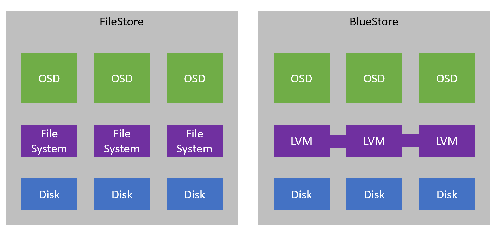


## Ceph architecture

Ceph is made of two groups of core components

* The RADOS cluster
    * Provides the clustered object storage
    * Native Object Access methods

* Gateways
    * Access to the object store via standard protocols
    * librados
    * Direct access to the object store using a native API
    * Examples:
		* iSCSI Gateway (block) -- IGW  - iSCSI is a storage area network (SAN) protocol. 
			* Exports RADOS Block Device (--RBD) (images as iSCSI disks).
			* iSCSI access to RDB images.
			* lrbd is no longer used in SES6.
		* RADOS Gateway (object) -- RGW
			* Is an object storage interface built on top of librados
		* CephFS (file)
			* A MetaData Service (MDS) is required.
			* Direct access to RADOS (no LIBRADOS layer)
			* Traditional filesystem interface.
		* NFS Ganesha (object, file)
			* Provides NFS exports to: 
				* RGW buckets for access the object store
				* The CephFS filesystem


Client access the storage services of the cluster via Gateways and Librados

The librados API allows interaction with the following daemons:

* The Ceph Monitor, which maintains a master copy of the cluster map

The Ceph OSD Daemon (OSD), which stores data as objects on a storage node.


## Enhanced SES Architecture Diagram

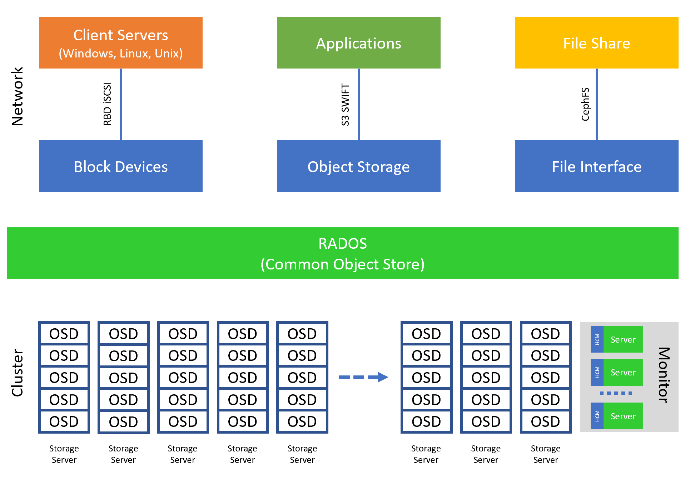


## Object Storage

* The state of the art of distributed SDS storage
* Unstructured, to better accommodate large files and large quantities of files
* For large files and large quantities of files, it performs far better than other storage mechanisms
* Agile, scalable, extensible, and very customizable
* Invisible to the end-user, ideal for backends
* Perfect for systemic, application-based use cases. Not necessarily perfect for direct Human use
* Through associated metadata, ideal for computational analytics
	* And CRUSH takes full advantage of this (CRUSH = Controllable Replication Under Scalable Hashing)
* Ceph Object Storage supports two interfaces:
	* S3-compatible
	* Swift-compatible
* Object-based storage has become the standard backend storage mechanism for nearly all modern Enterprise Storage Solutions.


## Ceph OSDs (Object Storage Daemon)
	
* A Ceph OSD (object storage daemon, ceph-osd) stores data, handles data replication, recovery, rebalancing, and provides some monitoring information to Ceph Monitors and Managers by checking other Ceph OSD Daemons for a heartbeat. 
	* The Ceph Storage Cluster receives data from Ceph Clients.
	* Clients (dedicated access points, e.g., gateway) could be a Ceph Block Device, Ceph Object Storage, the Ceph Filesystem or a custom implementation using librados. 
		* The client requests the cluster status from a monitor node
		* The client uses the status information to identify the location of objects in the cluster
		* The client accesses the objects directly via the OSD node
	* The OSD then stores the data as objects. Each object corresponds to a file in a filesystem which is stored on an OSD. 
* The OSD Daemons take care of the reads and writes on the storage disks.
* When OSDs are deployed in SES5 the default is to use BlueStore which uses the raw disk and does not require a linux file system to be placed on the disk before it can be used.
* OSD Daemons store all data as objects in a flat namespace, i.e. no hierarchy of directories.
* At least 3 Ceph OSDs are normally required for redundancy and high availability.


## Ceph Mons (Monitor Servers)

* A Ceph Monitor (ceph-mon) maintains maps of the cluster state, including
    * Monitor Map
    * Manager Map
    * OSD Map
    * PG Map
    * CRUSH Map
    * Epoch
* These maps are critical cluster state required for Ceph daemons to coordinate with each other. Monitors are also responsible for managing authentication between daemons and clients. 
* At least 3 monitors are normally required for redundancy and high availability. An odd number of MONs is required (Paxos requires). Typically 5 is sufficient for mid or large size cluster.
    * Paxos is an algorithm used for cluster durability.
    * Leader MON expects 50% quality to create quorum.
    * Lowest IP address becomes leader. After new leader selected, all MONs polled for epoch.
    * Leader Mon provides lease to non-leader MONs.
* MONs are NOT in the data path. They merely serve maps to clients so that the client can go directly to the appropriate OSD storage daemon.
Monitor nodes MONs do not serve objects to clients


## Ceph MGRs (Manager Daemon)

* A Ceph Manager daemon (ceph-mgr) is responsible for keeping track of runtime metrics and the current state of the Ceph cluster, including 
    * storage utilization
    * current performance metrics
    * system load
* The Ceph Manager daemons also host python-based plugins to manage and expose Ceph cluster information, including a web-based dashboard and REST API. 
* At least two managers are normally required for high availability.
* MON/MGR daemons are required to run on the same node in SES


## Ceph MDS (Metadata)

* A Ceph Metadata Server (MDS, ceph-mds) stores metadata on behalf of the Ceph Filesystem. 
* Ceph Metadata Servers allow POSIX file system users to execute basic commands, for example ls -al without placing an large load on the Ceph Storage Cluster.


## Ceph Admin Node

* The Admin node fills the “master” and “admin” roles for DeepSea.
* Salt is central to SES. SES’s deployment and life-cycle management tool.
* The Admin node keeps master Ceph authentication keys.
* Prometheus and Grafana provide cluster monitoring and data graphs


## Ceph Dashboard

* Runs as a Ceph Manager module; runs via the MON/MGR node.


## Client Access

* Object Storage (RADOSGW or RGW)
* Block Storage (RDB). RBD is built on top of librados.
* CephFS
* iSCSI Gateway
* NFS Ganesha
* SMB/CIFS
* Native protocols via librados

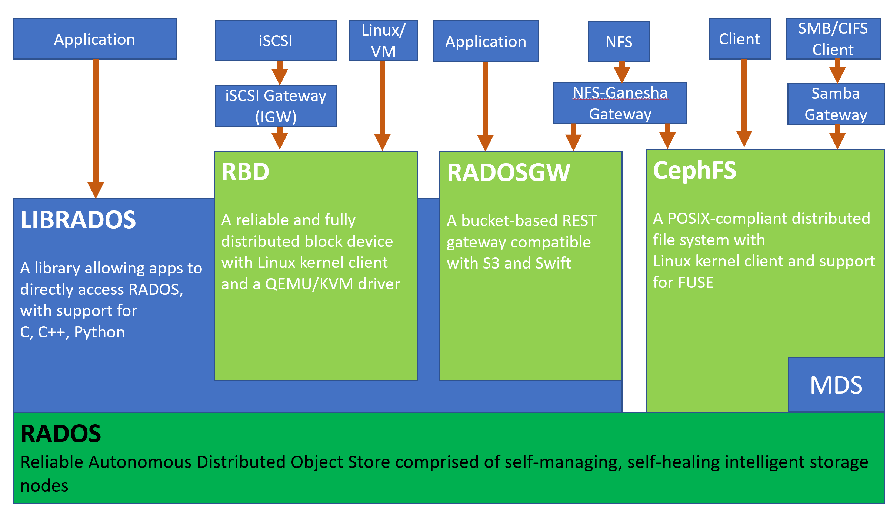


## Objects in Ceph

* Everything stored in the Ceph cluster is an object. Default object size is 4MB.
* Each object has a unique ID. ID is unique across the entire cluster.
* Objects have associated metadata, in Key: Value pairs.
* In Ceph we use Storage Pools to organize or arrange our objects.
	* Pools are logical partitions to manage objects
	* Parameters to manage Pools
		* Number of data replicas (Replica pools), or configuration of Erasure Code (size) (Erasure Code pools)
			* Erasure Code is an alternative to Replication
				* SIZE for Erasure Coding is K+M
				* K = Data chunks, M = “Parity” chunks
				* EC reduces the hit to raw storage capacity
				* EC incurs a greater hit to CPU on the OSDs as a tradeoff
		* Placement Groups (PG)
			* PG is used to manage objects within a pool.
			* PGs are associated with OSDs for data placement
			* PGs are a central feature of CRUSH that help to provide data durability by way of distribution
			* No PG is owned by an OSD. (And an OSD is not owned by a PG.)
			* PGs are just randomly assigned by CRUSH through all of the OSDs to spread the distribution of data
			* Locating data among PGs is all handled economically, deterministically by way of CRUSH calculations
			* PGs are subdivisions of pools
			* Number of PGs = (Number of OSDs * 100) / Size  (Size = either num of replicas, or K+M)
				* The final PG number must be a power of 2
			* The default number of PGs for a new pool is 8 (it's too small for enterprise solution)
			* In general, PG and PGP numbers should be the same
				* pg_num is the number of placement groups for the pool (placement group, 存储池的目录个数 )
				* pgp_num is the number of placement groups that will be considered for placement (placement group for placement purpose, pg可用的osd排列组合数量)
                * 仅增大pg_num：
                    * 因为pgp_num没变，pg的osd组合仍只能从当前pgp_num种组合里面挑选，导致新增的pg和旧pg会有重复的osd组合，该现象称之为分裂；此时pg和osd的映射没有变；
				* 继续增大pgp_num，使其等于pg_num：
					*  旧pg没有变化，但新增pg的osd组合发生变化，即开始重新分布
				* Placement Group (PG) 归置组状态
				    1. Creating
				    	* 创建存储池时，它会创建指定数量的归置组。
				    	* ceph 在创建一或多个归置组时会显示 creating。
				    	* 创建完后，在其归置组的 Acting Set 里的 OSD 将建立互联。
				    	* 一旦互联完成，归置组状态应该变为 active+clean，意思是ceph 客户端可以向归置组写入数据了。
				    2. peering
				    	* ceph 为归置组建立互联时，会让存储归置组副本的 OSD 之间就其中的对象和元数据状态达成一致。
				    	* ceph 完成了互联，也就意味着存储着归置组的 OSD 就其当前状态达成了一致。
				    	* 然而，互联过程的完成并不能表明各副本都有了数据的最新版本。
				    3. active
				    	* ceph 完成互联进程后,一归置组就可变为 active。
				    	* active 状态通常意味着在主归置组和副本中的数据都可以读写。
				    4. clean
				    	* 某一归置组处于 clean 状态时，主 OSD 和副本 OSD 已成功互联，并且没有偏离的归置组。
				    	* ceph 已把归置组中的对象复制了规定次数。
				    5. degraded
				    	* 当客户端向主 OSD 写入数据时，由主 OSD 负责把副本写入其余复制 OSD。
				    	* 主 OSD 把对象写入复制 OSD 后，在没收到成功完成的确认前，主 OSD 会一直停留在 degraded 状态。
				    	* 归置组状态可以是 active+degraded 状态，原因在于一 OSD 即使没所有对象也可以处于 active 状态。
				    	* 如果一OSD 挂了，ceph 会把相关的归置组都标记为 degraded。
				    	* 那个 OSD 重生后，它们必须重新互联。
				    	* 然而，如果归置组仍处于 active 状态，即便它处于 degraded 状态，客户端还可以向其写入新对象。
				    	* 如果一 OSD 挂了，且 degraded 状态持续，ceph 会把 down 的 OSD 标记为在集群外(out)、并把那些 down 掉的 OSD 上的数据重映射到其它 OSD。
				    	* 从标记为 down 到 out 的时间间隔由 mon osd down out interval 控制,默认是 300 秒。
				    	* 归置组也会被降级(degraded)，因为归置组找不到本应存在于归置组中的一或多个对象，这时，你不能读或写找不到的对象，但仍能访问其它位于降级归置组中的对象。
				    6. recovering
				    	* ceph 被设计为可容错，可抵御一定规模的软、硬件问题。
				    	* 当某 OSD 挂了(down)时，其内容版本会落后于归置组内的其它副本。
				    	* 它重生(up)时，归置组内容必须更新，以反映当前状态。
				    	* 在此期间，OSD 在recovering 状态。
				    	* 一次硬件失败可能牵连多个 OSD。比如一个机柜的网络交换机失败了，这会导致多个主机落后于集群的当前状态，问题解决后每一个 OSD 都必须恢复。
				    	* ceph 提供了很多选项来均衡资源竞争，如新服务请求、恢复数据对象和恢复归置组到当前状态。
				    	* osd recovery delay start 选项允许一 OSD 在开始恢复进程前，先重启、重建互联、甚至处理一些重放请求。
				    	* osd recovery threads 选项限制恢复进程的线程数，默认为 1 线程。
				    	* osd recovery thread timeout 设置线程超时，因为多个OSD 可能交替失败、重启和重建互联。
				    	* osd recovery max active 选项限制一 OSD 最多同时接受多少请求，以防它压力过大而不能正常服务。
				    	* osd recovery max chunk 选项限制恢复数据块尺寸，以防网络拥塞。
				    7. back filling
				    	* 有新 OSD 加入集群时，CRUSH 会把现有集群内的归置组重分配给它。
				    	* 强制新 OSD 立即接受重分配的归置组会使之过载，用归置组回填可使这个过程在后台开始。
				    	* 回填完成后，新 OSD 准备好时就可以对外服务了。
				    8. remapped
				    	* 某一归置组的 Acting Set 变更时，数据要从旧集合迁移到新的。
				    	* 主 OSD 要花费一些时间才能提供服务，所以它可以让老的主 OSD 持续服务、直到归置组迁移完。
				    	* 数据迁移完后,主 OSD 会映射到新 acting set。
				    9. stale
				    	* 虽然 ceph 用心跳来保证主机和守护进程在运行，但是 ceph-osd 仍有可能进入 stuck 状态，它们没有按时报告其状态(如网络瞬断)。
				    	* 默认OSD 守护进程每半秒(0.5)会一次报告其归置组、出流量、引导和失败统计状态，此频率高于心跳阀值。
				    	* 如果一归置组的主 OSD 所在的 acting set 没能向监视器报告、或者其它监视器已经报告了那个主 OSD 已 down，监视器们就会把此归置组标记为 stale。
				    	* 启动集群时，会经常看到 stale 状态，直到互联完成。
				    	* 集群运行一阵后，如果还能看到有归置组位于 stale 状态，就说明那些归置组的主 OSD 挂了(down)、或没在向监视器报告统计信息。
			* Each pool has its own autoscaler settings
			* The PG balancer optimizes the placement of PGs across OSD
				* crush-compat mode
					* It's default mode
					* Uses the compat weight-set feature
				* upmap mode. 
					* It's perfect mode, which an equal number of PGs on each OSD
					* Use fine-grained control over the PG mapping
		* Snapshots
		* Rulesets to manage CRUSH placement
			* Each pool has a defined CRUSH ruleset
				* A CRUSH ruleset is a definition of how the OSDs organize data
				* This allows configuration of data distribution to be managed per pool
				* A single CRUSH ruleset can be reused by multiple pools
				* A ruleset can take into account: 需要考虑的点
					* physical layout of nodes in the cluster
					* organization of network infrastructure
					* selection of OSDs backed by SSDs versus HDDs, etc
			* Each pool can use either Replication or Erasure Coding
				* Replication is the original, default approach to resiliency
			* Erasure Coded pools have an EC Profile assigned
				* Different than CRUSH rulesets, but similar: define how OSDs organize data
				* The profile defines K, M values; encoding method/plugin; etc
			

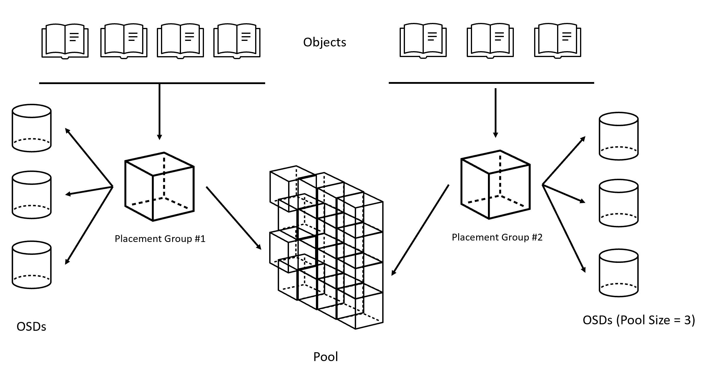


## CRUSH (Controllable Replication Under Scalable Hashing)

* CRUSH is a key piece of the Ceph storage solution
* With the CRUSH algorithm used by Ceph:
    * Data is not centrally stored, it is distributed
    * CRUSH calculates the storage location for each object dynamically
    * No requirement to store a global index of object locations


## CRUSH Algorithm

* The CRUSH algorithm deterministically calculates the location of any object in the Ceph RADOS cluster
* Overhead is low and calculation is performed by each client
* As no metadata store is required, CRUSH removes the limitations of traditional metadata based management
* No direct control over the placement of your data in the cluster
* Higher CPU requirements


## CRUSH Maps and Rulesets

* CRUSH Rulesets are the named sets of rules:
	* Combining all of the customizable CRUSH behavior settings
	* Assigned to pool to govern how the pool’s data is distributed in the cluster
* CRUSH Maps are central to how Ceph distributes data, and maintaining the durability of the data
	* When the cluster is deployed, Ceph creates a simple default ruleset for replicated pools: replicated_rule
* CRUSH behavior depends on the behaviors and performance of storage devices
* CRUSH Maps should be crafted to take advantage of those behaviors
* Rulesets should be used to clearly identify how the devices in your environment should be employed
* Device Classes exist to indicate performance behavior: hdd, ssd, nvme
* Ceph OSDs will automatically set the Device Class of a storage device when the OSD is started
* Working with CRUSH Map Rulesets
	* List the OSDs, which host each OSD belongs to:
		* `ceph osd tree`
		* `ceph osd df tree`
		* `ceph osd df tree -f json-pretty`
	* Find the host of a specific OSD:
		* `ceph osd find 8`
	* Show the existing defined rulesets:
		* `ceph osd crush rule ls`
	* Examine the definition of an existing ruleset:
		* `ceph osd crush rule dump <rulesetname>`
	* There are 3 options for creating a new ruleset:
		* `simple`
		* `replicated`
		* `erasure`
	* Creating new rulesets:
		* `ceph osd crush rule create-replicated <name>`
		* `ceph osd crush rule create-erasure <name> <ec_profile>`
	* Create a new ruleset using a Device Class:
		* `create-replicated <name> <root> <failure-domain-level> <device-class>`
		* `<root>`
			* Description : The name of the node under which data should be placed.
			* Type : String
			* Example : default (rarely would you need to make this different than “default”)
		* `<failure-domain-type>` or `<failure-doamin-level>`
			* Description : The type of CRUSH node (bucket) across which replicas should be separated.
			* Type : String
			* Example : rack
		* `<device-class>`
			* Description : The device class data should be placed on.
			* Type : String
			* Example : ssd


## CRUSH Weight

* You may need to move data around
    * New nodes
    * degraded nodes
    * rebalancing
* View the current CRUSH weights
    * `ceph osd crush tree`
    * `ceph osd df tree`
* Change the weight for an OSD
    * `ceph osd crush reweight <osd.N> <weight>`
		
* The important difference between ceph osd reweight and ceph osd crush reweight
    * "ceph osd crush reweight" sets the CRUSH weight of the OSD. This weight is an arbitrary value (generally the size of the disk in TB or something) and controls how much data the system tries to allocate to the OSD.
	* "ceph osd reweight" sets an override weight on the OSD. This value is in the range 0 to 1, and forces CRUSH to re-place (1-weight) of the data that would otherwise live on this drive. It does *not* change the weights assigned to the buckets above the OSD, and is a corrective measure in case the normal CRUSH distribution isn’t working out quite right.
	* "ceph osd reweight" is temporary. "ceph osd crush reweight" is sticky, permanent (until you change it again).
	* Setting a weight of an OSD to 0 is effectively setting the OSD "out" - you don’t want it to store data.


## The Monitor’s Cluster Map contains

* Monitor Map
    * Unique Cluster ID, details of each Mon node, current epoch, date/time of last change
*  OSD Map
	* Contains the cluster fsid, when the map was created and last modified, a list of pools, replica sizes, PG numbers, a list of OSDs and their status
* PG Map
	* Contains the PG version, its time stamp, the last OSD map epoch, the full ratios, and details on each placement group such as the PG ID, the Up Set, the Acting Set, the state of the PG (e.g., active + clean), and data usage statistics for each pool
* MDS Map
	* Contains the current MDS map epoch, references to pool(s) for storing metadata, list of MDS servers, and which metadata servers are up and in
* CRUSH Map
* Contains a list of storage devices, the failure domain hierarchy (e.g., device, host, rack, row, room, etc.), and rules for traversing the hierarchy when storing data


## CRUSH Hierarchy

* The CRUSH Map includes details of physical & network infrastructure
* The CRUSH Map hierarchy is defined by a storage architect
* The default hierarchical list of infrastructure elements: (Hierarchy of CRUSH buckets)
    * OSD
    * host
    * chassis 刀片机箱
    * rack 机架
    * row
    * pdu 电源分配单元
    * pod 性能优化的数据中心(Performance Optimize Datacenter)，基于标准化设施的最佳实践，每个POD内IT部分包含的5000台服务器，分属到200个机架，如果以每台服务器400W功率计算的话，每个机柜需要10KW的供电，即每个POD的IT负载容量是2MW。
    * room
    * datacenter
    * region
    * root
* CRUSH is the algorithm and calculation for distributing data through the cluster. 
* CRUSH Map obviously plays a part in how those CRUSH calculations work. 

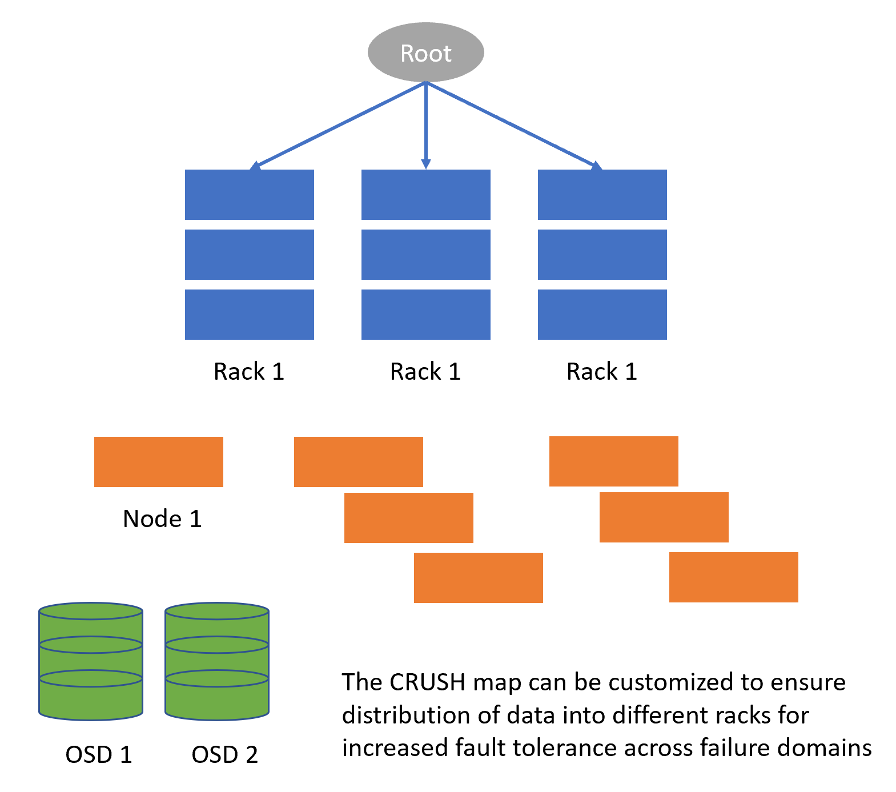


## CRUSH Map Sections (Six main sections)

* tunables: adjustments to legacy behavior
* devices: The list of OSDs (usually no customization needed)
		○ "device class" is meaningful; useful in relation to creating/using CRUSH rulesets
		○ Standard "device class" values are "hdd.", "ssd.", and "nvme."
		○ Example: device 7 osd.7
* types: types of buckets (usually no customization needed)
* buckets: the most functional, customizable aspect of the Map
		○ A bucket typically represents a physical location in the cluster, has a “type”
		○ Nodes (containers such as hosts) and leaves (storage devices such as OSDs)
* rules: define policies of how data should be distributed
		○ The behind-the-scenes rules that CRUSH follows for data placement
		○ IMPORTANT: this is NOT the same as the "ruleset". In fact, a ruleset is the combined set of all of these six Map sections.
* choose_args (optional): Rarely used exceptional settings to adjust weights
* From the documentation: "choose_args are alternative weights associated with the hierarchy that have been adjusted to optimize data placement. A single choose_args map can be used for the entire cluster, or one can be created for each individual pool."

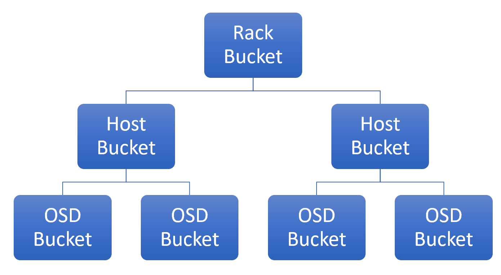


## Erasure Coding

* In information theory : an erasure code is a forward error correction (FEC, 前向纠错) code for the binary erasure channel, which transforms a message of k symbols into a longer message (code word) with n symbols such that the original message can be recovered from a subset of the n symbols.
    * The fraction r = k/n is called the code rate
    * The fraction k’/k, where k’ denotes the number of symbols required for recovery, is called reception efficiency
* Another (easier) way of describing EC: It’s like RAID in Clustered Storage


## Erasure Coding in SES

* The default resilience strategy in SES is simple replication
		* SES Simple replication has overheads, size=3 means 3 times the storage requirements
* Simplistic EC details:
	* k = number of “data” chunks, split across “k” number of OSDs
	* m = number of “parity” chunks, split across “m” number of OSDs
	    * Ceph calls these “coding chunks”
    * r (size) = k + m

```
admin:~ # ceph osd crush rule ls
replicated_rule
```

## Replication vs Erasure Code

* Replication (default):
    * Use Case: active data
    * Simple and fast
    * Uses more disk space
* Erasure coding:
    * Use Case: archive data, more static data
    * Calculates recovery data (needs more CPU power)
    * Definable redundancy level
* Example: K data chunks = 2 , M code chunks = 1
    * Similar to a replication size of 2
    * But with only 50% more raw storage consumed
* Example: for 1GB of effective storage
    * replication pool of size of 2 needs 2GB raw storage
    * erasure coded pool with k=2/m=1 only requires 1.5GB raw storage


## EC Overwrites
* Historically, EC only works properly with Objects
    * EC only allowed appends; overwrites were not allowed
    * Works perfectly for objects in buckets
    * but doesn’t work well with Block or CephFS
* With recent releases of SES, EC can work well with Block and CephFS
    * Facilitated by “EC Overwrites” feature
    * Store data in an EC Pool, and store object metadata in a Replicated Pool
    * Requires a little extra work when defining pools, but worth it 
    * ceph osd pool set <poolname> allow_ec_overwrites true


## EC Profiles

* Using Erasure Coding, each Pool is assigned an EC Profile
    * Multiple pools can share a single Profile
    * The profile is just a definition
* Each Profile has multiple settings
	* The common required settings for all Profiles are K, M
* EC Profiles must be created before EC Pools can be created
	* Created from the Dashboard or CLI
* Once an EC Profile is created, you can create a CRUSH Ruleset based on the EC profile
* Once a pool is created, its EC Profile properties cannot be changed
* Main profile parameters
	* K:
	* M:
	* stripe_unit - allows you to adjust the size of the data chunk
		* Default size is 4K
		* stripe_unit : size of data striped across devices; default 4K
		* This variable can also be set in the master configuration (osd_erasure_code_stripe_unit)
* EC plugins - choose your favorite EC algorithm via a plugin
	* jerasure/gf-complete (default, free, open, and very fast) (www.jerasure.org)
	* ISA (Intel library; optimized for modern Intel processors) (only runs on Intel processors)
	* LRC (“Locally Repairable Code”; layers over existing plugins)
	* SHEC (“Shingled EC”; trades extra storage for recovery efficiency)
    * CLAY (“Coupled LAYer”; good for reduced network traffic)


## Creating Erasure Code Profiles and Pools

* Syntax: `ceph osd erasure-code-profile OPTIONS`
    * Option Description
        * get - view details of an existing EC profile
        * set - set a profile (create a profile), requires k and m values, with optional values such as ruleset, plugin. Once you create a profile, you can’t change it.
    	    * `ceph osd erasure-code-profile set <name> k=<int> m=<int> [plugin=<plugin>] [stripe_unit=<string>]`
    	* ls - list profiles
    	* rm - Remove an EC profile
    		* `ceph osd erasure-code-profile rm <name>`	
    * Common example (below)
    * The default profile
    	‒ 2+1=3; data is written over 3 OSDs
    	‒ Two data chunks
    	‒ One code (parity) chunk
    	‒ Uses jerasure plugin with standard Reed/Solomon (reed_sol_van) technique
    * Setting a Custom EC Profile
    	* Option:
    	    ‒ Profile name
    	    ‒ K : number of stripes required
    	    ‒ M : number of failed units
    	* Example:
    	    * ceph osd erasure-code-profile set example-profile k=8 m=2 ruleset-failure-domain=host
    	    * ruleset-failure-domain = crush bucket level for failure

```
admin:/etc/ceph #  ceph osd erasure-code-profile \
set common_profile \
k=4 \
m=2 \
plugin=jerasure \
technique=reed_sol_van \
stripe_unit=4K \
crush-root=default \
crush-failure-domain=rackcrush-device-class=ssd
    		
admin:/etc/ceph # ceph osd erasure-code-profile ls
default
    
admin:~ # ceph osd erasure-code-profile get default
k=2
m=1
plugin=jerasure
technique=reed_sol_van
```

* Pools
    * Pools are at the heart of Storage
    * Pools are tied to OSDs
    * Display a list of existing pools:
		* `ceph osd pool ls or ceph osd lspools`
    * View the statistics and characteristics of pools:
	    * `ceph osd pool stats`
	    * `ceph osd pool stats <poolname>`
	    * `ceph osd pool get <poolname> <attrib>`
    * Show usage and related details of existing pools:
		* `rados df or ceph df or ceph df detail`
    * All storage revolves around Pools
	    * Each pool must be dedicated to a purpose: Object, Block, File
	    * Must specify # of Placement Groups and PG Placements
	    * Must specify whether using Replication or EC
	    * Must specify a CRUSH ruleset
    * Create a Replicated Pool
		* Syntax: 
		    * `ceph osd pool create <poolname> <pg_num> <pgp_num> replicated <crush-rule-name>`
			    * <pg_num> = number of placement groups for the pool
			    * <pgp_num> = number of PGs for placement; routinely will be the same as pg_num
			* Always a power of 2
			* Don’t make the number too small; don’t err on the high side, either
			* Practices
				* For a new pool, the pgp_num will generally (likley) just be the same as the pg_num
				* When increasing the PGs in a pool, you may want to retain the smaller pgp_num to minimize rebalancing, and increase pgp_num later when rebalancing is more convenient
				* If decreasing the PGs in a pool, the pgp_num is adjusted automatically
	* Create an EC Pool (using an EC Profile)
		* Syntax:
			* `ceph osd pool create <poolname> <pg_num> <pgp_num> erasure <erasure-code-profile> <crush-rule-name>`
		* Example:
			* `ceph osd pool create EC-pool 128 128 erasure my-ec-profile`
    * Pools – Application Assignment
		* Each Pool must have a stated purpose; application
			* This defines which capabilities the Pool must support
			* The applications are: Block (rbd), Object (rgw), and File (cephfs)
			* There are subtypes of cephfs: i.e. cephfs:data, cephfs:metadata
		* Application assignment happens after creating a pool
			* It’s effortless (and required) to assign an application on a new pool
				* `ceph osd pool application enable <poolname> <application>`
			* Changing application assignment after a pool is in use is “hard”. Not recommended, only to be done as an expert
		* Pools – Quotas
			* One of the more desirable features of SDS is to set a maximum usage of a Pool - Quotas
				* Prevent the over-use of a pool
			* Set quotas based on number of objects or number of bytes
		        * `ceph osd pool set-quota <poolname> max_objects <integer>`
		        * `ceph osd pool set-quota <poolname> max_bytes <integer>`
			* Show quota settings
				ceph osd pool get-quota <poolname>
			* To remove a quota, set the existing quota setting to 0
			* There are also application-level quotas
				* For rgw and cephfs (not rbd; images are already limited in size)
			* Pool Quotas vs. Application Quotas. 
				* When a pool quota nears its limit, the HEALTH mechanisms will display a “POOL_NEAR_FULL” warning to the storage administrator. 
				* When the quota limit has been exceeded, the HEALTH mechanisms will display a “POOL_FULL” warning to the storage administrator.
				* Applications (clients) don’t always handle the quotas cleanly. In most cases, once the Pool Quota is exceeded, the application will simply stop writing to the pool, and error messages and behavior at the application are inconsistent (if there are any messages at all).
		* Pools – Snapshots
			* Take (make) a snapshot of an existing pool
				* `ceph osd pool mksnap <poolname> <snapname>`
			* Remove a snapshot of a pool
				* `ceph osd pool rmsnap <poolname> <snapname>`
			* List pool snapshots
				* `rados -p <poolname> lssnap`
			* Rollback the pool to an earlier snapshot
				* `rados -p <poolname> rollback <snapname>`
			* Images and cephfs have their own snapshot facilities.
			* Object and Bucket snapshotting features related to rgw don’t exist.
			* Pools Snapshots versus App Snapshots
				* The two different snapshot features cannot be used at the same time on a pool
					* Either Pool Snapshots, or Application Snapshots; not both. (snap_mode = pool versus snap_mode = selfmanaged)
					* Once you commit to pool snapshots for an RBD pool, you can’t change to using RBD snapshots
				* Pros and Cons of each, depending on your Use Case

```
admin:~ # ceph osd pool ls detail -f json-pretty | grep snap_mode
        "snap_mode": "selfmanaged",
        "snap_mode": "selfmanaged",
        "snap_mode": "selfmanaged",
        "snap_mode": "selfmanaged",
        "snap_mode": "selfmanaged",
        "snap_mode": "selfmanaged",
        "snap_mode": "selfmanaged",
```


## BlueStore

* BlueStore is the default storage backend in SES
* Highlighted features: compressing, no double-writes, faster checksums

* Ceph FileStore Model
    * It is not ideal for a specialized purpose like a highly scalable distributed storage system.
    * Only recommend that XFS be used. Both btrfs and ext4 have known bugs.
    * The FileStore model uses cache from the filesystem (XFS). Memory for cache is managed by filesystem kernel module.
    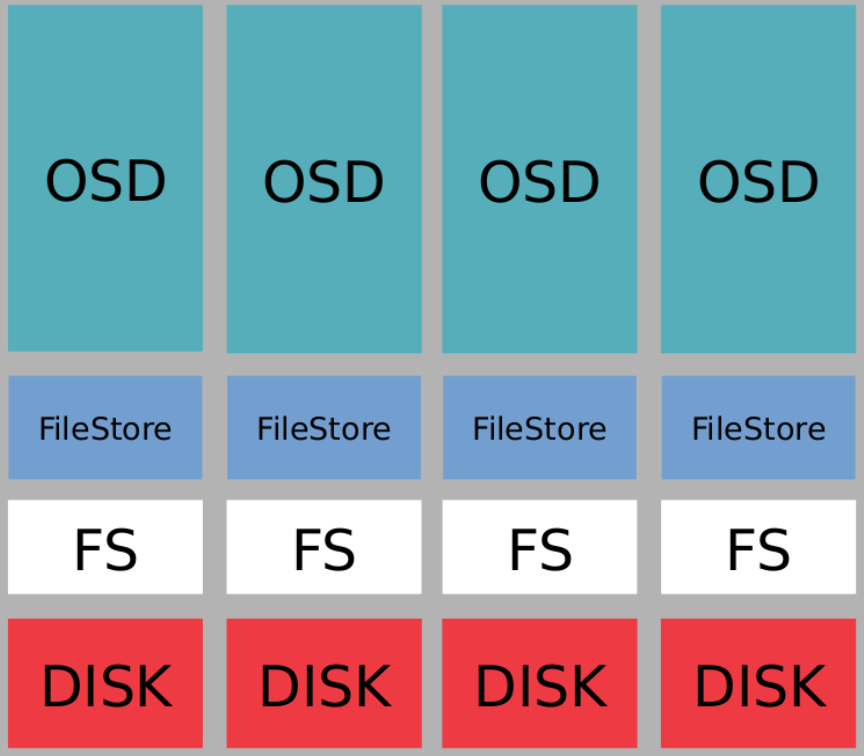
* Ceph BlueStore Model
	* BlueStore consumes raw block devices.
	* Metadata management with RocksDB. 
	* BlueStore employs RocksDB’s key/value database in order to manage internal metadata, such as the mapping from object names to block locations on disk. 
	* Full data and metadata checksumming. 
	* By default all data and metadata written to BlueStore is protected by one or more checksums. 
	* A small specialized filesystem called BlueFS. This provides just enough of a filesystem to allow RocksDB to store its "key/value files" to share metadata across all the raw device(s)
	* No data or metadata will be read from disk or returned to the user without being verified.
	* Multi-device metadata tiering. 
	* BlueStore allows its internal journal (write-ahead log) to be written to a separate, highspeed device (like an SSD, NVMe, or NVDIMM) to increased performance. 
	* Efficient copy-on-write. RBD and CephFS snapshots rely on a copy-on-write clone mechanism that is implemented efficiently in BlueStore.
	* BlueStore is a userspace model that provides its own memory management and cache.
		* No need to clear the storage device cache
		* OSDs help facilitate the performance of caching
		* Default: cache the reads, don’t cache the writes
	* RocksDB：
		* rocksdb是facebook基于leveldb开发的一款kv数据库，BlueStore将元数据全部存放至RocksDB中，这些元数据包括存储预写式日志、数据对象元数据、Ceph的omap数据信息、以及分配器的元数据 。
	* BlueRocksEnv：
		* 是RocksDB与BlueFS交互的接口；RocksDB提供了文件操作的接口EnvWrapper，用户可以通过继承实现该接口来自定义底层的读写操作，BlueRocksEnv就是继承自EnvWrapper实现对BlueFS的读写。
	* BlueFS：
		* BlueFS是BlueStore针对RocksDB开发的轻量级文件系统，用于存放RocksDB产生的.sst和.log等文件。
	* BlockDecive：
		* BlueStore抛弃了传统的ext4、xfs文件系统，使用直接管理裸盘的方式；
		* BlueStore支持同时使用多种不同类型的设备，在逻辑上BlueStore将存储空间划分为三层：慢速（Slow）空间、高速（DB）空间、超高速（WAL）空间，不同的空间可以指定使用不同的设备类型，当然也可使用同一块设备。

	* Allocator：负责裸设备的空间管理，只在内存做标记，目前支持StupidAllocator和BitmapAllocator两种分配器,Stupid基于extent的方式实现 
    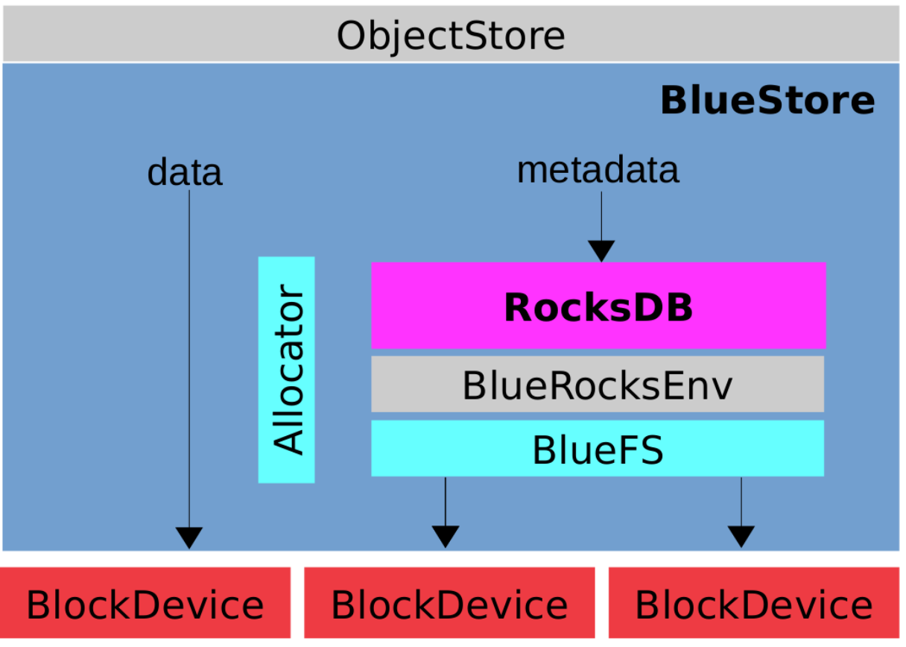

	* Ceph BlueStore with Mixed Devices
    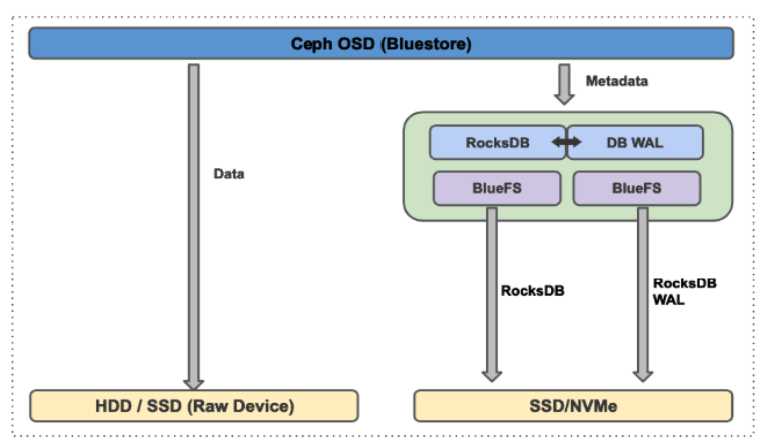


## BlueStore Cache Parameters 

Under most circumstances, autotune is best

* bluestore_cache_autotune
	* Description: Automatically tune the ratios assigned to different bluestore caches while respecting minimum values
	* Type: Boolean
	* Required: Yes
	* Default: True (enabled)
	* Related settings: bluestore_cache_autotune_chunk_size, bluestore_cache_autotune_interval, and others
* bluestore_cache_size
	* Description: The amount of memory BlueStore will use for its cache. If zero, bluestore_cache_size_hdd or bluestore_cache_size_ssd will be used instead.
	* Type: Integer
	* Required: Yes
	* Default: 0
* bluestore_cache_size_hdd
	* Description: The default amount of memory BlueStore will use for its cache when backed by an HDD
	* Type: Integer
	* Required: Yes
	* Default: 1 * 1024 * 1024 * 1024 (1 GB)
* bluestore_cache_size_ssd
	* Description: The default amount of memory BlueStore will use for its cache when backed by an SSD.
	* Type: Integer
	* Required: Yes
	* Default: 3 * 1024 * 1024 * 1024 (3 GB)
* bluestore_cache_meta_ratio
	* Description: The ratio of cache devoted to metadata.
	* Type: Floating point
	* Default: .01
* bluestore_cache_kv_ratio
	* Description: The ratio of cache devoted to key/value data (rocksdb).
	* Type : Floating point
	* Default: .99
* bluestore_cache_kv_max
	* Description : The maximum amount of cache devoted to key/value data (rocksdb).
	* Type : Unsigned Integer
    * Default : 512 * 1024*1024 (512 MB)


## BlueStore Device Types

* BlueStore has three types of roles for devices:
	* The DATA role:
		* Required: main device (block symlink) stores all object data.
		* If no other types: “data” device serves all the other roles
	* The DB role:
		* Optional: DB device (block.db symlink) stores metadata in RocksDB
		* Whatever doesn’t fit will spill back onto the “data” device
	* The Write Ahead Log (WAL/Journal) role:
		* Optional: WAL device (block.wal symlink) stores the internal journal
* Can combine all 3 roles into one physical device
	* Or combine DB/WAL onto a single device with the DATA device separate
    * Or all three on seperate devices


## BlueStore Configuration Recommendations

* Devote DB and WAL to SSD or NVMe
    * Allocate 64 GB to the RocksDB
    * Allocate 4-6 GB to the WAL
    * Assign the “data” role to the slower (HDD) devices
    * If combining WAL/DB on one device, use a single partition for both
    * You can use a single SSD/NVMe to store multiple journals


## Architecture Overview of Object, Block, Filesystem Access

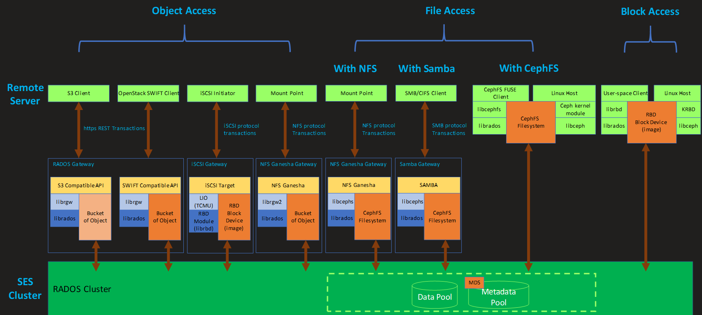


## Object Storage

* The state of the art of distributed storage
* Object storage is the Cloud Storage mechanism of choice
* Unstructured, to better accommodate large files and large quantities of files
* Ideal for large media files, like streaming videos, audio
* Scales really well, large capacities
* Ceph provides access to the storage via all three major data access methods: Block, Object, and File.
* For the storage backend, Object Storage is ideal


## Block Storage

* Traditional Block Storage:
	* Volumes as a collection of blocks
	* Blocks can be of various sizes, but all the same within a volume
	* Typically a filesystem is installed on top of the volume
	* Hard Drives, CDs, USB sticks, etc
	* The standard disk device mechanism for Unix, Linux, Windows, etc.
* Ceph presents RADOS as block device (RBD = RADOS Block Device)
	* Ceph calls these block devices “images”
* Provides clients with access like a “disk drive”
	* KVM/QEMU; libvirt; or remote Linux system
    * A native Windows client that can access the Block storage of Ceph directly is in progress


## RADOS Block Device (RBD)

* RBD is the RADOS Block Device
	* A specific RBD instance in the cluster is called an “image”
* RBD images can be accessed by OSs other than linux
	* librbd provides interface for gateways like iSCSI
* RBD allows the client to decide what to do with the storage
	* Filesystem type; raw disk, such as for a DB; etc
* RBD images can accommodate 16Eb file system sizes
	* No matter the size, the storage is distributed durably throughout the cluster
* Data is striped across the RADOS cluster in object sized chunks
	* 4MB default
	* Provides high performance and durability
* Notable Benefits
	* Ability to mount with Linux or QEMU KVM clients
	* Thinly provisioned
	* Resizable images
	* Image import/export
	* Image copy or rename
	* Read-only snapshots
	* Revert to snapshots
	* Copy on Write clones
		* Useful for standing up lots of virtual machines with same base configuration
	* High performance due to striping across cluster nodes
	* RBD image definition:
		* Defined storage area presented as a block device to a client
* RBD Storage
    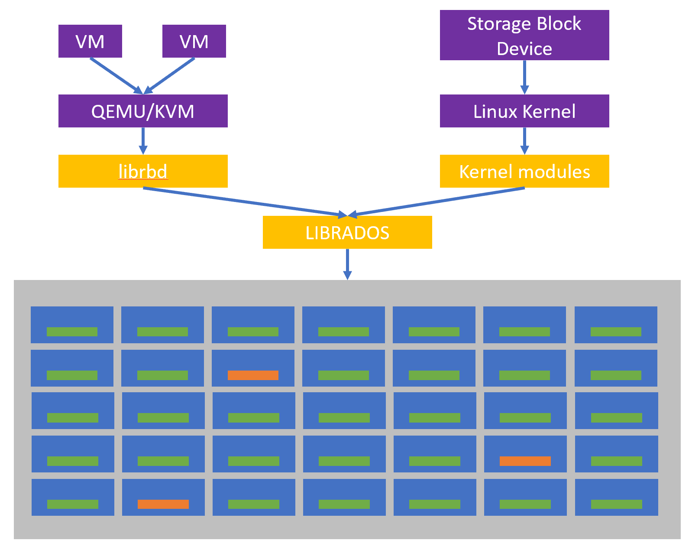


## File Storage

* POSIX Filesystem via CephFS
    * File access is a significant use case
        * Home directories
        * Historical comfort with files and directories
        * Ease of managing “small” stuff broadly, in a distributed system
    * A Use Case that’s growing in popularity: HPC
    * CephFS is fast, scalable, and flexible
        * Fits into many existing paradigms, rather seamlessly
        * In particular: NFS, Samba/CIFS
        * But even better: extending Linux filesystems
        * Requires Metadata Service (MDS) for POSIX capabilities
* SUSE does NOT support any FUSE clients.


## Ceph Users and Authentication

* Ceph Users are generally applications; applications that use the storage cluster
	* The must common user is Admin
		* A ceph admin user and credentials must exist
		* Additional users and associated credentials are useful
	* Each user must have credentials to access the storage cluster
		* The most fundamental form of credentials in Ceph is keys
* Ceph Users and Keys
	* The admin user has rights to all Ceph resources. Other users can be setup to have a subset of rights
	* There are basically two types of Users (Actors):
		* An individual (a person)
		* An application (like a gateway, or some other kind of system)
	* Most users are of the type client, and are represented as a dotted string, such as:
		* client.admin, or client.steve, or client.swift
	* The root linux user on the Admin node is effectively the Admin Ceph user, since the root user has all privileges to all filesystem objects on the Adminnode, including the ceph.client.admin.keyring. 
	* The root user on any of the nodes in the cluster can “impersonate” all of the Ceph clients.
	* Linux user accounts do not have any affect on the Ceph Users as managed in the dashboard.
	* Take care to keep backups of the /etc/ceph/ directory structure, so that you don’t lose these keys/keyrings.
	* Each user must have a key/keyring, for example:
		* `/etc/ceph/ceph.client.admin.keyring` on the Admin node
		* `/etc/ceph/ceph.client.storage.keyring` on a storage node
```
admin:/etc/ceph # cat ceph.client.admin.keyring
[client.admin]
        key = AQD6pHpfAAAAABAAHJvkvLhOKZyQxm9lgnR5Qg==
        caps mds = "allow *"
        caps mon = "allow *"
        caps osd = "allow *"
        caps mgr = "allow *"
data1:/etc/ceph # cat ceph.client.storage.keyring
[client.storage]
        key = AQD8pHpfAAAAABAAHecCBgBsLIyPrJf+27eXUQ==
        caps mon = "allow rw"
```
* Ceph Keys and Keyrings
	* A keyring contains one or more keys
	* Each user can have its own keyring
	* A keyring can contain multiple keys
		* Different clients and users must have their own key, but multiple keys can be joined together in a single keyring
	* Normally a key will be contained in a keyring
		* Core Ceph will only recognize and use keys from keyrings
		* Stand-alone keys are useful for other tools, like clients
* Ceph Authentication List
	* The Admin node (and client.admin) can list all Users
	    * `ceph auth list`
* Create a Ceph User
	* A typical user will have read rights to MONs, and read/write rights to a pool (osd)
	    * `ceph auth get/add/get-or-create xxxxxx`
* Create a User with ceph-authtool
	* Create a keyring
	    * `ceph-authtool -C /etc/ceph/ceph.client.richard.keyring`
	* Create a key, and place it on the keyring
	    * `ceph-authtool --gen-key -n client.richard --cap osd 'allow rw pool=data' --cap mon 'allow r' /etc/ceph/ceph.client.richard.keyring`
	* Now officially tell the cluster about the key (add user to the key)
	    * `ceph auth add client.richard -i /etc/ceph/ceph.client.richard.keyring`
* Authentication with cephx
	* The mechanism for passing keys around is cephx
		* Authentication for users and daemons
		* Does not provide data encryption, only authentication with keys
	* cephx simply ensures the authenticity of actors
		* So that no man-in-the-middle attacks can occur
	* Other authentication mechanisms are theoretically possible
		* Attempts to integrate LDAP and Kerberos have been made
		* … but they have not come to full fruition yet


## Ceph Configuration

* Historically, the Ceph configuration was kept only in a file on the Admin node: /etc/ceph/ceph.conf, and sync'd to MONs and Storage Nodes
* SES DeepSea manages the ceph.conf file. Don’t edit it directly; use Salt and DeepSea
* With Ceph Nautilus, most configuration held as objects in the Monitors using Dashboard or CLI for operation
* Ceph Configuration Stored in the MONs
	* The MONs keep a configuration database
	* Show all the configuration keys:
	    * `admin:/etc/ceph # ceph config ls |less`
	* Show the configuration settings that have been customized. The dumped output also indicates an EXPERTISE LEVEL
	* The keys also have a “who” attribute. In below case, "osd.*" represents the "who", which is getting the general setting for all OSDs
* Ceph Configuration Settings
	* Show configuration settings that have been customized:

```
admin:/etc/ceph # ceph config dump
WHO   MASK LEVEL    OPTION                           VALUE                                    RO
  mgr      advanced mgr/dashboard/GRAFANA_API_URL    https://mon1.pvgl.sap.corp:3000          *
  mgr      advanced mgr/dashboard/RGW_API_ACCESS_KEY M11I3JGQHAQM94CS910K                     *
  mgr      advanced mgr/dashboard/RGW_API_HOST       mon3.pvgl.sap.corp                       *
  mgr      advanced mgr/dashboard/RGW_API_PORT       80                                       *
  mgr      advanced mgr/dashboard/RGW_API_SECRET_KEY YWyRc3mayEPiOEUzQ2o76KePSKmVKN4fIWxgqTt6 *
  mgr      advanced mgr/dashboard/RGW_API_USER_ID    admin                                    *
  mgr      advanced mgr/dashboard/ssl_server_port    8443       
                              
admin:/etc/ceph # ceph config get osd.* osd_max_object_size
134217728

admin:/etc/ceph # ceph config show osd.0
……
admin:/etc/ceph # ceph config show osd.11 (4 data nodes, 3 osds in each node)
○ Each of the configuration settings have default values
ceph config show-with-defaults osd.2 | less
○ Ceph keeps a log of configuration changes
admin:/etc/ceph # ceph config log
--- 8 --- 2020-10-05 14:31:51.425902 ---
+ mgr/mgr/dashboard/RGW_API_USER_ID = admin
--- 7 --- 2020-10-05 14:31:50.418622 ---
+ mgr/mgr/dashboard/RGW_API_HOST = mon3.pvgl.sap.corp
--- 6 --- 2020-10-05 14:31:49.398448 ---
+ mgr/mgr/dashboard/RGW_API_PORT = 80
--- 5 --- 2020-10-05 14:31:48.403965 ---
+ mgr/mgr/dashboard/RGW_API_SECRET_KEY = YWyRc3mayEPiOEUzQ2o76KePSKmVKN4fIWxgqTt6
--- 4 --- 2020-10-05 14:31:46.905701 ---
+ mgr/mgr/dashboard/RGW_API_ACCESS_KEY = M11I3JGQHAQM94CS910K
--- 3 --- 2020-10-05 13:15:29.530355 ---
+ mgr/mgr/dashboard/GRAFANA_API_URL = https://mon1.pvgl.sap.corp:3000
--- 2 --- 2020-10-05 13:15:14.349623 ---
+ mgr/mgr/dashboard/ssl_server_port = 8443
--- 1 --- 2020-10-05 13:13:55.637896 ---
```


## Health

* Show status
```
admin:/etc/ceph # ceph status
  cluster:
    id:     343ee7d3-232f-4c71-8216-1edbc55ac6e0
    health: HEALTH_OK

  services:
    mon: 3 daemons, quorum mon1,mon2,mon3 (age 6w)
    mgr: mon1(active, since 13d)
    mds: cephfs:1 {0=mon3=up:active} 2 up:standby
    osd: 12 osds: 12 up (since 9w), 12 in (since 9w)
    rgw: 1 daemon active (mon3)

  task status:
    scrub status:
        mds.mon3: idle

  data:
    pools:   7 pools, 208 pgs
    objects: 246 objects, 4.7 KiB
    usage:   14 GiB used, 82 GiB / 96 GiB avail
    pgs:     208 active+clean

  io:
    client:   11 KiB/s rd, 0 B/s wr, 11 op/s rd, 6 op/s wr
	
admin:/etc/ceph # ceph health
HEALTH_OK

admin:/etc/ceph # ceph health detail
HEALTH_OK

admin:/etc/ceph # ceph mon stat
e1: 3 mons at {mon1=[v2:10.58.121.186:3300/0,v1:10.58.121.186:6789/0],mon2=[v2:10.58.121.187:3300/0,v1:10.58.121.187:6789/0],mon3=[v2:10.58.121.188:3300/0v1:10.58.121.188:6789/0]}, election epoch 22, leader 0 mon1, quorum 0,1,2 mon1,mon2,mon3

admin:/etc/ceph # ceph osd stat
12 osds: 12 up (since 9w), 12 in (since 9w); epoch: e1375

admin:/etc/ceph # ceph pg stat
208 pgs: 208 active+clean; 4.7 KiB data, 2.0 GiB used, 82 GiB / 96 GiB avail; 1.2 KiB/s rd, 1 op/s
```

* Watch status
    * -w, --watch : Watch live cluster changes
    * --watch-debug : Watch debug events
    * --watch-info : Watch info events
    * --watch-sec : Watch security events
    * --watch-warn : Watch warning events
    * --watch-error : Watch error


## Scrub and Deep-Scrub

* "Scrub" is the process of doing a data consistency check
	* Basically like running fsck on the cluster
	* In Replicas: compare object metadata among replicas
	* In EC: verify “code” chunks
* Manual scrubbing can be done per OSD or per PG. "osd scrub" is just a collaborative wrapper of "pg scrub".
	* `ceph osd scrub osd.11`
	* `ceph pg scrub 3.33`
* "scrub" is a light process, daily 
	* Checks object size and attributes
* "deep-scrub" is a more thorough process, weekly
	* Reads all data and checks the checksums
* Scrub – Manual vs Automatic
	* You can let Ceph just do the default
		* Run scrub daily, run deep-scrub weekly
		* Ceph pays attention to usage and backs off when necessary
	* You can change the defaults for both scrub and deepscrub, examples:
		* osd_scrub_begin_week_day=6 (Saturday)
		* osd_scrub_end_week_day=7 (Sunday)
	* You can manually run scrubbings at any time if you suspect it’s wanted or needed
		* Manual scrubbings are not common
* Adjustments to Scrub Settings
	* For most circumstances the default behavior of Scrub is adequate
	* See current Scrub configuration settings:
		* `ceph config ls | grep osd_scrub`
		* `ceph config ls | grep osd_deep_scrub`
		* `ceph config get osd.* osd_scrub_begin_hour`
	* Change the settings immediately in the MON DB
		* `ceph config set osd.* osd_scrub_begin_hour 23`
		* `ceph config set osd.* osd_scrub_end_hour 5`
* Adjust Settings in ceph.conf with DeepSea
	* To permanently change settings in ceph.conf
	* This is the “old” way, but is still valid
	* Remember that ceph.conf is controlled by DeepSea
	* Add changes to /srv/salt/ceph/configuration/files/ceph.conf.d/global.conf
	* Run the following DeepSea (Salt) commands:
		* `salt admin* state.apply ceph.configuration.create`
		* `salt \* state.apply ceph.configuration`
	* Wait for services/servers to be restarted, or tell Ceph to assimilate the ceph.conf settings now
		* `ceph config assimilate-conf -i /etc/ceph/ceph.conf`


## Repair 

Problems Found by Scrubbing
* If data (in an OSD or PG) becomes inconsistent, it will need to be repaired. You can configure scrubbing to automatically repair errors
    * osd_scrub_auto_repair=True
    * osd_scrub_auto_repair_num_errors=5
* Manually repair when appropriate
    * ceph osd repair osd.11
    * ceph pg repair 3.33


## Ceph Manager Modules

* Manager Modules help to extend the capabilities of Ceph
* List of Modules Supported in SES
    * Balancer (always on)
    * rash (always on)
    * Dashboard
    * DeepSea
    * iostat
    * Orchestrator (always on)
    * progress (always on, tech preview)
    * Prometheus
    * RESTful
    * rbd_support (always on)
    * status (always on)
    * telemetry
    * volume (always on)
    * Zabbix (plugin only, not the required agent)
* Enabling Manager Modules
	* Show a list of Manager Modules `ceph mgr module ls | less`
		* The output is quite long; best to pipe it through less
		* The top of the output shows those modules that have been enabled
		* The exhaustive output also displays the “API” of each module
	* Manager modules are quite easy to enable and disable
		* `ceph mgr module enable <modulename>`
		* `ceph mgr module disable <modulename>`
	* Show list of services that are active from the Modules
		* `ceph mgr services`
* Module Capabilities
	* Each module has its own settings, configuration
	* Once the module is enabled, the ceph command accepts commands for the module
		* No need to run the command as ceph mgr ...
		* Examples:
			* `ceph crash stat`
			* `ceph telemetry show`
	* Setting parameters (key/value pairs) of Modules
		* `ceph config set mgr mgr/telemetry/contact 'JD <john@example.net>'`
		* `ceph config set mgr mgr/telemetry/description 'Training Cluster'`


## Ceph Tell

* Tell commands are actually directed to the target service by way of the MONs
* ceph tell is a tool to tell a ceph daemon to perform a task
	* … change a setting
	* … execute a subroutine
* The target of ceph tell can be a single daemon or a collection of daemons
	* All MONs: ceph tell mon.\* injectargs '--mon-pg-warn-max-per-osd 4096'
	* A specific OSD: ceph tell osd.9 bench

* ceph tell is the most common way to change logging for troubleshooting
	* `ceph tell <type>.<id> injectargs '--debug-<subsys> <int>'`
	* `ceph tell osd.7 injectargs '--debug-osd 20'`
	* `ceph tell osd.7 config set debug_osd 20`
* A “/” allows you to change both the file log and memory log settings simultaneously
	* `ceph tell mon.3 injectargs '--debug-mon 0/10'`  (The first is the file parameter, the second is the memory parameter)

* Since logging can fill space, important to restore settings after investigating
	* `ceph tell mon.3 injectargs '--debug-mon 1/5'`

* ceph tell sends its instructions via the Monitors. So what if the MONs are having problems? To avoid running commands through the MONs, go directly to thenode running the daemon
	* `ssh storage1`
	* `ceph daemon osd.29 config show`
	* `ceph daemon osd.29 config set debug_osd 0/20`
	
* Use with great care


## Ceph Dashboard

* What's Ceph Dashboard 
	* SES WEB-based Management Interface
	* A Ceph MGR module, built-in to Ceph
	* The open source "port" of openATTIC to Ceph. 
		* Technically it’s not a port of openATTIC.
		* SUSE and Ceph Community worked on implementing the openATTIC capabilities directly within Ceph
	* Role-based and Multi-User Management of the SES cluster
	* Create, manage, and monitor Pools, RBDs
	* Manage users, access keys, quotas and buckets of RGW
	* Manage NFS exports, iSCSI targets and portals, CephFS
	* View cluster nodes/roles, monitor performance metrics
	* Manage Ceph settings/configuration
	* Reduces the need to understand complex Ceph commands
	* The dashboard is stateless, it will reflect any changes to the Ceph cluster,
	
* Highlighted Enterprise Behavior via Ceph Dashboard
	* Uses SSL/TLS
		* By default will use a CA and certificate created by DeepSea or provide your own CA and certificate
		* Can run without SSL/TLS (not recommended)
	* Multi-User and Role Management
		* Variety of mappings, i.e.: read, create, update, delete
	* Single Sign-On, complying with SAML 2.0
	* Single Sign-On, complying with SAML 2.0
	* Auditing on the backend, to monitor specific user activity
	* Internationalization (I18N), with a variety of language translations
	
* Ceph Dashboard Architecture
	* Backend is based on CherryPy framework (CherryPy is a Minimalist Python Web Framework)
	* Frontend WebUI is based on Angular/TypeScript
	* A custom REST API
	* Monitoring facilitated by Prometheus
	* Visualization of data facilitated by Grafana
	* Dependent upon DBUS, systemd, and systems’ shell
	
* Dashboard as Manager Module
	* Ceph Dashboard runs as a Manager module
	* Runs on each MON/MGR node
		* Really only actively available via the active MGR
		* Runs on “standby” on the standby MGR nodes
		* Standby Dashboards will redirect to active MGR URL
		* Dashboard automatically switches to active MGR node
		* Helpful High Availability feature
	* As a MGR module, enabled and configured by DeepSea
		* Can be disabled if unwanted
	* URL example: https://10.58.121.186:8443 

* Grafana and Prometheus
	* Prometheus collects various data about the cluster
	* Grafana represents the data as graphs
	* Ceph Dashboard uses both to improve insight into SES
	* Prometheus
		* Open source event monitoring software
		* "Scrapes" (collects) data from nodes/services in the cluster
			* Real-time
			* Time series
		* Custom scrapers have been created for Ceph
		* Stores scraped data in memory and on disk
		* Presents data to other software for graphical representation
			* Integrated nicely with Grafana
	* Grafana
		* The leading open source software for time series analytics
		* "Dashboards" of panels, graphs, metrics, etc.
		* "Dashboard" is a slightly conflicting term, but still meaningful
		* Renders data in a graphical way collected from Prometheus
		* Graphs are customized for use on the Ceph Dashboard

* Dashboard Users
	* Always need an “Admin” user for the Dashboard
		§ The admin keys of the root user on the “Admin” node in the cluster
	* Dashboard Users are accounts that relate only to using the Dashboard
		§ Not the same as Ceph CLI users and client keys; but could coincide 
	* Any person who wants to interact with the storage cluster via the Dashboard must have a user account
	* Variety of Users established by the Admin User, and various permissions based on Admin-defined Roles

* User Authentication
	* Dashboard Administrators can setup users with specific privileges
		* The privileges and permissions are managed as "roles"
	* User accounts can be created directly in the Dashboard
		* Stored as objects in Ceph
	* User accounts can also be tied to other authentication mechanisms:
		* Single Sign-On Service; SAML 2.0 compliant protocol
	* Dashboard accounts can be managed from the Dashboard or from the CLI
		* Example: `ceph dashboard ac-user-show [<username>]`
	* The Admin Dashboard User (the term “admin” is used differently in different places)
		* The Dashboard Admin User is not the same as other admins
		* The “admin” node is obviously not directly tied to any admin user
	* The Admin Dashboard User is created at Deployment time
		* Given a random password by DeepSea
		* You must use the CLI to establish the admin password
			* `ceph dashboard ac-user-show admin`
			* `ceph dashboard ac-user-set-password admin <password>`
	○ The SES Deployment Course has set the password to mypassword
```
admin:~ # ceph dashboard ac-user-show
["admin"]

admin:~ # ceph dashboard ac-user-show admin
{"username": "admin", "password": "$2b$12$4lC/AU7jc6midTZufj4P4.rBtVzRGf7Zy7fUbD6G9YfdfVEwkwuUy", "roles": ["administrator"], "name": null "email":null"lastUpdate": 1601874928}
```
* Health from the Dashboard
	* Cluster Status
	* Monitors
	* OSDs
	* Manager Daemons
	* Hosts
	* Object Gateways
	* Metadata Service
	* iSCSI Gateways

* Cluster Performance from Dashboard
	* Client IOPS
	* Client Throughput
	* Client Read/Write
	* Recovery Throughput
	* Scrub

* Performance Data
	* Hosts: Overall Performance
	* Monitors: Performance Counters
	* OSDs: Relative Read/Write bar graphs, and Overall Performance
	* Pools: Relative Read/Write bar graphs, and Overall Performance
	* Block images: Overall Performance
	* CephFS: Performance Details
	* RGW: Overall Performance

* Cluster Capacity from Dashboard
	* Capacity data:
	* Number of Pools
	* Raw Capacity
	* Number of Objects (Ceph objects, not user objects from RGW)
	* Placement Groups per OSD
	* Placement Group Status


## Basic Troubleshooting

Ceph Logs

* Logs normally stored in /var/log/ceph/
* No real logs on the admin node
* Each service has its own log on the MON, Storage and Gateway nodes
* Logs handled routinely by logrotate
* Ceph has logs that are stored to files and in memory (triggered by event or manual request) 
* There are 21 different levels of logging: 0-20 (0 is no logging; 20 is the most verbose logging)
* There are many subsystems that do their own logging, and can be configured independently
	* Most common: mon, osd, mgr, rados, rbd, mds, rgw
	* Others: asok, auth, client, filestore, journal, monc, ms, paxos, and more
* There are only 3 types of daemons: osd, mon, mds
* Using Tell to Change Log Levels

1) Check the Dashboard and Health.

Common commands

* `ceph status`
* `ceph osd status`
* `ceph osd df`
* `ceph osd utilization`
* `ceph osd pool stats`
* `ceph osd tree`
* `ceph pg stat`

2) Network Troubleshooting

* Always be sure that the network (and related services) are working properly
* Ceph depends heavily on tightly synchronized time; make sure network time services are working on each node
* DNS hostnames are similarly essential

3) Check the Logs

* Go to the node of the component implicated in HEALTH

4: Raise the DEBUG Level. Follow this simple formula:

* Raise the debug level (a little each time until you see the problem)
* Check the logs
* Repeat as necessary
* Don’t forget to restore the debug level back to its normal level

5) Check the Storage Device

If the problem is with an OSD or a storage device, go straight to the device:

* `hdparm`
* `smartctl`

And check out the details of the combination of OSD and storage device:

* `lsblk`
* `/var/lib/ceph/osd/`

6) Scrub (or not)

Sometimes simply scrubbing an OSD or PG can cause the checksum-ing process to reveal problems

* At least some problems can be made more clear with the result of scrub and/or deep-scrub
* Even doing a scrub can kick Ceph into fixing the problem itself

And don’t forget ceph osd repair

On the other hand, sometimes Scrub can make things worse. If you suspect Scrub is part of the problem, turn it off:

* `ceph osd set noscrub`
* `ceph osd unset noscrub`

7) Placement Groups

When Placement Groups cause problems:
* `ceph pg dump summary`
* `ceph pg dump pools`
* `ceph pg dump_jason`
* `ceph pg dump | less`

Followed by a strategic “repair” of the PG
* `ceph pg repair <pgid>`

8) Running supportconfig

* YaST Support Module
* From CLI: supportconfig
* The collected data is stored in a file called `/var/log/nts_<hostname>_<datetime>.txz`


