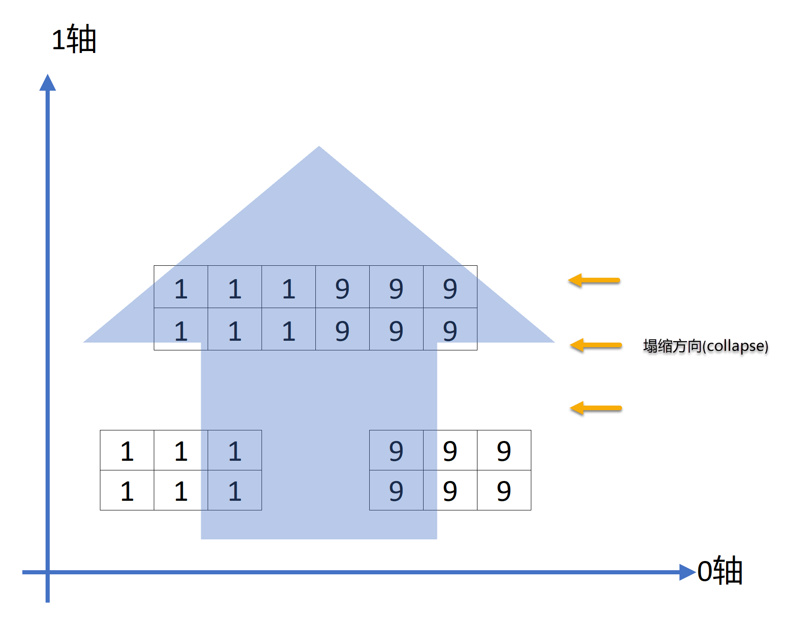

# NumPy基础：数组与向量化计算

* NumPy ndarry：多维数组对象
* 通用函数：快速的逐元素数组函数
* 使用数组进行面向数组编程
* 使用数组进行文件输入和输出
* 线性代数
* 伪随机数生成
* 示例：随机漫步

## 多维数组对象ndarry

### 别名约定

```
import numpy as np
import pandas as pd
import matplotlib.pyplot as plt
```


### 安装matplotlib中文字体

查看字体路径 
```
>>> import matplotlib 
>>> print(matplotlib.matplotlib_fname())
/home/james/.local/lib/python3.6/site-packages/matplotlib/mpl-data/matplotlibrc
```

下载中文字体。网址 https://www.fontpalace.com/font-download/SimHei/,并拷贝到下面的路径下
```
james@lizard:~/Downloads> cp SimHei.ttf /home/james/.local/lib/python3.6/site-packages/matplotlib/mpl-data/fonts/ttf/
``` 

查看matplotlib的字体缓存目录。 
```
>>> import matplotlib
>>> print(matplotlib.get_cachedir())
/home/james/.cache/matplotlib
```

删除这个目录 
```
james@lizard:~> rm -rf /home/james/.cache/matplotlib
```

编辑matplotlibrc文件 `/home/james/.local/lib/python3.6/site-packages/matplotlib/mpl-data/matplotlibrc`，做如下修改。

* 定位这一行，去掉注释符 `# font.family: sans-serif `
* 定位这一行，去掉注释符`#`，并添加`SimHei`，修改后为`font.serif: SimHei, DejaVu Serif, Bitstream Vera Serif, Computer Modern Roman, New Century Schoolbook, Century Schoolbook L, Utopia, ITC Bookman, Bookman, Nimbus Roman No9 L, Times New Roman, Times, Palatino, Charter, serif`
* 定位这一行，去掉注释符`#`，并添加`SimHei`，修改后为`font.sans-serif: SimHei, DejaVu Sans, Bitstream Vera Sans, Computer Modern Sans Serif, Lucida Grande, Verdana, Geneva, Lucid, Arial, Helvetica, Avant Garde, sans-serif`
* 定位这一行，去掉注释符`#`，并把`True`改为`False`，修改后为`axes.unicode_minus: False`


### 设置matplotlib后端渲染器

在使用matplotlib输出图像时，如果遇到无法显示图像的错误`UserWarning: Matplotlib is currently using agg, which is a non-GUI backend, so cannot show the figure。`，可以尝试下面的步骤解决。

安装`python3-tk`包
```
james@lizard:~> sudo zypper in python3-tk
```
或者通过`pip`安装`tk`包
```
james@lizard:~> pip3 install tk
Defaulting to user installation because normal site-packages is not writeable
Collecting tk
  Downloading tk-0.1.0-py3-none-any.whl (3.9 kB)
Installing collected packages: tk
Successfully installed tk-0.1.0
```

一般完成上面安装后，程序就能自动显示图了，如果还是不能显示，再尝试重新安装`matplotlib`。
```
pip3 ininstall matplotlib
pip3 install matplotlib
```


### ndarray: N-维数组对象

一个ndarray是一个通用的多维同类数据容器，也就是说，它包含的每一个元素均为**相同类型**；
每一个数组都有一个shape属性，用来表征数组每一维度的数量；
每一个数组都有一个dtype属性，用来描述数组的数据类型；

下面是标准数组的生成函数

* array: 将输入数据（列表、元组、数组，其他序列）转换为ndarray，如果不显式指明数据类型，将自动推断；默认复制所有的输入数据。
* asarray：将输入转换为ndarray，但如果输入已经是ndarray则不再复制。
* arange：Python内置函数range的数组版，返回一个数组。


下面是用`Numpy.random()`一个生成一个随机数组的例子，注意`data01`的类型是'numpy.ndarray'。可以在ndarray类型数组上叠加一下数学操作。

```
data01 = np.random.randn(2, 3)

print(type(data01))
# <class 'numpy.ndarray'>

print(data01)
# [[ 0.12047302 -1.13499045 -0.39311368]
#  [ 1.54046881  0.01254838 -3.65090952]]

print(data01 * 10)  # 给data加上一个数学操作, 所有的元素都同时乘以了10
# [[  1.20473022 -11.3499045   -3.93113676]
#  [ 15.40468806   0.12548383 -36.50909515]]

print(data01 + data01)  # 给data加上一个数学操作, 数组中的对应元素进行了相加
# [[ 0.24094604 -2.2699809  -0.78622735]
#  [ 3.08093761  0.02509677 -7.30181903]]

print(data01.shape)
# (2, 3)

print(data01.dtype)
# float64

```

当表达“数组”、“NumPy数组”或“ndarray”时，都表示同一个对象：ndarray对象。

看下面的例子：

* `data01`是一个列表（list）类型，通过`Numpy.array`转换成Numpy的`ndarray`类型。
* 在`np.array`中，除非显式地指定，如`np.array(data01, dtype=np.int8)`，否则np.array会自动推断生成数组的数据类型`array01.dtype`。
* 使用`astype()`方法显式地转换数组的数据类型。使用`astype()`时总是生成一个*新的数组*，即使你传入的dtype与之前一样。
* `data02`是一个嵌套列表`[[1, 2, 3, 4], [5, 6, 7, 8]]`，通过np.array()方法转换成多维数组，前提是每个子列表的长度要一致。


```
data01 = [6, 7.5, 8, 0, 1]
print(data01)
# [6, 7.5, 8, 0, 1]
print(type(data01))
# <class 'list'>

array01 = np.array(data01)
print("矩阵类型", type(array01))
# 矩阵类型 <class 'numpy.ndarray'>
print("样本矩阵", array01)
# 样本矩阵 [6.  7.5 8.  0.  1. ]
print("数组维度", array01.ndim)  
# 数组维度 1
print("矩阵形状", array01.shape)  
# 矩阵形状 (5,)  一行五列
print("矩阵数据类型", array01.dtype) 
# float64

data02 = [[1, 2, 3, 4], [5, 6, 7, 8]]
array02 = np.array(data02)
print("样本矩阵\n", array02)
# 样本矩阵
#  [[1 2 3 4]
#  [5 6 7 8]]
print("数组维度", array02.ndim)
# 数组维度 2
print("矩阵形状", array02.shape)
# 矩阵形状 (2, 4)
print("矩阵数据类型", array02.dtype)
# 矩阵数据类型 int64
print("矩阵0轴向求和", array02.sum(axis=0))
# 矩阵0轴向求和 [ 6  8 10 12]
print("矩阵1轴向求和", array02.sum(axis=1))
# 矩阵1轴向求和 [10 26]

array03 = array02.astype(np.float64)
print(array03.dtype)  
# float64
print(array03)
# [[1. 2. 3. 4.]
#  [5. 6. 7. 8.]]
```


`zeros()`方法可以一次性创造全0数组。
```
print(np.zeros(10))
# [0. 0. 0. 0. 0. 0. 0. 0. 0. 0.]
```

`ones()`方法可以一次性创造全1数组。注意，传参shape是一个元组`(3, 5)`。
```
print(np.ones((3, 5)))
# [[1. 1. 1. 1. 1.]
#  [1. 1. 1. 1. 1.]
#  [1. 1. 1. 1. 1.]]
```

`empty()`方法可以创建一个没有初始化数值的数组。但是，使用np.empty来生成一个全0数组，并不可靠，有些时候它可能会返回未初始化的垃圾数值
```
print(np.empty((2, 3, 2)))
# [[[2.30116964e-316 0.00000000e+000]
#   [2.10077583e-312 6.79038654e-313]
#   [2.22809558e-312 2.14321575e-312]]
#
#  [[2.35541533e-312 6.79038654e-313]
#   [2.22809558e-312 2.14321575e-312]
#   [2.46151512e-312 2.41907520e-312]]]
```


### NumPy轴

一句话总结：将NumPy轴视为我们可以执行操作的方向。

看下面的例子：
```
arr_1 = np.array([[1, 1, 1], [1, 1, 1]])
arr_2 = np.array([[9, 9, 9], [9, 9, 9]])

print(arr_1)
# [[1 1 1]
#  [1 1 1]]
print(arr_2)
# [[9 9 9]
#  [9 9 9]]
```

沿0轴合并的思路是，两个数组沿0轴方向，向0轴“塌缩”（collapse）。
```
result = np.concatenate([arr_1, arr_2], axis=0)
print(result)
# [[1 1 1]
#  [1 1 1]
#  [9 9 9]
#  [9 9 9]]
```


沿1轴合并的思路是，两个数组沿1轴方向，向1轴“塌缩”
```
result = np.concatenate([arr_1, arr_2], axis=1)
print(result)
# [[1 1 1 9 9 9]
#  [1 1 1 9 9 9]]
```



我们来看NumPy的三维数组。
```
array1 = np.arange(36).reshape((3, 3, 4))
print(array1)
# [[[ 0  1  2  3]
#   [ 4  5  6  7]
#   [ 8  9 10 11]]
#
#  [[12 13 14 15]
#   [16 17 18 19]
#   [20 21 22 23]]
#
#  [[24 25 26 27]
#   [28 29 30 31]
#   [32 33 34 35]]]
```

这样看会容易理解一些，0轴有3行，1轴有3列，2轴有4个元素：
```
[[[ 0  1  2  3], [ 4  5  6  7], [ 8  9 10 11]]
 [[12 13 14 15], [16 17 18 19], [20 21 22 23]]
 [[24 25 26 27], [28 29 30 31], [32 33 34 35]]]
```

输出：轴0索引号：0；轴1索引号：0；轴2索引号：全部
```
print(array1[0, 0, :])
# [0 1 2 3]
```

输出：轴0索引号：0；轴1索引号：0；轴2索引号：1
```
print(array1[0, 0, 1])
# 1
```


### NumPy数组算术

一个**标量**就是一个单独的数。一个向量就是一列数，这些数是有序排列的。
矩阵是二维数组，其中的每一个元素被两个索引而非一个所确定。

几何代数中定义的**张量**是基于向量和矩阵的推广，我们可以**将标量视为零阶张量**，**矢量**视为一阶张量，那么**矩阵就是二阶张量**。

带有标量计算的算术操作，会把计算参数传递给数组的每一个元素。

同尺寸数组之间的比较`array04 == array04`，会产生一个布尔值数组 不同尺寸的数组间的操作，将会用到[广播特性（broadcasting）](ch10.md)。

```
array04 = np.array([
    [1, 2, 3, 4, 5],
    [3, 4, 5, 6, 7],
    [5, 6, 7, 8, 9]
], dtype=int)

print(array04 + array04)
# [[ 2  4  6  8 10]
#  [ 6  8 10 12 14]
#  [10 12 14 16 18]]

print(array04 - array04)
# [[0 0 0 0 0]
#  [0 0 0 0 0]
#  [0 0 0 0 0]]

print(array04 * array04)
# [[ 1  4  9 16 25]
#  [ 9 16 25 36 49]
#  [25 36 49 64 81]]

print(array04 / array04)
# [[1. 1. 1. 1. 1.]
#  [1. 1. 1. 1. 1.]
#  [1. 1. 1. 1. 1.]]

print(1 / array04)
# [[1.         0.5        0.33333333 0.25       0.2       ]
#  [0.33333333 0.25       0.2        0.16666667 0.14285714]
#  [0.2        0.16666667 0.14285714 0.125      0.11111111]]

print(array04 == array04)
# [[ True  True  True  True  True]
#  [ True  True  True  True  True]
#  [ True  True  True  True  True]]
```


### 基础索引与切片

ndarray对象的内容可以通过索引（indexing）或切片（slicing）来访问和修改，ndarray对象中的元素索引从零开始。 有三种可用的索引方法：字段访问，基本切片和高级索引。

索引（indexing）：获取数组中特定位置元素的过程。

切片（slicing）：获取数组元素子集的过程。数组的切片是原数组的视图。这意味着任何**对于视图的修改都会反映到原数组上**。数组的切片, 返回的对象是降低一个维度的数组。


一维数组的索引和切片：与Python的列表类似：

* `a[n]` ：返回第`n+1`个元素。如果`n`为负数，则返回倒数第`n`个元素。

* `a[n:m:k]` ：起始编号`n`，终止编号`m`，步长`k`，用冒号分割。**遵循左闭右开的原则**，即`[n, m)`。如果`n`为空，即 `n = 0` ；如果`m`为空，即 `m = len(a)` 。


多维数组的索引和切片：

* `a[n,m,k,...]` ：每个维度一个索引值，最外层列表（list）中第`n`个元素，次外层列表（list）中第`m`个元素，以此类推。如果`n`为负数，则返回倒数第`n`个元素。
* `a[n1:m1:k1,n2:m2:k2,n3:m3:k3,...]` ：每个维度的切片方法与一维数组相同。顺序为从外到内。


```
array05 = np.arange(10)

print(array05)  
# [0 1 2 3 4 5 6 7 8 9]

# 从索引值5开始到索引值7的一个切片。
print(array05[5:8])  
# [5 6 7]

array06 = array05[5:8]

# 传入一个数值给数组的切片，数值被传递给了整个切片。不写切片值的[:]将会引用数组的所有值
array06[:] = 12

print(array06)  
# [12 12 12]

# 切片的修改会反映到原数组上
print(array05)  
# [ 0  1  2  3  4 12 12 12  8  9]  


# 输出3维矩阵，3行3列，共9个元素，每个元素是一个含3个元素的列表
array07 = np.array([
    [[0, 1, 2], [3, 4, 5], [6, 7, 8]],
    [[9, 0, 1], [2, 3, 4], [5, 6, 7]],
    [[8, 9, 0], [1, 2, 3], [4, 5, 6]],
])

# 输出3维矩阵，显示原矩阵的第1，2行的2，3列元素，不要把索引号和这里的表述行号混淆。
print(array07[:2, 1:])  
# [[[3 4 5] [6 7 8]]
#  [[2 3 4] [5 6 7]]]

print(array07[:2, 1:].shape)  
# (2, 2, 3)

# 降维，输出原矩阵的第3行
print(array07[2])  
# [[8 9 0]  [1 2 3] [4 5 6]]
print(array07[2].shape)  
# (3, 3)

# 降维，输出原矩阵的第3行
print(array07[2, :])
# [[8 9 0] [1 2 3] [4 5 6]]
print(array07[2, :].shape)  
# (3, 3)

# 降维，输出原矩阵的第3行（只有三行，所以[2:, :]等同于[2, :]）
print(array07[2:, :])
# [[[8 9 0] [1 2 3] [4 5 6]]]
print(array07[2:, :].shape)  
# (1, 3, 3)

# 输出原矩阵的1，2列
print(array07[:, :2])
# [[[0 1 2] [3 4 5]]
#  [[9 0 1] [2 3 4]]
#  [[8 9 0] [1 2 3]]]
print(array07[:, :2].shape)
# (3, 2, 3)

# 降维，输出原矩阵的第2行前2个元素
print(array07[1, :2])  
# [[9 0 1] [2 3 4]]
print(array07[1, :2].shape)
# (2, 3)

# 输出原矩阵的第2行前2个元素
print(array07[1:2, :2])
# [[[9 0 1] [2 3 4]]]
print(array07[1:2, :2].shape)
# (1, 2, 3)

# 将原矩阵的第2行赋值给变量
old_value = array07[2].copy()
print(old_value)
# [[8 9 0] [1 2 3] [4 5 6]]

# 修改原矩阵的第2行的值，标量和数组都可以传递给 array07[2]
array07[2] = 25  
print(array07)
# [[[ 0  1  2] [ 3  4  5] [ 6  7  8]]
#  [[ 9  0  1] [ 2  3  4] [ 5  6  7]]
#  [[25 25 25] [25 25 25] [25 25 25]]]

# 将变量值赋值给原矩阵的第2行
array07[2] = old_value
print(array07)
# [[[0 1 2] [3 4 5] [6 7 8]]
#  [[9 0 1] [2 3 4] [5 6 7]]
#  [[8 9 0] [1 2 3] [4 5 6]]]
```


### 布尔索引

布尔值索引（Boolean indexing）是通过一个布尔数组来索引目标数组，以此找出与布尔数组中值为True的对应的目标数组中的数据。布尔数组的长度必须与目标数组对应的轴的长度一致。

使用布尔值索引（Boolean indexing）选择数据时，总是生成数据的拷贝，即使返回的数组并没有任何变化。

假设我们的数据都在数组中，并且数组中的数据是一些存在重复的人名。用randn函数生成一些标准正态(standard normal)分布的数据。假设每个人名都和data数组中的一行相对应，并且我们想要选中所有’Bob’对应的行。
```
names = np.array(['Bob', 'Joe', 'Will', 'Bob', 'Will', 'Joe', 'Joe'], dtype='<U4')

data = np.random.randn(7, 4)

print(names)
# ['Bob' 'Joe' 'Will' 'Bob' 'Will' 'Joe' 'Joe']

print(data)
# [[ 0.19233985 -0.22530396 -0.68464485  0.03961609]
#  [ 0.26189893 -0.86823302  0.72726864  0.16122945]
#  [-0.70564457  0.59179465  0.05572085 -1.79999391]
#  [-0.21465342  0.09236611  0.02982635 -1.08500576]
#  [ 1.17260699 -0.53172414  0.16224439  0.60597493]
#  [ 0.49879926 -0.64871168  0.57597095  0.86329327]
#  [-0.64902274 -0.92406415  0.40021708 -0.18222566]]

print(names == 'Bob')
# [ True False False True False False False]

# 上述data的行索引为0、3的值（对应于Bob为True）
print(data[names == 'Bob'])
# [[ 0.19233985 -0.22530396 -0.68464485  0.03961609]
#  [-0.21465342  0.09236611  0.02982635 -1.08500576]]

# 上述data的行索引为0、3且列索引为2、3的值（对应于Bob为True）
print(data[names == 'Bob', 2:])
# [[-0.68464485  0.03961609] [ 0.02982635 -1.08500576]]

# 上述data的行索引为0、3且列索引为3的值（对应于Bob为True）
print(data[names == 'Bob', 3])
# [ 0.03961609 -1.08500576]
```

使用`!=`或在条件表达式前使用`～`对条件取反, 选择除了’Bob’以外的其他数据。
```
print(names != 'Bob')
print(data[~(names == 'Bob')])
```

选择三个名字中的两个时，可以对多个布尔值条件进行联合，使用数学操作符如`&`（and）和`|`（or）。
```
mask = (names == 'Bob') | (names == 'Will')
print(mask)
# [ True False True True True False False]

# 更新直接作用在`data`数据集上，不是在副本中修改。
data[names == 'Joe'] = 7
print(data)
# [[ 1.12584226 -1.09988707  0.49842702  0.76308186]
#  [ 7.          7.          7.          7.        ]
#  [ 1.54212949 -0.34487439 -1.47775736 -0.25724376]
#  [ 0.60943059 -0.0164697   0.26681455 -1.70871624]
#  [ 0.28010374 -0.32339505 -0.95289544  2.76739316]
#  [ 7.          7.          7.          7.        ]
#  [ 7.          7.          7.          7.        ]]
```


### 神奇索引（花式索引）

**神奇索引（Fancy Indexing）**，也翻译为**花式索引**或**复杂索引**，用于描述使用整数数组进行数据索引，这里的数组，可以是NumPy的数组，也可以是python自带的列表（list）。神奇索引与切片不同，它总是将数据**复制**到一个新的数组中（副本）。
特别注意的一点是，使用fancy indexing返回数组的shape，是索引数组的shape，而不是被索引的原数组的shape。

使用fancy indexing时要特别注意的一点是返回数组的shape反映的是索引数组的shape而不是被索引的原数组的shape。

假设有一个8×4的数组：
```
array08 = np.empty((8, 4))  # 参数是个元组(8, 4)。
for i in range(8):
    array08[i] = i

print(array08)
# [[0. 0. 0. 0.]
#  [1. 1. 1. 1.]
#  [2. 2. 2. 2.]
#  [3. 3. 3. 3.]
#  [4. 4. 4. 4.]
#  [5. 5. 5. 5.]
#  [6. 6. 6. 6.]
#  [7. 7. 7. 7.]]

# 输出索引为2和-2的行值。传递一个包含指明所需顺序的列表[2, -2]（或数组），选出一个符合特定顺序的子集
print(array08[[2, -2]])
# [[2. 2. 2. 2.]
#  [6. 6. 6. 6.]]

# 用0~31生成一个8x4数组
array09 = np.arange(32).reshape((8, 4))
print(array09)
# [[ 0  1  2  3]
#  [ 4  5  6  7]
#  [ 8  9 10 11]
#  [12 13 14 15]
#  [16 17 18 19]
#  [20 21 22 23]
#  [24 25 26 27]
#  [28 29 30 31]]

print(array09[[1, 5, 7, 2]])  # 数组[1, 5, 7, 2]指定了输出顺序
# [[ 4  5  6  7]
#  [20 21 22 23]
#  [28 29 30 31]
#  [ 8  9 10 11]]

print(array09[[0, 3, 1, 2]])
# [[ 0  1  2  3]
#  [12 13 14 15]
#  [ 4  5  6  7]
#  [ 8  9 10 11]]

print(array09[[1, 5, 7, 2], [0, 3, 1, 2]])
# [ 4 23 29 10]
```

`array09[[1, 5, 7, 2]]`中通过一个列表`[1, 5, 7, 2]`来指定输出顺序。

`array09[[1, 5, 7, 2], [0, 3, 1, 2]]`可以理解为基于`array09[[1, 5, 7, 2]]`输出的矩阵，通过[0, 3, 1, 2]指定了结果集的每一行选取的值，比如，3代表结果集[20 21 22 23]的第三个元素（23）。或者，可以理解为，元素（1, 0）、（5, 3）、（7, 1）和（2, 2）被选中。


### 数组转置和换轴

数组转置，有T属性、`transpose()`方法、`swapaxes()`方法。
`swapaxes()`方法默认是(0轴, 1轴)，即`swapaxes(0, 1)`，返回的是数据的视图，没有对数据进行复制。
```
array10 = np.arange(15).reshape((3, 5))

print(array10)
# [[ 0  1  2  3  4]
#  [ 5  6  7  8  9]
#  [10 11 12 13 14]]

# 矩阵转置（T属性）
print(array10.T)
# [[ 0  5 10]
#  [ 1  6 11]
#  [ 2  7 12]
#  [ 3  8 13]
#  [ 4  9 14]]

# 矩阵转置（transpose()方法）
print(array10.transpose())
# [[ 0  5 10]
#  [ 1  6 11]
#  [ 2  7 12]
#  [ 3  8 13]
#  [ 4  9 14]]

# 矩阵转置（swapaxes()方法）
print(array10.swapaxes(1, 0))
# [[ 0  5 10]
#  [ 1  6 11]
#  [ 2  7 12]
#  [ 3  8 13]
#  [ 4  9 14]]
```


通过T属性，计算矩阵内积（Inner Product）。矩阵内积参照向量内积的定义是：两个向量对应分量乘积之和。
```
array10 = np.arange(6).reshape((2, 3))
print(array10)
# [[0 1 2]
#  [3 4 5]]

print(array10.T)
# [[0 3]
#  [1 4]
#  [2 5]]

print(np.dot(array10, array10.T))
# [[ 5 14]
#  [14 50]]
```

对于更高维度的数组，`transpose()`方法可以接收包含轴编号的元组，用于置换轴。
```
array11 = np.arange(36).reshape((3, 3, 4))
print(array11)
# [[[ 0  1  2  3]
#   [ 4  5  6  7]
#   [ 8  9 10 11]]
#
#  [[12 13 14 15]
#   [16 17 18 19]
#   [20 21 22 23]]
#
#  [[24 25 26 27]
#   [28 29 30 31]
#   [32 33 34 35]]]

print(array11.transpose((0, 1, 2)))  # 默认是(0轴, 1轴, 2轴)。所以输出原矩阵
# [[[ 0  1  2  3]
#   [ 4  5  6  7]
#   [ 8  9 10 11]]
#
#  [[12 13 14 15]
#   [16 17 18 19]
#   [20 21 22 23]]
#
#  [[24 25 26 27]
#   [28 29 30 31]
#   [32 33 34 35]]]

print(array11.transpose((1, 0, 2)))  # 输出顺序调整为原矩阵的(1轴, 0轴, 2轴)
# [[[ 0  1  2  3]
#   [12 13 14 15]
#   [24 25 26 27]]
#
#  [[ 4  5  6  7]
#   [16 17 18 19]
#   [28 29 30 31]]
#
#  [[ 8  9 10 11]
#   [20 21 22 23]
#   [32 33 34 35]]]

print(array11.swapaxes(1, 0))  # 同上transpose((1, 0, 2))
# [[[ 0  1  2  3]
#   [12 13 14 15]
#   [24 25 26 27]]
#
#  [[ 4  5  6  7]
#   [16 17 18 19]
#   [28 29 30 31]]
#
#  [[ 8  9 10 11]
#   [20 21 22 23]
#   [32 33 34 35]]]

print(array11.transpose((2, 1, 0)))
# [[[ 0 12 24]
#   [ 4 16 28]
#   [ 8 20 32]]
#
#  [[ 1 13 25]
#   [ 5 17 29]
#   [ 9 21 33]]
#
#  [[ 2 14 26]
#   [ 6 18 30]
#   [10 22 34]]
#  [[ 3 15 27]
#   [ 7 19 31]
#   [11 23 35]]]
```


## 通用函数

**通用函数**也称为ufunc，是一种在ndarray数据中进行逐元素操作的函数，即快速的逐元素数组函数。
某些简单函数接收一个或多个标量数值，并产生一个或多个标量结果，而**通用函数就是对这些简单函数的向量化封装**。

一元通用函数

* abs、fabs：逐元素地计算整数、浮点数或复数的绝对值
* sqrt：计算每个元素的平方根（与arr**0.5相等）
* square：计算每个元素的平方（与arr**2相等）
* exp：计算以e为底, 数组元素为幂次的指数函数


二元通用函数

* add：将数组的对应元素相加。
* subtract：在第二个数组中，将第一个数组中包含的元素去除。
* multiply：将数组的对应元素相乘。
* divide，floor_divide：除、或整除（放弃余数）
* power：将第二个数组的元素作为第一个数组对应元素的幂次方。
* maximun、fmax：逐个元素计算最大值，fmax忽略NaN。
* minimum、fmin：逐个元素计算最小值，fmin忽略NaN。
* mod：按元素的求模计算（即求除法的余数）。
* copysign：将第一个数组的符号值改为第二个数组的符号值。
* greater、greater_euqal、less、less_equal、equal、not_euqal：进行逐个元素的比较，返回布尔值数组。
* logical_and、logical_or、logical_xor：进行逐个元素的逻辑操作。


看下例，对多维数组计算exp函数。
```
array12 = np.arange(10).reshape((2, 5))

print(array12)
# [[0 1 2 3 4]
#  [5 6 7 8 9]]

print(np.sqrt(array12))
# [[0.         1.         1.41421356 1.73205081 2.        ]
#  [2.23606798 2.44948974 2.64575131 2.82842712 3.        ]]

print(np.exp(array12))
# [[1.00000000e+00 2.71828183e+00 7.38905610e+00 2.00855369e+01 5.45981500e+01]
#  [1.48413159e+02 4.03428793e+02 1.09663316e+03 2.98095799e+03 8.10308393e+03]]
```

下例中，`numpy.maximum`逐元素地将数组`x`和`y`中的最大值计算出来。`numpy.add`逐元素地将数组`x`和`y`的和计算出来。
```
array13 = [1, 4, 5, 8, 9]
array14 = [2, 3, 6, 7, 10]

print(np.maximum(array13, array14))
# [ 2  4  6  8 10]

print(np.add(array13, array14))
# [ 3  7 11 15 19]
```

下例中，`modf`返回一个浮点值数组的小数部分和整数部分
```
array15 = np.random.randn(7) * 5

print(array15)
# [-7.54395135 -0.065131    2.71582306  2.2432261  11.02637158  6.73968036  2.96895379]

remainder, whole_part = np.modf(array15)

print(remainder)
# [-0.54395135 -0.065131    0.71582306  0.2432261   0.02637158  0.73968036  0.96895379]

print(whole_part)
# [-7. -0.  2.  2. 11.  6.  2.]
```
                            


## 面向数组编程

利用**数组表达式**来替代显式循环的方法，称为**向量化**。
向量化的数组操作会比纯Python的等价实现在速度上快一到两个数量级（甚至更多）。

下例中，np.meshgrid函数接收两个一维数组，并根据两个数组的所有(x, y)对生成一个二维矩阵。
```
array = np.arange(-5, 5, 1, dtype=int)

print("样本矩阵 \n", array)

xs, ys = np.meshgrid(array, array)

print("生成x轴向2维矩阵 \n", xs)

print("生成y轴向2维矩阵 \n", ys)

# 样本矩阵
#  [-5 -4 -3 -2 -1  0  1  2  3  4]
# 生成x轴向2维矩阵
#  [[-5 -4 -3 -2 -1  0  1  2  3  4]
#   [-5 -4 -3 -2 -1  0  1  2  3  4]
#   [-5 -4 -3 -2 -1  0  1  2  3  4]
#   [-5 -4 -3 -2 -1  0  1  2  3  4]
#   [-5 -4 -3 -2 -1  0  1  2  3  4]
#   [-5 -4 -3 -2 -1  0  1  2  3  4]
#   [-5 -4 -3 -2 -1  0  1  2  3  4]
#   [-5 -4 -3 -2 -1  0  1  2  3  4]
#   [-5 -4 -3 -2 -1  0  1  2  3  4]
#   [-5 -4 -3 -2 -1  0  1  2  3  4]]
# 生成y轴向2维矩阵
#  [[-5 -5 -5 -5 -5 -5 -5 -5 -5 -5]
#   [-4 -4 -4 -4 -4 -4 -4 -4 -4 -4]
#   [-3 -3 -3 -3 -3 -3 -3 -3 -3 -3]
#   [-2 -2 -2 -2 -2 -2 -2 -2 -2 -2]
#   [-1 -1 -1 -1 -1 -1 -1 -1 -1 -1]
#   [ 0  0  0  0  0  0  0  0  0  0]
#   [ 1  1  1  1  1  1  1  1  1  1]
#   [ 2  2  2  2  2  2  2  2  2  2]
#   [ 3  3  3  3  3  3  3  3  3  3]
#   [ 4  4  4  4  4  4  4  4  4  4]]
```


下面用图形化来输出上例中生成的NumPy的数组。

```
import numpy as np
import matplotlib.pyplot as plt

array = np.arange(-5, 5, 1, dtype=int)

xs, ys = np.meshgrid(array, array)

z = np.sqrt(xs**2 + ys**2)

print("样本矩阵 \n", z)
# 样本矩阵 
#  [[7.07106781 6.40312424 5.83095189 5.38516481 5.09901951 5. 5.09901951 5.38516481 5.83095189 6.40312424]
#   [6.40312424 5.65685425 5.         4.47213595 4.12310563 4. 4.12310563 4.47213595 5.         5.65685425]
#   [5.83095189 5.         4.24264069 3.60555128 3.16227766 3. 3.16227766 3.60555128 4.24264069 5.        ]
#   [5.38516481 4.47213595 3.60555128 2.82842712 2.23606798 2. 2.23606798 2.82842712 3.60555128 4.47213595]
#   [5.09901951 4.12310563 3.16227766 2.23606798 1.41421356 1. 1.41421356 2.23606798 3.16227766 4.12310563]
#   [5.         4.         3.         2.         1.         0. 1.         2.         3.         4.        ]
#   [5.09901951 4.12310563 3.16227766 2.23606798 1.41421356 1. 1.41421356 2.23606798 3.16227766 4.12310563]
#   [5.38516481 4.47213595 3.60555128 2.82842712 2.23606798 2. 2.23606798 2.82842712 3.60555128 4.47213595]
#   [5.83095189 5.         4.24264069 3.60555128 3.16227766 3. 3.16227766 3.60555128 4.24264069 5.        ]
#   [6.40312424 5.65685425 5.         4.47213595 4.12310563 4. 4.12310563 4.47213595 5.         5.65685425]]

# 使用matplotlib来生成这个二维数组的可视化
plt.imshow(z, cmap=plt.cm.gray)

print(plt.colorbar)
# <function colorbar at 0x7f9c91193f70>

# 图像标题
plt.title("$\sqrt{x^2 + y^2}$ 计算值的网格图")

# 输出图像
plt.show()

```
输出图像为：


### 通过条件逻辑操作数组

`numpy.where`函数是三元表达式`x if condition else y`的向量化版本。
`np.where`的第二个和第三个参数并不需要是数组，它们可以是标量。

`np.where`在数据分析中的一个典型用法是根据一个数组来生成一个新的数组。

假设我们有一个布尔值数组和两个数值数组。假设`cond`中的元素为`True`时，我们取`xarr`中的对应元素值，否则取`yarr`中的元素。
```
xarray = np.array([1.1, 1.2, 1.3, 1.4, 1.5])
yarray = np.array([2.1, 2.2, 2.3, 2.4, 2.5])
cond = np.array([True, False, True, True, False])
```

通过列表推导式来实现上述需求。

缺点: 

* 首先，如果数组很大的话，速度会很慢（因为所有的工作都是通过解释器来解释Python代码完成）。
* 其次，当数组是多维时，就无法凑效了。
```
# 通过列表推导式来实现
result = [(x if c else y) for x, y, c in zip(xarray, yarray, cond)]
print(result)  # [1.1, 2.2, 1.3, 1.4, 2.5]
```

通过`np.where`来实现上述需求。
```
result = np.where(cond, xarray, yarray)
print(result)  # [1.1 2.2 1.3 1.4 2.5]
```


假设有一个随机生成的矩阵数据，下面使用np.where实现替换。
```
array = np.random.randn(4, 4)

print("样本矩阵 \n", array)
print("矩阵元素是否大于0 \n", array > 0)

# 将其中的正值都替换为2，将所有的负值替换为-2
result03 = np.where(array > 0, 2, -2)

print("将其中的正值都替换为2，将所有的负值替换为-2 \n", result03)

# 仅将其中的正值都替换为2
result04 = np.where(array > 0, 2, array)
print("仅将其中的正值都替换为2 \n", result04)

# 样本矩阵
#  [[-0.57177422 -0.34917512  2.20268075  1.99959296]
#  [ 0.67966599  2.67915099 -0.40528454 -0.80339907]
#  [-0.74406888  2.33802717 -0.74582936  0.59347128]
#  [ 0.68624473  0.65953112 -0.40871415 -0.68698878]]
# 矩阵元素是否大于0
#  [[False False  True  True]
#  [ True  True False False]
#  [False  True False  True]
#  [ True  True False False]]
# 将其中的正值都替换为2，将所有的负值替换为-2
#  [[-2 -2  2  2]
#  [ 2  2 -2 -2]
#  [-2  2 -2  2]
#  [ 2  2 -2 -2]]
# 仅将其中的正值都替换为2
#  [[-0.57177422 -0.34917512  2.          2.        ]
#  [ 2.          2.         -0.40528454 -0.80339907]
#  [-0.74406888  2.         -0.74582936  2.        ]
#  [ 2.          2.         -0.40871415 -0.68698878]]
```


### 数学和统计方法

NumPy有一些专门的数学函数，用来计算整个数组统计值或轴向数据的计算。例如，聚合函数（通常也叫缩减函数），如sum、mean和std（标准差）。
既可以直接调用数组实例的方法，也可以使用顶层的NumPy函数。

举例：生成一些正态分布的随机数，计算部分聚合统计数据。
这里再对轴向做个解释，`np.random.randn(5, 4)`产生的二维数组是：0轴向5个元素, 1轴向4个元素。
```
# 生成2轴数组
array = np.random.randn(5, 4)
print("样本矩阵 \n", array)

print("矩阵元素平均值", array.mean())
print("矩阵元素平均值", np.mean(array))

print("矩阵元素和", array.sum())
print("矩阵元素和", np.sum(array))

print("0轴向的累和", array.sum(axis=0))
print("1轴向的累和", array.sum(axis=1))

print("1轴向的平均值", array.mean(axis=1))

# 样本矩阵  shape=(5, 4)  0轴向5个元素, 1轴向4个元素
#  [[ 0.32532911 -0.00177984 -1.59432632  1.58375133]
#   [ 1.48921763  0.25202456  0.44076148 -1.02277289]
#   [-0.73490219  0.19197171 -0.22374362  0.52610852]
#   [-1.03531076  1.0595528  -0.11566501  0.34063544]
#   [-0.2122241  -0.81348187  1.70989712 -0.00732696]]
# 矩阵元素平均值 0.10788580775057008
# 矩阵元素平均值 0.10788580775057008
# 矩阵元素和 2.1577161550114017
# 矩阵元素和 2.1577161550114017
# 0轴向的累和 [-0.16789031  0.68828737  0.21692365  1.42039545]
# 1轴向的累和 [ 0.31297429  1.15923078 -0.24056558  0.24921247  0.67686419]
# 1轴向的平均值 [ 0.07824357  0.28980769 -0.06014139  0.06230312  0.16921605]
```

下面列举了常用的基础数组统计方法。
```
array = np.array([
    [1, 2, 3, 4, 5],
    [3, 4, 5, 6, 7],
    [5, 6, 7, 8, 9]
], dtype=int)
print("样本矩阵 \n", array)
print("轴向求和", array.sum())
print("轴向求和", array.sum(axis=0))
print("数学平均", array.mean())
print("轴向数学平均", array.mean(axis=0))
print("标准差", array.std(), "方差", array.var())
print("轴向标准差", array.std(axis=0), "轴向方差", array.var(axis=0))
print("最小值", array.min(), "最大值", array.max())
print("轴向最小值", array.min(axis=0), "轴向最大值", array.max(axis=0))
print("最小值位置", array.argmin(), "最大值位置", array.argmax())
print("轴向最小值位置", array.argmin(axis=0), "轴向最大值位置", array.argmax(axis=0))
print("累积和 \n", array.cumsum())
print("轴向累积和 \n", array.cumsum(axis=1))
print("累积乘积 \n", array.cumprod())
print("轴向累积乘积 \n", array.cumprod(axis=1))

# 样本矩阵
#  [[1 2 3 4 5]
#   [3 4 5 6 7]
#   [5 6 7 8 9]]
# 轴向求和 75
# 轴向求和 [ 9 12 15 18 21]
# 数学平均 5.0
# 轴向数学平均 [3. 4. 5. 6. 7.]
# 标准差 2.160246899469287 方差 4.666666666666667
# 轴向标准差 [1.63299316 1.63299316 1.63299316 1.63299316 1.63299316] 轴向方差 [2.66666667 2.66666667 2.66666667 2.66666667 2.66666667]
# 最小值 1 最大值 9
# 轴向最小值 [1 2 3 4 5] 轴向最大值 [5 6 7 8 9]
# 最小值位置 0 最大值位置 14
# 轴向最小值位置 [0 0 0 0 0] 轴向最大值位置 [2 2 2 2 2]
# 累积和
#  [ 1  3  6 10 15 18 22 27 33 40 45 51 58 66 75]
# 轴向累积和
#  [[ 1  3  6 10 15]
#   [ 3  7 12 18 25]
#   [ 5 11 18 26 35]]
# 累积乘积
#  [         1          2          6         24        120        360
#         1440       7200      43200     302400    1512000    9072000
#     63504000  508032000 4572288000]
# 轴向累积乘积
#  [[    1     2     6    24   120]
#   [    3    12    60   360  2520]
#   [    5    30   210  1680 15120]]
```

### 布尔值数组(Boolean Array)的方法

布尔值数组，有两个非常有用的方法any和all。
* any检查数组中是否至少有一个True，
* all检查是否每个值都是True
```
bools = np.array([False, False, True, False])
print(bools.any())  # True
print(bools.all())  # False
```

下面是一个运用布尔值数组（Boolean Array）进行求和的一个例子，其中`(array > 0)`本身是一个布尔型的数组。
```
array = np.random.randn(100)
result = (array > 0).sum()  # 计算正值的个数
print(result)  # 59
```

下面是运用布尔值数组的生成新数组的例子。
```
arr = [[8, 9, 10, 11], [0, 1, 2, 3], [4, 5, 6, 7]]
arr = np.array(arr)
print(arr.shape)
# (3, 4)
print(arr)
# [[ 8  9 10 11]
#  [ 0  1  2  3]
#  [ 4  5  6  7]]

idx = [[1, 0, 0, 0], [0, 1, 0, 0], [0, 0, 1, 0]]
idx = np.array(idx)
print(idx.shape)
# (3, 4)
print(idx)
# [[1 0 0 0]
#  [0 1 0 0]
#  [0 0 1 0]]

result = arr[idx]  # <class 'numpy.ndarray'>
print(result.shape)
# (3, 4, 4)
print(result)
# [[[ 0  1  2  3]
#   [ 8  9 10 11]
#   [ 8  9 10 11]
#   [ 8  9 10 11]]

#  [[ 8  9 10 11]
#   [ 0  1  2  3]
#   [ 8  9 10 11]
#   [ 8  9 10 11]]

#  [[ 8  9 10 11]
#   [ 8  9 10 11]
#   [ 0  1  2  3]
#   [ 8  9 10 11]]]

result = arr[idx == 1]
print(result.shape)
print(result)
# [8 1 6]
```


### 排序

和Python的内建列表类型相似，NumPy数组可以使用sort方法按位置排序。
顶层的np.sort方法返回的是已经排序好的数组*拷贝*，而不是对原数组按位置排序。
```
array = np.random.randn(6)
print("样本矩阵", array)

array.sort()
print("排序后矩阵", array)

# 样本矩阵 [-0.03119521  0.01839556  0.79238537 -2.46622775  0.62522211  0.22430846]
# 排序后矩阵 [-2.46622775 -0.03119521  0.01839556  0.22430846  0.62522211  0.79238537]
```

多维数组中根据传递的axis值，沿着轴向对每个一维数据段进行排序。
```
array = np.random.randn(5, 3)
print("样本矩阵 \n", array)

array.sort(1)
print("对1轴排序后矩阵 \n", array)

# 样本矩阵
#  [[-0.88057833  0.30160954 -2.08788148]
#   [ 0.27969618  0.62923028 -0.58157581]
#   [-1.87194465 -1.1102104   1.09589605]
#   [ 0.1467938  -1.01558304 -0.25905165]
#   [-0.17294279  0.62369511  0.17947059]]
# 对1轴排序后矩阵
#  [[-2.08788148 -0.88057833  0.30160954]
#   [-0.58157581  0.27969618  0.62923028]
#   [-1.87194465 -1.1102104   1.09589605]
#   [-1.01558304 -0.25905165  0.1467938 ]
#   [-0.17294279  0.17947059  0.62369511]]
```

### 唯一值与其他集合逻辑

NumPy包含一些针对一维`ndarray`数组的基础集合操作。`np.unique(x, y)`计算x的唯一值，并排序。
```
names = np.array(['Bob', 'Joe', 'Will', 'Bob', 'Will', 'Joe', 'Joe'])

result = np.unique(names)  # NumPy实现
print(result)  
# ['Bob' 'Joe' 'Will']

result = sorted(set(names))  # 纯Python实现
print(result)
# ['Bob' 'Joe' 'Will']


inits = np.array([3, 3, 3, 2, 2, 1, 1, 5, 5])

result = np.unique(inits)
print(result)  # [1 2 3 5]
```

`np.in1d(x, y)`计算x中的元素是否包含在y中，并返回一个布尔值数组。
```
inits = np.array([3, 3, 3, 2, 2, 1, 1, 5, 5])

print(np.in1d(inits, [3, 4, 5]))  
# [ True  True  True False False False False  True  True]
```

`np.intersect1d(x, y)`，计算x和y的交集，并排序。
```
inits = np.array([3, 3, 3, 2, 2, 1, 1, 5, 5])
print(np.intersect1d(inits, [3, 4, 5]))  
# [3 5]
```

`np.union1d(x, y)`计算x和y的并集，并排序。
```
inits = np.array([3, 3, 3, 2, 2, 1, 1, 5, 5])
print(np.union1d(inits, [3, 4, 5]))  
# [1 2 3 4 5]
```


`np.setdiff1d(x, y)`差集，在x中但不在y中的元素。
```
inits = np.array([3, 3, 3, 2, 2, 1, 1, 5, 5])
print(np.setdiff1d(inits, [3, 4, 5]))  
# [1 2]
```

`np.setxor1d(x, y)`异或集，在x或者y中，但不属于x，y交集的元素。
```
inits = np.array([3, 3, 3, 2, 2, 1, 1, 5, 5])
print(np.setxor1d(inits, [3, 4, 5]))   
# [1 2 4]
```


## 使用数组进行文件输入和输出

NumPy可以在硬盘中将数据以文本或二进制文件的形式进行存入硬盘或由硬盘载入。
当前只关注NumPy的内建二进制格式，因为大部分用户更倾向于使用pandas或其他工具来载入文本或表格型数据。

`np.save`和`np.load`是高效存取硬盘数据的两大工具函数。数组在默认情况下是以*未压缩*的格式进行存储的，后缀名是.npy。
```
import numpy as np

array1 = np.arange(10)
array2 = np.arange(15).reshape(3, 5)
array3 = np.arange(30).reshape(3, 2, 5)

print(array1)
# [0 1 2 3 4 5 6 7 8 9]
print(array2)
# [[ 0  1  2  3  4]
#  [ 5  6  7  8  9]
#  [10 11 12 13 14]]
print(array3)
# [[[ 0  1  2  3  4]
#   [ 5  6  7  8  9]]
#  [[10 11 12 13 14]
#   [15 16 17 18 19]]
#  [[20 21 22 23 24]
#   [25 26 27 28 29]]]


# 查看当前路径
os.getcwd()
# '/opt/myProject/mySite'

# 更改默认路径
os.chdir('/opt/myProject/mySite/docs/python/datasets/examples')

# 保存到默认路径。npy后缀名会被自动加上
np.save('some_array', array1)

# 读取所保存的文件
result = np.load('some_array.npy')

# 对比结果一致。
print(result)  
# [0 1 2 3 4 5 6 7 8 9]


# 将多个数组保存到未压缩的单个文件中，.npz格式
np.savez('some_array_archive.npz', a=array2, b=array3)

result = np.load('some_array_archive.npz')  # reslt是一个字典型的对象
print(result['b'])  # 载入单个数组b
# [[[ 0  1  2  3  4]
#   [ 5  6  7  8  9]]
#  [[10 11 12 13 14]
#   [15 16 17 18 19]]
#  [[20 21 22 23 24]
#   [25 26 27 28 29]]]
```


## 线性代数

参考链接：

* https://www.numpy.org.cn/reference/routines/linalg.html
* https://github.com/teadocs/numpy-cn


希腊字母: 

* Α   α   /'ælfə/        alpha
* Β   β   /'bi:tə/       beta
* Γ   γ   /'gæmə/        gamma
* Δ   δ   /'deltə/       delta
* Ε   ε   /'epsɪlɒn/     epsilon
* Ζ   ζ   /'zi:tə/       zeta
* Η   η   /'i:tə/        eta
* Θ   θ   /'θi:tə/       theta
* Ι   ι   /'aɪəʊtə/      iota
* Κ   κ   /'kæpə/        kappa
* ∧   λ   /'læmdə/       lambda
* Μ   μ   /mju:/         mu
* Ν   ν   /nju:/         nu
* Ξ   ξ   /ksi/          xi
* Ο   ο   /əuˈmaikrən/   omicron
* ∏   π   /paɪ/          pi
* Ρ   ρ   /rəʊ/          rho
* ∑   σ   /'sɪɡmə/       sigma
* Τ   τ   /tɔ:/          tau
* Υ   υ   /ˈipsɪlon/     upsilon
* Φ   φ   /faɪ/          phi
* Χ   χ   /kaɪ/          chi
* Ψ   ψ   /psaɪ/         psi
* Ω   ω   /'əʊmɪɡə/      omega

`numpy.linalg`模块包含线性代数的函数。使用这个模块，可以计算逆矩阵、求特征值、解线性方程组以及求解行列式等。

```
import numpy as np
from numpy import linalg as LA
from numpy import *
from numpy.linalg import inv
import matplotlib.pyplot as plt
```

### diag

`np.diag`将一个方阵的对角（或非对角）元素作为一维数组返回，或者将一维数组转换成一个方阵，并且在非对角线上有零点。
```
a1 = np.arange(9, dtype=float).reshape((3, 3))
r1 = np.diag(a1)
r2 = np.diag(a1, k=1)
r3 = np.diag(a1, k=-1)
r4 = np.diag(np.diag(a1))  # 对角矩阵
print("样本矩阵 \n", a1)
print("矩阵对角线", r1)
print("矩阵对角线向上偏移", r2)
print("矩阵对角线向下偏移", r3)
print("对角矩阵 \n", r4)
# 样本矩阵
#  [[0. 1. 2.]
#   [3. 4. 5.]
#   [6. 7. 8.]]
# 矩阵对角线 [0. 4. 8.]
# 矩阵对角线向上偏移 [1. 5.]
# 矩阵对角线向下偏移 [3. 7.]
# 对角矩阵
#  [[0. 0. 0.]
#   [0. 4. 0.]
#   [0. 0. 8.]]
```

### dot

`np.dot`将向量中对应元素相乘，再相加所得。即普通的向量乘法运算，或**矩阵点乘**。
```
a1 = np.dot(3, 4)
print(a1)  # 12

a2 = np.arange(9, dtype=float).reshape((3, 3))
r2 = np.dot(a2, a2)
print(a2)
# [[0. 1. 2.]
#  [3. 4. 5.]
#  [6. 7. 8.]]
print(r2)
# [[ 15.  18.  21.]
#  [ 42.  54.  66.]
#  [ 69.  90. 111.]]

r3 = np.dot([2j, 3j], [2j, 3j])
print(r3)  # (-13+0j)
```


### trace

`np.trace`计算对角元素和。
```
a1 = np.arange(9, dtype=float).reshape((3, 3))
print("样本矩阵 \n", a1)

r1 = np.trace(a1)
print("对角线元素求和", r1)

a2 = np.arange(24, dtype=float).reshape((2, 3, 4))
r2 = np.trace(a2)
print("样本矩阵 \n", a2)
print("对角线元素求和", r2)

# 样本矩阵
#  [[0. 1. 2.]
#   [3. 4. 5.]
#   [6. 7. 8.]]
# 对角线元素求和 12.0
# 样本矩阵
#  [[[ 0.  1.  2.  3.]
#    [ 4.  5.  6.  7.]
#    [ 8.  9. 10. 11.]]
#
#   [[12. 13. 14. 15.]
#    [16. 17. 18. 19.]
#    [20. 21. 22. 23.]]]
# 对角线元素求和 [16. 18. 20. 22.]
```

### det

`np.det`计算矩阵的行列式（方阵）。

* 二阶行列式[[a, b], [c, d]]的值是ad - bc
* 三阶行列式 [[a, b, c], [d, e, f], [g, h, i]]的值是 aei + bfd + cdh - ceg - bdi - afh
* 三阶行列式的性质
* 性质1：行列式与它的转置行列式相等。
* 性质2：互换行列式的两行(列)，行列式变号。
* 推论：如果行列式有两行(列)完全相同，则此行列式为零。
* 性质3：行列式的某一行(列)中所有的元素都乘以同一数k，等于用数k乘此行列式。
* 推论：行列式中某一行(列)的所有元素的公因子可以提到行列式符号的外面。
* 性质4：行列式中如果有两行(列)元素成比例，则此行列式等于零。
* 性质5：把行列式的某一列(行)的各元素乘以同一数然后加到另一列(行)对应的元素上去，行列式不变。

```
a1 = np.array([[1, 2], [3, 4]])
r1 = np.linalg.det(a1)
print("二阶方阵 \n", a1)
print("二阶行列式的值", r1)
# 二阶方阵
#  [[1 2]
#   [3 4]]
# 二阶行列式的值 -2.0000000000000004
# 希腊字母
# α, β, γ,δ, ε, ζ, η, θ, ι, κ, λ, μ, ν,
# ξ, ο, π, ρ, ς, σ, τ, υ, φ, χ, ψ, ω,

a2 = np.arange(9).reshape(3, 3)
r2 = np.linalg.det(a2)
print("三阶方阵 \n", a2)
print("三阶行列式的值", r2)
# 三阶方阵
#  [[0 1 2]
#   [3 4 5]
#   [6 7 8]]
# 三阶行列式的值 0.0

a3 = np.arange(16).reshape(4, 4)
r3 = np.linalg.det(a3)
print("四阶方阵 \n", a3)
print("四阶行列式的值", r3)
# 四阶方阵
#  [[ 0  1  2  3]
#   [ 4  5  6  7]
#   [ 8  9 10 11]# 希腊字母
# α, β, γ,δ, ε, ζ, η, θ, ι, κ, λ, μ, ν,
# ξ, ο, π, ρ, ς, σ, τ, υ, φ, χ, ψ, ω,

#   [12 13 14 15]]
# 四阶行列式的值 0.0
```


### eig

`np.eig`计算方阵的特征值和特征向量。

特征值与特征向量的定义：设A是n阶方阵，若数λ和n维非零列向量x，使得Ax = λx成立，则称λ是方阵A的一个特征值，x为方阵A的对应于特征值λ的一个特征向量。

A是方阵。（对于非方阵，是没有特征值的，但会有条件数。）特征向量x为非零列向量。
```
v_eigenvectors, v_eigenvalues = LA.eig(np.diag((1, 2, 3)))
print("特征向量", v_eigenvectors)
print("特征值 \n", v_eigenvalues)
# 特征向量 [1. 2. 3.]
# 特征值
#  [[1. 0. 0.]
#   [0. 1. 0.]
#   [0. 0. 1.]]

v_eigenvectors, v_eigenvalues = LA.eig(np.array([[1, -1], [1, 1]]))
print("特征向量", v_eigenvectors)
print("特征值 \n", v_eigenvalues)
# 特征向量 [1.+1.j 1.-1.j]
# 特征值
#  [[0.70710678+0.j         0.70710678-0.j        ]
#   [0.        -0.70710678j 0.        +0.70710678j]]
```


### inv

`np.inv`计算方阵的逆矩阵。
```
a1 = np.array([[1, 2], [3, 4]])
r1 = inv(a1)
r2 = inv(np.matrix(a1))
print("原矩阵 \n", a1)
print("逆矩阵 \n", r1)
print("逆矩阵 \n", r2)
# 原矩阵
#  [[1 2]
#   [3 4]]
# 逆矩阵
#  [[-2.   1. ]
#   [ 1.5 -0.5]]
# 逆矩阵
#  [[-2.   1. ]
#   [ 1.5 -0.5]]
```

### pinv

`np.pinv`计算矩阵的Moore-Penrose伪逆(摩尔－彭若斯广义逆)。

下面的例子检验 a * a+ * a == a 和 a+ * a * a+ == a+
```
a = np.random.randn(9, 6)
B = np.linalg.pinv(a)
r1 = np.allclose(a, np.dot(a, np.dot(B, a)))
r2 = np.allclose(B, np.dot(B, np.dot(a, B)))
print(a)
print(B)
print(r1)  # True
print(r2)  # True
# a:
# [[-2.30316101 -0.63217332  1.24134743 -0.72492307  0.12456801 -0.14192548]
#  [ 1.37573495  0.07626697 -0.71870843  1.26824984 -0.79485727 -0.24630455]
#  [ 0.29003175 -1.23931665 -0.50864107 -0.31140718  0.45467649 -2.44973999]
#  [-0.70748664 -1.2995059   0.85126149 -1.10918804 -2.10042342  0.75942293]
#  [ 1.91765238  1.23892103  1.58516486 -1.65520154  0.11894439  0.84536298]
#  [ 1.03220791  0.1715148   0.85595408  0.58569706  1.34066384 -1.5782386 ]
#  [-0.54432889 -0.0114189   1.55403934  0.89852512  1.15586365 -0.30733805]
#  [-0.80874673  0.14602121  1.04680044  1.98722514  0.39766383  0.75178788]
#  [ 0.01664663  0.06243353 -0.50725334 -0.37707204 -1.76701091 -0.33866559]]
# B:
# [[-0.25055838  0.13963115  0.08990923  0.16280282  0.12997291  0.05088469 -0.01541299 -0.01656133 -0.21731387]
#  [ 0.22862622 -0.05108109 -0.2639602  -0.47835978  0.11776862  0.09324694  0.00436756 -0.00609393  0.61995597]
#  [ 0.10422554  0.03985857  0.00198025  0.15139023  0.17165026  0.15697725  0.17360246  0.13150089  0.08378135]
#  [-0.07021378  0.17665487 -0.04109252  0.0015022  -0.11998477  0.0543575   0.08649033  0.21190785  0.04065729]
#  [-0.08110336 -0.15274536  0.05601496 -0.07967802 -0.02454705 -0.04152356  0.00071268 -0.05981012 -0.43996066]
#  [-0.17998537 -0.03160871 -0.12587707  0.16856246  0.00565094 -0.21038026 -0.06060039  0.04322126 -0.42038066]]
```

### qr

`np.qr`计算QR分解。QR（正交三角）分解法是求一般矩阵全部特征值的最有效并广泛应用的方法。
一般矩阵先经过正交相似变化成为Hessenberg矩阵，然后再应用QR方法求特征值和特征向量。QR分解法是将矩阵分解成一个正规正交矩阵Q与上三角形矩阵R，所以称为QR分解法。
```
a = np.arange(9).reshape(3, 3)
q, r = np.linalg.qr(a)
print("原矩阵 \n", a)
print("正交矩阵 \n", q)
print("上三角矩阵 \n", r)
# 原矩阵
#  [[0 1 2]
#   [3 4 5]
#   [6 7 8]]
# 正交矩阵
#  [[ 0.          0.91287093  0.40824829]
#   [-0.4472136   0.36514837 -0.81649658]
#   [-0.89442719 -0.18257419  0.40824829]]
# 上三角矩阵
#  [[-6.70820393e+00 -8.04984472e+00 -9.39148551e+00]
#   [ 0.00000000e+00  1.09544512e+00  2.19089023e+00]
#   [ 0.00000000e+00  0.00000000e+00 -8.88178420e-16]]
```


### svd

`np.svd`计算奇异值分解（SVD）。

几何意义：SVD分解的几何意义是任何一个矩阵A在一系列旋转和平移下都能转化成一个对角矩阵∑ , 其中酉阵U, V的几何意义就是一系列旋转和平移的叠加。
```
a = mat([[1, 2, 3],[4, 5, 6]])
U, sigma, V = np.linalg.svd(a)
print("原矩阵 \n", a)
print("左奇异值U \n", U)
print("奇异值Sigma \n", sigma)
print("右奇异值V \n", V)
# 原矩阵
#  [[1 2 3]
#   [4 5 6]]
# 左奇异值U
#  [[-0.3863177  -0.92236578]
#   [-0.92236578  0.3863177 ]]
# 奇异值Sigma
#  [9.508032   0.77286964]
# 右奇异值V
#  [[-0.42866713 -0.56630692 -0.7039467 ]
#   [ 0.80596391  0.11238241 -0.58119908]
#   [ 0.40824829 -0.81649658  0.40824829]]
```


### solve

`np.solve`求解x的线性系统Ax = b，其中A是方阵。

解方程组：

* x + 2y = 1 
* 3x + 5y = 2

```
a = np.array([[1, 2], [3, 5]])
b = np.array([1, 2])
x = np.linalg.solve(a, b)
print(x)  # [-1.  1.]
```


### lstsq

`np.lstsq`计算Ax = b的最小二乘解。

用最小二乘法拟合数据得到一个形如y = mx + c的线性方程（Return the least-squares solution to a linear matrix equation）。

```
x = np.array([0, 1, 2, 3])  # 原始数据点的横坐标
y = np.array([-1, 0.2, 0.9, 2.1])  # 原始数据点的纵坐标
print(x)  # [0 1 2 3]
print(y)  # [-1.   0.2  0.9  2.1]
A = np.vstack([x, np.ones(len(x))]).T  # 构造系数矩阵
print(A)
# [[0. 1.]
#  [1. 1.]
#  [2. 1.]
#  [3. 1.]]
m, c = np.linalg.lstsq(A, y, rcond=None)[0]  # 解出斜率a和纵截距c
plt.plot(x, y, 'o', label='Original data', markersize=10)  # 做出原始数据散点图
plt.plot(x, m*x + c, 'r', label='Fitted line')  # 用上面解出的参数做出拟合曲线y=mx+c
plt.legend()
plt.show()
```


## 伪随机数生成

`numpy.random`模块填补了Python内建的`random`模块的不足，可以高效地生成多种概率分布下的完整样本值数组。
`numpy.random`中的数据生成函数公用了一个全局的随机数种子。
使用`numpy.random.RandomState`生成一个随机数生成器，使数据独立于其他的随机数状态。
通过`np.random.seed`更改NumPy的随机数种子。


**`numpy.random`中的部分函数列表**

* seed: 向随机数生成器传递随机状态种子
* permutation: 返回一个序列的随机排列，或者返回一个乱序的整数范围序列
* shuffle: 随机排列一个序列
* rand: 从均匀分布中抽取样本
* randint: 根据给定的由低到高的范围抽取随机整数
* randn: 从均值0方差1的正态分布中抽取样本(MATLAB型接口）
* binomial: 从二项分布中抽取样本
* normal: 从正态（高斯）分布中抽取样本
* beta从beta: 分布中抽取样本
* chisquare: 从卡方分布中抽取样本


例如，使用normal来获得一个4×4的正态分布样本数组，称为伪随机数。
```
import numpy as np

samples = np.random.normal(size=(4, 4))
print(samples)
# [[ 0.78583658 -0.27462104 -0.53027675 -0.62675004]
#  [ 0.39054781  1.20503691 -0.0057432   0.17243182]
#  [-0.41516669 -0.93335854  0.01996088 -0.12707275]
#  [ 0.42952379  2.56998319  0.14848737 -0.42871493]]
```

## 示例：随机漫步

```
import matplotlib.pyplot as plt
import numpy as np

position = 0
walk = [position]

nwalks = 5000
nsteps = 1000

draws = np.random.randint(0, 2, size=(nwalks, nsteps))
steps = np.where(draws > 0, 1, -1)

walks = steps.cumsum()

plt.plot(walks[:500000000000000000000000000])
plt.show()
```
输出图像：


