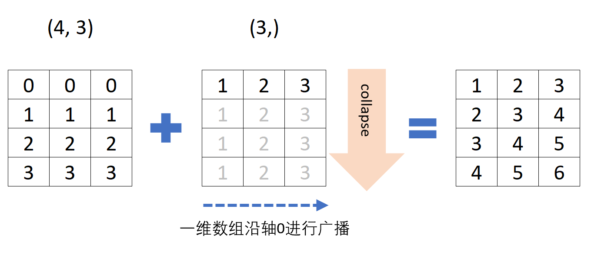
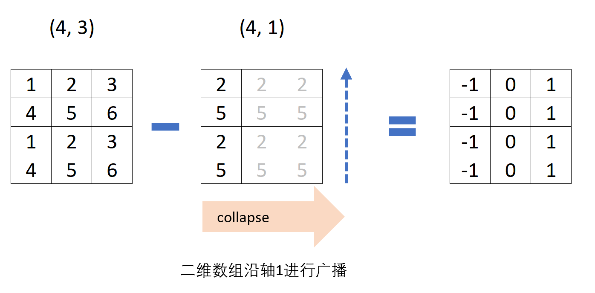
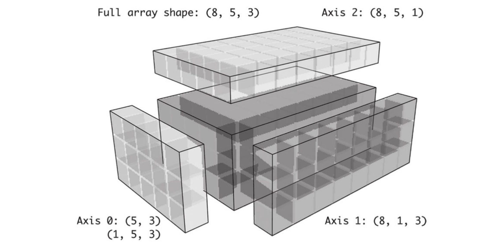

# NumPy进阶

包含以下内容：

* ndarray对象的内部机理
* 高级数组操作
    * 重塑数组
    * C顺序和F顺序
    * 连接和分隔数组
    * 堆叠助手：r 和c
    * 重复元素：tile和repeat
    * 神奇索引的等价方法：take和put
* 广播
* ufunc高级应用
* 结构化和记录式数组


## ndarray对象的内部机理

NumPy的`ndarray`提供了一种将同质数据块（可以是连续或跨越）解释为多维数组对象的方式。
`ndarray`的数据类型`dtype`决定了数据的解释方式，比如浮点数、整数、布尔值等。
`ndarray`的所有数组对象都是数据块的一个跨度视图（strided view）。

数组视图`arr[::2,::-1]`不复制任何数据的原因是什么？
简单地说，`ndarray`不只是一块内存和一个`dtype`，它还有跨度信息，这使得数组能以各种步幅（step size）在内存中移动。

更准确地讲，`ndarray`内部由以下内容组成：

* 一个指向数据（内存或内存映射文件中的一块数据）的指针。
* 数据类型或`dtype`，描述在数组中的固定大小值的格子。
* 一个表示数组形状（shape）的元组。
* 一个跨度元组（stride），其中的整数指的是为了前进到当前维度下一个元素需要“跨过”的字节数。

例如，一个10×5的数组，其shape为(10, 5)：
```
s = np.ones((10, 5)).shape
print(s)
# (10, 5)
```

一个典型的（C阶）3×4×5 float64值（8字节）的数组具有跨度（160,40,8）（通常特定轴上的跨度越大，沿着该轴执行计算的代价越高）：
```
s = np.ones((3, 4, 5), dtype=np.float64).strides
print(s)
# (160, 40, 8)
```

数组跨度（strides）是构建“零复制”数组视图的关键因素。

数组跨度甚至可以是负的，这使得数组能够穿过内存“向后”移动（例如，在诸如obj[::-1]或obj[:, ::-1]的切片中就是这种情况）。


### NumPy dtype层次结构

有时候需要通过一些代码来检查数组是否包含整数、浮点数、字符串或Python对象。
由于浮点数有多种类型（float16到float128），因此检查dtype是否在类型列表中会非常麻烦。
dtype有超类，如np.integer和np.floating，它们可以和np.issubdtype函数一起使用：
```
ints = np.ones(10, dtype=np.uint16)
floats = np.ones(10, dtype=np.float32)
```

可以通过调用类型的mro方法来查看特定dtype的所有父类：
```
print(np.float64.mro())
# [<class 'numpy.float64'>,
#  <class 'numpy.floating'>,
#  <class 'numpy.inexact'>,
#  <class 'numpy.number'>,
#  <class 'numpy.generic'>,
#  <class 'float'>,
#  <class 'object'>]

print(np.issubdtype(ints.dtype, np.integer))
# True
print(np.issubdtype(floats.dtype, np.floating))
# True
print(np.issubdtype(floats.dtype, np.number))
# True
print(np.issubdtype(floats.dtype, np.generic))
# True
```


## 高级数组操作

### 重塑数组

通常，通过`reshape`将数组从一个形状转换为另一个形状，并且不复制任何数据。
`reshape`里面有两种重塑顺序，按C顺序（行方向）的重塑和按Fortran顺序（列方向）的重塑。
首先是取数，然后是放数，取数按什么顺序，放数就按什么顺序。

下面是官网的解释：

    ‘C’ means to read / write the elements using C-like index order, with the last axis index changing fastest, back to the first axis index changing slowest. 

    ‘F’ means to read / write the elements using Fortran-like index order, with the first index changing fastest, and the last index changing slowest. 

    Note that the ‘C’ and ‘F’ options take no account of the memory layout of the underlying array, and only refer to the order of indexing. 

    ‘A’ means to read / write the elements in Fortran-like index order if a is Fortran contiguous in memory, C-like order otherwise.


一维数组重塑：
```
arr = np.arange(8)
print(arr)
# [0 1 2 3 4 5 6 7]

a = arr.reshape((4, 2), order='C')
print(a)
# [[0 1]
#  [2 3]
#  [4 5]
#  [6 7]]

a = arr.reshape((4, 2), order='F')
print(a)
# [[0 4]
#  [1 5]
#  [2 6]
#  [3 7]]
```

多维数组重塑：传递的形状维度可以有一个值是-1，表示维度通过数据进行推断：
```
a = arr.reshape((4, 2)).reshape((2, 4))
print(a)
# [[0 1 2 3]
#  [4 5 6 7]]

arr = np.arange(15)
a = arr.reshape((5, -1))  # 15 / 5 = 3列
print(a)
# [[ 0  1  2]
#  [ 3  4  5]
#  [ 6  7  8]
#  [ 9 10 11]
#  [12 13 14]]
print(a.shape)
# (5, 3)
```

数组的`shape`属性是一个**元组**，它也可以被传递给`reshape`，接上例：
```
other_arr = np.ones((3, 5))
print(other_arr.shape)
# (3, 5)

a = arr.reshape(other_arr.shape)
print(a.shape)
# (3, 5)
```

`reshape`的反操作可以将更高维度的数组转换为一维数组，这种操作通常被成为扁平化（flattening）或分散化（raveling）。

如果结果中的值在原始数组中是连续的，则`ravel`不会生成底层数值的副本。`flatten`方法的行为类似于`ravel`，但它总是生成数据的副本。
```
arr = np.arange(15).reshape((5, 3))
print(arr)
# [[ 0  1  2]
#  [ 3  4  5]
#  [ 6  7  8]
#  [ 9 10 11]
#  [12 13 14]]

a = arr.ravel()
print(a)
# [ 0  1  2  3  4  5  6  7  8  9 10 11 12 13 14]

a = arr.flatten()
print(a)
# [ 0  1  2  3  4  5  6  7  8  9 10 11 12 13 14]
```

### C顺序和F顺序

数据可以按照不同的顺序进行重塑或扁平化。默认情况下，NumPy数组是按行方向顺序创建的。

对于一个二维的数据数组，**C顺序**说明数组每行中的元素存储在相邻的存储单元中。**F顺序**意味着每列数据中的值都存储在相邻的内存位置中。

可以通过设置`reshape`和`ravel`函数的`order`参数来表示数据在数组中使用哪种顺序。
```
arr = np.arange(15).reshape((5, 3))
print(arr)
# [[ 0  1  2]
#  [ 3  4  5]
#  [ 6  7  8]
#  [ 9 10 11]
#  [12 13 14]]

print(arr.ravel())
# [ 0  1  2  3  4  5  6  7  8  9 10 11 12 13 14]

print(arr.ravel('F'))
# [ 0  3  6  9 12  1  4  7 10 13  2  5  8 11 14]
```

C顺序和Fortran顺序的核心区别就是在维度方向上遍历的方式。
C顺序/行方向顺序首先遍历更高的维度（例如，在轴0上行进之前先在轴1上行进）。
Fortran顺序/列方向顺序最后遍历更高的维度（例如，在轴1上行进之前先在轴0上行进）。


### 数组连接和分隔

`numpy.concatenate`可以获取数组的序列（元组、列表等），并沿着输入轴将它们按顺序连接在一起：
```
arr1 = np.array(
    [
        [1, 2, 3],
        [4, 5, 6]
    ]
)

arr2 = np.array(
    [
        [7, 8, 9],
        [10, 11, 12]
    ]
)

a = np.concatenate([arr1, arr2], axis=0)
print(a)
# [[ 1  2  3]
#  [ 4  5  6]
#  [ 7  8  9]
#  [10 11 12]]

a = np.concatenate([arr1, arr2], axis=1)
print(a)
# [[ 1  2  3  7  8  9]
#  [ 4  5  6 10 11 12]]
```

其他类似`concatenate`的函数。`vstack`类似`concatenate`沿`axis=0`操作，`hstack`类似`concatenate`沿`axis=1`操作。
```
a = np.vstack((arr1, arr2))
print(a)
# [[ 1  2  3]
#  [ 4  5  6]
#  [ 7  8  9]
#  [10 11 12]]

a = np.hstack((arr1, arr2))
print(a)
# [[ 1  2  3  7  8  9]
#  [ 4  5  6 10 11 12]]
```

`split`可以将一个数组沿轴向切片成多个数组。先看一维数组。`np.split(arr, 3)`表示将数组拆分时的**索引位置**
```
arr = np.array(['a', 'b', 'c', 'd', 'e', 'f', 'g', 'h', 'i', 'j', 'k'])
print(arr)
# ['a' 'b' 'c' 'd' 'e' 'f' 'g' 'h' 'i' 'j' 'k']

print(np.split(arr, 3))

print(np.split(arr, [3]))  # 从索引位置为3进行拆分
# [array(['a', 'b', 'c'], dtype='<U1'), array(['d', 'e', 'f', 'g', 'h', 'i', 'j', 'k'], dtype='<U1')]

print(np.split(arr, [3, 7]))  # 从索引位置为3和7进行拆分
# [array(['a', 'b', 'c'], dtype='<U1'), array(['d', 'e', 'f', 'g'], dtype='<U1'), array(['h', 'i', 'j', 'k'], dtype='<U1')]

print(np.split(arr, [3, 7, 9]))  # 从索引位置为3、7、9进行拆分
# [array(['a', 'b', 'c'], dtype='<U1'), array(['d', 'e', 'f', 'g'], dtype='<U1'), array(['h', 'i'], dtype='<U1'), array(['j', 'k'], dtype='<U1')]

```

二维数组和一维数组类似。

`np.split(arr, [1, 2])`默认axis=0，沿水平方向进行拆分，拆分行索引分别为行号1和行号2，即[0, 1)，[1, 2)，[2, 4]三个行区间。

`np.split(arr, [1, 2], axis=1)`沿垂直方向进行拆分，拆分列索引分别为列号1和列号2，即[0, 1)，[1, 2)，[2, 3]三个列区间。

如果拆分区间出现倒序，如`np.split(arr, [3, 1])`，沿水平方向拆分，第一个行区间是[0, 3)，第二个行区间是[3, 1)，无结果，当前行索引为0，未达到最大行数，所以输出第三个区间[1, 4]。同理可推`np.split(arr, [3, 1], axis=1)`的三个列区间。
```
arr = np.arange(15).reshape((5, 3))
print(arr)
# [[ 0  1  2]
#  [ 3  4  5]
#  [ 6  7  8]
#  [ 9 10 11]
#  [12 13 14]]

result = np.split(arr, [1, 2])
print(result)
# [array([[0, 1, 2]]), 
#  array([[3, 4, 5]]), 
#  array([[ 6,  7,  8],
#        [ 9, 10, 11],
#        [12, 13, 14]])]

result = np.split(arr, [1, 2], axis=1)
print(result)
# [array([[ 0],
#         [ 3],
#         [ 6],
#         [ 9],
#         [12]]), 
#  array([[ 1],
#         [ 4],
#         [ 7],
#         [10],
#         [13]]), 
#  array([[ 2],
#         [ 5],
#         [ 8],
#         [11],
#         [14]])]

result = np.split(arr, [3, 1])
print(result)
# [array([[0, 1, 2],
#        [3, 4, 5],
#        [6, 7, 8]]),
#  array([], shape=(0, 3), dtype=int64),
#  array([[ 3,  4,  5],
#         [ 6,  7,  8],
#         [ 9, 10, 11],
#         [12, 13, 14]])

result = np.split(arr, [3, 1], axis=1)
print(result)
# [array([[ 0,  1,  2],
#         [ 3,  4,  5],
#         [ 6,  7,  8],
#         [ 9, 10, 11],
#         [12, 13, 14]]), 
#  array([], shape=(5, 0), dtype=int64), 
#  array([[ 1,  2],
#         [ 4,  5],
#         [ 7,  8],
#         [10, 11],
#         [13, 14]])]
```


### 数组堆叠的方法：r_和c_

在NumPy中有两个特殊的对象：r_和c_，它们可以使堆栈数组的操作更为简洁：

* `np.r_`是按列连接两个矩阵，就是把两矩阵上下相加，要求列数相等。
* `np.c_`是按行连接两个矩阵，就是把两矩阵左右相加，要求行数相等。

```
arr = np.arange(6)
arr1 = arr.reshape((3, 2))
arr2 = np.random.randn(3, 2)

print(arr)
# [0 1 2 3 4 5]
print(arr1)
# [[0 1]
#  [2 3]
#  [4 5]]
print(arr2)
# [[ 0.15407269  0.56316672]
#  [-1.2390795  -1.59294986]
#  [ 0.082398    0.75602857]]

a = np.r_[arr1, arr2]
print(a)
# [[ 0.          1.        ]
#  [ 2.          3.        ]
#  [ 4.          5.        ]
#  [ 0.15407269  0.56316672]
#  [-1.2390795  -1.59294986]
#  [ 0.082398    0.75602857]]

a = np.c_[arr1, arr2]
print(a)
# [[ 0.          1.          0.15407269  0.56316672]
#  [ 2.          3.         -1.2390795  -1.59294986]
#  [ 4.          5.          0.082398    0.75602857]]

a = np.c_[np.r_[arr1, arr2], arr]
print(a)
# [[ 0.          1.          0.        ]
#  [ 2.          3.          1.        ]
#  [ 4.          5.          2.        ]
#  [ 0.15407269  0.56316672  3.        ]
#  [-1.2390795  -1.59294986  4.        ]
#  [ 0.082398    0.75602857  5.        ]]
```

还可以将切片转换为数组：
```
a = np.c_[1:6, -10:-5]
print(a)
# [[  1 -10]
#  [  2  -9]
#  [  3  -8]
#  [  4  -7]
#  [  5  -6]]
```


### 重复元素：tile和repeat

`repeat`和`tile`函数是用于重复或复制数组的两个有用的工具。`repeat`函数按照给定次数对数组中的*每个元素*进行复制，生成一个更大的数组。

对于NumPy而言，复制或重复数组的需求可能不如其他数组编程框架（如MATLAB）那样常见。其中一个原因是广播通常会更好地满足这一需求。
```
arr = np.arange(3)
print(arr)
# [0 1 2]

a = arr.repeat(3)
print(a)
# [0 0 0 1 1 1 2 2 2]
```

默认情况下，如果你传递一个整数，每个元素都会复制相应的次数。如果你传递了一个整数数组，每个元素都会重复相应的不同次数：
```
arr = np.arange(3)
print(arr)
# [0 1 2]

a = arr.repeat([2, 3, 4])
print(a)
# [0 0 1 1 1 2 2 2 2]
```

多维数组可以在指定的轴向上对它们的元素进行重复，注意，如果没有传递轴，数组将首先扁平化（沿0轴复制）。
```
arr = np.random.randn(2, 2)
print(arr)
# [[-0.15870621  0.26521446]
#  [-1.35042383 -0.65562376]]

a = arr.repeat(2, axis=0)
print(a)
# [[-0.15870621  0.26521446]
#  [-0.15870621  0.26521446]
#  [-1.35042383 -0.65562376]
#  [-1.35042383 -0.65562376]]

a = arr.repeat(2, axis=1)
print(a)
# [[-0.15870621 -0.15870621  0.26521446  0.26521446]
#  [-1.35042383 -1.35042383 -0.65562376 -0.65562376]]
```

同样，需要按照不同次数重复多维数组的切片时，可以传递一个整数数组：
```
arr = np.random.randn(2, 2)
print(arr)
# [[-0.15870621  0.26521446]
#  [-1.35042383 -0.65562376]]

a = arr.repeat([2, 3], axis=0)
print(a)
# [[-0.15870621  0.26521446]
#  [-0.15870621  0.26521446]
#  [-1.35042383 -0.65562376]
#  [-1.35042383 -0.65562376]
#  [-1.35042383 -0.65562376]]
```

`tile`是一种快捷方法，它可以沿着轴向堆叠副本。在视觉上，你可以把它看作类似于“铺设瓷砖”。
`np.tile(arr, 2)`第二个参数是瓷砖的数量。用标量来说，铺设是逐行进行的，而不是逐列，第二个参数也可以是表示“铺瓷砖”布局的元组。
```
arr = np.random.randn(2, 2)
print(arr)
# [[-0.15870621  0.26521446]
#  [-1.35042383 -0.65562376]]

a = np.tile(arr, 2)
print(a)
# [[-0.15870621  0.26521446 -0.15870621  0.26521446]
#  [-1.35042383 -0.65562376 -1.35042383 -0.65562376]]

a = np.tile(arr, (2, 1))
print(a)
# [[-0.15870621  0.26521446]
#  [-1.35042383 -0.65562376]
#  [-0.15870621  0.26521446]
#  [-1.35042383 -0.65562376]]

a = np.tile(arr, (3, 2))
print(a)
# [[-0.15870621  0.26521446 -0.15870621  0.26521446]
#  [-1.35042383 -0.65562376 -1.35042383 -0.65562376]
#  [-0.15870621  0.26521446 -0.15870621  0.26521446]
#  [-1.35042383 -0.65562376 -1.35042383 -0.65562376]
#  [-0.15870621  0.26521446 -0.15870621  0.26521446]
#  [-1.35042383 -0.65562376 -1.35042383 -0.65562376]]
```


### 神奇索引（Fancy Indexing）的等价方法：take和put

`take`函数可以获取数组子集，`put`函数可以设置数组子集。其他一些ndarray方法可以用于特殊情况下在单个轴上的数据选取.
```
arr = np.arange(10) * 100
inds = [7, 1, 2, 6]

print(arr)
# [  0 100 200 300 400 500 600 700 800 900]
print(inds)
# [7, 1, 2, 6]

# 从arr序列中依次获取索引为7,1,2,6位置上的元素。
a = np.take(arr, inds)
print(a)
# [700 100 200 600]
print(arr)
# [  0 100 200 300 400 500 600 700 800 900]


arr = np.arange(10) * 100
inds = [7, 1, 2, 6]

# 相当于将arr序列中索引为7,1,2,6位置上的元素用42来替换
np.put(arr, inds, 41)
print(arr)
# [  0  41  41 300 400 500  41  41 800 900]

arr = np.arange(10) * 100
inds = [7, 1, 2, 6]

np.put(arr, inds, [40, 41, 42])
print(arr)
# [  0  41  42 300 400 500  40  40 800 900]
```

注意，上例如果改写为`a = np.put(arr, inds, 41)`，则返回`None`。
```
a = np.put(arr, inds, 41)
print(a)
# None
```

如果要在别的轴上使用`take`，可以通过传递`axis`关键字来实现。
```
inds = [2, 0, 2, 1]
arr = np.random.randn(2, 4)
print(arr)
# [[-0.82371274 -0.16911898 -0.01903239 -0.91792531]
#  [-0.55176496 -0.30111564  0.33872999  0.32454671]]

a = arr.take(inds, axis=1)
print(a)
# [[-0.01903239 -0.82371274 -0.01903239 -0.16911898]
#  [ 0.33872999 -0.55176496  0.33872999 -0.30111564]]
```


## 广播

**广播（broadcasting）**指的是不同形状的数组之间的算术运算的执行方式。受某些约束的影响，较小的数组在较大的数组上“广播”，以便它们具有兼容的形状。广播提供了一种矢量化数组操作的方法。

NumPy 操作通常在*逐个元素*的基础上在数组对上完成。在最简单的情况下，两个数组必须具有完全相同的形状，如下例所示：
```
a = np.array([1, 3, 5])
b = np.array([2, 2, 2])

print(a * b)
# [ 2  6 10]

print(a + b)
# [3 5 7]
```

当一个数组和一个标量值在一个操作中组合时，会发生最简单的广播示例，NumPy的广播规则放宽了这种约束。
```
a = np.array([1, 3, 5])
b = 2

print(a * b)
# [ 2  6 10]

print(a + b)
# [3 5 7]
```

结果等同于前面的示例，其中`b`是数组。可以假象将在算术运算期间标量`b`被*拉伸*成与数组`a`具有相同形状的数组。拉伸类比只是概念性的。NumPy在实际运算中直接使用原始标量值而不会去制作拉伸副本，因此广播操作效率更高效，在上例的乘法期间，通过广播操作，移动的内存较少（b是标量而不是数组）。

### 广播的规则

**广播的规则**：

如果两个数组的后缘维度（trailing dimension，即从末尾开始算起的维度）的轴长度相符，或其中的一方的长度为1，则认为它们是广播兼容的。广播会在缺失和（或）长度为1的维度上进行。

这句话是理解广播的核心。广播主要发生在两种情况，一种是两个数组的维数不相等，但是它们的后缘维度的轴长相符，另外一种是有一方的长度为1。

如果不满足这些条件，则抛出 ValueError: operands could not be broadcast together 异常，指示数组具有不兼容的形状。结果数组的大小是沿输入的每个轴不是1的大小。

将标量值跟数组合并时就会发生最简单的广播，标量值4已经被广播给乘法运算中的所有其他元素。
```
arr = np.arange(5)
print(arr * 4)
# [ 0  4  8 12 16]
```

### 一维广播

下面是一个一维数组沿0轴广播的例子：
```
arr1 = np.array([[0, 0, 0], [1, 1, 1], [2, 2, 2], [3, 3, 3]])
print(arr1.shape)
# (4, 3)

arr2 = np.array([1, 2, 3])
print(arr2.shape)
# (3,)

arr_sum = arr1 + arr2
print(arr_sum)
# [[1 2 3]
#  [2 3 4]
#  [3 4 5]
#  [4 5 6]]
```


上例中`arr1`的`shape`为`(4,3)`，`arr2`的`shape`为`(3,)`。即，`arr1`是二维数组，`arr2`是一维数组。虽然它们的维度`shape`不同，但后缘维度都是`3`，符合广播规则，所以它们之间是可以执行相加操作。

在这个例子当中是将arr2沿着0轴进行扩展。直观的描述是，`arr2`在参与运算时是以下面这样的形式进行0轴扩展的（沿0轴水平方向移动，在列方向进行“拉伸”）：
```
[[1 2 3]
 [1 2 3]
 [1 2 3]
 [1 2 3]]
```


### 二维广播

在下面行减均值的例子中，根据规则，为了从轴1减均值（即从每行减去行平均值），对较小的数组`row_means`的塑形必须是（4, 1），即，重新塑造行意味着形状是（4,1）而不是（4, ）。
```
arr = np.array([[1, 2, 3], [4, 5, 6], [1, 2, 3], [4, 5, 6]])
print(arr)
# [[1 2 3]
#  [4 5 6]
#  [1 2 3]
#  [4 5 6]]

row_means = arr.mean(1)

print(row_means)
# [2. 5. 2. 5.]

print(row_means.reshape(4, 1))
# [[2.]
#  [5.]
#  [2.]
#  [5.]]
 
demeaned = arr - row_means.reshape((4, 1))

print(demeaned)
# [[-1.  0.  1.]
#  [-1.  0.  1.]
#  [-1.  0.  1.]
#  [-1.  0.  1.]]

print(demeaned.mean(1))
# [0. 0. 0. 0.]
```



### 三维广播

在轴0以外的轴上使用较低维数组进行算术运算也是相当普遍的。根据广播规则，“广播维度”在较小的数组中必须为1。

在三维情况下，在三个维度中的任何一个维度上进行广播只是将数据重塑为形状兼容。

因此，需要添加一个长度为1的新轴，专门用于广播目的。使用`reshape`是一种选择，但插入一个轴需要构造一个新形状的元组。NumPy数组提供了`np.newaxis`属性和“完整”切片来插入新轴。

看下面的例子了解一些`np.newaxis`的用法。

`x1[:, np.newaxis]`对原`x1`添加了1轴，即，行方向有5个元素（5行），列方向只有1个元素（1列）。

`x1[np.newaxis, :]`对原`x1`添加了0轴，即，行方向有1个元素（1行），列方向只有5个元素（5列）。
```
x1 = np.array([1, 2, 3, 4, 5])
print(x1.shape)
# (5,)

x1_new = x1[:, np.newaxis]
print(x1_new.shape)
# (5, 1)
print(x1_new)
# [[1]
#  [2]
#  [3]
#  [4]
#  [5]]

x2_new = x1[np.newaxis, :]
print(x1_new.shape)
# (1, 5)
print(x1_new)
# [[1 2 3 4 5]]

```

下例一个通过`np.newaxis`对二维数组到三维的扩展。

`arr[np.newaxis, :, :, np.newaxis]`表示对`arr`添加0，3轴，原数组`arr`做为1，2轴。其等价写法是`arr[np.newaxis, ..., np.newaxis]`

`arr[:, np.newaxis, np.newaxis]`表示对`arr`添加1，2轴，原数组`arr`做为0，3轴。其等价写法是`arr[np.newaxis, :, np.newaxis, :]`，理解上需要注意的是`:`只代表一个轴。
```
arr = np.arange(3 * 4).reshape(3, 4)
print(arr.shape)
# (3, 4)
print(arr)
# [[ 0  1  2  3]
#  [ 4  5  6  7]
#  [ 8  9 10 11]]

arr_3D = arr[np.newaxis, :, :, np.newaxis]
print(arr_3D.shape)
# (1, 3, 1, 4)
arr_3D = arr[np.newaxis, ..., np.newaxis]
print(arr_3D.shape)
# (1, 3, 4, 1)
print(arr_3D)
# [[[[ 0]
#    [ 1]
#    [ 2]
#    [ 3]]
#
#   [[ 4]
#    [ 5]
#    [ 6]
#    [ 7]]
#
#   [[ 8]
#    [ 9]
#    [10]
#    [11]]]]

arr_3D = arr[np.newaxis, :, np.newaxis]
print(arr_3D.shape)
# (1, 3, 1, 4)
arr_3D = arr[np.newaxis, :, np.newaxis, :]
print(arr_3D.shape)
# (1, 3, 1, 4)
print(arr_3D)
# [[[[ 0  1  2  3]]
#
#   [[ 4  5  6  7]]
#
#   [[ 8  9 10 11]]]]

arr_3D = arr[:, np.newaxis, np.newaxis]
print(arr_3D.shape)
# (3, 1, 1, 4)
arr_3D = arr[:, np.newaxis, np.newaxis, :]
print(arr_3D.shape)
# (3, 1, 1, 4)
print(arr_3D)
# [[[[0 1 2]]]
#
#  [[[3 4 5]]]
#
#  [[[6 7 8]]]]

```

下图显示了在三维数组的每个轴上广播所需的形状。



下面的例子演示了基于一个三维数组进行的广播操作。

```
arr = np.zeros((3, 2, 4))
print(arr.shape)
# (3, 2, 4)
print(arr)
# [[[0. 0. 0. 0.]
#   [0. 0. 0. 0.]]
#
#  [[0. 0. 0. 0.]
#   [0. 0. 0. 0.]]
#
#  [[0. 0. 0. 0.]
#   [0. 0. 0. 0.]]]

# 生成0轴切片
arr_0 = np.arange(2)
print(arr_0.shape)
# (2,)
print(arr_0)
# [0 1]
arr_new = arr_0[np.newaxis, :, np.newaxis]
print(arr_new.shape)
# (1, 2, 1)
print(arr_new)
# [[[0]
#   [1]]]

arr = arr + arr_new
print(arr.shape)
# (3, 2, 4)
print(arr)
# [[[0. 0. 0. 0.]
#   [1. 1. 1. 1.]]
#
#  [[0. 0. 0. 0.]
#   [1. 1. 1. 1.]]
#
#  [[0. 0. 0. 0.]
#   [1. 1. 1. 1.]]]

# 生成1轴切片
arr = np.zeros((3, 2, 4))
arr_1 = np.arange(12).reshape(3, 4)
print(arr_1.shape)
# (3, 4)
arr_new = arr_1[:, np.newaxis, :]
print(arr_new.shape)
# (3, 1, 4)
print(arr_new)
# [[[ 0  1  2  3]]
# 
#  [[ 4  5  6  7]]
# 
#  [[ 8  9 10 11]]]
arr = arr + arr_new
print(arr)
# [[[ 0.  1.  2.  3.]
#   [ 0.  1.  2.  3.]]

#  [[ 4.  5.  6.  7.]
#   [ 4.  5.  6.  7.]]

#  [[ 8.  9. 10. 11.]
#   [ 8.  9. 10. 11.]]]

# 生成2轴切片
arr = np.zeros((3, 2, 4))
arr_2 = np.arange(6).reshape(3, 2)
arr_new = arr_2[:, :, np.newaxis]
print(arr_new.shape)
# (3, 2, 1)
print(arr_new)
# [[[0]
#   [1]]

#  [[2]
#   [3]]

#  [[4]
#   [5]]]
arr = arr + arr_new
print(arr)
# [[[0. 1. 2. 3.]
#   [1. 2. 3. 4.]]
#
#  [[1. 2. 3. 4.]
#   [2. 3. 4. 5.]]
#
#  [[2. 3. 4. 5.]
#   [3. 4. 5. 6.]]]


# 在轴2上减去均值
depth_means = arr.mean(2)
print(depth_means)
# [[0. 1.]
#  [2. 3.]
#  [4. 5.]]

arr_new = depth_means[:, :, np.newaxis]
print(arr_new.shape)
# (3, 2, 1)
demeaned = arr - arr_new
print(demeaned)
# [[[0. 0. 0. 0.]
#   [0. 0. 0. 0.]]

#  [[0. 0. 0. 0.]
#   [0. 0. 0. 0.]]

#  [[0. 0. 0. 0.]
#   [0. 0. 0. 0.]]]
```


### N维广播

和上例最后场景的计算结果相同。

```
arr = np.zeros((3, 2, 4))

def demean_axis(arr, axis=0):
    means = arr.mean(axis)
    indexer = [slice(None)] * arr.ndim
    indexer[axis] = np.newaxis
    return arr - means[indexer]

print(demean_axis(arr, axis=2))
# [[[0. 0. 0. 0.]
#   [0. 0. 0. 0.]]

#  [[0. 0. 0. 0.]
#   [0. 0. 0. 0.]]

#  [[0. 0. 0. 0.]
#   [0. 0. 0. 0.]]]
```


### 通过广播设定数组的值

进行数组算术运算的广播规则同样也适用于通过数组索引设置值。

```
arr = np.zeros((4, 3))
arr[:] = 5
print(arr)
# [[5. 5. 5.]
#  [5. 5. 5.]
#  [5. 5. 5.]
#  [5. 5. 5.]]

col = np.arange(4)
arr[:] = col[:, np.newaxis]
print(arr)
# [[0. 0. 0.]
#  [1. 1. 1.]
#  [2. 2. 2.]
#  [3. 3. 3.]]
```


## ufunc高级应用

### ufunc实例方法

**通用函数（或简称为ufunc ）**是一种`ndarrays`以逐元素方式操作的函数，支持数组广播，类型转换和其他一些标准功能。
也就是说，ufunc是一个函数的**矢量化包装器**，它接受固定数量的特定输入并产生固定数量的特定输出。

在NumPy中，通用函数是numpy.ufunc类的实例。 NumPy的每个二元ufunc（通用函数）都有特殊的方法来执行某些特殊的向量化操作。

`reduce`方法接收单个数组并通过执行一系列二元操作在指定的轴向上对数组的值进行聚合。

例如，使用np.add.reduce是对数组中元素进行加和的另一种方法：起始值（对于add方法是0）取决于ufunc。如果传递了一个轴，则沿该轴执行缩聚（collapse）。
```
arr = np.arange(10)

a = np.add.reduce(arr)
print(a)
# 45

a = arr.sum()
print(a)
# 45
```

例如：使用np.logical_and来检查数组的每一行中的值是否被排序(logical_and.reduce等价于all方法)：
```
arr = np.random.randn(5, 5)
print(arr)
# [[ 0.75217836  1.26134639 -0.39387918  0.46348823 -1.0026674 ]
#  [ 0.72085602 -0.50487667  3.21023694 -0.2752039  -1.41158734]
#  [ 1.69031532  0.61134097  0.58282835  1.03043232 -0.1609196 ]
#  [-3.05141239  0.47221317  1.36464297  0.17500156  1.26158638]
#  [-0.21578318  0.37700321  1.05427816  1.56526207 -0.08290142]]

# 对数组arr行进行排序
a = arr[::2].sort(1)
print(a)
# None

a = arr[:, :-1] < arr[:, 1:]
print(a)
# [[ True  True  True  True]
#  [False  True False False]
#  [ True  True  True  True]
#  [ True  True False  True]
#  [ True  True  True  True]]

a = np.logical_and.reduce(arr[:, :-1] < arr[:, 1:], axis=1)
print(a)
# [ True False  True False  True]
```


`accumulate`与`reduce`是相关的，就像`cumsum`与`sum`相关一样。`accumulate`生成一个数组，其尺寸与中间“累计”值相同：
```
arr = np.arange(15).reshape((3, 5))
print(arr)
# [[ 0  1  2  3  4]
#  [ 5  6  7  8  9]
#  [10 11 12 13 14]]

a = np.add.accumulate(arr, axis=1)
print(a)
# [[ 0  1  3  6 10]
#  [ 5 11 18 26 35]
#  [10 21 33 46 60]]
```


`outer`在两个数组之间执行成对的交叉乘积：
```
arr = np.arange(3).repeat([1, 2, 2])
print(arr)
# [0 1 1 2 2]

a = np.multiply.outer(arr, np.arange(5))
print(a)
# [[0 0 0 0 0]
#  [0 1 2 3 4]
#  [0 1 2 3 4]
#  [0 2 4 6 8]
#  [0 2 4 6 8]]
```

`outer`输出的维度等于输入的维度总和：
```
x, y = np.random.randn(3, 4), np.random.randn(5)
result = np.subtract.outer(x, y)
print(result.shape)
# (3, 4, 5)
```


`reduceat`方法执行“本地缩聚”，本质上是一个数组groupby操作，在操作中数组的切片聚合在了一起。`reduceat`方法接受一系列的“箱体边缘”，这些箱体边缘表示如何分隔以及聚合数据值。

下例是在arr的`[0:5)`、`[5:8)`和`[8:]`三个区间上执行了缩聚（此处是计算累加和）。
```
arr = np.arange(10)
a = np.add.reduceat(arr, [0, 5, 8])
print(a)
# [10 18 17]
```

可以传递一个axis参数：
```
arr = np.multiply.outer(np.arange(4), np.arange(5))
print(arr)
# [[ 0  0  0  0  0]
#  [ 0  1  2  3  4]
#  [ 0  2  4  6  8]
#  [ 0  3  6  9 12]]

a = np.add.reduceat(arr, [0, 2, 4], axis=1)
print(a)
# [[ 0  0  0]
#  [ 1  5  4]
#  [ 2 10  8]
#  [ 3 15 12]]
```


### 使用Python编写新的ufunc方法
有很多工具可以用于创建你自己的NumPy ufunc，最常用的是NumPy的C语言API，但不在这里讨论。这里主要关注纯Python的ufunc方法。

`numpy.frompyfunc`函数接收一个具有特定数字输入和输出的函数。使用`frompyfunc`创建的函数通常返回的是Python对象的数组，这并不方便。还有另一个函数`numpy.vectorize`允许指定输出的类型（但功能稍差）。

例如，一个简单的按元素相加的函数可以如下：
```
def add_elements(x, y):
    return x + y

add_them = np.frompyfunc(add_elements, 2, 1)
result = add_them(np.arange(8), np.arange(8))
print(result)
# [0 2 4 6 8 10 12 14]

add_them = np.vectorize(add_elements, otypes=[np.float64])
result = add_them(np.arange(8), np.arange(8))
print(result)
# [ 0.  2.  4.  6.  8. 10. 12. 14.]
```


## 结构化和记录式数组

`ndarray`是一个同构数据的容器。也就是说，它表示一个内存块，其中每个元素占用相同数量的字节，由dtype确定。`ndarray`的这种特性不能用来表示异构的数据或表格型数据。

**结构化数组**是一个`ndarray`，其中每个元素可以被认为代表C中的struct（因此是“结构化”的名称），或者是SQL表中具有多个命名字段的行：
```
dtype = [('x', np.float64), ('y', np.int32)]

sarr = np.array(
    [
        (1.5, 6),
        (np.pi, -2)
    ],
    dtype=dtype
)

print(sarr)
# [(1.5       ,  6) (3.14159265, -2)]
```

有几种方法可以指定结构化的dtype（请参阅NumPy官方在线文档）。一种典型的方式是使用(field_name, field_data_type)作为元组的列表。

数组的元素是元组对象，其元素可以像字典一样访问，字段名称存储在dtype.names属性中。
```
print(sarr[0])
# (1.5, 6)

print(sarr['x'])
# [1.5        3.14159265]

print(sarr[0]['y'])
# 6
```

### 嵌套dtype和多维字段

当指定结构化的dtype时，可以另外传递一个形状（以int或元组的形式）：
```
dtype = [('x', np.int64, 3), ('y', np.int32)]
arr = np.zeros(4, dtype=dtype)
print(arr)
# [([0, 0, 0], 0) ([0, 0, 0], 0) ([0, 0, 0], 0) ([0, 0, 0], 0)]
```

`x`字段引用的是每条记录中长度为3的数组：
```
print(arr[0]['x'])
# [0 0 0]
```

访问`arr['x']`然后返回一个二维数组，而不是返回一个一维数组：
```
print(arr['x'])
# [[0 0 0]
#  [0 0 0]
#  [0 0 0]
#  [0 0 0]]
```


### 为什么要使用结构化数组

与pandas的DataFrame相比，NumPy结构化数组是一个相对底层的工具。

结构化数组提供了一种将内存块解释为具有任意复杂嵌套列的表格结构的方法。

由于数组中的每个元素都在内存中表示为固定数量的字节，因此结构化数组提供了读/写磁盘（包括内存映射）数据，以及在网络上传输数据和其他此类用途的非常快速有效的方法。

作为结构化数组的另一种常见用途，将数据文件编写为固定长度的记录字节流是将C和C ++代码中的数据序列化的常用方法，这在业界传统系统中很常见。

只要知道文件的格式（每个记录的大小以及每个元素的顺序、字节大小和数据类型），就可以用np.fromfile将数据读入内存。

