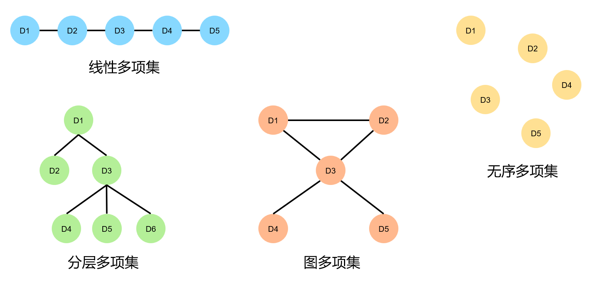

# 多项集的概述

多项集（collection）是指由 0 个或者多个元素组成的概念单元。

从两个角度看待多项集：

- 多项集的用户或者客户会关心它们在不同的应用程序里能做些什么。
- 多项集的开发者或者实现者则会关心如何才能让它们成为最好的通用资源以被使用。

目标：

- 定义多项集的4个通用类型：

    1. 线性多项集
    2. 分层多项集
    3. 图多项集
    4. 无序多项集

- 了解4个多项集类型中的特定类型；
- 了解这些多项集适合用在什么类型的应用程序里；
- 描述每种多项集类型的常用操作；
- 描述多项集的抽象类型和实现之间的区别；

## 2.1.多项集类型

内置多项集类型：

- 字符串`str`
- 列表`list`
- 元组`tuple`
- 集合`set`
- 字典`dict`

其他多项集类型：

- 栈
- 队列
- 优先队列
- 二叉查找树
- 堆
- 图
- 包
- 有序多项集

多项集通常不是静态（static）的，而是动态（dynamic）的，可以根据需要来扩大或者缩小多项集。

不可变多项集（immutable collection）的内容在程序运行过程中是不可改变的（元素不可以添加、删除或者替换），比如元组tuple。

可变多项集（mutable collection）里的内容可以在程序的整个运行过程中被改变，比如字符串、列表list。

多项集按构成方式划分的类型：

- 线性多项集
- 分层多项集
- 图多项集
- 无序多项集
- 有序多项集



### 2.1.1.线性多项集

线性多项集（linear collection）里的元素按照位置进行排列。

- 除了第一个元素，其他每个元素都有且只有一个前序；
- 除了最后一个元素，其他每个元素都有且只有一个后序；

实例：排队的人，购物清单，堆叠在一起的餐盘等。

### 2.1.2.分层多项集

分层多项集（hierarchical collection）里的数据元素会以类似于倒置的树结构进行排列。除了顶部的数据元素，其他每个数据元素都有且只有一个前序，被称为父元素（parent），但它们可以有许多的后序，被称为子元素（children）。

图例中，`D3`的前序父元素是`D1`，`D3`的后续子元素是`D4`、`D5`、`D6`。

实例：文件目录系统、公司的组织架构、书的目录等。

### 2.1.3.图多项集

图多项集（graph collection）也被称为图（graph），它是这样一个多项集：它的每一个数据元素都可以有多个前序和多个后序。

图例中，连接到`D3`的所有元素会被当作它的前序和后序，它们也因此被称为`D3`的邻居。

实例：城市之间的航线图、万维网等。

### 2.1.4.无序多项集

无序多项集（unordered collection）里的元素没有特定的顺序，并且不会用任何明确的方式来指出元素的前序或者后序。

实例：一袋弹珠等。

### 2.1.5.有序多项集

有序多项集（sorted collection）会对它里面的元素进行自然排序（natural ordering）。

要进行自然排序，就必须要有规则来对有序多项集里的元素加以比较，例如`item(i) <= item(i+1)`这样的——规则。

有序列表是最常见的有序多项集。有序多项集不一定是线性的或者按照位置进行排序的。

- 对于集合、包、字典，虽然不能按照位置来访问它们的元素，但它们都可以是有序的。
- 特殊的分层多项集类型（如二叉查找树）也会对其中的元素进行自然排序。

### 2.1.6.多项集类型的分类

下面分类里的类型名称指的并不是多项集的特定实现。一种特定类型的多项集可以有多个实现。

```shell
多项集
|---图多项集
|---分层多项集
|    |---二叉查找树
|    |---堆
|---线性多项集
|    |---列表
|    |   |---有序列表
|    |---队列
|    |   |---优先对列
|    |---栈
|    |---字符串
|---无序多项集
     |---包
     |   |---有序包
     |---字典
     |   |---有序包
     |---集合
         |---有序集合
```

## 2.2.多项集操作

多项集操作类别：

- 确定大小：使用`len`函数获取当前多项集里的元素数量。
- 检测元素成员：使用`in`运算符在多项集里搜索指定的目标元素。如果找到了这个元素，则返回True，否则返回False。
- 遍历多项集：使用`for`循环访问多项集里的欸一个元素。元素的访问顺序取决于多项集的类型。
- 获取多项集的字符串表示：使用`str`函数获取多项集的字符串表示。
- 相等检测：使用`==`运算符来确定两个多项集是否相等。如果两个多项集育有相同的类型，并且包含相同的元素，那么它们就是相等的。比较这些元素对的顺序取决于多项集的类型。
- 连接两个多项集：使用`+`运算符来得到一个和操作数相同类型的新多项集，并且包含两个操作数里的所有元素。
- 转换为其他类型的多项集：创建一个与源多项集具有相同元素的新多项集。克隆操作时类型转换的一种特殊情况，因为输入输出的两个多项集具有相同类型。
- 插入一个元素：如果可以，则在给定的位置将对应的元素添加到多项集里。
- 删除一个元素：如果可以，则在给定的位置将对应的元素从多项集中删除。
- 替换一个元素：将删除和插入合并为一项操作。
- 访问或者获取元素：如果而已，则在给定的位置获取元素。

### 2.2.1.所有多项集类型中的基本操作

在Python里，不同多项集类型的插入、删除、替换或者访问操作并没有统一的名称，但是会有一些标准变体。比如，

- 方法pop会被用来从列表里移除指定位置的元素；
- 方法pop会被用来从字典里移除给定键所对应的值；
- 方法remove会被用来从列表或者某些多项集里删除指定的元素；

对于新开发出的、Python尚不支持的多项集类型，尽可能地使用标准的运算符、函数以及方法名称对它们进行操作。

### 2.2.2.类型转换

类型转换，将一种类型的多项集转换为另一种类型的多项集。例如，通过`list`或`tuple`函数将字符串转换为列表或者元组。`list`或`tuple`函数的参数不一定是另一个多项集，也可以是任何的可迭代对象（iterable object）。

可迭代对象是指，能够使用for循环来访问的一系列元素。（多项集本身也是可迭代对象）

### 2.2.3.克隆和相等性

类型转换的一种特殊情况是克隆，它的功能是返回转换函数中参数的完整副本。

例如：

```python
myList1 = [2, 4, 8]
myList2 = list(myList1)
myList1 is myList2  # False
myList1 == myList2  # True
```

注意：

- 上面两个列表不仅有相同的结构，它们还有相同的元素，每对元素在两个列表里的位置都相同。但是，他们是两个不同的对象。
- 上例中`list`函数对它的参数列表进行浅拷贝（shallow copy）。这些元素的本身在添加到新列表之前是不会被克隆的，在这个过程中只会复制对这些对象的引用。当元素（数字、字符串或者Python的元组）不可变时，这个策略不会引起问题。但是，如果多项集包含的是可变元素，就可能会产生副作用。为了避免这种情况的发生，我们可以通过对源多项集编写`for`循环来创建深拷贝（deep copy），这会把元素显式地克隆之后再添加到新的多项集里。

## 2.3.迭代器和高阶函数

每种类型的多项集都支持一个迭代器或`for`循环，这个操作能够迭代这个多项集的所有元素。迭代器是多项集提供的最关键的操作。

`for`循环服务的多项集中元素的顺序取决于多项集的组织方式。例如：

- 列表里的元素会从头到尾按照位置进行访问；
- 有序多项集里的元素会按从小到大的升序进行访问；
- 对于集合或者字典里的元素来说，不会按照特定的顺序进行访问。

迭代器（例如`for`循环）还支持使用高阶函数`map`、`filter`和`reduce`。

- 这些高阶函数都使用另一个函数和一个多项集作为参数。
- 多项集都支持`for`循环，所以`map`、`filter`和`reduce`函数可以与任何类型的多项集一起使用。

## 2.4.多项集的实现

从用户（比如，程序员）的角度来看，多项集是一种抽象，是一种以某种预定行为来存储和访问数据元素的方式，并不需要关心多项集实现的细节。

多项集也被称为抽象数据类型（Abstract Data Type，ADT）。抽象数据类型的用户只关注它的接口以及这个类型对象所提供的一组操作。

在Python里，函数和方法是最小的抽象单元，类的大小次之，模块是最大的抽象单元。

这里会把抽象多项集类型的实现当作模块里的类或者一组相关的类加以描述。构建这些类就是面向对象编程。

## 2.5.小结

- 多项集是包含0个或多个其他对象的对象。多项集可以进行的操作有访问对象、插入对象、删除对象、确定多项集的大小，以及遍历或访问这个多项集的对象。
- 多项集的5个主要类型是：线性多项集、分层多项集、图多项集、无序多项集和有序多项集。
- 线性多项集会按照位置对元素进行排序，其中除了第一个元素，每个都有且只有一个前序；除了最后一个元素，每个都有且只有一个后序。
- 在分层多项集里，除了一个元素，其他所有元素都有且只有一个前序以及0个或多个后序。被称为根的那个额外元素没有前序。
- 图多项集里的元素可以有0个或多个前序以及0个或多个后序。
- 无序多项集里的元素没有特定的顺序。
- 多项集是可迭代的，也就是说，可以使用for循环访问多项集里的所有元素。程序员也可以使用高阶函数map、filter和reduce简化多项集的数据处理。
- 抽象数据类型是一组对象和对这些对象的操作。因此，多项集是抽象数据类型。
- 数据结构是一个表示多项集里包含的数据的对象。

## 2.6.复习题

- 线性多项集的一个例子是：

    1. 集合和树
    2. 列表和栈

- 无序多项集的一个例子是：

    1. 队列和列表
    2. 集合和字典

- 分层多项集可以用来表示：

    1. 银行排队的客户
    2. 文件目录系统

- 图多项集最能代表：

    1. 一组数字
    2. 城市之间的航线图

- 在Python里，两个多项集间的类型转换操作：

    1. 在源多项集里创建对象的副本，并且把这些新对象添加到目标多项集的新实例里
    2. 把对源多项集对象的引用添加到目标多项集的新实例里

- 两个列表的`==`操作必须：

    1. 比较每个位置的元素对是否相等
    2. 只会验证一个列表里的每一个元素是否也在另一个列表里

- 两个集合的`==`操作必须：

    1. 比较每个位置的元素对是否相等
    2. 验证集合的大小是否相等，并且一个集合里的每一个元素是否也在另一个集合里

- 对列表进行`for`循环时，访问元素的顺序：

    1. 从头到尾的所有位置
    2. 不会按照特定的顺序

- `map`函数会创建一个什么样的序列：

    1. 在给定的多项集里，通过布尔测试的元素
    2. 在给定的多项集里，对元素执行函数的结果

- `filter`函数会创建一个什么样的序列：

    1. 在给定的多项集里，通过布尔测试的元素
    2. 在给定的多项集里，对元素执行函数的结果

## 2.7.练习题

- 在Shell窗口的提示符下使用`dir`和`help`函数来探索Python的内置多项集类型`str`、`list`、`tuple`、`set`以及`dict`的接口。它们的语法是`dir(<type name>)`和`help(<type name>)`。

可以通过以下方式来了解它们的接口：

字符串 (`str`) 类型：

```python
# 使用 dir() 函数列出字符串类型的所有方法和属性
dir(str)

# 使用 help() 函数获取关于字符串类型的详细信息
help(str)
```

列表 (`list`) 类型：

```python
# 使用 dir() 函数列出列表类型的所有方法和属性
dir(list)

# 使用 help() 函数获取关于列表类型的详细信息
help(list)
```

元组 (`tuple`) 类型：

```python
# 使用 dir() 函数列出元组类型的所有方法和属性
dir(tuple)

# 使用 help() 函数获取关于元组类型的详细信息
help(tuple)
```

集合 (`set`) 类型：

```python
# 使用 dir() 函数列出集合类型的所有方法和属性
dir(set)

# 使用 help() 函数获取关于集合类型的详细信息
help(set)
```

字典 (`dict`) 类型：

```python
# 使用 dir() 函数列出字典类型的所有方法和属性
dir(dict)

# 使用 help() 函数获取关于字典类型的详细信息
help(dict)
```

`dir()` 函数将返回一个包含所有方法和属性名称的列表，而 `help()` 函数将显示关于该类型的详细帮助信息，包括每个方法的说明和用法示例。

- 查看`java.util`包里所提供的Java多项集类型，并和Python的多项集类型加以比较。

`java.util` 包中提供了许多Java的集合类型，包括列表、集合、映射等。下面将列出其中一些常用的多项集类型，并将它们与Python中的多项集类型进行比较。

Java ArrayList vs Python List:

- Java ArrayList 是一个可变大小的动态数组。
- Python List 也是可变大小的动态数组，可以容纳任意类型的数据。

Java HashSet vs Python Set:

- Java HashSet 是一个不允许重复元素的集合。
- Python Set 也不允许重复元素，同时还有一个特殊类型的集合叫做 `frozenset`，它是不可变的。

Java LinkedHashSet vs Python OrderedDict:

- Java LinkedHashSet 是一个保持元素插入顺序的集合，不允许重复元素。
- Python OrderedDict 是一个有序字典，保持元素插入顺序，可以用于创建有序的键-值对集合。

Java TreeSet vs Python SortedSet:

- Java TreeSet 是一个自然排序或者通过提供的比较器进行排序的集合，不允许重复元素。
- Python 没有专门的 `SortedSet` 类，但你可以使用 `sorted()` 函数对集合进行排序。

Java HashMap vs Python Dictionary:

- Java HashMap 是一个无序的键-值对映射，不允许重复键。
- Python Dictionary 是一个无序的键-值对映射，键是唯一的。

Java TreeMap vs Python OrderedDict:

- Java TreeMap 是一个基于红黑树的有序映射。
- Python OrderedDict 在键的插入顺序上保持有序。

Java 的多项集类型和 Python 的多项集类型在功能上非常类似，都提供了各种不同的集合类型来适应不同的需求。需要根据具体的使用情况来选择哪种集合类型更适合。同时，Python 还提供了方便的列表推导、集合推导和字典推导等特性，可以更加便捷地创建和处理多项集。
