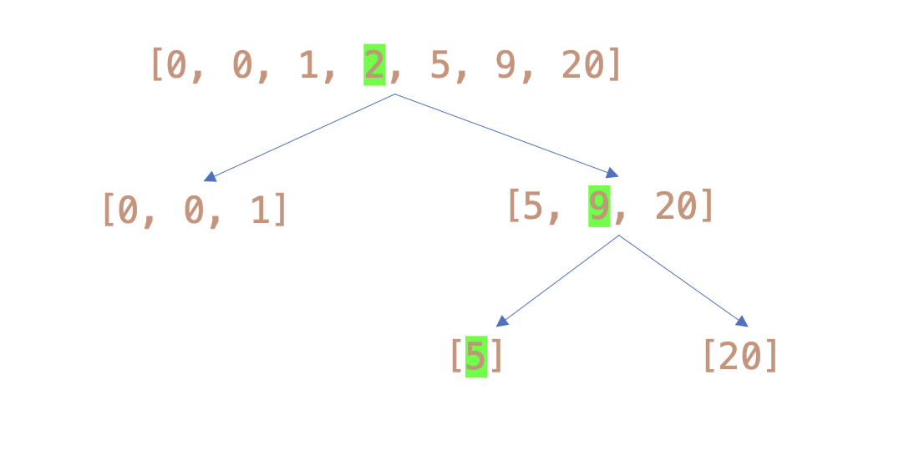
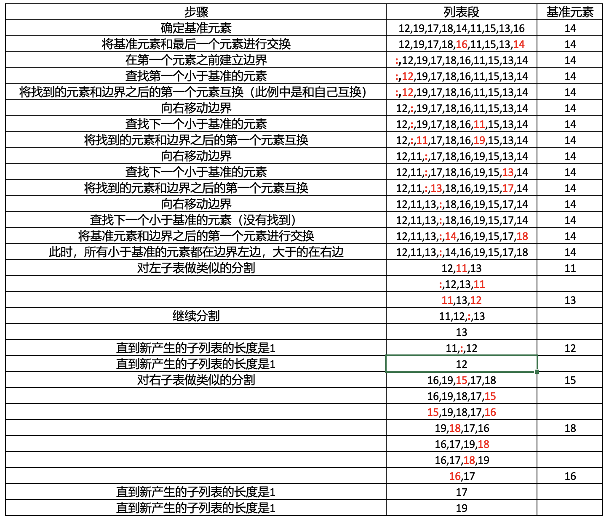
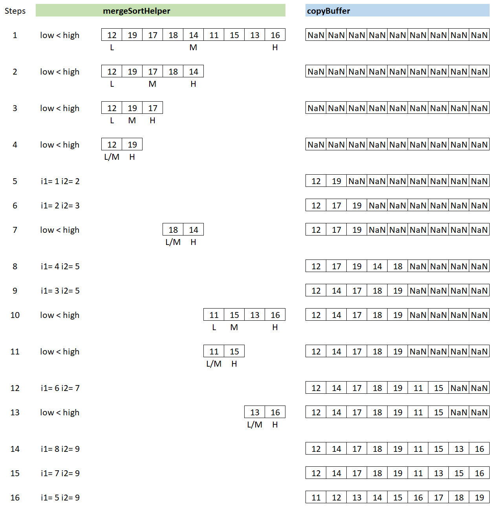
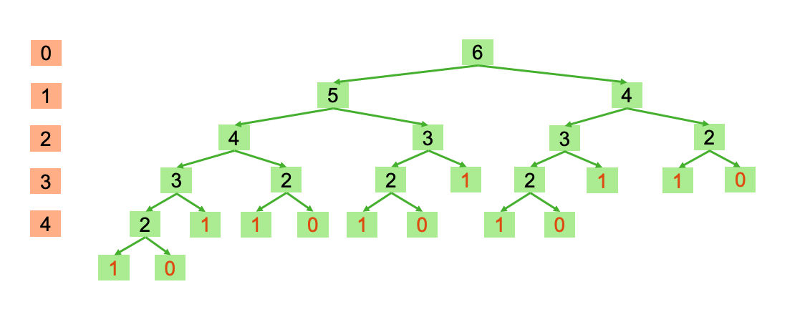
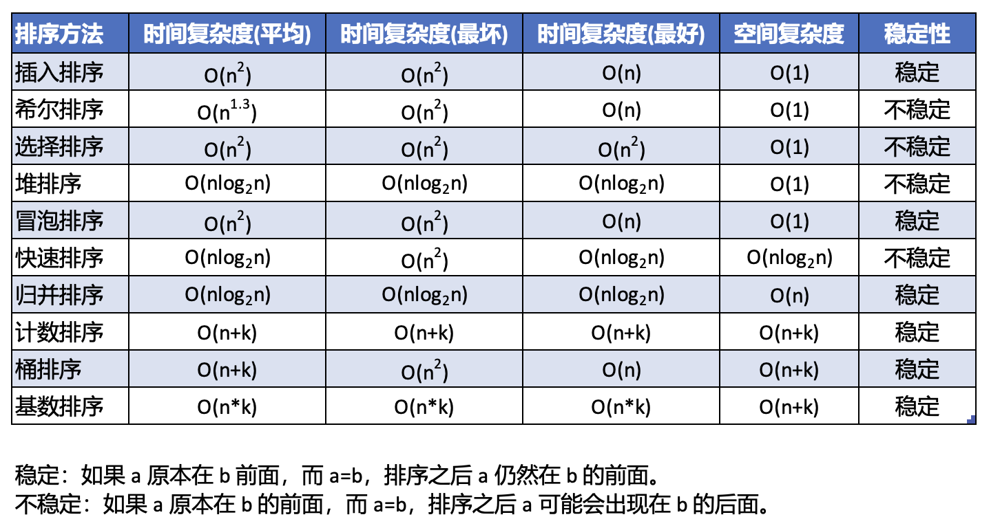

# 搜索、排序以及复杂度分析

算法描述了一个随着问题被解决而停止的计算过程。

算法是计算机程序的基本组成部分之一，另一个基本组成部分是数据结构。

在算法执行过程中会消耗两个资源：处理对象所需的时间和空间（也就是内存）。对于算法来说，总会追求消耗更短的时间和占用更少的空间。在选择算法时，通常在空间/时间之间进行权衡。

算法质量的主要评估标准：

- 正确性，即算法能够真正解决所针对的问题；
- 可读性和易于维护性；
- 运行时性能；

目标：

- 根据问题的规模确定算法工作量的增长率；
- 使用大O表示法来描述算法的运行时和内存使用情况；
- 认识常见的工作量增长率或复杂度的类别（常数、对数、线性、平方和指数）；
- 将算法转换为复杂度低一个数量级的更快的版本；
- 描述顺序搜索算法和二分搜索算法的工作方式；
- 描述选择排序算法和快速排序算法的工作方式。

## 3.1.衡量算法的效率

衡量算法时间成本的两种方法：

- 用计算机时钟得到算法实际的运行时。这个过程被称为基准测试（benchmarking）或性能分析（profiling）。预测算法执行的抽象工作量依赖于特定的硬件或软件平台。
- 在不同问题规模下，统计需要执行的指令数。预测算法执行的抽象工作量适用于不同的硬件或软件平台。

### 3.1.1.衡量算法的运行时

```python
import time

problemSize = 10000000
print("%12s%16s" % ("Problem Size", "Seconds"))

for count in range(5):
    """
    在一个循环中，将问题规模翻倍5次，记录算法每次运行时间。
    """
    start = time.time()
    # 算法开始
    work = 1
    for x in range(problemSize):
        work += 1
        work -= 1
    # 算法结束
    elapsed = time.time() - start
    print("%12d%16.3f" % (problemSize, elapsed))
    problemSize *= 2

# 运行结果：
# Problem Size         Seconds
#     10000000           0.689
#     20000000           1.367
#     40000000           2.644
#     80000000           5.296
#    160000000          10.622
```

上述测试程序使用了`time`模块里的`time()`函数来记录运行时，即`time.time()`。这个函数会返回计算机的当前时间和1970年1月1日［也称为纪元（epoch）］相差的秒数。两次调用`time.time()`的结果之间的差值就代表了中间经历了多少秒。

上述测试程序在每次循环的时候都会执行两个扩展的赋值语句，也就是每次都执行的工作量是固定的，会消耗了一定的时间。

修改上述算法，我们可以从下面的运行结果看出，当`problemSize`为`1,000`时，算法的消耗时间就已经超过了原先算法，我们可以推断出继续测试`problemSize`为`10,000,000`的耗时已经变得不实际了。

```python
import time

problemSize = 1000
print("%12s%16s" % ("Problem Size", "Seconds"))
for count in range(5):
    start = time.time()
    # 算法开始
    work = 1
    for x in range(problemSize):
        for y in range(problemSize):
            work += 1
            work -= 1
    # 算法结束
    elapsed = time.time() - start
    print("%12d%16.3f" % (problemSize, elapsed))
    problemSize *= 2

# 运行结果：
# Problem Size         Seconds
#         1000           0.093
#         2000           0.350
#         4000           1.280
#         8000           5.004
#        16000          20.020
```

- 不同的硬件平台会有不同的处理速度，算法的运行时会因机器的不同而存在差异。
- 程序的运行时也会随着它和硬件之间的操作系统类型的不同而变化。
- 不同的编程语言和编译器生成的代码的性能也会有所不同，因此，在某一个硬件或软件平台上测得的运行时结果通常不能用来预测在其他平台上的性能。
- 用非常大的数据集确定算法的运行时是非常不切实际的。对于某些算法来说，不论是编译的代码还是硬件处理器的速度有多快，都没有任何的区别，因为它们在任何计算机上都没办法处理非常大的数据集。

### 3.1.2.统计指令数

统计指令数时，统计的是编写算法的高级语言里的指令数，而不是可执行机器语言程序里的指令数。

通过这种方式对算法进行分析时，把它分成两个部分：

- 无论问题的规模如何变化，指令执行的次数总是相同的；我们忽略这种类型，因为分析效率时它们的作用并不明显。
- 执行的指令数随着问题规模的变化而变化；我们重点关注这种类型，这种类型的指令通常可以在循环或者递归函数里找到。

我们来改写上面的例子，从统计运行时间变为统计迭代次数。

下面的算法中，迭代次数和问题规模是相等的。

```python
import time

problemSize = 10000000
print("%12s%16s" % ("Problem Size", "Seconds"))
for count in range(5):
    number = 0
    # 算法开始
    work = 1
    for x in range(problemSize):
        number += 1
        work += 1
        work -= 1
    # 算法结束
    print("%12d%16.3f" % (problemSize, Iterations))
    problemSize *= 2

# 运行结果：
# Problem Size      Iterations
#     10000000    10000000.000
#     20000000    20000000.000
#     40000000    40000000.000
#     80000000    80000000.000
#    160000000   160000000.000
```

下面的算法中，迭代次数和问题规模的平方。这就解释了为什么这个算法的耗时非常大。

```python
import time

problemSize = 1000
print("%12s%16s" % ("Problem Size", "Seconds"))
for count in range(5):
    number = 0
    # 算法开始
    work = 1
    for x in range(problemSize):
        for y in range(problemSize):
            number += 1
            work += 1
            work -= 1
    # 算法结束
    print("%12d%16.3f" % (problemSize, number))
    problemSize *= 2

# 运行结果：
# Problem Size      Iterations
#         1000     1000000.000
#         2000     4000000.000
#         4000    16000000.000
#         8000    64000000.000
#        16000   256000000.000
```

在下面的斐波那契递归的例子中，函数`fib(problemSize, counter)`中`counter`参数是一个对象，每次递归调用的时候，都会创建一个新的计数器对象。

从下面的运行结果可以看出，随着问题规模（Problem Size）的翻倍，指令数（递归调用的次数）在一开始的时候缓慢增长，随后迅速加快。

统计指令数是正确的思路，但以这种方式进行跟踪计数的问题在于，对于某些算法来说，如果问题规模非常大，计算机无法以足够快的速度运行，并在一定时间内得到结果。

```python
class Counter(object):
    """Models a counter."""

    # Class variable
    instances = 0

    #Constructor
    def __init__(self):
        """Sets up the counter."""
        Counter.instances += 1
        self.reset()

    # Mutator methods
    def reset(self):
        """Sets the counter to 0."""
        self._value = 0

    def increment(self, amount=1):
        """Adds amount to the counter."""
        self._value += amount

    def decrement(self, amount=1):
        """Subtracts amount from the counter."""
        self._value -= amount

    # Accessor methods
    def getValue(self):
        """Returns the counter's value."""
        return self._value

    def __str__(self):
        """Returns the string representation of the counter."""
        return str(self._value)

    def __eq__(self, other):
        """Returns True if self equals other

        or False otherwise."""
        if self is other: return True
        if type(self) != type(other): return False
        return self._value == other._value


def fib(n, counter):
    """统计斐波那契函数被外部调用的次数"""
    counter.increment()
    if n < 3:
        return 1
    else:
        return fib(n - 1, counter) + fib(n - 2, counter)


problemSize = 2
print("%12s%15s" % ("Problem Size", "Calls"))

for count in range(5):
    """随着问题规模增加，输出斐波那契递归函数被外部调用的次数"""
    counter = Counter()
    # 算法开始
    fib(problemSize, counter)
    # 算法结束
    print("%12d%15s" % (problemSize, counter))
    problemSize *= 2

# 运行结果：
# Problem Size          Calls
#            2              1
#            4              5
#            8             41
#           16           1973
#           32        4356617
```

### 3.1.3.衡量算法使用的内存

对于算法所用资源的分析也需要包含它所需的内存量的分析。和前面类似的问题也会存在，一些算法会随着问题规模变大而需要额外更多的内存。

### 3.1.4.练习题

1. 编写一个测试程序，这个程序统计并显示出下面这个循环的迭代次数。

   ```python
    while problemSize > 0:
        problemSize = problemSize // 2
   ```

   解答：

   ```python
   def count_iterations(problemSize):
       iterations = 0  # 初始化计数器
   
       while problemSize > 0:
           problemSize = problemSize // 2
           iterations += 1  # 每次循环迭代，计数器加一
   
       return iterations
   
   problemSize = 1000  # 设置问题规模
   iterations = count_iterations(problemSize)
   print(f"Problem Size: {problemSize}")
   print(f"Iterations: {iterations}")
   
   # 运行结果：
   # Problem Size: 1000
   # Iterations: 10
   ```

2. 在问题规模分别为1000、2000、4000、10000和100000时，运行在练习1里所创建的程序。当问题规模翻倍或是乘以10时，迭代次数会如何变化？

   解答：分别以不同的问题规模运行上面的代码，结果如下：

   ```python
   Problem Size: 1000
   Iterations: 10
   Problem Size: 4000
   Iterations: 12
   Problem Size: 8000
   Iterations: 13
   Problem Size: 10000
   Iterations: 14
   Problem Size: 100000
   Iterations: 17
   ```

3. 两次调用函数`time.time()`的结果之差就是运行时。由于操作系统也可能会在这段时间内使用CPU，因此这个运行时可能并不能反映出Python代码使用CPU的实际时间。浏览Python文档，找出另一种可以完整记录处理时间的方法，并描述如何实现它。

   解答：

   在Python中，`time` 模块提供了更精确的计时功能，其中的 `time.perf_counter()` 函数可以用来测量时间的精确间隔。与 `time.time()` 不同，`time.   perf_counter()` 会在大多数平台上提供一个更高分辨率的计时器，可以用来测量代码块的执行时间。

   `time.perf_counter()` 返回一个浮点数，表示从某个特定时间点到现在经过的秒数。以下是如何使用 `time.perf_counter()` 来计算代码块的执行时间：

   ```python
   import time
   
   # 获取起始时间（包括CPU时间和系统时间）
   start_cpu_time = time.process_time()
   start_real_time = time.perf_counter()
   start_system_time = time.time()
   
   # 执行代码
   for i in range(100000000):
       _ = i * i
   
   # 获取结束时间（包括CPU时间和系统时间）
   end_cpu_time = time.process_time()
   end_real_time = time.perf_counter()
   end_system_time = time.time()
   
   # 计算CPU时间差
   cpu_execution_time = end_cpu_time - start_cpu_time
   real_execution_time = end_real_time - start_real_time
   system_execution_time = end_system_time - start_system_time
   
   print(f"CPU Execution Time: {cpu_execution_time:.6f} seconds")
   print(f"Real Execution Time: {real_execution_time:.6f} seconds")
   print(f"System Execution Time: {system_execution_time:.6f} seconds")
   
   # 运行结果：
   # CPU Execution Time: 7.157305 seconds
   # Real Execution Time: 7.156638 seconds
   # System Execution Time: 7.156638 seconds
   ```

   在上面代码中，`start_system_time` 和 `end_system_time` 分别记录了代码块开始和结束时的系统时间。然后，可以通过计算 `end_system_time - start_system_time` 来获取系统时间的消耗。

   系统时间的计算可能受到系统的影响，可能会因为系统时间的变化而产生不准确的结果。在进行性能测试时，尽量以CPU时间和实际经过时间为主要参考指标。

   补充：

   CPU 时间、实际经过时间和系统时间代表了不同的时间指标，它们之间有以下区别：

   CPU 时间：
   - CPU 时间是程序在 CPU 上执行的时间，包括了在用户态（执行应用程序代码）和内核态（执行操作系统代码）的时间。因此，它考虑了应用程序和操作系统的执行时间。
   - CPU 时间通常用于测量程序的计算密集型工作量，即大量计算操作，比如循环和数学计算。
   - 通过 `time.process_time()` 函数可以获取当前进程的 CPU 时间。

   实际经过时间：
   - 实际经过时间是从某个时间点到现在的实际经过的时间，考虑了所有因素，包括了 CPU 时间、等待时间、系统调度等。
   - 实际经过时间用于测量代码的总执行时间，包括了计算和等待的时间。
   - 通过 `time.perf_counter()` 函数可以获取当前时间。

   系统时间：
   - 系统时间是操作系统内部维护的一个时间值，它代表了从某个固定时间点开始的秒数。
   - 系统时间通常用于记录事件和计算时间间隔，不受程序的执行影响。
   - 通过 `time.time()` 函数可以获取当前的系统时间。

   总结：CPU 时间关注的是程序在 CPU 上的执行时间，实际经过时间关注的是从代码开始到结束所经过的真实时间，系统时间是系统维护的全局时间。在不同的场景中，你可以根据需要选择合适的时间指标来进行性能测量和分析。

## 3.2.复杂度分析

复杂度分析（complexity analysis）方法，一种评估算法效率的方法，这个方法可以不用关心与平台相关的时间，也不需要使用统计指令数量这种方法来对算法进行评估。

### 3.2.1.复杂度的阶

在`3.1.2.统计指令数`中关于迭代次数和问题规模的两个算法，它们复杂度的阶（order of complexity）上是不一样的。

- 第一个算法中，迭代次数和问题规模之间是线性关系，称其复杂度为线性（linear）阶；
- 第二个算法中，迭代次数和问题规模之间是平方关系，称其复杂度为平方（quadratic）阶；

如果算法需要相同数量的运算，那么它的性能就是常数（constant）阶。列表索引就是一个常数时间算法的例子。

比线性性能好，但比常数性能差的另一个复杂度的阶被称为对数（logarithmic）阶。对数算法的工作量与问题规模的以2为底的对数成正比。当问题规模扩大一倍时，工作量只会加1。

多项式时间算法（polynomial time algorithm）的工作量会以`n^k`的速率增长，其中`k`是大于`1`的常数，比如`n^2`、`n^3`以及`n^10`。从某种意义上讲，`n^3`的性能要比`n^2`差，但都属于多项式（polynomial）阶。

比多项式还要差的复杂度的阶被称为指数（exponential）阶，比如`2^n`。对于大的问题规模来说，指数算法是不可行的。

不同复杂度阶的算法的工作量比较（从小到大）：对数阶 < 线性阶 < 平方阶 < 指数阶。随着问题规模的增大，具有较高复杂度的阶的算法的性能会更快地变差。

### 3.2.2.大O表示法

很多情况下，算法中的工作量通常是多项式里多项的总和，而当工作量表示为多项式时，其中一项是主导项（dominant）。随着`n`越来越大，主导项将变得非常大，以至于可以忽略其他项所代表的工作量。因此，对于多项式`n^2+n`，只需要着重考虑平方项`n^2`，也就是在考虑的时候可以忽略线性项`n`。随着`n^2`变得非常大，多项式的值渐近地接近或近似于它的最大项值，这种形式的分析有时被称为渐近分析（asymptotic analysis）。

计算中用来表示算法的效率或计算复杂度的一种方法被称为大O表示法（big-O notation）。“O”代表“在……阶”，指的是算法工作的复杂度的阶。例如：

- 常数时间：O(1)
- 线性时间：O(n)
- 平方时间：O(n^2)
- 立方时间：O(n^3)
- 多项式时间：O(n^k)

### 3.2.3.比例常数的作用

比例常数（constant of proportionality）包含在大O分析中被忽略的项和系数。比如，线性时间算法所执行的工作量可以表示为：`work = 2 * size`，其中比例常数就是`work/size`，也就是`2`。在处理中小型数据集的时候，如果这些常数很大，那么它们也会影响到算法效率。

回顾下面的例子。

```python
import time

problemSize = 10000000
print("%12s%16s" % ("Problem Size", "Seconds"))
for count in range(5):
    number = 0
    # 算法开始
    work = 1
    for x in range(problemSize):
        number += 1
        work += 1
        work -= 1
    # 算法结束
    print("%12d%16.3f" % (problemSize, Iterations))
    problemSize *= 2

# 运行结果：
# Problem Size      Iterations
#     10000000    10000000.000
#     20000000    20000000.000
#     40000000    40000000.000
#     80000000    80000000.000
#    160000000   160000000.000
```

其中的算法部分，除了循环语句本身，还有其他3行代码，它们都是复制语句，都会以常数时间运行。假设循环语句本身会消耗一个时间常数，那么这个算法的抽象工作时间就是`3n+1`。虽然`3n+1`的工作量大于`n`，但二者在运行时都是线性增加，所以他们运行时都是`O(n)`。

```python
    # 算法开始
    work = 1
    for x in range(problemSize):
        number += 1
        work += 1
        work -= 1
    # 算法结束
```

### 3.2.4.练习题

1. 假设下面的表达式都分别表示对问题规模为`n`的算法所需要执行的操作数，请指出每种算法中的主导项，并使用大O表示法对它进行分类。
   a. 2^n - 4n + 5n
   b. 2n^2 + 8
   c. n^3  n^2 + n

   解答：
   a. 2^n，O(n)
   b. n^2，O(n^2)
   c. n^3，O(n^3)

2. 对于规模为`n`的问题，算法A和B分别会执行`n^2`和`(1/2)*n^2+(1/2)*n`条指令。哪种算法更高效？有没有一种算法比另一种算法性能明显更好的特定的问题规模？是否有让两种算法都执行大致相同工作量的特定的问题规模？

   解答：

   在比较两种算法的效率时，通常关注算法执行时间随问题规模增长的趋势。题目中的两种算法的执行指令数分别如下：

   - 算法A：执行 `n^2` 条指令。
   - 算法B：执行 `(1/2)*n^2+(1/2)*n` 条指令。

   用如下代码模拟算法A和算法B，可以看出，随着`n`的增加，算法A的增长速率远大于算法B。所以可以认为在`n >= 2`的情况下，算法A优于算法B。

   ```python
   n = 1
   print("%-15s%25s" % ("ProblemSize: n", "A/B"))
   while n < 1000000:
       n *= 10
       print("%-15d%25d" % (n, int((n**2) / (1 / 2) * n**2 + (1 / 2) * n)))
   
   # ProblemSize: n                       A/B
   # 10                                 20005
   # 100                            200000050
   # 1000                       2000000000500
   # 10000                  20000000000005000
   # 100000             200000000000000065536
   # 1000000        1999999999999999966445568
   ```

   由此可得，在大问题规模下，算法B的增长速率会更慢，因为`(1/2)*n^2+(1/2)*n`中的`(1/2)*n`部分对于整体增长来说相对较小。

   为了让两种算法执行相近的工作量，我们可以解下面的方程：

   ```python
   (1/2)*n^2+(1/2)*n = k * n^2
   ```

   其中`k`是一个常数，表示两种算法执行的工作量相等时的问题规模。通过解这个方程，我们可以找到一个问题规模 `k`，在这个问题规模下，两种算法的执行指令数相近。

   算法的效率分析并不仅仅取决于指令数，还可能受到算法中常数因子、数据访问模式、内存占用等因素的影响。因此，在实际应用中，通常需要综合考虑多个因素来确定最优的算法选择。

3. 在什么时候开始`n^4`算法比`2^n`算法表现更好？

   解答：用下面的算法模拟`n^4`算法比`2^n`算法执行工作量。从运行结果可以看出：

   - `n=16`是分界点，`n^4`算法与`2^n`算法工作量相等；
   - 当`n<16`时，`n^4`算法比`2^n`算法工作量要高；
   - 当`n>16`时，`n^4`算法比`2^n`算法工作量要低；而且`2^n`算法工作量增长速度远大于`n^4`算法；

   ```python
   n = 1
   print("%-8s%10s%15s%10s" % ("Size:n", "A:n^4", "B:2^n", "B/A"))
   while n < 30:
       n += 1
       print("%-8d%10d%15d%10.3f" % (n, int(n**4), int(2**n), (2**n) / (n**4)))
   
   # 运行结果：
   # Size:n       A:n^4          B:2^n       B/A
   # 2               16              4     0.250
   # 3               81              8     0.099
   # 4              256             16     0.062
   # 5              625             32     0.051
   # 6             1296             64     0.049
   # 7             2401            128     0.053
   # 8             4096            256     0.062
   # 9             6561            512     0.078
   # 10           10000           1024     0.102
   # 11           14641           2048     0.140
   # 12           20736           4096     0.198
   # 13           28561           8192     0.287
   # 14           38416          16384     0.426
   # 15           50625          32768     0.647
   # 16           65536          65536     1.000
   # 17           83521         131072     1.569
   # 18          104976         262144     2.497
   # 19          130321         524288     4.023
   # 20          160000        1048576     6.554
   # 21          194481        2097152    10.783
   # 22          234256        4194304    17.905
   # 23          279841        8388608    29.976
   # 24          331776       16777216    50.568
   # 25          390625       33554432    85.899
   # 26          456976       67108864   146.854
   # 27          531441      134217728   252.554
   # 28          614656      268435456   436.725
   # 29          707281      536870912   759.063
   # 30          810000     1073741824  1325.607
   ```

## 3.3.搜索算法

约定：

- 以列表为例，介绍搜索和排序的算法；
- 阐释这些算法的设计，并把它实现为Python函数；
- 函数只处理全部是整数的列表，不同大小的列表将作为参数传递给函数；
- 对这些算法的计算复杂度进行分析；

### 3.3.1.最小值搜索

Python中有`min`函数，会返回列表里的最小值或最小元素，下面写一个新算法，来分析`min`函数的算法复杂度。

算法目标：假定列表不为空，并且元素是按照任意顺序存放在列表里的，算法返回最小元素的索引（index）。

算法解析：

- 首先把第一个位置作为存放最小元素的位置；
- 然后向右侧搜索更小的元素；
- 如果找到，那么把最小元素的位置重置为当前位置；
- 当算法到达列表末尾时，它将返回最小元素的位置。

算法实现：

```python
def indexOfMin(lyst):
    """返回最小元素的索引，相同最小元素返回第一个索引"""
    
    # 算法开始
    minIndex = 0
    currentIndex = 1

    while currentIndex < len(lyst):
        if lyst[currentIndex] < lyst[minIndex]: # 改成<=，相同最小元素则返回最后一个索引
            minIndex = currentIndex
        currentIndex += 1
    return minIndex
    # 算法结束

def main():
    myList = [2, 20, 5, 0 , 1, 0, 9]
    minIndex = indexOfMin(myList)
    print(minIndex, myList[minIndex])

if __name__ == "__main__":
    main()

# 运算结果：
# 3 0

# 如果改成改成yst[currentIndex] <= lyst[minIndex]，则相同最小元素则返回最后一个索引
# 5 0
```

无论列表的大小如何，循环外的3条指令（2条赋值语句，一条while语句本身）都会执行相同的次数，可以忽略它们都影响。

循环里还有3条指令，其中`if`语句内的比较`lyst[currentIndex] < lyst[minIndex]`和`currentIndex += 1`的自增，会在每次循环时都执行，且没有其它嵌套或隐藏的循环。`if`语句中的比较操作实现了访问列表里的每个元素，从而能够找到最小元素的位置。

因此，这个算法必须对大小为`n`的列表进行`n-1`次比较，即，它的复杂度为O(n)。

### 3.3.2.顺序搜索列表

Python的`in`运算符在list类里被实现为叫作`__contains__`的方法，这个方法会在任意的元素列表里搜索特定的元素，即目标元素（target item）。

在列表里，找到目标元素的唯一方法是从位于第一个位置的元素开始，并把它和目标元素进行比较。如果两个元素相等，那么这个方法返回`True`；否则，这个方法将移动到下一个位置，并把它和目标元素进行比较。如果这个方法到了最后一个位置仍然找不到目标，那么返回`False`。这种搜索称为顺序搜索（sequential search）或线性搜索（linear search）。

下面是顺序搜索函数的实现。若顺序搜索算法在列表开头就找到目标元素，那么这时的工作量明显会比在列表末尾找到的工作量要少。

```python
def sequentialSearch(target, lyst):
    """找到目标元素时返回元素的索引, 否则返回-1"""
    position = 0
    while position < len(lyst):
        if target == lyst[position]:
             return position
        position += 1
    return -1


def main():
    myList = [2, 20, 5, 0 , 1, 0, 9]
    locatedIndex = sequentialSearch(9, myList)
    print(locatedIndex, myList[locatedIndex])


if __name__ == "__main__":
    main()

# 运算结果：
# 6 9
```

### 3.3.3.最好情况、最坏情况以及平均情况下的性能

一般来说，重点关注在平均情况和最坏情况下的性能，不会特别关注最好情况。

对顺序搜索的分析需要考虑下面3种情况。

- 在最坏情况下，目标元素位于列表的末尾或者根本就不在列表里。这时，这个算法就必须访问每一个元素，对大小为`n`的列表需要执行`n`次迭代。因此，顺序搜索的最坏情况的复杂度为O(n)。
- 在最好情况下，只需要O(1)的复杂度，因为这个算法在一次迭代之后就会在第一个位置找到目标元素。
- 要确定平均情况，就需要把每个可能位置找到目标所需要的迭代次数相加，然后再将它们的总和除以`n`。因此，这种情况下，算法会执行`(n + n−1 + n−2+ ... +1)/n`或`(n+1)/2`次迭代。对于非常大的`n`来说，常数系数2是可以忽略的，因此，平均情况的复杂度仍然是O(2)。

结论：最好情况下顺序搜索的性能和其他两种情况比起来小很多，而其他两种情况下的性能是差不多的。

### 3.3.4.基于有序列表的二分搜索

在数据无序的情况下，使用顺序搜索来找到目标元素。
在数据有序的情况下，使用二分搜索来找到目标元素。

Python中实现二分搜索的思路：

- 假设列表里的元素都以升序排序。
- 搜索算法首先到列表的中间位置，并把这个位置的元素与目标元素进行比较；
- 如果匹配，那么算法就返回当前位置。如果目标元素小于当前元素，那么算法将会搜索中间位置之前的部分；
- 如果目标元素大于当前元素，则搜索中间位置之后的部分。
- 在找到了目标元素或者当前开始位置大于当前结束位置时，停止搜索过程。

下面是二分搜索函数的代码。以列表`[2, 20, 5, 0, 1, 0, 9]`为例：

- 排序后的列表为`[0, 0, 1, 2, 5, 9, 20]`；
- 排序后列表长度是7，所以初始midpoint=3，对应列表值是2；

```python
def binarySearch(target, sortedLyst):
    left = 0
    right = len(sortedLyst) - 1
    while left <= right:
        midpoint = (left + right) // 2
        if target == sortedLyst[midpoint]:
            return midpoint
        elif target < sortedLyst[midpoint]:
            right = midpoint - 1
        else:
            left = midpoint + 1
    return -1


def main():
    myList = [2, 20, 5, 0, 1, 0, 9]
    sortedList = sorted(myList)  # 如果使用myList.sort()，则会修改myList本身
    locatedIndex = binarySearch(5, sortedList)
    print(sortedList)
    print(locatedIndex, sortedList[locatedIndex])


if __name__ == "__main__":
    main()

# 运算结果：
# [0, 0, 1, 2, 5, 9, 20]
# 4 5

# 如果执行binarySearch(0, sortedList)，则会返回第二个0的索引
# [0, 0, 1, 2, 5, 9, 20]
# 1 0
```

上面二分法算法复杂度分析：

- 算法里只有一个循环，并且没有嵌套或隐藏的循环。如果目标不在列表里，就会得到最坏情况，即遍历列表的一半，即循环列表大小不断除以2直至商为1的次数。
- 对于大小为`n`的列表来说，也就是你需要执行`n/2/2/.../2`次，直到结果为1。假设`k`是`n`可以除以2的次数，那么求解`k`会有`n/(2^k)=1`，即`n=2^k`，即`k=log(n,2)`。因此，二分搜索在最坏情况下的复杂度为O(log(n,2))。



### 3.3.5.比较数据元素

二分搜索和最小值搜索都有一个假设，那就是“列表里的元素彼此之间是可以比较的”。即，这些元素属于同一个类型，即，可以使用比较运算符`==`、`<`和`>`。

Python内置的类型对象，如数字、字符串和列表，都支持比较运算符。

为了能够让算法对新的类对象使用比较运算符`==`、`<`和`>`，应该在这个类里定义`__eq__`、`__lt__`和`__gt__`方法。在定义了这些方法之后，其他比较运算符的方法将自动生成。

例如，`__lt__`的定义如下，如果`self`小于`other`，那么这个方法将返回`True`；否则，返回`False`。

- `__lt__`方法会为两个账户对象的`name`字段调用运算符`<`。
- 名称字段是字符串，字符串类型已经包含在`__lt__`方法里。
- 在使用运算符`<`时，Python会自动运行字符串的`__lt__`方法，这与调用`str`函数时自动运行`__str__`方法是类似的。

```python
def __lt__(self, other):
```

示例：返回储蓄账户的所有人名字、PIN码、余额。

```python
class SavingsAccount(object):
    """返回储蓄账户的所有人名字、PIN码、余额"""

    def __init__(self, name, pin, balance=0.0):
        self.name = name
        self.pin = pin
        self.balance = balance

    def __lt__(self, other):
        return self.name < other.name

    # Other methods, including __eq__


def main():
    s1 = SavingsAccount("Ken", "1001", 0)
    s2 = SavingsAccount("Bill", "1001", 30)
    s3 = SavingsAccount("Ken", "1000", 0)
    s4 = s1

    print("s1 < s2: ", s1 < s2)
    print("s2 < s1: ", s2 < s1)
    print("s2 > s1: ", s2 > s1)
    print("s2 == s1: ", s2 == s1)
    print("s1 == s3: ", s1 == s3)
    print("s1 == s4: ", s1 == s4)


if __name__ == "__main__":
    main()

# 运算结果：
# s1 < s2:  False
# s2 < s1:  True
# s2 > s1:  False
# s2 == s1:  False
# s1 == s3:  False
# s1 == s4:  True
```

提示：在Python中，默认是按照ASCII的大小比较字符串的，即从字符串的第一个字符进行比较，如果相等，则继续比较下一个字符，直到分出大小，或者还没分出大小，有一个字符串已经到头了，那么较长的那一个字符串大。

### 3.3.6.练习题

1. 假设一个列表在索引0～9的位置处包含值20、44、48、55、62、66、74、88、93、99，请在用二分搜索查找目标元素90的时候，对变量left、right和midpoint的值进行跟踪。改变目标元素为44，并重复这个步骤。

   解答：

   下面是代码和跟踪结果。

   ```python
   def binarySearch(target, sortedLyst):
       left = 0
       right = len(sortedLyst) - 1
       print("%5s%10s%10s" % ("left", "midpoint", "right"))
       while left <= right:
           midpoint = (left + right) // 2
           print("%5s%10s%10s" % (left, midpoint, right))
           if target == sortedLyst[midpoint]:
               return midpoint
           elif target < sortedLyst[midpoint]:
               right = midpoint - 1
           else:
               left = midpoint + 1
       return -1
   
   
   def main():
       myList = [20, 44, 48, 55, 62, 66, 74, 88, 93, 99]
       sortedList = sorted(myList)
       locatedIndex = binarySearch(44, sortedList)
   
   
   if __name__ == "__main__":
       main()
   
   # 运算结果：
   # Target = 90
   #  left  midpoint     right
   #     0         4         9
   #     5         7         9
   #     8         8         9
   # 
   # Target = 44
   #  left  midpoint     right
   #     0         4         9
   #     0         1         3
   ```

2. 通常来说，查找电话簿中条目的方法与二分搜索并不完全相同，因为使用电话簿的时候，并不会每次都翻到被搜索的子列表的中点。一般来说，可以根据这个人的姓氏的第一个字母顺序来估算目标可能会在的位置。例如，当查找“Smith”的电话时，你会首先查看电话簿下半部分的中间，而不是整个电话簿的中间。请对二分搜索算法尝试进行修改，从而可以在处理名称列表的时候模拟这个策略。它的计算复杂度与标准的二分搜索相比较会更好吗？

   解答：下面是代码和追踪结果。通过对比不同权重单词到的搜索，可以发现权重二分法的效率若要优于传统二分法，是需要满足一定的条件的。

   在搜索的第一轮中，中间位置将取决于列表的大小和目标名字的第一个字母的顺序值。因此，第一轮搜索将消除比以前更多的元素，并且如果需要其他轮搜索，它们的搜索空间也会更小。然而，在最坏情况下，修改后的算法仍然比O(1)更接近O(log n)。

   ```python
   def binarySearch(target, sortedLyst):
       left = 0
       right = len(sortedLyst) - 1
   
       print("%5s%10s%10s" % ("left", "midpoint", "right"))
   
       while left <= right:
           midpoint = (left + right) // 2
   
           print("%5s%10s%10s" % (left, midpoint, right))
   
           if target == sortedLyst[midpoint]:
               return midpoint
           elif target < sortedLyst[midpoint]:
               right = midpoint - 1
           else:
               left = midpoint + 1
   
       return -1
   
   
   def letter_position(myLetter):
       letter = myLetter.lower()  # 转成小写字母
       alphabet = "abcdefghijklmnopqrstuvwxyz"
   
       if letter in alphabet:
           return alphabet.index(letter) + 1  # 位置按1～26计算
       else:
           return None  # 非字母
   
   
   def dictSearch(target, sortedLyst):
       left = 0
       right = len(sortedLyst) - 1
   
       # 首字母在字母表中的百分位
       letter_position_range = letter_position(target[0]) * 100 // 26
       # 按照所得的首字母在字母表中的百分位，作为给定字串中设定搜索起始百分位
       midpoint = letter_position_range * (len(sortedLyst) - 1) // 100
   
       print("%5s%10s%10s" % ("left", "midpoint", "right"))
   
       while left <= right:
           print("%5s%10s%10s" % (left, midpoint, right))
   
           if target == sortedLyst[midpoint]:
               return midpoint
           elif target < sortedLyst[midpoint]:
               right = midpoint - 1
           else:
               left = midpoint + 1
   
           midpoint = (left + right) // 2
   
       return -1
   
   
   def main():
       myList = [
           "Bob", "Charlie", "Eva", "Alice", "Grace", "David", "Smith", "Frank",
           "Zoe", "Jack"
       ]
       sortedList = sorted(myList)
       print(sortedList)
   
       print("=====call binarySearch=====")
       locatedIndex = binarySearch("Alice", sortedList)
       print("Found", sortedList[locatedIndex], "in position", locatedIndex)
   
       print("=====call dictSearch=====")
       locatedIndex = dictSearch("Alice", sortedList)
       print("Found", sortedList[locatedIndex], "in position", locatedIndex)
   
   
   if __name__ == "__main__":
       main()
   
   # 运算结果：
   # 搜索Alice
   # ['Alice', 'Bob', 'Charlie', 'David', 'Eva', 'Frank', 'Grace', 'Jack', 'Smith', 'Zoe']
   # =====call binarySearch=====
   #  left  midpoint     right
   #     0         4         9
   #     0         1         3
   #     0         0         0
   # Found Alice in position 0
   # =====call dictSearch=====
   #  left  midpoint     right
   #     0         0         9
   # Found Alice in position 0
   
   # 搜索Bob
   # ['Alice', 'Bob', 'Charlie', 'David', 'Eva', 'Frank', 'Grace', 'Jack', 'Smith', 'Zoe']
   # =====call binarySearch=====
   #  left  midpoint     right
   #     0         4         9
   #     0         1         3
   # Found Bob in position 1
   # =====call dictSearch=====
   #  left  midpoint     right
   #     0         0         9
   #     1         5         9
   #     1         2         4
   #     1         1         1
   # Found Bob in position 1
   
   # 搜索Smith
   # ['Alice', 'Bob', 'Charlie', 'David', 'Eva', 'Frank', 'Grace', 'Jack', 'Smith', 'Zoe']
   # =====call binarySearch=====
   #  left  midpoint     right
   #     0         4         9
   #     5         7         9
   #     8         8         9
   # Found Smith in position 8
   # =====call dictSearch=====
   #  left  midpoint     right
   #     0         6         9
   #     7         8         9
   # Found Smith in position 8
   
   # 搜索Zoe
   # ['Alice', 'Bob', 'Charlie', 'David', 'Eva', 'Frank', 'Grace', 'Jack', 'Smith', 'Zoe']
   # =====call binarySearch=====
   #  left  midpoint     right
   #     0         4         9
   #     5         7         9
   #     8         8         9
   #     9         9         9
   # Found Zoe in position 9
   # =====call dictSearch=====
   #  left  midpoint     right
   #     0         9         9
   # Found Zoe in position 9
   ```

## 3.4.基本的排序算法

下面是swap函数的例子，实现了：

- 假设都在整数列表上运行；
- 交换列表中两个元素的位置；

```python
def swap(lyst, i, j):
     """交换元素位置为i和j的元素"""
     temp = lyst[i]
     lyst[i] = lyst[j]
     lyst[j] = temp

def main():
     myList = [9, 4, 2, 7, 6, 8, 1]
     print(myList)
     swap(myList, 3, 5)
     print(myList)

if __name__ == "__main__":
     main()

# 运行结果：
# [9, 4, 2, 7, 6, 8, 1]
# [9, 4, 2, 8, 6, 7, 1]
```

### 3.4.1.选择排序

选择排序（selection sort）：（以列表为例）

- 在一个长度为`N`的无序列表中，第一次遍历`n-1`个数找到最小的和第一个数交换。
- 第二次从下一个数开始遍历`n-2`个数，找到最小的数和第二个数交换。
- 重复以上操作直到第`n-1`次遍历最小的数和第`n-1`个数交换，排序完成。
- 这个算法在每次通过主循环时，都会选择要移动的那一个元素。

算法复杂度：

- 第1次执行外部循环时，内部循环会执行n-1次；
- 第2次执行外部循环时，内部循环会执行n-2次；
- 最后一次执行外部循环时，内部循环会执行1次；

所以，大小为`n`的列表，一共需要的比较次数是 `(n-1)+(n-2)+...+1`，化简为`n*(n-1)/2`，即`(1/2)*n^2+(1/2)*n`。当`n`比较大时，可以选择最高次的项并忽略系数，因此在所有情况下，选择排序的复杂度都是O(n^2)。

对于大型数据集来说，交换元素的成本可能会很高。因为这个算法只会在外部循环里对数据元素进行交换，所以在最坏情况和平均情况下，选择排序的额外成本是线性的。

算法代码：

```python
def swap(lyst, i, j):
    """交换元素位置为i和j的元素"""
    temp = lyst[i]
    lyst[i] = lyst[j]
    lyst[j] = temp


def selectionSort(lyst):
    """实现交换排序算法"""
    i = 0
    while i < len(lyst) - 1:               # 实现n-1次搜索
        minIndex = i                       # 最小元素位置
        j = i + 1
        while j < len(lyst):               # 向后遍历搜索，更新最小元素位置
            if lyst[j] < lyst[minIndex]:
                minIndex = j
            j += 1
        if minIndex != i:                  # 如果需要，则交换元素位置
            swap(lyst, minIndex, i)
        i += 1


def main():
    myList = [9, 4, 2, 7, 6, 8, 1]
    print("Before selection sort ", myList)
    selectionSort(myList)
    print("After selection sort ", myList)


if __name__ == "__main__":
    main()

# 运行结果：
# Before selection sort  [9, 4, 2, 7, 6, 8, 1]
# After selection sort  [1, 2, 4, 6, 7, 8, 9]
```

### 3.4.2.冒泡排序

冒泡排序（Bubble Sort）：

- 比较相邻两个数据如果。第一个比第二个大，就交换两个数；
- 对每一个相邻的数做同样1的工作，这样从开始一队到结尾一队在最后的数就是最大的数。
- 针对所有元素上面的操作，除了最后一个。
- 重复1~3步骤，直至完成。

算法复杂度：

- 冒泡排序只会改善最好情况下的复杂度。对于平均情况而言，由于依然是双重循环时间，所以复杂度是O(n^2)；
- 对于有序的列表来说，修改后的冒泡排序会比选择排序的执行效率更高。

算法代码：

```python
def swap(lyst, i, j):
    """交换元素位置为i和j的元素"""
    temp = lyst[i]
    lyst[i] = lyst[j]
    lyst[j] = temp


def selectionSort(lyst):
    """实现交换排序算法"""
    i = 0
    while i < len(lyst) - 1:  # 实现n-1次搜索
        minIndex = i  # 最小元素位置
        j = i + 1
        while j < len(lyst):  # 向后遍历搜索，更新最小元素位置
            if lyst[j] < lyst[minIndex]:
                minIndex = j
            j += 1
        if minIndex != i:  # 如果需要，则交换元素位置
            swap(lyst, minIndex, i)
        i += 1


def bubbleSortWithTweak(lyst):
    """实现冒泡排序算法"""
    n = len(lyst)
    while n > 1:
        swapped = False  # 用布尔标志来追踪有没有发生交换
        i = 1
        while i < n:
            if lyst[i] < lyst[i -
                              1]:  # 如果后面元素的值比前面元素的大，则交换元素位置，直至把循环中的最大元素移到最后
                swap(lyst, i, i - 1)
                swapped = True
            i += 1

        if not swapped:  # 如果不需要交换，直接return
            return

        n -= 1


def main():
    myList = [9, 4, 2, 7, 6, 8, 1]
    # 比较排序
    print("Before selection sort ", myList)
    selectionSort(myList)
    print("After selection sort ", myList)
    # 冒泡排序
    myList = [9, 4, 2, 7, 6, 8, 1]
    print("Before bubble sort ", myList)
    bubbleSortWithTweak(myList)
    print("After bubble sort ", myList)


if __name__ == "__main__":
    main()

# 运行结果：
# Before selection sort  [9, 4, 2, 7, 6, 8, 1]
# After selection sort  [1, 2, 4, 6, 7, 8, 9]
# Before bubble sort  [9, 4, 2, 7, 6, 8, 1]
# After bubble sort  [1, 2, 4, 6, 7, 8, 9]
```

### 3.4.3.插入排序

插入排序（Insertion-Sort）是通过构建有序序列，对于未排序数据，在已排序序列中从后向前扫描，找到相应位置并插入。插入排序都采用 in-place 在数组上实现：

- 从第一个元素开始，该元素可以认为已经被排序；
- 取出下一个元素，在已经排序的元素序列从后向前扫描；
- 如果新元素小于已排序的元素，将新元素移到下一位置；
- 重复步骤3，直到找到已排序的元素小于或者等于新元素的位置；
- 将新元素插入到该位置后；
- 重复步骤2~5。

复杂度：

- 和选择排序类似，遍历次数也是`(1/2)*n^2+(1/2)*n`，所以复杂度也是O(n^2)。
- 列表里有序元素越多，插入排序的性能就会越好；
- 在有序列表的最好情况下，排序复杂度是线性的；

```python
def swap(lyst, i, j):
    """交换元素位置为i和j的元素"""
    temp = lyst[i]
    lyst[i] = lyst[j]
    lyst[j] = temp

def selectionSort(lyst):
    """实现交换排序算法"""
    i = 0
    while i < len(lyst) - 1:  # 实现n-1次搜索
        minIndex = i  # 最小元素位置
        j = i + 1
        while j < len(lyst):  # 向后遍历搜索，更新最小元素位置
            if lyst[j] < lyst[minIndex]:
                minIndex = j
            j += 1
        if minIndex != i:  # 如果需要，则交换元素位置
            swap(lyst, minIndex, i)
        i += 1

def bubbleSortWithTweak(lyst):
    """实现冒泡排序算法"""
    n = len(lyst)
    while n > 1:
        swapped = False  # 用布尔标志来追踪有没有发生交换
        i = 1
        while i < n:
            if lyst[i] < lyst[i -
                              1]:  # 如果后面元素的值比前面元素的大，则交换元素位置，直至把循环中的最大元素移到最后
                swap(lyst, i, i - 1)
                swapped = True
            i += 1

        if not swapped:  # 如果不需要交换，直接return
            return

        n -= 1

def insertionSort(lyst):
    i = 1  # 新元素的位置
    while i < len(lyst):
        itemToInsert = lyst[i]  # 新元素
        j = i - 1  # 已排序的元素序列的最右位置

        while j >= 0:
            if itemToInsert < lyst[j]:  
                lyst[j + 1] = lyst[j]  # 如果新元素小于已排序元素，则已排序元素向后移动一个位置
                j -= 1
            else:
                break  # 新元素等于或者大于已排序元素，跳出循环，此时lyst[j + 1]是和lyst[j]是同一个元素值，lyst[j + 1]位置是留给新元素的

        lyst[j + 1] = itemToInsert  #
        i += 1

def main():
    myList = [9, 4, 2, 7, 6, 8, 1]
    # 比较排序
    print("Before selection sort ", myList)
    selectionSort(myList)
    print("After selection sort ", myList)
    # 冒泡排序
    myList = [9, 4, 2, 7, 6, 8, 1]
    print("Before bubble sort ", myList)
    bubbleSortWithTweak(myList)
    print("After bubble sort ", myList)
    # 插入排序
    myList = [9, 4, 2, 7, 6, 8, 1]
    print("Before insertion sort ", myList)
    insertionSort(myList)
    print("After insertion sort ", myList)

if __name__ == "__main__":
    main()

# 运行结果：
# Before selection sort  [9, 4, 2, 7, 6, 8, 1]
# After selection sort  [1, 2, 4, 6, 7, 8, 9]
# Before bubble sort  [9, 4, 2, 7, 6, 8, 1]
# After bubble sort  [1, 2, 4, 6, 7, 8, 9]
# Before insertion sort  [9, 4, 2, 7, 6, 8, 1]
# After insertion sort  [1, 2, 4, 6, 7, 8, 9]
```

### 3.4.4.再论最好情况、最坏情况以及平均情况下的性能

对于许多算法来说，不能对所有情况采用单一的复杂度来衡量。当遇到特定顺序的数据时，算法的行为可能会变得更好或更糟。

对算法复杂度行为分为3种情况：

- 最好情况（best case）——算法在什么情况下可以以最少的工作量完成工作？在最好情况下，算法的复杂度是多少？
- 最坏情况（worst case）——算法在什么情况下需要完成最多的工作量？在最坏情况下，算法的复杂度是多少？
- 平均情况（average case）——算法在什么情况下用适量的工作量就能完成工作？在平均情况下，算法的复杂度是多少？

下面分别对最小值搜索、顺序搜索和冒泡排序进行最好情况、最坏情况和平均情况下的性能分析，不考虑实际硬件和编程语言等的影响。

1. 最小值搜索（Minimum Value Search）

    - 最好情况：最小值刚好在第一个位置。这时，只需要一次比较就可以找到最小值，时间复杂度为O(1)。
    - 最坏情况：最小值在最后一个位置或不存在。这时，需要进行n-1次比较才能确定最小值，时间复杂度为O(n)。
    - 平均情况：平均情况下，每个元素有相等的概率成为最小值。因此，平均比较次数为(n-1)/2，时间复杂度为O(n)。

2. 顺序搜索（Sequential Search）

    - 最好情况：搜索的元素刚好是列表的第一个元素。这时，只需要一次比较就可以找到目标元素，时间复杂度为O(1)。
    - 最坏情况：搜索的元素在列表的最后一个位置或不存在。这时，需要进行n次比较才能确定目标元素不存在，时间复杂度为O(n)。
    - 平均情况：平均情况下，每个元素有相等的概率成为目标元素。因此，平均比较次数为`(n+1)/2`，时间复杂度为O(n)。

3. 冒泡排序（Bubble Sort）

    - 最好情况：如果输入列表已经是有序的，冒泡排序只需要进行一次遍历来检测列表已经有序，时间复杂度为O(n)。但实际上，通常需要进行多次遍历来完成排序，因此最好情况下的时间复杂度仍然是O(n^2)。
    - 最坏情况：如果输入列表是逆序的，每次遍历都需要进行n-1次交换，总共需要进行n-1轮遍历，时间复杂度为O(n^2)。
    - 平均情况：平均情况下，冒泡排序需要进行`n(n-1)/2`次比较和交换操作，时间复杂度为O(n^2)。

### 3.4.5.练习题

1. 列表里如何排列数据才能让选择排序中元素交换的次数最少？如何排列数据才能让它执行最多的交换次数？

    解答：

    在选择排序中，元素的交换次数主要取决于待排序列表的初始排列：

    最小化交换次数：

    要最小化选择排序的元素交换次数，可以让输入列表已经按升序排列。这是因为在升序排列的情况下，选择排序每次选择最小的元素并将其放置在正确的位置，无需交换。因此，元素交换的次数为`0`。

    最大化交换次数：

    要最大化选择排序的元素交换次数，可以让输入列表按降序排列。在降序排列的情况下，选择排序每次选择最大的元素并将其放置在正确的位置，这将导致大量的交换操作。具体来说，对于长度为n的列表，最大化交换次数的情况下，将执行`n-1`次交换操作。

    总之，要最小化选择排序的元素交换次数，输入列表应该已经按升序排列。要最大化交换次数，输入列表应该按降序排列。在实际应用中，选择排序通常不是首选的排序算法，因为其交换次数较多，而其他算法如快速排序、归并排序等具有更好的性能。

2. 请说明数据交换的次数在分析选择排序和冒泡排序时所起到的作用。数据对象的规模在它们之间发挥着什么作用（如果有作用）？

    解答：

    数据交换的次数在分析选择排序和冒泡排序时起到重要作用，因为它们直接影响到排序算法的性能和效率。

    选择排序（Selection Sort）：

    - 选择排序的数据交换次数与数据对象的规模直接相关。在选择排序中，每一轮都会选择未排序部分的最小元素，并将其放置在正确的位置，这意味着每轮都需要一次交换操作。
    - 选择排序的数据交换次数是与输入数据的初始排列无关的，因为它总是会执行相同数量的交换操作，无论数据是否有序。
    - 对于选择排序，数据交换次数主要受到数据对象的规模影响，而不受数据的具体排列方式的影响。无论数据的排列如何，选择排序的平均和最坏情况下的数据交换次数都是相同的，即`n-1`次。

    冒泡排序（Bubble Sort）：

    - 冒泡排序的数据交换次数也与数据对象的规模相关。在冒泡排序中，相邻元素逐一比较，如果逆序就交换位置，因此冒泡排序的数据交换次数与逆序对的数量相关。
    - 冒泡排序的数据交换次数在不同的数据排列情况下可以有很大差异。在最好情况下（输入数据已经有序），冒泡排序的数据交换次数为`0`。在最坏情况下（输入数据完全逆序），冒泡排序的数据交换次数是最大的。
    - 冒泡排序的数据交换次数既受到数据对象的规模影响，又受到数据的排列方式的影响。最好情况下的交换次数为`0`，最坏情况下的交换次数为`n*(n-1)/2`，平均情况下的交换次数取决于数据排列的随机性。

    综上所述，数据交换的次数在选择排序和冒泡排序的分析中是重要的性能指标。选择排序的交换次数与数据规模相关，而冒泡排序的交换次数既与数据规模相关，又受到数据排列方式的影响。在大规模数据集上，冒泡排序通常比选择排序更慢，因为它的交换操作更多。因此，在实际应用中，通常选择排序比冒泡排序更有效。但两者都不是首选的排序算法，更高效的排序算法如快速排序、归并排序等通常被优先考虑。

3. 请说明为什么修改后的冒泡排序在平均情况下性能仍然为O(n^2)。

    解答：

    修改后的冒泡排序在平均情况下性能仍然为O(n^2)，原因如下：

    - 冒泡排序的基本操作是比较相邻元素并交换它们，直到整个列表按照升序排列。在修改后的冒泡排序中，当两个相邻元素逆序时，会发生交换。这个基本操作的复杂度是O(1)，因为它只涉及两个元素的比较和可能的交换。

    - 修改后的冒泡排序在每一轮遍历中，仍然需要检查相邻元素的比较，即使在有序部分，它仍然需要进行比较。在最坏情况下，它会执行n-1次遍历，每次都要比较相邻元素。

    - 冒泡排序的平均时间复杂度是O(n^2)，这是因为它不会利用输入数据的任何有序性。无论输入数据是有序的、逆序的，还是随机排列的，都需要执行相同数量的比较和交换操作。

    总之，修改后的冒泡排序虽然减少了数据交换的次数，但在平均情况下仍然需要执行大约`n(n-1)/2`次比较操作，因此它的平均时间复杂度仍然是O(n^2)。冒泡排序的性能主要受到数据规模的影响，而不太受到具体数据排列方式的影响。因此，它在平均情况下仍然具有二次时间复杂度。

4. 请说明为什么插入排序在部分有序的列表上能够很好地工作。

    解答：

    插入排序之所以能够在部分有序的列表上很好地工作，是因为它的核心思想是逐步构建有序的子列表，而不是像选择排序或冒泡排序一样总是考虑整个列表。这使得插入排序在处理部分有序的列表时具有一些优势：

    - 局部性原理：插入排序利用了局部性原理，即在大多数情况下，数据项的正确位置离它们当前的位置很近。在部分有序的列表中，大多数数据项已经接近于它们的最终位置，因此只需要进行少量的移动操作。

    - 适应性：插入排序是一种自适应排序算法，它可以根据输入数据的有序性进行自动调整。在处理部分有序的列表时，插入排序的性能会更好，因为不需要执行太多的比较和交换操作。

    - 简单性：插入排序的实现非常简单直观，它只涉及到逐个插入元素到正确的位置。这种简单性使得插入排序在某些情况下比更复杂的排序算法更具竞争力。

    虽然插入排序在部分有序的列表上表现良好，但在处理大规模乱序数据集时，它的性能不如快速排序、归并排序等更高级的排序算法。因此，在实际应用中，根据数据的性质选择适当的排序算法是重要的。插入排序通常适用于小规模数据或者已经部分有序的数据，而不是大规模乱序数据的排序。

## 3.5.更快的排序

分治法（divide-and-conquer）策略：把列表分成更小的子列表，然后再通过递归把这些子列表排序。
理想情况下，如果这些被拆分的子列表的数量是`logn`，而把每个子列表进行合并所需的工作量为`n`，那么这种排序算法的总复杂度就是`O(nlogn)`，相比`O(n^2)`的工作量增长要低很多。

### 3.5.1.快速排序

快速排序（QuickSort）是排除稳定性因素后最常用的排序。

1. 首先从列表的中间位置选择一个元素，这个元素被称为基准（pivot）；
2. 对列表里的元素进行分割，把小于基准的所有元素移动到基准的左侧，而把其余元素都移到基准的右侧。
    - 如果基准正好是最大的元素，那么它最终会处于列表的最右侧；
    - 如果基准正好是最小的元素，那么它就会在最左侧；
3. 分治法。将这个过程递归地应用到通过基准而把原列表分割的子列表上，其中：
    - 一个新的子列表由基准左侧的所有元素（较小的元素）组成，
    - 另一个新的子列表由基准右侧的所有元素（较大的元素）组成；
4. 当分出的子列表内少于两个元素时，这个过程终止；

#### 3.5.1.1.分割

这个算法里最复杂的部分是对元素进行分割从而得到子列表的操作。

- 将基准与子列表里的最后一个元素进行交换。
- 在已知小于基准的元素和其他元素之间构建一个边界。一开始，这个边界会处于第一个元素之前。
- 从子列表边界之后的第一个元素开始向右扫描。当每次遇到小于基准的元素时，将它和边界之后的第一个元素进行交换，并且将边界向右移动。
- 在结束的时候，将基准和边界之后的第一个元素进行交换。

示例列表：[12,19,17,18,14,11,15,13,16]，下图展示了分割的每一步过程。



#### 3.5.1.2.快速排序复杂度分析

快速排序（Quick Sort）是一种高效的排序算法，其平均和最坏时间复杂度都是`O(n log n)`。下面是快速排序的复杂度分析：

在第一次进行分割操作时，我们将扫描列表里从开头到结尾的所有元素。因此，在这个操作期间工作量是和列表的长度`n`成正比的。这次分割之后的工作量会和左子列表加上右子列表的总长度成正比，也就是`n-1`。

再次对这两个子列表进行分割之后，就会产生4个加起来总长度大约为`n`的列表段。因此，对它们进行分割的总工作量还是和`n`成正比的。随着列表被分割成更多段，总工作量会一直和`n`成正比。

要完成整个分析，还需要确定列表被分割了多少次。按照最乐观的情况来说（虽然在实际操作的时候，通常并不会出现这么好的情况），假设每次新子列表之间的分界线都尽可能地靠近当前列表的中心，通常这种情况并不常见。从二分搜索算法的讨论里可知，要把列表不断地分成两半，大约在`log n`步的时候就只剩下一个元素了。

因此，这个算法在最好情况下的性能为`O(n log n)`。在最坏情况下，我们来考虑有序列表的情况。如果选择的基准元素是第一个元素，那么在第一次分割之后它的右边会有`n-1`个元素，在第二次分割之后它的右边有`n-2`个元素，以此类推，

尽管整个操作里没有交换任何元素，但分割总共也执行了`n-1`次，于是执行的比较总数就是`n^2/2-n/2`。这与选择排序以及冒泡排序的情况是一样的。因此，在最坏情况下，快速排序算法的性能为`O(n^2)`。如果把快速排序实现成递归算法，那么在对它进行分析时还必须要考虑调用栈的内存使用情况。由于对于栈的一帧，每次递归调用都需要固定的内存，并且每次分割之后都会有两次递归调用。因此，在最好情况下内存的使用量会是`O(log n)`，而最坏情况下的内存使用量是`O(n)`。

尽管快速排序处于最坏情况下的可能性很小，我们还是会努力地去避免这种情况，因此，它们并不会在第一个或最后一个位置选择基准元素。有其他一些选择基准的方法可以让这个算法在平均情况下有大约`O(n log n)`的性能，比如，可以选择随机位置上的元素作为基准，或者选择整个列表里第一个位置、中间位置以及最后一个位置这3个元素的中位数。

总结：

1. 最好情况时间复杂度：在最好情况下，也就是每次选择的基准元素都刚好将输入数据分成两个等长的子数组，快速排序的时间复杂度是`O(n log n)`。这种情况通常发生在基准元素的选择非常合理的情况下，例如在每次选择中都选择中间元素。

2. 平均情况时间复杂度：在平均情况下，快速排序的时间复杂度也是`O(n log n)`。这是因为快速排序是一种分治算法，每次将问题分成两个子问题，然后递归地解决这些子问题。平均情况下，每次分割操作都能将问题规模减半，因此需要执行`O(n log n)`次分割操作，每次分割操作的时间复杂度是`O(n)`。因此，平均时间复杂度是`O(n log n)`。

3. 最坏情况时间复杂度：在最坏情况下，快速排序的时间复杂度是`O(n^2)`。最坏情况发生在每次选择的基准元素都是输入数据中的最小或最大元素，导致分割操作不均衡，每次分割只能将问题规模减少1。在这种情况下，快速排序退化为冒泡排序，时间复杂度为`O(n^2)`。

快速排序的平均和最好情况时间复杂度为`O(n log n)`，在实际应用中通常性能优越。然而，需要注意的是，最坏情况下的时间复杂度为`O(n^2)`，因此在实现快速排序时需要特别注意基准元素的选择以避免最坏情况的发生。

#### 3.5.1.3.实现快速排序

以上面图示的列表`[12,19,17,18,14,11,15,13,16]`为例，下面是实现代码：

```python
import random


def swap(lyst, i, j):
    """交换元素位置为i和j的元素"""
    temp = lyst[i]
    lyst[i] = lyst[j]
    lyst[j] = temp


def quicksort(lyst):
    # left的初始值是0
    # right的初始值是列表长度减1
    quicksortHelper(lyst, 0, len(lyst) - 1)


def quicksortHelper(lyst, left, right):
    print(lyst)
    if left < right:
        pivotLocation = partition(lyst, left, right)
        quicksortHelper(lyst, left, pivotLocation - 1)
        quicksortHelper(lyst, pivotLocation + 1, right)


def partition(lyst, left, right):
    """对列表进行分区"""
    # 找到基准元素（pivot），并和最后一个元素互换
    middle = (left + right) // 2
    pivot = lyst[middle]
    lyst[middle] = lyst[right]
    lyst[right] = pivot

    # 设定边界元素（boundary point），初始是第一个元素
    boundary = left
    print("pivot: ", pivot, "boundary: ", lyst[boundary])

    # 把所有小于基准的元素都移动到边界的左边
    for index in range(left, right):
        if lyst[index] < pivot:
            swap(lyst, index, boundary)
            boundary += 1
    
    # 交换基准元素和边界元素
    swap(lyst, right, boundary)
    print(lyst)
    return boundary


def main(size=20, sort=quicksort):
    lyst = [12, 19, 17, 18, 14, 11, 15, 13, 16]
    sort(lyst)


if __name__ == "__main__":
    main()

# 运行结果：
# [12, 19, 17, 18, 14, 11, 15, 13, 16]
# pivot:  14 boundary:  12
# [12, 11, 13, 14, 16, 19, 15, 17, 18]
# [12, 11, 13, 14, 16, 19, 15, 17, 18]
# pivot:  11 boundary:  12
# [11, 13, 12, 14, 16, 19, 15, 17, 18]
# [11, 13, 12, 14, 16, 19, 15, 17, 18]
# [11, 13, 12, 14, 16, 19, 15, 17, 18]
# pivot:  13 boundary:  12
# [11, 12, 13, 14, 16, 19, 15, 17, 18]
# [11, 12, 13, 14, 16, 19, 15, 17, 18]
# [11, 12, 13, 14, 16, 19, 15, 17, 18]
# [11, 12, 13, 14, 16, 19, 15, 17, 18]
# pivot:  15 boundary:  16
# [11, 12, 13, 14, 15, 19, 18, 17, 16]
# [11, 12, 13, 14, 15, 19, 18, 17, 16]
# [11, 12, 13, 14, 15, 19, 18, 17, 16]
# pivot:  18 boundary:  19
# [11, 12, 13, 14, 15, 16, 17, 18, 19]
# [11, 12, 13, 14, 15, 16, 17, 18, 19]
# pivot:  16 boundary:  17
# [11, 12, 13, 14, 15, 16, 17, 18, 19]
# [11, 12, 13, 14, 15, 16, 17, 18, 19]
# [11, 12, 13, 14, 15, 16, 17, 18, 19]
# [11, 12, 13, 14, 15, 16, 17, 18, 19]
```

把main()改成如下，则可以生成由20个随机整数组成的列表：

```python
def main(size=20, sort=quicksort):
    lyst = []
    for count in range(size):
        lyst.append(random.randint(1, size + 1))
    print(lyst)
    sort(lyst)
    print(lyst)

# 运行结果：
# 第一次运行
# [3, 19, 18, 11, 2, 16, 2, 13, 14, 1, 20, 1, 1, 19, 19, 9, 16, 1, 7, 4]
# [1, 1, 1, 1, 2, 2, 3, 4, 7, 9, 11, 13, 14, 16, 16, 18, 19, 19, 19, 20]
# 第二次运行
# [20, 4, 1, 15, 6, 4, 3, 16, 21, 4, 12, 9, 16, 10, 3, 6, 2, 15, 21, 4]
# [1, 2, 3, 3, 4, 4, 4, 4, 6, 6, 9, 10, 12, 15, 15, 16, 16, 20, 21, 21]
```

### 3.5.2.归并排序

归并排序的算法也是采用分治法（Divide and Conquer）的一个非常典型的应用，通过递归和分治策略来突破`O(n^2)`性能瓶颈的。

下面是对这个算法的简单描述。

- 分解（Divide）：将n个元素分成个含n/2个元素的子序列。
- 解决（Conquer）：用合并排序法对两个子序列递归的排序。
- 合并（Combine）：合并两个已排序的子序列已得到排序结果。

算法思路：

- 迭代法

    1. 申请空间，使其大小为两个已经排序序列之和，该空间用来存放合并后的序列；
    2. 设定两个指针，最初位置分别为两个已经排序序列的起始位置；
    3. 比较两个指针所指向的元素，选择相对小的元素放入到合并空间，并移动指针到下一位置；
    4. 重复步骤3直到某一指针到达序列尾；
    5. 将另一序列剩下的所有元素直接复制到合并序列尾；

- 递归法

    1. 将序列每相邻两个数字进行归并操作，形成`floor(n/2)`个序列，排序后每个序列包含两个元素；
    2. 将上述序列再次归并，形成`floor(n/4)`个序列，每个序列包含四个元素；
    3. 重复步骤2，直到所有元素排序完毕；

在顶层定义了3个Python函数进行协作。

- `mergeSort`：用户调用的函数；
- `mergeSortHelper`：辅助函数，用来隐藏递归调用所需要的额外参数；
- `merge`：实现合并过程的函数；

#### 3.5.2.1.合并过程的实现

合并过程用到一个与列表大小相同的数组，这个数组可以把它称为`copyBuffer`。为了避免每次调用`merge`时都要为`copyBuffer`的分配和释放产生开销，这个缓冲区会在`mergeSort`函数里就分配好，然后作为参数传递给`mergeSortHelper`和`merge`函数。每次调用`mergeSortHelper`函数时，它还需要知道应该使用的子列表的范围。这个范围可以由另外两个参数`low`和`high`来提供。具体实现参考`mergeSort`函数的代码。

在检查传递的子列表是不是至少有两个元素之后，`mergeSortHelper`函数将会计算这个子列表的中点，并且对中点左右两部分进行递归排序，最后再调用`merge`函数来合并结果。具体实现参考`mergeSortHelper`函数的代码。

`merge`函数会把两个已经排好序的子列表合并成一个更大的有序列表。在原列表里，第一个子列表会在`low`到`middle`之间；第二个子列表则位于`middle + 1`和`high`之间。这个过程包含如下3个步骤。

- 设置指向两个子列表中第一个元素的索引指针。它们分别位于`low`和`middle +1`；
- 从子列表的第一个元素开始重复比较这些元素。把更小的那个元素从它所在的子列表里复制到拷贝缓冲区去，然后把这个子列表的索引移动到下一个元素；
- 不断地执行这个操作，直到已经完全复制了两个子列表里的所有元素。如果其中一个子列表已经到达了末尾，那么可以把另一个子列表里的其余元素直接复制过去；
- 把`copyBuffer`中`low`到`high`之间的部分复制回`lyst`中的相应位置；

实现代码：

```python
class Array(object):
    """
    描述一个数组。
    数组类似列表，但数组只能使用[], len, iter, 和 str这些属性。
    实例化一个数组，使用 <variable> = Array(<capacity>, <optional fill value>) 其中fill value默认值是None。
    """

    def __init__(self, capacity, fillValue=None):
        """Capacity是数组的大小.  fillValue会填充在每个元素位置, 默认值是None"""
        self.items = list()
        for count in range(capacity):
            self.items.append(fillValue)

    def __len__(self):
        """-> 数组的大小"""
        return len(self.items)

    def __str__(self):
        """-> 将数组字符串化"""
        return str(self.items)

    def __iter__(self):
        """支持for循环对数组进行遍历."""
        return iter(self.items)

    def __getitem__(self, index):
        """用于访问索引处的下标运算符."""
        return self.items[index]

    def __setitem__(self, index, newItem):
        """下标运算符用于在索引处进行替换."""
        self.items[index] = newItem


def mergeSort(lyst):
    # lyst       : 用于排序的列表
    # copyBuffer : 用于合并的临时空间
    copyBuffer = Array(len(lyst))
    mergeSortHelper(lyst, copyBuffer, 0, len(lyst) - 1)


def mergeSortHelper(lyst, copyBuffer, low, high):
    # lyst       : 用于排序的列表
    # copyBuffer : 用于合并的临时空间
    # low, high  : 子列表的边界
    # middle     : 子列表的中点
    if low < high:
        middle = (low + high) // 2
        print(f'low: {lyst[low]}, middle: {lyst[middle]}, high: {lyst[high]}, copyBuffer: {copyBuffer}')

        # 递归处理第一个排序子列表，即中值的左段，直至不满足low < high时退出
        mergeSortHelper(lyst, copyBuffer, low, middle)

        # 递归处理第二个排序子列表，即中值的右段，直至不满足low < high时退出
        mergeSortHelper(lyst, copyBuffer, middle + 1, high)

        # 当前处理的子表数据送入copyBuffer，合并且排序
        merge(lyst, copyBuffer, low, middle, high)


def merge(lyst, copyBuffer, low, middle, high):
    # lyst       : 用于排序的列表
    # copyBuffer : 用于合并的临时空间
    # low        : 第一个排序子列表的开头
    # middle     : 第一个排序子列表的结尾
    # middle + 1 : 第二个排序子列表的开头
    # high       : 第二个排序子列表的结尾
    # 将 i1 和 i2 初始化为每个子列表中的第一项
    i1 = low
    i2 = middle + 1
    # 将子列表中的元素交错放入copyBuffer中，并保持顺序。
    for i in range(low, high + 1):
        if i1 > middle:
            copyBuffer[i] = lyst[i2]  # 第一个子列表已用完
            i2 += 1
        elif i2 > high:
            copyBuffer[i] = lyst[i1]  # 第二个子列表已用完
            i1 += 1
        elif lyst[i1] < lyst[i2]:
            copyBuffer[i] = lyst[i1]  # 第一个子表中的元素 <
            i1 += 1
        else:
            copyBuffer[i] = lyst[i2]  # 第二个子表中的元素 <
            i2 += 1

    print("i=", i, "", "i1=", i1, "i2=", i2, "copyBuffer:", copyBuffer)

    for i in range(low, high + 1):  # 将已排序的元素复制回lyst中的正确位置
        lyst[i] = copyBuffer[i]


def main():
    lyst = [12, 19, 17, 18, 14, 11, 15, 13, 16]
    print("Original List", lyst)
    mergeSort(lyst)
    print("Sorted List", lyst)


if __name__ == "__main__":
    main()

# 运行结果：
# Original List [12, 19, 17, 18, 14, 11, 15, 13, 16]
# low: 12, middle: 14, high: 16, copyBuffer: [None, None, None, None, None, None, None, None, None]
# low: 12, middle: 17, high: 14, copyBuffer: [None, None, None, None, None, None, None, None, None]
# low: 12, middle: 19, high: 17, copyBuffer: [None, None, None, None, None, None, None, None, None]
# low: 12, middle: 12, high: 19, copyBuffer: [None, None, None, None, None, None, None, None, None]
# i= 1  i1= 1 i2= 2 copyBuffer: [12, 19, None, None, None, None, None, None, None]
# i= 2  i1= 2 i2= 3 copyBuffer: [12, 17, 19, None, None, None, None, None, None]
# low: 18, middle: 18, high: 14, copyBuffer: [12, 17, 19, None, None, None, None, None, None]
# i= 4  i1= 4 i2= 5 copyBuffer: [12, 17, 19, 14, 18, None, None, None, None]
# i= 4  i1= 3 i2= 5 copyBuffer: [12, 14, 17, 18, 19, None, None, None, None]
# low: 11, middle: 15, high: 16, copyBuffer: [12, 14, 17, 18, 19, None, None, None, None]
# low: 11, middle: 11, high: 15, copyBuffer: [12, 14, 17, 18, 19, None, None, None, None]
# i= 6  i1= 6 i2= 7 copyBuffer: [12, 14, 17, 18, 19, 11, 15, None, None]
# low: 13, middle: 13, high: 16, copyBuffer: [12, 14, 17, 18, 19, 11, 15, None, None]
# i= 8  i1= 8 i2= 9 copyBuffer: [12, 14, 17, 18, 19, 11, 15, 13, 16]
# i= 8  i1= 7 i2= 9 copyBuffer: [12, 14, 17, 18, 19, 11, 13, 15, 16]
# i= 8  i1= 5 i2= 9 copyBuffer: [11, 12, 13, 14, 15, 16, 17, 18, 19]
# Sorted List [11, 12, 13, 14, 15, 16, 17, 18, 19]
```

运行结果图示分析：



#### 3.5.2.2.归并排序的复杂度分析

`merge`函数的运行时由两个`for`语句来决定，而这两个循环都会被迭代`(high – low + 1)`次，因此，这个函数的运行时是`O(high−low)`，于是每一层上的所有合并总共需要`O(n)`的时间。因为`mergeSortHelper`在每一层都尽可能均匀地拆分子列表，所以层数应该是`O(log n)`，在所有的情况下这个函数的最大运行时都是`O(n log n)`。

归并排序会有两个基于列表大小的空间需求。首先，在调用栈上需要`O(log n)`的空间来支持递归调用；其次，拷贝缓冲区会用到`O(n)`的空间。

### 3.5.3.练习题

- 描述快速排序的策略，并说明为什么它可以把排序的时间复杂度从`O(n^2)`降低到`O(n log n)`。

    解答：快速排序（Quick Sort）是一种高效的排序算法，它采用分治策略来将一个大问题分解成若干个子问题，然后递归地解决这些子问题。以下是快速排序的策略和原理，以及为什么它能够将排序的时间复杂度从`O(n^2)`降低到`O(n log n)`：

    快速排序的策略：

    1. 选择主元（Pivot）：在快速排序中，首先从待排序的元素中选择一个主元（通常是第一个或最后一个元素），也叫基准元素。

    2. 分割操作：将元素分为两个子数组，一个小于主元的子数组，一个大于主元的子数组。这个过程称为分割。

    3. 递归排序：递归地对两个子数组进行排序。即，对小于主元的子数组和大于主元的子数组分别进行快速排序。

    4. 合并：将已排序的子数组合并成最终的有序数组。

    为什么快速排序能够降低时间复杂度：

    快速排序之所以能够将排序的时间复杂度从`O(n^2)`降低到`O(n log n)`，主要有以下原因：

    1. 分治策略：快速排序采用了分治策略，将一个大问题分解成两个或多个规模较小的子问题。这种分治策略能够减小问题的规模，从而降低了解决问题的复杂度。

    2. 好的平均情况：在平均情况下，快速排序对待排序的数据进行了良好的平均分割，每次分割都将问题规模减半。这使得平均时间复杂度为`O(n log n)`。

    3. **不稳定性：快速排序是不稳定的排序算法，这意味着相同元素的相对顺序在排序后可能会改变。这种不稳定性使得快速排序可以更快地排序相同元素的大数据集。

    4. 原地排序：快速排序通常是原地排序的，它不需要额外的内存来存储临时数据。这对于内存占用有限的情况很有利。

    最坏情况下，快速排序的时间复杂度仍然是`O(n^2)`，这种情况通常发生在主元选择不当或输入数据已经有序的情况下。在实际应用中，通常需要选择一个合适的主元选择策略，以尽量避免最坏情况的发生。

- 为什么快速排序并不在所有情况下都有`O(n log n)`的复杂度？对快速排序的最坏情况进行描述，并给出一个会产生这个情况的包含10个整数（1～10）的列表。

    解答：快速排序并不在所有情况下都具有`O(n log n)`的时间复杂度，它的性能取决于主元（pivot）的选择和输入数据的分布情况。最坏情况发生在以下情况下：

    1. 主元选择不当：如果每次选择的主元都是输入数据中的最小或最大元素，快速排序将会产生最坏情况。在这种情况下，分割操作将导致一个子数组为空，另一个子数组的大小为原始数组大小减一。这使得每次分割操作只减少一个元素，导致递归深度达到最大，时间复杂度为`O(n^2)`。

    2. 输入数据已经有序：如果输入数据已经是有序的，不管是升序还是降序，快速排序也会产生最坏情况。因为无论如何选择主元，分割操作都将导致一个子数组为空，另一个子数组的大小为原始数组大小减一。

    下面是一个包含10个整数（1～10）的列表，演示了导致快速排序最坏情况的输入数据：

    ```python
    [10, 9, 8, 7, 6, 5, 4, 3, 2, 1]
    ```

    在这个示例中，每次选择的主元都是最大的元素（10），导致分割操作不断减少数组的大小，递归深度达到最大，时间复杂度为`O(n^2)`。

    要避免最坏情况，通常采用以下策略：

    1. 选择合适的主元，例如选择中间元素，以确保平均分割。

    2. 随机选择主元，以减少出现最坏情况的概率。

    这些策略有助于维持快速排序的平均时间复杂度为`O(n log n)`。

- 快速排序里的分割操作会选择中点元素作为基准。请描述另外两种选择基准的策略。

    解答：快速排序中的分割操作可以选择中点元素作为基准，但还有其他两种常见的选择基准的策略，它们分别是：

    1. 随机选择基准（Random Pivot）：这种策略是在待排序数组中随机选择一个元素作为基准。随机选择基准的好处是可以降低出现最坏情况的概率，因为在大多数情况下，随机选择的基准会比固定位置的基准更平均地划分数据。这可以提高算法的性能。

    2. 三数取中法（Median-of-Three Pivot）：这种策略是在待排序数组中选择三个元素（通常是第一个、中间一个和最后一个元素），然后从这三个元素中选择中间值作为基准。这个策略的目的是在尽量避免最坏情况的同时，保持基准的相对中间位置。这可以提高算法的平均性能。

    这三种选择基准的策略各有优劣，但它们的共同目标是降低最坏情况的概率，从而提高快速排序的性能。在实际应用中，选择哪种策略取决于具体的情况和实现。

- 当快速排序里的子列表的长度小于某个数字（如30）时，执行插入排序来处理这个子列表。请说明为什么这是一个好方法。

    解答：在快速排序中，当子列表的长度变得很小时（通常小于某个预定的阈值，如30或其他经验值），执行插入排序来处理这个子列表是一个好方法，主要基于以下考虑：

    1. 插入排序对小规模数据表现良好：插入排序是一种简单但高效的排序算法，特别适用于小规模数据集。它的时间复杂度为`O(n^2)`，但在实际应用中，对于小规模的数据，它的性能通常很好。

    2. 减少递归深度：在快速排序中，每次递归调用都会增加递归深度，而递归深度过大可能会导致栈溢出或性能下降。当子列表长度小于某个阈值时，使用插入排序可以避免不必要的递归深度，从而减少递归调用的次数。

    3. 适用于部分有序的子列表：当子列表已经部分有序时，插入排序的性能通常比快速排序更好。因此，对于可能包含已排序部分的小子列表，使用插入排序可以提高算法的效率。

    4. 减少递归开销：递归开销是快速排序的一个不可忽视的因素，特别是在处理小规模子列表时。通过使用插入排序来处理这些小规模子列表，可以减少递归开销，提高算法的整体性能。

    将插入排序与快速排序结合使用是一种常见的优化策略，它可以在处理小规模子列表时提高算法的效率，同时保持快速排序的整体性能。这种方法被称为“快速排序的改进”或“快速排序的混合排序”策略，用于在实际应用中提高算法的效率。

- 为什么归并排序在最坏情况下也是一个`O(n log n)`算法？

    解答：归并排序在最坏情况下仍然具有`O(n log n)`的时间复杂度，这是因为归并排序的算法设计使其能够稳定地保持这种性能，不受输入数据分布的影响。

    以下是归并排序在最坏情况下仍然具有`O(n log n)`时间复杂度的原因：

    1. 分而治之策略：归并排序采用了分而治之的策略，将问题分解为较小的子问题，然后合并这些子问题的解。这个策略确保了算法的递归深度在`log n`级别，因为每次递归都将数据划分成两半，直到最小子问题的大小为1。

    2. 合并操作的线性时间：归并排序的关键操作是合并已排序的子数组。合并操作的时间复杂度是线性的，与输入数据的规模`n`成正比。因此，即使在合并阶段，算法的总时间复杂度仍然受限于`O(n log n)`。

    3. 稳定性：归并排序是一种稳定排序算法，意味着它在排序相等元素时会保持它们的相对顺序。这一性质使得算法在处理相等元素或者具有特定数据分布的情况下仍然保持`O(n log n)`的性能，而不会出现最坏情况。

    4. 无论输入数据如何分布，归并排序的分割和合并操作都是确定性的：归并排序的每一步都是确定性的，不受输入数据分布的影响。不像快速排序在最坏情况下可能出现分割极不平衡的情况，导致性能下降。

    因此，归并排序在最坏情况下仍然能够保持`O(n log n)`的时间复杂度，使其成为一种可靠的排序算法，特别适用于对稳定性和性能有要求的情况。

## 3.6.指数复杂度的算法

### 斐波那契递归算法

下面是斐波那契递归算法的例子。

```python
def fib(n, depth = 0):
    """斐波那契递归数列"""
    if n <= 1:
        return 1
    else:
        print(f'Depth:{depth},fib({n}) calls fib({n-1}) and fib({n-2})')
        return fib(n - 1, depth + 1) + fib(n - 2, depth + 1)


def main():
    fib(6)


if __name__ == "__main__":
    main()

# 运行结果：
# Depth:0,fib(6) calls fib(5) and fib(4)
# Depth:1,fib(5) calls fib(4) and fib(3)
# Depth:2,fib(4) calls fib(3) and fib(2)
# Depth:3,fib(3) calls fib(2) and fib(1)
# Depth:4,fib(2) calls fib(1) and fib(0)
# Depth:3,fib(2) calls fib(1) and fib(0)
# Depth:2,fib(3) calls fib(2) and fib(1)
# Depth:3,fib(2) calls fib(1) and fib(0)
# Depth:1,fib(4) calls fib(3) and fib(2)
# Depth:2,fib(3) calls fib(2) and fib(1)
# Depth:3,fib(2) calls fib(1) and fib(0)
# Depth:2,fib(2) calls fib(1) and fib(0)
```



上例可以看出，斐波那契递归算法的调用次数比问题规模的平方数增长的还要快很多。例如，`fib(4)`只需要4次递归调用，看起来它好像是线性增长的，但在总共的14次递归调用里，`fib(6)`需要调用2次`fib(4)`。随着问题规模的扩大，工作量会显著增加，这是因为在调用树（call tree）里可能有很多重复的相同子树。

如果这棵调用树是完全平衡的，并且完全填充了最下面的两层调用，那么当参数为6时，会有2 + 4 + 8 + 16 = 30次递归调用。每一层里的满调用数量都是它上一层的2倍。因此，在完全平衡的调用树里，递归调用的总数量通常是`2^(n+1)-2`，其中`n`是调用树顶部（根）的参数。这是一个指数级的增长，也就是`O(k^n)`算法。

尽管在递归斐波那契调用树的底部两层并没有被完全填充满，但它的调用树形状和完全平衡的树已经足够相近了，因此，可以把递归斐波那契归为指数算法。经过计算，递归斐波那契的常数`k`大约是1.63。

指数算法通常只适合用于非常小的问题规模。

### 将斐波那契转换为线性算法

下面的代码用线性算法改写了上面的递归算法。它的时间复杂度是O(n)。

```python
def fibonacci_linear(n):
    if n <= 1:
        return 1
    
    prev, current = 0, 1
    
    for _ in range(2, n + 1):
        next_value = prev + current
        prev, current = current, next_value
    
    return current

def main():
    n = 6
    result = fibonacci_linear(n)
    print(f"Fibonacci({n}) = {result}")

if __name__ == "__main__":
    main()

# 运行结果：
# Fibonacci(6) = 8
```

## 3.7.案例研究:算法分析器

目标：编写一个可以用来分析不同排序算法的程序。

需求：

- 分析器可以运行排序算法以对数字列表进行排序；
- 分析器可以追踪算法的运行时、比较次数以及执行交换的次数；
- 当算法交换两个值的时候，分析器可以打印出列表的变化轨迹；
- 允许给分析器提供自定义的数字列表，或者生成一个大小给定的随机数字列表；允许列表只包含一个数字，或者包含重复数值；
- 在运行算法之前，允许用户选择上述这些功能；
- 分析器的默认行为是在一个包含10个不重复数字的随机列表上运行算法，并记录算法的运行时、比较次数以及交换次数；

实现：

分析器是`Profiler`类的一个实例。我们可以通过运行分析器里的`test`方法来分析排序函数，这个排序函数会作为方法的第一个参数，上面需求中提到的那些选项也会作为参数同时传递给这个方法。

两个模块：

- `profiler`：这个模块会定义`Profiler`类。
- `algorithms`：这个模块定义针对分析器修改过的排序函数。

```python
import time
import random


class Profiler(object):
    """
    定义一个Profiler类, 用来分析排序算法。
    Profiler对象跟踪一个列表的比较次数、交换次数、和运行时间。
    Profiler对象也能输出上述追踪信息, 并创建一个含有重复或不重复数字的列表。
    示例：
    from profiler import Profiler
    from algorithms import selectionSort
    p = Profiler()
    p.test(selectionSort, size = 15, comp = True, exch = True, trace = True)
    """

    def test(self,
             function,
             lyst=None,
             size=10,
             unique=True,
             comp=True,
             exch=True,
             trace=False):
        """
        function: 配置的算法
        target: 配置的搜索目标
        lyst: 允许调用者使用的列表
        size: 列表的大小, 默认值是10
        unique: 如果是True, 则列表包含不重复的整数
        comp: 如果是True, 则统计比较次数
        exch: 如果是True, 则统计交换次数
        trace: 如果是True, 则在每次交换后都输出列表内容

        此函数依据给定的上述属性, 打印输出相应的结果
        """
        self.comp = comp
        self.exch = exch
        self.trace = trace
        if lyst != None:
            self.lyst = lyst
        elif unique:
            self.lyst = list(range(1, size + 1))
            random.shuffle(self.lyst)
        else:
            self.lyst = []
        for count in range(size):
            self.lyst.append(random.randint(1, size))
        self.exchCount = 0
        self.cmpCount = 0
        self.startClock()
        function(self.lyst, self)
        self.stopClock()
        print(self)

    def exchange(self):
        """统计交换次数"""
        if self.exch:
            self.exchCount += 1
        if self.trace:
            print(self.lyst)

    def comparison(self):
        """统计交换次数"""
        if self.comp:
            self.cmpCount += 1

    def startClock(self):
        """记录开始时间"""
        self.start = time.time()

    def stopClock(self):
        """停止计时并以秒为单位计算消耗时间"""
        self.elapsedTime = round(time.time() - self.start, 3)

    def __str__(self):
        """以字符串方式返回结果"""
        result = "Problem size: "
        result += str(len(self.lyst)) + "\n"
        result += "Elapsed time: "
        result += str(self.elapsedTime) + "\n"
        if self.comp:
            result += "Comparisons: "
            result += str(self.cmpCount) + "\n"
        if self.exch:
            result += "Exchanges: "
            result += str(self.exchCount) + "\n"
        return result


def selectionSort(lyst, profiler):
    i = 0
    while i < len(lyst) - 1:
        minIndex = i
        j = i + 1
        while j < len(lyst):
            profiler.comparison()  # Count
            if lyst[j] < lyst[minIndex]:
                minIndex = j
            j += 1
        if minIndex != i:
            swap(lyst, minIndex, i, profiler)
        i += 1


def swap(lyst, i, j, profiler):
    """交换处于位置i和j的元素"""
    profiler.exchange()  # Count
    temp = lyst[i]
    lyst[i] = lyst[j]
    lyst[j] = temp


def main():
    p = Profiler()

    # 默认行为
    print("The result of p.test(selectionSort)")
    p.test(selectionSort)

    print("The result of p.test(selectionSort, size=5, trace=True)")
    p.test(selectionSort, size=5, trace=True)

    print("The result of p.test(selectionSort, size=100)")
    p.test(selectionSort, size=100)

    print("The result of p.test(selectionSort, size=1000)")
    p.test(selectionSort, size=1000)

    print(
        "The result of p.test(selectionSort, size=10000, exch=False, comp=False)"
    )
    p.test(selectionSort, size=10000, exch=False, comp=False)


if __name__ == "__main__":
    main()

# 运行结果：
# The result of p.test(selectionSort)
# Problem size: 20
# Elapsed time: 0.0
# Comparisons: 190
# Exchanges: 12

# The result of p.test(selectionSort, size=5, trace=True)
# [5, 1, 4, 3, 2, 1, 1, 2, 4, 4]
# [1, 5, 4, 3, 2, 1, 1, 2, 4, 4]
# [1, 1, 4, 3, 2, 5, 1, 2, 4, 4]
# [1, 1, 1, 3, 2, 5, 4, 2, 4, 4]
# [1, 1, 1, 2, 3, 5, 4, 2, 4, 4]
# [1, 1, 1, 2, 2, 5, 4, 3, 4, 4]
# [1, 1, 1, 2, 2, 3, 4, 5, 4, 4]
# [1, 1, 1, 2, 2, 3, 4, 4, 5, 4]
# Problem size: 10
# Elapsed time: 0.0
# Comparisons: 45
# Exchanges: 8

# The result of p.test(selectionSort, size=100)
# Problem size: 200
# Elapsed time: 0.003
# Comparisons: 19900
# Exchanges: 195

# The result of p.test(selectionSort, size=1000)
# Problem size: 2000
# Elapsed time: 0.36
# Comparisons: 1999000
# Exchanges: 1992

# The result of p.test(selectionSort, size=10000, exch=False, comp=False)
# Problem size: 20000
# Elapsed time: 26.535
```

## 3.8.小结



- 根据所需要的时间和内存资源，我们可以对解决同一个问题的不同算法进行排名。与需要更多资源的算法相比，我们通常认为耗费更少运行时和占用更少内存的算法更好。但是，这两种资源也通常需要进行权衡取舍：有时以更多内存为代价来改善运行时；有时以较慢的运行时作为代价来提高内存的使用率。
- 可以根据计算机的时钟按照过往经验测算算法的运行时。但是，这个时间会随着硬件和所用编程语言的不同而变化。
- 统计指令的数量提供了另一种对算法所需工作量进行经验性度量的方式。指令的计数可以显示出算法工作量的增长率的变化，而且这个数据和硬件以及软件平台都没有关系。
- 算法工作量的增长率可以用基于问题规模的函数来表示。复杂度分析查看算法里的代码以得到这些数学表达式，从而让程序员预测在任何计算机上执行这个算法的效果。
- 大O表示法是用来表示算法运行时行为的常用方法。它用`O(f(n))`的形式来表示解决这个问题所需要的工作量，其中`n`是算法问题的规模、`f(n)`是数学函数。
- 运行时行为的常见表达式有`O(log(n, 2))`（对数）、`O(n)`（线性）、`O(n^2)`（平方）以及`O(k^n)`（指数）。
- 算法在最好情况、最坏情况以及平均情况下的性能可以是不同的。比如，冒泡排序和插入排序在最好情况下都是线性复杂度，但是它们在平均情况和最坏情况下是平方阶复杂度。
- 通常来说，要提高算法的性能最好是尝试降低它的运行时复杂度的阶数，而不是对代码进行微调。
- 二分搜索会比顺序搜索要快得多。但是，在用二分搜索进行搜索时，数据必须是有序的。
- `nlogn`排序算法通过递归、分治法策略来突破`n^2`的性能障碍。快速排序会在基准元素左右对其他元素重新排列，然后对基准两侧的子列表递归地排序。归并排序则会把一个列表进行拆分，递归地对每个部分进行排序，然后合并出最终结果。
- 指数复杂度的算法通常只在理论上被关注，在处理大型问题的时候，它们是没有使用价值的。

## 3.9.复习题

1. 在不同问题规模的情况下记录算法运行时：

    - 可以让你大致了解算法的运行时行为
    - 可以让你了解算法在特定硬件平台和特定软件平台上的运行时行为

2. 统计指令的数量会：

    - 在不同的硬件和软件平台上得到相同的数据
    - 可以证明在问题规模很大的情况下，指数算法是没法使用的

3. 表达式`O(n)`、`O(n^2)`和`O(k^n)`分别代表的复杂度是：

    - 指数、线性和平方
    - 线性、平方和指数
    - 对数、线性和平方

4. 二分搜索需要假定数据：

    - 没有任何特别的顺序关系
    - 有序的

5. 选择排序最多可以有：

    - `n^2`次数据元素的交换
    - `n`次数据元素的交换

6. 插入排序和修改后的冒泡排序在最好情况下是：

    - 线性的
    - 平方的
    - 指数的

7. 最好情况、平均情况以及最坏情况下复杂度都相同的算法是：

    - 顺序搜索
    - 选择排序
    - 快速排序

8. 一般来说，下面哪个选择更好：

    - 调整算法从而节省若干秒的运行时
    - 选择计算复杂度更低的算法

9. 对于递归斐波那契函数：

    - 问题规模为`n`的时候，有`n^2`次递归调用
    - 问题规模为`n`的时候，有`2n`次递归调用

10. 完全填充的二叉调用树里每一层：

    - 调用次数是上一层调用次数的2倍
    - 与上一层相同的调用次数

## 3.10.练习题

1. 对一个有序列表进行顺序搜索，当目标小于有序列表里的某个元素时，顺序搜索可以提前停止。定义这个算法的修改版本，并使用大O表示法来描述它在最好情况、最坏情况以及平均情况下的计算复杂度。

    解答：代码如下：

    在最好的情况下，目标元素在有序列表的第一个位置。在这种情况下，函数只需要进行一次比较。所以，最佳情况复杂度为`O(1)`。

    在最坏的情况下，目标元素不在列表中，并且所有列表元素都小于目标元素。这将导致函数遍历整个列表，所以最坏情况复杂度为`O(n)`。

    对于平均情况，假设有`n`个项在列表中，搜索目标会在列表前`n/2`个项或者不在所有。在这个约定下，平均我们需要寻找`n/2`个项，因此复杂度为`O(n)`。之所以是`n/2`，是因为这个任务可能会在任何地方被停止，我们对此做平均处理。然而在大O标记法中，常数将被遗忘，所以它仍然是`O(n)`。

    ```Python
    def ordered_sequential_search(arr, target):
        comparisons = 0  # 用于统计比较次数
        index = 0
    
        while index < len(arr):
            comparisons += 1
            if arr[index] == target:
                return comparisons, index  # 找到目标并返回比较次数和索引
            elif arr[index] > target:
                break  # 如果目标小于当前元素，提前停止搜索
            index += 1
    
        return comparisons, -1  # 没找到目标返回比较次数和-1
    
    
    def main():
        # 测试
        arr = [1, 2, 3, 4, 5, 6, 7, 8, 9, 10]
    
        for target in [5, 11]:
            comparisons, index = ordered_sequential_search(arr, target)
            if index != -1:
                print(f"目标 {target} 在索引 {index} 处找到，比较次数为 {comparisons}")
            else:
                print(f"目标 {target} 未找到，比较次数为 {comparisons}")
    
    
    if __name__ == "__main__":
        main()
    
    # 运行结果
    # 目标 5 在索引 4 处找到，比较次数为 5
    # 目标 11 未找到，比较次数为 10
    ```

2. 列表的`reverse`方法用来反转列表里的元素。定义一个叫作`reverse`的函数，这个函数可以在不使用`reverse`方法的情况下，反转列表参数里的所有元素。尝试让这个函数尽可能地高效，并使用大O表示法描述它的计算复杂度。

    解答：

    只需要遍历列表的一半，我们就能到达列表的中间位置把列表两边的元素互换，这样就完成了列表的反转。

    这个算法的时间复杂度是`O(n/2)`，其中`n`是列表的长度。但在大O表示法中，常数被忽略，因此该算法的时间复杂度是`O(n)`。在这个算法中，`n`就代表着列表的长度。意味着时间复杂度受列表长度的影响。列表长度每增加一次，执行反转的时间就增加一次。这就是`O(n)`的概念。

    这个函数的空间复杂度是`O(1)`，因为它只是在原地修改列表，不需要额外的存储空间。

    代码如下：

    ```python
    def custom_reverse(arr):
        left, right = 0, len(arr) - 1
    
        while left < right:
            arr[left], arr[right] = arr[right], arr[left]
            left += 1
            right -= 1
    
    
    def main():
        # 测试列表reverse方法
        my_list = [1, 2, 3, 4, 5]
        my_list.reverse()
        print(my_list)
        # 测试自定义的reverse方法
        my_list = [1, 2, 3, 4, 5]
        custom_reverse(my_list)
        print(my_list)
    
    
    if __name__ == "__main__":
        main()
    
    # 运行结果
    # [5, 4, 3, 2, 1]
    # [5, 4, 3, 2, 1]
    ```

3. Python的pow函数会返回数字特定幂次的结果。定义执行这个任务的expo函数，并使用大O表示法描述它的计算复杂度。这个函数的第一个参数是数字，第二个参数是指数（非负数）。你可以通过循环或递归函数来实现，但不要使用Python内置的**运算符或是pow函数。

    解答：

    下面实现的`expo`函数使用循环来连续乘以`base`，循环的次数等于`exponent`的值。

    时间复杂度是`O(exponent)`，其中`exponent`是指数的值。

    - 最好情况：O(exponent)
    - 最坏情况：O(exponent)
    - 平均情况：O(exponent)

    ```python
    def expo(base, exponent):
        result = 1
        for _ in range(exponent):
            result *= base
        return result


    def main():
        # 测试
        base = 2
        
        for exponent in [3, -3]:
            result = expo(base, exponent)
            print(f"{base} 的 {exponent} 次方等于 {result}")


    if __name__ == "__main__":
        main()

    # 运行结果
    # 2 的 3 次方等于 8
    # 2 的 -3 次方等于 1
    ```

4. 另一个实现`expo`函数的策略使用下面这个递归。请定义使用这个策略的递归函数`expo`，并使用大O表示法描述它的计算复杂度。

    ```python
    expo(number，exponent)
    = 1，当 exponent = 0 的时候
    = number * expo(number, exponent −1)，当exponent为奇数的时候
    = (expo(number, exponent/2))2，当exponent为偶数的时候
    ```

    解答：

    下面实现expo函数是通过递归实现，并采用了分而治之的策略。

    - 如果指数是奇数，就把问题分解为一个更小的版本（即`num * num^(exp - 1)`）；
    - 如果指数是偶数，则可以将指数分成两半，并只计算其中的一半（即`num^(exp / 2) * num^(exp / 2)`）。

    这就利用了幂的性质`a^(m * n) = (a^m)^n`。

    该递归实现的时间复杂度为`O(log n)`，其中n为指数。这是因为在指数为偶数的情况下，每次递归调用都会把问题规模缩小一半，类似于二分查找等课分割问题。
    空间复杂度也是`O(log n)`，这主要是由于函数调用栈的深度在指数为偶数的情况下，会变为原来的一半。

    ```python
    def expo(number, exponent):
        if exponent <= 0:
            return 1
        elif exponent % 2 == 1:  # 当 exponent 为奇数
            return number * expo(number, exponent - 1)
        else:  # 当 exponent 为偶数
            half_expo = expo(number, exponent // 2)
            return half_expo * half_expo
    
    
    def main():
        # 测试
        base = 2
    
        for exponent in [3, -3]:
            result = expo(base, exponent)
            print(f"{base} 的 {exponent} 次方等于 {result}")
    
    
    if __name__ == "__main__":
        main()
    
    # 运行结果
    # 2 的 3 次方等于 8
    # 2 的 -3 次方等于 1
    ```

5. Python中list里的sort方法包含一个用关键字命名的参数reverse，它的默认值为False。程序员可以通过覆盖这个值以对列表进行降序排序。修改本章讨论的selectionSort函数，使它可以提供这个附加参数来让程序员决定排序的方向。

    解答：

    通过添加一个名为`reverse`的参数来修改`selectionSort`函数，以便让程序员决定排序的方向。如果`reverse`为`True`，排序将是降序的，如果为`False`（默认值），排序将是升序的。

    下面是修改后的`selectionSort`函数：

    ```python
    def swap(lyst, i, j):
        """交换元素位置为i和j的元素"""
        temp = lyst[i]
        lyst[i] = lyst[j]
        lyst[j] = temp


    def selectionSort(lyst, reverse=False):
        """实现交换排序算法，可以选择升序或降序排序"""
        i = 0
        while i < len(lyst) - 1:  # 实现n-1次搜索
            index = i  # 最小或最大元素位置
            j = i + 1
            while j < len(lyst):  # 向后遍历搜索，更新最小或最大元素位置
                if not reverse:
                    if (lyst[j] < lyst[index]):
                        index = j
                else:
                    if (lyst[j] > lyst[index]):
                        index = j
                j += 1
            if index != i:  # 如果需要，则交换元素位置
                swap(lyst, index, i)
            i += 1


    def main():
        myList = [9, 4, 2, 7, 6, 8, 1]
        print("Before selection sort ", myList)
        selectionSort(myList)
        print("After selection sort ", myList)


    if __name__ == "__main__":
        main()

    # 运行结果：
    # Before selection sort  [9, 4, 2, 7, 6, 8, 1]
    # After selection sort  [1, 2, 4, 6, 7, 8, 9]
    ```

6. 修改递归斐波那契函数，让它支持本章里讨论过的记忆化技术。这个函数应添加一个字典类型的参数。它的顶层调用会接收一个空字典作为参数，这个字典的键和值应该是递归调用所传递的参数和计算出的值。之后，用本章讨论过的计数器对象对递归调用的数量进行统计。

    解答：

    下面是一个修改后的版本，它使用一个字典（缓存）来存储已计算的结果，并且添加了一个计数器对象来统计递归调用次数。这个代码会输出指定项数的斐波那契数以及递归调用的总次数。记忆化技术可以显著提高斐波那契函数的性能，避免了重复计算。

    ```python
    class Counter:

        def __init__(self):
            self.count = 0

        def increment(self):
            self.count += 1


    def fib(n, cache, counter):
        """斐波那契递归数列，带有记忆化和调用计数器"""
        if n in cache:
            return cache[n]

        counter.increment()

        if n <= 1:
            result = 1
        else:
            result = fib(n - 1, cache, counter) + fib(n - 2, cache, counter)

        cache[n] = result
        return result


    def main():
        n = 10  # 你可以设置不同的斐波那契数列项数
        cache = {}  # 用于缓存已计算结果的字典
        counter = Counter()  # 用于计数递归调用次数的计数器对象
        result = fib(n, cache, counter)

        print(f"Fibonacci({n}) = {result}")
        print(f"Total recursive calls: {counter.count}")


    if __name__ == "__main__":
        main()

    # 运行结果：
    # Fibonacci(10) = 89
    # Total recursive calls: 11
    ```

7. 分析上面斐波那契数列里定义的记忆化斐波那契函数的性能，统计这个函数递归调用的次数。使用大O表示法描述它的计算复杂度，并证明你的答案是合理的。

    解答：

    在上面的记忆化斐波那契函数中，我们使用了记忆化技术来避免重复计算。这种优化会显著减少计算时间，因为每个斐波那契数只会被计算一次。

    计算复杂度分析：

    - 记忆化斐波那契函数的计算复杂度是 `O(n)`。这是因为它需要计算斐波那契数列的前 `n` 项，每一项只需计算一次，然后存储在缓存中。因此，总共执行的计算量与 `n` 成正比，即 `O(n)`。

    递归调用次数：

    - 递归调用的次数取决于输入参数 `n`。对于斐波那契数列，递归调用的次数大致等于 `n`。因为每个项需要计算一次，所以递归调用的次数与计算的项数是一致的。

    所以，这个记忆化斐波那契函数的计算复杂度是 `O(n)`，而递归调用的次数也大致等于 `n`。这个性能是相对较好的，因为它避免了指数级别的重复计算，而是线性地计算斐波那契数列的各项。

8. 函数makeRandomList会创建并返回一个给定大小（它的参数）的数字列表。列表里的数字没有重复，它们的范围为1～size，位置是随机的。下面是这个函数的代码。可以假定range、randint和append函数都是常数时间的复杂度。还可以假设random.randint随着参数之间差值的增加而更少地返回重复的数字。使用大O表示法描述这个函数的计算复杂度，并证明你的答案是合理的。

    ```python
    def makeRandomList(size):
        lyst = []
        for count in range(size):
            while True:
                number = random.randint(1, size)
                if not number in lyst:
                    lyst.append(number)
                    break
        return lyst
    ```

    解答：

    这个函数的计算复杂度取决于它的内部循环，该循环会不断生成随机数，并检查它是否已经在列表 `lyst` 中。具体分析如下：

    1. 创建一个空列表 `lyst`，时间复杂度为 O(1)。

    2. 进入 `for` 循环，循环次数为 `size`，时间复杂度为 O(size)。

    3. 在内部 `while` 循环中，生成一个随机数 `number`，最坏情况下需要生成 `size` 次随机数才能找到一个不在 `lyst` 中的数字。这部分的时间复杂度为 O(size)。

    综上所述，这个函数的总体时间复杂度为 O(size^2)。这是因为在最坏情况下，每次生成的随机数都需要检查是否在 `lyst` 中，而随机数的生成可能需要多次才能生成一个不在列表中的数字。

    需要注意的是，随着 `size` 的增加，内部循环的迭代次数也会增加，导致时间复杂度呈二次增长。因此，这个函数的性能在大规模数据上可能会受到限制。如果需要更好的性能，可以考虑其他算法，以避免重复检查和生成随机数。

    ```Python
    import random


    def makeRandomList(size):
        lyst = []
        for count in range(size):
            while True:
                number = random.randint(1, size)
                if not number in lyst:
                    lyst.append(number)
                    break
            print("count=", count, "list=", lyst)
        return lyst


    def main():
        print("final list=", makeRandomList(10))


    if __name__ == "__main__":
        main()

    # 运行结果：
    # count= 0 list= [2]
    # count= 1 list= [2, 10]
    # count= 2 list= [2, 10, 9]
    # count= 3 list= [2, 10, 9, 5]
    # count= 4 list= [2, 10, 9, 5, 3]
    # count= 5 list= [2, 10, 9, 5, 3, 4]
    # count= 6 list= [2, 10, 9, 5, 3, 4, 8]
    # count= 7 list= [2, 10, 9, 5, 3, 4, 8, 7]
    # count= 8 list= [2, 10, 9, 5, 3, 4, 8, 7, 6]
    # count= 9 list= [2, 10, 9, 5, 3, 4, 8, 7, 6, 1]
    # final list= [2, 10, 9, 5, 3, 4, 8, 7, 6, 1]
    ```

9. 修改quicksort函数，让它可以对任何尺寸小于50的子列表调用插入排序。使用有50、500和5000个元素的数据集比较这个版本与原始版本的性能。然后调整这个阈值，从而确定使用插入排序的最佳设置。

    解答：

    可以在 quicksortHelper 函数中添加一个条件，检查子列表的大小。然后再修改 quicksort 函数，实现在小于50的子列表上使用插入排序。

    如果子列表的大小小于50，就使用插入排序算法，否则使用快速排序算法。下面是修改后的代码：

    ```python
    import random


    def swap(lyst, i, j):
        """交换元素位置为i和j的元素"""
        temp = lyst[i]
        lyst[i] = lyst[j]
        lyst[j] = temp


    def quicksort(lyst):
        quicksortHelper(lyst, 0, len(lyst) - 1)


    def quicksortHelper(lyst, left, right):
        if left < right:
            # 检查子列表的大小是否小于50
            if right - left < 50:
                # 如果小于50，使用插入排序
                insertionSort(lyst, left, right)
            else:
                pivotLocation = partition(lyst, left, right)
                quicksortHelper(lyst, left, pivotLocation - 1)
                quicksortHelper(lyst, pivotLocation + 1, right)


    def partition(lyst, left, right):
        """对列表进行分区"""
        # 找到基准元素（pivot），并和最后一个元素互换
        middle = (left + right) // 2
        pivot = lyst[middle]
        lyst[middle] = lyst[right]
        lyst[right] = pivot

        # 设定边界元素（boundary point），初始是第一个元素
        boundary = left
        print("pivot: ", pivot, "boundary: ", lyst[boundary])

        # 把所有小于基准的元素都移动到边界的左边
        for index in range(left, right):
            if lyst[index] < pivot:
                swap(lyst, index, boundary)
                boundary += 1

        # 交换基准元素和边界元素
        swap(lyst, right, boundary)
        print(lyst)
        return boundary


    def insertionSort(lyst, left, right):
        """插入排序算法"""
        for i in range(left + 1, right + 1):
            currentElement = lyst[i]
            j = i
            while j > left and currentElement < lyst[j - 1]:
                lyst[j] = lyst[j - 1]
                j -= 1
            lyst[j] = currentElement


    def main(size=20, sort=quicksort):
        lyst = [random.randint(1, size) for _ in range(size)]
        print("Before sorted", lyst)
        sort(lyst)
        print("After sorted", lyst)


    if __name__ == "__main__":
        main()

    # 运行结果：
    # Before sorted [1, 3, 6, 14, 9, 6, 14, 15, 17, 13, 4, 3, 1, 13, 11, 16, 2, 4, 6, 2]
    # After sorted [1, 1, 2, 2, 3, 3, 4, 4, 6, 6, 6, 9, 11, 13, 13, 14, 14, 15, 16, 17]
    ```

10. 计算机使用名为调用栈的结构来为递归函数的调用提供支持。一般而言，计算机会为函数的每次调用都保留一定数量的内存。因此，可以对递归函数使用的内存数量进行复杂度分析。请说明递归阶乘函数和递归斐波那契函数使用的内存的计算复杂度。

    解答：

    递归阶乘函数和递归斐波那契函数使用的内存的计算复杂度都与递归的深度（递归调用的层数）相关。递归函数每次调用都会在调用栈中分配一定数量的内存，包括函数的参数、局部变量以及返回地址等信息。

    1. 递归阶乘函数的内存复杂度：
       - 递归阶乘函数是一个非常简单的递归函数，它只需要保存一个整数参数 `n` 和返回地址。因此，它的内存复杂度是 O(1)，与输入参数 `n` 的大小无关。每个递归调用都只需要常数级别的内存空间。

    2. 递归斐波那契函数的内存复杂度：
       - 递归斐波那契函数的内存复杂度取决于递归的深度。每个递归调用都需要保存两个整数参数 `n` 和 `depth`，以及返回地址。因此，每次递归调用需要的内存空间是常数级别的。
       - 递归斐波那契函数的递归深度取决于输入参数 `n`。具体来说，递归深度等于 `n`。因此，递归斐波那契函数的内存复杂度是 O(n)，与输入参数 `n` 成正比。

    总结来说，递归阶乘函数的内存复杂度是 O(1)，而递归斐波那契函数的内存复杂度是 O(n)。在递归算法中，内存复杂度通常与递归深度成正比，因此需要谨慎处理递归调用，以避免出现栈溢出等问题。可以使用迭代或动态规划等方法来降低内存消耗。
