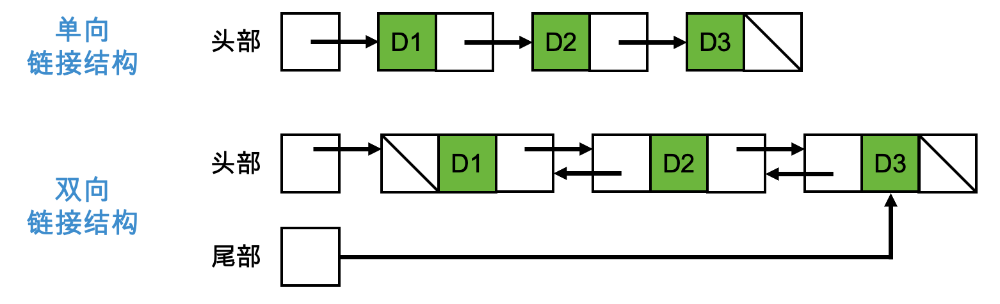

# 4.数组和链接结构

数据结构（data structure）或具体数据类型（concrete data type）是指一组数据的内部存储方式。

数组（array）和链接结构（linked structure）这两种数据结构是编程语言里多项集最常用的实现。

目标：

- 创建数组；
- 对数组执行各种操作；
- 确定数组相关操作的运行时和内存的使用情况；
- 基于数组在计算机内存里的不同存储方式，描述数组相关操作的成本和收益；
- 使用单向链接节点创建链接结构；
- 对由单向链接节点构成的链接结构执行各种操作；
- 基于链接结构在计算机内存里的不同存储方式，描述在链接结构上执行相关操作的成本和收益；
- 比较数组和链接结构在运行时和内存使用上的权衡；

## 4.1.数组数据结构

关于数组（array）：

- 数组是指在给定索引位置可以访问和替换的元素序列。
- Python列表的底层数据结构正是一个数组。
- Python中数组的限制要比列表更多。只能在指定位置访问和替换数组中的元素、检查数组的长度、获取它的字符串表达式；不能基于位置添加或删除元素；数组的长度也就是它的容量，在创建之后就是固定的。

### 4.1.1.随机访问和连续内存

通过下标操作或索引操作实现对数组在指定位置对元素进行存储或检索。

数组索引是随机访问（random access）操作，而在随机访问时，计算机总会执行固定的步骤来获取第`i`个元素的位置。因此，不论数组有多大，访问第一个元素所需的时间和访问最后一个元素所需要的时间都是相同的。

计算机通过分配一块连续内存（contiguous memory）单元来存储数组里的元素，从而支持对数组的随机访问。

由于数组里的元素地址都是按照数字顺序进行排列的，因此可以通过添加两个值来计算出数组元素的机器地址，它们是数组的基地址（base address）以及元素的偏移量（offset）。其中，数组的基地址就是第一个元素的机器地址，而元素的偏移量就是它的索引值再乘以一个代表数组元素所需内存单元数的常量（在Python里，这个值始终是1）。

简而言之，Python数组里的索引操作包括下面两个步骤：

- 得到数组内存块的基地址。
- 将索引值添加到这个地址并返回。

### 4.1.2.静态内存和动态内存

在比较老的编程语言（如FORTRAN或Pascal）里，数组是静态数据结构。在这种情况下，数组的长度或容量在编译时就确定了，程序员需要申请足够多的内存来满足在数组里存储可能有最大数量元素的情况，这样做会浪费大量的内存。

像Java和C++这类的现代编程语言会允许程序员创建动态数组（dynamic array），从而为这个问题提供了一种补救方法。和静态数组相似的是，动态数组也会占用一块连续内存，并支持随机访问。动态数组的长度只在运行时才知道，在动态数组实例化的时候指定它的长度。在Python里实现的Array类的行为也是这样的。

我们可以通过另一种方法在运行时根据应用程序的数据要求来调整数组的长度，这些调整会由Python列表自动进行。这时，数组有以下3种不同形式。

- 在程序启动时创建一个具有合理默认大小的数组。
- 当数组无法容纳更多数据时，创建一个更大的新数组，并把旧数组里的数据元素传输给它。
- 如果数组在浪费内存（应用程序删除了一些数据），那么用类似的方式减小数组的长度。

### 4.1.3.物理尺寸和逻辑尺寸

数组的物理尺寸（physical size）是指数组单元的总数，或者创建数组时指定其容量的那个数字；

数组的逻辑尺寸（logical size）是指当前应用程序使用的元素数量。

当数组被填满的时候，我们不需要担心它们的不同。当数组被部分填满的时候，未被填充的内存单元里的数据对当前应用程序是没有用的，我们称之垃圾内容（garbage）。在大多数应用程序里，我们是要注意对数组的物理尺寸和逻辑尺寸进行追踪。通常来说，逻辑尺寸和物理尺寸会反映出有关数组状态的几个重点。

- 如果逻辑尺寸为0，那么数组就为空。也就是说，这个数组不包含任何数据元素。
- 如果并非上述情况，在任何情况下，数组中最后一个元素的索引都是它的逻辑尺寸减1。
- 如果逻辑尺寸等于物理尺寸，那么表示数组已被填满了。

### 4.1.4.练习题

1．请说明随机访问的工作原理，以及这个操作这么快的原因。

解答：随机访问是一种计算机存储系统中的读取或写入数据的操作，其中数据可以通过直接跳转到其存储位置而不需要顺序扫描来访问。这与顺序访问不同，后者需要按顺序遍历数据以找到所需的信息。随机访问的工作原理如下：

- 存储介质：计算机内存和硬盘等存储设备都支持随机访问。这些存储介质中的数据通常被划分为块或扇区，并且每个块或扇区都有一个唯一的地址或索引。
- 访问地址：为了进行随机访问，计算机需要知道要访问的数据的地址。这个地址可以是内存中的特定位置，也可以是硬盘上的某个扇区的地址。
- 寻址和传输：计算机使用存储设备的控制器或存储器管理单元来查找数据的地址。一旦找到了正确的地址，存储设备会将数据传输到计算机的内存中供处理器使用。
- 访问速度：随机访问之所以如此快速，是因为计算机内存和现代硬盘驱动器等存储设备都经过了优化，可以快速响应访问请求。这些设备使用了高速缓存、读写头、寻道机构等技术来最小化数据访问的延迟。

原因：

- 存储设备的物理结构：计算机内存和硬盘等存储设备的物理结构被设计成可以随机访问的。内存中的每个地址都可以瞬间访问，而硬盘上的扇区也可以通过磁头寻道和旋转磁盘等机制迅速访问。
- 高速缓存：现代计算机内存和处理器都配备了高速缓存（例如，CPU缓存）。这些高速缓存存储了最近访问的数据，可以快速提供给处理器，从而降低了访问延迟。
- 存储器管理：操作系统和存储设备的控制器会管理存储器的访问，以确保数据可以高效地被访问和传输。这包括了磁盘调度算法、内存分页等策略。
- 技术进步：硬件制造技术的进步和存储设备的优化使得随机访问速度更快。例如，固态硬盘（SSD）的出现显著提高了数据的随机访问速度。

总之，随机访问之所以如此快速，是因为计算机内存和存储设备的物理和技术特性使其能够以高效、迅速的方式访问数据。这种访问速度对于计算机的性能和响应时间至关重要。

2．数组和Python列表之间有什么区别？

解答：数组和Python列表之间有几个关键区别，这些区别在数据结构、功能和用途上存在差异：

- 数据类型：
      - 数组：通常要求所有元素具有相同的数据类型。这是因为数组在内存中以紧凑的方式存储数据，需要知道每个元素的大小以便进行随机访问。
      - Python列表：Python的列表可以容纳不同数据类型的元素，因为它们是动态类型的。
- 内存管理：
      - 数组：通常在创建时需要指定固定大小，因此在内存中会分配一块连续的空间，这使得数组对于高效的随机访问非常适用。
      - Python列表：Python的列表是动态的，它们可以根据需要自动扩展或缩小。这导致了一些额外的内存开销，因为列表需要更多的空间来管理元素的添加和删除。
- 性能：
      - 数组：由于内存布局连续，因此数组通常在访问元素时更快。数组还支持更多的底层操作，如位操作。
      - Python列表：Python列表更加灵活，但在某些情况下可能会导致性能下降，特别是当涉及大量元素的插入和删除操作时。
- 操作和方法：
      - 数组：通常提供一组基本操作，如读取和写入元素，以及一些数学运算，如向量化操作。
      - Python列表：Python列表提供了更丰富的方法和操作，包括元素的插入、删除、追加、切片、连接等。
- 语言依赖性：
      - 数组：数组通常是编程语言的一部分，具有固定的语法和语义。
      - Python列表：Python的列表是Python标准库的一部分，与Python的动态特性相适应。
- 适用场景：
      - 数组：适用于需要高效随机访问的情况，如数值计算、图像处理等。
      - Python列表：适用于更广泛的应用，特别是在编写Python代码时，因为它们更灵活且易于使用。

总之，数组和Python列表都有自己的优势和适用场景。选择使用哪种数据结构取决于具体的需求和编程语言。在Python中，通常会优先选择使用列表，因为它们更方便，而在其他编程语言中，如C或Java，数组可能更为常见。

在这里需要说明一个概念。在Python中，术语"数组"通常指的是NumPy库中的数组对象，而"列表"指的是Python的内置列表（list）数据结构。这两者之间有以下区别：

- 数据类型：
      - 数组（NumPy数组）：NumPy库提供了一个多维数组对象，它可以包含相同数据类型的元素，并支持高级数学、科学和工程计算。NumPy数组的元素类型通常是固定的，例如，可以是整数、浮点数、复数等。这些数组是高性能的，支持向量化操作。
      - 列表（Python列表）：Python的内置列表是一种通用的、动态类型的数据结构，可以包含不同数据类型的元素，例如整数、浮点数、字符串、对象等。列表可以动态扩展和缩小，并提供了丰富的内置方法和操作。
- 性能：
      - 数组（NumPy数组）：NumPy数组通常比Python列表更高效，特别是在进行数值计算和科学计算时。它们内部使用了C语言实现，支持向量化操作，因此在大规模数据处理中通常更快。
      - 列表（Python列表）：Python列表虽然灵活，但性能相对较低，不适合大规模的数值计算。它们的元素类型可以不同，这意味着需要更多的内存和处理时间来管理元素。
- 库依赖：
      - 数组（NumPy数组）：使用NumPy库需要安装NumPy模块。NumPy是Python中用于数值计算的核心库，广泛应用于科学计算、机器学习等领域。
      - 列表（Python列表）：Python的内置列表是Python标准库的一部分，无需额外安装。
- 功能：
      - 数组（NumPy数组）：NumPy数组提供了许多数学和科学计算函数，如线性代数、傅立叶变换、统计分析等。它们适用于处理大量数值数据。
      - 列表（Python列表）：Python列表提供了通用的数据容器，用于存储和管理各种类型的数据，但不提供专门的数学和科学计算功能。

如果需要进行数值计算、科学计算或数据分析，通常会使用NumPy数组。如果只是需要一个通用的数据容器，用于存储和管理数据，那么Python列表通常足够了。

3．请说明数组的物理尺寸和逻辑尺寸之间的区别。

解答："物理尺寸"和"逻辑尺寸"通常用于描述数据结构中的两个不同方面：

- 物理尺寸（Physical Size）：
      - 物理尺寸是指数据结构实际占用的内存空间或存储介质中的空间大小。
      - 它表示数据结构在计算机内存或磁盘中所占据的实际字节数。
      - 物理尺寸与数据结构的存储方式、数据类型以及计算机架构有关。
- 逻辑尺寸（Logical Size）：
      - 逻辑尺寸是指数据结构中包含的元素数量或数据项的数量。
      - 它表示数据结构内部的元素数量或数据项的个数，不涉及实际的存储大小。
      - 逻辑尺寸通常用于描述数据结构的容量、规模或维度。

这两个概念之间的关系如下：

- 一个数据结构可以具有固定的物理尺寸（占据固定数量的字节），但其逻辑尺寸可以根据实际存储的元素数量而变化。
- 物理尺寸通常是由计算机硬件和操作系统管理的，而逻辑尺寸则是程序员根据数据结构的设计来管理的。

举例来说，一个整数数组可以具有固定的物理尺寸，例如4字节/整数，但它的逻辑尺寸可以是数组中整数的数量，可以是0个、10个、100个等等。因此，逻辑尺寸描述了数组可以容纳的元素数量，而物理尺寸描述了实际占用的内存空间。

在数据结构的设计和使用中，了解和管理物理尺寸和逻辑尺寸对于有效地利用计算机资源非常重要。

## 4.2.数组的操作

Python的`array`模块包含一个叫作`array`的类，它非常类似于列表，但是只能存储数字。我们会定义一个叫作`Array`的新类，使用列表保存元素，存储任何类型的元素。

下面的示例定义了一个数组类`Array`，下面对数组的一些操作的代码实现也已经包含在下面的代码中。其中：

- 数组默认的物理尺寸（也就是容量）是5
- 数组的初始逻辑尺寸是0

```python
class Array(object):
    """描述一个数组。"""

    def __init__(self, capacity, fillValue=None):
        """Capacity是数组的大小.  fillValue会填充在每个元素位置, 默认值是None"""
        # 初始化数组的逻辑尺寸和物理尺寸
        self.logicalSize = 0
        self.capacity = capacity
        self.fillValue = fillValue
        #初始化内部数组，并填充元素值
        self.items = list()
        for count in range(capacity):
            self.items.append(fillValue)
            self.logicalSize += 1  # 初始化数组物理大小时，也同时初始化其逻辑大小

    def __len__(self):
        """返回数组的大小"""
        return len(self.items)

    def __str__(self):
        """将数组字符串化并返回"""
        result = ""
        for index in range(self.size()):
            result += str(self.items[index]) + " "
        return result

    def size(self):
        """返回数组的逻辑尺寸"""
        return self.logicalSize

    def __iter__(self):
        """支持for循环对数组进行遍历."""
        print("__iter__ called")  # 仅用来测试何时__iter__会被调用
        return iter(self.items)

    def __getitem__(self, index):
        """
        用于访问索引处的下标运算符.
        先决条件: 0 <= index < size()
        """
        if index < 0 or index >= self.size():
            raise IndexError("读取操作出错, 数组索引越界(不在数组逻辑边界范围内)")

        return self.items[index]

    def __setitem__(self, index, newItem):
        """
        下标运算符用于在索引处进行替换.
        先决条件: 0 <= index < size()
        """
        if index < 0 or index >= self.size():
            raise IndexError("更新操作出错, 数组索引越界(不在数组逻辑边界范围内)")
        self.items[index] = newItem

    def __eq__(self, other):
        """
        两个数组相等则返回True，否则返回False
        """
        # 判断两个数组是否是同一个对象，注意，不是它们的值是否相等
        if self is other:
            return True
        # 判断两个对象类型是否一样
        if type(self) != type(other):
            return False
        # 判断两个数组大小是否一样
        if self.size() != other.size():
            return False
        # 比较两个数组的值是否一样
        for index in range(self.size()):
            if self[index] != other[index]:
                return False
        return True

    def grow(self):
        """增大数组物理尺寸"""
        # 基于当前物理尺寸加倍，并将fillValue赋值底层列表的新元素
        for count in range(len(self)):
            self.items.append(self.fillValue)

    def insert(self, index, newItem):
        """在数组指定索引处插入新元素"""
        # 当数组的物理尺寸和逻辑尺寸一样时，则增加物理尺寸
        if self.size() == len(self):
            self.grow()
        # 插入新元素
        # 当插入位置大于或等于最大逻辑位置，则在数组末端插入新元素
        # 当插入位置介于数组逻辑位置的中间，则从插入位置起将剩余数组元素向尾部平移一个位置
        if index >= self.size():
            self.items[self.size()] = newItem
        else:
            index = max(index, 0)

            # 将数组元素向尾部平移一个位置
            for i in range(self.size(), index, -1):
                self.items[i] = self.items[i - 1]

            # 插入新元素
            self.items[index] = newItem

        # 增加数组的逻辑尺寸
        self.logicalSize += 1

    def shrink(self):
        """
        减少数组的物理尺寸
        当:
        - 数组的逻辑尺寸小于或等于其物理尺寸的1/4
        - 并且它的物理尺寸至少是这个数组建立时默认容量的2倍时
        则把数组的物理尺寸减小到原来的一半，并且也不会小于其默认容量
        """
        # 在逻辑尺寸和物理尺寸的一半之间选择最大值作为数组收缩后的物理尺寸
        newSize = max(self.capacity, len(self) // 2)
        # 释放多余的数组空间
        for count in range(len(self) - newSize):
            self.items.pop()

    def pop(self, index):
        """
        删除指定索引值的数组元素,并返回删除的数组元素值
        先决条件: 0 <= index < size()
        """
        if index < 0 or index >= self.size():
            raise IndexError("删除操作出错, 数组索引越界(不在数组逻辑边界范围内)")

        # 保存即将被删除的数组元素值
        itemToReturn = self.items[index]

        # 将数组元素向头部平移一个位置
        for i in range(index, self.size() - 1):
            self.items[i] = self.items[i + 1]

        # 将数组尾部的空余位赋值fillValue，默认是None
        self.items[self.size() - 1] = self.fillValue

        # 减少数组逻辑尺寸
        self.logicalSize -= 1

        # 减少数组物理尺寸
        # 当:
        # - 数组的逻辑尺寸小于或等于其物理尺寸的1/4
        # - 并且它的物理尺寸至少是这个数组建立时默认容量的2倍时
        # 则把数组的物理尺寸减小到原来的一半，并且也不会小于其默认容量
        if self.size() <= len(self) // 4 and len(self) > self.capacity:
            self.shrink()

        # 返回被删除元素的值
        print(f'Item {itemToReturn} was deleted')
        return itemToReturn


def main():
    # 初始化空数组
    DEFAULT_CAPACITY = 5
    my_arr = Array(DEFAULT_CAPACITY)

    # 打印输出数组初始信息
    print("Physical size:", len(my_arr))
    print("Logical size:", my_arr.size())
    print("Initial items:", my_arr.items)

    # 初始化数组元素
    print('------')
    for item in range(4):
        my_arr.insert(0, item)  # 在数组头部插入，每插入一次都需要向后移动已有数组元素
    print("Items(logical):", my_arr)
    print("Items(physical):", my_arr.items)

    # 在数组中间插入新元素
    print('------')
    my_arr.insert(3, 99)
    print("Items(logical):", my_arr)
    print("Items(physical):", my_arr.items)

    # 在数组逻辑尺寸外插入新元素
    print('------')
    my_arr.insert(20, 88)
    print("Items(logical):", my_arr)
    print("Items(physical):", my_arr.items)

    # 删除数组元素
    print('------')
    my_arr.pop(3)
    my_arr.pop(3)
    print("Items(logical):", my_arr)
    print("Items(physical):", my_arr.items)

    # 清空数组元素
    print('------')
    for count in range(my_arr.size()):
        my_arr.pop(0)
    print("Items(logical):", my_arr)
    print("Items(physical):", my_arr.items)

    # 数组元素已经全部删除，逻辑尺寸为零，下面命令返回错误
    # print('------')
    # print(my_arr.pop(0))

    # 数组比较
    # 初始化数组
    print('------')
    arr_a = Array(5)
    for item in range(4):
        arr_a.insert(0, item)
    arr_b = arr_a
    arr_c = Array(5)
    for item in range(4):
        arr_c.insert(0, item)
    arr_d = []

    print("arr_a(physical):", arr_a.items)
    print("arr_b(physical):", arr_b.items)
    print("arr_c(physical):", arr_c.items)
    print("arr_d(physical):", arr_d)

    print("arr_a == arr_b:", arr_a == arr_b)
    print("arr_a is arr_b:", arr_a is arr_b)
    print("arr_a == arr_c:", arr_a == arr_c)
    print("arr_a is arr_c:", arr_a is arr_c)

    arr_c.insert(10, 10)
    print("arr_a == arr_c:", arr_a == arr_c)
    arr_c.pop(arr_c.size() - 1)
    arr_c[2] = 6
    print("arr_a == arr_c:", arr_a == arr_c)

    print("arr_a == arr_d:", arr_a == arr_d)


if __name__ == "__main__":
    main()

# 运行结果
# Physical size: 5
# Logical size: 0
# Initial items: [None, None, None, None, None]
# ------
# Items(logical): 3 2 1 0
# Items(physical): [3, 2, 1, 0, None]
# ------
# Items(logical): 3 2 1 99 0
# Items(physical): [3, 2, 1, 99, 0]
# ------
# Items(logical): 3 2 1 99 0 88
# Items(physical): [3, 2, 1, 99, 0, 88, None, None, None, None]
# ------
# Item 99 was deleted
# Item 0 was deleted
# Items(logical): 3 2 1 88
# Items(physical): [3, 2, 1, 88, None, None, None, None, None, None]
# ------
# Item 3 was deleted
# Item 2 was deleted
# Item 1 was deleted
# Item 88 was deleted
# Items(logical):
# Items(physical): [None, None, None, None, None]
# ------
# IndexError: 删除操作出错, 数组索引越界(不在数组逻辑边界范围内)
# ------
# arr_a(physical): [3, 2, 1, 0, None]
# arr_b(physical): [3, 2, 1, 0, None]
# arr_c(physical): [3, 2, 1, 0, None]
# arr_d(physical): []
# arr_a == arr_b: True
# arr_a is arr_b: True
# arr_a == arr_c: True
# arr_a is arr_c: False
# arr_a == arr_c: False
# Item 10 was deleted
# arr_a == arr_c: False
# arr_a == arr_d: False
```

### 4.2.1.增大数组的尺寸

当数组的逻辑尺寸等于它的物理尺寸时，如果要插入新的元素，就需要增大数组的物理尺寸。
如果需要为数组提供更多内存，Python的list类型会在调用insert或append方法时执行这个操作。

调整数组物理尺寸的过程包含如下3个步骤。

- 创建一个更大的新数组。
- 将数据从旧数组中复制到新数组。
- 将指向旧数组的变量指向新数组对象。

下面代码实现。

```python
# 增大数组物理尺寸
if logicalSize == len(my_array):
    temp = Array(len(my_array) + 1)  # 创建一个新数组
    for i in range(logicalSize):
        temp[i] = my_array[i]  # 从原数组复制内容到新数组
    my_array = temp  # 把新数组赋值给原数组
```

在上面代码中，通过`temp[i] = my_array[i]`来调整数组尺寸，这个复制操作的数量是线性增长的。因此，将`n`个元素添加到数组里的总时间复杂度是`1+2+3...+n`，也就是`n(n+1)/2`，因此是`O(n^2)`。

在上面的代码中，通过``temp = Array(len(my_array) + 1)``对数组进行动态扩展，对性能会产生一些可能的影响：

- 时间复杂度：动态扩展数组通常需要复制现有数据到新的内存位置，这将涉及到元素的复制操作。这些操作的时间复杂度取决于数组的长度，通常是`O(n)`，其中`n`是数组的长度。因此，当数组需要扩展时，可能会产生一些额外的时间开销。
- 空间复杂度：动态扩展数组会占用额外的内存空间，因为需要分配新的内存块来容纳扩展后的数组。这可能会导致内存碎片化，特别是在频繁扩展和缩小数组时。
- 扩展频率：扩展数组的频率会影响性能。如果数组需要频繁扩展，那么复制和内存分配的开销会更加显著，从而降低性能。因此，在设计数据结构时，通常会考虑初始容量和扩展策略，以减少不必要的扩展次数。
- Amortized Analysis：一些数据结构，例如Python的列表（list），采用摊还分析来平摊动态扩展的开销。这意味着虽然某些操作可能会花费`O(n)`的时间，但这些开销在一系列操作中被分摊，平均下来仍然保持较低的复杂度。这可以在一定程度上缓解性能问题。

动态扩展数组会引入一些性能开销，但在实际应用中，这种开销通常是可以接受的。为了优化性能，可以考虑以下几点策略，需要根据具体应用的需求和性能要求来权衡这些因素：

- 预先分配足够的初始容量，以减少扩展的频率。
- 使用摊还分析来平摊开销。
- 考虑使用其他数据结构，如链表，对插入和删除操作的性能更加友好。

下面，尝试在每次增大数组尺寸时把数组尺寸翻倍，代码实现如下：

```python
# 增大数组物理尺寸
while logicalSize < DEFAULT_CAPACITY * 2:
    logicalSize += 1
    if logicalSize == len(my_array):  # 触发条件
        temp = Array(len(my_array) + 1)  # 创建一个新数组
        for i in range(logicalSize):
            temp[i] = my_array[i]  # 从原数组复制内容到新数组
        my_array = temp  # 把新数组赋值给原数组
```

将数组尺寸翻倍来扩展数组的方式是一种常见的策略，通常用于减少动态数组的频繁扩展次数，以提高性能。这种方式的操作时间复杂度主要取决于扩展操作的频率和元素的复制成本。

- 摊还分析：对于将数组尺寸翻倍的策略，摊还分析表明，每次扩展操作的摊还时间复杂度仍然是常数时间的（通常是O(1)），这意味着平均下来，每次扩展的开销是固定的，而不会随数组的大小线性增加。
- 操作时间：假设数组需要扩展，那么将数组尺寸翻倍需要分配新的内存块并复制现有元素，这个操作的时间复杂度是O(n)，其中n是数组的当前大小。然而，由于扩展操作不是每次都执行的，而是当数组已满时才执行，因此可以认为这个操作的摊还时间是常数时间，即O(1)。
- 空间复杂度：将数组尺寸翻倍会占用额外的内存空间，但随着数组的增长，额外内存的占用相对于数组本身的大小来说是有限的。通常情况下，这种占用可以接受。

总结，将数组尺寸翻倍的策略可以显著减少动态数组的扩展次数，从而提高性能。虽然每次扩展操作可能会花费一些时间和额外内存，但这些开销在一系列操作中被平摊，平均下来是常数时间。这是一种高效的动态数组实现方式，常见于许多编程语言的标准库中，包括Python的列表（list）。

在增加数组的长度时，每次增加一个内存单元，与每次增大数组尺寸时把数组尺寸翻倍相比，后者的方法通常更高效。

- 每次增加一个内存单元：这种方式在每次添加新元素时都需要分配额外的内存，导致数组尺寸的增长是线性的。如果频繁添加元素，这将导致大量的内存分配和数据复制操作，因此时间复杂度会变得相对较高。
- 每次增大数组尺寸时把数组尺寸翻倍：这是一种更高效的策略。在这种方式下，每次扩展操作都会增加数组的尺寸，但增幅是指数级的，而不是线性的。这意味着随着数组的增长，扩展操作的频率会减少，因为数组能够容纳更多元素。这样，虽然每次扩展操作需要复制更多的元素，但它们的摊还时间复杂度仍然是常数时间，因为它们不是每次都执行的。

总结，将数组尺寸翻倍的策略通常更高效，因为它可以减少频繁的内存分配和复制操作，降低了时间复杂度。这是许多动态数组实现的常见做法，包括Python的列表（list）。

在`Array`类实现中，是通过下面代码段实现的数组物理尺寸增加的，即将数组尺寸翻倍。

```python
    def grow(self):
        """增大数组物理尺寸"""
        # 基于当前物理尺寸加倍，并将fillValue赋值底层列表的新元素
        for count in range(len(self)):
            self.items.append(self.fillValue)
```

### 4.2.2.减小数组的尺寸

如果减小数组的逻辑尺寸，就会浪费相应的内存单元。因此，当删除某一个元素，如果未使用的内存单元数达到或超过了某个阈值（如数组物理尺寸的3/4）时，则应该减小物理尺寸了。如果浪费的内存超过特定阈值，那么Python的list类型会在调用`pop`方法时执行减小数组物理尺寸的操作。

减小数组尺寸的过程与增大数组尺寸的过程相反，步骤如下：

- 创建一个更小的新数组。
- 将数据从旧数组中复制到新数组。
- 将指向旧数组的变量指向新数组对象。

下面的代码实现了减小数组尺寸。

当数组的逻辑尺寸小于或等于其物理尺寸的1/4，并且它的物理尺寸至少是这个数组建立时默认容量的2倍时，则下面的算法把数组的物理尺寸减小到原来的一半，并且也不会小于其默认容量。

```python
# 减小数组物理尺寸
while logicalSize > len(my_array) // 4:
    logicalSize -= 1
    if logicalSize <= len(my_array) // 4 and len(my_array) >= DEFAULT_CAPACITY * 2:  # 触发条件
        temp = Array(len(my_array) // 2)  # 创建一个新数组
        for i in range(logicalSize):
            temp[i] = my_array[i]  # 从原数组复制内容到新数组
        my_array = temp  # 把新数组赋值给原数组
```

按照上面算法减少数组的尺寸，我们可以分析其时间和空间复杂度如下：

时间复杂度：主要涉及两个操作：

- 创建新数组并将元素从旧数组复制到新数组；
- 将旧数组引用更改为新数组。

复制操作的时间复杂度取决于数组的物理尺寸，可以表示为`O(n)`，其中`n`是数组的当前物理尺寸。引用更改是一个常数时间操作，不影响时间复杂度。所以，整体的时间复杂度是`O(n)`。

空间复杂度：空间复杂度也涉及两个方面：

- 创建新数组的内存消耗，其空间复杂度是O(N)；
- 引用更改所需的常数额外空间，通常忽略不计。

所以，总的空间复杂度是`O(n)`。

这个算法策略会在适当的时候减小数组的物理尺寸，以减少内存占用，但仍然保持着数组的动态性。时间复杂度和空间复杂度都与当前数组的物理尺寸成线性关系，因此是线性的，这是一种有效的策略来优化内存使用。同时，保留了一定的冗余空间，以避免频繁地扩展和缩小数组，从而提高了性能。

下面是在`Array`类中实现减小数组的物理尺寸的代码。

```python
    def shrink(self):
        """
        减少数组的物理尺寸
        当:
        - 数组的逻辑尺寸小于或等于其物理尺寸的1/4
        - 并且它的物理尺寸至少是这个数组建立时默认容量的2倍时
        则把数组的物理尺寸减小到原来的一半，并且也不会小于其默认容量
        """
        # 在逻辑尺寸和物理尺寸的一半之间选择最大值作为数组收缩后的物理尺寸
        newSize = max(self.capacity, len(self) // 2)
        # 释放多余的数组空间
        for count in range(len(self) - newSize):
            self.items.pop()
```

### 4.2.3.将元素插入增大的数组

把元素插入数组中和替换数组里的元素是不一样的。

替换数组元素时，元素已在一个给定的索引位置，对这个位置进行简单复制即可，数组的逻辑尺寸并不会改变。

插入数组元素时，需要完成下面4个步骤：

- 在插入元素之前先检查可以使用的空间，根据需要来增大数组的物理尺寸。
- 将数组里从逻辑结尾到目标索引的所有元素向后移动。这个过程会在目标索引位置处为新元素留下一个空格。
- 将新元素分配到目标索引位置。
- 将逻辑尺寸加1。

实现算法：

```Python
# 当数组的物理尺寸和逻辑尺寸一样时，则增加物理尺寸

# 将数组元素向尾部平移一个位置
for i in range(logicalSize, targetIndex, -1):
    my_array[i] = my_array[i - 1]

# 插入新元素，增加数组的逻辑尺寸
my_array[targetIndex] = newItem
logicalSize += 1
```

下面是`Array`类中实现插入元素的方法。

```Python
    def insert(self, index, newItem):
        """在数组指定索引处插入新元素"""
        # 当数组的物理尺寸和逻辑尺寸一样时，则增加物理尺寸
        if self.size() == len(self):
            self.grow()
        # 插入新元素
        # 当插入位置大于或等于最大逻辑位置，则在数组末端插入新元素
        # 当插入位置介于数组逻辑位置的中间，则从插入位置起将剩余数组元素向尾部平移一个位置
        if index >= self.size():
            self.items[self.size()] = newItem
        else:
            index = max(index, 0)

            # 将数组元素向尾部平移一个位置
            for i in range(self.size(), index, -1):
                self.items[i] = self.items[i - 1]

            # 插入新元素
            self.items[index] = newItem

        # 增加数组的逻辑尺寸
        self.logicalSize += 1
```

### 4.2.4.从数组里删除元素

从数组里删除元素的步骤如下，和插入操作一样，元素的移动顺序非常重要。

- 将数组里从目标索引到逻辑结尾的所有元素向前移动，把每个元素都复制到它前面的那个内存单元里。这个过程会关闭删除目标索引位置中的元素所留下的空格。
- 将逻辑尺寸减1。
- 检查是否存在内存空间的浪费，并根据需要减小数组的物理尺寸。

在平均情况下，移动元素的时间复杂度是线性的，因此删除操作的时间复杂度也是线性的。

下面是实现删除操作的代码。

```python
# 将数组元素向头部平移一个位置
for i in range(targetIndex, logicalSize - 1):
     my_array[i] = my_arraya[i + 1]

# 减少数组逻辑尺寸
logicalSize -= 1

# 如果需要，则减少数组物理尺寸
```

下面是`Array`类中实现删除元素的方法。

```python
    def pop(self, index):
        """
        删除指定索引值的数组元素,并返回删除的数组元素值
        先决条件: 0 <= index < size()
        """
        if index < 0 or index >= self.size():
            raise IndexError("删除操作出错, 数组索引越界(不在数组逻辑边界范围内)")

        # 保存即将被删除的数组元素值
        itemToReturn = self.items[index]

        # 将数组元素向头部平移一个位置
        for i in range(index, self.size() - 1):
            self.items[i] = self.items[i + 1]

        # 将数组尾部的空余位赋值fillValue，默认是None
        self.items[self.size() - 1] = self.fillValue

        # 减少数组逻辑尺寸
        self.logicalSize -= 1

        # 减少数组物理尺寸
        # 当:
        # - 数组的逻辑尺寸小于或等于其物理尺寸的1/4
        # - 并且它的物理尺寸至少是这个数组建立时默认容量的2倍时
        # 则把数组的物理尺寸减小到原来的一半，并且也不会小于其默认容量
        if self.size() <= len(self) // 4 and len(self) > self.capacity:
            self.shrink()

        # 返回被删除元素的值
        print(f'Item {itemToReturn} was deleted')
        return itemToReturn
```

### 4.2.5.复杂度的权衡：时间、空间和数组

下表列出了所有数组操作的运行时复杂度，包括在数组的逻辑结尾处插入和删除元素。

- 数组提供了对已经存在的元素进行快速访问的功能，以及在逻辑结尾处快速插入和删除的功能。
- 在任意位置处进行插入和删除操作的速度则会慢上一个数量级。
- 调整数组的尺寸也需要线性时间，但是因为这个操作会把数组尺寸加倍或减半，所以可以最大限度地减少需要执行的次数。
- 由于可能会调整数组的尺寸，因此插入和删除操作在使用内存的时候会有`O(n)`的复杂度，那么这就是最坏情况下的性能；而在平均情况下，这些操作的内存使用情况仍然为`O(1)`。

| 操作 | 运行时复杂度 |
| --- | --- |
| 在位置i处访问 | O(1)，最好和最坏情况下 |
| 在位置i处替换 | O(1)，最好和最坏情况下 |
| 在逻辑结尾处插入 | O(1)，平均情况下 |
| 在位置i处插入 | O(n)，平均情况下 |
| 在位置i处删除 | O(n)，平均情况下 |
| 增大容量 | O(n)，最好和最坏情况下 |
| 减小容量 | O(n)，最好和最坏情况下 |
| 在逻辑结尾处删除 | O(1)，平均情况下 |

使用数组的时候，内存里唯一真正被浪费的是那些尚未填充满的数组单元。

评估数组内存使用率的一个非常有用的概念是负载因子（load factor）。数组的负载因子等同于它所存储的元素数除以数组的容量。

- 当数组已满的时候，负载因子就是1；
- 当数组为空时，负载因子就是0；
- 当内存单元的容量为10且占用了3个单元时，负载因子就是0.3；
- 当数组的负载因子降到某个阈值（如0.25）以下时，可以通过调整数组尺寸将浪费的内存单元数保持在尽可能低的水平；

### 4.2.6.练习题

1．请说明为什么插入或删除给定元素时必须要移动数组里的某些元素。

解答：在 Python 中，列表（list）是基于数组实现的数据结构。所谓的“数组”，其本质上是一块连续的内存空间，由于其内存连续的特性，数组在进行插入或者删除一个元素时，为了保持内存的连续性，往往需要移动数组里的其它元素。

当在数组的中间位置插入一个新的元素时，为了给新元素腾出空间，它后面的所有元素都需要向后移动一位。同样的，如果我们删除了数组的一个元素，为了避免在数组中出现一个空洞，被删除元素后面的所有元素都需要向前移动一位。

然而，Python的 list 数据结构是动态的，也就是说，当插入或删除元素时，Python会自动分配或回收内存。当在 list 的末尾添加或移除元素时，不需要移动其他元素，因此操作效率较高；但是在 list 的中间或起始部分插入或删除元素时，就需要移动其它元素，相对而言，其操作效率就较低了。

2．在插入过程中，移动数组元素时，要先移动哪个元素？先移动插入位置的元素，还是最后一个元素？为什么？

解答：在 Python 中实现数组的插入过程时，应当先移动插入位置之后的最后一个元素。

考虑以下的情况：值插入于数组的中间位置，你试图从插入位置开始，将每个元素后移一位。但是，当你把第一个元素移到第二个位置时，你会覆盖掉原有的第二个元素，由于你还没有保存或复制这个被覆盖的元素，它就会丢失。

如果从最后一个元素开始，将每个元素向后移一位，那么每个元素都会被复制到它的下一位，然后才会被它前面的元素覆盖。这样就确保了每个元素都能正确地移动到它应该到达的位置，不会有任何元素丢失。
所以，在插入过程中，我们应该从最后一个元素开始，逐个将元素后移一位，直到将插入位置的元素也后移一位，然后在插入位置放入新的元素。

3．如果插入位置是数组的逻辑末尾，请说明这个插入操作的运行时复杂度。

解答：如果在数组（在 Python 中就是 list）的逻辑末尾插入元素，这种操作通常可以在常数时间内完成，也就是说，这种操作的时间复杂度是 O(1)。

因为数组是连续的内存空间，位于末尾的插入操作不需要移动任何元素，仅仅涉及在末尾添加新元素，并可能涉及一些额外的内存分配（如果数组已满，需要分配更大的数组来容纳新的元素）。

需要注意的是，内存分配和复制元素在实际操作中可能还是需要一些时间的，尤其是在数组已满时，需要重新分配并复制整个数组到新的内存地址。但是在理论分析时，我们通常忽略这种情况，因为它是一种被称为摊还（amortized）操作的特例，从长期的平均运行时间来看，这种插入操作的时间复杂度仍然是 O(1) 的。

4．假设数组当前包含14个元素，它的负载因子为0.70，那么它的物理容量是多少？

解答：负载因子通常是指一个哈希表中已存元素数量对应于其底层数组容量的比例。对于一般的数组和 Python 的 list，我们通常不会谈论负载因子，因为这些数据结构的大小直接对应于其中包含的元素数量。

然而，如果你要计算一个负载因子为 0.70 的容器，并且它包含了14个元素，那么它的物理容量可以计算为：`元素数量 / 负载因子 = 容量`

在这种情况下，物理容量应该是 14 / 0.70 = 20。所以物理容量应该是 20。

## 4.3.二维数组（网格）

- 一维数组（one-dimensional array）
- 二维数组（two-dimensional array），或网格（grid）

要访问grid里的元素，可以通过两个下标来指定其行和列的相应位置，并且这两个索引都是从0开始的。

```python
x = grid[2][3] # 将二维数组第二行第三列的值赋给变量x
```

### 4.3.1.使用网格

除了用双下标，网格还必须要有两个方法，用来返回行数和列数。我们把这两个方法分别命名为`getHeight`和`getWidth`。

基于4.3.3中定义的Grid类，下面这段代码会实例化一个二维数组，并计算变量`my_grid`里所有数字的总和。外部循环会迭代5次并向下逐行移动，在每次进入外部循环的时候，内部循环都会迭代5次，从而在不同行的列之间移动。

```python
my_grid = Grid(5, 5, 1)

sum = 0
for row in range(my_grid.getHeight()):            # Go through rows
     for column in range(my_grid.getWidth()):     # Go through columns
          sum +=my_grid[row][column]
```

### 4.3.2.创建并初始化网格

基于4.3.3中定义的Grid类，下面代码实例化了一个二维数组，遍历该数组的每个元素并赋值。

```python
my_grid = Grid(5, 5, 1)
print(my_grid)

# 行遍历
for row in range(my_grid.getHeight()):
     # 列遍历
     for column in range(my_grid.getWidth()):
          my_grid[row][column] = int(str(row) + str(column))
```

### 4.3.3.定义Grid类

下面实现了一个`Grid`对象，包含3个参数（高度、宽度以及初始的填充值）的`Grid`构造函数。

- 高度，即行数；宽度，即列数；
- 实例化了一个5行5列的二维数组；

```python
class Array(object):
    """描述一个数组。"""

    def __init__(self, capacity, fillValue=None):
        """Capacity是数组的大小.  fillValue会填充在每个元素位置, 默认值是None"""
        # 初始化数组的逻辑尺寸和物理尺寸
        self.logicalSize = 0
        self.capacity = capacity
        self.fillValue = fillValue
        #初始化内部数组，并填充元素值
        self.items = list()
        for count in range(capacity):
            self.items.append(fillValue)
            self.logicalSize += 1  # 初始化数组物理大小时，也同时初始化其逻辑大小

    def __len__(self):
        """返回数组的大小"""
        return len(self.items)

    def __str__(self):
        """将数组字符串化并返回"""
        result = ""
        for index in range(self.size()):
            result += str(self.items[index]) + " "
        return result

    def size(self):
        """返回数组的逻辑尺寸"""
        return self.logicalSize

    def __iter__(self):
        """支持for循环对数组进行遍历."""
        print("__iter__ called")  # 仅用来测试何时__iter__会被调用
        return iter(self.items)

    def __getitem__(self, index):
        """
        用于访问索引处的下标运算符.
        先决条件: 0 <= index < size()
        """
        if index < 0 or index >= self.size():
            raise IndexError("读取操作出错, 数组索引越界(不在数组逻辑边界范围内)")

        return self.items[index]

    def __setitem__(self, index, newItem):
        """
        下标运算符用于在索引处进行替换.
        先决条件: 0 <= index < size()
        """
        if index < 0 or index >= self.size():
            raise IndexError("更新操作出错, 数组索引越界(不在数组逻辑边界范围内)")
        self.items[index] = newItem

    def __eq__(self, other):
        """
        两个数组相等则返回True, 否则返回False
        """
        # 判断两个数组是否是同一个对象，注意，不是它们的值是否相等
        if self is other:
            return True
        # 判断两个对象类型是否一样
        if type(self) != type(other):
            return False
        # 判断两个数组大小是否一样
        if self.size() != other.size():
            return False
        # 比较两个数组的值是否一样
        for index in range(self.size()):
            if self[index] != other[index]:
                return False
        return True

    def grow(self):
        """增大数组物理尺寸"""
        # 基于当前物理尺寸加倍，并将fillValue赋值底层列表的新元素
        for count in range(len(self)):
            self.items.append(self.fillValue)

    def insert(self, index, newItem):
        """在数组指定索引处插入新元素"""
        # 当数组的物理尺寸和逻辑尺寸一样时，则增加物理尺寸
        if self.size() == len(self):
            self.grow()
        # 插入新元素
        # 当插入位置大于或等于最大逻辑位置，则在数组末端插入新元素
        # 当插入位置介于数组逻辑位置的中间，则从插入位置起将剩余数组元素向尾部平移一个位置
        if index >= self.size():
            self.items[self.size()] = newItem
        else:
            index = max(index, 0)

            # 将数组元素向尾部平移一个位置
            for i in range(self.size(), index, -1):
                self.items[i] = self.items[i - 1]

            # 插入新元素
            self.items[index] = newItem

        # 增加数组的逻辑尺寸
        self.logicalSize += 1

    def shrink(self):
        """
        减少数组的物理尺寸
        当:
        - 数组的逻辑尺寸小于或等于其物理尺寸的1/4
        - 并且它的物理尺寸至少是这个数组建立时默认容量的2倍时
        则把数组的物理尺寸减小到原来的一半，并且也不会小于其默认容量
        """
        # 在逻辑尺寸和物理尺寸的一半之间选择最大值作为数组收缩后的物理尺寸
        newSize = max(self.capacity, len(self) // 2)
        # 释放多余的数组空间
        for count in range(len(self) - newSize):
            self.items.pop()

    def pop(self, index):
        """
        删除指定索引值的数组元素,并返回删除的数组元素值
        先决条件: 0 <= index < size()
        """
        if index < 0 or index >= self.size():
            raise IndexError("删除操作出错, 数组索引越界(不在数组逻辑边界范围内)")

        # 保存即将被删除的数组元素值
        itemToReturn = self.items[index]

        # 将数组元素向头部平移一个位置
        for i in range(index, self.size() - 1):
            self.items[i] = self.items[i + 1]

        # 将数组尾部的空余位赋值fillValue，默认是None
        self.items[self.size() - 1] = self.fillValue

        # 减少数组逻辑尺寸
        self.logicalSize -= 1

        # 减少数组物理尺寸
        # 当:
        # - 数组的逻辑尺寸小于或等于其物理尺寸的1/4
        # - 并且它的物理尺寸至少是这个数组建立时默认容量的2倍时
        # 则把数组的物理尺寸减小到原来的一半，并且也不会小于其默认容量
        if self.size() <= len(self) // 4 and len(self) > self.capacity:
            self.shrink()

        # 返回被删除元素的值
        print(f'Item {itemToReturn} was deleted')
        return itemToReturn


class Grid(object):
    """描述一个二维数组。"""

    def __init__(self, rows, columns, fillValue=None):
        self.rows = rows
        self.columns = columns
        self.fillValue = fillValue
        # 按行数初始化数组y轴物理尺寸
        self.data = Array(rows, fillValue)
        # 按列数初始化数组x轴物理尺寸，并赋值到y轴数组，填充None值
        for row in range(rows):
            self.data[row] = Array(columns, fillValue)

    def getHeight(self):
        """返回二维数组的y轴的大小(物理尺寸), 即数组的行数"""
        return len(self.data)

    def getWidth(self):
        """返回二维数组的x轴的大小(物理尺寸), 即数组的列数"""
        return len(self.data[0])

    def __getitem__(self, index):
        """返回二维数组指定行和列索引对应的元素值"""
        return self.data[index]

    def __str__(self):
        """返回二维数组的字符串形式"""
        result = ""
        for row in range(self.getHeight()):
            for col in range(self.getWidth()):
                result += str(self.data[row][col]) + " "
            result += "\n"
        return result


def main():
    my_grid = Grid(5, 5, 1)
    print(my_grid)


if __name__ == "__main__":
    main()

# 运行结果
# 1 1 1 1 1 
# 1 1 1 1 1 
# 1 1 1 1 1 
# 1 1 1 1 1 
# 1 1 1 1 1 
```

### 4.3.4.参差不齐的网格和多维数组

到目前为止，我们所讨论的网格都是二维并且是矩形的。我们也可以把网格创建成参差不齐的样子，也可以创建高于两个维度的网格。

参差不齐的网格有固定的行数，但是每一行里的数据列数各有不同。列表数组或数组是可以实现这种网格的合适结构。

比如，可以创建一个三维数组的时候需要指定它的深度、高度以及宽度。因此可以给数组类型添加一个叫作`getDepth`的方法，从而像`getWidth`和`getHeight`方法一样再得到这个维度的相关数据。在这个实现里，每个元素都可以通过3个作为索引的整数进行访问，也可以通过有3层循环的控制语句结构来使用它。

### 4.3.5.练习题

1．什么是二维数组（网格）？

解答：二维数组，有时被称为网格，是一个数据结构，它允许我们将数据以表格形式组织起来，即数据在两个维度上进行组织。可以把二维数组看作是一个数组的数组。例如，在 Python 中，一个二维数组可以是一个列表的列表。

在二维数组中，每个元素都由两个索引确定，通常称为行索引和列索引。可以这样理解：首先选定一个行，然后再在该行中选择一个元素。用任何一种编程语言创建和操作二维数组的具体语法都不尽相同，但是原理是一样的。

在 Python 中，创建二维数组的例子如下：

```python
# 创建一个 3x3 的二维数组
grid = [[1, 2, 3], [4, 5, 6], [7, 8, 9]]

# 访问二维数组中特定的元素
print(grid[1][2])  # 输出：6
```

2．请描述一个可能会用到二维数组的应用程序。

解答：二维数组在各种类型的应用程序中都被广泛使用。一个常见的例子是在处理图像或像素的应用中。

图像可以被看作一个二维数组（或者在彩色图像中，是一个三维数组，三个通道分别是红、绿、蓝），其中每个元素表示一个像素。二维数组中的行和列对应于图像的宽度和高度，元素值通常代表像素的颜色深度。

例如，以下 Python 代码创建了一个简单的灰度图像，并使用 matplotlib 库显示它：

```python
import numpy as np
import matplotlib.pyplot as plt

# 创建一个 10x10 的二维数组，每个元素值为 0-255 之间的随机整数
image = np.random.randint(0, 256, (10, 10))

# 显示这个图像
plt.imshow(image, cmap='gray')
plt.show()
```

在这个例子中，我们使用了 NumPy 库来创建和操作二维数组（在 NumPy 中，这种结构被称为 ndarray）。这是处理大规模数值数据的一个非常好的工具，尤其是对于涉及到科学计算和数据分析的应用程序。
此外，二维数组也广泛应用于游戏开发（如棋盘游戏，如国际象棋或井字游戏的棋盘可以用二维数组来表示）、物理模拟、系统动力学模仿、地理信息系统（地图可以表示为二维数组的高程数据）等许多领域。

3．编写一个程序，使之可以在Grid对象里搜索一个负整数。循环应该在遇到网格里的第一个负整数的地方终止，这时变量row和column应该被设置为这个负数的位置。如果在网格里找不到负数，那么变量row和column应该等于网格的行数和列数。

解答：在Grid类中添加下面的方法，可以实现提名中的要求

```python
    def find_negative(self):
        """返回第一个负整数的索引值"""
        target_row = 0
        target_col = 0
        for row in range(self.getHeight()):
            for col in range(self.getWidth()):
                # 如果当前元素是负数
                if self.data[row][col] < 0:
                # 更新 row 和 column 为该元素的位置
                    target_row = row
                    target_col = col
                    # 终止循环
                    break
            # 如果已找到负数，终止外层循环
            if self.data[row][col] < 0:
                break
        # 返回负数的位置，或者如果没有找到负数，返回行数和列数
        return row, col
```

```python
import random

def main():
    
    my_grid = Grid(5, 5, random.randint(-10, 10))
    print(my_grid)
    print(my_grid.find_negative())
```

4．说说运行下面这段代码后网格里的内容是什么。

```python
matrix = Grid(3, 3)
for row in range(matrix.getHeight()):
     for column in range(matrix.getWidth()):
         matrix[row][column] = row * column
```

解答：这段代码首先创建了一个3x3的网格（或二维数组），然后使用两个嵌套的for循环来遍历这个网格的每一个元素。对于网格中的每一个元素，它的值被设置为其行索引乘以列索引。由于第一行和第一列的索引都是0，所以第一行和第一列的元素值都是0（因为任何数乘以0都等于0）。其它元素的值等于它们的行索引乘以列索引。

```python
0 0 0
0 1 2
0 2 4
```

5．编写一段代码以创建一个参差不齐的网格，它的行分别用来存储3个、6个和9个元素。

解答：使用列表的列表（即列表的嵌套）来创建参差不齐的网格。下面是Python实现代码：

```python
# 创建空网格
grid = []

# 为网格添加行
grid.append([""] * 3)    # 第一行3个元素
grid.append([""] * 6)    # 第二行6个元素
grid.append([""] * 9)    # 第三行9个元素

# 打印网格
for row in grid:
    print(row)
```

上面代码创建一个具有三行的网格，其中第一行有三个元素，第二行有六个元素，第三行有九个元素。每个元素最初都被设置为一个空字符串，这个网格的形状将类似于：

```python
['', '', '']
['', '', '', '', '', '']
['', '', '', '', '', '', '', '', '']
```

6．提供一个把Grid类用作数据结构来实现三维array类的策略。

解答：代码实现如下：

```python
class ThreeDArray(object):
    """描述一个三维数组。"""

    def __init__(self, depth, rows, columns, fillValue=None):
        self.depth = depth
        self.rows = rows
        self.columns = columns
        self.fillValue = fillValue
        # 初始化三维数组，按照深度初始化每一层为一个二维数组
        self.data = Array(depth, fillValue)
        for d in range(depth):
            self.data[d] = Grid(rows, columns, fillValue)

    def getDepth(self):
        """返回三维数组的z轴大小, 即数组的深度"""
        return len(self.data)

    def get_element(self, depth, row, column):
        """获取指定深度、行和列的元素"""
        return self.data[depth][row][column]

    def set_element(self, depth, row, column, new_value):
        """设置指定深度、行和列的元素"""
        self.data[depth][row][column] = new_value

    def add_element(self, depth, row, column, value):
        """在指定深度、行和列添加元素 """
        if self.data[depth][row][column] == self.fillValue:
            self.data[depth][row][column] = value
        else:
            raise Exception("元素添加失败")

    def remove_element(self, depth, row, column):
        """在指定深度、行和列删除元素 """
        if self.data[depth][row][column] != self.fillValue:
            self.data[depth][row][column] = self.fillValue
        else:
            raise Exception("元素删除失败")

    def __str__(self):
        result = ""
        for depth in range(self.getDepth()):
            result += f"Depth {depth}:\n"
            for row in range(self.rows):
                for column in range(self.columns):
                    result += str(self.data[depth][row][column]) + "\t"
                result += "\n"
        return result


def main():
    print("---Initial 3D Array---")
    my_3d = ThreeDArray(3, 2, 2, 9)
    print(my_3d)
    
    print("---Add element into 3D Array---")
    my_3d.add_element(0, 1, 1, 0)
    my_3d.add_element(1, 1, 1, 1)
    my_3d.add_element(2, 1, 1, 2)
    print(my_3d)

    print("---Remove element from 3D Array---")
    my_3d.remove_element(1, 1, 1)
    print(my_3d)


if __name__ == "__main__":
    main()

# 运行结果
# ---Initial 3D Array---
# Depth 0:
# 9       9
# 9       9
# Depth 1:
# 9       9
# 9       9
# Depth 2:
# 9       9
# 9       9

# ---Add element into 3D Array---
# Depth 0:
# 9       9
# 9       0
# Depth 1:
# 9       9
# 9       1
# Depth 2:
# 9       9
# 9       2

# ---Remove element from 3D Array---
# Depth 0:
# 9       9
# 9       0
# Depth 1:
# 9       9
# 9       9
# Depth 2:
# 9       9
# 9       2
```

7．编写一段代码：这段代码会把三维数组里每个单元的值都初始化为它的3个索引位置。例如，如果位置是（深度、行、列），则对于位置（2、3、3）来说，它的值就是233。

解答：修改上面的代码中的`__init__`和`__str__`方法，代码实现如下。

```python
class ThreeDArray(object):
    """描述一个三维数组。"""

    # def __init__(self, depth, rows, columns, fillValue=None):
    #     self.depth = depth
    #     self.rows = rows
    #     self.columns = columns
    #     self.fillValue = fillValue
    #     # 初始化三维数组，按照深度初始化每一层为一个二维数组
    #     self.data = Array(depth, fillValue)
    #     for d in range(depth):
    #         self.data[d] = Grid(rows, columns, fillValue)
    def __init__(self, depth, rows, columns):
        self.depth = depth
        self.rows = rows
        self.columns = columns
        # 初始化三维数组，按照深度初始化每一层为一个二维数组
        self.data = Array(depth)
        for d in range(depth):
            self.data[d] = Grid(rows, columns)
            for r in range(rows):
                for c in range(columns):
                    # 将每个位置的索引拼接成字符串作为元素值
                    self.data[d][r][c] = str(d) + str(r) + str(c)

    def getDepth(self):
        """返回三维数组的z轴大小, 即数组的深度"""
        return len(self.data)

    def get_element(self, depth, row, column):
        """获取指定深度、行和列的元素"""
        return self.data[depth][row][column]

    def set_element(self, depth, row, column, new_value):
        """设置指定深度、行和列的元素"""
        self.data[depth][row][column] = new_value

    def add_element(self, depth, row, column, value):
        """在指定深度、行和列添加元素 """
        if self.data[depth][row][column] == self.fillValue:
            self.data[depth][row][column] = value
        else:
            raise Exception("元素添加失败")

    def remove_element(self, depth, row, column):
        """在指定深度、行和列删除元素 """
        if self.data[depth][row][column] != self.fillValue:
            self.data[depth][row][column] = self.fillValue
        else:
            raise Exception("元素删除失败")

    # def __str__(self):
    #     result = ""
    #     for depth in range(self.getDepth()):
    #         result += f"Depth {depth}:\n"
    #         for row in range(self.rows):
    #             for column in range(self.columns):
    #                 result += str(self.data[depth][row][column]) + "\t"
    #             result += "\n"
    #     return result

    def __str__(self):
        result = ""
        for depth in range(self.getDepth()):
            result += f"Depth {depth}:\n"
            for row in range(self.rows):
                for column in range(self.columns):
                    result += str(self.data[depth][row][column]) + "\t"
                result += "\n"
        return result


def main():
    my_3d = ThreeDArray(3, 4, 4)
    print(my_3d)  # 打印初始状态


if __name__ == "__main__":
    main()

# 运行结果
# Depth 0:
# 000     001     002     003
# 010     011     012     013
# 020     021     022     023
# 030     031     032     033
# Depth 1:
# 100     101     102     103
# 110     111     112     113
# 120     121     122     123
# 130     131     132     133
# Depth 2:
# 200     201     202     203
# 210     211     212     213
# 220     221     222     223
# 230     231     232     233
```

8．编写一段代码：这段代码可以显示出三维数组里的所有元素。打印出的每一行数据都应该代表给定行和列里的所有元素，而深度将从第一个位置向后递归到最后一个位置。遍历应该从第1行、第1列以及第一个深度位置开始，依次遍历所有的深度、列和行。

解答：添加了一个方法`printAllElements`，代码实现如下：

```python
class ThreeDArray(object):
    """描述一个三维数组。"""

    # def __init__(self, depth, rows, columns, fillValue=None):
    #     self.depth = depth
    #     self.rows = rows
    #     self.columns = columns
    #     self.fillValue = fillValue
    #     # 初始化三维数组，按照深度初始化每一层为一个二维数组
    #     self.data = Array(depth, fillValue)
    #     for d in range(depth):
    #         self.data[d] = Grid(rows, columns, fillValue)
    def __init__(self, depth, rows, columns):
        self.depth = depth
        self.rows = rows
        self.columns = columns
        # 初始化三维数组，按照深度初始化每一层为一个二维数组
        self.data = Array(depth)
        for d in range(depth):
            self.data[d] = Grid(rows, columns)
            for r in range(rows):
                for c in range(columns):
                    # 将每个位置的索引拼接成字符串作为元素值
                    self.data[d][r][c] = str(d) + str(r) + str(c)

    def getDepth(self):
        """返回三维数组的z轴大小, 即数组的深度"""
        return len(self.data)

    def get_element(self, depth, row, column):
        """获取指定深度、行和列的元素"""
        return self.data[depth][row][column]

    def set_element(self, depth, row, column, new_value):
        """设置指定深度、行和列的元素"""
        self.data[depth][row][column] = new_value

    def add_element(self, depth, row, column, value):
        """在指定深度、行和列添加元素 """
        if self.data[depth][row][column] == self.fillValue:
            self.data[depth][row][column] = value
        else:
            raise Exception("元素添加失败")

    def remove_element(self, depth, row, column):
        """在指定深度、行和列删除元素 """
        if self.data[depth][row][column] != self.fillValue:
            self.data[depth][row][column] = self.fillValue
        else:
            raise Exception("元素删除失败")

    def printAllElements(self):
        """打印三维数组中的所有元素。"""
        for row in range(self.rows):
            for col in range(self.columns):
                for depth in range(self.depth):
                    print(f"Element at position ({row}, {col}, {depth}): {self.data[depth][row][col]}")

    # def __str__(self):
    #     result = ""
    #     for depth in range(self.getDepth()):
    #         result += f"Depth {depth}:\n"
    #         for row in range(self.rows):
    #             for column in range(self.columns):
    #                 result += str(self.data[depth][row][column]) + "\t"
    #             result += "\n"
    #     return result

    def __str__(self):
        result = ""
        for depth in range(self.getDepth()):
            result += f"Depth {depth}:\n"
            for row in range(self.rows):
                for column in range(self.columns):
                    result += str(self.data[depth][row][column]) + "\t"
                result += "\n"
        return result


def main():
    my_3d = ThreeDArray(3, 4, 4)
    print(my_3d)  # 打印初始状态
    my_3d.printAllElements()

if __name__ == "__main__":
    main()

# 运行结果
# Depth 0:
# 000     001     002     003
# 010     011     012     013
# 020     021     022     023
# 030     031     032     033
# Depth 1:
# 100     101     102     103
# 110     111     112     113
# 120     121     122     123
# 130     131     132     133
# Depth 2:
# 200     201     202     203
# 210     211     212     213
# 220     221     222     223
# 230     231     232     233

# Element at position (0, 0, 0): 000
# Element at position (0, 0, 1): 100
# Element at position (0, 0, 2): 200
# Element at position (0, 1, 0): 001
# Element at position (0, 1, 1): 101
# Element at position (0, 1, 2): 201
# Element at position (0, 2, 0): 002
# Element at position (0, 2, 1): 102
# Element at position (0, 2, 2): 202
# Element at position (0, 3, 0): 003
# Element at position (0, 3, 1): 103
# Element at position (0, 3, 2): 203
# Element at position (1, 0, 0): 010
# Element at position (1, 0, 1): 110
# Element at position (1, 0, 2): 210
# Element at position (1, 1, 0): 011
# Element at position (1, 1, 1): 111
# Element at position (1, 1, 2): 211
# Element at position (1, 2, 0): 012
# Element at position (1, 2, 1): 112
# Element at position (1, 2, 2): 212
# Element at position (1, 3, 0): 013
# Element at position (1, 3, 1): 113
# Element at position (1, 3, 2): 213
# Element at position (2, 0, 0): 020
# Element at position (2, 0, 1): 120
# Element at position (2, 0, 2): 220
# Element at position (2, 1, 0): 021
# Element at position (2, 1, 1): 121
# Element at position (2, 1, 2): 221
# Element at position (2, 2, 0): 022
# Element at position (2, 2, 1): 122
# Element at position (2, 2, 2): 222
# Element at position (2, 3, 0): 023
# Element at position (2, 3, 1): 123
# Element at position (2, 3, 2): 223
# Element at position (3, 0, 0): 030
# Element at position (3, 0, 1): 130
# Element at position (3, 0, 2): 230
# Element at position (3, 1, 0): 031
# Element at position (3, 1, 1): 131
# Element at position (3, 1, 2): 231
# Element at position (3, 2, 0): 032
# Element at position (3, 2, 1): 132
# Element at position (3, 2, 2): 232
# Element at position (3, 3, 0): 033
# Element at position (3, 3, 1): 133
# Element at position (3, 3, 2): 233
```

## 4.4.链接结构

链接结构作为一种数据类型，可以用来实现若干类型的多项集（包括列表）。

目标：在使用链接结构实现任何类型的多项集时所必须要知道的几个特征，以及如何在多项集（如列表和二叉树）里使用链接结构。

### 4.4.1.单向链接结构和双向链接结构

链接结构由可以链接到其他节点的节点组成。

节点之间最简单的链接结构是：

- 单向链接结构（singly linked structure）
- 双向链接结构（doubly linked structure）

下面图例是用框和指针符号绘出单向和双向链接结构。



通过一个额外的头部链接（head link），可以使用单向链接结构访问第一个节点。接下来，我们就可以通过这个节点里发出的链接（上图中的箭头）来访问其他节点了。因此，在单向链接结构里，我们可以很容易地获得节点的后继节点，但不那么容易获得节点的前序节点。

双向链接结构会包含双向的链接，我们可以很容易地移动到节点的前序或者后继节点，这个时候会用到第二个额外的链接（尾部链接tail link）。尾部链接能够让双向链接结构的用户直接访问最后一个节点。

在两种链接结构里，最后一个节点都没有指向后续节点的链接。在上图中，用斜杠代替箭头以表示没有链接，这称为空链接（empty link）。

在双向链接结构里，第一个节点也没有指向前序节点的链接。

和数组一样，链接结构也可以用来存储元素的线性序列，但无法通过指定的索引位置直接访问这个元素，必须从数据结构的一个顶端开始，然后按照链接进行访问，直至到达所需的位置（或找到期望的元素）为止。链接结构的这种性质对于很多操作都有显著的影响。

为链接结构分配内存的方式和为数组分配内存的方式是完全不同的，而且对于插入和删除操作来说，有两个显著影响。

- 在找到插入或删除点之后，可以在不移动内存里的数据元素的情况下执行插入或删除操作。
- 可以在每次插入或删除期间自动调整链接结构的大小，不需要花费额外的内存空间，也不需要复制数据元素。

### 4.4.2.非连续内存和节点

数组里的元素必须存储在一段连续的内存中，这就意味着数组里各个元素的逻辑顺序和它们在内存单元里的物理顺序是紧密耦合的。

相比而言，链接结构会把结构里各个元素的逻辑顺序和它们在内存里的顺序解耦。要在内存的某个位置上找到链接结构里特定元素的内存单元，只需要让计算机跟随指向这个元素的地址或位置链接就行了。这称为非连续内存（noncontiguous memory）。

链接结构里用来存储的基本单位是节点（node）。

单向链接节点（singly linked node）包含下面这些组件或字段：

- 数据元素；
- 指向结构里后继节点的链接；

对于双向链接节点（doubly linked node）包含下面这些组件或字段：

- 数据元素；
- 指向结构里后继节点的链接；
- 指向结构里前序节点的链接；

不同的编程语言，通过不同的方法来让节点利用非连续内存。

- FORTRAN语言中，通过两个并排的数组为单向链接结构实现非连续内存和节点。这样做可以有效地将链接结构里数据元素的逻辑位置和它在数组里的物理位置分离。
      - 第一个数组包含数据元素；第二个数组则包含数据数组里当前节点所对应的后续节点的索引位置。
      - 用第一个数组里的数据元素索引来访问第二个数组里的值，然后再把这个值作为第一个数组里下一个数据元素的索引。空链接会用值−1来表示。
- Pascal和C++语言中，通过访问指针（pointer）直接得到所需的数据地址。
      - 单向链接结构里的节点包含一个数据元素和一个指针值。对于空链接来说，它的指针值用特殊值null（或nil）来表示。
      - 请求一个对象堆（object heap）的新节点的指针，这个节点来自非连续内存的内置区域，并把这个节点里的指针设置为指向另一个节点，从而建立到这个链接结构里其他数据的链接。
      - 通过显式地使用指针和内置堆，可以不再需要管理非连续内存的底层数组存储方式了，但还是需要人为管理堆，通过特殊的dispose或delete操作把不使用的节点返回给堆。
- Python语言中，通过使用对对象的引用（reference）设置节点和链接结构。
      - Python中，任何变量都可以用来引用任何数据，这也包括值`None`，它可以用来代表空链接。
      - Python中，定义包含两个字段的对象来定义单向链接节点，这两个字段是对数据元素的引用和对另一个节点的引用。
      - Python中，为每个新的节点对象提供非连续内存的动态分配，并且当应用程序不再引用这个对象的时候，它会自动把这部分内存返回给系统（垃圾回收）。

### 4.4.3.定义单向链接节点类

单向链接节点只包含数据元素和对下一个节点的引用。因为节点对象的灵活性和易用性非常重要，所以通常会引用节点对象的实例变量而不是方法调用，并且构造函数也需要用户在创建节点时可以设置节点的链接。

下面是用来实现单向链接节点类的代码。

```python
class Node(object):
    """单向链接节点类"""

    def __init__(self, data, next=None):
        """实例化一个节点, 默认后继节点为None"""
        self.data = data
        self.next = next


def main():
    # 创建一个空链
    node1 = None
    # 创建一个单向链接节点，含数据元素和空链
    node2 = Node("A", None)
    # 创建一个单向链接节点，含数据元素和指向下一个节点的链接
    node3 = Node("B", node2)


if __name__ == "__main__":
    main()
```

### 4.4.4.使用单向链接节点类

下面这段代码演示了节点变量被初始化为`None`或一个新的`Node`对象。

- `node1`没有指向任何节点对象（是`None`）。
- `node2`和`node3`都指向了链接的对象。
- `node2`指向了下一个指针是`None`的对象。

```python
def main():
    # 创建一个空链
    node1 = None
    # 创建一个单向链接节点，含数据元素和空链
    node2 = Node("A", None)
    # 创建一个单向链接节点，含数据元素和指向下一个节点的链接
    node3 = Node("B", node2)
```

执行`node1.next = node3`会收到错误`AttributeError: 'NoneType' object has no attribute 'next'`，因为变量`node1`的值是`None`，所以它并不包含用来引用节点对象的`next`字段。

应该先正确实例化`node1`，再将`node3`作为其后继。下面是示例代码。

```python
def main():
    # 创建一个空链
    node1 = None
    # 创建一个单向链接节点，含数据元素和空链
    node2 = Node("A", None)
    # 创建一个单向链接节点，含数据元素和指向下一个节点的链接
    node3 = Node("B", node2)

    if node1 != None:
        node1.next = node3
    else:
        node1 = Node("C", None)
        node1.next = node3
```

下面的代码的功能是：创建一个单向链接结构，并打印出它的内容。

- 代码中`head`是一个指针，用于生成整个链接结构。这个指针的用法是让所有新插入的元素始终位于链接结构的开头。
- 在显示数据时，它们会以和插入时相反的顺序出现。此外，当显示数据时，头部指针`head`会被重置到下一个节点，直到头部指针变为`None`为止。
- 代码执行结束之后，这些节点在程序里不再可用，并且会在下一次垃圾回收期间被回收。

```python
def main():
    # 创建一个单向链接结构，并打印出它的内容
    head = None
    # 在链接结构的开头依次插入五个节点
    for count in range(1, 6):
        head = Node(count, head)
    # 打印输出这个单向链接的五个节点的内容
    while head != None:
        print(head.data)
        head = head.next
    

if __name__ == "__main__":
    main()

# 运行结果
# 5
# 4
# 3
# 2
# 1
```

### 4.4.5.练习题

1．用框和指针绘制测试程序里第一个循环所创建的节点的示意图。

解答：在下面的代码中，我们首先创建了一个空的单链表`head`。然后我们在链表的开头依次插入五个节点，节点的数据依次为`1`, `2`, `3`, `4`, `5`。在插入过程中，每次都把新的节点插入到链表的头部，所以最后的链表顺序会是`5`, `4`, `3`, `2`, `1`。

```python
def main():
    # 创建一个单向链接结构，并打印出它的内容
    head = None
    # 在链接结构的开头依次插入五个节点
    for count in range(1, 6):
        head = Node(count, head)
    # 打印输出这个单向链接的五个节点的内容
    while head != None:
        print(head.data)
        head = head.next
```

以下是图示，每个`[]`代表一个节点，节点中的数字代表节点的数据，箭头代表指针，指向了下一个节点。`NULL`表示链表的结束。

```console
[5]---> [4] ---> [3] ---> [2] ---> [1] ---> NULL
```

2．当节点变量引用的是`None`时，如果程序员尝试访问节点的数据字段，则会发生什么？如何防止这种情况的发生？

解答：当节点变量引用的是`None`时，例如，执行`node1.next = node3`会收到错误`AttributeError: 'NoneType' object has no attribute 'next'`，因为变量`node1`的值是`None`，所以它并不包含用来引用节点对象的`next`字段。

应该先正确实例化`node1`，再将`node3`作为其后继。下面是示例代码。

```python
    if node1 != None:
        node1.next = node3
    else:
        node1 = Node("C", None)
        node1.next = node3
```

3．编写一段代码：这段代码会把一个被填满的数组里的元素都转移为单向链接结构里的数据。这个操作应保留元素的顺序不变。

解答：下面是代码实现。

`LinkedList`类有两个方法，`insert_from_list`用于从列表中插入数据，`print_list`用于打印链表的所有元素。

在`insert_from_list`方法中，我们首先创建第一个节点，然后对列表的剩余元素，依次创建新的节点并添加到链表尾部。
由于我们是逐个将元素添加到链表的末尾，所以在创建Node时并不需要指定next节点。

```python
class Node(object):
    """单向链接节点类"""

    def __init__(self, data, next=None):
        """实例化一个节点, 默认后继节点为None"""
        self.data = data
        self.next = next


class LinkedList:
    """将列表元素转移为单向链接结构里的数据，并保留元素的顺序不变"""

    def __init__(self):
        self.head = None # 初始化head

    def insert_from_list(self, data_list):
        # 创建了链表的头节点
        self.head = Node(data_list[0]) # 读取列表索引0的元素值，并将地址赋值给head
        current = self.head # 将head引用赋值给current
        
        # 在链表的尾部依次添加新的节点
        # 在每次循环后，链表的尾部都会添加新的节点，并且current节点也会随之更新。
        for data in data_list[1:]:
            current.next = Node(data) # 创建一个新的节点，并且将current节点的next属性设置为这个新的节点。这样，current节点（也就是之前的尾节点）就和新的节点建立了链接关系。
            current = current.next # 将current更新为新创建的节点。也就是说，current始终代表当前链表的尾节点。

    def print_list(self):
        current = self.head
        while current:
            print(current.data, end=' ')
            current = current.next
        print()


def main():
    # 将列表data_list中的元素插入到LinkedList实例中，再使用print_list方法打印出链表中所有元素。
    data_list = [1, 2, 3, 4, 5]
    linked_list = LinkedList()
    linked_list.insert_from_list(data_list)
    linked_list.print_list()  # 输出: 1 2 3 4 5


if __name__ == "__main__":
    main()

# 运行结果
# 1 2 3 4 5 
```

如果在创建Node的时候指定`next`节点，则可以修改为下面的代码。`insert_from_list`函数首先反转了输入的列表，然后遍历反转后的列表，每次都在链表头部插入一个新的节点。这样可以确保插入链表的元素顺序和它们在输入列表中的顺序是一样的。

```python
class Node(object):
    """单向链接节点类"""

    def __init__(self, data, next=None):
        """实例化一个节点, 默认后继节点为None"""
        self.data = data
        self.next = next


class LinkedList:
    """将数组元素转移为单向链接结构里的数据，并保留元素的顺序不变"""

    def __init__(self):
        self.head = None # 初始化head

    def insert_from_list(self, data_list):
        for data in reversed(data_list):
            self.head = Node(data, self.head)

    def print_list(self):
        current = self.head
        while current:
            print(current.data, end=' ')
            current = current.next
        print()


def main():
    data_list = [1, 2, 3, 4, 5]

    linked_list = LinkedList()
    linked_list.insert_from_list(data_list)
    linked_list.print_list()  # 输出: 1 2 3 4 5


if __name__ == "__main__":
    main()

# 运行结果
# 1 2 3 4 5 
```

## 4.5.单向链接结构上的操作

数组上的操作几乎都是基于索引的。链接结构上的操作是通过操控结构里的链接来模拟这些基于索引的操作。

下面是完整代码，包含了后面关于连接结构的操作示例。

```python
# class Node(object):
#     """单向链接节点类"""

#     def __init__(self, data, next=None):
#         """实例化一个节点, 默认后继节点为None"""
#         self.data = data
#         self.next = next

# class TwoWayNode(Node):
#     """双向链接节点类"""

#     def __init__(self, data, previous=None, next=None):
#         """实例化一个节点, 默认前序节点尾None, 默认后继节点为None"""
#         Node.__init__(self, data, next)
#         self.previous = previous

# class LinkedList:
#     """单向和双向链接结构"""

#     def __init__(self, node):
#         # 初始化头节点
#         self.head = node
#         # 属性size保存链接结构的逻辑大小，通常指的是链表所包含的元素的数量，初始化链接结构大小为0
#         self.size = 0

#     def insert_from_list(self, data_list, twoway=False):
#         """
#         把一个列表（已有的数据结构）转换为链接结构是一种比较常见实用的方式。这种做法可以通过控制代码，方便地从已有的集合类（如列表，数组等）中导入元素，并构建需要的的链接结构。
#         在一些简单场景下，比如已知待添加的元素数量很少，或者有其他约束使得用列表不方便时，可以通过手动方式向链接结构添加元素。但如果元素很多，或者有未知数量的元素需要添加，用列表可以方便地一次性导入所有元素。
#         """
#         if twoway:  # 检查是否要创建双向链表
#             for data in data_list:  # 对于数据列表中的每个数据创建一个新的双向链接节点
#                 node = TwoWayNode(data)

#                 if self.head is None:  # 如果链表为空把新节点设置为头节点
#                     self.head = node
#                 else:  # 如果链表不为空
#                     tail = self.head  # 从头节点开始
#                     while tail.next is not None:  # 通过遍历链表查找尾节点
#                         tail = tail.next
#                     tail.next = node  # 把新节点插入到尾节点
#                     node.previous = tail  # 设置新节点的前一个节点指向尾节点
#         else:  # 创建单向链表
#             for data in reversed(data_list):  # 对于列表中的每个元素，反向迭代使得插入的节点与原数据顺序相同
#                 self.head = Node(data, self.head)  # 创建一个新的单向链接节点并插入到头节点
#         self.size += len(data_list)  # 更新链表大小

#     def get_size(self):
#         """获取链表大小（节点数量）"""
#         return self.size

#     def search(self, target):
#         """在链接结构中搜索指定元素"""
#         current = self.head  # 从头节点开始
#         while current:  # 当当前节点非None时继续遍历
#             if current.data == target:  # 如果当前节点的数据等于目标数据
#                 return True  # 返回真值
#             current = current.next  # 移动到下一节点
#         return False  # 如果整个链表遍历完毕还找不到目标数据，返回假值

#     def locate(self, index):
#         """返回链接结构中第index个元素, 0 <= index < n"""
#         if index >= self.get_size() or index < 0:   # 如果索引超出范围，立即抛出错误
#             raise IndexError("链表索引超出范围")

#         probe = self.head  # 确定起始点为头节点
#         while index > 0:  # 当索引大于0时，进入循环
#             probe = probe.next  # 将探针（probe）移动到下一个节点
#             index -= 1  # 将索引值减1
#         return probe.data  # 返回当前位置（index对应位置）的节点数据

#     def replace(self, old, new):
#         """替换链表中所有等于old的元素为new"""
#         current = self.head  # 从链表的头节点开始遍历
#         while current:  # 只要还有节点，就继续遍历
#             if current.data == old:  # 检查当前节点的数据是否等于old
#                 current.data = new  # 如果等于old，将当前节点的数据替换为new
#             current = current.next  # 继续检查下一个节点

#     def print_list(self):
#         """打印输出链接结构内容"""
#         current = self.head
#         while current:
#             print(current.data, end=' ')
#             current = current.next
#         print()

# def main():
#     # 创建测试数据
#     test_data = [1, 2, 3, 4, 5]

#     # 单向链表测试
#     print("单向链表测试:")
#     single_linked_list = LinkedList(None)
#     print("插入数据")
#     single_linked_list.insert_from_list(test_data)  # 插入测试数据
#     single_linked_list.print_list()  # 打印链接结构内容
#     print("链表大小：", single_linked_list.get_size())  # 显示链接结构大小
#     print("搜索元素3: ", single_linked_list.search(3))  # 搜索链接结构中是否存在元素3
#     print("查找第2个元素: ", single_linked_list.locate(2))  # 查找链接结构中第2个元素
#     print("把元素1替换为10")
#     single_linked_list.replace(1, 10)  # 替换元素1为10
#     single_linked_list.print_list()

#     print()

#     # 双向链表测试
#     print("双向链表测试:")
#     double_linked_list = LinkedList(None)
#     print("插入数据")
#     double_linked_list.insert_from_list(test_data, twoway=True)
#     double_linked_list.print_list()
#     print("链表大小：", double_linked_list.get_size())
#     print("搜索元素3：", double_linked_list.search(3))
#     print("查找第2个元素：", double_linked_list.locate(2))
#     print("替换元素1为10")
#     double_linked_list.replace(1, 10)
#     double_linked_list.print_list()

# if __name__ == "__main__":
#     main()

# # 运行结果
# # 单向链表测试:
# # 插入数据
# # 1 2 3 4 5
# # 链表大小： 5
# # 搜索元素3： True
# # 查找第2个元素： 3
# # 替换元素1为10
# # 10 2 3 4 5

# # 双向链表测试:
# # 插入数据
# # 1 2 3 4 5
# # 链表大小： 5
# # 搜索元素3： True
# # 查找第2个元素： 3
# # 替换元素1为10
# # 10 2 3 4 5
```

### 4.5.1.遍历

在4.4中的示例代码中（如下），节点会在被打印之后从链接结构里删除。

```python
def main():
    # 创建一个单向链接结构，并打印出它的内容
    head = None
    # 在链接结构的开头依次插入五个节点
    for count in range(1, 6):
        head = Node(count, head)
    # 打印输出这个单向链接的五个节点的内容
    while head != None:
        print(head.data)
        head = head.next
    

if __name__ == "__main__":
    main()

# 运行结果
# 5
# 4
# 3
# 2
# 1
```

对于许多应用程序来说，只需要访问每个节点而不用删除它们。这个操作称为遍历（traversal）。

在遍历中，会用到一个叫作`probe`的临时指针变量。一开始，这个变量被初始化为链接结构的head指针，然后通过循环来完成，在整个过程结束之后，probe指针是None，但head指针仍然引用第一个节点。

下面是修改后的代码：

```python
def main():
    print("------")
    # 创建一个单向链接结构，并打印出它的内容
    head = None
    # 在链接结构的开头依次插入五个节点
    for count in range(1, 6):
        head = Node(count, head)
    # 打印输出这个单向链接的五个节点的内容
    probe = head
    while probe != None:
        print(probe.data)
        probe = probe.next
```

通常来说，单向链接结构的遍历会访问所有节点，并且在到达空链接时终止遍历。因此，值`None`相当于停止进程的哨兵（sentinel）。

遍历的时间复杂度是线性的，也不需要额外的内存。

### 4.5.2.搜索

对链接结构进行顺序搜索有点类似于遍历操作，因为必须要从第一个节点开始并依照链接顺序移动，直至找到对应的标记。在这种情况下，这个标记有两种可能性。

- 空链接，说明没有更多需要被检查的数据元素。
- 等同于目标元素的数据元素，代表搜索成功。

下面是搜索给定元素的代码。`search(self, target)`方法实现了在单向或双向链表中搜索指定元素。

```python
    def search(self, target):
        """在链接结构中搜索指定元素"""
        current = self.head  # 从头节点开始
        while current:  # 当当前节点非None时继续遍历
            if current.data == target:  # 如果当前节点的数据等于目标数据
                return True  # 返回真值
            current = current.next  # 移动到下一节点
        return False  # 如果整个链表遍历完毕还找不到目标数据，返回假值
```

平均情况下，顺序搜索在单向链接结构上是线性的。

访问链接结构的第`i`个元素时执行的也是顺序搜索。这是因为必须从第一个节点开始统计链接的数量，直至到达第`i`个节点为止。假设有`0<=i<n`（其中`n`是链接结构里的节点数），则访问第`i`个元素的代码如下。

在`class LinkedList`中添加方法来实现搜索第`i`个元素的功能。

```python
    def locate(self, index):
        """返回链接结构中第index个元素, 0 <= index < n"""
        if index >= self.get_size() or index < 0:   # 如果索引超出范围，立即抛出错误
            raise IndexError("链表索引超出范围")
        
        probe = self.head  # 确定起始点为头节点
        while index > 0:  # 当索引大于0时，进入循环
            probe = probe.next  # 将探针（probe）移动到下一个节点
            index -= 1  # 将索引值减1
        return probe.data  # 返回当前位置（index对应位置）的节点数据
```

和数组不同的是，链接结构并不支持随机访问。因此，不能像在有序数组里那样对有序的单向链接结构进行高效搜索。

### 4.5.3.替换

单向链接结构里的替换操作也会采用遍历的模式。在这种情况下，我们会在链接结构里搜索给定的元素或给定的位置，然后用一个新的元素替换这个元素。

在替换给定元素时，并不需要假定目标元素已经存在于链接结构里。

- 如果目标元素不存在，就不会发生任何替换操作，并且会返回`False`；
- 如果目标元素存在，新的元素就会替换它，并且返回`True`；

下面是这个操作的代码。

```python
    def replace(self, old, new):
        """替换链表中所有等于old的元素为new"""
        current = self.head  # 从链表的头节点开始遍历
        while current:  # 只要还有节点，就继续遍历
            if current.data == old:  # 检查当前节点的数据是否等于old
                current.data = new  # 如果等于old，将当前节点的数据替换为new
            current = current.next  # 继续检查下一个节点
```

### 4.5.4.在开始处插入

在链接结构头部插入分2种情况：

- 第一种情况：`head`指针是`None`，插入操作会把第一个元素插入结构里；
- 第二种情况：`head`指针不是`None`，，第二个元素会被插入这个结构的开头；

从上面2种情况得出，在已经有数据的情况下，并不需要通过复制数据来让它们向后移动，也不需要额外的内存。这也就意味着在链接结构的开头处插入数据只会用到常数的时间和内存，这和对数组的相同操作是不一样的。

下面是完整的代码。

```python
"""
实现了对单向链接进行如下操作：
1. 在开始处插入
2. 在结尾处插入
3. 在开始处删除
4. 在结尾处删除
5. 在任意处插入
6. 在任意处删除
"""

class Node(object):
    """单向链接节点类"""

    def __init__(self, data, next=None):
        """
        实例化一个节点, 默认后继节点为None
        
        Args:
            data: 节点存储的数据
            next: 指向下一个节点的指针，默认为None
        """
        self.data = data  # 定义节点的数据部分
        self.next = next  # 定义节点的指针部分，初始值为None表示没有下一个节点


def insert_at_beginning(head, data):
    """
    在链表开始处插入新节点
    
    Args:
        head: 当前链表的头节点
        data: 新节点的数据
        
    Returns:
        Node: 新的头节点
    """
    new_node = Node(data)  # 创建新的节点对象
    new_node.next = head  # 将新节点的next指针指向当前头节点
    return new_node  # 返回新的头节点


def insert_at_end(head, data):
    """
    在链表末尾插入新节点
    
    Args:
        head: 当前链表的头节点
        data: 新节点的数据
        
    Returns:
        Node: 头节点
    """
    new_node = Node(data)  # 创建新的节点对象
    if head is None:  # 如果链表为空，将新节点设置为头节点
        head = new_node
    else:
        probe = head  # 创建一个指针，从头节点开始遍历链表
        while probe.next is not None:  # 当指针所指节点有下一个节点时
            probe = probe.next  # 移动指针到下一个节点
        probe.next = new_node  # 将新节点连接到当前指针所指节点的下一个位置，完成节点的插入
    return head  # 返回头节点


def delete_at_beginning(head):
    """
    从链表开始处删除节点
    
    Args:
        head: 当前链表的头节点
        
    Returns:
        Node: 新的头节点
    """
    if head is None:  # 如果链表为空，打印消息并返回空链表
        print("Linked list is empty.")
    else:
        head = head.next  # 将头节点指向下一个节点，即删除第一个节点
    return head  # 返回新的头节点


def delete_at_end(head):
    """
    从链表末尾删除节点
    
    Args:
        head: 当前链表的头节点
        
    Returns:
        Node: 头节点
    """
    if head is None:  # 如果链表为空，返回None
        return None
    if head.next is None:  # 如果链表只有一个节点，将头节点置为None
        return None
    current = head
    while current.next.next:  # 移动到倒数第二个节点
        current = current.next
    current.next = None  # 将倒数第二个节点的next置为None，即删除了最后一个节点
    return head  # 返回头节点

def insert_at_position(head, data, position):
    """
    在链表的任意位置插入新节点
    
    Args:
        head: 当前链表的头节点
        data: 新节点的数据
        position: 插入的位置
        
    Returns:
        Node: 头节点
    """
    new_node = Node(data)  # 创建新的节点对象
    if position == 0:  # 如果插入位置为0，即在头部插入
        new_node.next = head  # 新节点的next指向当前头节点
        return new_node  # 返回新的头节点
    probe = head  # 创建一个指针，从头节点开始遍历链表
    count = 0
    while probe.next is not None and count < position - 1:  # 找到插入位置的前一个节点
        probe = probe.next
        count += 1
    new_node.next = probe.next  # 新节点的next指向插入位置的节点
    probe.next = new_node  # 插入位置的前一个节点的next指向新节点
    return head  # 返回头节点

def delete_at_position(head, position):
    """
    从链表的任意位置删除节点
    
    Args:
        head: 当前链表的头节点
        position: 删除的位置
        
    Returns:
        Node: 头节点
    """
    if head is None:  # 如果链表为空，返回None
        return None
    if position == 0:  # 如果删除位置为0，即删除头部节点
        return head.next  # 返回头节点的下一个节点
    probe = head  # 创建一个指针，从头节点开始遍历链表
    count = 0
    while probe.next is not None and count < position - 1:  # 找到删除位置的前一个节点
        probe = probe.next
        count += 1
    if probe.next is None:  # 如果删除位置超过链表长度，不做操作
        return head
    probe.next = probe.next.next  # 删除位置的前一个节点的next指向删除位置的后一个节点
    return head  # 返回头节点

def print_linked_list(head):
    """
    打印链表中的所有节点
    
    Args:
        head: 当前链表的头节点
    """
    probe = head
    while probe is not None:
        print(probe.data, end=" -> ")  # 打印当前节点的数据
        probe = probe.next  # 移动到下一个节点
    print("None")  # 打印链表结束的标志


def main():
    head = None  # 创建一个空链表，初始时头节点为None

    # 从尾部插入节点
    for count in range(1, 6):  # 从1到5遍历
        head = insert_at_end(head, count)  # 在尾部插入节点

    print("初始链表:")
    print_linked_list(head)  # 打印原始链表

    # 验证从头部处插入节点
    new_data_at_beginning = 0
    head = insert_at_beginning(head, new_data_at_beginning)  # 在链表头部插入新节点
    print(f"\n在头部插入 {new_data_at_beginning} 后的链表:")
    print_linked_list(head)  # 打印插入新节点后的链表状态

    # 验证从末尾处插入节点
    new_data = 10
    head = insert_at_end(head, new_data)  # 在链表末尾插入新节点
    print(f"\n在尾部插入 {new_data} 后的链表:")
    print_linked_list(head)  # 打印插入新节点后的链表状态

    # 验证从头部删除节点
    head = delete_at_beginning(head)  # 删除第一个节点
    print("\n从头部删除节点后的链表:")
    print_linked_list(head)  # 打印删除节点后的链表状态

    # 验证从尾部删除节点
    head = delete_at_end(head)  # 从链表末尾删除节点
    print("\n从尾部删除节点后的链表:")
    print_linked_list(head)  # 打印删除节点后的链表状态

    # 验证从任意位置插入节点
    position = 3
    new_data = 99
    head = insert_at_position(head, new_data, position)  # 在第3个位置插入节点
    print(f"\n在位置 {position} 插入 {new_data} 后的链表:")
    print_linked_list(head)

    # 验证从任意位置删除节点
    position = 2
    head = delete_at_position(head, position)  # 删除第2个位置的节点
    print(f"\n在位置 {position} 插入 {new_data} 后的链表:")
    print_linked_list(head)

if __name__ == "__main__":
    main()

# 运行结果
# 初始链表:
# 1 -> 2 -> 3 -> 4 -> 5 -> None

# 在头部插入 0 后的链表:
# 0 -> 1 -> 2 -> 3 -> 4 -> 5 -> None

# 在尾部插入 10 后的链表:
# 0 -> 1 -> 2 -> 3 -> 4 -> 5 -> 10 -> None

# 从头部删除节点后的链表:
# 1 -> 2 -> 3 -> 4 -> 5 -> 10 -> None

# 从尾部删除节点后的链表:
# 1 -> 2 -> 3 -> 4 -> 5 -> None

# 在位置 3 插入 99 后的链表:
# 1 -> 2 -> 3 -> 99 -> 4 -> 5 -> None

# 在位置 2 插入 99 后的链表:
# 1 -> 2 -> 99 -> 4 -> 5 -> None
```

### 4.5.5.在结尾处插入

对于单向链接结构，在结尾处插入时需要考虑两种情况：

- 当`head`指针是`None`时，它会被设置为新节点。
- 当`head`指针不是`None`时，代码会找到最后一个节点，并把它的下一个指针指向新节点。

因此在有数据的情况下，会用到遍历模式。

### 4.5.6.在开始处删除

在执行从链接结构的开头删除元素的操作时，通常都会假定结构里至少存在一个节点，这个操作将返回被删除的元素。

这个操作会用到常数的时间和内存，这与在数组上执行相同的操作是有所不同的。

### 4.5.7.在结尾处删除

单向链接结构中的这个操作假定在结构里至少有一个节点，这样就有两种情况需要考虑。

- 只有一个节点，这时只需要把head指针设置为`None`。
- 最后一个节点之前还有一个节点。这时相应的代码会找到倒数第二个节点，并把下一个指针设置为`None`。

无论是哪种情况，代码都会返回这个被删除节点里包含的数据元素。

这个操作会用到常数的时间和内存。

### 4.5.8.在任意位置处插入

在链接结构的任意位置插入元素时需要考虑2种情况：

- 在开头插入，可以用前面提到的代码。
- 在其他位置`i`处要进行插入，插入操作必须要先找到位置`i-1`（如果`i<n`）或`n-1`（如果`i>=n`）处的节点。这样，就有两种情况需要考虑。

- 这个节点后面的指针是`None`。这意味着`i>=n`，因此应该把新的元素放在链接结构的末尾。
- 这个节点后面的指针不是None。这意味着`0<i<n`，因此应该把这个新元素放在位置`i-1`和位置`i`的节点之间。

和搜索第`i`个元素一样，插入操作也必须对节点进行计数，直至找到所需到达的位置。但是，给定的目标索引可能大于或等于总节点数，因此必须要避免在搜索过程中超出链接结构的末尾。这个循环还需要另一个条件以检测当前节点指向的下一个指针，从而知道是否已经到达最后一个节点。

和通过遍历实现的其他单向链接结构操作一样，这个操作有线性时间的性能。但是，它的内存使用是常数。

### 4.5.9.在任意位置处删除

从链接结构里删除第`i`个元素时，有下面3种情况需要考虑。

● `i<=0`——通过代码删除第一个节点。
● `0<i<n`——像插入操作那样，找到位置`i-1`处的节点，然后删除它后面的节点。
● `i>=n`——删除最后一个节点。

假设在链接结构里至少有一个节点。这个操作的模式和插入操作的模式是类似的，因此也要避免在搜索过程中超出链接结构的末尾。但是在这个过程中，你必须允许probe指针可以访问到链接结构的倒数第二个节点。

### 4.5.10.复杂度的权衡：时间、空间和单向链接结构

单向链接结构各项操作的运行时复杂度

| 操作 | 运行时复杂度 |
| --- | --- |
| 在位置i处访问 | O(n)，，平均情况下 |
| 在位置i处替换 | O(n)，最好和最坏情况下 |
| 在开始处插入 | O(1)，最好和最坏情况下 |
| 在开始处删除 | O(1)，最好和最坏情况下 |
| 在位置i处插入 | O(n)，平均情况下 |
| 在位置i处删除 | O(n)，平均情况下 |

### 4.5.11.练习题

1．假设已经找到了从单向链接结构里删除元素的位置，请说明从这个时候开始完成删除操作的运行时复杂度。

解答：如果已经找到了单向链表中要删除元素的位置，删除操作的运行时复杂度取决于删除操作的具体实现。在单向链表中，删除一个节点通常需要找到待删除节点的前驱节点，然后将前驱节点的`next`指针指向待删除节点的下一个节点，从而将待删除节点从链表中移除。

1. 查找待删除节点的时间复杂度：在最坏情况下，如果要删除的节点位于链表的末尾，或者需要遍历整个链表才能找到待删除节点，查找操作的时间复杂度为O(n)，其中n是链表的长度。
2. 删除节点的时间复杂度：删除节点的操作是常数时间O(1)，因为它涉及的操作都是基本的赋值和指针调整。

所以，如果已经找到了待删除节点的位置，删除操作的运行时复杂度是O(n)。

2．可以对单向链接结构里按顺序排列的元素执行二分搜索吗？如果不可以，为什么？

解答：在普通的单向链表中，无法直接执行二分搜索。二分搜索通常基于数组这种连续存储结构，可以直接通过索引进行快速访问。但在单向链表中，要查找中间元素，需要遍历链表以找到中间位置。因为链表的元素不是按照索引排列的，所以不能直接进行二分搜索。

如果希望在有序链表中执行二分搜索，可以考虑使用另一种数据结构——二叉搜索树（Binary Search Tree）。在二叉搜索树中，每个节点的左子树的值小于该节点的值，右子树的值大于该节点的值，因此可以利用这种有序性进行快速搜索。

3．请说明为什么Python列表会使用数组而不是链接结构来保存它的元素。

解答：Python的列表使用数组而不是链接结构来保存元素，主要是因为数组在随机访问（根据索引直接访问元素）和切片（通过[start:stop:step]方式截取子列表）操作上具有更好的性能。数组的内存空间是连续的，因此可以通过索引迅速计算出元素的内存地址。这使得随机访问和切片的时间复杂度是O(1)，即常数时间。而链接结构在随机访问上的时间复杂度通常是O(n)，其中n是链表的长度，因为需要从头节点开始逐个遍历找到目标节点。

在Python的列表中，支持通过索引随机访问元素，这是因为列表的元素是保存在一个连续的内存块中的。这种设计使得Python的列表在大多数常见操作（例如查找、插入、删除）上都能提供较好的性能，特别是当需要通过索引或切片快速访问或修改元素时。然而，对于在中间插入或删除元素这样的操作，列表的性能可能相对较低，因为在数组中间插入或删除元素通常需要移动其他元素，导致时间复杂度为O(n)。

总的来说，Python的列表采用数组存储元素，是为了在大多数常见操作中提供较好的性能。如果需要在中间插入或删除元素的操作比较频繁，可能需要考虑使用链表等数据结构。Python中的`collections`模块提供了`deque`（双端队列）等数据结构，可以用于在两端高效地进行插入和删除操作。

## 4.6.链接上的变化

### 4.6.1.包含虚拟头节点的环状链接结构

### 4.6.2.双向链接结构

### 4.6.3.练习题

1．包含虚拟头节点的环状链接结构给程序员带来了什么好处？

2．和单向链接结构相比，请描述双向链接结构的一个好处和一个额外开销。

## 4.7.小结

- 数据结构是一个表示多项集里所包含数据的对象。
- 数组是一种在常数时间内支持对位置逐项随机访问的数据结构。在创建数组时，会为它分配若干个用来存放数据的内存空间，并且数组的长度会保持不变。插入和删除操作需要移动数据元素，并且可能需要创建一个新的、更大或更小的数组。
- 二维数组里的每个数据值都位于矩形网格的行和列上。
- 链接结构是由0个或多个节点组成的数据结构。每个节点都包含一个数据元素和一个或多个指向其他节点的链接。
- 单向链接结构的节点包含数据元素和到下一个节点的链接。双向链接结构里的节点还包含到前一个节点的链接。
- 在链接结构里进行插入或删除操作不需要移动数据元素，每次最多只会创建一个节点。但是，在链接结构里执行插入、删除和访问操作需要的时间复杂度都是线性的。
- 在链接结构里使用头节点可以简化某些操作，如添加或删除元素。

## 4.8.复习题

1．数组和链接结构都是：

- 抽象数据类型（ADT）
- 数据结构

2．数组的长度：

- 在创建之后大小是固定的
- 在创建之后大小可以增加或减少

3．在数组里进行随机访问支持在：

- 常数时间里访问数据
- 线性时间里访问数据

4．单向链接结构里的数据包含在：

- 单元里
- 节点里

5．对单向链接结构执行的大多数操作都需要：

- 常数时间
- 线性时间

6．从以下哪种类型里删除第一个元素需要常数时间：

- 数组
- 单向链接结构

7．在下面哪种情况下，数组里使用的内存会少于单向链接结构的：

- 不到一半的位置放置了数据
- 一半以上的位置放置了数据

8．当数组的内存不足以保存数据时，最好创建一个新的数组，这个新数组应该：

- 大小比旧数组多1个位置
- 大小是旧数组的2倍

9．对于单向链接结构，当你在什么地方执行插入操作会得到最坏情况下的运行时：

- 在结构的开头
- 在结构的末尾

10．双向链接结构让程序员可以移动到：

- 给定节点的后一个节点或前一个节点
- 给定节点的后一个节点

## 4.9.编程练习

在前6个项目里，你将修改在本章定义的Array类，从而让它更像Python的list类。对于这些项目的答案，请包含你对Array类所做修改的代码测试。

1．为Array类添加一个实例变量`logicalSize`。这个变量的初始值为`0`，用来记录数组里当前已经包含的元素数量。然后为Array类添加`size()`方法，这个方法用来返回数组的逻辑尺寸。`__len__`方法依然会返回数组的容量，也就是它的物理尺寸。

2．为Array类的`__getitem__`和_`_setitem__`方法添加先验条件。它们的先验条件是`0<=index < size()`。如果不满足先验条件，就引发异常。

3．将`grow`和`shrink`方法添加到Array类。它们能够基于本章所讨论的策略来增加或减少数组里所包含的列表长度。在实现时，要保证数组的物理尺寸不会缩小到用户指定的容量之下，并且在增加数组尺寸时，数组的内存单元将会用默认值来填充。

4．将方法`insert`和`pop`添加到Array类中。它们基于本章已经讨论过的策略，在需要的时候对数组的长度进行调整。`insert`方法会接收一个位置和一个元素值作为参数，然后把这个元素插入指定的位置。如果位置大于或等于数组的逻辑尺寸，那么这个方法会把元素插入数组里当前可获得的最后一个元素之后。`pop`方法会接收一个位置作为参数，然后删除并返回这个位置的元素。`pop`方法的先验条件是`0<=index < size()`。`pop`方法还应该把腾出来的数组内存单元重置为填充值。

5．将方法`__eq__`添加到Array类中。当Array对象作为`==`运算符的左操作数时，Python会运行这个方法。如果这个方法的参数也是一个Array对象，并且它的逻辑尺寸和左操作数相同，且在两个数组里每个逻辑位置上的元素都相等，那么这个方法会返回`True`；否则，这个方法返回`False`。

6．为了让Array类和列表一样，应该删除`__iter__`方法的当前实现。请解释这为什么是一个好建议，并说明在这个情况下应该如何对`__str__`方法进行修改。

7．`Matrix`类可以执行线性代数里的某些运算，比如矩阵运算。开发一个使用内置运算符进行算术运算的`Matrix`类，这个`Matrix`类应扩展自`Grid`类。在接下来的4个项目里，你应定义一些用来操作链接结构的函数。在解答的过程中，你应该继续使用本章定义的`Node`和`TwoWayNode`类。创建一个测试模块以包含你的函数定义和用来测试它们的代码。

8．定义一个叫作`length`的函数（不是`len`），这个函数会接受一个单向链接结构作为参数，并能够返回结构里的元素数量。

9．定义一个叫作`insert`的函数，这个函数具有把元素插入单向链接结构中指定位置的功能。这个函数有3个参数：元素、位置以及一个链接结构（这个链接结构可能为空）。这个函数能够返回修改之后的链接结构。如果传递的位置大于或等于链接结构的长度，那么这个函数会把元素插入它的末尾。这个函数的调用示例是`head =insert(1,data,head)`，其中`head`是一个变量，这个变量要么为空链接，要么指向链接结构的第一个节点。

10．定义一个叫作`pop`的函数，这个函数能够在单向链接结构的指定位置上删除元素。这个函数的第一个参数是位置，它的先验条件是`0<=position<结构的长度`。它的第二个参数是一个链接结构，很明显它不应该为空。这个函数将会返回一个元组，包含修改后的链接结构和删除的元素。它的调用示例是`(head, item) = pop(1,head)`。

11．定义一个函数`makeTwoWay`，这个函数会接受一个单向链接结构作为参数，然后生成并返回一个包含单向链接结构里的元素的双向链接结构。（注意：这个函数不应该对作为参数的链接结构进行任何修改。）
