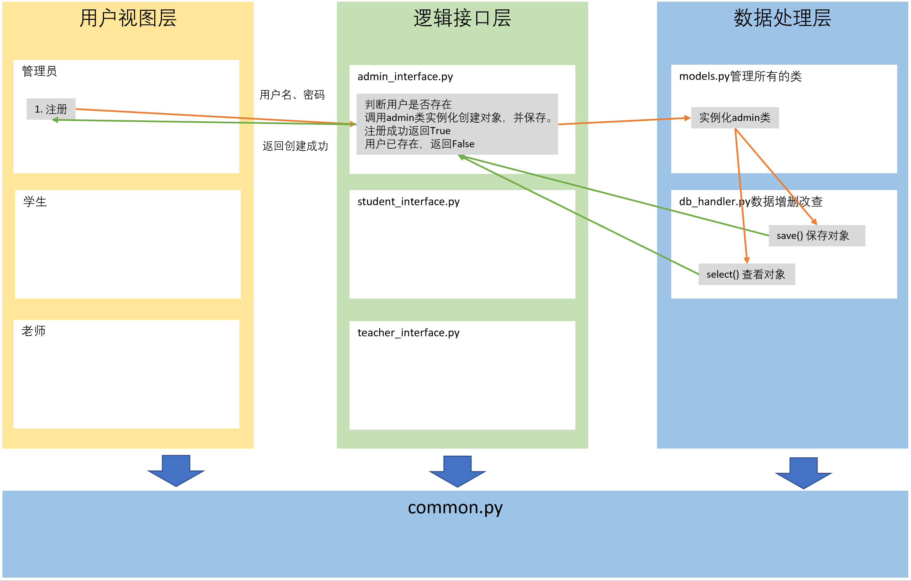

# 选课系统

## 任务需求

角色：学校、学员、课程、讲师

要求：

1. 创建北京、上海2所学校。
2. 创建Linux、Python、go三个课程，Linux和Python在北京开，go在上海开。
3. 课程包含周期、价格，通过学校创建课程。
4. 通过学校创建班级，班级关联课程、讲师。
5. 创建讲师。
5. 创建学员时，选择学校，关联班级。
6. 创建讲师角色（不需要关联学校）。
7. 提供两个角色接口。
    1. 学员视图：可以注册，交学费，选择班级。
    2. 讲师视图：讲师可以管理自己的班级，上课时选择班级，查看班级学员列表，修改所管理的学员的成绩。
    3. 管理视图：创建讲师，创建班级，创建课程。
8. 上述操作所产生的数据通过pickle保存到文件。

## 需求分析

1. 管理视图

    1. 注册
    2. 登录
    3. 创建学校
    4. 创建课程（先选择学校）
    5. 创建讲师

2. 学员视图

    1. 注册
    2. 登录功能
    3. 选择校区
    4. 选择课程（先选择校区，在选择校区中的某一门课程，选择课程即选择班级）
        * 学生选择课程，课程也选择学生
    5. 查看分数
    6. 交学费

3. 讲师视图

    1. 登录
    2. 查看教授课程
    3. 选择教授课程
    4. 查看课程下的学生
    5. 修改学生分数

## 架构设计（三层架构）

* 用户视图层
    * 用于与用户进行交互。
    * 实现简单的逻辑判断，比如注册功能中两次密码是否一致的校验。
    * core
        * src.py 主视图
        * admin.py: 管理视图
        * student.py: 学员视图
        * teacher.py: 讲师视图
* 逻辑接口层
    * 核心业务逻辑的处理
    * interface
        * admin_interface.py
        * studeng_interface.py
        * teacher_interface.py
* 数据处理层
    * 数据处理，比如增删改查。
    * db
        * models.py
        * db_handler.py
            * pickle保存对象
            * object --> pickle

## 文件结构：

    /--conf/
    |    |--settings.py
    |
    |--core/
    |    |--src.py
    |    |--admin.py
    |    |--student.py
    |    |--teacher.py
    |
    |--db/
    |    |--models.py
    |    |--db_handler.py
    |        |--pickle
    |
    |--interface/
    |    |--admin_interface.py
    |    |--student_interface.py
    |    |--teacher_interface.py
    |    |--common_interface.py
    |
    |--lib/
    |    |--common.py
    |
    |--start.py

## 选课系统总结

### 1.管理员

#### 1.1.注册
1. 用户再视图层输入用户名和密码，交给接口层。
2. 接口层调用数据层中的models.get()进行校验。
3. 若不存在则创建，并讲注册成功返回给视图层。

#### 1.2.登录
1. 用户在视图层输入用户名和密码，交给接口层。
2. 接口层调用数据层中的models.get()进行校验。
3. 若不存在则创建，并讲注册成功返回给视图层。

#### 1.3.创建学校
1. 让用户输入学校名和学校地址。
2. 调用管理员接口创建学校。
3. 判断学校是否存在，若存在，不创建。
4. 若不存在，则调用接口层创建学校，获取管理员对象的创建学校方法保持学校对象。
5. 将结果返回给视图层。

#### 1.4.创建课程
1. 获取所有学校，并打印，让用户选择。
2. 获取用户选择的学校与创建的课程，交给接口层。
3. 接口层调用管理员对象中的创建课程方法，保存课程对象。
4. 课程需要绑定给学校对象，最终将创建成功的结果返回给视图层。

#### 1.5.创建老师
1. 用户输入老师名称。
2. 调用接口层，接口层中设置默认密码123，调用数据层。
3. 判断老师是否存在，不存在则调用管理员对象中的创建老师方法。
4. 保存老师对象，并将结果返回给视图层。

### 2.学生

#### 2.1.注册
同上

#### 2.2.登录
同上

#### 2.3.选择学校
1. 获取所有学校，让学生选择，并将选择的学校传给接口层。
2. 接口层判断当前学生是否选择学校。
3. 若没有选择，则调用学生对象中的添加学校方法。
4. 将添加后消息返回给视图层。

#### 2.4.选择课程
1. 先获取当前学生所在学校的所有课程，并选择。
2. 接口层将选择后的课程，调用数据层的添加课程方法保存。
3. 学生对象中课程列表添加课程，设置课程分数，默认为0.
4. 最终将结果返回给视图层。

#### 2.5.查看成绩
1. 直接调用接口层。
2. 接口层调用数据层中的查看成绩方法。
3. 返回成绩给视图层并打印。

### 3.老师

#### 3.1.登录
同上

#### 3.2.查看教授课程
1. 直接调用接口层，获取老师对象下课程列表数据。
2. 若有则打印，没有则退出。

#### 3.3.选择教授课程
1. 调用接口层中的选择教授课程接口，调用数据层中改课程下所有的学生，返回给视图层。
2. 打印所有的课程，让老师选择，若老师课程中有该课程则不添加。
3. 没有，则嗲用老师对象中的添加课程方法进行添加。

#### 3.4.查看课程下的学生
1. 直接获取老师对象下所有的课程，选择课程。
2. 从老师对象中，调用查看课程下学生的方法，获取课程对象下的所有学生，返回给视图层。
3. 视图层打印该课程下所有的学生。

#### 3.5.修改学生分数
1. 直接获取老师对象下所有的课程。
2. 从老师对象中，调用查看课程下学生方法，获取课程对象下所有的学生，返回给视图层。
3. 视图层打印改课程下所有的学生，并让用户选择需要分数的学生。
4. 嗲用老师修改分数接口，获取老师对象，调用对象中修改分数方法。
5. 获取学生对象中的分数字典，进行修改。

#### 3.4.查看成绩

