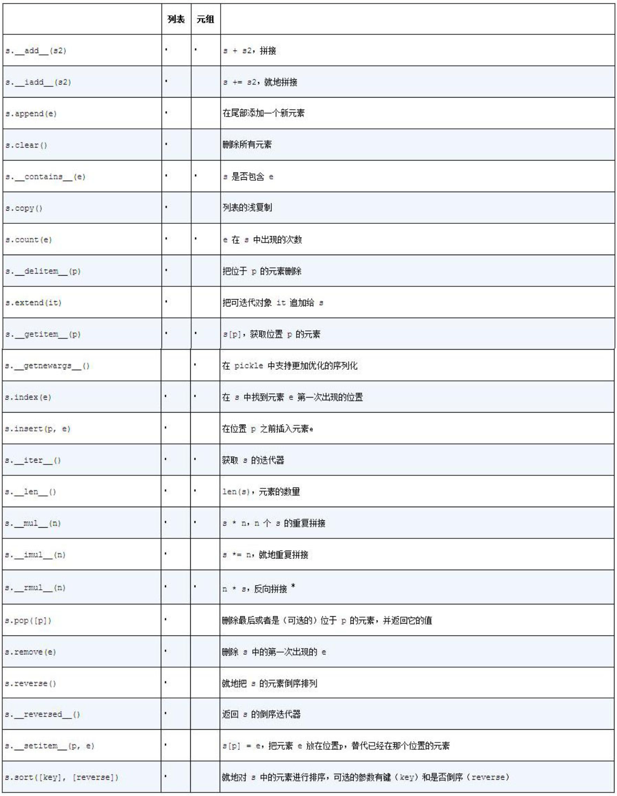

# Python语言基础

## 1. Python数据类型（6个）
* 数值型（number）：表示数据组成为数字
  * 整型（int）
    * 十进制
    * 八进制
    * 十六进制
  * 浮点型（float）
  * 布尔型（bool）
  * 复数性（complex）
* 字符型（string）：表示数据组成是字符
* 列表（list）：用来表示一组有序元素，后期数据可以修改  ['A','B','C']
* 元组（tuple）：用来表示一组有序元素，后期数据不可修改  ('A','B','C','1')
* 集合（set）：一组数据无序不重复元素  set([1,2,3,4])
* 字典（dictionary）：用键值对的形式保存一组元素  {'A':7,'B':1,'C':9}


可迭代对象（Iterable）
> An object capable of returning its members one at a time. Examples of iterables include all sequence types (such as list, str, and tuple) and some non-sequence types like dict, file objects, and objects of any classes you define with an iter() method or with a getitem() method that implements Sequence semantics.

序列（Sequence）
> An iterable which supports efficient element access using integer indices via the getitem() special method and defines a len() method that returns the length of the sequence. Some built-in sequence types are list, str, tuple, and bytes. Note that dict also supports getitem() and len(), but is considered a mapping rather than a sequence because the lookups use arbitrary immutable keys rather than integers.

迭代器（Iterator）
> An object representing a stream of data. Repeated calls to the iterator’s next() method (or passing it to the built-in function next()) return successive items in the stream. When no more data are available a StopIteration exception is raised instead. At this point, the iterator object is exhausted and any further calls to its next() method just raise StopIteration again. Iterators are required to have an iter() method that returns the iterator object itself so every iterator is also iterable and may be used in most places where other iterables are accepted. One notable exception is code which attempts multiple iteration passes. A container object (such as a list) produces a fresh new iterator each time you pass it to the iter() function or use it in a for loop. Attempting this with an iterator will just return the same exhausted iterator object used in the previous iteration pass, making it appear like an empty container.


可变数据（immutable）：

列表（list），字典（dictionary），集合（set）。

不可变数据（immutable）：

数字（number），字符（string），元组（tuple）。

可迭代（iterable）：

字符（string），元组（tuple），列表（list），字典（dictionary），集合（set）


序列：

* 有序序列：字符（string），元组（tuple），列表（list）
* 无序序列：字典（dictionary），集合（set）


### 1.1 数值型（number）

例子：

```
a, b, c, d = 20, 5.5, True, 4+3j

print(a, b, c, d)
# 20 5.5 True (4+3j)

print(type(a), type(b), type(c), type(d))
# <class 'int'> <class 'float'> <class 'bool'> <class 'complex'>
```

Python也可以这样赋值：

```
a = b = c = d = 1
print(a, b, c, d)
# 1 1 1 1
```

进制转换：

```
a = -15
print(f'{a}对应的十进制是{a}, 二进制是{a:b}, 八进制是{a:o}, 十六进制是{a:x}')
```


### 1.2 字符型（string）

单引号：内容中包含大量双引号

双引号：内容中包含大量单引号

三引号：内容中同时包含单双引号，三个单引号比较好。

```
a = 'string is "special"'

b = "string's value"

c = '''string's value is 
"special"'''

d = """string's 
context
"""
```

#### 字符串常用方法

* 字符串切片

```
s = 'Python is very good'

print(s[2:4])
# th
print(s[5])
# n
print(s[-1])
# d
print(s[-3:-1])
# oo

# 非迭代型，不可修改
s[3] = 'b'
# Traceback (most recent call last):
#   File "<stdin>", line 1, in <module>
# TypeError: 'str' object does not support item assignment
```

* 字符串合并

```
print(s + '!!!')
# Python is very good!!!
```

* replace( a,b 将字符串中的 a 替换成 b

```
print(s.replace('is', 'we'))
# Python we very good
```

* find(str) : 返回 str 出现的索引位置，如果找不到该值，则 find() 方法将返回 -1。

```
print(s.find('a'))
# -1

print(s.find('s'))
# 8
```

* str.index(a): 查找指定值的首次出现。如果找不到该值，index() 方法将引发异常。

```
print(s.index('s'))
# 8

print(s.index('a'))
# Traceback (most recent call last):
#   File "<stdin>", line 1, in <module>
# ValueError: substring not found
```

* str.count(a): 统计字符串中 a 出现的次数

```
print(s.count('a'))
# 0
print(s.count('o'))
# 3
```

* split: 对字符串进行分割。如果参数 num 有指定值，则分隔 num+1 个子字符串。

```
# 按空格分割
print(s.split(' '))
# ['Python', 'is', 'very', 'good']

# 按空格分割成2个子字符串
print(s.split(' ', 1))
# ['Python', 'is very good']
```

* strip: 移除字符串首尾指定的字符 默认为空格。该方法只能删除开头或是结尾的字符，不能删除中间部分的字符。

```
print(s)
# Python is very good

# 移除末尾字符d
print(s.strip('d'))
# Python is very goo
```

* endswith (str): 判断字符串是否以 str 结尾

```
print(s.endswith('d'))
# True

print(s.endswith('a'))
# False
```

* startswith (str): 判断字符串是否以 str 开头

```
print(s.startswith('p'))
# False

print(s.startswith('P'))
# True
```

* isdigit ：判断字符串是否全为数字

```
d = '+86-123'

print(d.isdigit())
# False

d = '86123'
print(d.isdigit())
# True
```

* isalpha ：判断字符串是否全为字母

```
b = 'Ab?'

print(b.isalpha())
# False

c = 'Ab'
print()c.isalpha()
# True
```

#### 转义字符

使用反斜杠\表示转义字符。反斜杠前面加r代表原始字符。

```
a = 'str\ning'
print(a)
# str
# ing

a = r'str\ning'
print(a)
# str\ning
```

转义符     |  描述
----------|------------------
\在行尾    | 续行符
\\\\      | 反斜杠符号\\
\\'       | 单引号
\\b       | 退格(Backspace) 
\\000     | 空
\\n       | 换行
\\v       | 纵向制表符
\\t       | 横向制表符
\\r       | 回车，将 \r 后面的内容移到字符串开头，并逐一替换开头部分的字符，直至将 \r 后面的内容完全替换完成。
\yyy      | 八进制数，y 代表 0~7 的字符
\xyy      | 十六进制数，以 \x 开头，y 代表的字符


#### 可迭代性

字符串是可迭代的。索引值从0开始，-1代表从末尾开始。索引区间是左闭右开。

```
a = 'string is "special"'
print(a[2:4])
'ri'
print(a[-4:-1])
# ial
```

#### f-string

f-string是Python3.6推出的新功能。看下面的例子，对比传统表示方法和f-string的方法。

```
age = 32
name = 'Tom'
fstring = f'My name is {name} and I am {age} years old.'
print(fstring)
# My name is Tom and I am 32 years old.
```

在f-string中使用表达式。

```
height = 2
base = 3
fstring = f'The area of the triangle is {base*height/2}.'
print(fstring)
# The area of the triangle is 3.0.
```

通过f-string对字典进行操作。

```
person1 = {
    'name': 'Tom',
    'age': 20,
    'gender': 'male'
}

person2 = {
    'name': 'Jerry',
    'age': 20,
    'gender': 'female'
}

# 读取字典
fstring = f'{person1.get("name")} is {person1.get("age")} and is {person1.get("ender")}'
print(fstring)
# Tom is 20 and is None

# 遍历字典
people = [person1, person2]

for person in people:
    fstring = f'{person.get("name")} is {person.get("age")} and is {person.get("ender")}'
    print(fstring)

# Tom is 20 and is None
# Jerry is 20 and is None
```

在f-string中使用条件。

```
person1 = {
    'name': 'Tom',
    'age': 20,
    'gender': 'male'
}

person2 = {
    'name': 'Jerry',
    'age': 20,
    'gender': 'female'
}

people = [person1, person2]

for person in people:
    fstring = f'{"She" if person.get("gender") == "female" else "He"} is watching TV.'
    print(fstring)

# He is watching TV.
# She is watching TV.
```

使用f-string格式化输出。

* 左对齐：<
* 右对齐：> 
* 居中对齐：^

```
print(f'{"apple": >30}')
print(f'{"apple": ^30}')
print(f'{"apple": <30}')
#                          apple
#             apple             
# apple
```

使用f-string格式化数字。

```
number = 0.9124325345

# 百分比
fstring = f'Percentage format for number with two decimal places: {number:.2%}'
print(fstring)
# Percentage format for number with two decimal places: 91.24%

# 保留小数点后3位
fstring = f'Fixed point format for number with three decimal places: {number:.3f}'
print(fstring)
# Fixed point format for number with three decimal places: 0.912

# 科学计数法表示
fstring = f'Exponent format for number: {number:e}'
print(fstring)
# Exponent format for number: 9.124325e-01

# 带货币符号
number = 123456.78921
fstring = f'Currency format for number with two decimal places: ${number:.2f}'
print(fstring)
# Currency format for number with two decimal places: $123456.79

# 带货币符号和千分位
number = 123456.78921
fstring = f'Currency format for number with two decimal places and comma seperators: ${number:,.2f}'
print(fstring)
# Currency format for number with two decimal places and comma seperators: $123,456.79

# 输出数值带正负符合
numbers = [1, -3, 5]

for number in numbers:
    fstring = f'The number is {number:+}'
    print(fstring)

# The number is +1
# The number is -3
# The number is +5


# Debug调试
number = 2
print(f'{number = }')
# number = 2
```


### 1.3 列表（list）

列表是 Python 内置的一种数据结构，是一种有序的集合，用来存储一连串元素的容器。列表中元素类型可以不相同，它支持数字、字符串等。

列表的每个值都有对应的索引值，索引值从0开始。

列表切片：

使用切片符号可以对大多数序列类型选取其子集。

起始位置start的索引是包含的，而结束位置stop的索引并不包含（左闭右开）。

步进值step可以在第二个冒号后面使用，意思是每隔多少个数取一个值 。

```
color = ['red', 'green', 'blue', 'yellow', 'white', 'black']

# 从0开始统计，读取第1，2位
print(color[1: 3])
# ['green', 'blue']

# 从0开始统计，读取从第1位到倒数第3位
print(color[1: -2])
# ['green', 'blue', 'yellow']

# 从0开始统计，读取从倒数第4位到倒数第3位
print(color[-4: -2])
# ['blue', 'yellow']

# 如果写成下面这样，则无输出。
print(color[-2: -4])
# []

print(color[::2])
# ['red', 'blue', 'white']
```

列表常用方法：

方法名称     |   作用
------------|-----------------------
a.index()   | 返回a中首个匹配项的位置 
a.pop()     | 删除指定位置的元素 
a.insert()  | 向指定位置插入元素
a.reverse() | 反向排序 
a.append()  | 向末尾添加元素
a.sort()    | 对列表进行排序 
a.remove()  | 删除首个匹配项的元素 
a.extend()  | 将一个列表扩展至另一个列表
a.count()   | 统计某个元素出现的次数

创建列表list

```
a = [1, 2, 3, 4, 5]

print(a)
# [1, 2, 3, 4, 5]

b = list('12345')

print(b)
# ['1', '2', '3', '4', '5']

c = list(12345)
# Traceback (most recent call last):
#   File "<stdin>", line 1, in <module>
# TypeError: 'int' object is not iterable
```

列表切片（从0开始，左闭右开）：

```
print(a[2:3])
# [3]

print(a[:3])
# [1, 2, 3]

print(a[::-1])
# [5, 4, 3, 2, 1]

print(a[::])
# [1, 2, 3, 4, 5]

print(a[::1])
[1, 2, 3, 4, 5]
```

列表是可修改的：

```
print(a[1])
# 2

a[1] = 'one'

print(a)
@ [1, 'one', 3, 4, 5]
```

列表追加和插入。insert与append相比，计算代价更高。因为子序列元素需要在内部移动为新元素提供空间。

```
a.append(6)  # 注意，直接修改原列表，不是创建副本。

print(a)
# [1, 'one', 3, 4, 5, 6]

a.extend([7, 8, 9])

print(a)
# [1, 'one', 3, 4, 5, 6, 7, 8, 9]

a.insert(0, 'Italy')

print(a)
# ['Italy', 1, 3, 5, 6, 7, 8]
```

列表删除元素，默认删除最后一个。insert的反操作是pop。

```
a.pop()
# 9

print(a)
# [1, 'one', 3, 4, 5, 6, 7, 8]

a.pop(3)
# 4

print(a)
# [1, 'one', 3, 5, 6, 7, 8]
```

删除列表中某个元素。

```
print(a[1])
# one

del a[1]

print(a)
[1, 3, 5, 6, 7, 8]
```

删除列表中某个元素。remove方法会定位第一个符合要求的值并移除

```
a.remove('Italy')

print(a)
# [1, 3, 5, 6, 7, 8]
```

统计某个元素出现的次数。

```
print(a.count(1))
# 1
```

返回列表中匹配项的索引位置。匹配不到抛出异常。

```
print(a.index(2))
# Traceback (most recent call last):
#   File "<stdin>", line 1, in <module>
# ValueError: 2 is not in list

print(a.index(3))
# 1
```

判断元素是否存在于列表。

```
print(3 in a)
# True

print('3' in a)
# False
```

反向输出列表。

```
a.reverse()

print(a)
# [8, 7, 6, 5, 3, 1]
```

取列表中最大值、最小值。

```
print(min(a))
# 1

print(max(a))
# 78
```

计算列表长度。

```
print(len(a))
# 6
```

列表扩展：

```
a = [1, 2, 3]
b = [4, 5, 6]

print(a + b)
# [1, 2, 3, 4, 5, 6]

a.extend(b)  # a列表被修改
print(a)
# [1, 2, 3, 4, 5, 6]

print(b)
# [4, 5, 6]
```

使用extend添加元素比使用加号（+）连接效率更高。因为使用加号（+）连接过程中创建了新列表，并且还要复制对象。

```
a_list = [4, None, 'foo']
b_list = [7, 8, (2, 3)]
print(a_list + b_list)  # [4, None, 'foo', 7, 8, (2, 3)]  使用+号连接
a_list.extend(b_list)
print(a_list)  # [4, None, 'foo', 7, 8, (2, 3)]
```

列表复制

```
c = list('Python')

print(a + c)
# [1, 2, 3, 4, 5, 6, 'P', 'y', 't', 'h', 'o', 'n']

print(a * 3)
# [1, 2, 3, 4, 5, 6, 1, 2, 3, 4, 5, 6, 1, 2, 3, 4, 5, 6]
```

双端队列，collections.deque，可以满足列表头尾部都增加的要求。

```
from collections import deque

d = deque([1, 2, 3])
d.extendleft(['a', 'b', 'c'])  # 注意插入顺序
print(d)  # deque(['c', 'b', 'a', 1, 2, 3])
print(len(d))  # 6
print(d[-2])  # 2
print(d.count('a'))  # 1
print(d.index('a'))  # 2
d.insert(0, 1)  # 第0位插入数字1
print(d)  # deque([1, 'c', 'b', 'a', 1, 2, 3])
d.rotate(2)  # 把右边2个元素放到左边，注意顺序，和extendleft不一样
print(d)  # deque([2, 3, 1, 'c', 'b', 'a', 1])
d.rotate(-2)
print(d)  # deque([1, 'c', 'b', 'a', 1, 2, 3])
```

列表排序。排序对列表元素的数据类型是有要求的

```
a_list = [4, None, 'foo', 7, 8, (2, 3)]
a_list.sort() 
# Traceback (most recent call last):
#   File "<stdin>", line 1, in <module>
# TypeError: '<' not supported between instances of 'NoneType' and 'int'

b_list = [7, 8, (2, 3)]
b_list.sort()
# Traceback (most recent call last):
#   File "<stdin>", line 1, in <module>
# TypeError: '<' not supported between instances of 'tuple' and 'int'

a_list = [7, 2, 5, 1, 3]
a_list.sort()  # 按数值大小排序
print(a_list)  # [1, 2, 3, 5, 7]

b_list = ['saw', 'small', 'He', 'foxes', 'six']
b_list.sort(key=len)  # 通过字符串的长度进行排序
print(b_list)  # ['He', 'saw', 'six', 'small', 'foxes']
```

列表二分搜索和已排序列表的维护

* bisect 返回要插入元素在列表中的下标。假定列表是有序的。
* bisect_left 与 bisect 类似，只不过其默认将元素插到左边，所以返回的是插入到左边的下标
* bisect_right与 bisect_left 相反。

以上方法若列表无序，那么会返回插入到列表最后一个合适的位置。

insort 会在列表中插入元素到正确位置，假定列表有序。如果列表无序，那么会返回空。默认插入到右边。

insort_left 和insort_right 类似。

```
import bisect

c = [1, 2, 3, 4, 7]
print(bisect.bisect(c, 2))  # 2 bisect会找到第一个2,并把新的2插入它后面

bisect.insort(c, 2)  # [1, 2, 2, 3, 4, 7]
print(bisect.bisect(c, 5))  # 5 bisect会找到第一个4,并把新的5插入它后面

bisect.insort(c, 5)
print(bisect.bisect(c, 6))  # 6 bisect会找到第一个5,并把新的6插入它后面

bisect.insort(c, 6)
print(c)  # [1, 2, 2, 3, 4, 5, 6, 7]
```


### 1.4 字典（dictionary）

字典(dict)是使用键-值（key-value）存储，键是不可变对象，且不允许重复。

dict（字典）更为常用的名字是哈希表或者是关联数组。 字典是拥有灵活尺寸的键值对集合，不是通过位置进行索引，其中键和值都是Python对象。用大括号{}是创建字典的一种方式，在字典中用逗号将键值对分隔。

**字典常用方法**

方法名称     |   作用
------------|-----------------------
a.items()   | 返回a中所有键值对 
a.values()  | 返回a中所有值
a.keys()    | 返回a中所有键
a.get()     | 通过键来查值，返回对应的值
a.clear()   | 清空字典a的值
a.setdefault| 通过键值来查找值，找不到则插入
a.update()  | 键和值更新到新的字典
a.pop()     | 删除指定位置的元素 


生成一个字典

```
dict_a = {'name': 'Ming', 'id': 1001, 'age': 35}

print(type(dict_a))
# <class 'dict'>

dict_b = dict(city='Shanghai', strict='Xuhui', zip='200000')

print(type(dict_b))
# <class 'dict'>
```

通过键查询值，查询不到抛出异常

```
print(dict_a['name'])
# Ming

print(dict_a['Name'])
# Traceback (most recent call last):
#   File "<stdin>", line 1, in <module>
# KeyError: 'Name'
```

插入新的键值对

```
dict_a['city'] = 'Chengdu'

print(dict_a)
# {'name': 'Ming', 'id': 1001, 'city': 'Chengdu'}
``` 

删除某个键值对。pop方法会在删除的同时返回被删的值，并删除键。

``` 
dict_a.pop('city')
# Chengdu

print(dict_a)
# {'name': 'Ming', 'id': 1001}
``` 

另一种方式删除某个键值对 

```
del dict_a['age']
# Traceback (most recent call last):
#   File "<stdin>", line 1, in <module>
# KeyError: 'age'

del dict_a['id']

print(dict_a)
# {'name': 'Ming'}
```

判断键是否存在

```
dict_a[23] = 'Hello World'

print(dict_a)
# {'name': 'Ming', 23: 'Hello World'}

print(23 in dict_a)
# True

print(35 in dict_a)
# False
``` 

通过键查询值的另一种方式，查询不到不抛异常

```
dict_a.get('hai')

dict_a.get('hai', 1)
# 1

dict_a.get('name', 1)
# Ming

dict_a['hai']
# Traceback (most recent call last):
#   File "<stdin>", line 1, in <module>
# KeyError: 'hai'
```

通过键查询值的另一种方式，查询不到则添加

```
dict_a.setdefault('name')
# Ming

dict_a.setdefault('hai', 1)
# 1

print(dict_a)
# {'name': 'Ming', 23: 'Hello World', 'hai': 1}

dict_a.setdefault('go')
print(dict_a)
# {'name': 'Ming', 23: 'Hello World', 'hai': 1, 'go': None}
``` 

读取字典所有键值对，返回的是列表形式

```
print(dict_a.items())
# dict_items([('name', 'Ming'), (23, 'Hello World'), ('hai', 1), ('go', None)])
```

读取字典的键

```
print(dict_a.keys())
# dict_keys(['name', 23, 'hai', 'go'])
```

读取字典的值

```
print(dict_a.values())
# dict_values(['Ming', 'Hello World', 1, None])
```

将字典值转化成列表

```
print(list(dict_a.values()))
# ['Ming', 'Hello World', 1, None]

for key in dict_a.keys():
    print(dict_a[key])
 
# Ming
# Hello World
# 1
# None
```

清空字典

```
dict_a.clear()

print(dict_a)
# {}

print(len(dict_a))
# 0
``` 

对于任何原字典中已经存在的键，如果传给update方法的数据也含有相同的键，则它的值将会被覆盖。

```
dict_a = {'name': 'Ming', 'id': 1001, 'age': 35}
dict_b = dict(city='Shanghai', id=2001, zip='200000')

dict_a.update(dict_b)

print(dict_a)
# {'name': 'Ming', 'id': 2001, 'age': 35, 'city': 'Shanghai', 'zip': '200000'}
```

**从列表生成字典**

字典本质上是2-元组（含有2个元素的元组）的集合，字典是可以接受一个2-元组的列表作为参数的。

```
# 方法1
mapping = {}
key_list = list(range(5))
value_list = list(reversed(range(5)))

for key, value in zip(key_list, value_list):
    mapping[key] = value

print(mapping)  
# {0: 4, 1: 3, 2: 2, 3: 1, 4: 0}

# 方法2。
mapping = {}
key_list = list(range(5))
value_list = list(reversed(range(5)))

mapping = dict(zip(key_list, value_list))  
print(mapping)  # {0: 4, 1: 3, 2: 2, 3: 1, 4: 0}
```

**字典默认值**

下面的例子，实现了将一个单词组成的列表，转换成单词首字母和单词为键值对的字典。

先用传统方法实现，再用字典的setdefault方法进行改写。

```
words = ['apple', 'bat', 'bar', 'atom', 'book']

by_letter = {}

for word in words:
    letter = word[0]  # word[0]把列表words的每个元素列表化，并取首字母。输出的是a, b, b, a, b这5个列表元素的首字母
    if letter not in by_letter:
        # 生成第一个键值对
        print(letter)
        by_letter[letter] = [word]  # 对比[word]和word[]的用法
        print(by_letter)
        # a
        # {'a': ['apple']}
        # b
        # {'a': ['apple'], 'b': ['bat']}
    else:
        # append其他键值对
        print(letter)
        by_letter[letter].append(word)
        print(by_letter)
        # b
        # {'a': ['apple'], 'b': ['bat', 'bar']}
        # a
        # {'a': ['apple', 'atom'], 'b': ['bat', 'bar']}
        # b
        # {'a': ['apple', 'atom'], 'b': ['bat', 'bar', 'book']}

print(by_letter)  
# {'a': ['apple', 'atom'], 'b': ['bat', 'bar', 'book']}
```

用字典的setdefault方法，上述的for循环语句可以被写为。

```
words = ['apple', 'bat', 'bar', 'atom', 'book']

by_letter = {}

for word in words:
    letter = word[0]  # word[0]的输出依然是5个列表元素的首字母a, b, b, a, b
    by_letter.setdefault(letter, ['a']).append(word)  # 如果letter不在[]则通过append添加word

print(by_letter)  
# {'a': ['apple', 'atom'], 'b': ['bat', 'bar', 'book']}
```

如果改为`by_letter.setdefault(letter, ['a']).append(word)` ，则输出`by_letter`是 `{'a': ['a', 'apple', 'atom'], 'b': ['a', 'bat', 'bar', 'book']}`。

体会setdefault()的注释“Insert key with a value of default if key is not in the dictionary. Return the value for key if key is in the dictionary, else default.”

通过defaultdict类使得上述目的实现更为简单。

```
from collections import defaultdict

by_letter = defaultdict(list)  # list是内置的可变序列(Built-in mutable sequence)

print(dict(by_letter))  
# {}

for word in words:
    by_letter[word[0]].append(word)

print(by_letter)  
# defaultdict(<class 'list'>, {'a': ['apple', 'atom'], 'b': ['bat', 'bar', 'book']})

print(dict(by_letter))  
# {'a': ['apple', 'atom'], 'b': ['bat', 'bar', 'book']}
```


**有效的字典键类型**

尽管字典的值可以是任何Python对象，但键必须是不可变的对象，比如标量类型（整数、浮点数、字符串）或元组（且元组内对象也必须是不可变对象）。

通过hash函数可以检查一个对象是否可以哈希化（即是否可以用作字典的键），术语叫作哈希化。

```
print(hash('string'))  
# -4368784820203065343

print(hash((1, 2, (2, 3))))  
# -9209053662355515447

print(hash((1, 2, [2, 3])))  
# TypeError: unhashable type: 'list'

print(hash((1, 2, tuple([2, 3]))))  
# -9209053662355515447  为了将列表作为键，一种方式就是将其转换为元组
```


### 1.5 集合（set）

集合(set)是一种无序且元素唯一的序列。

和字典类似，集合的元素是不可变的。可以认为集合也像字典，但是只有键没有值。基本功能是进行成员关系测试和删除重复元素。所以集合另一个用途是去重复。

集合可以有两种创建方式：通过set()函数或者{}来创建

集合不属于序列类数据， 集合不支持通过索引访问指定元素，但可以增加和删除元素。

集合支持数学上的集合操作，例如并集、交集、差集、对称差集。

方法名称                       | 说明
------------------------------|-----------------------
add()                         | 为集合添加元素
update()	                  | 给集合添加元素
clear()                       | 移除集合中的所有元素
copy()                        | 拷贝一个集合
remove()                      | 移除指定元素
pop()	                      | 随机移除元素
discard()	                  |删除集合中指定的元素
< 或者issubset()              | 判断指定集合是否为该方法参数集合的子集
\| 或者union()                | 返回两个集合的并集
& 或者intersection()          | 返回集合的交集
intersection_update()	      | 返回集合的交集
\- 或者difference()           | 返回多个集合的差集
difference_update()	          |移除集合中的元素，该元素在指定的集合也存在
^ 或者symmetric_difference()  | 返回两个集合中不重复的元素集合(两集合除去交集部分的元素)
symmetric_difference_update() | 移除当前集合中在另外一个指定集合相同的元素，并将另外一个指定集合中不同的元素插入到当前集合中
isdisjoint()	              |判断两个集合是否包含相同的元素，如果没有返回 True，否则返回 False
issuperset()	             |判断该方法的参数集合是否为指定集合的子集

举例

```
a = {'a', 'b', 'c', 1, 2}
b = {1, 'c', 'd'}
```

并集(a和b中的所有不同元素)

```
print(a.union(b))  # {'c', 1, 2, 'd', 'a', 'b'}
print(a | b)  # {'c', 1, 2, 'd', 'a', 'b'}
```

交集(a、b中同时包含的元素)

```
print(a.intersection(b))  # {'c', 1}
print(a & b)  # {'c', 1}
```

将a的内容设置为a和b的交集

```
a = {'a', 'b', 'c', 1, 2}
b = {1, 'c', 'd'}
a.intersection_update(b)
print(a)  # {1, 'c'}
```

在a不在b的元素

```
print(a.difference(b))  # {'a', 2, 'b'}
print(a - b)  # {2, 'a', 'b'}
```

将a的内容设为在a不在b的元素

```
a = {'a', 'b', 'c', 1, 2}
b = {1, 'c', 'd'}
a.difference_update(b)
print(a)  # {2, 'b', 'a'}
a = {'a', 'b', 'c', 1, 2}
b = {1, 'c', 'd'}
a -= b
print(a)  # {2, 'a', 'b'}
```

将元素加入集合a

```
a.add(7)
print(a)  # {1, 2, 'c', 7, 'a', 'b'} 每次输出的顺序是不一样的
```

从集合a移除某个元素

```
a.remove(7)
print(a)  # {1, 2, 'c', 'a', 'b'}  如果a被清空，则报错 KeyError: 7
```

所有在a或b中，但不是同时在a、b中的元素

```
print(a.symmetric_difference(b))  # {2, 'd', 'b', 'a'}
print(a ^ b)  # {2, 'd', 'b', 'a'}
```

将a的内容设为所有在a或b中，但不是同时在a、b中的元素

```
a = {'a', 'b', 'c', 1, 2}
b = {1, 'c', 'd'}
a.symmetric_difference_update(b)
print(a)  # {'a', 2, 'd', 'b'}
a = {'a', 'b', 'c', 1, 2}
b = {1, 'c', 'd'}
a ^= b
print(a)  # {2, 'd', 'a', 'b'}
```

如果a包含于b，返回Ture

```
print(a.issubset(b))  # False
```

将a的内容设置为a和b的并集

```
print(a)  # {'a', 2, 'd', 'b'}
a = {'a', 'b', 'c', 1, 2}
a.update(b)
print(a)  # {1, 2, 'a', 'b', 'd', 'c'}
```

移除任意元素，如果集合是空的，抛出keyError

```
a.pop()  # 随机移除某个元素，没有输入变量，如果集合是空的，抛出KeyError: 'pop from an empty set'
print(a)  # {2, 1, 'd', 'b', 'a'}
```

将集合重置为空，清空所有元素

```
a.clear()
print(a)  # set()
```

集合的元素必须是不可变的，如果想要包含列表型的元素，必须先转换为元组

```
my_data1 = [1, 2, 3, 4]
my_data2 = [3, 4, 5, 6]
my_set = {tuple(my_data1), tuple(my_data2)}
print(my_set)  # {(1, 2, 3, 4), (3, 4, 5, 6)}
```


### 1.6 元组（tuple）

Python 的元组与列表类似，不同之处在于元组的元素不能修改。

元组使用小括号( )，列表使用方括号[ ]。

元组中只包含一个元素时，需要在元素后面添加逗号 ，否则括号会被当作运算符使用。

元组可以使用下标索引来访问元组中的值。

元组中的元素值是不允许修改的，但我们可以对元组进行连接组合。

元组中的元素值是不允许删除的，但我们可以使用del语句来删除整个元组。

```
# 此处括号被解析为运算符，需要在后面加上逗号才会被解释为元组
tup1 = (10)
print(type(tup1))
# <class 'int'>
tup1 = (10,)
print(type(tup1))
# <class 'tuple'>
```

创建元组最简单的办法就是用逗号分隔序列值。元组对数据类型没有一致性要求。

```
tup = 4, 5, 6
print(tup)  # (4, 5, 6)

nested_tup = (4, 5, 6), (7, 8)
print(nested_tup)  # # ((4, 5, 6), (7, 8))

tup = ('a', 'b', {'one': 1})
print(type(tup))
# <class 'tuple'>
```

使用加号（+）进行元组连接合并。

```
tup = tuple((4, None, 'fool') + (6, 0) + ('bar',))
print(tup)  # (4, None, 'fool', 6, 0, 'bar')
```

元组的不可变指的是**元组所指向的内存中的内容不可变**。

```
tup = ('h', 'e', 'l', 'l', 'o')
print(id(tup))
# 139820353350208

tup = (1, 2, 3, 4, 5)
print(id(tup))
# 139820353298896

tup[0] = 'x'
# Traceback (most recent call last):
#   File "<stdin>", line 1, in <module>
# TypeError: 'tuple' object does not support item assignment
```

将元组乘以整数，则会和列表一样，生成含有多份拷贝的元组。对象自身并没有复制，只是指向它们的引用进行了复制。

```
tup = tuple(('fool', 'bar') * 4)
print(tup)  # ('fool', 'bar', 'fool', 'bar', 'fool', 'bar', 'fool', 'bar')
```

如果元组中的一个对象是可变的，例如列表，你可以在它内部进行修改

```
tup = tuple(['foo', [4, 5, 6], True])
tup[1].append(0)
print(tup)  # ('foo', [4, 5, 6, 0], True)
tup[1].append([9])
print(tup)  # ('foo', [4, 5, 6, 0, [9]], True)
```

使用tuple函数将任意序列或迭代器转换为元组

```
tup = tuple([4, 5, 6])
print(tup)  # (4, 5, 6)
tup = tuple('string')
print(tup)  # ('s', 't', 'r', 'i', 'n', 'g')
print(tup[2])  # r  # 元组的元素可以通过中括号[]来获取
```


如果要将元组型的表达式赋值给变量，Python会对等号右边的值进行[拆包](./ch03.md)

```
tup = (9, 5, (8, 7))
a, b, c = tup
print(a)  # 9
print(b)  # 5
print(c)  # (8, 7)
a, b, (c, d) = tup
print(a)  # 9
print(b)  # 5
print(c)  # 8
print(d)  # 7

tup = (9, 5, (8, 7))
a, b, c = tup
c, a = a, c  # 利用拆包实现交换
print(a)  # (8, 7)
print(b)  # 5
print(c)  # 9
```

利用拆包实现遍历元组或列表组成的序列

```
seq = [(1, 2, 3), (4, 5, 6), (7, 8, 9)]
for a, b, c in seq:
    print('a={0}, b={0}, c={0}'.format(a, b, c))  # 列表每个元素的取值顺序
    # a=1, b=1, c=1
    # a=4, b=4, c=4
    # a=7, b=7, c=7
    print('a={0}, b={1}, c={2}'.format(a, b, c))
    # a=1, b=2, c=3
    # a=4, b=5, c=6
    # a=7, b=8, c=9
    print('a={2}, b={0}, c={1}'.format(a, b, c))
    # a=3, b=1, c=2
    # a=6, b=4, c=5
    # a=9, b=7, c=8
```

元组拆包功能还包括特殊的语法*rest。很多Python编程者会使用下划线（_）来表示不想要的变量 

```
values = 1, 2, 3, 4, 5
a, b, *rest = values
print(a)  # 1
print(b)  # 2
print(*rest)  # 3 4 5
a, b, *_ = values
print(*_)  # 3 4 5
```


**具名元组**

`collections.namedtuple`是一个工厂函数，它可以用来构建一个带字段名的元组和一个有名字的类。
用namedtuple构建的类的实例所消耗的内存跟元组是一样的，因为字段名都被存在对应的类里面。

创建一个具名元组需要两个参数，一个是类名(`City`)，另一个是类的各个字段的名字(`'name country population coordinates'`)。后者可以是由数个字符串组成的可迭代对象，或者是由空格分隔开的字段名组成的字符串。

存放在对应字段里的数据要以一串参数的形式传入到构造函数中（注意，元组的构造函数却只接受单一的可迭代对象）。

具名元组还有一些自己专有的属性。下面展示了几个最有用的：`_fields`类属性、类方法`_make(iterable)`和实例方法`_asdict()`。

`_fields`属性是一个包含这个类所有字段名称的元组。

用`_make()`通过接受一个可迭代对象来生成这个类的一个实例，它的作用跟`City(*delhi_data)`是一样的。

`_asdict()`把具名元组以`collections.OrderedDict`的形式返回，我们可以利用它来把元组里的信息友好地呈现出来。

```
from collections import namedtuple

City = namedtuple('City', 'name country population coordinates')

tokyo = City('Tokyo', 'JP', 36.933, (35.689722, 139691667))

print(tokyo)
# City(name='Tokyo', country='JP', population=36.933, coordinates=(35.689722, 139691667))

print(tokyo.population)
# 36.933

print(tokyo[3])
# (35.689722, 139691667)

print(City._fields)
# ('name', 'country', 'population', 'coordinates')


LatLong = namedtuple('LatLong', 'lat long')
delhi_data = ('Delhi NCR', 'IN', 21.935, LatLong(28.613899, 77.208889))
delhi = City._make(delhi_data)

print(delhi)
# City(name='Delhi NCR', country='IN', population=21.935, coordinates=LatLong(lat=28.613899, long=77.208889))

print(delhi._asdict())
# OrderedDict([('name', 'Delhi NCR'), ('country', 'IN'), ('population', 21.935), ('coordinates', LatLong(lat=28.613899, long=77.208889))])

for key, value in delhi._asdict().items():
    print(key + ':', value)

# name: Delhi NCR
# country: IN
# population: 21.935
# coordinates: LatLong(lat=28.613899, long=77.208889)
```

元组还有第二重功能：作为不可变列表的元组。

下面是列表或元组的方法和属性对比。除了跟增减元素相关的方法之外，元组支持列表的其他所有方法。还有一个例外，元组没有__reversed__方法。




## 2. 动态引用、强类型

星号 * 的参数会以元组(tuple)的形式导入，存放所有未命名的变量参数

```
def printinfo(arg1, *vartuple):
    print("输出任何传入的参数: ")
    print(arg1)
    print(vartuple)

    for var in vartuple:
        print(var)
    return

printinfo(10)
# 10
# ()

printinfo(70, 60, 50)
# 70
# (60, 50)
# 60
# 50
```

两个星号 ** 的参数会以字典的形式导入

```
def printinfo(arg1, **vardict):
    print("输出任何传入的参数: ")
    print(arg1)
    print(vardict)

printinfo(1, a=2, b=3)
# 1
# {'a': 2, 'b': 3}  字典格式输出
```

Python中的对象引用并不涉及类型。变量对于对象来说只是特定命名空间中的名称；类型信息是存储在对象自身之中。

```
a = 5
print(type(a))  
# <class 'int'>

a = 'foo'
print(type(a))  
# <class 'str'>
```

Python是强类型语言，所有的对象都拥有一个指定的类型（或类），隐式的转换只在某些特定、明显的情况下发生。

```
a = 4.5
b = 2
print('a is {0}, b is {1}'.format(type(a), type(b)))  
# a is <class 'float'>, b is <class 'int'> 字串格式化，用于后续访问

print(a / b)  
# 2.25
```

使用isinstance函数来检查一个对象是否是特定类型的实例。isinstance接受一个包含类型的元组，可以检查对象的类型是否在元组中的类型中。

```
a = 5
b = 4.5
c = 'foo'
print(isinstance(a, int))  
# True
print(isinstance(b, str))  
# False
print(isinstance(c, (str, int)))  
# True
print(isinstance(c, (float, int)))  
# False
```

属性和方法也可以通过getattr函数获得。在其他的语言中，通过变量名访问对象通常被称为“反射”。

```
b = 'foo'
print(getattr(b, 'split'))  
# <built-in method split of str object at 0x7f1d603ba430>
```

## 3. 二元运算符和比较运算

检查两个引用是否指向同一个对象，可以使用is关键字。

is和is not的常用之处是检查一个变量是否为None，因为None只有一个实例。

```
a = [1, 2, 3]
b = a
c = list(a)  # list函数总是创建一个新的Python列表（即一份拷贝）

print(a is b)  
# True

print(a is not c)  
# True 

print(a == c)  
# True

d = None
print(d is None)  
# True   
```

Python中的大部分对象，例如列表、字典、NumPy数组都是可变对象，大多数用户定义的类型（类）也是可变的。

可变对象中包含的对象和值是可以被修改的。还有其他一些对象是不可变的，比如字符串、元组。

```
a_list = ['foo', 2, [4, 5]]  # 列表
a_list[2] = (3, 4)

print(a_list)  # ['foo', 2, (3, 4)]
a_tuple = (3, 5, (4, 5))  # 元组

a_tuple[1] = 'four'  
# TypeError: 'tuple' object does not support item assignment 不可被修改

print(a_tuple)  
# (3, 5, (4, 5))
```

## 4. 标量类型 

Python标量类型：None, str, bytes, float, bool, int

数值类型。

基础的Python数字类型就是int和float。int可以存储任意大小数字。浮点数在Python中用float表示，每一个浮点数都是双精度64位数值。

```
ival = 17338971
print(ival ** 6)  
# 27173145946003847721495630081806010734757321

fval = 17338971.0
print(fval ** 6)  
# 2.7173145946003847e+43

print(3 / 2)  
# 1.5
print(3 // 2)  
# 1
```

字符串。

Python的字符串是不可变的。

```
a = 5.6
s = str(a)

print(s)  
# 5.6

b = 'python'
print(list(b))  
# ['p', 'y', 't', 'h', 'o', 'n']

print(b[2])  
# t

b[2] = 'f'  
# TypeError: 'str' object does not support item assignment 字符串是不可变的
```

反斜杠符号\是一种转义符号，它用来指明特殊符号。

如果你有一个不含特殊符号但含有大量反斜杠的字符串时，可以在字符串前面加一个前缀符号r，表明这些字符是原生字符，r是raw的简写，表示原生的。

```
x = '12\\34'
y = r'this\has\no\special\characters'
print(x)  # 12\34
print(y)  # this\has\no\special\characters
```

字符串格式化
{0:.2f}表示将第一个参数格式化为2位小数的浮点数
{1:s}表示将第二个参数格式化为字符串
{2:d}表示将第三个参数格式化整数
参考Python官方文档 https://docs.python.org/3.6/library/string.html
```
template = '{0:.2f} {1:s} are worth US${2:d}'
print(template.format(4.5560, 'Argentine Pesos', 1))  # 4.56 Argentine Pesos are worth US$1
```

日期和时间

```
from datetime import datetime, date, time

dt = datetime(2011, 10, 29, 20, 30, 21)

print(dt.day)  
# 29
print(dt.minute)  
# 30
print(dt.date())  
# 2011-10-29
print(dt.time())  
# 20:30:21
print(dt.replace(minute=0, second=0))  
# 2011-10-29 20:00:00  将分钟、秒替换为0
print(datetime.strptime('20091021', '%Y%m%d'))  
# 2009-10-21 00:00:00 字符串可以通过 strptime 函数转换为datetime对象

dt2 = datetime(2011, 11, 15, 22, 30)
delta = dt2 - dt
print(delta)  
# 17 days, 1:59:39
print(dt + delta)  
# 2011-11-15 22:30:00
```

range函数返回一个迭代器，该迭代器生成一个等差整数序列。

```
print(range(10))  
# range(0, 10)

print(list(range(10)))  
# [0, 1, 2, 3, 4, 5, 6, 7, 8, 9]

print(list(range(0, 20, 2)))  
# [0, 2, 4, 6, 8, 10, 12, 14, 16, 18]
```

## 5. 三元表达式

value = true-expr if condition else false-expr

```
x = 5
print('non-negative' if x >= 0 else 'negative')  # non-negative
```