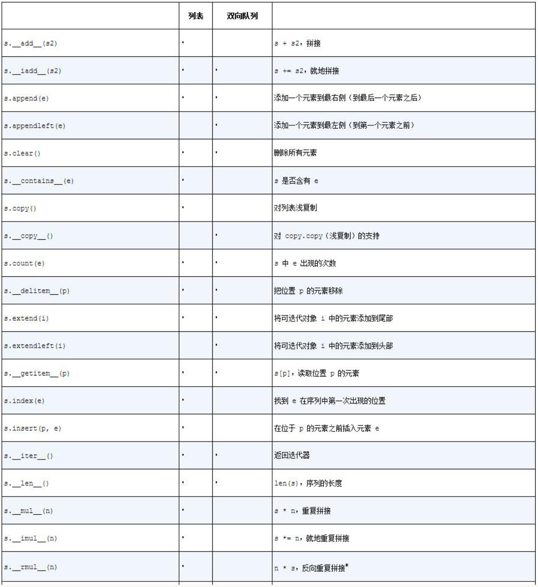
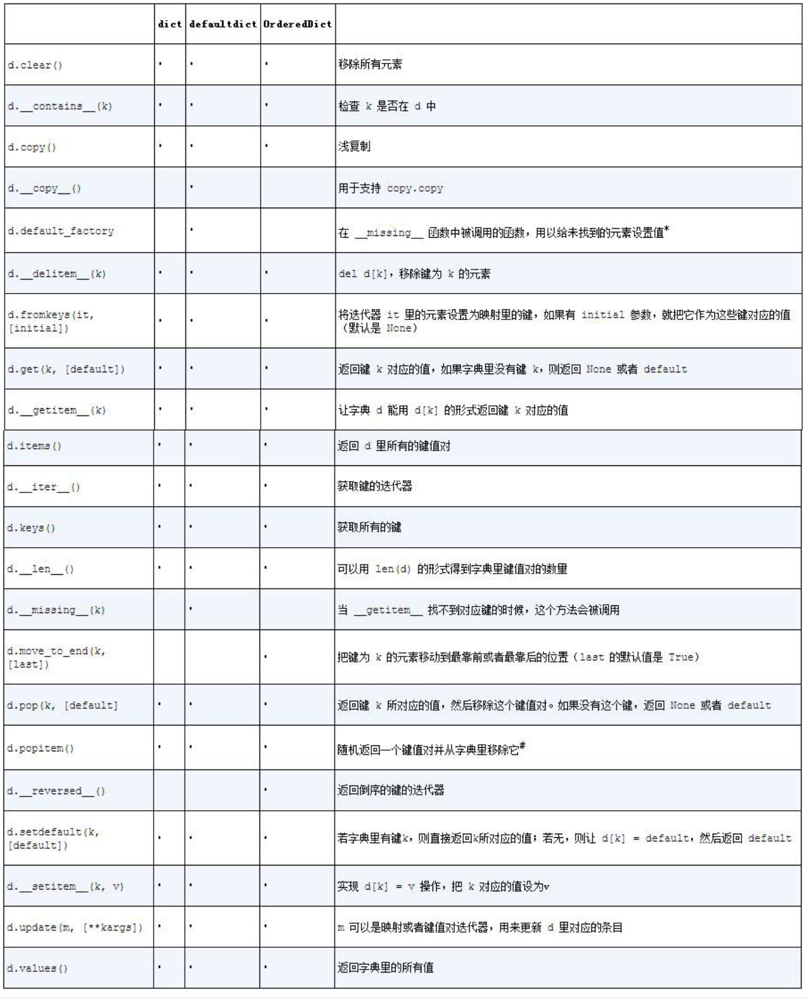
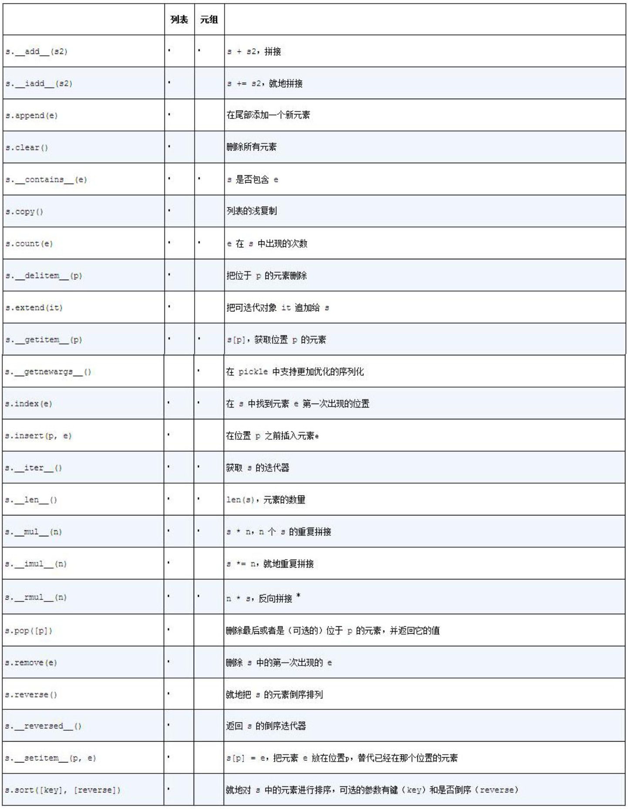
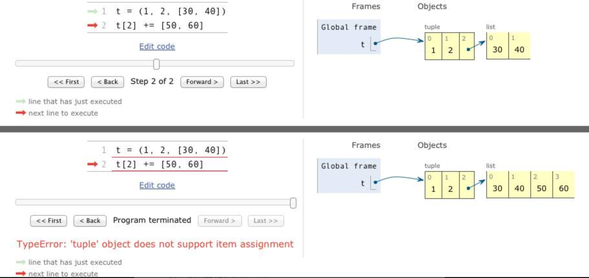

# 语言基础

## 1. Python数据类型

六个Python数据类型：

* 数值型（number）：表示数据组成为数字
  * 整型（int）：十进制、八进制、十六进制
  * 浮点型（float）
  * 布尔型（bool）
  * 复数性（complex）
* 字符型（string）：表示数据组成是字符
* 列表（list）：用来表示一组有序元素，后期数据可以修改  `['A','B','C']`
* 元组（tuple）：用来表示一组有序元素，后期数据不可修改  `('A','B','C','1')`
* 集合（set）：一组数据无序不重复元素  `set([1,2,3,4])`
* 字典（dictionary）：用键值对的形式保存一组元素  `{'A':7,'B':1,'C':9}`

可迭代对象（Iterable）：
> An object capable of returning its members one at a time. Examples of iterables include all sequence types (such as `list`, `str`, and `tuple`) and some non-sequence types like dict, file objects, and objects of any classes you define with an `iter()` method or with a `getitem()` method that implements Sequence semantics.
>
> 一个能够一次返回其成员的对象。可迭代对象的例子包括所有序列类型（如 `list`、`str` 和 `tuple`）以及一些非序列类型，比如字典（`dict`）、文件对象，以及任何你定义的具有 `iter()` 方法或实现了序列语义的 `getitem()` 方法的类的实例。

序列（Sequence）：
> An iterable which supports efficient element access using integer indices via the `getitem()` special method and defines a `len()` method that returns the length of the sequence. Some built-in sequence types are `list`, `str`, `tuple`, and `bytes`. Note that `dict` also supports `getitem()` and `len()`, but is considered a mapping rather than a sequence because the lookups use arbitrary immutable keys rather than integers.
>
> 一个支持通过 `getitem()` 特殊方法使用整数索引高效访问元素的可迭代对象，并定义了一个返回序列长度的 `len()` 方法。一些内置的序列类型包括 `list`（列表）、`str`（字符串）、`tuple`（元组）和 `bytes`（字节序列）。需要注意的是，`dict`（字典）也支持 `getitem()` 和 `len()`，但由于查找使用的是任意不可变键而不是整数，因此它被认为是映射（mapping）而不是序列。

迭代器（Iterator）：
> An object representing a stream of data. Repeated calls to the iterator’s `next()` method (or passing it to the built-in function `next()`) return successive items in the stream. When no more data are available a `StopIteration` exception is raised instead. At this point, the iterator object is exhausted and any further calls to its `next()` method just raise `StopIteration` again. Iterators are required to have an `iter()` method that returns the iterator object itself so every iterator is also iterable and may be used in most places where other iterables are accepted. One notable exception is code which attempts multiple iteration passes. A container object (such as a list) produces a fresh new iterator each time you pass it to the `iter()` function or use it in a `for` loop. Attempting this with an iterator will just return the same exhausted iterator object used in the previous iteration pass, making it appear like an empty container.
>
> 一个代表数据流的对象。对迭代器的 next() 方法（或将其传递给内置函数 next()）的重复调用会返回流中的连续数据项。当没有更多数据可用时，会抛出 StopIteration 异常。此时，迭代器对象已经被耗尽，对其 `next()` 方法的任何进一步调用只会再次引发 `StopIteration`。迭代器需要有一个 `iter()` 方法，该方法返回迭代器对象本身，因此每个迭代器也是可迭代的，并且可以在大多数接受其他可迭代对象的地方使用。一个值得注意的例外是尝试多次迭代的代码。容器对象（例如列表）每次你将其传递给 `iter()` 函数或在 `for` 循环中使用时，都会产生一个新的迭代器。尝试使用迭代器这样做只会返回在上一次迭代中使用的相同的耗尽的迭代器对象，使其看起来像是一个空容器。

分类总结：

| 数据类型           | 是否可变数据          | 是否可迭代              | 序列类型 |
|-------------------|---------------------|-----------------------|---------|
| 列表（list）       | 可变数据(mutable)     | 可迭代(iterable)       | 有序序列 |
| 字典（dictionary） | 可变数据(mutable)     | 可迭代(iterable)       | 无序序列 |
| 集合（set）        | 可变数据(mutable)     | 可迭代(iterable)       | 无序序列 |
| 数字（number）     | 不可变数据(immutable) | 不可迭代(non-iterable) |         |
| 字符（string）     | 不可变数据(immutable) | 可迭代(iterable)       | 有序序列 |
| 元组（tuple）      | 不可变数据(immutable) | 可迭代(iterable)       | 有序序列 |

Python序列类型最常见的分类就是可变和不可变序列。但另外一种分类方式也很有用，那就是把它们分为 **扁平序列** 和 **容器序列** 。前者的体积更小、速度更快而且用起来更简单，但是它只能保存一些原子性的数据，比如数字、字符和字节。容器序列则比较灵活，但是当容器序列遇到可变对象时，就需要格外小心，因为这种组合时常会出现一些“意外”，特别是带嵌套的数据结构出现时，更需要验证代码的正确性。

**变量（variable）** 是用于在内存中存储数据的命名位置。可以将变量视为保存数据的容器，这些数据可以在后面程序中进行更改。例如：`number = 10`。从例子中可以看到，Python使用赋值运算符`=`为变量赋值。

**常量（constant）** 也是一种变量，只是其值一旦赋予后无法更改。可以将常量视为保存了以后无法更改的信息的容器。在Python中，常量通常是在模块中声明和分配的。在这里，模块是一个包含变量，函数等的新文件，该文件被导入到主文件中。在模块内部，用所有大写字母写的常量和下划线将单词分开。实际上，我们不在Python中使用常量。用大写字母命名它们是一种将其与普通变量分开的一种约定，但是，实际上并不能阻止重新分配。

**字面量（literal）** 是以变量或常量给出的原始数据（其实就是指变量的常数值，字面上所看到的值）。在Python中字面量类型如下：

1. **数字字面量** 是不可变的（不可更改）。数字字面量可以属于3种不同的数值类型：Integer，Float 和 Complex。例如：`float_1 = 10.5`是属于Float字面量。
2. **字符串字面量** 是由引号括起来的一系列字符。我们可以对字符串使用单引号，双引号 或 三引号。并且，字符字面量是用单引号或双引号引起来的单个字符。例如：`strings = "This is Python"`。
3. **布尔字面量** 可以具有两个值中的任何一个：`True` 或 `False`。例如：`a = True + 4`。
4. **特殊字面量** 只有一个，即 `None`。
5. **字面量集** 有四种：列表字面量，元组字面量，字典字面量 和 集合字面量。

### 1.1 数值型（number）

例子：

```python
a, b, c, d = 20, 5.5, True, 4+3j

print(a, b, c, d)
# 20 5.5 True (4+3j)

print(type(a), type(b), type(c), type(d))
# <class 'int'> <class 'float'> <class 'bool'> <class 'complex'>
```

Python也可以这样赋值：

```python
a = b = c = d = 1
print(a, b, c, d)
# 1 1 1 1
```

进制转换：

```python
a = -15
print(f'{a}对应的十进制是{a}, 二进制是{a:b}, 八进制是{a:o}, 十六进制是{a:x}')
```

### 1.2 字符型（string）

单引号：内容中包含大量双引号

双引号：内容中包含大量单引号

三引号：内容中同时包含单双引号，三个单引号比较好。

```python
a = 'string is "special"'

b = "string's value"

c = '''string's value is 
"special"'''

d = """string's 
context
"""
```

#### 字符串常用方法

* 字符串切片

基本本语法：

```python
string[start:end:step]
```

* start：切片开始的位置（包含该位置）。如果不设置，默认为0，即字符串的开始位置。
* end：切片结束的位置（不包含该位置）。如果不设置，默认为None，即字符串的结束位置。
* step：步长，即每次跳过的字符数。如果不设置，默认为1。

```python
s = 'Python is very good'

# 获取从索引2到索引3的字符（包含索引2，不包含索引4）
print(s[2:4])
# th

# 获取索引5的字符
print(s[5])
# n

# 获取字符串最后一个字符
print(s[-1])
# d

# 获取字符串倒数第2、3个字符（左闭右开）
print(s[-3:-1])
# oo

# 字串反转
print(s[::-1])
# doog yrev si nohtyP

# 非迭代型，不可修改
s[3] = 'b'
# Traceback (most recent call last):
#   File "<stdin>", line 1, in <module>
# TypeError: 'str' object does not support item assignment
```

* 字符串合并

```python
print(s + '!!!')
# Python is very good!!!
```

* `replace(a,b)` 将字符串中的 `a` 替换成 `b`

```python
print(s.replace('is', 'we'))
# Python we very good
```

* `find(str)` : 返回 `str` 出现的索引位置，如果找不到该值，则 `find()` 方法将返回 `-1`。

```python
print(s.find('a'))
# -1

print(s.find('s'))
# 8
```

* `str.index(a)`: 查找指定值的首次出现。如果找不到该值，`index()` 方法将引发异常。

```python
print(s.index('s'))
# 8

print(s.index('a'))
# Traceback (most recent call last):
#   File "<stdin>", line 1, in <module>
# ValueError: substring not found
```

* str.count(a): 统计字符串中 a 出现的次数

```python
print(s.count('a'))
# 0
print(s.count('o'))
# 3
```

* `split()`: 对字符串进行分割。如果参数 `num` 有指定值，则分隔 `num+1` 个子字符串。

```python
# 按空格分割
print(s.split(' '))
# ['Python', 'is', 'very', 'good']

# 按空格分割成2个子字符串
print(s.split(' ', 1))
# ['Python', 'is very good']

# 验证split()返回结果的类型
print(type(s.split(' ')))
# <class 'list'>
```

* `strip()`: 移除字符串首尾指定的字符 默认为空格。该方法只能删除开头或是结尾的字符，不能删除中间部分的字符。

```python
print(s)
# Python is very good

# 移除首尾字符d
print(s.strip('d'))
# Python is very goo
```

* `endswith(str)`: 判断字符串是否以 `str` 结尾

```python
print(s.endswith('d'))
# True

print(s.endswith('a'))
# False
```

* `startswith(str)`: 判断字符串是否以 `str` 开头

```python
print(s.startswith('p'))
# False

print(s.startswith('P'))
# True
```

* `isdigit()` ：判断字符串是否全为数字

```python
d = '+86-123'

print(d.isdigit())
# False

d = '86123'
print(d.isdigit())
# True
```

* `isalpha()` ：判断字符串是否全为字母

```python
b = 'Ab?'

print(b.isalpha())
# False

c = 'Ab'
print()c.isalpha()
# True
```

#### 转义字符

在Python中，转义字符是一种特殊的字符序列，以反斜杠（`\`）开始，用于表示那些不能直接打印的字符、特殊控制字符或者特殊含义的字符。

例如，如果有一个不含特殊符号但含有大量反斜杠的字符串时，我们可以在字符串前面加一个前缀符号r，表明这些字符是原生字符，r是raw的简写，表示原生的。

```python
x = '12\\34'
y = r'this\has\no\special\characters'
print(x)  # 12\34
print(y)  # this\has\no\special\characters
```

|转义符     |  描述 |
|----------|-------|
| \在行尾   | 续行符 |
| \\\\     | 反斜杠符号`\\` |
| \\'      | 单引号 |
| \\b      | 退格(Backspace) |
| \\000    | 空 |
| \\n      | 换行 |
| \\v      | 纵向制表符 |
| \\t      | 横向制表符 |
| \\r      | 回车，将 `\r` 后面的内容移到字符串开头，并逐一替换开头部分的字符，直至将 `\r` 后面的内容完全替换完成。 |
| \yyy     | 八进制数，`y` 代表 `0`~`7` 的字符 |
| \xyy     | 十六进制数，以 `\x` 开头，`y` 代表的字符 |

以下是一些常见的转义字符及其含义：

(1). 换行符（Newline）：`\n`：在字符串中表示换行。

```python
print("Hello,\nWorld!")
# Hello,
# World!
```

(2). 回车符（Carriage Return）：`\r`：将光标移回行首。

```python
print("Hello,\rWorld!")
# World!（光标回到行首并覆盖）
```

(3). 水平制表符（Horizontal Tab）：`\t`：在字符串中表示一个制表位，通常用于对齐文本。

```python
print("Name\tAge")
# Name     Age（Name和Age之间有一个制表位的空格）
```

(4). 垂直制表符（Vertical Tab）：`\v`：在字符串中表示一个垂直制表位。

```python
print("Name\vAge")
# Name
#     Age
# Name和Age之间有一个制表位的空格）
```

(5). 退格符（Backspace）：`\b`：向后删除一个字符（不常用于打印文本）。

```python
print("Name\bAge")
# NamAge
```

(6). 单引号（Single Quote）：`\'`：在字符串中表示单引号。

```python
print("It's a beautiful day.")
# It's a beautiful day.
```

(7). 双引号（Double Quote）：`\"`：在字符串中表示双引号。

```python
print('He said \"Hello\" to me.')
# He said "Hello" to me.
```

(8). 反斜杠（Backslash）：`\\`：表示反斜杠本身。

```python
print("This is a path: C:\\Users\\Name")
# This is a path: C:\Users\Name
```

(9). 八进制转义序列：`\ooo`：表示一个八进制数，其中 `ooo` 是一到三个八进制数字（0-7）。

```python
print("Hello\040World")
# Hello World（中间有一个空格）
```

(10). 十六进制转义序列：`\xhh`：表示一个十六进制数，其中 `hh` 是一到两个十六进制数字（00-FF）。

```python
print("Hello\x41rld")
# HelloArld（\x41是十六进制表示的大写A）
```

(11). Unicode转义序列**：`\uxxxx` 或 `\Uxxxxxxxx`：表示一个Unicode字符，其中 `xxxx` 是四个十六进制数字，`xxxxxxxx` 是八个十六进制数字。

```python
print("Hello\u0041")
# HelloA（\u0041是Unicode表示的大写A）

print("Hello\U00000041")
# HelloA（\U00000041是Unicode表示的大写A）
```

#### 字符串的可迭代性

字符串是可迭代的。索引值从0开始，-1代表从末尾开始。索引区间是左闭右开。

```python
a = 'string is "special"'
print(a[2:4])
# ri
print(a[-4:-1])
# ial
```

#### f-string

下面示例是传统的字符串格式化，参考Python官方文档 <https://docs.python.org/3.10/library/string.html>。

```python
template = '{0:.2f} {1:s} are worth US${2:d}'
print(template.format(4.5560, 'Argentine Pesos', 1))  # 4.56 Argentine Pesos are worth US$1
```

* `{0:.2f}`表示将第一个参数格式化为2位小数的浮点数
* `{1:s}`表示将第二个参数格式化为字符串
* `{2:d}`表示将第三个参数格式化整数

f-string是Python3.6推出的新功能。看下面的例子，对比传统表示方法和f-string的方法。

```python
age = 32
name = 'Tom'
fstring = f'My name is {name} and I am {age} years old.'
print(fstring)
# My name is Tom and I am 32 years old.
```

在f-string中使用表达式。

```python
height = 2
base = 3
fstring = f'The area of the triangle is {base*height/2}.'
print(fstring)
# The area of the triangle is 3.0.
```

通过f-string对字典进行操作。

```python
person1 = {"name": "Tom", "age": 20, "gender": "male"}

person2 = {"name": "Jerry", "age": 20, "gender": "female"}

# 读取字典
fstring = f'{person1.get("name")} is {person1.get("age")} and is {person1.get("ender")}'
print(fstring)
# Tom is 20 and is None

# 遍历字典
people = [person1, person2]

for person in people:
    fstring = (
        f'{person.get("name")} is {person.get("age")} and is {person.get("ender")}'
    )
    print(fstring)

# Tom is 20 and is None
# Jerry is 20 and is None
```

在f-string中使用条件。

```python
person1 = {"name": "Tom", "age": 20, "gender": "male"}

person2 = {"name": "Jerry", "age": 20, "gender": "female"}

people = [person1, person2]

for person in people:
    fstring = f'{"She" if person.get("gender") == "female" else "He"} is watching TV.'
    print(fstring)

# He is watching TV.
# She is watching TV.
```

使用f-string格式化输出。

* 左对齐：`<`
* 右对齐：`>`
* 居中对齐：`^`

```python
print(f'{"apple": >30}')
print(f'{"apple": ^30}')
print(f'{"apple": <30}')
#                          apple
#             apple             
# apple
```

使用f-string格式化数字。

```python
number = 0.9124325345

# 百分比
fstring = f"百分比格式，保留2位小数: {number:.2%}"
print(fstring)
# 百分比格式，保留2位小数: 91.24%

# 保留小数点后3位
fstring = f"保留3位小数: {number:.3f}"
print(fstring)
# 保留3位小数: 0.912

# 科学计数法表示
fstring = f"科学计数法表示: {number:e}"
print(fstring)
# 科学计数法表示: 9.124325e-01

# 带货币符号
number = 123456.78921
fstring = f"带货币符号，保留2位小数: ${number:.2f}"
print(fstring)
# 带货币符号，保留2位小数: $123456.79

# 带货币符号和千分位
number = 123456.78921
fstring = f"带货币符号，使用千分位，保留2位小数: ${number:,.2f}"
print(fstring)
# 带货币符号，使用千分位，保留2位小数: $123,456.79

# 左对齐，总宽度为20，不足的地方用*填充
print(f"{number:*<20}")
# 123456.78921********
print(f"{number = :*<20}")
# number = 123456.78921********

# 输出数值带正负符号
numbers = [1, -3, 5]

for number in numbers:
    fstring = f"The number is {number:+}"
    print(fstring)

# The number is +1
# The number is -3
# The number is +5


# Debug调试
# f-string内的{number = }表达式告诉Python输出变量number的名称（number）和它的值（2），并且在两者之间加上一个等号。因此，输出结果是number = 2。
number = 2
print(f"{number = }")
# number = 2
```

### 1.3 列表（list）

#### 基本功能

列表是 Python 内置的一种数据结构，是一种有序的集合，用来存储一连串元素的容器。列表中元素类型可以不相同，它支持数字、字符串等。

列表的每个值都有对应的索引值，索引值从0开始。

列表切片：

使用切片符号可以对大多数序列类型选取其子集。

起始位置start的索引是包含的，而结束位置stop的索引并不包含（左闭右开）。

步进值step可以在第二个冒号后面使用，意思是每隔多少个数取一个值 。

```python
color = ['red', 'green', 'blue', 'yellow', 'white', 'black']

# 从0开始统计，读取第1，2位
print(color[1: 3])
# ['green', 'blue']

# 从0开始统计，读取从第1位到倒数第3位
print(color[1: -2])
# ['green', 'blue', 'yellow']

# 从0开始统计，读取从倒数第4位到倒数第3位
print(color[-4: -2])
# ['blue', 'yellow']

# 如果写成下面这样，则无输出。
print(color[-2: -4])
# []

print(color[::2])
# ['red', 'blue', 'white']
```

对于对于类似下面`invoice`格式的纯文本解析，通过`slice()`函数对数据创建固定长度的切片对象，并赋予列名，这样使用有名字的切片比用上面所列举的硬编码的数字区间要方便得多。

```python
invoice = """
0     6                                 40           52   55
1909  Primoroni PiBrella                $17.50       3    $52.50
1489  6mm Tactile Switch x20            $4.19        2    $9.90
1510  Panavise JR.-PV-201               $28.00       1    $28.00
1601  PiTFT Mini Kit 320x240            $34.95       1    $34.95
"""

SKU = slice(0, 6)
DESCRIPTION = slice(6, 40)
UNIT_PRICE = slice(40, 52)
QUANTITY = slice(52, 55)
ITEM_TOTAL = slice(55, None)

line_items = invoice.split("\n")[2:]  # 按上面invoice的格式，第0和1行舍弃

for item in line_items:
    print(item[SKU], item[UNIT_PRICE], item[DESCRIPTION])

# 1909   $17.50       Primoroni PiBrella
# 1489   $4.19        6mm Tactile Switch x20
# 1510   $28.00       Panavise JR.-PV-201
# 1601   $34.95       PiTFT Mini Kit 320x240
```

Python内置的序列类型都是一维的，因此它们只支持 **单一** 的索引，成对出现的索引是没有用的。

**省略（ellipsis）** 的正确书写方法是三个英语句号（...），而不是Unicdoe码位U+2026表示的半个省略号（...）。
省略在Python解析器眼里是一个符号，而实际上它是`Ellipsis`对象的别名，而`Ellipsis`对象又是`ellipsis`类的单一实例。

省略（ellipsis）`...`可以当作切片规范的一部分，也可以用在函数的参数清单中，比如`f(a, ..., z)`，或`a[i:...]`。

在NumPy中，`...`用作多维数组切片的快捷方式。如果`x`是四维数组，那么`x[i, ...]`就是`x[i, :, :, :]`的缩写。
更详细的可以参考[Tentative NumPy Tutorial](https://scipy.github.io/old-wiki/pages/Tentative_NumPy_Tutorial)。

```python
import numpy as np

# 创建一个4行4列的二维数组
x = np.array([[1, 2, 3, 4], [5, 6, 7, 8], [9, 10, 11, 12], [13, 14, 15, 16]])

# 使用省略号来获取第一行的所有元素
print(x[0, ...])
# [1 2 3 4]


# 使用省略号来获取最后一列的所有元素
print(x[..., 3])
# [ 4  8 12 16]

# 使用省略号来获取每一行的前2个元素
print(x[..., np.arange(2)])
# [[ 1  2]
#  [ 5  6]
#  [ 9 10]
#  [13 14]]
```

列表常用方法

|方法名称      | 作用 |
|-------------|-----------------------|
| a.index()   | 返回a中首个匹配项的位置 |
| a.pop()     | 删除指定位置的元素 |
| a.insert()  | 向指定位置插入元素 |
| a.reverse() | 反向排序 |
| a.append()  | 向末尾添加元素 |
| a.sort()    | 对列表进行排序 |
| a.remove()  | 删除首个匹配项的元素 |
| a.extend()  | 将一个列表扩展至另一个列表 |
| a.count()   | 统计某个元素出现的次数 |

创建列表list

```python
a = [1, 2, 3, 4, 5]

print(a)
# [1, 2, 3, 4, 5]

b = list('12345')

print(b)
# ['1', '2', '3', '4', '5']

c = list(12345)
# Traceback (most recent call last):
#   File "<stdin>", line 1, in <module>
# TypeError: 'int' object is not iterable
```

列表切片（从0开始，左闭右开）：

```python
print(a[2:3])
# [3]

print(a[:3])
# [1, 2, 3]

print(a[::-1])  # 倒序
# [5, 4, 3, 2, 1]

print(a[::])
# [1, 2, 3, 4, 5]

print(a[::1])
[1, 2, 3, 4, 5]
```

列表是可修改的：

```python
print(a[1])
# 2

a[1] = 'one'

print(a)
# [1, 'one', 3, 4, 5]
```

列表追加和插入。`insert`与`append`相比，计算代价更高。因为子序列元素需要在内部移动为新元素提供空间。

```python
a.append(6)  # 注意，直接修改原列表，不是创建副本。

print(a)
# [1, 'one', 3, 4, 5, 6]

a.extend([7, 8, 9])

print(a)
# [1, 'one', 3, 4, 5, 6, 7, 8, 9]

a.insert(0, 'Italy')

print(a)
# ['Italy', 1, 3, 5, 6, 7, 8]
```

列表删除元素，默认删除最后一个。`insert`的反操作是`pop`。

```python
a.pop()
# 9

print(a)
# [1, 'one', 3, 4, 5, 6, 7, 8]

a.pop(3)
# 4

print(a)
# [1, 'one', 3, 5, 6, 7, 8]
```

删除列表中某个元素。

```python
print(a[1])
# one

del a[1]

print(a)
[1, 3, 5, 6, 7, 8]
```

删除列表中某个元素。`remove`方法会定位第一个符合要求的值并移除。

```python
a.remove('Italy')

print(a)
# [1, 3, 5, 6, 7, 8]
```

统计某个元素出现的次数。

```python
print(a.count(1))
# 1
```

返回列表中匹配项的索引位置。匹配不到则抛出异常。

```python
print(a.index(2))
# Traceback (most recent call last):
#   File "<stdin>", line 1, in <module>
# ValueError: 2 is not in list

print(a.index(3))
# 1
```

判断元素是否存在于列表。

```python
print(3 in a)
# True

print('3' in a)
# False
```

反向输出列表。

```python
a.reverse()

print(a)
# [8, 7, 6, 5, 3, 1]
```

取列表中最大值、最小值。

```python
print(min(a))
# 1

print(max(a))
# 78
```

计算列表长度。

```python
print(len(a))
# 6
```

列表扩展：

```python
a = [1, 2, 3]
b = [4, 5, 6]

print(a + b)
# [1, 2, 3, 4, 5, 6]

a.extend(b)  # a列表被修改
print(a)
# [1, 2, 3, 4, 5, 6]

print(b)
# [4, 5, 6]
```

使用extend添加元素比使用加号`+`连接效率更高。因为使用加号`+`连接过程中创建了新列表，并且还要复制对象。

```python
a_list = [4, None, 'foo']
b_list = [7, 8, (2, 3)]

print(a_list + b_list)  
# [4, None, 'foo', 7, 8, (2, 3)]  使用+号连接

print(a_list.extend(b_list))
# None
print(a_list)  # [4, None, 'foo', 7, 8, (2, 3)]
```

Python的一个惯例：如果一个函数或者方法对对象进行的是就地改动，那它就应该返回None，目的是让调用者知道传入的参数发生了变动，而且并未产生新的对象。

下面是排序的例子`list.sort()`和`sorted(list)`的区别。

```python
list1 = ['1', 'one', '3', 'Four', '5', 'two', 'apple', '8', '9']
print(list1)
# ['1', 'one', '3', 'Four', '5', 'two', 'apple', '8', '9']

# 下面的操作不改变原列表
print(sorted(list1))
# ['1', '3', '5', '8', '9', 'Four', 'apple', 'one', 'two']
print(sorted(list1, reverse=True))
# ['two', 'one', 'apple', 'Four', '9', '8', '5', '3', '1']
print(sorted(list1, key=len))
# ['1', '3', '5', '8', '9', 'one', 'two', 'Four', 'apple']
print(list1)
# ['1', 'one', '3', 'Four', '5', 'two', 'apple', '8', '9']


# 下面的操作直接修改原列表，返回值是None
print(list1.sort())
# None
print(list1)
# ['1', '3', '5', '8', '9', 'Four', 'apple', 'one', 'two']
```

列表复制，`+`和`*`的操作都是不修改原有的操作对象，而是构建一个全新的列表。

```python
c = list('Python')

print(a + c)
# [1, 2, 3, 4, 5, 6, 'P', 'y', 't', 'h', 'o', 'n']

print(a * 3)
# [1, 2, 3, 4, 5, 6, 1, 2, 3, 4, 5, 6, 1, 2, 3, 4, 5, 6]
```

如果在`a * n`这个语句中，序列`a`里的元素是对其他可变对象的引用的话，就需要格外注意了，因为这个式子的结果可能会出乎意料。

比如，我们想用`my_list=[[]] * 3`来初始化一个由列表组成的列表，但是我们实际得到的列表里包含的3个元素其实是3个引用，而且这3个引用指向的都是同一个列表。

看下面例子。

```python
# 做法1
board = [['_'] * 3 for i in range(3)]
print(board)
# [['_', '_', '_'], ['_', '_', '_'], ['_', '_', '_']]

board[1][2] = 'X'
print(board)
# [['_', '_', '_'], ['_', '_', 'X'], ['_', '_', '_']]


# 做法2
board = [['_'] * 3] * 3
print(board)
# [['_', '_', '_'], ['_', '_', '_'], ['_', '_', '_']]

board[1][2] = 'X'
print(board)
# [['_', '_', 'X'], ['_', '_', 'X'], ['_', '_', 'X']]
```

下面也是同样的问题。

```python
# 方法1
row = ['_'] * 3
board = []

for i in range(3):
    board.append(row)

print(board)
# [['_', '_', '_'], ['_', '_', '_'], ['_', '_', '_']]

board[2][0] = 'X'
print(board)
# [['X', '_', '_'], ['X', '_', '_'], ['X', '_', '_']]


# 方法2
row = []
board = []

for i in range(3):
    row = ['_'] * 3
    board.append(row)

print(board)
# [['_', '_', '_'], ['_', '_', '_'], ['_', '_', '_']]

board[2][0] = 'X'
print(board)
# [['_', '_', '_'], ['_', '_', '_'], ['X', '_', '_']]
```

#### 双端队列

`collections.deque()`可以满足列表头尾部都增加的要求，实现双端队列。

`deque()`中`maxlen`是一个可选参数，代表这个队列可以容纳的元素的数量，而且一旦设定，这个属性就不能修改了。

当试图对一个已满`len(d)==d.maxlen`的队列做头部添加操作的时候，它尾部的元素会被删除掉。

`extendleft(iter)`方法会把迭代器里的元素逐个添加到双向队列的左边，因此迭代器里的元素会逆序出现在队列里。

队列的旋转操作`rotate`接受一个参数n，当n > 0时，队列的最右边的n个元素会被移动到队列的左边。当n < 0时，最左边的n个元素会被移动到右边。

```python
from collections import deque

d = deque([1, 2, 3])
print(d)
# deque([1, 2, 3])

# 注意插入顺序
d.extendleft(['a', 'b', 'c'])
print(d)
# deque(['c', 'b', 'a', 1, 2, 3])

print(len(d))
# 6
print(d[-2])
# 2

# 统计字符a出现的次数
print(d.count('a'))
# 1

# 返回字符a的索引值
print(d.index('a'))
# 2

# 第0位插入数字1，其余顺移
d.insert(0, 1)
print(d)
# deque([1, 'c', 'b', 'a', 1, 2, 3])

# 把右边2个元素放到左边，注意顺序，和extendleft不一样
d.rotate(2)
print(d)
# deque([2, 3, 1, 'c', 'b', 'a', 1])

d.rotate(-2)
print(d)
# deque([1, 'c', 'b', 'a', 1, 2, 3])
```

下表总结了列表和双向队列的方法（不包括由对象实现的方法）。



列表排序。排序对列表元素的数据类型是有要求的。

```python
a_list = [4, None, 'foo', 7, 8, (2, 3)]
a_list.sort() 
# Traceback (most recent call last):
#   File "<stdin>", line 1, in <module>
# TypeError: '<' not supported between instances of 'NoneType' and 'int'

b_list = [7, 8, (2, 3)]
b_list.sort()
# Traceback (most recent call last):
#   File "<stdin>", line 1, in <module>
# TypeError: '<' not supported between instances of 'tuple' and 'int'

a_list = [7, 2, 5, 1, 3]
a_list.sort()  # 按数值大小排序
print(a_list)  # [1, 2, 3, 5, 7]

b_list = ['saw', 'small', 'He', 'foxes', 'six']
b_list.sort(key=len)  # 通过字符串的长度进行排序
print(b_list)  # ['He', 'saw', 'six', 'small', 'foxes']
```

#### 列表二分搜索

和已排序列表的维护

`bisect` 是 Python 标准库中的一个模块，它提供了一个用于维护有序列表的函数，允许高效地插入元素，同时保持列表的有序状态。
`bisect` 模块的名称来源于“二分查找”（binary search），这是因为它在内部使用二分查找算法来找到插入点。
`bisect` 模块非常适合用于那些需要频繁插入和查找操作的场景，尤其是在处理大数据集时，它可以提供比线性搜索更高效的性能。

以下是 `bisect` 模块的一些主要功能：

`bisect` 返回要插入元素在列表中的下标。假定列表是有序的。`bisect_left` 与 `bisect` 类似，只不过其默认将元素插到左边，所以返回的是插入到左边的下标。

a. `bisect.bisect_left(a, x, lo=0, hi=len(a))`：

* 在有序列表 `a` 中进行二分查找，找到元素 `x` 应该插入的位置，以保持列表的有序性。
* `lo` 和 `hi` 参数指定搜索范围。
* 如果 `x` 已经存在于列表中，`bisect_left` 返回 `x` 应该插入的位置，这通常是 `x` 已存在位置的左侧。

b. `bisect.bisect_right(a, x, lo=0, hi=len(a))`：

* 类似于 `bisect_left`，但是返回 `x` 应该插入的位置，这通常是 `x` 已存在位置的右侧。

以上方法若列表无序，那么会返回插入到列表 **最后一个** 合适的位置。

c. `bisect.insort` 会在列表中插入元素到正确位置，假定列表有序。如果列表无序，那么会返回空。默认插入到右边。`bisect.insort_left` 和`bisect.insort_right` 类似。

d. `bisect.insort_left(a, x, lo=0, hi=len(a))`，在有序列表 `a` 中插入元素 `x`，保持列表的有序性，并返回新列表的长度。`lo` 和 `hi` 参数指定插入范围。

e. `bisect.insort_right(a, x, lo=0, hi=len(a))`，类似于 `insort_left`，但是插入元素 `x` 到 `x` 已存在位置的右侧。

f. `bisect.bisect(a, x, lo=0, hi=len(a))`，`bisect` 是 `bisect_right` 的别名。

以下是 `bisect` 模块的简单示例：

```python
import bisect

# 创建一个有序列表
sorted_list = [1, 3, 4, 6, 8]

# 使用 bisect_left 查找元素应该插入的位置
index = bisect.bisect_left(sorted_list, 5)
print(index)
# 输出: 3，因为 5 应该插入在索引 3 的位置

# 插入元素并保持有序
bisect.insort_left(sorted_list, 5)
print(sorted_list)
# 输出: [1, 3, 4, 5, 6, 8]

# 使用 bisect_right 查找元素应该插入的位置
index = bisect.bisect_right(sorted_list, 5)
print(index)
# 输出: 4，因为 5 已经存在于列表中，这是它右侧的位置

# 插入元素并保持有序
bisect.insort_right(sorted_list, 5)
print(sorted_list)  # 输出: [1, 3, 4, 5, 5, 6, 8]
```

`bisect`可以用来建立一个用数字作为索引的查询表格，如下例，把分数和成绩对应起来，根据一个分数，找到它所对应的成绩。

```python
import bisect

def grade(score, breakpoints=[60, 70, 80, 90], grades='FDCBA'):
    i = bisect.bisect(breakpoints, score)
    return grades[i]

result = [grade(score) for score in [15, 26, 31, 62, 79, 85]]
print(result)
# ['F', 'F', 'F', 'D', 'C', 'B']
```

用`bisect.insort`插入新元素，并能保持`seq`的升序顺序。

```python
import bisect
import random

size = 7
random.seed(1729)
my_list = []

for i in range(size):
    new_item = random.randrange(size * 2)
    bisect.insort(my_list, new_item)
    print(f"{new_item:2d} :--> {my_list}")

# 10 :--> [10]
#  0 :--> [0, 10]
#  6 :--> [0, 6, 10]
#  8 :--> [0, 6, 8, 10]
#  7 :--> [0, 6, 7, 8, 10]
#  2 :--> [0, 2, 6, 7, 8, 10]
# 10 :--> [0, 2, 6, 7, 8, 10, 10]
```

### 1.4 字典（dictionary）

字典(dict)是使用键-值（key-value）存储，键是不可变对象，且不允许重复。

dict（字典）更为常用的名字是哈希表或者是关联数组。 字典是拥有灵活尺寸的键值对集合，不是通过位置进行索引，其中键和值都是Python对象。用大括号`{}`是创建字典的一种方式，在字典中用逗号将键值对分隔。

创建字典的几种方法：

```python
a = dict(one=1, two=2, three=3)
b = {'one': 1, 'two': 2, 'three': 3}
c = dict(zip(['one', 'two', 'three'], [1, 2, 3]))
d = dict([('two', 2), ('three', 3), ('one', 1)])
e = dict({'three': 3, 'one': 1, 'two': 2})

print(a == b == c == d == e)
# True
```

#### 字典常用方法

| 方法名称     |   作用 |
|-------------|-------|
| a.items()   | 返回a中所有键值对 |
| a.values()  | 返回a中所有值 |
| a.keys()    | 返回a中所有键 |
| a.get()     | 通过键来查值，返回对应的值 |
| a.clear()   | 清空字典a的值 |
| a.setdefault| 通过键值来查找值，找不到则插入 |
| a.update()  | 键和值更新到新的字典 |
| a.pop()     | 删除指定位置的元素 |

生成一个字典。

```python
dict_a = {'name': 'Ming', 'id': 1001, 'age': 35}

print(type(dict_a))
# <class 'dict'>

dict_b = dict(city='Shanghai', strict='Xuhui', zip='200000')

print(type(dict_b))
# <class 'dict'>
```

通过键查询值，查询不到抛出异常。

```python
print(dict_a['name'])
# Ming

print(dict_a['Name'])
# Traceback (most recent call last):
#   File "<stdin>", line 1, in <module>
# KeyError: 'Name'
```

插入新的键值对。

```python
dict_a['city'] = 'Chengdu'

print(dict_a)
# {'name': 'Ming', 'id': 1001, 'city': 'Chengdu'}
```

删除某个键值对。pop方法会在删除的同时返回被删的值，并删除键。

```python
dict_a.pop('city')
# Chengdu

print(dict_a)
# {'name': 'Ming', 'id': 1001}
```

另一种方式删除某个键值对。

```python
del dict_a['age']
# Traceback (most recent call last):
#   File "<stdin>", line 1, in <module>
# KeyError: 'age'

del dict_a['id']

print(dict_a)
# {'name': 'Ming'}
```

判断键是否存在。

```python
dict_a[23] = 'Hello World'

print(dict_a)
# {'name': 'Ming', 23: 'Hello World'}

print(23 in dict_a)
# True

print(35 in dict_a)
# False
```

通过键查询值的另一种方式，查询不到不抛异常。

```python
print(dict_a.get('hai'))
# None

print(dict_a.get('hai', 1))
# 1

print(dict_a.get('name', 1))
# Ming

dict_a['hai']
# Traceback (most recent call last):
#   File "<stdin>", line 1, in <module>
# KeyError: 'hai'
```

通过键查询值的另一种方式，查询不到则添加。

```python
dict_a.setdefault('name')
# Ming

dict_a.setdefault('hai', 1)
# 1

print(dict_a)
# {'name': 'Ming', 23: 'Hello World', 'hai': 1}

dict_a.setdefault('go')
print(dict_a)
# {'name': 'Ming', 23: 'Hello World', 'hai': 1, 'go': None}
```

读取字典所有键值对，返回的是列表形式。

```python
print(dict_a.items())
# dict_items([('name', 'Ming'), (23, 'Hello World'), ('hai', 1), ('go', None)])
```

读取字典的键。

```python
print(dict_a.keys())
# dict_keys(['name', 23, 'hai', 'go'])
```

读取字典的值。

```python
print(dict_a.values())
# dict_values(['Ming', 'Hello World', 1, None])
```

将字典值转化成列表。

```python
print(list(dict_a.values()))
# ['Ming', 'Hello World', 1, None]

for key in dict_a.keys():
    print(dict_a[key])
 
# Ming
# Hello World
# 1
# None
```

清空字典。

```python
dict_a.clear()

print(dict_a)
# {}

print(len(dict_a))
# 0
```

对于任何原字典中已经存在的键，如果传给update方法的数据也含有相同的键，则它的值将会被覆盖。

```python
dict_a = {'name': 'Ming', 'id': 1001, 'age': 35}
dict_b = dict(city='Shanghai', id=2001, zip='200000')

# 将dict_b的键值对插入dict_a，键相同则用dict_b的值覆盖dict_a的值
dict_a.update(dict_b)

print(dict_a)
# {'name': 'Ming', 'id': 2001, 'age': 35, 'city': 'Shanghai', 'zip': '200000'}
```

#### 从列表生成字典

字典本质上是2-元组（含有2个元素的元组）的集合，字典是可以接受一个2-元组的列表作为参数的。

```python
# 方法1
mapping = {}
key_list = list(range(5))
value_list = list(reversed(range(5)))

for key, value in zip(key_list, value_list):
    mapping[key] = value

print(mapping)  
# {0: 4, 1: 3, 2: 2, 3: 1, 4: 0}

# 方法2。
mapping = {}
key_list = list(range(5))
value_list = list(reversed(range(5)))

mapping = dict(zip(key_list, value_list))  
print(mapping)  # {0: 4, 1: 3, 2: 2, 3: 1, 4: 0}
```

#### 有效的字典键类型

尽管字典的值可以是任何Python对象，但键必须是不可变的对象，比如标量类型（整数、浮点数、字符串）或元组（且元组内对象也必须是不可变对象）。

通过hash函数可以检查一个对象是否可以哈希化（即是否可以用作字典的键），术语叫作哈希化。

```python
print(hash('string'))  
# -4368784820203065343

print(hash((1, 2, (2, 3))))  
# -9209053662355515447

print(hash((1, 2, [2, 3])))  
# TypeError: unhashable type: 'list'

print(hash((1, 2, tuple([2, 3]))))  
# -9209053662355515447  为了将列表作为键，一种方式就是将其转换为元组
```

#### 字典默认值

下面的例子，实现了将一个单词组成的列表，转换成单词首字母和单词为键值对的字典。先用传统方法实现，再用字典的setdefault方法进行改写。

先看传统方法。

```python
words = ['apple', 'bat', 'bar', 'atom', 'book']

by_letter = {}

for word in words:
    letter = word[0]  # word[0]把列表words的每个元素列表化，并取首字母。输出的是a, b, b, a, b这5个列表元素的首字母
    if letter not in by_letter:
        # 生成第一个键值对
        print(letter)
        by_letter[letter] = [word]  # 对比[word]和word[]的用法
        print(by_letter)
        # a
        # {'a': ['apple']}
        # b
        # {'a': ['apple'], 'b': ['bat']}
    else:
        # append其他键值对
        print(letter)
        by_letter[letter].append(word)
        print(by_letter)
        # b
        # {'a': ['apple'], 'b': ['bat', 'bar']}
        # a
        # {'a': ['apple', 'atom'], 'b': ['bat', 'bar']}
        # b
        # {'a': ['apple', 'atom'], 'b': ['bat', 'bar', 'book']}

print(by_letter)  
# {'a': ['apple', 'atom'], 'b': ['bat', 'bar', 'book']}
```

用字典的setdefault方法，上述的for循环语句可以被写为如下。

```python
words = ['apple', 'bat', 'bar', 'atom', 'book']

by_letter = {}

for word in words:
    letter = word[0]  # word[0]的输出依然是5个列表元素的首字母a, b, b, a, b
    by_letter.setdefault(letter, []).append(word)  # 如果letter不在[]则通过append添加word

print(by_letter)  
# {'a': ['apple', 'atom'], 'b': ['bat', 'bar', 'book']}
```

如果改写为`by_letter.setdefault(letter, ['a']).append(word)` ，则输出`by_letter`是 `{'a': ['a', 'apple', 'atom'], 'b': ['a', 'bat', 'bar', 'book']}`。

```python
words = ['apple', 'bat', 'bar', 'atom', 'book']

by_letter = {}

for word in words:
    letter = word[0]  # word[0]的输出依然是5个列表元素的首字母a, b, b, a, b
    by_letter.setdefault(letter, ['a']).append(word)

print(by_letter)  
# {'a': ['a', 'apple', 'atom'], 'b': ['a', 'bat', 'bar', 'book']}
```

体会setdefault()的注释“Insert key with a value of default if key is not in the dictionary. Return the value for key if key is in the dictionary, else default.”

通过defaultdict类使得上述目的实现更为简单。

```python
from collections import defaultdict

by_letter = defaultdict(list)  # list是内置的可变序列(Built-in mutable sequence)

print(dict(by_letter))  
# {}

for word in words:
    by_letter[word[0]].append(word)

print(by_letter)  
# defaultdict(<class 'list'>, {'a': ['apple', 'atom'], 'b': ['bat', 'bar', 'book']})

print(dict(by_letter))  
# {'a': ['apple', 'atom'], 'b': ['bat', 'bar', 'book']}
```

下表展示了`dict`、`defaultdict`和`OrderedDict`的常见方法，后面两个数据类型是`dict`的变种，位于`collections`模块内。



`default_factory`并不是一个方法，而是一个可调用对象（callable），它的值在`defaultdict`初始化的时候由用户设定。

`OrderedDict.popitem()`会移除字典里最先插入的元素（先进先出）；同时这个方法还有一个可选的last参数，若为真，则会移除最后插入的元素（后进先出）。

上面的表格中，update方法处理参数m的方式，是典型的“鸭子类型”。函数首先检查m是否有keys方法，如果有，那么update函数就把它当作映射对象来处理。否则，函数会退一步，转而把m当作包含了键值对(key, value)元素的迭代器。Python里大多数映射类型的构造方法都采用了类似的逻辑，因此你既可以用一个映射对象来新建一个映射对象，也可以用包含(key, value)元素的可迭代对象来初始化一个映射对象。

字典的变种：

* `collections.OrderedDict` 这个类型在添加键的时候会保持顺序，因此键的迭代次序总是一致的。OrderedDict的popitem方法默认删除并返回的是字典里的最后一个元素，但是如果像my_odict.popitem(last=False)这样调用它，那么它删除并返回第一个被添加进去的元素。

* `collections.ChainMap` 该类型可以容纳数个不同的映射对象，然后在进行键查找操作的时候，这些对象会被当作一个整体被逐个查找，直到键被找到为止。这个功能在给有嵌套作用域的语言做解释器的时候很有用，可以用一个映射对象来代表一个作用域的上下文。

* `collections.Counter` 这个映射类型会给键准备一个整数计数器。每次更新一个键的时候都会增加这个计数器。所以这个类型可以用来给可散列表对象计数，或者是当成多重集来用——多重集合就是集合里的元素可以出现不止一次。Counter实现了+和-运算符用来合并记录，还有像most_common([n])这类很有用的方法。most_common([n])会按照次序返回映射里最常见的n个键和它们的计数

* `collections.UserDict` 这个类其实就是把标准dict用纯Python又实现了一遍。跟OrderedDict、ChainMap和Counter这些开箱即用的类型不同，UserDict是让用户继承写子类的。

下面的例子利用Counter来计算单词中各个字母出现的次数：

```python
str = 'abracadabra'
ct = collections.Counter(str)

print(ct)
# Counter({'a': 5, 'b': 2, 'r': 2, 'c': 1, 'd': 1})
```

#### 不可变映射类型

标准库里所有的映射类型都是可变的，但有时候你会有这样的需求，比如不能让用户错误地修改某个映射。

从Python 3.3开始，`types`模块中引入了一个封装类名叫`MappingProxyType`。如果给这个类一个映射，它会返回一个只读的映射视图。虽然是个只读视图，但是它是动态的。这意味着如果对原映射做出了改动，我们通过这个视图可以观察到，但是无法通过这个视图对原映射做出修改。

通过下例可以看出，`d`中的内容可以通过`d_proxy`看到。但是通过`d_proxy`并不能做任何修改。`d_proxy`是动态的，也就是说对`d`所做的任何改动都会反馈到它上面。

```python
from types import MappingProxyType

d = {1: 'A'}
d_proxy = MappingProxyType(d)

print(d)
# {1: 'A'}
print(d_proxy)
# {1: 'A'}

print(d[1])
# A
print(d_proxy[1])
# A


d[2] = 'W'
print(d)
# {1: 'A', 2: 'W'}

d_proxy[2] = 'W'
# TypeError: 'mappingproxy' object does not support item assignment

print(d_proxy)
# {1: 'A', 2: 'W'}
```

### 1.5 集合（set）

“集”这个概念在Python中算是比较年轻的，同时它的使用率也比较低。`set`和它的不可变的姊妹类型`frozenset`直到Python 2.3才首次以模块的形式出现，然后在Python 2.6中它们升级成为内置类型。

**集合(set)**，包含不可变的集合（`frozenset`），是一种无序且元素唯一的序列，所以集合的本质是许多唯一对象的聚集。

和字典类似，集合的元素是不可变的。可以认为集合也像字典，但是只有键没有值。基本功能是进行成员关系测试和删除重复元素。所以集合另一个用途是去重复。

集合中的元素必须是可散列的，`set`类型本身是不可散列的，但是`frozenset`可以。因此可以创建一个包含不同`frozenset`的set。

集合可以有两种创建方式：通过`set()`函数或者`{}`来创建（用大括号括住的内容，Python3自动定义为集合）。

集合不属于序列类数据， 集合不支持通过索引访问指定元素，但可以增加和删除元素。

面的例子是求`haystacke`和`needles`两个集合的交集元素个数。

```python
haystacke = {'a', 'b', 'c', 'd', 'e', 'f', 'g', 'h', 'f', 'g', 'h', 'c', 'd', 'e', 'c', 'd', 'e', 'f', 'g', 'h'}
needles = {'c', 'h', 'w'}

type(haystacke)
# <class 'set'>
type(needles)
# <class 'set'>

# 传统方法
found = 0

for i in needles:
    if i in haystacke:
        found += 1

print(found)
# 2


# 集合方法一
found = len(needles & haystacke)
print(found)
# 2

# 集合方法二
found = len(needles.intersection(haystacke))
print(found)
# 2
```

集合实现了很多基础的中缀运算符，比如，集合支持数学上的集合操作：并集、交集、差集、对称差集。

|方法名称 | 说明 |
|--------|-----|
| add()                         | 为集合添加元素 |
| update()                      | 给集合添加元素 |
| clear()                       | 移除集合中的所有元素 |
| copy()                        | 拷贝一个集合 |
| remove()                      | 移除指定元素 |
| pop()                         | 随机移除元素 |
| discard()                     |删除集合中指定的元素 |
| < 或者issubset()               | 判断指定集合是否为该方法参数集合的子集 |
| \| 或者union()                 | 返回两个集合的并集 |
| & 或者intersection()           | 返回集合的交集 |
| intersection_update()         | 返回集合的交集 |
| \- 或者difference()            | 返回多个集合的差集 |
| difference_update()           |移除集合中的元素，该元素在指定的集合也存在 |
| ^ 或者symmetric_difference()   | 返回两个集合中不重复的元素集合(两集合除去交集部分的元素) |
| symmetric_difference_update() | 移除当前集合中在另外一个指定集合相同的元素，并将另外一个指定集合中不同的元素插入到当前集合中 |
| isdisjoint()                  |判断两个集合是否包含相同的元素，如果没有返回 True，否则返回 False |
| issuperset()                  |判断该方法的参数集合是否为指定集合的子集 |

举例：

```python
a = {'a', 'b', 'c', 1, 2}
b = {1, 'c', 'd'}
```

并集(`a`和`b`中的所有不同元素)。

```python
print(a.union(b))  # {'c', 1, 2, 'd', 'a', 'b'}
print(a | b)  # {'c', 1, 2, 'd', 'a', 'b'}
```

交集(`a`、`b`中同时包含的元素)。

```python
print(a.intersection(b))  # {'c', 1}
print(a & b)  # {'c', 1}
```

将a的内容设置为`a`和`b`的交集。

```python
a = {'a', 'b', 'c', 1, 2}
b = {1, 'c', 'd'}
a.intersection_update(b)
print(a)  # {1, 'c'}
```

在`a`不在`b`的元素。

```python
print(a.difference(b))  # {'a', 2, 'b'}
print(a - b)  # {2, 'a', 'b'}
```

将`a`的内容设为在`a`不在`b`的元素。

```python
a = {'a', 'b', 'c', 1, 2}
b = {1, 'c', 'd'}
a.difference_update(b)
print(a)  # {2, 'b', 'a'}
a = {'a', 'b', 'c', 1, 2}
b = {1, 'c', 'd'}
a -= b
print(a)  # {2, 'a', 'b'}
```

将元素加入集合`a`。

```python
a.add(7)
print(a)  # {1, 2, 'c', 7, 'a', 'b'} 每次输出的顺序是不一样的
```

从集合`a`移除某个元素。

```python
a.remove(7)
print(a)  # {1, 2, 'c', 'a', 'b'}  如果a被清空，则报错 KeyError: 7
```

所有在`a`或`b`中，但不是同时在`a`、`b`中的元素。

```python
print(a.symmetric_difference(b))  # {2, 'd', 'b', 'a'}
print(a ^ b)  # {2, 'd', 'b', 'a'}
```

将a的内容设为所有在`a`或`b`中，但不是同时在`a`、`b`中的元素。

```python
a = {'a', 'b', 'c', 1, 2}
b = {1, 'c', 'd'}
a.symmetric_difference_update(b)
print(a)  # {'a', 2, 'd', 'b'}
a = {'a', 'b', 'c', 1, 2}
b = {1, 'c', 'd'}
a ^= b
print(a)  # {2, 'd', 'a', 'b'}
```

如果`a`包含于`b`，返回`Ture`。

```python
print(a.issubset(b))  # False
```

将a的内容设置为`a`和`b`的并集。

```python
print(a)  # {'a', 2, 'd', 'b'}
a = {'a', 'b', 'c', 1, 2}
a.update(b)
print(a)  # {1, 2, 'a', 'b', 'd', 'c'}
```

移除任意元素，如果集合是空的，抛出`keyError`。

```python
a.pop()  # 随机移除某个元素，没有输入变量，如果集合是空的，抛出KeyError: 'pop from an empty set'
print(a)  # {2, 1, 'd', 'b', 'a'}
```

将集合重置为空，清空所有元素。

```python
a.clear()
print(a)  # set()
```

集合的元素必须是不可变的，如果想要包含列表型的元素，必须先转换为元组。

```python
my_data1 = [1, 2, 3, 4]
my_data2 = [3, 4, 5, 6]

my_set = {my_data1, my_data2}
# TypeError: unhashable type: 'list'

my_set = {tuple(my_data1), tuple(my_data2)}
print(my_set)  # {(1, 2, 3, 4), (3, 4, 5, 6)}
```

### 1.6 元组（tuple）

Python 的元组与列表类似，不同之处在于元组的元素不能修改。

元组使用小括号`()`，列表使用方括号`[]`。

元组中只包含一个元素时，需要在元素后面添加逗号`,`否则括号会被当作运算符使用。

```python
# 此处括号被解析为运算符，而不是元组
tup1 = (10)
print(type(tup1))
# <class 'int'>

# 此处括号被解析为运算符，而不是元组
tup1 = (10.0)
print(type(tup1))
# <class 'float'>

# 此处括号被解析为元组
tup1 = (10,)
print(type(tup1))
# <class 'tuple'>
```

* 元组可以使用下标索引来访问元组中的值。
* 元组中的元素值是不允许修改的，但我们可以对元组进行连接组合。
* 元组中的元素值是不允许删除的，但我们可以使用del语句来删除整个元组。
* 创建元组最简单的办法就是用逗号分隔序列值。
* 元组对数据类型没有一致性要求。

```python
tup = 4, 5, 6
print(tup)  # (4, 5, 6)

nested_tup = (4, 5, 6), (7, 8)
print(nested_tup)  # # ((4, 5, 6), (7, 8))

tup = ('a', 'b', {'one': 1})
print(type(tup))
# <class 'tuple'>
```

使用加号`+`进行元组连接合并。

```python
tup = tuple((4, None, 'fool') + (6, 0) + ('bar',))
print(tup)  # (4, None, 'fool', 6, 0, 'bar')
```

元组的不可变指的是 **元组所指向的内存中的内容不可变**。

```python
tup = ('h', 'e', 'l', 'l', 'o')
print(id(tup))
# 139820353350208

tup = (1, 2, 3, 4, 5)
print(id(tup))
# 139820353298896

tup[0] = 'x'
# Traceback (most recent call last):
#   File "<stdin>", line 1, in <module>
# TypeError: 'tuple' object does not support item assignment
```

如果元组中的一个对象是可变的，例如列表，你可以在它内部进行修改。

```python
tup = tuple(['foo', [4, 5, 6], True])
tup[1].append(0)
print(tup)  # ('foo', [4, 5, 6, 0], True)
tup[1].append([9])
print(tup)  # ('foo', [4, 5, 6, 0, [9]], True)
```

将元组乘以整数，则会和列表一样，生成含有多份拷贝的元组。对象自身并没有复制，只是指向它们的引用进行了复制。

```python
tup = tuple(('fool', 'bar') * 4)
print(tup)  # ('fool', 'bar', 'fool', 'bar', 'fool', 'bar', 'fool', 'bar')
```

使用`tuple()`函数将任意序列或迭代器转换为元组。

```python
tup = tuple([4, 5, 6])
print(tup)
# (4, 5, 6)

tup = tuple('string')
print(tup)
# ('s', 't', 'r', 'i', 'n', 'g')
print(tup[2]) # 元组的元素可以通过中括号[]来获取
# r
```

如果要将元组型的表达式赋值给变量，Python会对等号右边的值进行[拆包](./ch03.md)。

```python
tup = (9, 5, (8, 7))
a, b, c = tup
print(a)  # 9
print(b)  # 5
print(c)  # (8, 7)
a, b, (c, d) = tup
print(a)  # 9
print(b)  # 5
print(c)  # 8
print(d)  # 7

tup = (9, 5, (8, 7))
a, b, c = tup
c, a = a, c  # 利用拆包实现交换
print(a)  # (8, 7)
print(b)  # 5
print(c)  # 9
```

利用拆包实现遍历元组或列表组成的序列。
下面这个例子展示了如何在循环中解包元组，并且如何使用 `str.format()` 方法来格式化字符串。同时，它也展示了如果不正确使用 `format()` 方法，可能会导致意外的输出结果。

```python
seq = [(1, 2, 3), (4, 5, 6), (7, 8, 9)]
for a, b, c in seq:
    print('a={0}, b={0}, c={0}'.format(a, b, c))  # 列表每个元素的取值顺序
    # a=1, b=1, c=1
    # a=4, b=4, c=4
    # a=7, b=7, c=7
    print('a={0}, b={1}, c={2}'.format(a, b, c))
    # a=1, b=2, c=3
    # a=4, b=5, c=6
    # a=7, b=8, c=9
    print('a={2}, b={0}, c={1}'.format(a, b, c))
    # a=3, b=1, c=2
    # a=6, b=4, c=5
    # a=9, b=7, c=8
```

上面这段代码中，我们有一个名为 `seq` 的列表，它包含了三个元组，每个元组包含三个数字。然后，我们使用一个 `for` 循环来遍历 `seq` 中的每个元组。

`for` 循环中的 `a, b, c` 是对每个元组中元素的解包操作，这意味着每次迭代时，元组中的三个元素分别被赋值给变量 `a`、`b` 和 `c`。

在循环体中，我们有三个 `print` 语句，它们使用 `str.format()` 方法来格式化字符串。`format()` 方法的第一个参数是一个索引或键，它指定了要插入的值。在 `format()` 方法中，索引从`0`开始，所以 `{0}` 对应第一个参数，`{1}` 对应第二个参数，`{2}` 对应第三个参数。

第一个 `print` 语句，`print('a={0}, b={0}, c={0}'.format(a, b, c))`，所有的占位符 `{0}` 都引用了 `format()` 方法的第一个参数（即 `a`），因此输出的结果是 `a`、`b` 和 `c` 都等于变量 `a` 的值，因为 `b` 和 `c` 的值被 `a` 的值覆盖。

第二个 `print` 语句，`print('a={0}, b={1}, c={2}'.format(a, b, c))`，这个语句正确地使用了 `format()` 方法，`{0}` 引用了 `a`，`{1}` 引用了 `b`，`{2}` 引用了 `c`。因此，输出是每个元组中对应位置的值。

第三个 `print` 语句，`print('a={2}, b={0}, c={1}'.format(a, b, c))`，这个语句重新排列了 `format()` 方法中的索引，`{2}` 引用了 `c`，`{0}` 引用了 `a`，`{1}` 引用了 `b`。因此，输出是每个元组中的值，但是顺序被重新排列了。

元组拆包功能还包括特殊的语法`*rest`。很多Python编程者会使用下划线`_`来表示不想要的变量。

```python
values = 1, 2, 3, 4, 5
a, b, *rest = values
print(a)  # 1
print(b)  # 2
print(*rest)  # 3 4 5
a, b, *_ = values
print(*_)  # 3 4 5
```

元组还有第二重功能：作为不可变列表的元组。

下面是列表或元组的方法和属性对比。除了跟增减元素相关的方法之外，元组支持列表的其他所有方法。还有一个例外，元组没有`__reversed__`方法。



#### 1.6.1.具名元组

具名元组（Named Tuple）是Python中的一个概念，它提供了一种方式，使得元组中的每个元素都有一个名称，而不仅仅是一个位置索引。

具名元组有2个来源，`namedtuple` 和 `NamedTuple` 都是 Python 中用于创建具名元组的工具，但它们有一些重要的区别。

```python
from collections import namedtuple
from typing import NamedTuple
```

对比`namedtuple`和`NamedTuple`

1.`namedtuple` 来自 `collections` 模块，是一个工厂函数，用于创建具名元组类。它返回一个新的元组子类，其中每个字段都有一个名称。

特点：

* 动态创建类：`namedtuple` 是一个工厂函数，动态地创建一个新的元组子类。
* 不可变：具名元组是不可变的，一旦创建，字段值不能修改。
* 轻量级：具名元组比普通类更轻量级，因为它们是元组的子类。
* 支持解包：具名元组支持解包操作。
* 支持 `_asdict()` 方法：可以将具名元组转换为字典。

2.`NamedTuple` 来自 `typing` 模块，是一个类型注解工具，用于定义具名元组类。它结合了 `namedtuple` 的功能和类型注解，提供了更强大的类型检查支持。

特点:

* 类定义方式：`NamedTuple` 是通过类定义的方式创建具名元组类，更符合 Python 的类定义习惯。
* 类型注解：`NamedTuple` 支持类型注解，可以提供更强大的类型检查支持，尤其是在静态类型检查工具（如 `mypy`）中。
* 不可变：具名元组是不可变的，一旦创建，字段值不能修改。
* 轻量级：具名元组比普通类更轻量级，因为它们是元组的子类。
* 支持解包：具名元组支持解包操作。
* 支持 `_asdict()` 方法：可以将具名元组转换为字典。

##### `namedtuple`

具名元组是由`collections`模块中的`namedtuple`工厂函数创建的元组子类。使用具名元组可以使得代码更加清晰和易于维护，尤其是当我们需要处理包含多个字段的数据时。

`collections.namedtuple`是一个工厂函数，它可以用来构建一个带字段名的元组和一个有名字的类。用`namedtuple`构建的类的实例所消耗的内存跟元组是一样的，因为字段名都被存在对应的类里面。

创建一个具名元组需要两个参数，一个是类名(`City`)，另一个是类的各个字段的名字(`'name country population coordinates'`)。后者可以是由数个字符串组成的可迭代对象，或者是由空格分隔开的字段名组成的字符串。

存放在对应字段里的数据要以一串参数的形式传入到构造函数中（注意，元组的构造函数却只接受单一的可迭代对象）。

具名元组还有一些自己专有的属性。下面展示了几个最有用的：`_fields`类属性、类方法`_make(iterable)`和实例方法`_asdict()`。

`_fields`属性是一个包含这个类所有字段名称的元组。

用`_make()`通过接受一个可迭代对象来生成这个类的一个实例，它的作用跟`City(*beijing_data)`是一样的。

`_asdict()`把具名元组转换为字典。，我们可以利用它来把元组里的信息友好地呈现出来。

```python
from collections import namedtuple

City = namedtuple("City", "name country population coordinates")

beijing = City("Beijing", "CN", 22.596, (39.9042, 116.4074))

print(beijing)
# City(name='Beijing', country='CN', population=22.596, coordinates=(39.9042, 116.4074))

print(beijing.population)
# 22.596

print(beijing[3])
# (39.9042, 116.4074)

print(City._fields)
# ('name', 'country', 'population', 'coordinates')

LatLong = namedtuple("LatLong", "lat long")
beijing_data = ("beijing NCR", "CN", 22.596, LatLong(39.9042, 116.4074))
beijing = City._make(beijing_data)

print(beijing)
# City(name='beijing NCR', country='CN', population=22.596, coordinates=LatLong(lat=39.9042, long=116.4074))

print(beijing._asdict())
# {'name': 'beijing NCR', 'country': 'CN', 'population': 22.596, 'coordinates': LatLong(lat=39.9042, long=116.4074)}

for key, value in beijing._asdict().items():
    print(key + ":", value)
# name: beijing NCR
# country: CN
# population: 22.596
# coordinates: LatLong(lat=39.9042, long=116.4074)
```

##### `NamedTuple`

上面的City类的例子，用`NamedTuple`改写如下：

* 使用 `NamedTuple` 定义 `City` 和 `LatLong` 类，替代原来的 `namedtuple。`
* `City` 类中通过 `coordinates: tuple` 指定 `coordinates` 的类型为元组。
* 使用 `City(*beijing_data)` 替代原来的 `City._make(beijing_data)`，因为 `NamedTuple` 不支持 `_make` 方法，但可以通过解包参数的方式实现类似功能。
* 其他部分逻辑保持不变。

```python
from typing import NamedTuple

class City(NamedTuple):
    name: str
    country: str
    population: float
    coordinates: tuple

beijing = City("Beijing", "CN", 22.596, (39.9042, 116.4074))

print(beijing)
# City(name='Beijing', country='CN', population=22.596, coordinates=(39.9042, 116.4074))

print(beijing.population)
# 22.596

print(beijing.coordinates)
# (39.9042, 116.4074)

print(City.__annotations__)
# {'name': <class 'str'>, 'country': <class 'str'>, 'population': <class 'float'>, 'coordinates': <class 'tuple'>}

class LatLong(NamedTuple):
    lat: float
    long: float

beijing_data = ("beijing NCR", "CN", 22.596, LatLong(39.9042, 116.4074))
beijing = City(*beijing_data)

print(beijing)
# City(name='beijing NCR', country='CN', population=22.596, coordinates=LatLong(lat=39.9042, long=116.4074))

print(beijing._asdict())
# {'name': 'beijing NCR', 'country': 'CN', 'population': 22.596, 'coordinates': LatLong(lat=39.9042, long=116.4074)}

for key, value in beijing._asdict().items():
    print(key + ":", value)
# name: beijing NCR
# country: CN
# population: 22.596
# coordinates: LatLong(lat=39.9042, long=116.4074)
```

#### 1.6.2.`+=`和`*=`

下面的例子展示了`*=`在可变和不可变序列上的作用。列表的ID没变，新元素追加到列表上，但执行增量乘法后，新的元组被创建。

```python
list1 = [1, 2, 3, 4]
id(list1)
# 140409777308808

list1 *= 2
print(list1)
# [1, 2, 3, 4, 1, 2, 3, 4]
id(list1)
# 140409777308808


tuple1 = (1, 2, 3, 4)
id(tuple1)
# 140409777230536

tuple1 *= 2
print(tuple1)
# (1, 2, 3, 4, 1, 2, 3, 4)
id(tuple1)
# 140409780104888
```

但对于下面的例子，虽然`tuple1[2] += [50, 60]`执行时有异常抛出，但`tuple1`却被修改了。

```python
t = (1, 2, [10, 20])

t[2] += [50, 60]
# TypeError: 'tuple' object does not support item assignment

print(t)
# (1, 2, [10, 20, 50, 60])
```

下图大致描述了上述执行过程。



为了避免上面情况的发生，我们 **不要把可变对象放在元组里面**。增量赋值不是一个原子操作，它虽然抛出了异常，但还是完成了操作。

### 1.7 内存视图（Memoryview）

`memoryview`是一个内置类，它能让用户在不复制内容的情况下操作同一个数组的不同切片。
内存视图其实是泛化和去数学化的NumPy数组。它让你在不需要复制内容的前提下，在数据结构之间共享内存。
其中数据结构可以是任何形式，比如PIL图片、SQLite数据库和NumPy的数组，等等。这个功能在处理大型数据集合的时候非常重要。

`memoryview.cast`的概念跟数组模块类似，能用不同的方式读写同一块内存数据，而且内容字节不会随意移动。这跟C语言中类型转换的概念差不多。
`memoryview.cast`会把同一块内存里的内容打包成一个全新的`memoryview`对象给你。

`array`里面的Type code：

|Code | Description |
|-----|-------------|
| 'b' | 有符号字符（signed char），通常为8位 |
| 'B' | 无符号字符（unsigned char），通常为8位 |
| 'u' | 无符号短整型（unsigned short），通常为16位 |
| 'h' | 有符号短整型（signed short），通常为16位 |
| 'H' | 无符号整型（unsigned int），通常为16位 |
| 'i' | 有符号整型（signed int），通常为32位 |
| 'I' | 无符号长整型（unsigned long），通常为32位 |
| 'l' | 有符号长整型（signed long），通常为32位 |
| 'L' | 无符号长整型（unsigned long），通常为32位 |
| 'q' | 有符号长长整型（signed long long），通常为64位 |
| 'Q' | 无符号长长整型（unsigned long long），通常为64位 |
| 'f' | 浮点型（float），通常为32位 |
| 'd' | 双精度浮点型（double），通常为64位 |

```python
from array import array

numbers = array("h", [-2, -1, 0, 1, 2])

print(numbers)
# array('h', [-2, -1, 0, 1, 2])

print(type(numbers[0]))
# <class 'int'>

# 用5个短整型有符号整数的数组（类型码是'h'）创建一个memoryview。
memv = memoryview(numbers)

# memv里的5个元素跟数组里的没有区别。
print(len(memv))
# 5
print(memv[0])
# -2
print(memv.tolist())
# [-2, -1, 0, 1, 2]

# 创建一个memv_oct，这一次是把memv里的内容转换成'B'类型，也就是无符号字符。
memv_oct = memv.cast("B")
print(len(memv_oct))
# 10
print(memv_oct.tolist())
# [254, 255, 255, 255, 0, 0, 1, 0, 2, 0]

# 把位于位置5的字节赋值成4。因为我们把占2个字节的整数的高位字节改成了4，所以这个有符号整数的值就变成了1024。
memv_oct[5] = 4
print(numbers)
# array('h', [-2, -1, 1024, 1, 2])
```

要正确理解上面代码的内容，我们需要复习一下符号数和无符号数的转换。

在8位无符号字符（即unsigned char）中，值的范围是从0到255。当我们将numbers中的第一个有符号的整数`-2`，转换为8位无符号字符时，是通过使用补码（two's complement）来完成的。

对于8位整数，`-2`的补码表示如下：

* 首先，`2`的二进制表示：`00000010`
* 然后，得到它的反码（每一位求反）：`11111101`
* 最后，加`1`得到补码：`11111110`

所以，`-2`在8位无符号字符中的补码表示是`11111110`，转换为十进制就是254（因为255 - 2 = 253，然后253 + 1 = 254）。

所以，用上述方法将 `[2, -1, 0, 1, 2]` 转换为8位无符号字符为 `[254, 255, 0, 1, 2]`，也可以使用以下代码来验证这些转换，这段代码使用位掩码 `& 0xFF` 来获取每个有符号整数的8位无符号表示。输出将显示每个整数及其对应的8位无符号字符值。

```python
from array import array

# 创建一个有符号字符数组
signed_array = array('b', [-2, -1, 0, 1, 2])

# 打印原始值和无符号字符表示
for value in signed_array:
    print(f"Signed: {value}, Unsigned: {value & 0xFF}")
```

当我们将 `memv_oct[5]` 设置为`4`时，实际是将`[254, 255, 0, 1, 2]`中的第三个元素`0`修改为`4`，即`[254, 255, 4, 1, 2]`，注意，他们都是无符号字符（'B'）。

我们再来看代码，`memv_oct` 是通过对 `numbers` 数组使用 `.cast("B")` 创建的，这意味着 `numbers` 数组中的每个有符号短整型（`'h'`）被解释为一个8位无符号字符（`'B'`）。由于 `numbers` 数组是按照有符号短整型存储的，所以每个短整型实际上是占用2个字节（16位）。

当我们执行 `memv_oct = memv.cast("B")` 时，我们实际上是将每个16位的短整型拆分成两个8位的无符号字符。`memv_oct` 的长度因此是 `numbers` 的两倍，因为它包含了每个短整型的两个8位部分，`print(memv_oct.tolist())`的输出结果验证了这一点。

现在，当我们执行 `memv_oct[5] = 4` 时，我们实际上是在修改 `memv_oct` 中的第6个元素（因为索引从0开始），这个位置对应于 `numbers` 数组中第三个元素（索引为2的元素）的高8位。这是因为 `memv_oct` 中的每个短整型被拆分成了两个8位的元素，所以索引5实际上是指向第三个短整型的高8位。

以下是详细的步骤：

1. `numbers` 数组中的第三个元素（索引为2的元素）原本是 `0`。
2. 将 `numbers` 转换为 `memv_oct` 时，这个 `0` 被拆分成两个8位的无符号字符，即 `00` 和 `00`。
3. `memv_oct` 的索引5和6分别对应于这个 `0` 的高8位和低8位。
4. 当执行 `memv_oct[5] = 4` 时，实际上是将 `0` 的高8位设置为 `4`（二进制 `0100 0000`）。
5. 由于 `memv_oct` 和 `numbers` 共享相同的内存空间，这个改变也影响了 `numbers` 数组。
6. 当将 `4`（`0100 0000`）放在 `0` 的高8位时，`numbers` 数组中的第三个元素现在被解释为 `0100 0000 0000 0000`，在有符号短整型中，这被解释为 `1024`。

因此，`numbers` 数组中的第三个元素从 `0` 变为了 `1024`，这是因为我们修改了它的高8位。这就是为什么 `print(numbers)` 输出 `array('h', [-2, -1, 1024, 1, 2])` 的原因。

## 2. 动态引用、强类型

### 2.1 动态引用

一个星号`*`的参数会以元组(tuple)的形式导入，存放所有未命名的变量参数

```python
def printinfo(arg1, *vartuple):
    print("输出任何传入的参数: ")
    print(arg1)
    print(vartuple)

    for var in vartuple:
        print(var)
    return

printinfo(10)
# 输出任何传入的参数: 
# 10
# ()

printinfo(70, 60, 50)
# 输出任何传入的参数: 
# 70
# (60, 50)
# 60
# 50
```

两个星号`**`的参数会以字典的形式导入。

```python
def printinfo(arg1, **vardict):
    print("输出任何传入的参数: ")
    print(arg1)
    print(vardict)

printinfo(1, a=2, b=3)
# 输出任何传入的参数: 
# 1
# {'a': 2, 'b': 3}
```

Python中的对象引用并不涉及类型。变量对于对象来说只是特定命名空间中的名称；类型信息是存储在对象自身之中。

```python
a = 5
print(type(a))  
# <class 'int'>

a = 'foo'
print(type(a))  
# <class 'str'>
```

### 2.2 强类型

Python 是一种动态类型语言，这意味着变量的类型是在运行时确定的，而不是在编译时。然而，Python 支持强类型语义，即一旦一个变量被赋予了一个类型的值，那么再次赋值时不能赋予它不同类型的值，除非明确地进行类型转换。隐式的转换只在某些特定、明显的情况下发生。

以下是一些展示 Python 强类型特性的例子，包括一些高阶技巧：

(1). 基本类型检查

```python
a = 4.5
b = 2
print('a is {0}, b is {1}'.format(type(a), type(b)))  
# a is <class 'float'>, b is <class 'int'>

print(a / b)  
# 2.25
```

使用`isinstance`函数来检查一个对象是否是特定类型的实例。`isinstance`接受一个包含类型的元组，可以检查对象的类型是否在元组中的类型中。

```python
a = 5
b = 4.5
c = 'foo'
print(isinstance(a, int))  
# True
print(isinstance(b, str))  
# False
print(isinstance(c, (str, int)))  
# True
print(isinstance(c, (float, int)))  
# False
```

```python
def add_numbers(a, b):
    if not all(isinstance(x, (int, float)) for x in (a, b)):
        raise TypeError("Both arguments must be numbers")
    return a + b


print(add_numbers(2, 3))
# 5
print(add_numbers(2.5, 3))
# 5.5
print(add_numbers("a", 3))
# TypeError: Both arguments must be numbers
```

(2). 类型注解和函数重载

```python
from typing import overload, Union


@overload
def process(value: int) -> str:
    return f"Integer: {value}"


@overload
def process(value: str) -> str:
    return f"String: {value}"


# 使用类型注解和函数重载实现简单的多态
def process(value: Union[int, str]) -> str:
    if isinstance(value, int):
        return f"Integer: {value}"
    elif isinstance(value, str):
        return f"String: {value}"


print(process(123))
# Integer: 123
print(process("hello"))
# String: hello
```

(3). 使用类型注解进行类型检查

类型注解的基本语法如下：

* `param1: type1` 和 `param2: type2` 是参数的类型注解，它们分别指定了 `param1` 和 `param2` 预期的数据类型。
* `-> return_type` 是函数返回值的类型注解，它指定了函数预期返回的数据类型。

```python
def function_name(param1: type1, param2: type2) -> return_type:
    # 函数体
```

下例中，

* `numbers: List[int]` 表示参数 numbers 预期是一个整数列表。
* `-> int` 表示函数 sum_list 预期返回一个整数。

这些类型注解可以帮助开发者理解代码的预期行为，并在静态类型检查期间发现潜在的类型错误。

```python
from typing import List


def sum_list(numbers: List[int]) -> int:
    return sum(numbers)


my_list: List[int] = [1, 2, 3]

print(sum_list(my_list))
# 6

my_list: List[int] = [1, 2, "3"]  # 静态类型检查时会报错
```

假设上面代码保存在文件`example.py`中，则运行下面命令，可以在运行前提前检查出`my_list: List[int] = [1, 2, "3"]`存在类型错误。

```bash
pip install mypy
mypy example.py
```

(4). 使用 `isinstance()` 进行运行时类型检查

```python
def greet(name: object) -> None:
    if isinstance(name, str):
        print(f"Hello, {name}!")
    else:
        print("Invalid input. Please provide a string.")


greet("Tom")
# Hello, Tom!
greet(123)
# Invalid input. Please provide a string.
```

(5). 使用 `typing` 模块中的高级类型

下面这段代码从`typing`模块导入了`Dict`和`Any`类型。`Dict`用于注解字典类型的数据，`Any`用于注解可以是任何类型的数据。

* `data: Dict[str, Any]`：第一个参数data的类型注解，表示data是一个字典，其键（`key`）是字符串类型（`str`），值（`value`）可以是任何类型（`Any`）。
* `key: str`：第二个参数`key`的类型注解，表示`key`是一个字符串类型。
* `-> Any`：函数返回值的类型注解，表示函数返回值可以是任何类型。
* `info: Dict[str, Any]`：变量`info`的类型注解，表示`info`是一个字典，其键是字符串类型，值可以是任何类型。
* `data.get(key, None)`：调用字典`data`的`get`方法，尝试获取与`key`对应的值。如果`key`不存在于字典中，则返回`None`。

```python
from typing import Dict, Any

def get_value(data: Dict[str, Any], key: str) -> Any:
    return data.get(key, None)

# 初始化字典info
info: Dict[str, Any] = {"name": "Bob", "age": 25}

print(get_value(info, "name"))
# Bob
print(get_value(info, "age"))
# 5
print(get_value(info, "gender"))
# None
```

(6). 泛型类型

下面这段代码使用了Python的泛型编程特性，允许创建可以操作多种数据类型的灵活类。

从typing模块导入了`TypeVar`、`Generic`和`List`。

* `TypeVar`：用于定义一个类型变量，这个类型变量可以被用作泛型类的类型参数。
* `Generic`：用于创建泛型类，即可以接受不同类型的数据的类。
* `List`：用于指定列表中元素的类型。

`TypeVar("T")` 创建了一个名为`T`的类型变量，用于在类型注解中引用这个类型变量。

`Stack` 是一个泛型类，它使用`Generic[T]`来指示`Stack`可以接受一个类型参数`T`，即`Stack`类可以被实例化为`Stack[int]`、`Stack[str]`等，其中`T`可以是任何类型。

`items: List[T] = []` 初始化一个空列表items，其元素类型为`T`。

`stack.push(1)` 和 `stack.push(2)` 将整数`1`和`2`推入栈中。`stack.pop()` 弹出并打印栈顶元素，即`2`。

```python
from typing import TypeVar, Generic, List

T = TypeVar("T")


class Stack(Generic[T]):
    def __init__(self) -> None:
        self.items: List[T] = []

    def push(self, item: T) -> None:
        self.items.append(item)

    def pop(self) -> T:
        return self.items.pop()


stack = Stack[int]()
stack.push(1)
stack.push(2)
print(stack.pop())
# 2
```

这些例子展示了Python中强类型的一些用法，包括类型注解、运行时类型检查、泛型类型等。虽然Python是动态类型的，但通过这些机制，我们可以在代码中实现强类型的检查和约束。

### 2.3 泛型编程

Python的泛型编程是指在编写代码时不指定具体的数据类型，而是使用类型参数（type parameters），这样同一个代码可以用于不同的数据类型。泛型编程使得函数、类和方法能够接受不同类型的参数，并在内部正确处理这些类型。

Python主要通过`typing`模块提供了一系列工具和构造，如`Generic`、`TypeVar`、`Callable`、`Tuple`等，来支持泛型编程。

以下是Python泛型编程的一些关键概念：

(1). 类型变量（TypeVar）：

`TypeVar` 允许你定义一个可以是任何类型的变量，这个变量在函数或类中用作类型参数。

```python
from typing import TypeVar, List

# 定义类型变量 T
T = TypeVar('T')

# 定义一个函数，它接受一个列表并返回列表的第一个元素
def first_item(container: List[T]) -> T:
    return container[0]

# 使用整数列表
int_list: List[int] = [1, 2, 3, 4, 5]
print(first_item(int_list))  # 输出: 1

# 使用字符串列表
str_list: List[str] = ["apple", "banana", "cherry"]
print(first_item(str_list))  # 输出: apple

# 使用浮点数列表
float_list: List[float] = [1.1, 2.2, 3.3]
print(first_item(float_list))  # 输出: 1.1

# 使用自定义对象的列表
class MyClass:
    def __init__(self, value: str) -> None:
        self.value = value

# 创建自定义对象的列表
obj_list: List[MyClass] = [MyClass("first"), MyClass("second")]
# 获取列表中的第一个对象
first_obj = first_item(obj_list)
print(first_obj.value)  # 输出: first
```

(2). 泛型类（Generic）：

`Generic` 是一个基类，允许你定义泛型类，这些类可以接受类型参数。下面这段代码定义了一个泛型类 `Stack`，它使用类型变量 `T` 来允许不同的数据类型存储在栈中。以下是如何使用这个 `Stack` 类的一些例子：

```python
from typing import Generic, TypeVar, List

T = TypeVar("T")


class Stack(Generic[T]):
    def __init__(self):
        self.items: List[T] = []

    def push(self, item: T) -> None:
        self.items.append(item)

    def pop(self) -> T:
        return self.items.pop()


### 使用整数类型的栈

# 创建一个整数类型的栈
int_stack = Stack[int]()

# 向栈中推入一些整数
int_stack.push(1)
int_stack.push(2)
int_stack.push(3)

# 从栈中弹出元素并打印
print(int_stack.pop())  # 输出: 3
print(int_stack.pop())  # 输出: 2

### 使用字符串类型的栈

# 创建一个字符串类型的栈
str_stack = Stack[str]()

# 向栈中推入一些字符串
str_stack.push("hello")
str_stack.push("world")

# 从栈中弹出元素并打印
print(str_stack.pop())  # 输出: world
print(str_stack.pop())  # 输出: hello

### 使用自定义对象类型的栈


# 定义一个简单的自定义类
class Point:
    def __init__(self, x: int, y: int) -> None:
        self.x = x
        self.y = y


# 创建一个自定义对象类型的栈
point_stack = Stack[Point]()

# 创建一些自定义对象并推入栈中
point_stack.push(Point(1, 2))
point_stack.push(Point(3, 4))

# 从栈中弹出元素并打印
popped_point = point_stack.pop()
print(f"({popped_point.x}, {popped_point.y})")  # 输出: (3, 4)
popped_point = point_stack.pop()
print(f"({popped_point.x}, {popped_point.y})")  # 输出: (1, 2)
```

在上面这些例子中，`Stack` 类被实例化为不同类型的栈，包括整数、字符串和自定义对象。每次实例化时，都需要指定栈中元素的类型，这样 `Stack` 类就可以根据提供的类型参数 `T` 来正确地处理元素。

这种泛型编程的方式使得 `Stack` 类非常灵活，可以用于不同的数据类型，同时保持类型安全。静态类型检查器（如 `mypy`）可以使用这些类型注解来检查类型错误，而不需要在运行时牺牲性能或功能。

(3). 协变和逆变（Covariant and Contravariant）：

在Python中，协变（Covariant）和逆变（Contravariant）是泛型编程中的两个概念，它们描述了类型参数如何与其父类型或子类型一起工作。

(1). 协变（Covariant）

协变意味着如果 `T` 是 `U` 的子类型（`T <: U`），那么 `Foo[T]` 也是 `Foo[U]` 的子类型。在Python中，这通常通过在 `TypeVar` 上使用 `covariant=True` 参数来实现。

```python
from typing import TypeVar, Generic, List

# 定义一个协变类型变量
T = TypeVar("T", covariant=True)


class Box(Generic[T]):
    def __init__(self, value: T) -> None:
        self.value = value

    def get_value(self) -> T:
        return self.value


# 因为T是协变的，所以可以将子类型的Box赋值给父类型的Box
int_box = Box[int](10)
str_box: Box[str] = int_box  # 在协变的情况下这是允许的

print(int_box.get_value())  # 输出： 10
print(str_box.get_value())  # 输出： 10
```

### 2.4 逆变（Contravariant）

逆变意味着如果 `T` 是 `U` 的子类型（`T <: U`），那么 `Foo[U]` 也是 `Foo[T]` 的子类型。在Python中，这通常通过在 `TypeVar` 上使用 `contravariant=True` 参数来实现。

```python
from typing import TypeVar, Generic, Dict

# 定义一个逆变类型变量
T = TypeVar("T", contravariant=True)


class KeyFinder(Generic[T]):
    def __init__(self, key: T) -> None:
        self.key = key

    def find_key(self, dictionary: Dict[T, str]) -> str:
        return dictionary[self.key]


# 因为T是逆变的，所以可以将父类型的KeyFinder赋值给子类型的KeyFinder
animal_key_finder = KeyFinder[str]("elephant")
zoo_animal_key_finder: KeyFinder[object] = animal_key_finder  # 在逆变的情况下这是允许的

print(animal_key_finder.find_key({"elephant": "大象"}))  # 输出： 大象
print(zoo_animal_key_finder.find_key({"elephant": "大象"}))  # 输出： 大象
```

在Python中，协变和逆变的使用比较有限，因为Python的类型系统本身并不强制执行这些规则。它们主要用于静态类型检查工具，在运行时，Python不会检查协变和逆变的规则，这些规则需要开发者自觉遵守。

协变和逆变的概念在其他一些静态类型语言中更为常见，例如C++和Java，它们在这些语言中的泛型实现中扮演着重要角色。在Python中，这些概念主要用于高级用例，例如类型系统的库开发。

(4). 边界（Bound）：

可以使用`TypeVar`的`bound`参数来限制类型变量的可能类型。

在下面的例子中，`get_first_item` 函数能够处理不同类型的可迭代对象，包括列表、字符串、元组、集合和字典。由于字符串、集合和字典也是可迭代的，所以它们可以被用作 `get_first_item` 函数的参数。需要注意的是，对于集合和字典这样的无序容器，返回的第一个元素可能不是固定的，因为它们的迭代顺序是不确定的。

此外，由于 `T` 是一个有边界的类型变量（`bound=Iterable`），静态类型检查器会确保 `get_first_item` 函数的参数是一个可迭代对象，这有助于在编写代码时发现潜在的类型错误。

```python
from typing import TypeVar, List, Iterable

T = TypeVar('T', bound=Iterable)

def get_first_item(container: T) -> T:
   return next(iter(container))

# 创建一个整数列表
int_list: List[int] = [1, 2, 3, 4, 5]
print(get_first_item(int_list))  # 输出: 1

# 创建一个字符串
str_container: str = "Hello, World!"
print(get_first_item(str_container))  # 输出: H

# 创建一个元组
tuple_container: tuple = ("apple", "banana", "cherry")
print(get_first_item(tuple_container))  # 输出: apple

# 创建一个集合
set_container: set = {1, 2, 3, 4, 5}
print(get_first_item(set_container))  # 输出可能是 1（集合是无序的，所以输出可能不确定）

# 创建一个字典
dict_container: dict = {'a': 1, 'b': 2, 'c': 3}
print(get_first_item(dict_container))  # 输出: 'a'（字典的键）
```

(5). 内置集合类型：

Python的内置集合类型，如`list`、`dict`、`set`等，也可以作为泛型类型使用。

```python
from typing import List, Dict, Set

my_list: List[int] = [1, 2, 3]
my_dict: Dict[str, int] = {'a': 1, 'b': 2}
my_set: Set[str] = {'a', 'b', 'c'}
```

### 2.5 反射

属性和方法也可以通过`getattr`函数获得。在其他的语言中，**通过变量名访问对象通常被称为“反射”**。反射允许程序在运行时动态地访问、检查和操作对象的属性和方法。

```python
b = 'foo'
method_name = 'split'  # 方法名作为字符串
method = getattr(b, method_name)  # 通过反射获取方法

print(method)  # 输出: <built-in method split of str object at 0x7f1d603ba430>

# 调用获取到的方法
result = method()  # 相当于调用 b.split()
print(result)  # 输出: ['foo']
```

如果通过反射的方式 完全手动实现 `getattr` 的功能，而不直接使用 Python 内置的 `getattr` 函数，可以通过访问对象的 `__dict__` 属性或使用 `__getattribute__` 方法来实现。以下是两种实现方式：

**方法 1**：通过 `__dict__` 实现

Python 对象的属性和方法通常存储在 `__dict__` 字典中（除非是特殊方法或内置方法）。我们可以通过访问 `__dict__` 来实现类似 `getattr` 的功能。

```python
import types

def custom_getattr(obj, attr_name):
    # 检查对象是否有 __dict__ 属性
    if hasattr(obj, '__dict__'):
        # 在 __dict__ 中查找属性
        if attr_name in obj.__dict__:
            return obj.__dict__[attr_name]
    
    # 如果 __dict__ 中没有，尝试查找类属性或方法
    for cls in type(obj).__mro__:
        if attr_name in cls.__dict__:
            attr = cls.__dict__[attr_name]
            # 如果是方法，绑定到实例
            if callable(attr):
                return types.MethodType(attr, obj)
            # 如果是属性，直接返回
            return attr
    
    # 如果属性不存在，抛出 AttributeError
    raise AttributeError(f"'{type(obj).__name__}' object has no attribute '{attr_name}'")

# 示例使用
class MyClass:
    def __init__(self):
        self.value = 42

    def greet(self):
        return "Hello, World!"

obj = MyClass()

# 通过自定义的 custom_getattr 获取属性
print(custom_getattr(obj, 'value'))  # 输出: 42

# 通过自定义的 custom_getattr 获取方法
greet_method = custom_getattr(obj, 'greet')
print(greet_method())  # 正确输出: Hello, World!
```

**方法 2**：通过 `__getattribute__` 实现获取对象的属性，类似 `getattr` 的功能。

```python
# 自定义的 custom_getattr 获取属性
def custom_getattr(obj, attr_name):
    # 获取属性或方法
    attr = object.__getattribute__(obj, attr_name)
    return attr


# 示例使用
class MyClass:
    def __init__(self):
        self.value = 42

    def greet(self):
        return "Hello, World!"


obj = MyClass()

# 通过自定义的 custom_getattr 获取属性
print(custom_getattr(obj, "value"))
# 输出: 42

# 通过自定义的 custom_getattr 获取方法并调用
greet_method = custom_getattr(obj, "greet")
print(greet_method())
# 输出: Hello, World!
```

**方法 3**：完全手动实现，通过遍历对象的类继承链来查找属性或方法。

```python
import types

def custom_getattr(obj, attr_name):
    # 首先检查实例的 __dict__ 是否包含属性
    if attr_name in obj.__dict__:
        attr = obj.__dict__[attr_name]
        print(f"Found attribute: {attr}, callable: {callable(attr)}")  # 调试信息
        return attr
    else:
        # 遍历对象的类继承链
        for cls in type(obj).__mro__:
            if attr_name in cls.__dict__:
                attr = cls.__dict__[attr_name]
                print(f"Found attribute: {attr}, callable: {callable(attr)}")  # 调试信息
                # 如果是方法，绑定到实例
                if callable(attr):
                    # 将方法与实例绑定
                    return types.MethodType(attr, obj)
                # 如果是属性，直接返回
                return attr
    
    # 如果属性不存在，抛出 AttributeError
    raise AttributeError(f"'{type(obj).__name__}' object has no attribute '{attr_name}'")

# 示例使用
class MyClass:
    def __init__(self):
        self.value = 42

    def greet(self):
        return "Hello, World!"

obj = MyClass()

# 获取属性
print(custom_getattr(obj, "value"))
# 输出:
# Found attribute: 42, callable: False
# 42

# 获取方法并调用
greet_method = custom_getattr(obj, "greet")
print(greet_method())  # 输出: Hello, World!
# 输出:
# Found attribute: <function MyClass.greet at 0x77b5deba7d90>, callable: True
# Hello, World!
```

总结，这些方法都可以在不直接使用 `getattr` 的情况下，通过反射的方式动态访问对象的属性或方法。

* `__dict__` 方法：直接访问对象的属性字典，适用于普通属性。
* `__getattribute__` 方法：调用对象的内部方法，适用于所有属性。
* 手动遍历继承链：完全手动实现，适用于高级场景。

## 3. 二元运算符和比较运算

在Python中，二元运算符和比较运算符是用于执行两个操作数（对象）之间操作的符号。二元运算符可以进一步分为算术运算符、比较运算符、逻辑运算符等。下面是一些详细介绍：

### 3.1 算术运算符（Arithmetic Operators）

用于执行基本的数学运算：

* `+`：加法（Addition Operator）
* `-`：减法（Subtraction Operator）
* `*`：乘法（Multiplication Operator）
* `/`：除法（Division Operator）（返回浮点数结果）
* `//`：整除（Floor Division Operator）（返回整数结果）
* `%`：取模（Modulus Operator）（返回除法的余数）
* `**`：幂运算（Exponentiation Operator）
* `@`：矩阵乘法（Matrix Multiplication Operator）（Python 3.5+）

```python
a = 5
b = 3
print(a + b)  # 8
print(a - b)  # 2
print(a * b)  # 15
print(a / b)  # 1.6666666666666667
print(a // b)  # 1
print(a % b)  # 2
print(a ** b)  # 125
```

### 3.2 比较运算符（Comparison Operators）

用于比较两个值，并返回布尔值（`True` 或 `False`）：

* `==`：等于（Equality Operator）
* `!=`：不等于（Inequality Operator）
* `>`：大于（Greater Than Operator）
* `<`：小于（Less Than Operator）
* `>=`：大于等于（Greater Than or Equal To Operator）
* `<=`：小于等于（Less Than or Equal To Operator）

```python
a = 5
b = 3
print(a == b)  # False
print(a != b)  # True
print(a > b)   # True
print(a < b)   # False
print(a >= b)  # True
print(a <= b)  # False
```

### 3.3 逻辑运算符（Logical Operators）

用于组合布尔表达式：

* `and`：逻辑与（Logical AND Operator）
* `or`：逻辑或（Logical OR Operator）
* `not`：逻辑非（Logical NOT Operator）

```python
print(True and False)  # False
print(True or False)   # True
print(not True)        # False
```

### 3.4 身份运算符（Identity Operators）

用于比较两个对象的内存地址：

* `is`：检查两个引用是否指向同一个对象
* `is not`：检查两个引用是否不指向同一个对象

`is`和`is not`的常用之处是检查一个变量是否为`None`，因为`None`只有一个实例。

```python
a = [1, 2, 3]  # 创建一个新列表对象
b = [1, 2, 3]  # 创建一个新列表对象
c = a  # c是a的别名，它们引用同一个对象
d = list(a)  # list函数总是创建一个新的Python列表对象
e = None

print(a == b)  # True，因为列表内容相同
print(a is b)  # False，因为a和b是不同的对象
print(a is c)  # True，因为c是a的别名，它们引用同一个对象
print(a is not d)  # True，因为a和d是不同的对象
print(a == d)  # True，因为列表内容相同
print(e is None)  # True，因为e也是引用None
print(e == None)  # True，因为e的值也是None
```

### 3.5 成员运算符（Membership Operators）

用于检查某个值是否在序列中：

* `in`：检查某个值是否在序列（如列表、元组、字符串等）中
* `not in`：检查某个值是否不在序列中

```python
a = [1, 2, 3]
print(1 in a)   # True
print(4 in a)   # False
print('a' in "hello")  # False
print('e' in "hello")  # True
```

## 4. 标量类型

标量类型（Scalar Types）指的是不能再分解成更小数据单位的数据类型。它们是最基本的数据类型，包含单个值。

数据类型（Data Types）是Python中变量可以持有的值的类型。Python是一种动态类型语言，这意味着变量的类型在运行时确定，而不是在编译时。数据类型可以是标量类型，也可以是复合类型（如列表、元组、字典等）。

标量类型和数据类型之间的关系：

* 标量类型是数据类型的一个子集：所有的标量类型都是数据类型，但不是所有的数据类型都是标量类型。标量类型是最基本的数据类型，它们不能再分解成更小的部分。
* 复合类型由标量类型构成：复合类型（如列表、元组、字典等）通常由标量类型的元素构成。例如，一个列表可以包含整数、浮点数、字符串等标量类型的元素。
* 数据类型定义了操作和行为：每种数据类型都有其特定的操作和行为。例如，列表有 `append`、`extend`、`pop` 等方法，而整数有 `+`、`-`、`*`、`/` 等操作符。

标量类型：

* 数值类型：整数（`int`）、浮点数（`float`）、复数（`complex`），如 `1+2j`。
* 布尔类型（`bool`）。
* 字符类型（`str`）。

数据类型：

* 复合类型：列表（`list`）、元组（`tuple`）、字典（`dict`）、集合（`set`）。
* 其他类型：字节序列（`bytes`和`bytearray`）、不可变集合（`frozenset`）、整数序列（`range`）。

虽然日期类型可以被视为单个值，但它们并不是标量类型，而是属于复合类型或者对象类型。标量类型通常指的是不可分割的基本数据类型，如整数、浮点数、布尔值和字符串。日期类型在包含多个组成部分（如年、月、日、时、分、秒等），并且具有方法和属性，可以进行日期和时间的相关操作。

```python
from datetime import datetime, date, time

dt = datetime(2011, 10, 29, 20, 30, 21)

print(dt.day)  
# 29
print(dt.minute)  
# 30
print(dt.date())  
# 2011-10-29
print(dt.time())  
# 20:30:21
print(dt.replace(minute=0, second=0))  
# 2011-10-29 20:00:00  将分钟、秒替换为0
print(datetime.strptime('20091021', '%Y%m%d'))  
# 2009-10-21 00:00:00 字符串可以通过 strptime 函数转换为datetime对象

dt2 = datetime(2011, 11, 15, 22, 30)
delta = dt2 - dt
print(delta)  
# 17 days, 1:59:39
print(dt + delta)  
# 2011-11-15 22:30:00
```

## 5. 三元表达式

Python中的三元表达式，也称为条件表达式，是一种简洁的方式来根据条件选择两个值中的一个。它的一般形式是：

```python
value = true-expr if condition else false-expr
```

如果 `condition` 为真，则表达式的结果是 `true-expr`，否则结果是 `false-expr`。

下面是一些三元表达式的例子：

### 5.1 基本用法

```python
a = 10
b = 20
max_value = a if a > b else b  # 比较a和b，选择较大的值
print(max_value)  # 输出: 20
```

### 5.2 列表推导式中使用三元表达式

```python
numbers = [1, 2, 3, 4, 5]
active = ["active" if num > 3 else "inactive" for num in numbers]
print(active)
# ['inactive', 'inactive', 'inactive', 'active', 'active']
```

### 5.3 与函数结合

```python
def get_status(value):
    return "active" if value > 10 else "inactive"

values = [5, 15, 20]
statuses = [get_status(v) for v in values]
print(statuses)
# ['inactive', 'active', 'active']
```

### 5.4 嵌套三元表达式

```python
a = 5
b = 3
c = 1
result = (a if a > b else b) if (a if a > b else b) > c else c
print(result)
# 5
```

### 5.5 使用三元表达式简化函数

```python
def calculate_discount(price, is_member):
    discount = 0.1 if is_member else 0.05
    return price * (1 - discount)


product_price = 100
is_member = True
final_price = calculate_discount(product_price, is_member)
print(final_price)
# 90.0
```

### 5.6 在类中使用三元表达式

```python
class User:
    def __init__(self, username, is_active):
        self.username = username
        self.is_active = is_active

    def get_status(self):
        return f"{self.username} is Active" if self.is_active else "Inactive"

name_list = ["John Doe", "Joe Den", "Jane Doe", "John Smith"]

for name in name_list:
    user = User(name, True)
    print(user.get_status())

# John Doe is Active
# Joe Den is Active
# Jane Doe is Active
# John Smith is Active
```
