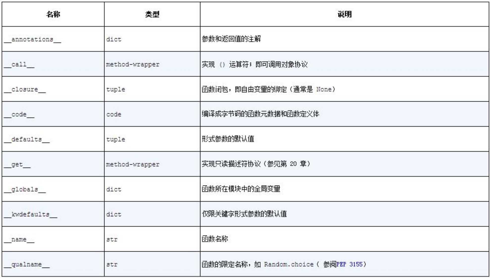

# Python面向对象概念

在Python中，类是面向对象编程（OOP）的核心概念之一，它提供了一种将数据和功能封装在一起的方式。
类(class)把数据与功能绑定在一起。创建新类就是创建新的对象类型，从而创建该类型的新实例。
类实例具有多种保持自身状态的属性。
类实例还支持（由类定义的）修改自身状态的方法。

类（Class）：

* 定义：类是一个蓝图或模板，用于创建具有相同属性和方法的对象。它定义了对象的结构和行为。
* 创建新类：通过定义一个类，你创建了一个新的对象类型（type of object）。这意味着你可以创建该类的多个实例，每个实例都是类的一个具体化，拥有类定义的属性（attributes）和方法（methods）。
* 实例化：创建类的实例的过程称为实例化（instances）。每个实例都拥有自己的属性值，但共享类定义的方法。

类实例（Instance）：

* 属性（Attributes）：在Python中，我们可以把属性称为实例变量。属性是属于每个类实例的变量，用于保持对象的状态。属性可以是基本数据类型、其他对象或任何Python支持的数据类型。
* 方法（Methods）：实例的方法是定义在类中的函数，用于修改实例的状态或执行与实例相关的操作。方法的第一个参数通常是 `self`，它代表实例本身。

Python的类支持所有面向对象编程（OOP）的标准特性：

* 类继承（Class Inheritance）：
      - 多继承：Python支持多继承，即一个类可以继承多个基类。这允许派生类继承多个基类的属性和方法。
      - 基类（Base Classes）：基类是被其他类继承的类。基类可以提供通用的属性和方法，供派生类（derived class）使用和扩展。
* 方法覆盖（Method Overriding）：
      - 派生类可以覆盖基类的方法，以提供特定的实现。当调用派生类实例的方法时，会优先执行派生类中的方法。
* 方法调用：
      - 派生类的方法可以使用 `super()` 函数调用基类中相同名称的方法。这允许在派生类中扩展或修改基类的行为。
* 对象数据的灵活性：
      - 对象可以包含任意数量和类型的数据。Python的动态特性（dynamic nature）允许在运行时为对象添加新的属性和方法。

类和模块的动态性：

* 类和模块都是在运行时创建的，我们可以在程序运行过程中定义新的类和模块。
* 创建后，类和模块也可以被修改。例如，可以在运行时为类添加新的方法或属性，或者修改现有的方法。

在下面示例中，`Animal` 是一个基类，定义了一个通用的 `speak` 方法。`Dog` 和 `Cat` 是派生类，它们覆盖了 `speak` 方法以提供特定的实现。通过继承和方法覆盖，派生类可以扩展基类的功能，同时保持代码的可重用性和组织性

在Python的面向对象编程中，`self` 是一个特殊的参数，用于指向类的实例本身。它在类的方法定义中必须作为第一个参数出现，但在调用方法时不需要显式传递。

当创建一个类的实例并调用其方法时，Python会自动将实例本身作为 `self` 参数传递给方法。如下历我们建了一个 `Dog` 实例 `dog = Dog("Buddy")`，然后调用 `dog.speak()`，Python会将 `dog` 作为 `self` 参数传递给 `Dog` 类的 `speak` 方法。

```python
class Animal:
    # Animal类的构造方法（也称为初始化方法），用于在创建类的实例时初始化对象的状态。
    # self代表新创建的Animal实例，name是传递给构造方法的参数。
    def __init__(self, name):
        self.name = name

    # 抽象方法，用于定义动物的发声行为。
    # 它在基类中没有具体实现，而是要求派生类提供具体的实现。
    # self表示调用speak方法的Animal实例。
    def speak(self):
        raise NotImplementedError("Subclasses must implement this method")


class Dog(Animal):
    # Dog类对speak方法的实现，用于返回狗的叫声。
    # self表示调用speak方法的Dog实例。
    def speak(self):
        return "Woof!"


class Cat(Animal):
    def speak(self):
        return "Meow!"


# 创建类的实例
dog = Dog("Buddy")
cat = Cat("Whiskers")

# 调用实例的方法
print(dog.speak())  # Woof!
print(cat.speak())  # Meow!
```

## 1. 名称Names和对象Objects

在Python中，名称（Names）和对象（Objects）是两个基本概念，对象之间相互独立。

名称（Names）：

* 定义：名称是变量、函数、类等的标识符，用于在代码中引用对象。它们是存储在命名空间中的字符串，指向内存中的对象。
* 作用域：名称存在于特定的作用域内，例如全局作用域、局部作用域或嵌套作用域。作用域决定了名称的可见性和生命周期。
* 绑定：名称通过赋值操作与对象绑定。一个名称可以绑定到不同的对象，也可以有多个名称绑定到同一个对象。

对象（Objects）：

* 定义：对象是Python中一切事物的实例，包括数字、字符串、列表、函数、类等。每个对象都有一个唯一的身份（内存地址）、一组类型信息和一些数据。
* 独立性：对象在内存中独立存在，它们可以被多个名称引用，但对象本身不会因为名称的变化而改变。

名称和对象的关系：

* 别名（Alias）：当多个名称绑定到同一个对象时，这些名称被称为该对象的别名。别名在Python中非常常见，因为Python是动态类型语言，变量的类型可以在运行时改变。
* 内存管理：Python使用引用计数和垃圾回收机制来管理内存。当一个对象的引用计数变为0时，对象会被自动销毁。别名会影响对象的引用计数，因为每个别名都增加了一个引用。
* 传递对象：在Python中，函数参数传递是通过引用传递的。这意味着当你将一个对象作为参数传递给函数时，实际上是传递了对象的引用（类似于指针），而不是对象本身。因此，函数内部对对象的修改会反映到所有引用该对象的地方。

在下面这个示例中，`my_list` 和 `another_list` 是同一个列表对象的两个名称（别名）。当我们通过 `another_list` 修改列表时，`my_list` 也反映了这一更改，因为它们都指向同一个对象。

```python
import sys

# 创建一个列表对象
my_list = [1, 2, 3]

# 创建别名
another_list = my_list

# 修改对象
another_list.append(4)

# 打印两个名称引用的对象
print(my_list)       # [1, 2, 3, 4]
print(another_list)  # [1, 2, 3, 4]

# 查看对象的引用计数
ref_count = sys.getrefcount(my_list)
print(f"Reference count of my_list: {ref_count}")
# 3
```

## 2. 作用域和命名空间

### 2.1 命名空间

命名空间（Namespace）是一个从名称到对象的映射。Python 中的大部分命名空间通过字典实现。命名空间的主要作用是避免命名冲突，确保名称的唯一性。

命名空间的类型：

1. 内置命名空间（Built-in Namespace）：
      * 包含 Python 内置函数和异常（如 `print`、`len`、`TypeError` 等）。
      * 在 Python 解释器启动时创建，程序结束时销毁。
2. 全局命名空间（Global Namespace）：
      * 包含模块级别的变量、函数和类。
      * 在模块被导入时创建，程序结束时销毁。
3. 局部命名空间（Local Namespace）：
      * 包含函数或方法内部的变量、函数和类。
      * 在函数或方法调用时创建，函数或方法返回时销毁。

```python
# 全局命名空间
x = 10  # 全局变量

def foo():
    # 局部命名空间
    y = 20  # 局部变量
    print(x, y)  # 访问全局变量和局部变量

foo()  # 10 20
```

命名空间的特点：

* 独立性：不同命名空间中的名称互不干扰。例如，两个模块中可以定义同名的函数而不会冲突。
* 属性引用：通过点号（`.`）访问对象的属性。例如，`z.real` 中的 `real` 是对象 `z` 的属性。
* 模块命名空间：模块中的全局名称和模块属性共享相同的命名空间。例如，`modname.funcname` 中的 `funcname` 是模块 `modname` 的属性。

### 2.2 作用域

作用域（Scope）是命名空间在程序中的可见范围。Python 中的作用域遵循 **LEGB 规则**：

* L（Local）：局部作用域，包含函数内部的变量。
* E（Enclosing）：嵌套函数的外层函数作用域。
* G（Global）：全局作用域，包含模块级别的变量。
* B（Built-in）：内置作用域，包含 Python 内置名称。

作用域的查找顺序：当访问一个变量时，Python 会按照 **LEGB** 顺序查找：

1. 先在局部作用域（Local）中查找。
2. 如果未找到，则在外层函数作用域（Enclosing）中查找。
3. 如果仍未找到，则在全局作用域（Global）中查找。
4. 如果仍未找到，则在内置作用域（Built-in）中查找。
5. 如果仍未找到，则抛出 `NameError` 异常。

```python
x = 10  # 全局作用域

def outer():
    y = 20  # 外层函数作用域

    def inner():
        z = 30  # 局部作用域
        print(x, y, z)  # 访问全局、外层和局部变量

    inner()

outer()  # 10 20 30
```

### 2.3 `global`和`nonlocal`关键字

* `global`：用于在函数内部修改全局变量。
* `nonlocal`：用于在嵌套函数中修改外层函数的变量。

```python
x = 10  # 全局变量

def outer():
    y = 20  # 外层函数变量

    def inner():
        nonlocal y  # 修改外层函数变量
        global x    # 修改全局变量
        y += 1
        x += 1
        print(x, y)

    inner()

outer()  # 11 21
```

### 2.4 命名空间与作用域的关系

* 命名空间是名称到对象的映射。
* 作用域是命名空间在程序中的可见范围。
* 每个作用域对应一个命名空间。

```python
x = 10  # 全局命名空间

def foo():
    y = 20  # 局部命名空间
    print(x, y)  # 访问全局和局部命名空间

foo()  # 10 20
```

### 2.5 动态名称解析与静态名称解析

* 动态名称解析：Python在运行时动态查找名称。
* 静态名称解析：Python正在向编译时静态名称解析发展，局部变量已经静态确定。

```python
def foo():
    x = 10  # 局部变量
    print(x)

foo()  # 10
```

### 2.6 作用域与命名空间的示例

下面例子展示了局部、非局部和全局变量的行为：

```python
spam = "spam out of func"  # 全局变量

def scope_test():
    spam = "test spam"  # 外层函数变量

    def do_local():
        spam = "local spam"  # 局部变量

    def do_nonlocal():
        nonlocal spam  # 修改外层函数变量
        spam = "nonlocal spam"

    def do_global():
        global spam  # 修改全局变量
        spam = "global spam"

    do_local()
    print("After local assignment:", spam)
    do_nonlocal()
    print("After nonlocal assignment:", spam)
    do_global()
    print("After global assignment:", spam)


scope_test()
print("In global scope:", spam)
# After local assignment: test spam
# After nonlocal assignment: nonlocal spam
# After global assignment: nonlocal spam
# In global scope: global spam
```

总结：

* 命名空间：名称到对象的映射，分为内置、全局和局部命名空间。
* 作用域：命名空间的可见范围，遵循 LEGB 规则。
* `global` 和 `nonlocal`：用于修改全局和外层函数的变量。
* 动态与静态名称解析：Python 在运行时动态查找名称，但局部变量已经静态确定。

## 3. 类（Class）

### 3.1 类定义

类定义通过 `class` 关键字实现。类定义中的语句通常是函数定义（方法），但也可以包含其他语句。

```python
class ClassName:
    <statement-1>
    ...
    <statement-N>
```

类定义例子：

```python
class MyClass:
    i = 12345 # 类对象属性

    # 构造方法，用于初始化类的实例
    def __init__(self, name, data):
        self.name = name  # 实例属性
        self.data = []  # 实例属性

    # 实例方法
    def append(self, value):
        self.data.append(value)

    # 实例方法
    def get_name(self):
        return self.name


# 类对象属性引用
print(MyClass.i)  # 12345
# 实例方法的引用
print(MyClass.append)  # <function MyClass.f at 0x73904bbe79a0>
```

实例方法引用：

* 定义：实例方法是定义在类中的方法，它们的第一个参数通常是 `self`，表示类的实例。实例方法需要通过类的实例来调用。
* 引用方式：当你通过类名访问一个实例方法时（如 `MyClass.append`），你得到的是该方法的函数对象引用。这个引用指向类定义中的方法函数，但它还不是绑定到任何特定实例的方法。
* 调用方式：要调用实例方法，你需要先创建类的实例，然后通过实例来调用该方法。例如：

```python
obj = MyClass("Example", [])
obj.append(10)  # 正确的实例方法调用
```

小结：

* 命名空间：类定义会创建一个新的命名空间，用于存储类变量和方法。
* 类对象：类定义执行后，会创建一个类对象，封装了类命名空间中的内容。
* 类属性引用：通过`ClassName.attribute`访问类属性，如：`MyClass.i`。
* 通过类名`MyClass`访问一个实例方法`append`时（`MyClass.append`），得到的是`append`方法的函数对象引用。这个引用指向类定义中的方法函数，但它还不是绑定到任何特定实例的方法。
* `print(MyClass.append)` 是对类中定义的实例方法的引用，而不是类方法引用。类方法是使用 `@classmethod` 装饰器定义的方法，它们的第一个参数通常是 `cls`，表示类本身。类方法可以通过类名直接调用，也可以通过实例调用。

### 3.2 类对象

类对象支持两种操作：

1. 类对象属性引用：通过`obj.name`访问类属性和方法。
2. 类对象实例化：通过调用类对象创建类的实例。

```python
class MyClass:
    i = 12345 # 类对象属性

    # 构造方法，用于初始化类的实例
    def __init__(self, name, data):
        self.name = name  # 实例属性
        self.data = []  # 实例属性

    # 实例方法
    def append(self, value):
        self.data.append(value)

    # 实例方法
    def get_name(self):
        return self.name


# 类对象属性引用
print(MyClass.i)  # 12345
# 实例方法的引用
print(MyClass.append)  # <function MyClass.f at 0x73904bbe79a0>

# 类MyClass实例化
obj = MyClass("Example", None)
print(obj.data) # []
```

小结：

* 类变量：类变量是类的所有实例共享的属性。
* 实例变量：实例变量是每个实例独有的属性。

### 3.3 实例对象

实例对象支持属性引用，包括数据属性和方法。

在下面的示例中，`obj` 是 `MyClass` 的一个实例。
通过调用 `obj.append(10)` 和 `obj.append(20)`，我们修改了实例的 `data` 属性。同时，我们也可以直接访问实例的 `name` 属性。
这些属性和方法都是与特定实例相关联的，不同的实例将具有不同的属性值。

实例属性（Instance Attributes）：

* `self.name`：这是一个实例属性，用于存储对象的名称。它在 `__init__` 方法中被初始化，并且每个 `MyClass` 的实例都会有自己的 `name` 属性值。
* `self.data`：这是一个实例属性，用于存储与对象相关的数据。它被初始化为一个空列表，并且可以在对象的生命周期内被修改和扩展。

实例方法（Instance Methods）：

* `__init__(self, name, data)`：这是一个特殊的方法，称为构造方法或初始化方法。它在创建类的新实例时自动调用，用于初始化实例的属性。虽然它看起来像一个普通方法，但它实际上用于设置实例的初始状态。
* `append(self, value)`：这是一个普通的实例方法，用于向 `self.data` 列表中添加一个新值。这个方法可以被类的实例调用，以修改实例的状态。

```python
class MyClass:
    i = 12345 # 类对象属性

    # 构造方法，用于初始化类的实例
    def __init__(self, name, data):
        self.name = name  # 实例属性
        self.data = []  # 实例属性

    # 实例方法
    def append(self, value):
        self.data.append(value)

    # 实例方法
    def get_name(self):
        return self.name


# 类对象属性引用
print(MyClass.i)  # 12345
# 实例方法的引用
print(MyClass.append)  # <function MyClass.f at 0x73904bbe79a0>

# 类MyClass实例化
obj = MyClass("Example", None)
print(obj.data) # []

# 使用实例方法 append 向 data 属性中添加数据
obj.append(10)
obj.append(20)

# 访问实例属性
print(obj.name)  # Eobjample
print(obj.data)  # [10, 20]

# 动态添加实例变量
obj.counter = 1
print(obj.counter)  # 1
obj.counter += 1
print(obj.counter)  # 2
```

小结：

* 实例属性：实例变量，不需要声明，第一次赋值时创建。
* 实例方法：实例方法，通过 `self` 参数访问实例变量。

### 3.4 方法对象

方法对象是绑定到实例的函数对象。调用方法时，实例会自动作为第一个参数（`self`）传递。

```python
class MyClass:
    def f(self):
        return 'hello world'

x = MyClass()
print(x.f())  # 输出: hello world
print(MyClass.f(x))  # 输出: hello world
```

小结：

* 绑定方法：实例方法绑定到实例，调用时自动传递 `self`。
* 函数对象：类方法未绑定到实例，调用时需要手动传递实例。

### 3.5 类和实例变量

* 类变量：类的所有实例共享的属性。
* 实例变量：每个实例独有的属性。

```python
class Dog:
    kind = 'canine'  # 类变量

    def __init__(self, name):
        self.name = name  # 实例变量

d = Dog('Fido')
print(d.kind)  # 输出: canine
print(d.name)  # 输出: Fido
```

小结：

* 共享类变量：类变量在所有实例间共享。
* 实例变量优先级：如果实例变量和类变量同名，实例变量优先。

### 3.6 魔术方法

魔术方法是 Python 中特殊的方法，名称前后各有两个下划线（如 `__init__`）。它们在特定情况下自动调用。

```python
class Car:
    def __init__(self, brand):
        self.brand = brand
        print(f"Initialized {self.brand} car")

    def __del__(self):
        print(f"Destroyed {self.brand} car")

bmw = Car('BMW')  # 输出: Initialized BMW car
del bmw  # 输出: Destroyed BMW car
```

小结：

* `__init__`：初始化方法，实例化时调用。
* `__del__`：析构方法，实例销毁时调用。

### 3.7 函数内省

函数内省是指在运行时获取函数的元数据（如参数、注解等）。

```python
def clip(text: str, max_len: 'int > 0' = 80) -> str:
    """截断字符串"""
    end = None
    if len(text) > max_len:
        end = text.rfind(' ', 0, max_len)
    return text[:end].rstrip()

print(clip.__annotations__)
# 输出: {'text': <class 'str'>, 'max_len': 'int > 0', 'return': <class 'str'>}
```

小结：

* `__annotations__`：存储函数的参数和返回值注解。
* `inspect` 模块：用于获取函数的详细信息。

### 3.8 总结

* 类定义：通过 `class` 关键字定义类，类对象支持属性引用和实例化。
* 实例对象：实例对象支持数据属性和方法。
* 魔术方法：特殊方法，在特定情况下自动调用。
* 函数内省：在运行时获取函数的元数据。


## 3. ====类Class====

### 3.1 类定义

类定义（Class Definition）与函数定义 (def 语句) 一样必须被执行才会起作用。

```python
class ClassName:
    <statement-1>
    ...
    <statement-N>
```

在实践中，类定义内的语句通常都是函数定义，但也允许有其他语句。在类内部的函数定义通常具有一种特有形式的参数列表，这是约定的方法规范（conventions for methods）。

编译过程中，进入一个类的内部，将创建一个新的命名空间，一个局部作用域。因此，所有对类内部局部变量的赋值都是在这个新的命名空间之内，包括新定义的函数名称。

当正常离开一个类时，编译过程将创建一个类对象（class object），封装了类定义所创建的命名空间里的内容。

最初的（在进入类定义之前起作用的）局部作用域将重新生效，类对象（class object）将在这里被绑定到类定义头部所声明的类名称 (在上面的示例中是`ClassName`)。

### 3.2 类对象

类对象（Class Objects）支持两种操作：属性引用（attribute references）和实例化（instantiation）。

属性引用（attribute references）使用Python中属性引用的标准语法: `obj.name`。

存在于类命名空间中的所有名称，类对象被创建时同时被创建了，这些就是有效的属性名称。因此，如果类定义是如下所示，那么`MyClass.i`和`MyClass.f`就是有效的属性引用，将分别返回一个整数和一个函数对象。

类属性也可以被赋值，因此可以通过赋值来更改`MyClass.i`的值。`__doc__`也是一个有效的属性，将返回所属类的文档字符串: "A simple example class"。

```python
class MyClass:
    """A simple example class"""
    i = 12345

    def f(self):
        return 'hello world'

print(MyClass.i)
# 12345
print(MyClass.__doc__)
# A simple example class

MyClass.i = 10
print(MyClass.i)
# 10
```

类的实例化（instantiation）使用函数表示法。 可以把类对象（class object）看作是一个不带参数的函数，这个函数返回了该类的一个新实例。

在下面的例子中，`x = MyClass()`创建了`MyClass()`这个类的一个实例，并赋值给局部变量`x`。

实例化操作（调用类对象）会创建一个空对象。许多类会创建带有特定初始状态的自定义实例。为此类定义中需要包含一个名为`__init__()`的特殊方法。

当一个类定义了`__init__()`方法时，类的实例化操作会自动为新创建的类实例调用`__init__()`。 更新上面的例子，注意`__dict__`两次返回的不同的字典。复习一下，在命名空间中提到，`__dict__`是属性但不是全局名称，返回用于实现模块命名空间的字典。

```python
class MyClass:
    """A simple example class"""
    i = 12345

    def f(self):
        return 'hello world'

    def __init__(self):
        self.data = []


x = MyClass()
print(x.__dict__)
# {'data': []}

x.i = 10
print(x.__dict__)
# {'data': [], 'i': 10}
```

`__init__()`方法可以有额外的参数输入，在这种情况下，类实例化的参数将被传递给 `__init__()`。 如下例:

```python
class Complex:

    def __init__(self, realpart, imagpart):
        self.r = realpart
        self.i = imagpart


x = Complex(3.0, -4.5)

print(x.r, x.i)
# 3.0 -4.5
```

### 3.3 实例对象

对实例对象（Instance Objects）唯一的操作是属性引用。有两种有效的属性名称：数据属性（data attributes）和方法（methods）。

数据属性（data attributes）类似于实例变量，数据属性不需要声明。像局部变量一样，数据属性将在第一次被赋值时产生。 例如，如果`x`是上面创建的`MyClass`的实例，则以下代码段将打印数值`16`，且没有留下关于`x.counter`的痕迹。

```python
class MyClass:
    """A simple example class"""
    i = 12345

    def f(self):
        return 'hello world'

    def __init__(self):
        self.data = []


x = MyClass()

x.counter = 1

while x.counter < 10:
    x.counter = x.counter * 2

print(x.counter)
# 16

print(x.__dict__)
# {'data': [], 'counter': 16}

del x.counter
print(x.__dict__)
# {'data': []}
```

另一类实例属性引用称为**方法（methods）**。 方法是隶属于对象的**函数**。

在Python中，方法这个术语并不是类实例所特有的，其他对象也可以有方法。 例如，列表对象（list objects）具有append, insert, remove, sort等方法。

*在以下讨论中，我们使用方法一词将专指类实例对象的方法，除非另外明确说明。*

实例对象的有效方法名称依赖于其所属的类。 根据定义，一个类定义中所包含的所有函数对象（function objects）都称为属性。

因此在上面的示例中，`x.f`是有效的方法引用，因为`MyClass.f`是一个函数，而`x.i`不是方法，因为`MyClass.i`不是函数。但是`x.f`与`MyClass.f`并不是一回事，`x.f`是一个**方法对象**，而`MyClass.f`是一个**函数对象**。差别在于`f()`是否与实例绑定，未绑定，就是函数，绑定，就是方法。

```python
class MyClass:
    """A simple example class"""
    i = 12345

    def f(self):
        return 'hello world'

    def __init__(self):
        self.data = []


x = MyClass()

print(MyClass.f(0))
# hello world
print(x.f())
# hello world

print(MyClass.f)
# <function MyClass.f at 0x7ff9368b3488>
print(x.f)
# <bound method MyClass.f of <__main__.MyClass object at 0x7ff9368acbe0>>

print(type(MyClass.f))
# <class 'function'>
print(type(x.f))
# <class 'method'>
```

这里做个小结：

* 函数(function)是Python中一个可调用对象(callable), 方法(method)是一种特殊的函数。
* 一个可调用对象是方法和函数，和这个对象无关，仅和这个对象是否与类或实例绑定有关（bound method）。
* 静态方法没有和任何类或实例绑定，所以**静态方法是个函数**。

### 3.4 方法对象

在`MyClass`示例中，`x.f()`是一个方法对象（Method Objects），被调用后，将返回字符串`'hello world'`。可以立即调用，也可以保存起来以后再调用`xf = x.f`。

虽然`f()`的函数定义指定了一个参数，但上面例子中调用`x.f()`时并没有带参数，也没有引发异常报错。原因在于，方法(method)的特殊之处就在于实例对象会作为函数的第一个参数被传入。
调用`x.f()`其实就相当于`MyClass.f(x)`。
总之，调用一个具有`n`个参数的方法(method)就相当于调用再多一个参数的对应函数，这个参数值为方法所属实例对象，**位置在其他参数之前**。

当一个实例的非数据属性被引用时，将搜索实例所属的类。
如果被引用的属性名称是类中一个有效的函数对象，则会创建一个抽象的对象，通过打包（parking，即指向）匹配到的实例对象和函数对象，这个抽象对象就是方法对象。
当带参数调用方法对象时，将基于实例对象和参数列表构建一个新的参数列表，并使用这个新参数列表调用相应的函数对象。

### 3.5 类和实例变量

一般来说，实例变量（Instance Variables）用于每个实例的唯一数据，而类变量（Class Variables）用于类的所有实例共享的属性和方法:

```python
class Dog:

    kind = 'canine'  # class variable shared by all instances

    def __init__(self, name):
        self.name = name  # instance variable unique to each instance

d = Dog('Fido')
e = Dog('Buddy')

print(d.kind)  # shared by all dogs
# 'canine'

print(e.kind)  # shared by all dogs
# 'canine'

print(d.name) # unique to d instance
# 'Fido'

print(e.name) # unique to e instance
# 'Buddy'
```

下代码中的`tricks`列表不应该被用作类变量，因为所有的`Dog`实例将只共享一个单独的列表:

```python
class Dog:

    kind = 'canine'  # class variable shared by all instances

    tricks = []  # mistaken use of a class variable

    def __init__(self, name):
        self.name = name  # instance variable unique to each instance

    def add_trick(self, trick):
        self.tricks.append(trick)


d = Dog('Fido')
e = Dog('Buddy')

d.add_trick('roll over')
e.add_trick('play dead')

print(d.tricks)
# ['roll over', 'play dead']
```

正确的类设计应该使用实例变量:

```python
class Dog:

    kind = 'canine'  # class variable shared by all instances

    def __init__(self, name):
        self.name = name  # instance variable unique to each instance
        self.tricks = []    # creates a new empty list for each dog

    def add_trick(self, trick):
        self.tricks.append(trick)


d = Dog('Fido')
e = Dog('Buddy')

d.add_trick('roll over')
e.add_trick('play dead')

print(d.tricks)
# ['roll over']

print(e.tricks)
# ['play dead']
```

如果同样的属性名称同时出现在实例和类中，则属性查找会**优先选择实例**:

```python
class Warehouse:
    purpose = 'storage'
    region = 'west'

w1 = Warehouse()
print(w1.purpose, w1.region)
# storage west

w2 = Warehouse()
w2.region = 'east'  # Instance W2 has higher priority than class
print(w2.purpose, w2.region)
# storage east
```

数据属性（Data attributes）可以被方法（method）以及一个对象的普通用户（ordinary users）（“客户端Client”）所引用。 换句话说，类不能用于实现纯抽象数据类型。

方法的第一个参数常常被命名为`self`，这只是一个约定: `self`这一名称在Python中没有特殊含义。 但是遵循此约定会使得代码具有很好的可读性。

任何一个作为类属性（class attribute）的函数对象（function object）都为该类的实例定义了一个相应方法。

函数定义的文本并非必须包含于类定义之内：将一个函数对象赋值给一个局部变量也是可以的。如下例。现在`f`,`g`和`h`都是类`C`的引用函数对象的属性，因而它们就都是类`C`的实例的方法，其中`h`完全等同于`g`。但请注意，下面这个例子的可读性非常不好。

```python
# Function defined outside the class
def f1(self, x, y):
    return min(x, x + y)


class C:
    f = f1  # Assign a function object to a local variable in the class

    def g(self):
        return 'hello world'

    h = g
```

方法（methods）可以通过使用`self`参数的方法属性（method attributes）调用其他方法（method）:

```python
class Bag:

    def __init__(self):
        self.data = []

    def add(self, x):
        self.data.append(x)

    def addtwice(self, x):
        self.add(x)
        self.add(x)
```

方法可以通过与普通函数相同的方式引用全局名称。
与方法相关联的全局作用域就是包含其定义的模块。 （类永远不会被作为全局作用域。）

虽然我们很少会有充分的理由在方法中使用全局作用域，但全局作用域存在许多合理的使用场景：举个例子，导入到全局作用域的函数和模块可以被方法所使用，在其中定义的函数和类也一样。
通常，包含该方法的类本身是在全局作用域中定义的。

### 3.6 总结

#### 类定义小结

* 一个类定义类成员属性和成员方法。
* 一个类可以实例化多个对象，每个实例化对象都是独立的。
* 创建的类实例化对象，会引用父类中的属性和方法，并不会把类的属性和方法复制给对象，因此：在访问实例化对象的属性和方法时，会先去找对象自己的属性和方法，然后再去实例化这个对象的类中查找（引用）。
* 对象成员的添加和修改，都只会影响当前对象自己，不会影响类和其它对象。
* 删除对象成员的时候，必须是该对象自己具备的成员才可以，不能删除类中引用的成员。
* 对类成员的操作，会影响这个类创建的对象，包括之前创建的对象（引用）。

#### 类成员操作（不推荐）

成员属性：

* 访问：`ClassName.AttributeName`
* 修改：`ClassName.AttributeName = NewValue`，等于给这个类对象创建了一个自己的属性，通过这个类创建的对象都具有这个属性。
* 添加：`ClassName.NewAttributeName = Value`，等于给这个类对象创建了一个自己的属性，通过这个类创建的对象都具有这个属性。
* 删除：`del ClassName.AttributeName`，注意，只能删除类对象自己的属性，通过这个类创建的对象都不再具有这个属性。

成员方法：

* 访问：`ClassName.MethodName()`
* 修改：`ClassName.MethodName = NewFunction`，等于给这个类对象创建了一个自己的方法，通过这个类创建的对象都具有这个方法。
* 添加：`ClassName.MethodName = Function`，等于给这个类对象创建了一个自己的方法，通过这个类创建的对象都具有这个方法。
* 删除：`del ClassName.MethodName`，注意，只能删除类对象自己的方法，通过这个类创建的对象都不再具有这个方法。

#### 成员方法中的self

`self`只是一个形参，不是关键字。
`self`在方法（method）代表当前对象自己。前面提到过，方法的第一个参数常常被命名为`self`，这只是一个约定。
可以使用`self`在类内部操作成员（添加、修改、删除等）。

方法的分类：

* 含有self或者可以接受对象作为参数的方法，称为**非绑定类方法**，非绑定类的方法可以使用对象去访问。
* 不含有self或者不能接受对象作为参数的方法，称为**绑定类方法**，绑定方法只能使用类去访问。

### 3.7 魔术方法

魔术方法（Magic Method）和普通方法一样，都是类中定义的成员方法。
魔术方法名称前后各有2个下划线，比如 `__init__`
魔术方法是不需要手动调用的，会在某种情况下自动触发（自动执行）。
魔术方法是系统定义好的，不是用户定义的。

#### `__init__`初始化方法，也称作**构造方法**

类实例化对象创建后自动触发。

`__init__`初始化方法可以用来在对象实例化后完成对象的初始化，比如属性赋值，方法调用等。

#### `__del__`**析构方法**

类实例化对象被销毁时自动触发。

`__del__`析构方法可以在销毁对象时完成一些特殊任务，关闭对象打开的一些资源，如文件等。

注意，是对象被销毁时触发了析构方法，而不是这个析构方法销毁了对象。

对象销毁的情况：

* 当程序执行完毕，销毁和释放内存中的资源。
* 使用`del`删除时。
* 对象不再被任何对象引用时，会自动销毁。

看下面的例子，对比`bmw = Car('BMW')`和`Car('BMW')`来理解`init`和`del`的触发机制。

编辑文件`file1.py`

```python
class Car():
    brand = ""

    def __init__(self, car_brand):
        self.brand = car_brand
        print(f"initial method called, create {self.brand} car")

    def __del__(self):
        print(f"delete method called, destroy {self.brand} car")


bmw = Car('BMW')
vw = Car('VW')
```

执行上面的代码`python3 file1.py`得到如下输出，在程序执行完毕时，依次执行`__del__`。

```python
    initial method called, create BMW car
    initial method called, create VW car
    delete method called, destroy BMW car
    delete method called, destroy VW car
```

编辑文件`file2.py`

```python
class Car():
    brand = ""

    def __init__(self, car_brand):
        self.brand = car_brand
        print(f"initial method called, create {self.brand} car")

    def __del__(self):
        print(f"delete method called, destroy {self.brand} car")


Car('BMW')
Car('VW')
```

执行上面的代码`python3 file2.py`得到如下输出：

```python
    initial method called, create BMW car
    delete method called, destroy BMW car
    initial method called, create VW car
    delete method called, destroy VW car
```

### 3.8 Python函数内省

从魔术方法可以延申到Python的函数内省，函数内省的意思是说，当你拿到一个“函数对象”的时候，你可以继续知道，它的名字，参数定义等信息。这些信息可以通过函数对象的属性（一些双下划线的魔法方法）得到。简言之，内省是在运行时确定对象类型的能力。

下面的例子列出了常规对象没有而函数有的属性。

```python
class C: 
    pass

obj = C()

def func():
    pass

sorted(set(dir(obj)) - set(dir(func)))
# ['__weakref__']

sorted(set(dir(func)) - set(dir(obj)))
# ['__annotations__', '__call__', '__closure__', '__code__', '__defaults__', '__get__', '__globals__', '__kwdefaults__', '__name__', '__qualname__']
```

下表总结了用户定义的函数的属性。



下面的例子是演示了在指定长度附近截断字符串的函数，以及提取关于函数参数的信息的方法。

参数名称在`__code__.co_varnames`中，但这里面也包含函数定义体中创建的局部变量。因此，参数名称是前`N`个字符串，`N`的值由`__code__.co_argcount`确定，例子里面N是2，即参数名称是`text`和`max_len`，局部变量是`end`、`space_before`、`space_after`。

```python
def clip(text, max_len=80):
    """
    Get sub-string by the first blank before or after specified position.
    rfind() 返回字符串最后一次出现的位置，如果没有匹配项则返回 -1.
    """
    end = None

    if len(text) > max_len:
        space_before = text.rfind(' ', 0, max_len)

        if space_before >= 0:
            end = space_before
    else:
        space_after = text.rfind(' ', max_len)

        if space_after >= 0:
            end = space_after
    
    if end is None:
        end = len(text)
    
    return text[:end].rstrip()


clip('This is the string', max_len=10)
# 'This is'

clip.__defaults__
# (80,)

clip.__code__
# <code object clip at 0x7f1e04a5c8a0, file "<stdin>", line 1>

clip.__code__.co_varnames
# ('text', 'max_len', 'end', 'space_before', 'space_after')

clip.__code__.co_argcount
# 2

clip.__doc__
# '\n    Get sub-string by the first blank before or after specified position.\n    rfind() 返回字符串最后一次出现的位置，如果没有匹配项则返回 -1.\n    '
```

上例中，参数的默认值只能通过它们在`__defaults__`元组中的位置确定，因此要从后向前扫描才能把参数和默认值对应起来，有些不合理。引入`inspect`模块后，上面的操作就更容易了。

`inspect.signature`函数返回一个`inspect.Signature`对象，它有一个`parameters`属性，这是一个有序映射，把参数名和`inspect.Parameter`对象对应起来。各个`Parameter`属性也有自己的属性，例如`name`、`default`和`kind`。

```python
from inspect import signature

sig = signature(clip)

type(sig)
# <class 'inspect.Signature'>
print(sig)
# (text, max_len=80)
print(str(sig))
# (text, max_len=80)

for name, param in sig.parameters.items():
    print(f'{param.kind} : {name} = {param.default}')

# 1 : text = <class 'inspect._empty'>
# 1 : max_len = 80
```

函数注解。

Python 3 提供了一种句法，用于为函数声明中的参数和返回值附加元数据。对上例添加注解后如下所示，二者唯一的区别在第一行。

函数声明中的各个参数可以在:之后增加注解表达式。
如果参数有默认值，注解放在参数名和`=`号之间。
如果想注解返回值，在)和函数声明末尾的`:`之间添加`->`和一个表达式。那个表达式可以是任何类型。
注解中最常用的类型是类（如`str`或`int`）和字符串（如'int > 0'）。在下例中，max_len参数的注解用的是字符串。

注解不会做任何处理，只是存储在函数的`__annotations__`属性（一个字典）中。换句话说，注解对Python解释器没有任何意义。**注解只是元数据**，可以供IDE、框架和装饰器等工具使用。

`return`键保存的是返回值注解，即下例中函数声明里以`->`标记的部分。

```python
def clip(text:str, max_len:'int > 0'=80) -> str:
    """
    Get sub-string by the first blank before or after specified position.
    rfind() 返回字符串最后一次出现的位置，如果没有匹配项则返回 -1.
    """
    end = None

    if len(text) > max_len:
        space_before = text.rfind(' ', 0, max_len)

        if space_before >= 0:
            end = space_before
    else:
        space_after = text.rfind(' ', max_len)

        if space_after >= 0:
            end = space_after
    
    if end is None:
        end = len(text)
    
    return text[:end].rstrip()


clip('This is the string', max_len=10)
# 'This is'

clip.__annotations__
# {'text': <class 'str'>, 'max_len': 'int > 0', 'return': <class 'str'>}
```

`signature`函数返回一个`Signature`对象，它有一个`return_annotation`属性和一个`parameters`属性，后者是一个字典，把参数名映射到`Parameter`对象上。每个`Parameter`对象自己也有`annotation`属性。

```python
from inspect import signature

sig = signature(clip)

print(sig.return_annotation)
# <class 'str'>

for param in sig.parameters.values():
    note = repr(param.annotation).ljust(13)
    print(f'{note} : {param.name} = {param.default}')

# <class 'str'> : text = <class 'inspect._empty'>
# 'int > 0'     : max_len = 80
```
